# 数据库架构概览

<cite>
**本文引用的文件**
- [backend/app/core/database.py](file://backend/app/core/database.py)
- [backend/app/core/transaction.py](file://backend/app/core/transaction.py)
- [backend/app/core/config.py](file://backend/app/core/config.py)
- [backend/app/core/query_optimizer.py](file://backend/app/core/query_optimizer.py)
- [backend/app/core/database_indexes.py](file://backend/app/core/database_indexes.py)
- [backend/app/models/base.py](file://backend/app/models/base.py)
- [backend/alembic/env.py](file://backend/alembic/env.py)
- [backend/app/services/backup_service.py](file://backend/app/services/backup_service.py)
- [backend/app/services/database_health_service.py](file://backend/app/services/database_health_service.py)
- [backend/app/core/pii_crypto.py](file://backend/app/core/pii_crypto.py)
</cite>

## 目录
1. [简介](#简介)
2. [项目结构](#项目结构)
3. [核心组件](#核心组件)
4. [架构总览](#架构总览)
5. [详细组件分析](#详细组件分析)
6. [依赖关系分析](#依赖关系分析)
7. [性能考量](#性能考量)
8. [故障排查指南](#故障排查指南)
9. [结论](#结论)
10. [附录](#附录)

## 简介
本文件面向开发者与运维人员，系统性阐述乡村振兴系统的数据库架构与设计理念。系统采用 SQLite 作为默认存储引擎，结合 SQLAlchemy ORM、Alembic 迁移、连接池与 PRAGMA 调优，提供高并发读、可控写、可观测与可恢复的数据层能力。文档覆盖：ORM 框架选择、连接池配置、事务管理策略；数据库初始化流程、迁移管理与版本控制；数据访问层设计模式、查询优化与性能调优；安全配置（含加密）、备份恢复机制与监控告警设置；并提供架构图与数据流向说明，帮助理解整体数据存储架构。

## 项目结构
后端数据库相关代码主要分布在以下模块：
- 核心数据库与连接：core/database.py
- 事务与批量操作：core/transaction.py
- 配置中心：core/config.py
- 查询优化与慢查询追踪：core/query_optimizer.py
- 索引管理与统计：core/database_indexes.py
- 模型基类与字段类型：models/base.py
- 迁移环境：alembic/env.py
- 备份与恢复：services/backup_service.py
- 健康检查与监控：services/database_health_service.py
- 敏感信息透明加密：core/pii_crypto.py

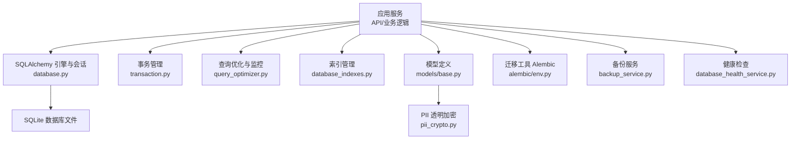

图表来源
- [backend/app/core/database.py:55-67](file://backend/app/core/database.py#L55-L67)
- [backend/app/core/transaction.py:48-197](file://backend/app/core/transaction.py#L48-L197)
- [backend/app/core/query_optimizer.py:23-49](file://backend/app/core/query_optimizer.py#L23-L49)
- [backend/app/core/database_indexes.py:59-95](file://backend/app/core/database_indexes.py#L59-L95)
- [backend/app/models/base.py:19-20](file://backend/app/models/base.py#L19-L20)
- [backend/alembic/env.py:45-103](file://backend/alembic/env.py#L45-L103)
- [backend/app/services/backup_service.py:74-118](file://backend/app/services/backup_service.py#L74-L118)
- [backend/app/services/database_health_service.py:16-40](file://backend/app/services/database_health_service.py#L16-L40)
- [backend/app/core/pii_crypto.py:23-57](file://backend/app/core/pii_crypto.py#L23-L57)

章节来源
- [backend/app/core/database.py:1-158](file://backend/app/core/database.py#L1-L158)
- [backend/app/core/config.py:80-104](file://backend/app/core/config.py#L80-L104)

## 核心组件
- 数据库引擎与会话：基于 SQLAlchemy create_engine 与 sessionmaker，针对 SQLite 启用 WAL、PRAGMA 调优、连接池参数与事件监听。
- 事务管理：提供上下文管理器、装饰器、保存点、死锁重试与批量操作工具，统一提交/回滚与异常处理。
- 查询优化：分页、慢查询追踪、N+1 检测、查询计数等。
- 索引管理：启动时校验并创建额外索引，支持删除与分析统计。
- 模型基类：声明式 Base、时间戳混入、软删除混入、乐观锁版本号、PII 透明加密类型。
- 迁移管理：Alembic 在线/离线模式，兼容旧版列补齐机制，确保 autogenerate 正确识别完整表结构。
- 备份恢复：全量/增量备份、压缩、AES 加密、完整性校验与路径解析。
- 健康检查：周期性完整性检查、快速检查、VACUUM 维护与指标统计。
- 安全加密：SQLCipher 数据库级加密探测与密钥校验；PII 字段级确定性 AES-SIV 加密。

章节来源
- [backend/app/core/database.py:55-158](file://backend/app/core/database.py#L55-L158)
- [backend/app/core/transaction.py:48-197](file://backend/app/core/transaction.py#L48-L197)
- [backend/app/core/query_optimizer.py:23-177](file://backend/app/core/query_optimizer.py#L23-L177)
- [backend/app/core/database_indexes.py:14-95](file://backend/app/core/database_indexes.py#L14-L95)
- [backend/app/models/base.py:19-185](file://backend/app/models/base.py#L19-L185)
- [backend/alembic/env.py:45-103](file://backend/alembic/env.py#L45-L103)
- [backend/app/services/backup_service.py:74-200](file://backend/app/services/backup_service.py#L74-L200)
- [backend/app/services/database_health_service.py:16-200](file://backend/app/services/database_health_service.py#L16-L200)
- [backend/app/core/pii_crypto.py:23-94](file://backend/app/core/pii_crypto.py#L23-L94)

## 架构总览
系统数据流从 API/服务层进入，通过 SQLAlchemy 会话访问 SQLite 数据库。WAL 模式提升并发读性能，长事务写入通过独占协调器避免 SQLITE_BUSY。事务层封装提交/回滚与重试策略。查询层提供分页、慢查询与 N+1 检测。索引在启动时校验并补建。迁移由 Alembic 统一管理，并与旧版列补齐机制共存。备份服务负责全量/增量备份与加密，健康检查服务定期执行完整性检查与维护任务。

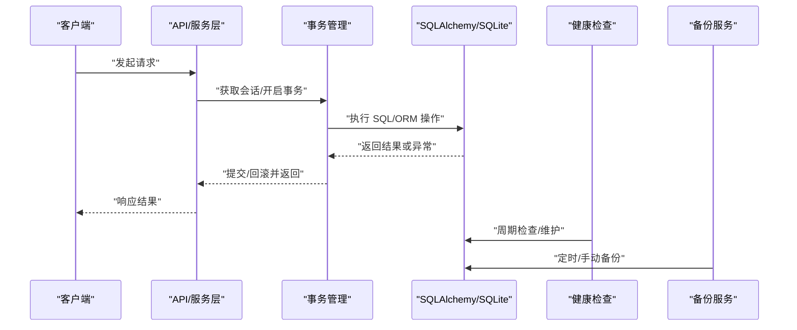

图表来源
- [backend/app/core/transaction.py:48-197](file://backend/app/core/transaction.py#L48-L197)
- [backend/app/core/database.py:55-158](file://backend/app/core/database.py#L55-L158)
- [backend/app/services/database_health_service.py:80-133](file://backend/app/services/database_health_service.py#L80-L133)
- [backend/app/services/backup_service.py:74-118](file://backend/app/services/backup_service.py#L74-L118)

## 详细组件分析

### 数据库引擎与连接池（SQLite 深度优化）
- 引擎创建：使用 QueuePool 限制连接数，避免过多连接导致文件锁竞争；启用 pool_pre_ping、pool_recycle、pool_timeout 等参数。
- PRAGMA 调优：连接建立时自动设置 journal_mode=WAL、foreign_keys=ON、synchronous=NORMAL、busy_timeout=10000、cache_size/mmap_size/temp_store、wal_autocheckpoint、automatic_index。
- 连接关闭优化：执行 PRAGMA optimize 以改善查询计划。
- 写入协调器：提供 exclusive_write 上下文管理器，用于长事务/大批量导入的独占写，避免 SQLITE_BUSY；保留队列兼容旧接口。
- 磁盘空间检查：提供最小剩余空间检查，便于备份前校验。

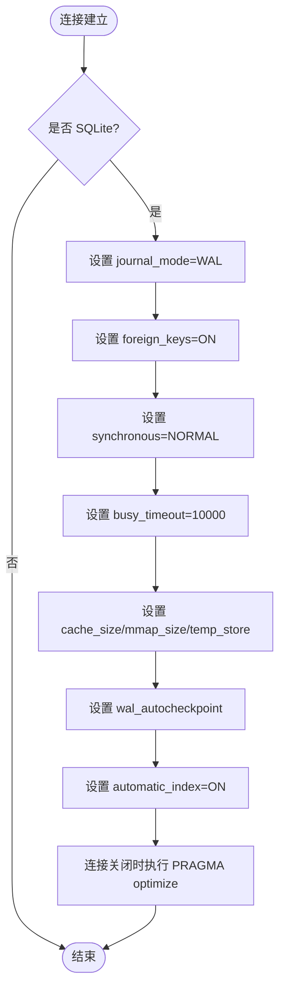

图表来源
- [backend/app/core/database.py:78-158](file://backend/app/core/database.py#L78-L158)
- [backend/app/core/database.py:160-172](file://backend/app/core/database.py#L160-L172)

章节来源
- [backend/app/core/database.py:55-158](file://backend/app/core/database.py#L55-L158)
- [backend/app/core/database.py:198-289](file://backend/app/core/database.py#L198-L289)
- [backend/app/core/database.py:292-343](file://backend/app/core/database.py#L292-L343)

### 事务管理策略
- 上下文管理器：transaction(db) 统一提交/回滚，捕获 HTTPException 与通用异常，记录日志并抛出标准化错误。
- 装饰器：@transactional 自动发现 Session 并包裹事务；@with_transaction 支持隔离级别与只读事务（非 SQLite 生效）。
- 嵌套事务与保存点：nested_transaction/savepoint 提供细粒度回滚点。
- 安全提交：safe_commit 替代裸 commit，失败时自动 rollback 并记录日志。
- 死锁重试：retry_on_deadlock 对包含 deadlock/lock 的异常进行有限次重试。
- 批量操作：BatchOperation 提供批量插入/更新/删除，分批次 flush 与提交，避免内存压力。

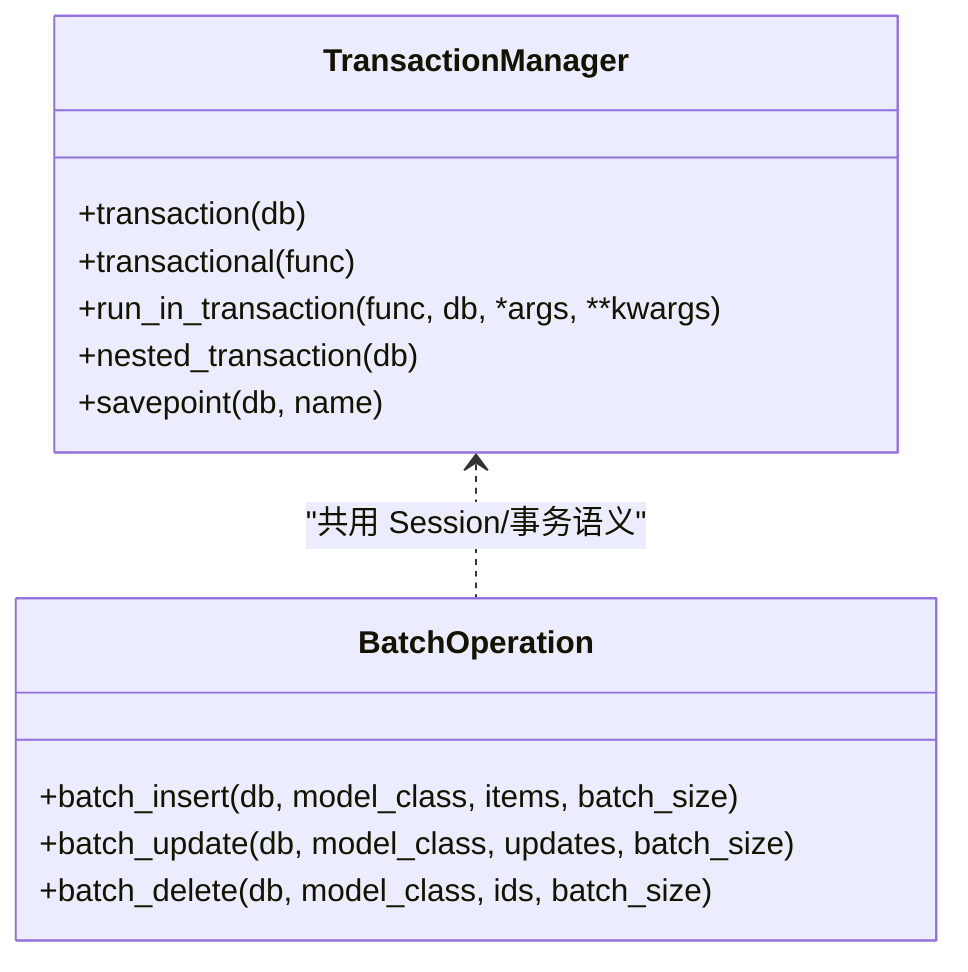

图表来源
- [backend/app/core/transaction.py:48-197](file://backend/app/core/transaction.py#L48-L197)
- [backend/app/core/transaction.py:365-457](file://backend/app/core/transaction.py#L365-L457)

章节来源
- [backend/app/core/transaction.py:48-197](file://backend/app/core/transaction.py#L48-L197)
- [backend/app/core/transaction.py:200-234](file://backend/app/core/transaction.py#L200-L234)
- [backend/app/core/transaction.py:292-362](file://backend/app/core/transaction.py#L292-L362)
- [backend/app/core/transaction.py:365-457](file://backend/app/core/transaction.py#L365-L457)

### 查询优化与监控
- 分页：paginate(query, page, page_size, max_page_size) 限制最大页大小，防止过大查询。
- 慢查询追踪：track_query(label, query_fn, threshold_ms) 记录耗时并输出警告；get_slow_queries(limit) 返回最近慢查询。
- N+1 检测：analyze_n_plus_one(threshold) 装饰器统计方法内查询次数，超过阈值发出警告。
- 查询计数：get_query_count/reset_query_count 配合中间件统计每线程查询次数。

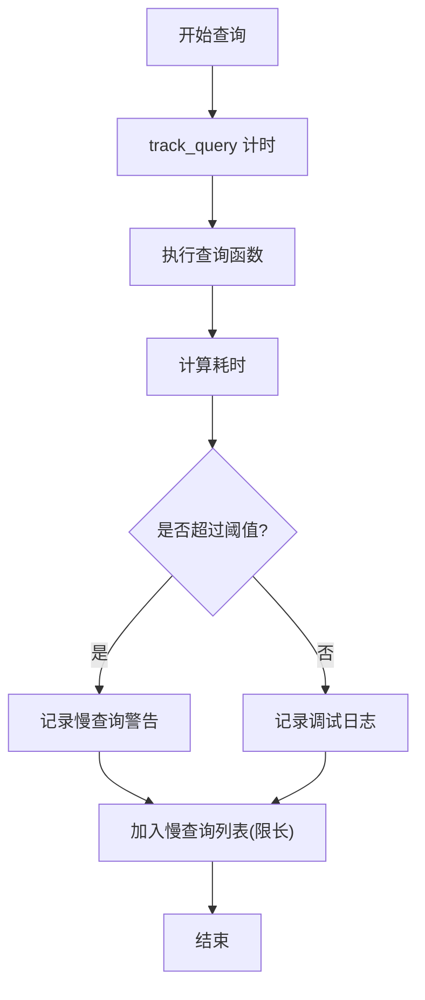

图表来源
- [backend/app/core/query_optimizer.py:23-49](file://backend/app/core/query_optimizer.py#L23-L49)
- [backend/app/core/query_optimizer.py:57-108](file://backend/app/core/query_optimizer.py#L57-L108)
- [backend/app/core/query_optimizer.py:137-177](file://backend/app/core/query_optimizer.py#L137-L177)

章节来源
- [backend/app/core/query_optimizer.py:23-177](file://backend/app/core/query_optimizer.py#L23-L177)

### 索引管理与统计
- 额外索引：EXTRA_INDEXES 列出关键表的常用过滤/排序/外键列索引，启动时通过 CREATE INDEX IF NOT EXISTS 幂等创建。
- 列存在性校验：创建前验证列是否存在，缺失则跳过并记录警告。
- 删除与分析：drop_indexes 删除索引；analyze_table_stats 执行 ANALYZE 并收集各表行数统计。

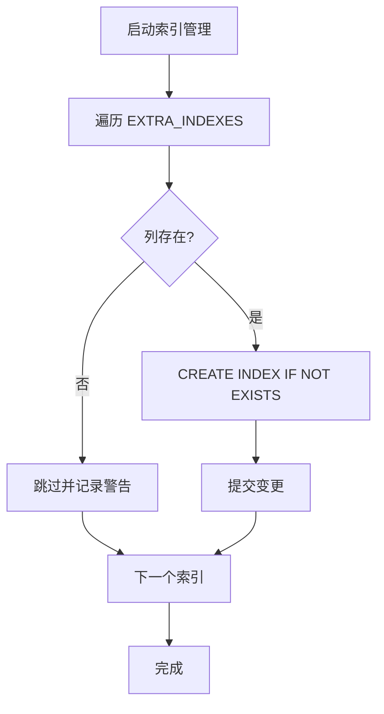

图表来源
- [backend/app/core/database_indexes.py:14-46](file://backend/app/core/database_indexes.py#L14-L46)
- [backend/app/core/database_indexes.py:59-95](file://backend/app/core/database_indexes.py#L59-L95)
- [backend/app/core/database_indexes.py:121-148](file://backend/app/core/database_indexes.py#L121-L148)

章节来源
- [backend/app/core/database_indexes.py:14-148](file://backend/app/core/database_indexes.py#L14-L148)

### 模型基类与字段类型
- 声明式 Base：declarative_base() 作为所有模型基类。
- 时间戳混入：TimestampMixin 提供 created_at/updated_at/sync_version，并在 UPDATE 前自动递增 sync_version，支撑增量同步。
- 软删除混入：SoftDeleteMixin 提供 is_deleted/deleted_at/deleted_by 与 soft_delete/restore 方法，兼容历史 is_active 命名。
- 乐观锁版本号：VersionMixin 提供 version 字段。
- BaseModel：组合 id + 时间戳，提供 to_dict(camel_case) 转换。
- PII 透明加密：EncryptedText TypeDecorator 使用 AES-SIV 确定性加密，读写透明，支持历史明文兼容。

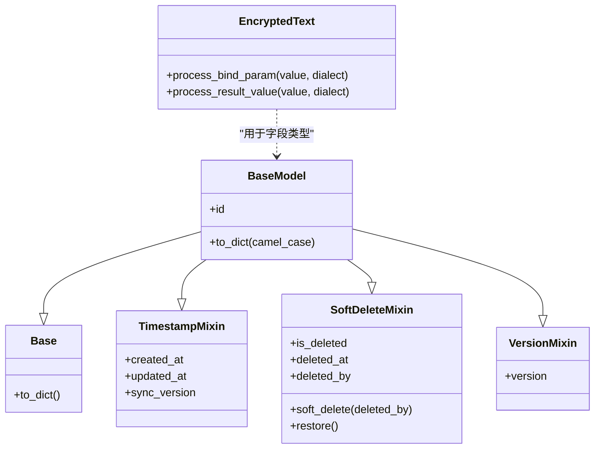

图表来源
- [backend/app/models/base.py:19-20](file://backend/app/models/base.py#L19-L20)
- [backend/app/models/base.py:65-106](file://backend/app/models/base.py#L65-L106)
- [backend/app/models/base.py:108-148](file://backend/app/models/base.py#L108-L148)
- [backend/app/models/base.py:150-185](file://backend/app/models/base.py#L150-L185)
- [backend/app/models/base.py:23-46](file://backend/app/models/base.py#L23-L46)

章节来源
- [backend/app/models/base.py:19-185](file://backend/app/models/base.py#L19-L185)

### 迁移管理与版本控制
- Alembic 环境：读取 DATABASE_URL，目标元数据为 Base.metadata；离线模式生成 SQL，在线模式直接执行。
- 兼容旧机制：在 autogenerate 前运行 _migrate_missing_columns 补齐缺失列，避免重复 DDL。
- 批处理模式：render_as_batch=True 适配 SQLite 的 ALTER 限制。
- 日志配置：仅在 CLI 独立运行时加载 fileConfig，避免重置应用日志。

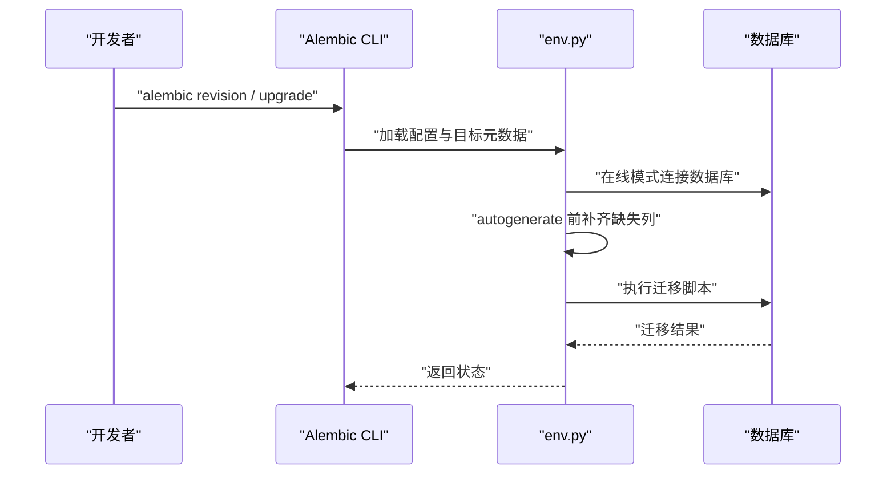

图表来源
- [backend/alembic/env.py:45-103](file://backend/alembic/env.py#L45-L103)

章节来源
- [backend/alembic/env.py:1-110](file://backend/alembic/env.py#L1-L110)

### 备份恢复机制
- 备份服务：BackupService 支持全量/增量备份、压缩级别配置、AES-256 加密、完整性校验与路径解析。
- 路径解析：优先从当前会话绑定 URL 解析真实数据库路径，兜底到路径工具；上传目录同样动态解析。
- 加密与解密：PBKDF2 派生密钥，Fernet 加密/解密；检测标记头判断是否加密格式。
- 最小空间阈值：手动备份/上传恢复前检查最低剩余空间（默认 500MB），避免空间不足导致失败。

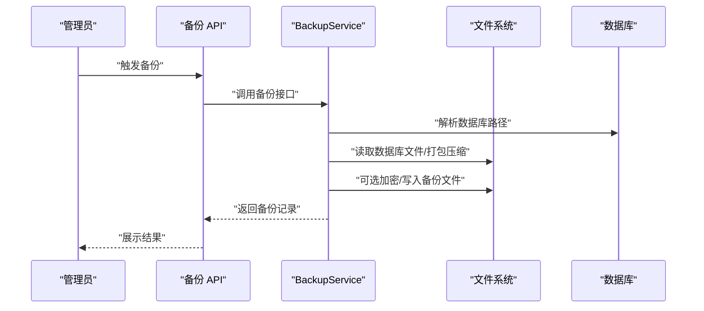

图表来源
- [backend/app/services/backup_service.py:74-118](file://backend/app/services/backup_service.py#L74-L118)
- [backend/app/services/backup_service.py:141-200](file://backend/app/services/backup_service.py#L141-L200)

章节来源
- [backend/app/services/backup_service.py:1-200](file://backend/app/services/backup_service.py#L1-L200)

### 监控告警与健康检查
- 健康检查服务：DatabaseHealthService 周期性执行完整性检查、快速检查与 VACUUM 维护；记录统计信息与健康状态。
- 监控开关：支持启停监控线程，使用 Event 立即唤醒停止。
- 指标与告警：配置项包含 METRICS_ENABLED/METRICS_PORT、HEALTH_CHECK_ENABLED、ALERT_* 系列告警通道（邮件、Webhook）。

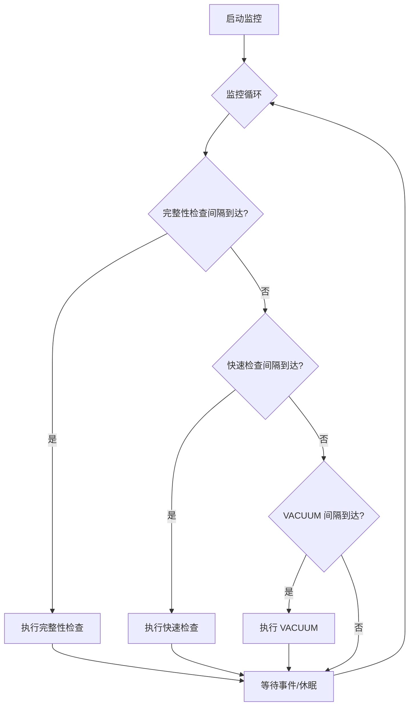

图表来源
- [backend/app/services/database_health_service.py:80-133](file://backend/app/services/database_health_service.py#L80-L133)
- [backend/app/services/database_health_service.py:135-200](file://backend/app/services/database_health_service.py#L135-L200)

章节来源
- [backend/app/services/database_health_service.py:16-200](file://backend/app/services/database_health_service.py#L16-L200)
- [backend/app/core/config.py:185-199](file://backend/app/core/config.py#L185-L199)

### 安全配置与加密
- 数据库级加密：SQLCipher 探测与密钥校验，确保启用加密时驱动与密钥文件有效；否则拒绝启动。
- 字段级加密：EncryptedText 使用 AES-SIV 确定性加密，支持历史明文兼容；密钥可从 ENCRYPTION_KEY 或运行时密钥存储加载。
- 安全基线：CSRF 默认启用、密码强度与有效期、Token 有效期收窄至 8 小时、账户锁定策略等。

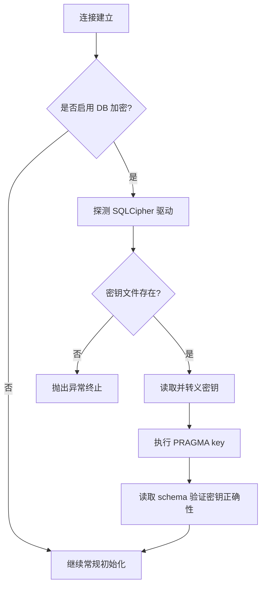

图表来源
- [backend/app/core/database.py:89-131](file://backend/app/core/database.py#L89-L131)
- [backend/app/core/pii_crypto.py:30-57](file://backend/app/core/pii_crypto.py#L30-L57)
- [backend/app/core/config.py:84-93](file://backend/app/core/config.py#L84-L93)
- [backend/app/core/config.py:126-154](file://backend/app/core/config.py#L126-L154)

章节来源
- [backend/app/core/database.py:89-131](file://backend/app/core/database.py#L89-L131)
- [backend/app/core/pii_crypto.py:23-94](file://backend/app/core/pii_crypto.py#L23-L94)
- [backend/app/core/config.py:84-154](file://backend/app/core/config.py#L84-L154)

## 依赖关系分析
- 低耦合高内聚：数据库核心（database.py）仅暴露引擎、会话与协调器；事务管理（transaction.py）封装业务事务语义；查询优化（query_optimizer.py）与索引管理（database_indexes.py）解耦于具体模型。
- 外部依赖：SQLAlchemy、Alembic、cryptography（备份加密）、sqlite3（健康检查）。
- 潜在循环依赖：通过延迟导入（如 pii_crypto 在 TypeDecorator 中按需导入）避免启动时循环引用。
- 集成点：配置中心（config.py）集中管理数据库、缓存、监控与告警参数；迁移与环境（alembic/env.py）与模型元数据（models/base.py）紧密耦合。

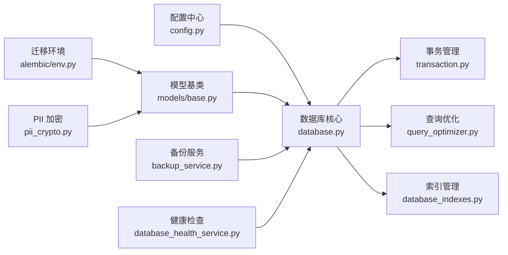

图表来源
- [backend/app/core/config.py:80-104](file://backend/app/core/config.py#L80-L104)
- [backend/app/core/database.py:55-67](file://backend/app/core/database.py#L55-L67)
- [backend/app/core/transaction.py:48-197](file://backend/app/core/transaction.py#L48-L197)
- [backend/app/core/query_optimizer.py:23-49](file://backend/app/core/query_optimizer.py#L23-L49)
- [backend/app/core/database_indexes.py:59-95](file://backend/app/core/database_indexes.py#L59-L95)
- [backend/app/models/base.py:19-20](file://backend/app/models/base.py#L19-L20)
- [backend/alembic/env.py:45-103](file://backend/alembic/env.py#L45-L103)
- [backend/app/services/backup_service.py:74-118](file://backend/app/services/backup_service.py#L74-L118)
- [backend/app/services/database_health_service.py:16-40](file://backend/app/services/database_health_service.py#L16-L40)
- [backend/app/core/pii_crypto.py:23-57](file://backend/app/core/pii_crypto.py#L23-L57)

章节来源
- [backend/app/core/config.py:80-104](file://backend/app/core/config.py#L80-L104)
- [backend/app/core/database.py:55-67](file://backend/app/core/database.py#L55-L67)

## 性能考量
- 连接池与超时：QueuePool 限制连接数，启用 pre_ping/recycle/timeout，避免连接泄漏与长时间阻塞。
- WAL 与 PRAGMA：WAL 模式提升并发读；NORMAL 同步兼顾安全与性能；busy_timeout 放宽长事务场景；cache_size/mmap_size/temp_store 放大内存使用以提升性能。
- 长事务独占写：exclusive_write 避免 SQLITE_BUSY，适用于大批量导入与复杂更新。
- 索引策略：启动时校验并创建关键索引，减少 JOIN/WHERE/ORDER BY 的全表扫描。
- 查询优化：分页限制最大页大小；慢查询追踪与 N+1 检测辅助定位瓶颈。
- 维护任务：周期性 ANALYZE/VACUUM 优化统计信息与碎片。

[本节为通用性能指导，不直接分析具体文件]

## 故障排查指南
- 连接与权限问题：检查 DATABASE_URL、数据库文件路径与权限；确认 SQLCipher 驱动与密钥文件存在且有效。
- 写入冲突与忙锁：长事务使用 exclusive_write；短事务依赖 WAL + busy_timeout；必要时调整池大小与超时。
- 迁移失败：确认 alembic/env.py 已启用 render_as_batch；autogenerate 前补齐缺失列；检查模型元数据是否完整注册。
- 备份失败：检查磁盘剩余空间（BACKUP_MIN_FREE_MB）；确认备份目录可写；加密/解密时核对密码与密钥派生。
- 健康检查异常：查看完整性检查结果与统计指标；必要时执行 VACUUM 或重建索引。

章节来源
- [backend/app/core/database.py:89-131](file://backend/app/core/database.py#L89-L131)
- [backend/app/core/database.py:198-289](file://backend/app/core/database.py#L198-L289)
- [backend/alembic/env.py:60-103](file://backend/alembic/env.py#L60-L103)
- [backend/app/services/backup_service.py:30-118](file://backend/app/services/backup_service.py#L30-L118)
- [backend/app/services/database_health_service.py:135-200](file://backend/app/services/database_health_service.py#L135-L200)

## 结论
本系统以 SQLite 为核心存储，结合 SQLAlchemy 与 Alembic 构建稳健的数据层。通过 WAL 与 PRAGMA 调优、连接池与独占写协调器，平衡了并发读与长事务写的稳定性；事务层提供一致性与容错能力；查询优化与索引管理保障性能；备份与健康检查确保可恢复性与可观测性；安全加密满足零信任与合规要求。该架构适合单机/多机物理协同部署，具备高可用、易维护与可扩展的特点。

[本节为总结性内容，不直接分析具体文件]

## 附录
- 配置要点：DATABASE_URL、DB_POOL_*、SLOW_QUERY_THRESHOLD_MS、DB_ENCRYPTION_ENABLED、ENCRYPTION_KEY、METRICS_*、ALERT_* 等。
- 最佳实践：
  - 使用 with transaction/db 上下文管理事务，避免裸 commit。
  - 大事务使用 exclusive_write 包裹，短事务保持轻量。
  - 分页查询限制最大页大小，避免超大结果集。
  - 定期执行 ANALYZE/VACUUM，关注慢查询与 N+1 警告。
  - 备份前检查磁盘空间，启用加密与压缩。
  - 迁移前先补齐缺失列，再执行 autogenerate。

[本节为补充说明，不直接分析具体文件]