# 数据库设计

<cite>
**本文引用的文件**
- [backend/app/models/base.py](file://backend/app/models/base.py)
- [backend/app/core/database.py](file://backend/app/core/database.py)
- [backend/app/core/database_indexes.py](file://backend/app/core/database_indexes.py)
- [backend/app/models/user.py](file://backend/app/models/user.py)
- [backend/app/models/organization.py](file://backend/app/models/organization.py)
- [backend/app/models/village.py](file://backend/app/models/village.py)
- [backend/app/models/project.py](file://backend/app/models/project.py)
- [backend/app/models/fund.py](file://backend/app/models/fund.py)
- [backend/app/models/supported_village.py](file://backend/app/models/supported_village.py)
- [backend/app/models/audit.py](file://backend/app/models/audit.py)
- [backend/app/models/rbac.py](file://backend/app/models/rbac.py)
- [backend/alembic/env.py](file://backend/alembic/env.py)
- [backend/alembic/versions/001_baseline.py](file://backend/alembic/versions/001_baseline.py)
</cite>

## 目录
1. [简介](#简介)
2. [项目结构](#项目结构)
3. [核心组件](#核心组件)
4. [架构总览](#架构总览)
5. [详细组件分析](#详细组件分析)
6. [依赖关系分析](#依赖关系分析)
7. [性能与优化](#性能与优化)
8. [故障排查指南](#故障排查指南)
9. [结论](#结论)
10. [附录](#附录)

## 简介
本文件面向开发者与运维人员，系统化阐述乡村振兴系统的数据库设计：包括整体架构、表结构与字段定义、主外键与约束、索引策略、数据迁移与版本控制、数据访问模式、缓存策略与性能优化。文档以代码级事实为依据，提供可追溯的图表与引用，确保设计与实现一致。

## 项目结构
系统采用 SQLAlchemy ORM + Alembic 的数据库层组织方式：
- 模型定义集中于 backend/app/models，按业务域拆分（用户、组织、村庄、项目、经费、审计、权限等）。
- 数据库引擎、连接池、SQLite PRAGMA 调优、写入协调器位于 backend/app/core/database.py。
- 运行时索引管理在 backend/app/core/database_indexes.py。
- 迁移脚本位于 backend/alembic/versions，环境配置在 backend/alembic/env.py。

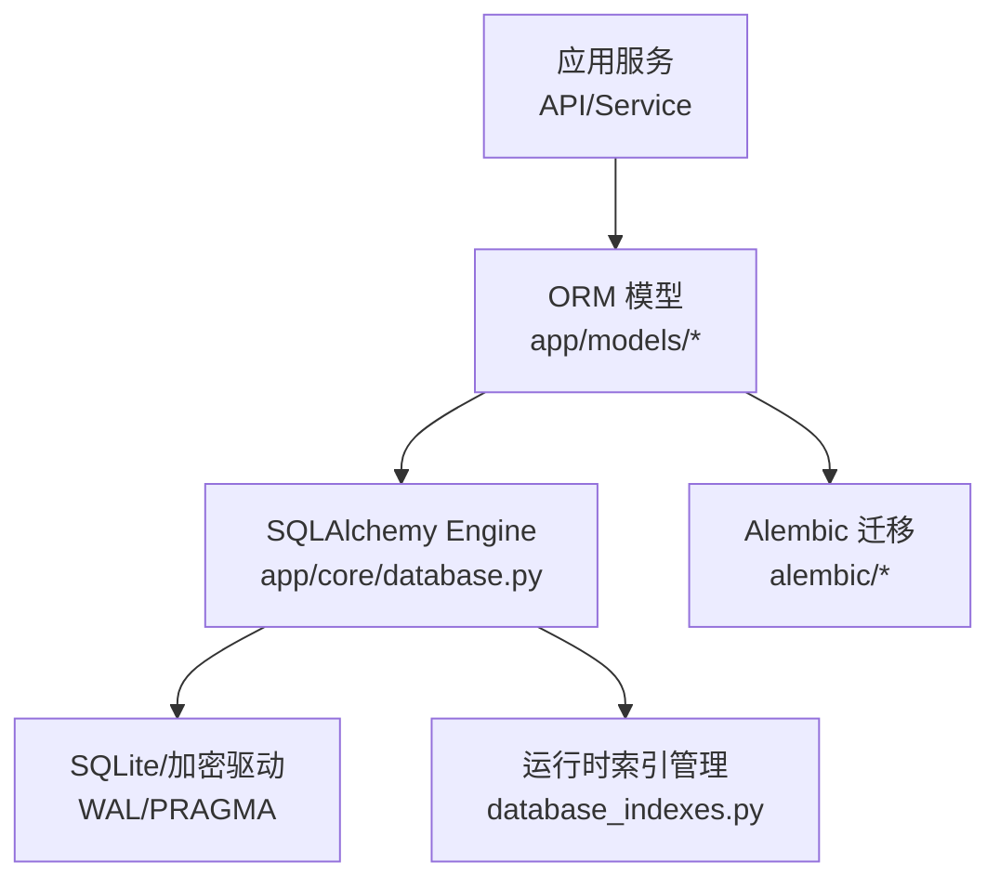

**图示来源**
- [backend/app/core/database.py:55-67](file://backend/app/core/database.py#L55-L67)
- [backend/app/core/database_indexes.py:59-95](file://backend/app/core/database_indexes.py#L59-L95)
- [backend/alembic/env.py:41-103](file://backend/alembic/env.py#L41-L103)

**章节来源**
- [backend/app/core/database.py:1-187](file://backend/app/core/database.py#L1-L187)
- [backend/app/core/database_indexes.py:1-148](file://backend/app/core/database_indexes.py#L1-L148)
- [backend/alembic/env.py:1-110](file://backend/alembic/env.py#L1-L110)

## 核心组件
- 基类与混入：BaseModel、TimestampMixin、SoftDeleteMixin、VersionMixin、EncryptedText（PII 透明加密）
- 数据库引擎与连接：Engine、SessionLocal、SQLite PRAGMA 调优、SQLCipher 支持、长事务独占写协调器
- 索引管理：启动时校验并创建额外索引，支持删除与分析统计
- 模型域：用户、组织、村庄/帮扶村、项目、经费、审计日志、RBAC 权限等

**章节来源**
- [backend/app/models/base.py:19-185](file://backend/app/models/base.py#L19-L185)
- [backend/app/core/database.py:70-187](file://backend/app/core/database.py#L70-L187)
- [backend/app/core/database_indexes.py:14-95](file://backend/app/core/database_indexes.py#L14-L95)

## 架构总览
下图展示从 API 到数据库的关键路径，以及 SQLite 特性与索引管理的介入点。

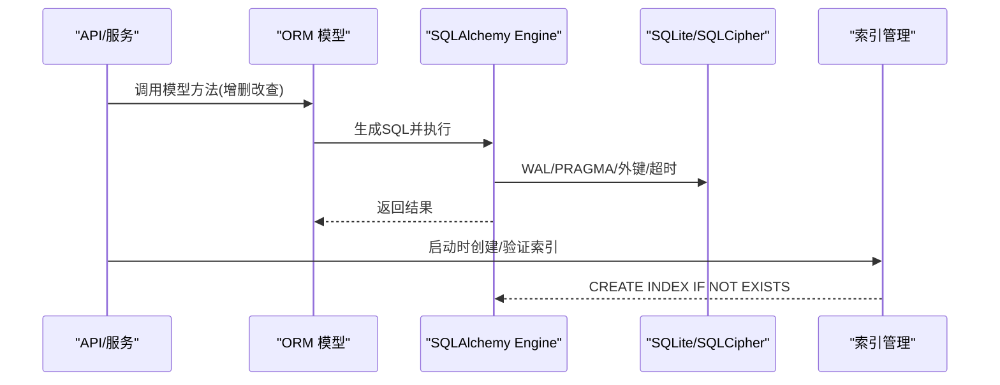

**图示来源**
- [backend/app/core/database.py:78-157](file://backend/app/core/database.py#L78-L157)
- [backend/app/core/database_indexes.py:59-95](file://backend/app/core/database_indexes.py#L59-L95)

## 详细组件分析

### 基础类型与通用能力
- 时间戳与同步版本：TimestampMixin 提供 created_at/updated_at/sync_version，并在更新前自动递增 sync_version，用于增量同步过滤。
- 软删除：SoftDeleteMixin 提供 is_deleted/deleted_at/deleted_by 及 soft_delete/restore；部分历史模型使用 is_active 作为软删标记。
- 乐观锁：VersionMixin 提供 version 字段。
- PII 透明加密：EncryptedText 在写入时加密、读取时解密，兼容 SQLite 长度语义。

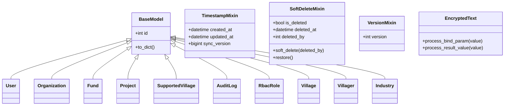

**图示来源**
- [backend/app/models/base.py:19-185](file://backend/app/models/base.py#L19-L185)
- [backend/app/models/user.py:26-85](file://backend/app/models/user.py#L26-L85)
- [backend/app/models/organization.py:31-78](file://backend/app/models/organization.py#L31-L78)
- [backend/app/models/fund.py:61-167](file://backend/app/models/fund.py#L61-L167)
- [backend/app/models/project.py:47-175](file://backend/app/models/project.py#L47-L175)
- [backend/app/models/supported_village.py:42-128](file://backend/app/models/supported_village.py#L42-L128)
- [backend/app/models/audit.py:53-96](file://backend/app/models/audit.py#L53-L96)
- [backend/app/models/rbac.py:31-66](file://backend/app/models/rbac.py#L31-L66)
- [backend/app/models/village.py:14-73](file://backend/app/models/village.py#L14-L73)

**章节来源**
- [backend/app/models/base.py:23-185](file://backend/app/models/base.py#L23-L185)

### 用户与组织
- 用户（users）：用户名/邮箱唯一且索引，角色、数据范围、权限包绑定、Token 版本、登录失败计数、锁定时间等。
- 组织（organizations）：树形结构（parent_id），层级、类型、区域编码、联系人信息（电话加密）、是否启用、创建/更新人。

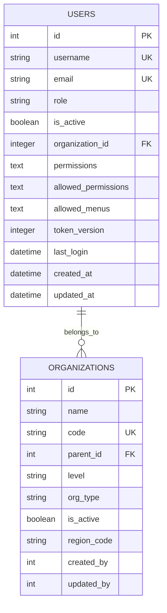

**图示来源**
- [backend/app/models/user.py:26-85](file://backend/app/models/user.py#L26-L85)
- [backend/app/models/organization.py:31-78](file://backend/app/models/organization.py#L31-L78)

**章节来源**
- [backend/app/models/user.py:26-152](file://backend/app/models/user.py#L26-L152)
- [backend/app/models/organization.py:1-78](file://backend/app/models/organization.py#L1-L78)

### 村庄与帮扶村
- 村庄（villages）：基础地理与经济信息，状态与活跃度，组织关联。
- 村民（villagers）：归属村庄，敏感信息加密。
- 产业（industries）：归属村庄，指标字段。
- 帮扶村（supported_villages）：多标签（三区三州、边疆、民族等），过渡期状态，经费汇总 JSON，软删标记，组织关联。
- 年度子表（population/income/force_investment/industry_support/infrastructure_improvement/party_building/medical/consumption/employment/education/support_funding）：通过 supported_village_id + year 唯一约束，便于按年聚合。

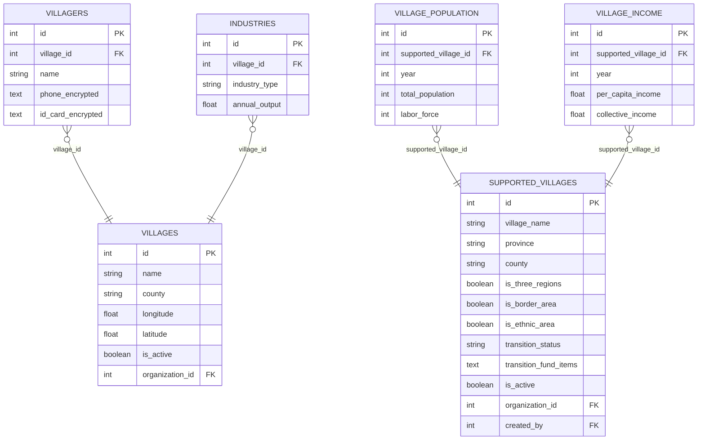

**图示来源**
- [backend/app/models/village.py:14-130](file://backend/app/models/village.py#L14-L130)
- [backend/app/models/supported_village.py:42-128](file://backend/app/models/supported_village.py#L42-L128)
- [backend/app/models/supported_village.py:313-392](file://backend/app/models/supported_village.py#L313-L392)

**章节来源**
- [backend/app/models/village.py:1-130](file://backend/app/models/village.py#L1-L130)
- [backend/app/models/supported_village.py:1-811](file://backend/app/models/supported_village.py#L1-L811)

### 项目与任务、附件
- 项目（projects）：状态、类型、预算/花费/投资、起止日期、进度、优先级、负责人、资金来源与账户信息、扩展字段、软删标记、创建人与时间。
- 项目任务（project_tasks）：归属项目，状态、优先级、截止日期。
- 项目附件（project_files）：分类、路径、大小、上传人。

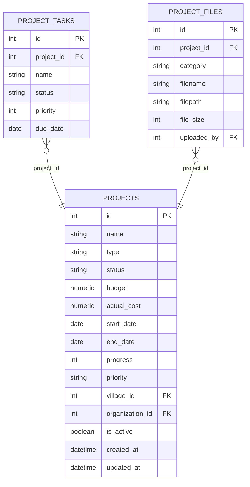

**图示来源**
- [backend/app/models/project.py:47-175](file://backend/app/models/project.py#L47-L175)
- [backend/app/models/project.py:239-320](file://backend/app/models/project.py#L239-L320)

**章节来源**
- [backend/app/models/project.py:1-320](file://backend/app/models/project.py#L1-L320)

### 经费与预算
- 经费（funds）：类型/来源/状态/金额/日期/项目/帮扶村/学校/组织/创建者；生命周期与风控字段；软删标记；为统计优化的冗余字段 year/year_month/year_quarter，配合复合索引加速大屏聚合。
- 经费附件（fund_attachments）：归属经费，文件元信息。
- 预算记录（budget_records）：年度类别预算与使用。

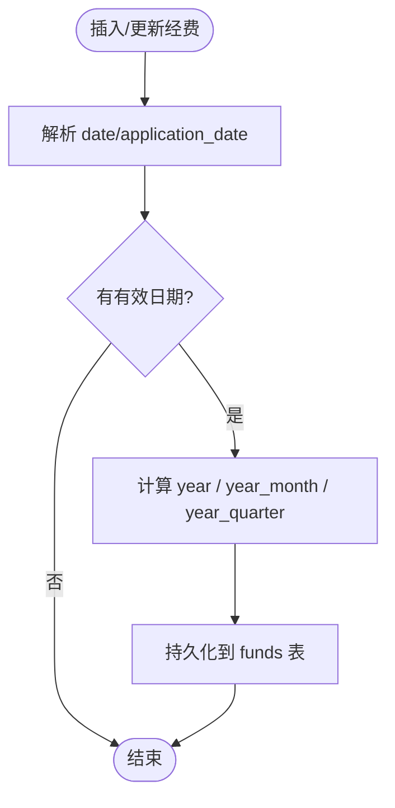

**图示来源**
- [backend/app/models/fund.py:199-226](file://backend/app/models/fund.py#L199-L226)

**章节来源**
- [backend/app/models/fund.py:1-299](file://backend/app/models/fund.py#L1-L299)

### 审计与安全事件
- 审计日志（audit_logs）：用户、动作、资源、新旧值、请求/响应、耗时、会话/追踪ID、时间戳。
- 安全事件（security_events）：事件类型、严重级别、影响资源、解决状态。
- 登录尝试（login_attempts）：用户名、IP、UA、成功与否、原因、时间。
- API 访问日志（api_access_logs）：端点、方法、参数/体、响应状态/耗时、IP/UA、会话、时间。
- 导出日志（data_export_logs）：导出类型、数据/过滤器、格式、记录数/文件大小、路径、状态、时间。

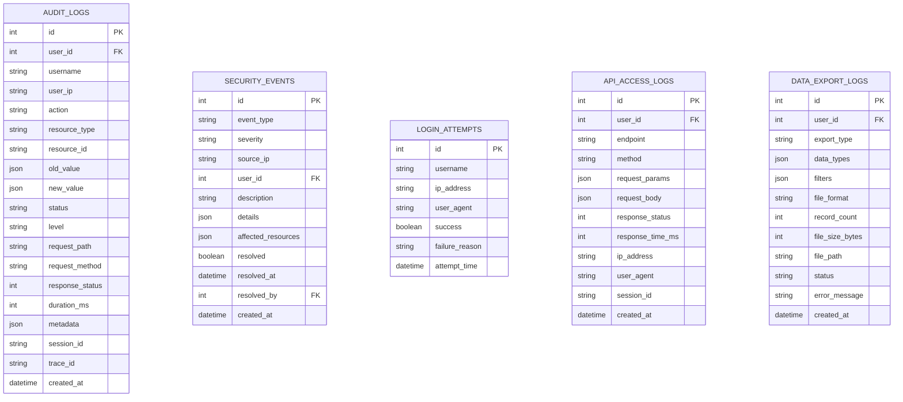

**图示来源**
- [backend/app/models/audit.py:53-205](file://backend/app/models/audit.py#L53-L205)

**章节来源**
- [backend/app/models/audit.py:1-205](file://backend/app/models/audit.py#L1-L205)

### RBAC 权限模型
- 角色（rbac_roles）、用户角色（rbac_user_roles）、角色权限（rbac_role_permissions）、用户直接权限（rbac_user_permissions）、资源访问控制（rbac_resource_access）、访问日志（rbac_access_logs）、机器码权限（machine_code_permissions）。

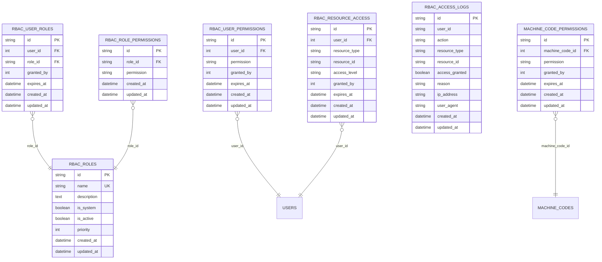

**图示来源**
- [backend/app/models/rbac.py:31-263](file://backend/app/models/rbac.py#L31-L263)

**章节来源**
- [backend/app/models/rbac.py:1-263](file://backend/app/models/rbac.py#L1-L263)

## 依赖关系分析
- 模型间关系：
  - users.organization_id -> organizations.id
  - projects.village_id -> supported_villages.id（注意列名兼容说明）
  - funds.project_id -> projects.id；funds.village_id -> supported_villages.id；funds.school_id -> schools.id；funds.organization_id -> organizations.id
  - supported_villages.organization_id -> organizations.id；supported_villages.created_by -> users.id
  - audit/security/login/api/export 等日志表通过 user_id 关联 users.id
  - rbac_* 系列表通过 user_id/role_id/machine_code_id 关联
- 外键行为：多数为 SET NULL 或 CASCADE，保证数据清理与隔离。

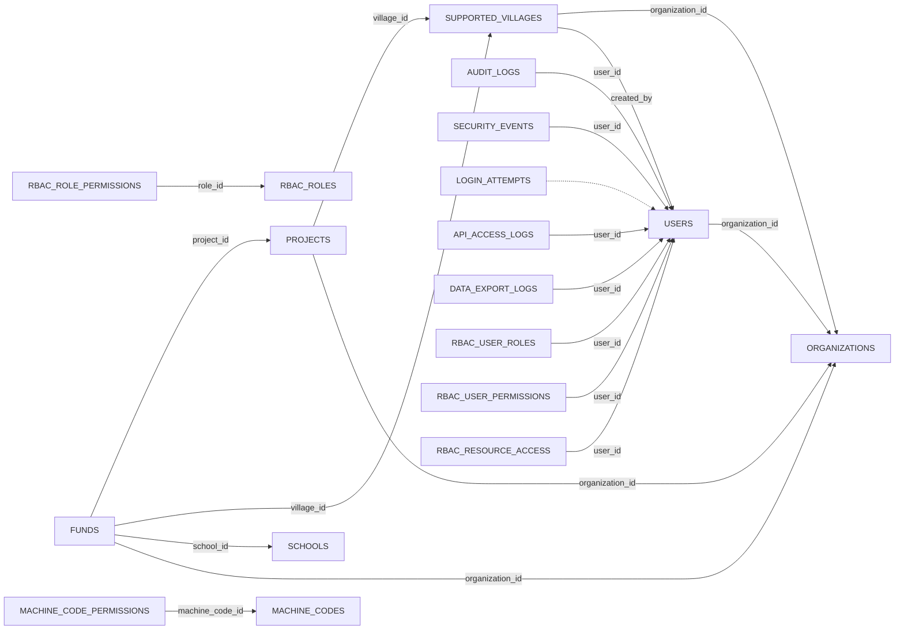

**图示来源**
- [backend/app/models/user.py:57-77](file://backend/app/models/user.py#L57-L77)
- [backend/app/models/organization.py:47-52](file://backend/app/models/organization.py#L47-L52)
- [backend/app/models/project.py:81-92](file://backend/app/models/project.py#L81-L92)
- [backend/app/models/fund.py:104-111](file://backend/app/models/fund.py#L104-L111)
- [backend/app/models/supported_village.py:108-124](file://backend/app/models/supported_village.py#L108-L124)
- [backend/app/models/audit.py:67-96](file://backend/app/models/audit.py#L67-L96)
- [backend/app/models/rbac.py:81-161](file://backend/app/models/rbac.py#L81-L161)
- [backend/app/models/rbac.py:163-218](file://backend/app/models/rbac.py#L163-L218)
- [backend/app/models/rbac.py:221-257](file://backend/app/models/rbac.py#L221-L257)

**章节来源**
- [backend/app/models/user.py:26-152](file://backend/app/models/user.py#L26-L152)
- [backend/app/models/organization.py:1-78](file://backend/app/models/organization.py#L1-L78)
- [backend/app/models/project.py:1-320](file://backend/app/models/project.py#L1-L320)
- [backend/app/models/fund.py:1-299](file://backend/app/models/fund.py#L1-L299)
- [backend/app/models/supported_village.py:1-811](file://backend/app/models/supported_village.py#L1-L811)
- [backend/app/models/audit.py:1-205](file://backend/app/models/audit.py#L1-L205)
- [backend/app/models/rbac.py:1-263](file://backend/app/models/rbac.py#L1-L263)

## 性能与优化
- SQLite 运行期优化：
  - WAL 模式、NORMAL 同步、busy_timeout=10s、cache_size/mmap_size 可调、临时存储内存、自动 checkpoint、自动索引、连接关闭 optimize。
  - SQLCipher 探测与密钥校验，fail-fast 防止假加密。
- 写入协调器：
  - 短事务依赖 WAL+busy_timeout；长事务使用 exclusive_write 获取进程内独占锁，避免 SQLITE_BUSY。
- 索引策略：
  - 模型 __table_args__ 中声明大量单列/复合索引，覆盖状态、类型、组织、村庄、日期等高频查询。
  - 运行时 EXTRA_INDEXES 集中管理补充索引（FK 列、状态/日期列），启动时幂等创建。
  - 经费表 year/year_month/year_quarter 冗余字段 + 复合索引，直接命中聚合查询，消除 func.strftime 开销。
- 统计与分析：
  - 启动/维护时可执行 ANALYZE，收集表行数统计，辅助查询计划优化。

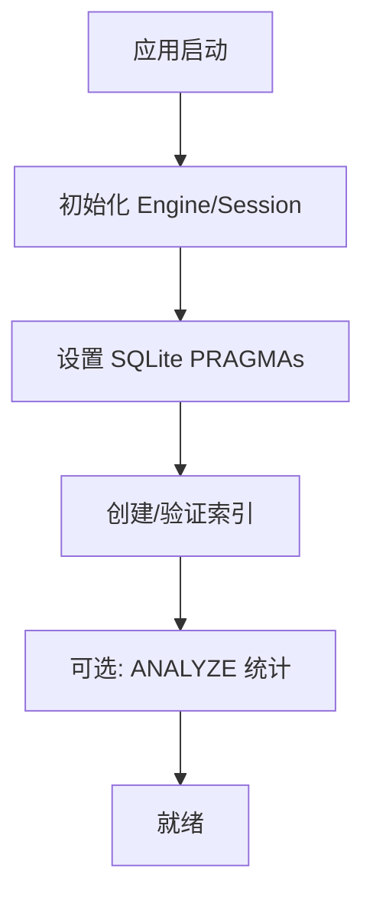

**图示来源**
- [backend/app/core/database.py:78-157](file://backend/app/core/database.py#L78-L157)
- [backend/app/core/database_indexes.py:59-95](file://backend/app/core/database_indexes.py#L59-L95)
- [backend/app/core/database_indexes.py:121-148](file://backend/app/core/database_indexes.py#L121-L148)

**章节来源**
- [backend/app/core/database.py:70-187](file://backend/app/core/database.py#L70-L187)
- [backend/app/core/database_indexes.py:1-148](file://backend/app/core/database_indexes.py#L1-L148)
- [backend/app/models/fund.py:61-86](file://backend/app/models/fund.py#L61-L86)

## 故障排查指南
- 数据库加密异常：
  - 现象：连接时报“非数据库”或密钥错误。
  - 处理：确认已安装 SQLCipher 驱动；检查密钥文件存在且非空；首次查询会触发密钥校验失败。
- 写入阻塞/忙锁：
  - 现象：导入大文件或批量更新时报 SQLITE_BUSY。
  - 处理：使用 exclusive_write 上下文包裹长事务；调整 busy_timeout；避免在 FastAPI 同步路由中阻塞队列消费。
- 索引缺失导致慢查询：
  - 现象：JOIN/WHERE/OVER BY 全表扫描。
  - 处理：确认 EXTRA_INDEXES 已创建；必要时新增索引；定期 ANALYZE。
- 迁移冲突：
  - 现象：autogenerate 检测到重复列或无法识别结构。
  - 处理：先运行 _migrate_missing_columns 补齐列；再执行 alembic revision/upgrade；确保 env 中 target_metadata 正确。

**章节来源**
- [backend/app/core/database.py:89-131](file://backend/app/core/database.py#L89-L131)
- [backend/app/core/database.py:198-289](file://backend/app/core/database.py#L198-L289)
- [backend/app/core/database_indexes.py:59-95](file://backend/app/core/database_indexes.py#L59-L95)
- [backend/alembic/env.py:60-103](file://backend/alembic/env.py#L60-L103)

## 结论
本数据库设计以 SQLAlchemy ORM 为核心，结合 SQLite 深度优化与 Alembic 迁移管理，构建了高可用、高性能、可扩展的数据层。通过统一的基类与混入、完善的索引策略、严格的约束与审计、以及稳健的迁移流程，既满足乡村振兴业务的复杂性与合规性要求，也为后续演进提供了清晰路径。

## 附录

### ER 图（核心实体）
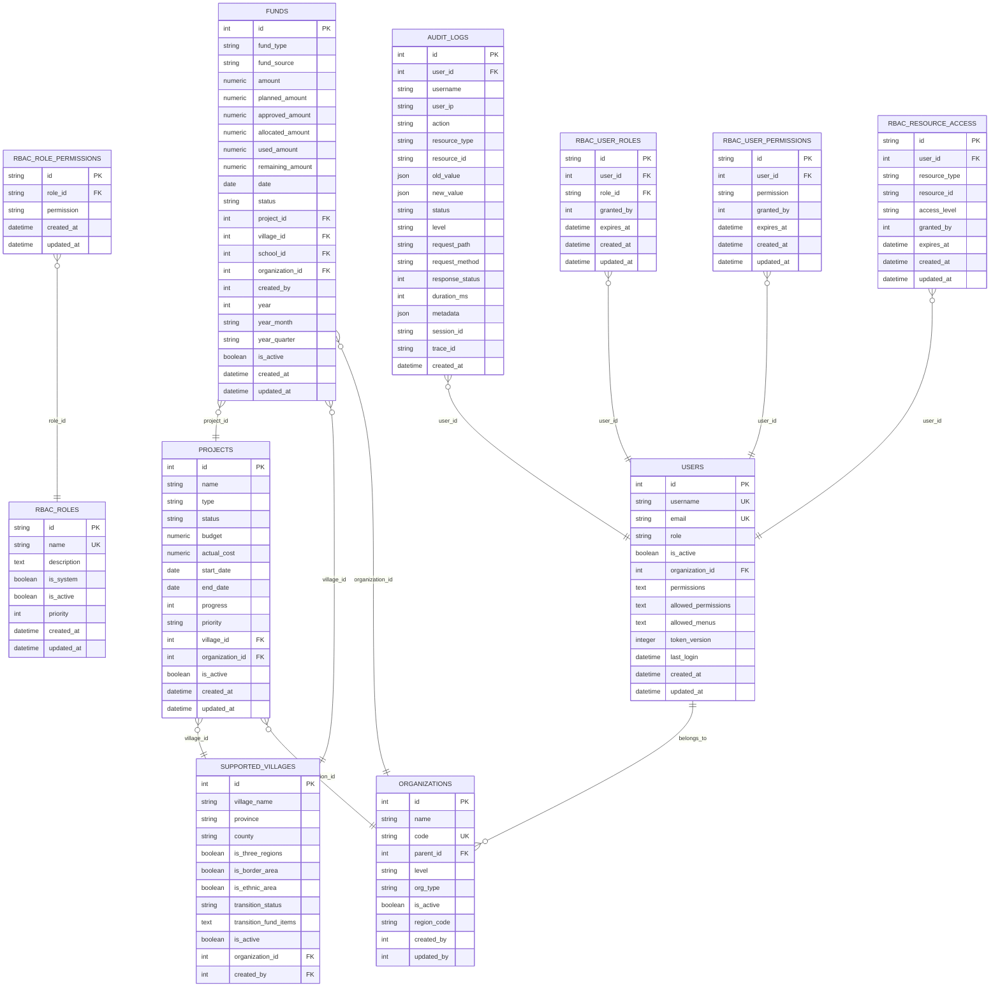

**图示来源**
- [backend/app/models/user.py:26-85](file://backend/app/models/user.py#L26-L85)
- [backend/app/models/organization.py:31-78](file://backend/app/models/organization.py#L31-L78)
- [backend/app/models/supported_village.py:42-128](file://backend/app/models/supported_village.py#L42-L128)
- [backend/app/models/project.py:47-175](file://backend/app/models/project.py#L47-L175)
- [backend/app/models/fund.py:61-167](file://backend/app/models/fund.py#L61-L167)
- [backend/app/models/audit.py:53-96](file://backend/app/models/audit.py#L53-L96)
- [backend/app/models/rbac.py:31-218](file://backend/app/models/rbac.py#L31-L218)

### 数据迁移管理与版本控制策略
- 基线迁移：001_baseline 检测核心表是否存在，不存在则基于当前模型 metadata 一次性建库，保证从零开始可升级。
- 迁移环境：env.py 将目标元数据指向 Base.metadata，并在 autogenerate 前执行 _migrate_missing_columns 补齐列，避免重复 DDL。
- 最佳实践：
  - 新变更通过 alembic revision --autogenerate 生成迁移脚本，保持幂等与可重放。
  - 对 SQLite 使用 render_as_batch 兼容 DDL 变更。
  - 生产环境升级前先备份，回滚需评估兼容性。

**章节来源**
- [backend/alembic/versions/001_baseline.py:1-48](file://backend/alembic/versions/001_baseline.py#L1-L48)
- [backend/alembic/env.py:41-103](file://backend/alembic/env.py#L41-L103)