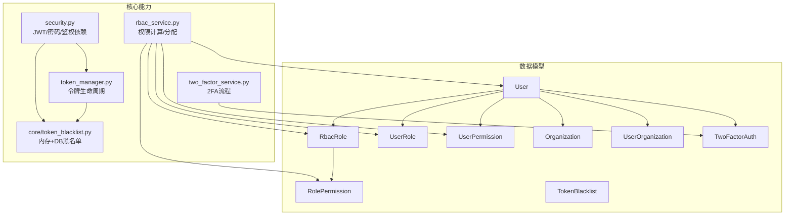
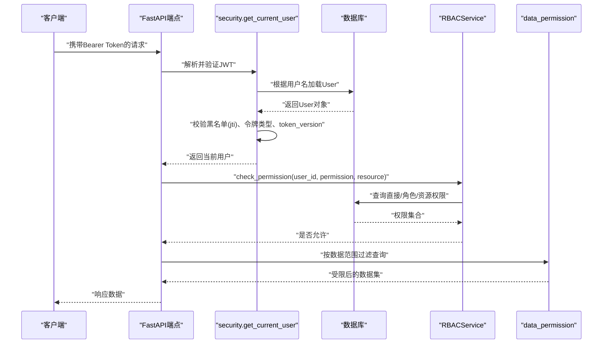
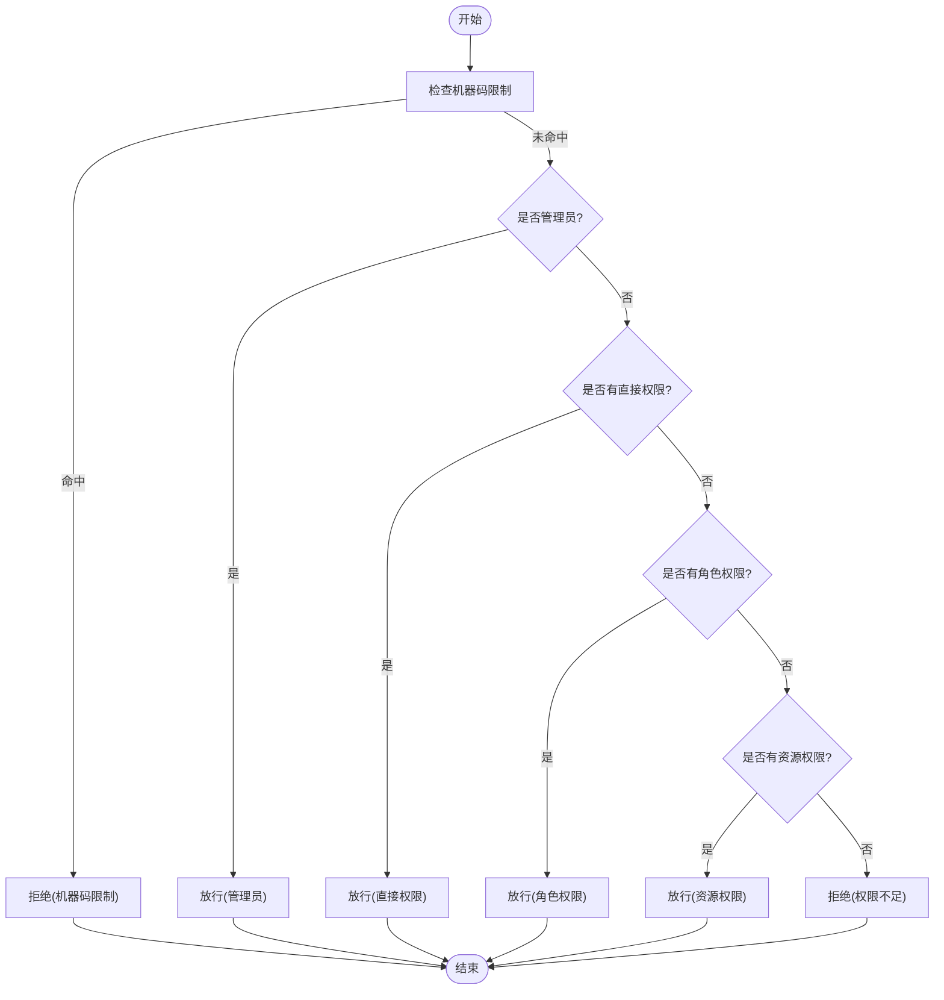
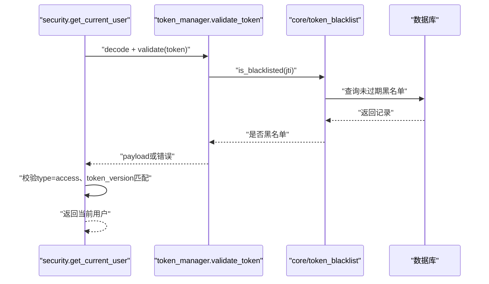
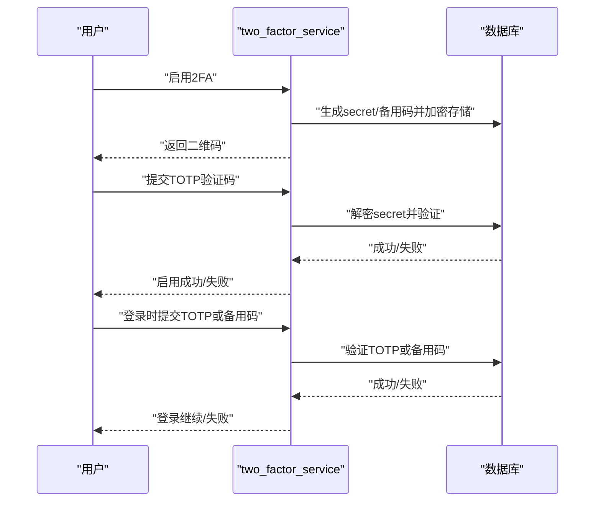
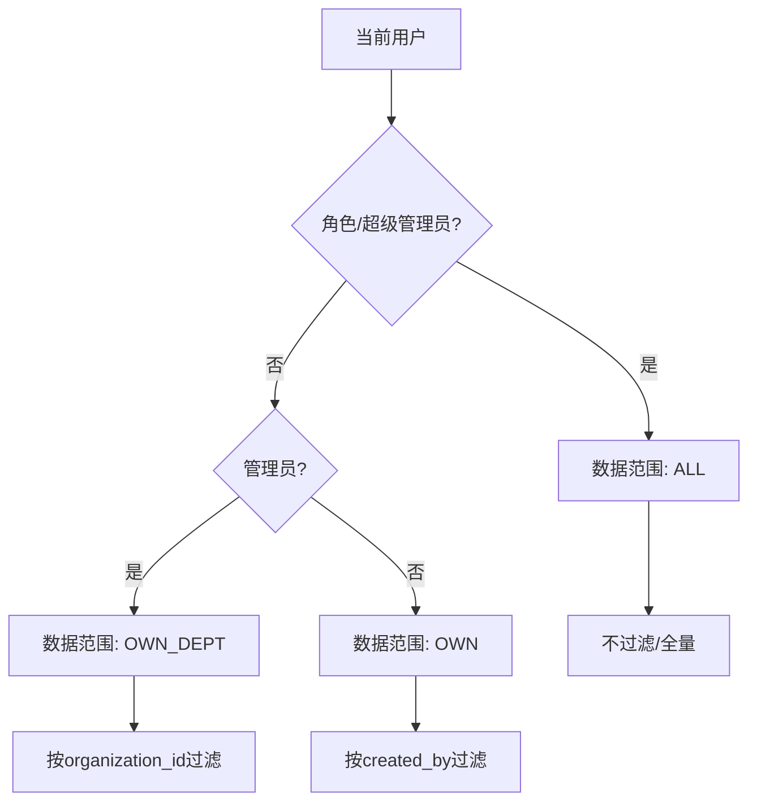
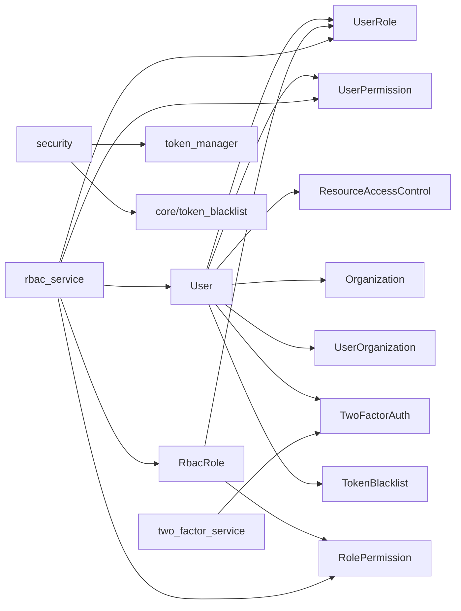
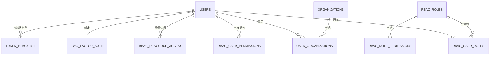

# 用户认证模型

<cite>
**本文引用的文件**
- [backend/app/models/user.py](file://backend/app/models/user.py)
- [backend/app/models/rbac.py](file://backend/app/models/rbac.py)
- [backend/app/models/role.py](file://backend/app/models/role.py)
- [backend/app/models/token_blacklist.py](file://backend/app/models/token_blacklist.py)
- [backend/app/models/two_factor_auth.py](file://backend/app/models/two_factor_auth.py)
- [backend/app/models/user_organization.py](file://backend/app/models/user_organization.py)
- [backend/app/models/organization.py](file://backend/app/models/organization.py)
- [backend/app/core/security.py](file://backend/app/core/security.py)
- [backend/app/core/token_manager.py](file://backend/app/core/token_manager.py)
- [backend/app/core/token_blacklist.py](file://backend/app/core/token_blacklist.py)
- [backend/app/services/rbac_service.py](file://backend/app/services/rbac_service.py)
- [backend/app/services/two_factor_service.py](file://backend/app/services/two_factor_service.py)
- [backend/app/schemas/auth.py](file://backend/app/schemas/auth.py)
</cite>

## 目录
1. [简介](#简介)
2. [项目结构](#项目结构)
3. [核心组件](#核心组件)
4. [架构总览](#架构总览)
5. [详细组件分析](#详细组件分析)
6. [依赖关系分析](#依赖关系分析)
7. [性能考虑](#性能考虑)
8. [故障排查指南](#故障排查指南)
9. [结论](#结论)
10. [附录](#附录)

## 简介
本文件面向“用户认证与授权”子系统，系统性说明用户表、角色表、权限表的结构设计与字段定义；阐述RBAC权限模型实现、角色继承关系与权限分配机制；覆盖JWT令牌管理、令牌黑名单机制与双因素认证的数据结构设计；解释用户组织关系、数据范围控制与权限验证逻辑；并提供ER图、示例数据与常见查询场景的SQL语句。

## 项目结构
认证相关代码主要分布在以下模块：
- 数据模型层：用户、角色、权限、组织、双因素认证、令牌黑名单等ORM模型
- 安全核心：JWT生成/校验、密码哈希、请求级当前用户获取、速率限制与安全头
- 令牌管理：统一创建、校验、刷新、吊销与持久化黑名单
- RBAC服务：角色/权限分配、计算有效权限、资源访问控制与审计日志
- 双因素认证服务：TOTP密钥、二维码、备用码、登录校验
- Schema：登录、令牌、用户信息、2FA流程的请求/响应结构



图表来源
- [backend/app/models/user.py:26-90](file://backend/app/models/user.py#L26-L90)
- [backend/app/models/rbac.py:31-160](file://backend/app/models/rbac.py#L31-L160)
- [backend/app/models/organization.py:31-78](file://backend/app/models/organization.py#L31-L78)
- [backend/app/models/two_factor_auth.py:13-39](file://backend/app/models/two_factor_auth.py#L13-L39)
- [backend/app/models/token_blacklist.py:13-61](file://backend/app/models/token_blacklist.py#L13-L61)
- [backend/app/core/security.py:210-336](file://backend/app/core/security.py#L210-L336)
- [backend/app/core/token_manager.py:64-240](file://backend/app/core/token_manager.py#L64-L240)
- [backend/app/core/token_blacklist.py:27-163](file://backend/app/core/token_blacklist.py#L27-L163)
- [backend/app/services/rbac_service.py:104-320](file://backend/app/services/rbac_service.py#L104-L320)
- [backend/app/services/two_factor_service.py:23-251](file://backend/app/services/two_factor_service.py#L23-L251)

章节来源
- [backend/app/models/user.py:26-90](file://backend/app/models/user.py#L26-L90)
- [backend/app/models/rbac.py:31-160](file://backend/app/models/rbac.py#L31-L160)
- [backend/app/core/security.py:210-336](file://backend/app/core/security.py#L210-L336)
- [backend/app/core/token_manager.py:64-240](file://backend/app/core/token_manager.py#L64-L240)
- [backend/app/core/token_blacklist.py:27-163](file://backend/app/core/token_blacklist.py#L27-L163)
- [backend/app/services/rbac_service.py:104-320](file://backend/app/services/rbac_service.py#L104-L320)
- [backend/app/services/two_factor_service.py:23-251](file://backend/app/services/two_factor_service.py#L23-L251)

## 核心组件
- 用户模型（User）：包含基础信息、角色、组织归属、数据范围、白名单权限、菜单可见性、令牌版本、登录失败计数与锁定时间等。
- RBAC模型：角色（RbacRole）、用户角色关联（UserRole）、角色权限关联（RolePermission）、用户直接权限（UserPermission）、资源访问控制（ResourceAccessControl）、访问日志（AccessLog）。
- 组织模型（Organization）：树形组织，支持层级、类型、路径与区域编码。
- 用户-组织关联（UserOrganization）：多对多，记录用户在组织中的角色。
- 双因素认证（TwoFactorAuth）：存储加密的TOTP密钥、备用恢复码、启用状态与验证时间。
- 令牌黑名单（TokenBlacklist）：持久化被撤销的JWT（jti），支持过期时间与原因。
- 安全核心（security.py）：JWT签发/解码、当前用户解析、黑名单校验、令牌版本校验、管理员检查、速率限制与安全头。
- 令牌管理（token_manager.py）：统一的令牌创建、校验、刷新、吊销与持久化黑名单。
- RBAC服务（rbac_service.py）：权限计算（直接权限、角色权限、资源权限、机器码限制、白名单交集）、批量授予/撤销、访问日志。
- 双因素服务（two_factor_service.py）：TOTP密钥生成、二维码、备用码、启用/禁用、登录校验。
- Schema（auth.py）：登录、令牌、用户信息、2FA临时令牌等请求/响应结构。

章节来源
- [backend/app/models/user.py:26-152](file://backend/app/models/user.py#L26-L152)
- [backend/app/models/rbac.py:31-263](file://backend/app/models/rbac.py#L31-L263)
- [backend/app/models/organization.py:31-78](file://backend/app/models/organization.py#L31-L78)
- [backend/app/models/user_organization.py:21-69](file://backend/app/models/user_organization.py#L21-L69)
- [backend/app/models/two_factor_auth.py:13-39](file://backend/app/models/two_factor_auth.py#L13-L39)
- [backend/app/models/token_blacklist.py:13-61](file://backend/app/models/token_blacklist.py#L13-L61)
- [backend/app/core/security.py:210-336](file://backend/app/core/security.py#L210-L336)
- [backend/app/core/token_manager.py:64-240](file://backend/app/core/token_manager.py#L64-L240)
- [backend/app/services/rbac_service.py:104-746](file://backend/app/services/rbac_service.py#L104-L746)
- [backend/app/services/two_factor_service.py:23-251](file://backend/app/services/two_factor_service.py#L23-L251)
- [backend/app/schemas/auth.py:8-77](file://backend/app/schemas/auth.py#L8-L77)

## 架构总览
认证授权链路从HTTP请求进入，经FastAPI依赖解析当前用户，校验JWT签名、类型、黑名单与版本，再结合RBAC服务进行功能权限与资源权限判定，同时通过数据范围工具限定查询结果集。



图表来源
- [backend/app/core/security.py:243-336](file://backend/app/core/security.py#L243-L336)
- [backend/app/services/rbac_service.py:133-222](file://backend/app/services/rbac_service.py#L133-L222)
- [backend/app/core/data_permission.py:83-170](file://backend/app/core/data_permission.py#L83-L170)

## 详细组件分析

### 数据模型与ER设计
- 用户（users）：主键id、用户名、邮箱、密码哈希、角色、激活状态、超级管理员标记、电话（加密）、部门、职位、头像、性别、生日、地址、备注、所属组织ID、数据范围、权限列表（逗号分隔）、白名单权限（JSON数组）、可见菜单（JSON数组）、权限包ID、令牌版本、必须改密标志、连续失败次数、锁定截止时间、密码修改时间、最后登录时间、创建/更新时间。
- 角色（rbac_roles）：UUID主键、名称（唯一）、描述、系统内置标志、启用标志、优先级、创建/更新时间。
- 用户角色关联（rbac_user_roles）：UUID主键、用户ID、角色ID、授权人、过期时间、创建/更新时间。
- 角色权限关联（rbac_role_permissions）：UUID主键、角色ID、权限标识、创建/更新时间。
- 用户直接权限（rbac_user_permissions）：UUID主键、用户ID、权限标识、授权人、过期时间、创建/更新时间。
- 资源访问控制（rbac_resource_access）：UUID主键、用户ID、资源类型、资源ID、访问级别、授权人、过期时间、创建/更新时间。
- 访问日志（rbac_access_logs）：UUID主键、用户ID、动作、资源类型、资源ID、是否授权、拒绝原因、IP、UA、创建/更新时间。
- 组织（organizations）：自引用树形结构，含名称、编码、父ID、层级、类型、排序、描述、联系人、电话（加密）、邮箱、地址、区域编码、启用标志、路径、创建/更新人。
- 用户-组织关联（user_organizations）：用户ID、组织ID、在该组织的角色、创建/更新时间，唯一约束保证一对一。
- 双因素认证（two_factor_auth）：用户ID（唯一外键）、加密密钥、备用恢复码（JSON）、启用标志、验证时间、创建/更新时间。
- 令牌黑名单（token_blacklist）：主键、jti（唯一）、用户ID、加入黑名单时间、原始过期时间、原因。

```mermaid
erDiagram
USERS {
int id PK
string username UK
string email UK
string hashed_password
string role
boolean is_active
boolean is_superuser
string phone_encrypted
string department
string position
string avatar
string gender
string birthday
string address
text remark
int organization_id FK
string data_scope
text permissions
text allowed_permissions
text allowed_menus
int permission_pack_id FK
int token_version
boolean must_change_password
int failed_login_count
datetime locked_until
datetime password_changed_at
datetime last_login
datetime created_at
datetime updated_at
}
RBAC_ROLES {
string id PK
string name UK
text description
boolean is_system
boolean is_active
int priority
datetime created_at
datetime updated_at
}
RBAC_USER_ROLES {
string id PK
int user_id FK
string role_id FK
int granted_by
datetime expires_at
datetime created_at
datetime updated_at
}
RBAC_ROLE_PERMISSIONS {
string id PK
string role_id FK
string permission
datetime created_at
datetime updated_at
}
RBAC_USER_PERMISSIONS {
string id PK
int user_id FK
string permission
int granted_by
datetime expires_at
datetime created_at
datetime updated_at
}
RBAC_RESOURCE_ACCESS {
string id PK
int user_id FK
string resource_type
string resource_id
string access_level
int granted_by
datetime expires_at
datetime created_at
datetime updated_at
}
RBAC_ACCESS_LOGS {
string id PK
string user_id
string action
string resource_type
string resource_id
boolean access_granted
string reason
string ip_address
text user_agent
datetime created_at
datetime updated_at
}
ORGANIZATIONS {
int id PK
string name
string code UK
int parent_id FK
string level
string type
string org_type
int sort_order
text description
string contact_person
string contact_phone_encrypted
string contact_email
string address
string region_code
boolean is_active
string path
int created_by
int updated_by
}
USER_ORGANIZATIONS {
int id PK
int user_id FK
int organization_id FK
string role
datetime created_at
datetime updated_at
}
TWO_FACTOR_AUTH {
int id PK
int user_id FK UK
string secret_key
json backup_codes
boolean enabled
datetime verified_at
datetime created_at
datetime updated_at
}
TOKEN_BLACKLIST {
int id PK
string token_jti UK
int user_id FK
datetime blacklisted_at
datetime expires_at
string reason
}
USERS ||--o{ RBAC_USER_ROLES : "拥有"
RBAC_ROLES ||--o{ RBAC_USER_ROLES : "分配给"
RBAC_ROLES ||--o{ RBAC_ROLE_PERMISSIONS : "包含"
USERS ||--o{ RBAC_USER_PERMISSIONS : "直接拥有"
USERS ||--o{ RBAC_RESOURCE_ACCESS : "资源访问"
USERS ||--|| TWO_FACTOR_AUTH : "绑定"
USERS ||--o{ USER_ORGANIZATIONS : "属于"
ORGANIZATIONS ||--o{ USER_ORGANIZATIONS : "包含"
USERS ||--o{ TOKEN_BLACKLIST : "令牌黑名单"
```

图表来源
- [backend/app/models/user.py:26-90](file://backend/app/models/user.py#L26-L90)
- [backend/app/models/rbac.py:31-263](file://backend/app/models/rbac.py#L31-L263)
- [backend/app/models/organization.py:31-78](file://backend/app/models/organization.py#L31-L78)
- [backend/app/models/user_organization.py:21-69](file://backend/app/models/user_organization.py#L21-L69)
- [backend/app/models/two_factor_auth.py:13-39](file://backend/app/models/two_factor_auth.py#L13-L39)
- [backend/app/models/token_blacklist.py:13-61](file://backend/app/models/token_blacklist.py#L13-L61)

章节来源
- [backend/app/models/user.py:26-152](file://backend/app/models/user.py#L26-L152)
- [backend/app/models/rbac.py:31-263](file://backend/app/models/rbac.py#L31-L263)
- [backend/app/models/organization.py:31-78](file://backend/app/models/organization.py#L31-L78)
- [backend/app/models/user_organization.py:21-69](file://backend/app/models/user_organization.py#L21-L69)
- [backend/app/models/two_factor_auth.py:13-39](file://backend/app/models/two_factor_auth.py#L13-L39)
- [backend/app/models/token_blacklist.py:13-61](file://backend/app/models/token_blacklist.py#L13-L61)

### RBAC权限模型与权限分配机制
- 角色与权限：角色可配置多个权限标识；用户可通过角色获得权限，也可直接授予权限。
- 权限计算顺序：先检查机器码限制（若命中则直接拒绝），再判断是否管理员（admin或super_admin），然后检查直接权限、角色权限、资源权限；最终与用户白名单权限取交集，再减去机器码限制得到最终有效权限。
- 批量操作：提供批量授予/撤销权限、原子保存权限集合（删除旧+新增新+跳过已存在）。
- 访问日志：每次权限检查均记录到访问日志表，便于审计。



图表来源
- [backend/app/services/rbac_service.py:133-222](file://backend/app/services/rbac_service.py#L133-L222)
- [backend/app/services/rbac_service.py:256-320](file://backend/app/services/rbac_service.py#L256-L320)

章节来源
- [backend/app/services/rbac_service.py:104-746](file://backend/app/services/rbac_service.py#L104-L746)

### JWT令牌管理与黑名单机制
- 令牌创建：access_token与refresh_token成对签发，包含subject、jti、type、iat、exp等声明；可附加额外声明（如token_version）。
- 令牌校验：在get_current_user中解码JWT，校验类型、黑名单（jti）、用户存在性、token_version一致性；不一致则拒绝。
- 令牌刷新：使用有效的refresh_token换取新的access_token，并对原refresh_token执行旋转（吊销）。
- 黑名单：内存黑名单用于快速查找，启动时从数据库加载未过期条目；吊销时将jti写入数据库，确保重启后仍生效。



图表来源
- [backend/app/core/security.py:210-336](file://backend/app/core/security.py#L210-L336)
- [backend/app/core/token_manager.py:135-240](file://backend/app/core/token_manager.py#L135-L240)
- [backend/app/core/token_blacklist.py:73-163](file://backend/app/core/token_blacklist.py#L73-L163)

章节来源
- [backend/app/core/security.py:210-336](file://backend/app/core/security.py#L210-L336)
- [backend/app/core/token_manager.py:64-240](file://backend/app/core/token_manager.py#L64-L240)
- [backend/app/core/token_blacklist.py:27-163](file://backend/app/core/token_blacklist.py#L27-L163)
- [backend/app/models/token_blacklist.py:13-61](file://backend/app/models/token_blacklist.py#L13-L61)

### 双因素认证（2FA）数据结构与流程
- 数据结构：TwoFactorAuth表存储加密的secret_key、备用恢复码（JSON）、启用标志、验证时间。
- 流程：
  - 启用：生成secret与备用码，加密存储，生成二维码供用户扫码绑定。
  - 验证启用：输入TOTP验证码通过后设置enabled为真并记录verified_at。
  - 登录校验：优先验证TOTP，失败则尝试备用码；成功后可继续登录流程。
  - 禁用：删除对应记录。



图表来源
- [backend/app/models/two_factor_auth.py:13-39](file://backend/app/models/two_factor_auth.py#L13-L39)
- [backend/app/services/two_factor_service.py:23-251](file://backend/app/services/two_factor_service.py#L23-L251)

章节来源
- [backend/app/models/two_factor_auth.py:13-39](file://backend/app/models/two_factor_auth.py#L13-L39)
- [backend/app/services/two_factor_service.py:23-251](file://backend/app/services/two_factor_service.py#L23-L251)

### 用户组织关系与数据范围控制
- 用户组织关系：UserOrganization表支持用户属于多个组织，并在该组织中拥有不同角色（admin/member/viewer）。
- 数据范围：
  - 超级管理员：所有数据（ALL）
  - 管理员：本组织/部门（OWN_DEPT）
  - 普通用户：仅本人数据（OWN）
- 应用方式：通过apply_scope_to_query将范围转换为SQL过滤器，确保查询结果受控。



图表来源
- [backend/app/core/data_permission.py:20-170](file://backend/app/core/data_permission.py#L20-L170)
- [backend/app/models/user_organization.py:21-69](file://backend/app/models/user_organization.py#L21-L69)

章节来源
- [backend/app/core/data_permission.py:20-170](file://backend/app/core/data_permission.py#L20-L170)
- [backend/app/models/user_organization.py:21-69](file://backend/app/models/user_organization.py#L21-L69)

### 权限验证逻辑与服务接口
- 权限枚举：集中定义业务权限（用户、组织、帮扶村、政策、备份、系统、审计、数据分析、管理员等）。
- 服务方法：
  - check_permission：综合机器码限制、管理员、直接/角色/资源权限判定。
  - get_user_permissions：计算用户有效权限（含白名单与机器码限制）。
  - assign_role/grant_permission/revoke_permission/save_permissions：角色与权限的增删改。
  - create_role/get_user_roles：角色管理。
- 访问日志：每次权限检查记录到AccessLog，便于审计追踪。

章节来源
- [backend/app/services/rbac_service.py:52-746](file://backend/app/services/rbac_service.py#L52-L746)

## 依赖关系分析
- 模型间依赖：
  - User与RbacRole通过UserRole建立多对多关系。
  - RbacRole与RolePermission一对多。
  - User与UserPermission、ResourceAccessControl一对多。
  - User与Organization通过UserOrganization多对多。
  - User与TwoFactorAuth一对一。
  - TokenBlacklist与User一对多。
- 服务依赖：
  - security依赖token_manager与token_blacklist进行JWT处理。
  - rbac_service依赖rbac模型与machine_code_permission_service进行机器码限制。
  - two_factor_service依赖encryption_service进行密钥加解密。



图表来源
- [backend/app/models/user.py:26-90](file://backend/app/models/user.py#L26-L90)
- [backend/app/models/rbac.py:31-263](file://backend/app/models/rbac.py#L31-L263)
- [backend/app/models/organization.py:31-78](file://backend/app/models/organization.py#L31-L78)
- [backend/app/models/user_organization.py:21-69](file://backend/app/models/user_organization.py#L21-L69)
- [backend/app/models/two_factor_auth.py:13-39](file://backend/app/models/two_factor_auth.py#L13-L39)
- [backend/app/models/token_blacklist.py:13-61](file://backend/app/models/token_blacklist.py#L13-L61)
- [backend/app/core/security.py:210-336](file://backend/app/core/security.py#L210-L336)
- [backend/app/core/token_manager.py:64-240](file://backend/app/core/token_manager.py#L64-L240)
- [backend/app/core/token_blacklist.py:27-163](file://backend/app/core/token_blacklist.py#L27-L163)
- [backend/app/services/rbac_service.py:104-746](file://backend/app/services/rbac_service.py#L104-L746)
- [backend/app/services/two_factor_service.py:23-251](file://backend/app/services/two_factor_service.py#L23-L251)

## 性能考虑
- 索引优化：用户表、RBAC表、黑名单表均定义了常用查询列的索引（如用户名、邮箱、角色、权限、组织ID、jti、过期时间等），提升检索效率。
- 缓存策略：RBAC服务使用请求级上下文变量缓存机器码限制权限，避免重复查询。
- 批量操作：权限授予/撤销采用预查询+批量INSERT/DELETE，减少数据库往返。
- 黑名单加载：启动时从数据库加载未过期黑名单至内存，降低高频校验开销。
- 令牌版本：通过token_version实现强制下线，避免频繁清理会话。

[本节为通用性能建议，不直接分析具体文件]

## 故障排查指南
- 登录失败：
  - 检查用户名/密码是否正确，确认账户是否激活、是否锁定（locked_until）。
  - 查看连续失败次数（failed_login_count）与锁定截止时间。
- 令牌无效：
  - 检查Authorization头是否为Bearer格式。
  - 确认JWT类型是否为access，且未被加入黑名单。
  - 核对token_version是否与用户当前版本一致。
- 权限不足：
  - 确认用户是否具备直接权限或角色权限。
  - 检查白名单权限（allowed_permissions）是否限制了有效权限。
  - 检查机器码限制是否命中。
- 2FA问题：
  - 确认是否已启用2FA，secret_key是否可用。
  - 验证TOTP时间窗口与备用码是否有效。
- 数据范围异常：
  - 检查用户组织归属（organization_id）与模型字段（organization_id/created_by）是否存在。
  - 确认数据范围策略（ALL/OWN_DEPT/OWN）是否符合预期。

章节来源
- [backend/app/models/user.py:42-85](file://backend/app/models/user.py#L42-L85)
- [backend/app/core/security.py:243-336](file://backend/app/core/security.py#L243-L336)
- [backend/app/services/rbac_service.py:133-222](file://backend/app/services/rbac_service.py#L133-L222)
- [backend/app/services/two_factor_service.py:180-215](file://backend/app/services/two_factor_service.py#L180-L215)
- [backend/app/core/data_permission.py:83-170](file://backend/app/core/data_permission.py#L83-L170)

## 结论
本认证授权体系以RBAC为核心，结合用户白名单、机器码限制与资源级访问控制，形成细粒度权限模型；通过JWT与黑名单机制实现无状态认证与会话吊销；双因素认证增强登录安全性；数据范围控制保障数据隔离。整体设计兼顾安全性、可扩展性与性能，适用于多组织、多层级的复杂业务场景。

[本节为总结性内容，不直接分析具体文件]

## 附录

### ER图（概念视图）


图表来源
- [backend/app/models/user.py:26-90](file://backend/app/models/user.py#L26-L90)
- [backend/app/models/rbac.py:31-263](file://backend/app/models/rbac.py#L31-L263)
- [backend/app/models/organization.py:31-78](file://backend/app/models/organization.py#L31-L78)
- [backend/app/models/user_organization.py:21-69](file://backend/app/models/user_organization.py#L21-L69)
- [backend/app/models/two_factor_auth.py:13-39](file://backend/app/models/two_factor_auth.py#L13-L39)
- [backend/app/models/token_blacklist.py:13-61](file://backend/app/models/token_blacklist.py#L13-L61)

### 示例数据（示意）
- 用户：alice（admin）、bob（user）、charlie（viewer）
- 角色：admin（系统内置，高优先级）、user、viewer
- 权限：user:read、org:read、village:write、policy:publish、backup:create、analytics:export、admin:all
- 组织：总公司、分公司A、分公司B
- 2FA：alice启用TOTP，备用码若干
- 黑名单：某次登出后加入的jti

[本节为概念性示例，不直接分析具体文件]

### 常见查询场景与SQL语句
- 查询用户及其角色与权限：
  - SELECT u.id, u.username, r.name AS role, rp.permission
    FROM users u
    LEFT JOIN rbac_user_roles ur ON u.id = ur.user_id
    LEFT JOIN rbac_roles r ON ur.role_id = r.id
    LEFT JOIN rbac_role_permissions rp ON r.id = rp.role_id
    WHERE u.username = 'alice';
- 查询用户直接权限：
  - SELECT permission FROM rbac_user_permissions WHERE user_id = ? AND (expires_at IS NULL OR expires_at > NOW());
- 查询用户所在组织：
  - SELECT o.name FROM organizations o
    JOIN user_organizations uo ON o.id = uo.organization_id
    WHERE uo.user_id = ?;
- 查询黑名单中未过期的令牌：
  - SELECT token_jti FROM token_blacklist
    WHERE expires_at IS NULL OR expires_at > NOW();
- 查询用户2FA状态：
  - SELECT enabled, verified_at FROM two_factor_auth WHERE user_id = ?;

[本节为通用SQL示例，不直接分析具体文件]