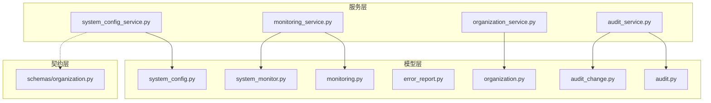
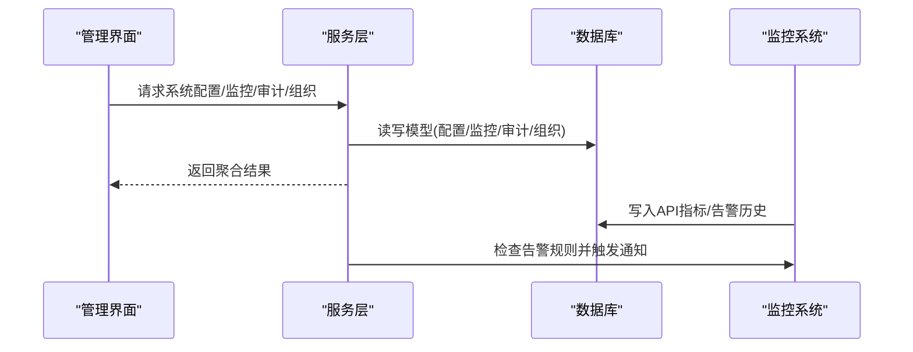
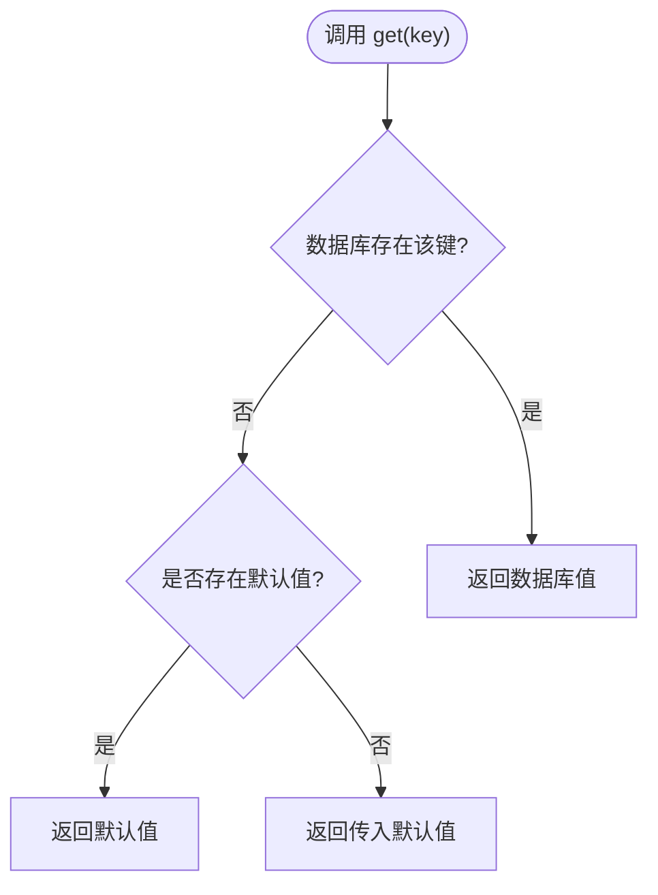
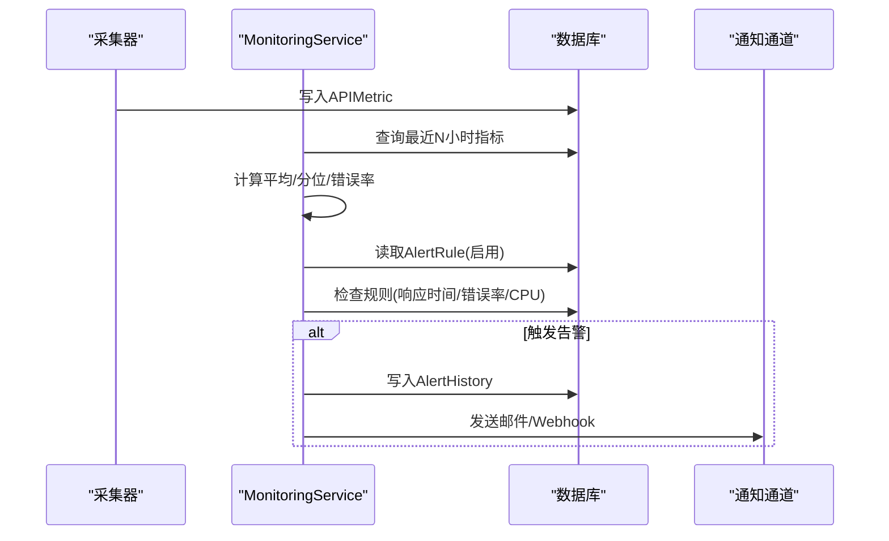
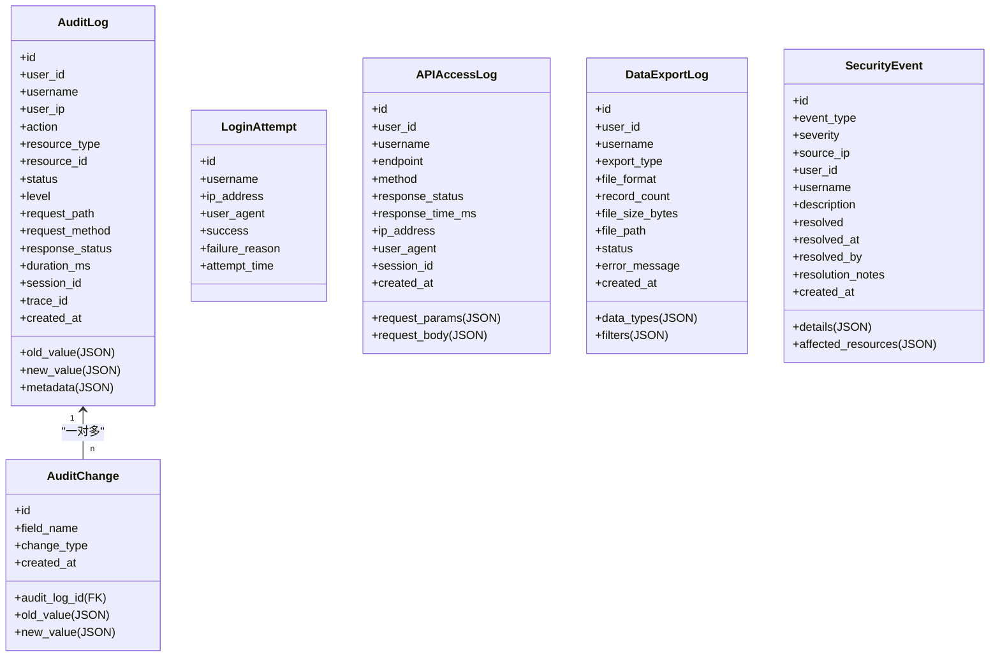
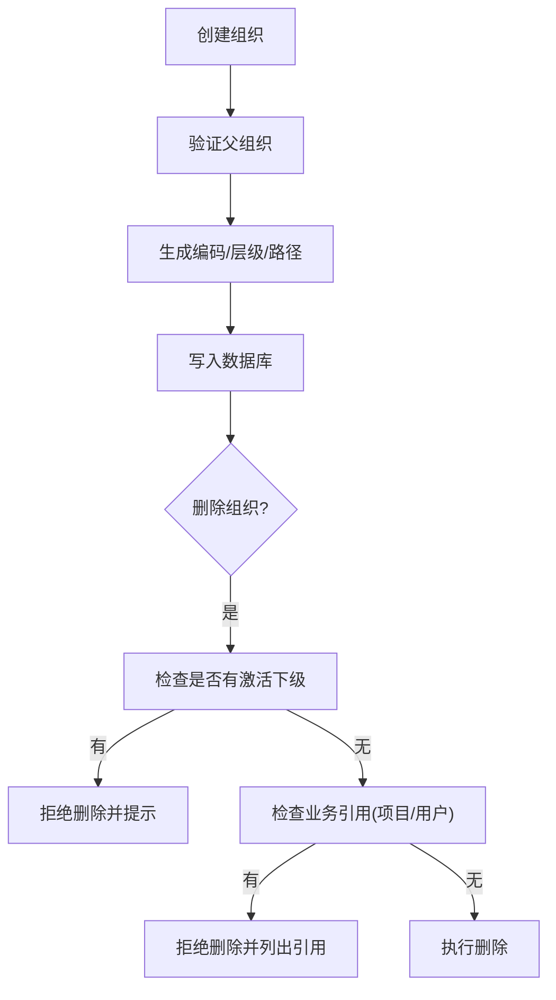
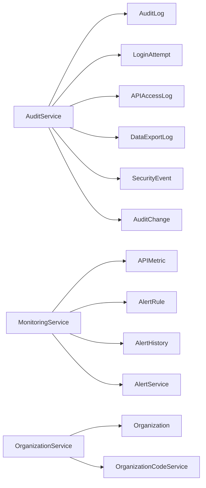

# 系统管理模型

<cite>
**本文引用的文件**
- [backend/app/models/system_config.py](file://backend/app/models/system_config.py)
- [backend/app/models/system_monitor.py](file://backend/app/models/system_monitor.py)
- [backend/app/models/audit.py](file://backend/app/models/audit.py)
- [backend/app/models/error_report.py](file://backend/app/models/error_report.py)
- [backend/app/models/organization.py](file://backend/app/models/organization.py)
- [backend/app/models/audit_change.py](file://backend/app/models/audit_change.py)
- [backend/app/models/monitoring.py](file://backend/app/models/monitoring.py)
- [backend/app/services/system_config_service.py](file://backend/app/services/system_config_service.py)
- [backend/app/services/monitoring_service.py](file://backend/app/services/monitoring_service.py)
- [backend/app/services/organization_service.py](file://backend/app/services/organization_service.py)
- [backend/app/services/audit_service.py](file://backend/app/services/audit_service.py)
- [backend/app/schemas/organization.py](file://backend/app/schemas/organization.py)
</cite>

## 目录
1. [简介](#简介)
2. [项目结构](#项目结构)
3. [核心组件](#核心组件)
4. [架构总览](#架构总览)
5. [详细组件分析](#详细组件分析)
6. [依赖关系分析](#依赖关系分析)
7. [性能考虑](#性能考虑)
8. [故障排查指南](#故障排查指南)
9. [结论](#结论)
10. [附录](#附录)

## 简介
本文件面向系统管理模型，围绕系统配置表、监控表、审计日志表、错误报告表和组织表进行结构化说明。重点解释：
- 系统参数管理（键值配置、默认值与导入导出）
- 性能监控（API指标、资源使用率、告警规则与历史）
- 故障诊断（错误上报、安全事件、登录尝试记录）
- 操作审计追踪（统一审计、变更明细、导出审计）
- 组织层级管理（树形结构、路径前缀、权限边界）
- 系统维护功能（备份策略、版本更新日志）
并提供完整的数据支撑与运维监控示例，帮助前端界面与运维工具高效对接。

## 项目结构
系统管理相关代码主要位于后端 models、services、schemas 三层：
- models：定义数据库表结构与字段约束
- services：封装业务逻辑（配置读写、监控统计、审计写入、组织树构建等）
- schemas：对外接口数据契约（如组织创建/更新/响应）

图表来源
- [backend/app/models/system_config.py:11-51](file://backend/app/models/system_config.py#L11-L51)
- [backend/app/models/system_monitor.py:11-50](file://backend/app/models/system_monitor.py#L11-L50)
- [backend/app/models/audit.py:53-205](file://backend/app/models/audit.py#L53-L205)
- [backend/app/models/error_report.py:8-36](file://backend/app/models/error_report.py#L8-L36)
- [backend/app/models/organization.py:31-78](file://backend/app/models/organization.py#L31-L78)
- [backend/app/models/audit_change.py:13-33](file://backend/app/models/audit_change.py#L13-L33)
- [backend/app/models/monitoring.py:22-84](file://backend/app/models/monitoring.py#L22-L84)
- [backend/app/services/system_config_service.py:68-266](file://backend/app/services/system_config_service.py#L68-L266)
- [backend/app/services/monitoring_service.py:26-312](file://backend/app/services/monitoring_service.py#L26-L312)
- [backend/app/services/organization_service.py:70-521](file://backend/app/services/organization_service.py#L70-L521)
- [backend/app/services/audit_service.py:58-510](file://backend/app/services/audit_service.py#L58-L510)
- [backend/app/schemas/organization.py:9-100](file://backend/app/schemas/organization.py#L9-L100)

章节来源
- [backend/app/models/system_config.py:11-51](file://backend/app/models/system_config.py#L11-L51)
- [backend/app/models/system_monitor.py:11-50](file://backend/app/models/system_monitor.py#L11-L50)
- [backend/app/models/audit.py:53-205](file://backend/app/models/audit.py#L53-L205)
- [backend/app/models/error_report.py:8-36](file://backend/app/models/error_report.py#L8-L36)
- [backend/app/models/organization.py:31-78](file://backend/app/models/organization.py#L31-L78)
- [backend/app/models/audit_change.py:13-33](file://backend/app/models/audit_change.py#L13-L33)
- [backend/app/models/monitoring.py:22-84](file://backend/app/models/monitoring.py#L22-L84)
- [backend/app/services/system_config_service.py:68-266](file://backend/app/services/system_config_service.py#L68-L266)
- [backend/app/services/monitoring_service.py:26-312](file://backend/app/services/monitoring_service.py#L26-L312)
- [backend/app/services/organization_service.py:70-521](file://backend/app/services/organization_service.py#L70-L521)
- [backend/app/services/audit_service.py:58-510](file://backend/app/services/audit_service.py#L58-L510)
- [backend/app/schemas/organization.py:9-100](file://backend/app/schemas/organization.py#L9-L100)

## 核心组件
- 系统配置：SystemConfig 表 + SystemConfigService，支持默认配置、类型转换、导入导出、初始化标记。
- 系统监控：SystemMonitor 表用于主机级指标快照；APIMetric/AlertRule/AlertHistory 表用于 API 性能与告警。
- 审计日志：AuditLog、LoginAttempt、APIAccessLog、DataExportLog、SecurityEvent、AuditChange，覆盖操作、登录、导出、安全事件与字段级变更。
- 错误报告：ErrorReport 表持久化错误上下文与状态流转。
- 组织管理：Organization 表自引用树形结构，配合 path 前缀实现高效子树查询；OrganizationService 提供树构建、下级范围、祖先链、删除保护等能力。

章节来源
- [backend/app/models/system_config.py:11-51](file://backend/app/models/system_config.py#L11-L51)
- [backend/app/models/system_monitor.py:11-50](file://backend/app/models/system_monitor.py#L11-L50)
- [backend/app/models/audit.py:53-205](file://backend/app/models/audit.py#L53-L205)
- [backend/app/models/error_report.py:8-36](file://backend/app/models/error_report.py#L8-L36)
- [backend/app/models/organization.py:31-78](file://backend/app/models/organization.py#L31-L78)
- [backend/app/models/audit_change.py:13-33](file://backend/app/models/audit_change.py#L13-L33)
- [backend/app/models/monitoring.py:22-84](file://backend/app/models/monitoring.py#L22-L84)
- [backend/app/services/system_config_service.py:68-266](file://backend/app/services/system_config_service.py#L68-L266)
- [backend/app/services/monitoring_service.py:26-312](file://backend/app/services/monitoring_service.py#L26-L312)
- [backend/app/services/organization_service.py:70-521](file://backend/app/services/organization_service.py#L70-L521)
- [backend/app/services/audit_service.py:58-510](file://backend/app/services/audit_service.py#L58-L510)

## 架构总览
系统管理以“模型-服务-契约”分层组织，服务层通过 SQLAlchemy 会话访问模型层，对外暴露统一方法；部分服务组合多个模型完成复杂流程（如监控告警触发、组织树构建）。

图表来源
- [backend/app/services/system_config_service.py:68-266](file://backend/app/services/system_config_service.py#L68-L266)
- [backend/app/services/monitoring_service.py:26-312](file://backend/app/services/monitoring_service.py#L26-L312)
- [backend/app/services/audit_service.py:58-510](file://backend/app/services/audit_service.py#L58-L510)
- [backend/app/services/organization_service.py:70-521](file://backend/app/services/organization_service.py#L70-L521)
- [backend/app/models/monitoring.py:22-84](file://backend/app/models/monitoring.py#L22-L84)

## 详细组件分析

### 系统配置管理
- 数据模型：SystemConfig（key/value/description/时间戳），SystemUpdateLog（版本更新记录）。
- 服务能力：
  - 读取：get/get_int/get_bool/get_json，支持默认值回退。
  - 写入：set 自动序列化布尔/JSON，插入或更新。
  - 初始化：initialize_defaults 批量注入默认键值。
  - 导入导出：export_config/import_config 便于迁移与部署。
  - 初始化标记：set_initialized 设置 system_id/organization_id/initialized。
- 典型用途：系统开关、备份策略、异常检测阈值、版本信息等。

图表来源
- [backend/app/services/system_config_service.py:100-127](file://backend/app/services/system_config_service.py#L100-L127)
- [backend/app/models/system_config.py:11-30](file://backend/app/models/system_config.py#L11-L30)

章节来源
- [backend/app/models/system_config.py:11-51](file://backend/app/models/system_config.py#L11-L51)
- [backend/app/services/system_config_service.py:68-266](file://backend/app/services/system_config_service.py#L68-L266)

### 性能监控与告警
- 数据模型：
  - APIMetric：端点、方法、耗时、状态码、时间戳、用户ID、错误消息。
  - AlertRule：规则名、指标类型、阈值、持续时间、通知渠道、开关。
  - AlertHistory：告警触发/解决历史。
  - SystemMonitor：主机级 CPU/内存/磁盘/网络/应用/数据库指标快照。
- 服务能力：
  - 获取API性能统计：平均/分位数/错误率。
  - 端点维度统计：按端点分组聚合。
  - 错误统计：按状态码聚合。
  - 资源统计：CPU/内存/磁盘使用率。
  - 告警检查：基于规则计算并触发，异步发送通知（邮件/Webhook）。
- 运维示例：
  - 近24小时P95/P99延迟、错误率趋势。
  - 高延迟端点Top-N。
  - CPU超阈告警并发送邮件/Webhook。

图表来源
- [backend/app/models/monitoring.py:22-84](file://backend/app/models/monitoring.py#L22-L84)
- [backend/app/services/monitoring_service.py:26-312](file://backend/app/services/monitoring_service.py#L26-L312)

章节来源
- [backend/app/models/system_monitor.py:11-50](file://backend/app/models/system_monitor.py#L11-L50)
- [backend/app/models/monitoring.py:22-84](file://backend/app/models/monitoring.py#L22-L84)
- [backend/app/services/monitoring_service.py:26-312](file://backend/app/services/monitoring_service.py#L26-L312)

### 审计日志与变更追踪
- 数据模型：
  - AuditLog：统一审计入口，包含用户、动作、资源、旧/新值、状态、级别、请求元信息、耗时、会话/追踪ID。
  - LoginAttempt：登录尝试记录（成功/失败原因）。
  - APIAccessLog：API访问日志（端点、方法、参数、响应状态、耗时）。
  - DataExportLog：数据导出审计（类型、格式、记录数、文件大小）。
  - SecurityEvent：安全事件（类型、严重级别、详情、影响资源、处理状态）。
  - AuditChange：字段级变更明细（关联AuditLog）。
- 服务能力：
  - 通用log/log_create/log_update/log_delete/log_read。
  - 登录审计：log_login，同时写LoginAttempt与AuditLog。
  - API访问审计：log_api_access。
  - 导出审计：log_export，并联动AuditLog。
  - 查询与统计：分页查询、多维聚合、今日操作/活跃用户/失败操作/警告数。
- 典型场景：
  - 敏感操作（配置变更、权限调整）全量审计。
  - 登录失败次数与暴力破解识别。
  - 数据导出留痕与合规追溯。

图表来源
- [backend/app/models/audit.py:53-205](file://backend/app/models/audit.py#L53-L205)
- [backend/app/models/audit_change.py:13-33](file://backend/app/models/audit_change.py#L13-L33)
- [backend/app/services/audit_service.py:58-510](file://backend/app/services/audit_service.py#L58-L510)

章节来源
- [backend/app/models/audit.py:53-205](file://backend/app/models/audit.py#L53-L205)
- [backend/app/models/audit_change.py:13-33](file://backend/app/models/audit_change.py#L13-L33)
- [backend/app/services/audit_service.py:58-510](file://backend/app/services/audit_service.py#L58-L510)

### 错误报告机制
- 数据模型：ErrorReport（来源模块、错误类型、消息、堆栈、上下文、严重级别、状态、报告人、解决时间与备注）。
- 设计要点：
  - 持久化替代内存存储，支持后续检索与闭环处理。
  - to_dict 支持上下文JSON解析与驼峰转换，便于前端展示。
- 典型流程：捕获异常 -> 构造上下文 -> 写入ErrorReport -> 根据级别触发告警/通知 -> 工单化处理 -> 关闭并记录备注。

章节来源
- [backend/app/models/error_report.py:8-36](file://backend/app/models/error_report.py#L8-L36)

### 组织层级管理与权限边界
- 数据模型：Organization（名称、编码、父ID、层级、类型、排序、描述、联系人、加密电话、邮箱、地址、区域码、是否启用、路径、创建/更新人）。
- 关键特性：
  - 自引用树形结构 + path 前缀，支持快速子树查询与祖先链解析。
  - 删除保护：存在激活下级单位时禁止删除；硬删前校验业务引用（项目/用户）。
  - 编码生成：基于父编码与前缀自动生成唯一编码。
  - 统计与搜索：按层级分布统计、关键词模糊搜索。
- 权限与数据范围：
  - region_code 可用于数据权限前缀匹配。
  - 结合 RBAC 与数据权限服务，实现组织维度的数据隔离。

图表来源
- [backend/app/models/organization.py:31-78](file://backend/app/models/organization.py#L31-L78)
- [backend/app/services/organization_service.py:82-156](file://backend/app/services/organization_service.py#L82-L156)
- [backend/app/services/organization_service.py:351-398](file://backend/app/services/organization_service.py#L351-L398)

章节来源
- [backend/app/models/organization.py:31-78](file://backend/app/models/organization.py#L31-L78)
- [backend/app/services/organization_service.py:70-521](file://backend/app/services/organization_service.py#L70-L521)
- [backend/app/schemas/organization.py:9-100](file://backend/app/schemas/organization.py#L9-L100)

## 依赖关系分析
- 模型间依赖：
  - AuditChange 外键关联 AuditLog（级联删除）。
  - Organization 自引用 parent_id，ondelete=CASCADE。
  - Monitoring 中 AlertHistory 外键关联 AlertRule。
- 服务依赖：
  - SystemConfigService 依赖 Base 模型与事务工具 safe_commit。
  - MonitoringService 依赖 psutil、APIMetric/AlertRule/AlertHistory、AlertService。
  - OrganizationService 依赖 Organization、OrganizationCodeService、事务工具。
  - AuditService 依赖多种审计模型与事务工具。
- 外部集成：
  - 告警通知：邮件/Webhook（通过 AlertService）。
  - 系统资源：psutil 获取CPU/内存/磁盘。

图表来源
- [backend/app/services/audit_service.py:58-510](file://backend/app/services/audit_service.py#L58-L510)
- [backend/app/models/audit.py:53-205](file://backend/app/models/audit.py#L53-L205)
- [backend/app/models/audit_change.py:13-33](file://backend/app/models/audit_change.py#L13-L33)
- [backend/app/services/monitoring_service.py:26-312](file://backend/app/services/monitoring_service.py#L26-L312)
- [backend/app/models/monitoring.py:22-84](file://backend/app/models/monitoring.py#L22-L84)
- [backend/app/services/organization_service.py:70-521](file://backend/app/services/organization_service.py#L70-L521)
- [backend/app/models/organization.py:31-78](file://backend/app/models/organization.py#L31-L78)

章节来源
- [backend/app/services/audit_service.py:58-510](file://backend/app/services/audit_service.py#L58-L510)
- [backend/app/services/monitoring_service.py:26-312](file://backend/app/services/monitoring_service.py#L26-L312)
- [backend/app/services/organization_service.py:70-521](file://backend/app/services/organization_service.py#L70-L521)
- [backend/app/models/audit.py:53-205](file://backend/app/models/audit.py#L53-L205)
- [backend/app/models/monitoring.py:22-84](file://backend/app/models/monitoring.py#L22-L84)
- [backend/app/models/organization.py:31-78](file://backend/app/models/organization.py#L31-L78)

## 性能考虑
- 索引优化：
  - 审计日志：user_id+action、created_at、resource_type+resource_id 等多维索引，提升查询效率。
  - 监控指标：timestamp、endpoint、status_code 索引，利于时间窗口与端点聚合。
  - 组织表：name、parent_id、org_type、is_active、level、created_by 索引，加速树查询与筛选。
- 查询策略：
  - 使用 path 前缀匹配组织子树，避免递归遍历。
  - 监控统计采用 SQL 聚合（count/avg/case）减少应用层计算。
- 写入吞吐：
  - 审计与指标写入采用短事务与批量提交（safe_commit），降低锁竞争。
- 资源监控：
  - 使用 psutil 采样系统资源，注意采样间隔与异常兜底。

章节来源
- [backend/app/models/audit.py:53-95](file://backend/app/models/audit.py#L53-L95)
- [backend/app/models/monitoring.py:22-35](file://backend/app/models/monitoring.py#L22-L35)
- [backend/app/models/organization.py:36-43](file://backend/app/models/organization.py#L36-L43)
- [backend/app/services/monitoring_service.py:30-84](file://backend/app/services/monitoring_service.py#L30-L84)
- [backend/app/services/organization_service.py:182-215](file://backend/app/services/organization_service.py#L182-L215)

## 故障排查指南
- 配置问题：
  - 检查 initialized 标志与 system_id/organization_id 是否正确设置。
  - 使用 export_config/import_config 核对配置一致性。
- 监控告警：
  - 查看 AlertRule 是否启用、阈值与持续时间是否合理。
  - 检查 AlertHistory 最近触发记录与通知通道配置。
- 审计回溯：
  - 通过 AuditLog 查询特定用户/动作/资源的时间线。
  - 通过 AuditChange 定位字段级变更差异。
  - 通过 LoginAttempt 排查登录失败与暴力破解。
- 错误上报：
  - 检索 ErrorReport 的 open/in_progress 条目，按 severity 优先级处理。
  - 结合 context 与 stack_trace 定位根因。
- 组织删除：
  - 若被拒绝，检查是否存在激活下级单位或被项目/用户引用，先迁移或清理。

章节来源
- [backend/app/services/system_config_service.py:203-234](file://backend/app/services/system_config_service.py#L203-L234)
- [backend/app/services/monitoring_service.py:183-312](file://backend/app/services/monitoring_service.py#L183-L312)
- [backend/app/services/audit_service.py:275-376](file://backend/app/services/audit_service.py#L275-L376)
- [backend/app/models/error_report.py:8-36](file://backend/app/models/error_report.py#L8-L36)
- [backend/app/services/organization_service.py:351-398](file://backend/app/services/organization_service.py#L351-L398)

## 结论
本系统管理模型以清晰的表结构与完善的服务层封装，提供了从配置管理、性能监控、审计追踪到组织治理的全链路支撑。通过索引优化、事务控制与告警通知机制，兼顾了可观测性、可审计性与可维护性。建议在生产环境持续完善监控指标、告警规则与审计策略，并结合组织数据权限实现精细化管控。

## 附录
- 运维监控示例（基于现有模型与服务）：
  - 近24小时API性能概览：调用 MonitoringService.get_api_performance_stats(hours=24)。
  - 端点Top-N：调用 MonitoringService.get_endpoint_stats(hours=24, limit=20)。
  - 错误分布：调用 MonitoringService.get_error_stats(hours=24)。
  - 资源使用率：调用 MonitoringService.get_resource_stats()。
  - 告警检查：定时任务调用 MonitoringService.check_alerts(db)。
- 审计统计示例：
  - 今日操作/活跃用户/失败操作/警告数：调用 AuditService.get_audit_stats()。
  - 分页查询审计日志：调用 AuditService.query_audit_logs(...)。
- 组织树与统计示例：
  - 获取组织树：调用 OrganizationService.get_organization_tree(root_id=None, include_inactive=False)。
  - 获取下级组织：调用 OrganizationService.get_subordinate_organizations(org_id, include_self=True, include_inactive=False)。
  - 组织统计：调用 OrganizationService.get_statistics(root_id=None)。

章节来源
- [backend/app/services/monitoring_service.py:30-181](file://backend/app/services/monitoring_service.py#L30-L181)
- [backend/app/services/audit_service.py:275-376](file://backend/app/services/audit_service.py#L275-L376)
- [backend/app/services/organization_service.py:182-437](file://backend/app/services/organization_service.py#L182-L437)