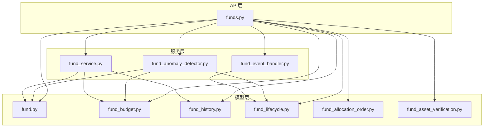
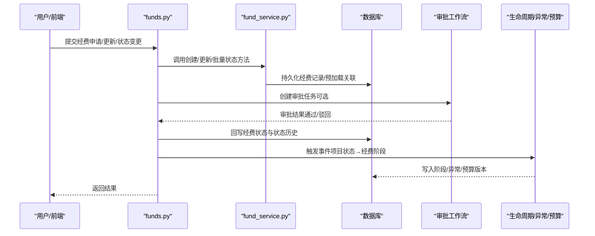
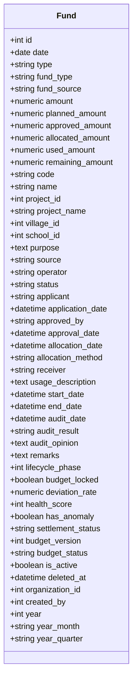
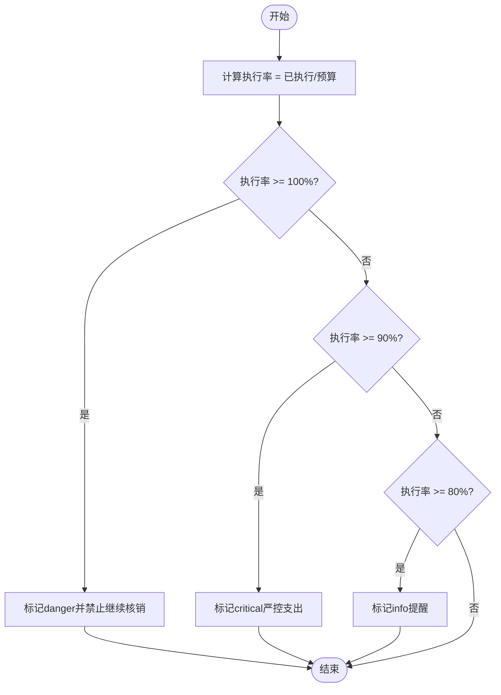
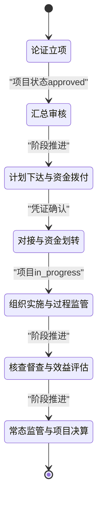
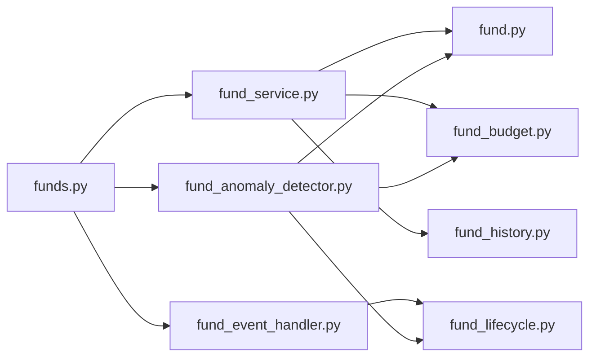
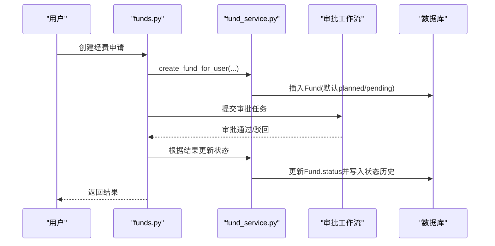
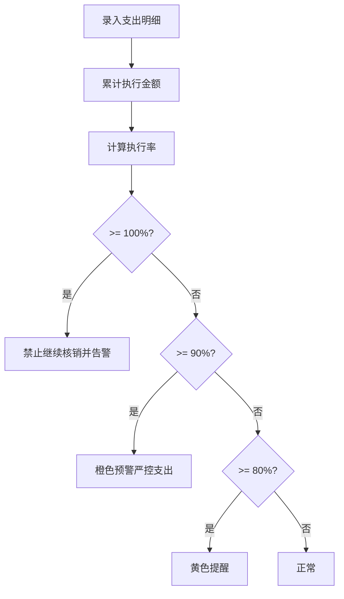
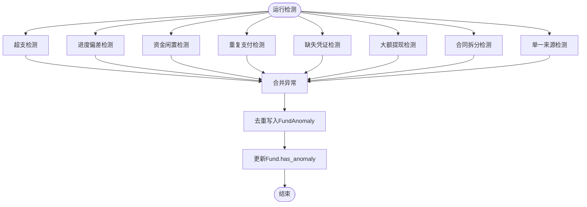
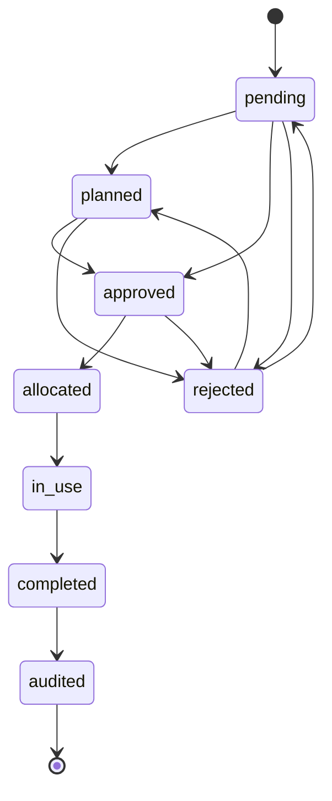

# 经费管理模型

<cite>
**本文引用的文件**
- [backend/app/models/fund.py](file://backend/app/models/fund.py)
- [backend/app/models/fund_budget.py](file://backend/app/models/fund_budget.py)
- [backend/app/models/fund_history.py](file://backend/app/models/fund_history.py)
- [backend/app/models/fund_lifecycle.py](file://backend/app/models/fund_lifecycle.py)
- [backend/app/models/fund_allocation_order.py](file://backend/app/models/fund_allocation_order.py)
- [backend/app/models/fund_asset_verification.py](file://backend/app/models/fund_asset_verification.py)
- [backend/app/services/fund_service.py](file://backend/app/services/fund_service.py)
- [backend/app/services/fund_event_handler.py](file://backend/app/services/fund_event_handler.py)
- [backend/app/services/fund_anomaly_detector.py](file://backend/app/services/fund_anomaly_detector.py)
- [backend/app/api/v1/funds.py](file://backend/app/api/v1/funds.py)
- [backend/app/schemas/fund.py](file://backend/app/schemas/fund.py)
</cite>

## 目录
1. [简介](#简介)
2. [项目结构](#项目结构)
3. [核心组件](#核心组件)
4. [架构总览](#架构总览)
5. [详细组件分析](#详细组件分析)
6. [依赖关系分析](#依赖关系分析)
7. [性能与优化](#性能与优化)
8. [故障排查指南](#故障排查指南)
9. [结论](#结论)
10. [附录：业务流程图与关键查询](#附录业务流程图与关键查询)

## 简介
本文件围绕“经费管理”领域，系统化说明经费主表、预算表、历史记录表、生命周期表、拨款订单表与资产核查表的数据设计；阐述经费流转过程、预算控制机制与资金审批流程；给出财务报表生成、资产登记盘点与合规性检查的数据方案；并说明经费状态机、异常检测与预警机制的实现。文档面向技术与非技术读者，提供从概念到代码的完整映射。

## 项目结构
经费管理相关能力分布在以下层次：
- 数据模型层：定义经费主表、预算/明细、历史审计、生命周期阶段、拨款指令、资产核验等实体及索引。
- 服务层：封装状态机校验、事件联动（项目状态→经费阶段）、异常检测引擎、健康度计算等。
- API层：暴露经费创建、更新、批量状态变更、附件上传、统计聚合等接口，并与审批工作流集成。
- 模式层：Pydantic Schema 用于请求/响应校验与序列化。

图表来源
- [backend/app/api/v1/funds.py:1-200](file://backend/app/api/v1/funds.py#L1-L200)
- [backend/app/services/fund_service.py:1-304](file://backend/app/services/fund_service.py#L1-L304)
- [backend/app/services/fund_event_handler.py:1-97](file://backend/app/services/fund_event_handler.py#L1-L97)
- [backend/app/services/fund_anomaly_detector.py:1-333](file://backend/app/services/fund_anomaly_detector.py#L1-L333)
- [backend/app/models/fund.py:1-299](file://backend/app/models/fund.py#L1-L299)
- [backend/app/models/fund_budget.py:1-202](file://backend/app/models/fund_budget.py#L1-L202)
- [backend/app/models/fund_history.py:1-159](file://backend/app/models/fund_history.py#L1-L159)
- [backend/app/models/fund_lifecycle.py:1-449](file://backend/app/models/fund_lifecycle.py#L1-L449)
- [backend/app/models/fund_allocation_order.py:1-113](file://backend/app/models/fund_allocation_order.py#L1-L113)
- [backend/app/models/fund_asset_verification.py:1-60](file://backend/app/models/fund_asset_verification.py#L1-L60)

章节来源
- [backend/app/api/v1/funds.py:1-200](file://backend/app/api/v1/funds.py#L1-L200)
- [backend/app/services/fund_service.py:1-304](file://backend/app/services/fund_service.py#L1-L304)

## 核心组件
- 经费主表（Fund）：承载申请、计划、批准、拨付、使用、完成、审计等全量字段，内置时间聚合冗余字段（year/year_month/year_quarter）以支撑高效统计。
- 预算与明细（FundBudget/FundTransaction）：年度预算科目与执行明细台账，支持预算执行率与预警阈值。
- 历史记录（FundStatusHistory/FundFieldChange/FundOperationLog）：状态变更、字段修改、操作日志，满足审计可追溯。
- 生命周期（ProjectFundPhase/BudgetBaseline/FundTransferVoucher/FundContract/FundAnomaly/FundSettlement/BudgetVersion）：七阶段跟踪、基线锁定、划转凭证、合同付款、异常记录、决算与版本快照。
- 拨款订单（FundAllocationOrder/AllocationOrderItem）：指标文数字化解析与拆分下发至下级单位虚拟账户，跟踪下达、接收、确认。
- 资产核查（FundAssetVerification）：项目完工后对已付款与转固资产价值进行比对校验，作为销号前置条件。

章节来源
- [backend/app/models/fund.py:61-167](file://backend/app/models/fund.py#L61-L167)
- [backend/app/models/fund_budget.py:19-141](file://backend/app/models/fund_budget.py#L19-L141)
- [backend/app/models/fund_history.py:18-159](file://backend/app/models/fund_history.py#L18-L159)
- [backend/app/models/fund_lifecycle.py:119-449](file://backend/app/models/fund_lifecycle.py#L119-L449)
- [backend/app/models/fund_allocation_order.py:23-113](file://backend/app/models/fund_allocation_order.py#L23-L113)
- [backend/app/models/fund_asset_verification.py:22-60](file://backend/app/models/fund_asset_verification.py#L22-L60)

## 架构总览
经费管理采用“模型-服务-API”分层架构，结合事件驱动与规则引擎：
- API层负责入参校验、权限与数据范围过滤、调用服务层，并将结果返回。
- 服务层实现业务编排：状态机校验、事件联动、异常检测、事务控制。
- 模型层通过SQLAlchemy ORM定义表结构与索引，配合事件监听自动填充统计字段。

图表来源
- [backend/app/api/v1/funds.py:50-200](file://backend/app/api/v1/funds.py#L50-L200)
- [backend/app/services/fund_service.py:114-288](file://backend/app/services/fund_service.py#L114-L288)
- [backend/app/services/fund_event_handler.py:27-80](file://backend/app/services/fund_event_handler.py#L27-L80)
- [backend/app/services/fund_anomaly_detector.py:34-93](file://backend/app/services/fund_anomaly_detector.py#L34-L93)

## 详细组件分析

### 经费主表（Fund）与时间聚合优化
- 关键字段：金额系列（申请/计划/批准/拨付/使用/剩余）、编号、名称、类型/来源、项目/村/学校关联、经办人、状态、审批信息、使用说明、起止时间、审计信息、备注。
- 风控与健康：生命周期阶段、预算锁定标志、支出偏差率、健康分、是否异常、决算状态、预算版本/状态。
- 软删除与组织隔离：is_active/deleted_at、organization_id/created_by。
- 时间聚合冗余：year/year_month/year_quarter，由before_insert/before_update事件自动填充，避免GROUP BY时函数计算导致的全表扫描。
- 索引策略：单列与复合索引覆盖常见过滤与聚合场景，含year_month+status、year_quarter+type、year+source等。

图表来源
- [backend/app/models/fund.py:61-167](file://backend/app/models/fund.py#L61-L167)
- [backend/app/models/fund.py:172-227](file://backend/app/models/fund.py#L172-L227)

章节来源
- [backend/app/models/fund.py:61-167](file://backend/app/models/fund.py#L61-L167)
- [backend/app/models/fund.py:172-227](file://backend/app/models/fund.py#L172-L227)

### 预算表与明细（FundBudget / FundTransaction）
- 年度预算：按年度与科目维度记录预算金额、执行金额、所属村/单位、描述与备注，并提供剩余金额与执行率属性。
- 支出明细：关联经费/项目/村/预算，记录金额、科目、用途、日期、凭证号与附件、经办/报销/审批人、状态等。
- 预算预警：基于执行率阈值（80%黄、90%橙、100%红）生成预警列表，供上层拦截或提示。

图表来源
- [backend/app/models/fund_budget.py:143-202](file://backend/app/models/fund_budget.py#L143-L202)

章节来源
- [backend/app/models/fund_budget.py:19-141](file://backend/app/models/fund_budget.py#L19-L141)
- [backend/app/models/fund_budget.py:143-202](file://backend/app/models/fund_budget.py#L143-L202)

### 历史记录表（状态/字段/操作日志）
- 状态历史：记录from_status→to_status、操作人、时间、备注。
- 字段变更：记录具体字段名、旧值/新值（JSON）、修改人与时间。
- 操作日志：记录附件上传/删除等操作类型与详情。

章节来源
- [backend/app/models/fund_history.py:18-159](file://backend/app/models/fund_history.py#L18-L159)

### 生命周期表（七阶段跟踪、基线、凭证、合同、异常、决算、版本）
- 阶段跟踪：为每个项目初始化7个阶段，依据项目状态推进并同步经费lifecycle_phase。
- 预算基线：在阶段2锁定预算快照，便于后续偏差对比。
- 资金划转凭证：记录方向、金额、账户、日期、状态、协同扩展字段。
- 合同与付款：合同编号唯一，记录甲乙双方、金额、进度、截止日期、状态；付款明细关联WBS/任务。
- 异常检测：统一存储异常类型、严重程度、描述、解决状态与处理人/时间。
- 决算：汇总预算/支出/结余，审核意见、绩效评分与等级，资产联动校验字段。
- 预算版本：记录每次预算调整/批准的快照与原因。

图表来源
- [backend/app/models/fund_lifecycle.py:24-44](file://backend/app/models/fund_lifecycle.py#L24-L44)
- [backend/app/services/fund_event_handler.py:17-65](file://backend/app/services/fund_event_handler.py#L17-L65)

章节来源
- [backend/app/models/fund_lifecycle.py:119-449](file://backend/app/models/fund_lifecycle.py#L119-L449)
- [backend/app/services/fund_event_handler.py:27-80](file://backend/app/services/fund_event_handler.py#L27-L80)

### 拨款订单表（指令与明细）
- 指令头：关联经费/项目、指标文编号、总金额、目标单位/账户、生效/失效日期、状态、接收时间与接收人。
- 指令明细：拆分至下级单位，记录分配金额、账户、状态、划转/确认时间。

章节来源
- [backend/app/models/fund_allocation_order.py:23-113](file://backend/app/models/fund_allocation_order.py#L23-L113)

### 资产核查表（已付款 vs 转固资产）
- 记录项目ID、关联决算ID、已付款总额、转固资产价值、差额与差异率、校验状态、校验人与时间、意见与备注。
- 作为项目销号的前置校验条件。

章节来源
- [backend/app/models/fund_asset_verification.py:22-60](file://backend/app/models/fund_asset_verification.py#L22-L60)

## 依赖关系分析
- API → 服务：funds.py调用fund_service进行CRUD与批量状态更新；集成审批工作流创建/完结任务。
- 服务 → 模型：fund_service读写Fund；fund_event_handler维护ProjectFundPhase并同步Fund.lifecycle_phase；fund_anomaly_detector读取Fund/FundTransaction并写入FundAnomaly。
- 模型间关系：Fund与Project/Village/School/Organization外键关联；生命周期表与Fund/Project双向关联；预算/明细与Fund/Project/Village/Budget关联；资产核查与Project/Settlement关联。

图表来源
- [backend/app/api/v1/funds.py:1-200](file://backend/app/api/v1/funds.py#L1-L200)
- [backend/app/services/fund_service.py:1-304](file://backend/app/services/fund_service.py#L1-L304)
- [backend/app/services/fund_event_handler.py:1-97](file://backend/app/services/fund_event_handler.py#L1-L97)
- [backend/app/services/fund_anomaly_detector.py:1-333](file://backend/app/services/fund_anomaly_detector.py#L1-L333)

章节来源
- [backend/app/api/v1/funds.py:1-200](file://backend/app/api/v1/funds.py#L1-L200)
- [backend/app/services/fund_service.py:1-304](file://backend/app/services/fund_service.py#L1-L304)

## 性能与优化
- 统计聚合优化：Fund表内year/year_month/year_quarter冗余字段配合复合索引，直接命中GROUP BY，避免strftime导致的慢查询。
- 查询优化：列表与详情使用joinedload/selectinload预加载关联，减少N+1；count单独构建轻量语句提升计数性能。
- 批量更新：使用SQLAlchemy bulk update进行批量状态变更，避免循环逐条更新。
- 预算预警：阈值判断在服务层完成，避免重复计算。

章节来源
- [backend/app/models/fund.py:66-86](file://backend/app/models/fund.py#L66-L86)
- [backend/app/models/fund.py:199-227](file://backend/app/models/fund.py#L199-L227)
- [backend/app/services/fund_service.py:55-99](file://backend/app/services/fund_service.py#L55-L99)
- [backend/app/services/fund_service.py:245-288](file://backend/app/services/fund_service.py#L245-L288)

## 故障排查指南
- 非法状态流转：批量状态更新会校验当前状态→目标状态的合法性，若存在非法流转将整体拒绝并抛出错误，便于快速定位问题记录。
- 预算超支拦截：当执行率达到100%时，系统应阻止继续核销；可通过预算预警接口查看具体科目与比例。
- 异常未解决：Fund.has_anomaly为true表示存在未解决异常，需查看FundAnomaly记录并按类型处理（超支、偏差、闲置、重复支付、缺失凭证、大额提现、合同拆分、单一来源）。
- 资产核查失败：项目决算前需确保FundAssetVerification状态为passed，否则不允许销号。

章节来源
- [backend/app/services/fund_service.py:245-288](file://backend/app/services/fund_service.py#L245-L288)
- [backend/app/models/fund_budget.py:143-202](file://backend/app/models/fund_budget.py#L143-L202)
- [backend/app/services/fund_anomaly_detector.py:34-93](file://backend/app/services/fund_anomaly_detector.py#L34-L93)
- [backend/app/models/fund_asset_verification.py:22-60](file://backend/app/models/fund_asset_verification.py#L22-L60)

## 结论
本经费管理模型通过严谨的数据设计与服务编排，实现了从申请、审批、拨付、使用到决算的全链路闭环；借助时间聚合冗余与索引优化保障报表性能；通过预算预警与异常检测引擎强化合规与风控；并以资产核查作为销号前置条件，确保资金与资产一致。该体系既满足财务审计要求，又兼顾了可扩展性与可维护性。

## 附录：业务流程图与关键查询

### 经费流转与审批流程图

图表来源
- [backend/app/api/v1/funds.py:75-200](file://backend/app/api/v1/funds.py#L75-L200)
- [backend/app/services/fund_service.py:132-185](file://backend/app/services/fund_service.py#L132-L185)

### 预算控制机制（阈值与拦截）

图表来源
- [backend/app/models/fund_budget.py:143-202](file://backend/app/models/fund_budget.py#L143-L202)

### 异常检测与预警机制

图表来源
- [backend/app/services/fund_anomaly_detector.py:34-93](file://backend/app/services/fund_anomaly_detector.py#L34-L93)
- [backend/app/services/fund_anomaly_detector.py:99-315](file://backend/app/services/fund_anomaly_detector.py#L99-L315)

### 财务报表生成（数据方案）
- 月度/季度/年度汇总：利用year/year_month/year_quarter字段与对应索引，按年/月/季/类型/来源分组聚合金额。
- 预算执行报表：按年度与科目维度，汇总预算金额与执行金额，计算执行率与剩余金额。
- 项目决算报表：汇总项目总预算、总支出、总结余，关联决算状态与绩效评分。
- 资产核对报表：对比已付款总额与转固资产价值，输出差额与差异率。

章节来源
- [backend/app/models/fund.py:156-161](file://backend/app/models/fund.py#L156-L161)
- [backend/app/models/fund_budget.py:19-76](file://backend/app/models/fund_budget.py#L19-L76)
- [backend/app/models/fund_lifecycle.py:364-409](file://backend/app/models/fund_lifecycle.py#L364-L409)
- [backend/app/models/fund_asset_verification.py:22-60](file://backend/app/models/fund_asset_verification.py#L22-L60)

### 资产登记盘点（数据方案）
- 项目完工后生成FundAssetVerification记录，自动汇总已付款总额与转固资产价值，计算差额与差异率。
- 校验通过后更新决算表的资产校验字段，允许进入销号流程。

章节来源
- [backend/app/models/fund_asset_verification.py:22-60](file://backend/app/models/fund_asset_verification.py#L22-L60)
- [backend/app/models/fund_lifecycle.py:364-409](file://backend/app/models/fund_lifecycle.py#L364-L409)

### 合规性检查（数据方案）
- 预算超支：执行率≥100%禁止核销。
- 进度偏差：偏差率超过阈值触发异常。
- 资金闲置：拨付后长期未动用触发闲置异常。
- 重复支付：同一凭证号或多笔相近金额/日期触发重复支付异常。
- 缺失凭证：已使用但无支出明细记录。
- 大额提现：单笔支出超过阈值。
- 合同拆分：短期内多笔小额合同指向同一供应商。
- 单一来源：所有合同指向同一供应商。

章节来源
- [backend/app/models/fund_budget.py:143-202](file://backend/app/models/fund_budget.py#L143-L202)
- [backend/app/services/fund_anomaly_detector.py:99-315](file://backend/app/services/fund_anomaly_detector.py#L99-L315)

### 经费状态机（合法流转）

图表来源
- [backend/app/services/fund_service.py:230-243](file://backend/app/services/fund_service.py#L230-L243)

章节来源
- [backend/app/services/fund_service.py:230-243](file://backend/app/services/fund_service.py#L230-L243)

### 关键查询示例（思路）
- 月度经费汇总：按year_month与status分组，聚合amount/used_amount等字段，利用year_month+status索引加速。
- 预算执行率：按year与category分组，计算executed_amount/budget_amount，筛选接近或达到阈值的科目。
- 异常清单：查询FundAnomaly中未解决的记录，按severity排序，导出待办。
- 资产核对：查询FundAssetVerification中未通过的项目，输出差额与差异率。

[以上为查询思路与数据来源说明，具体SQL可根据实际数据库方言编写]