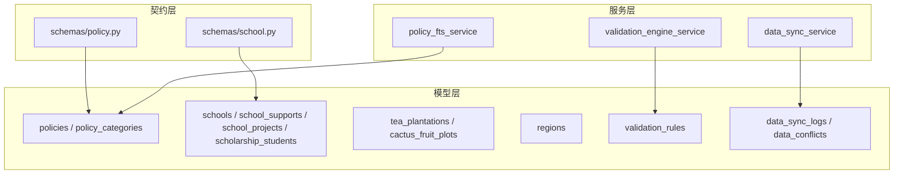
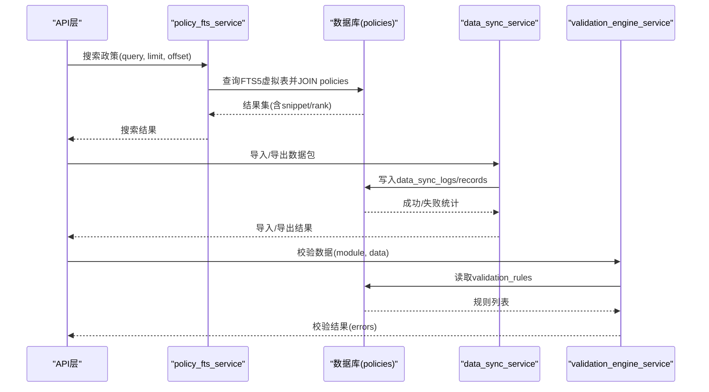
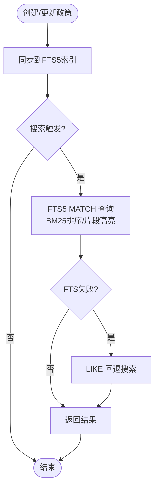
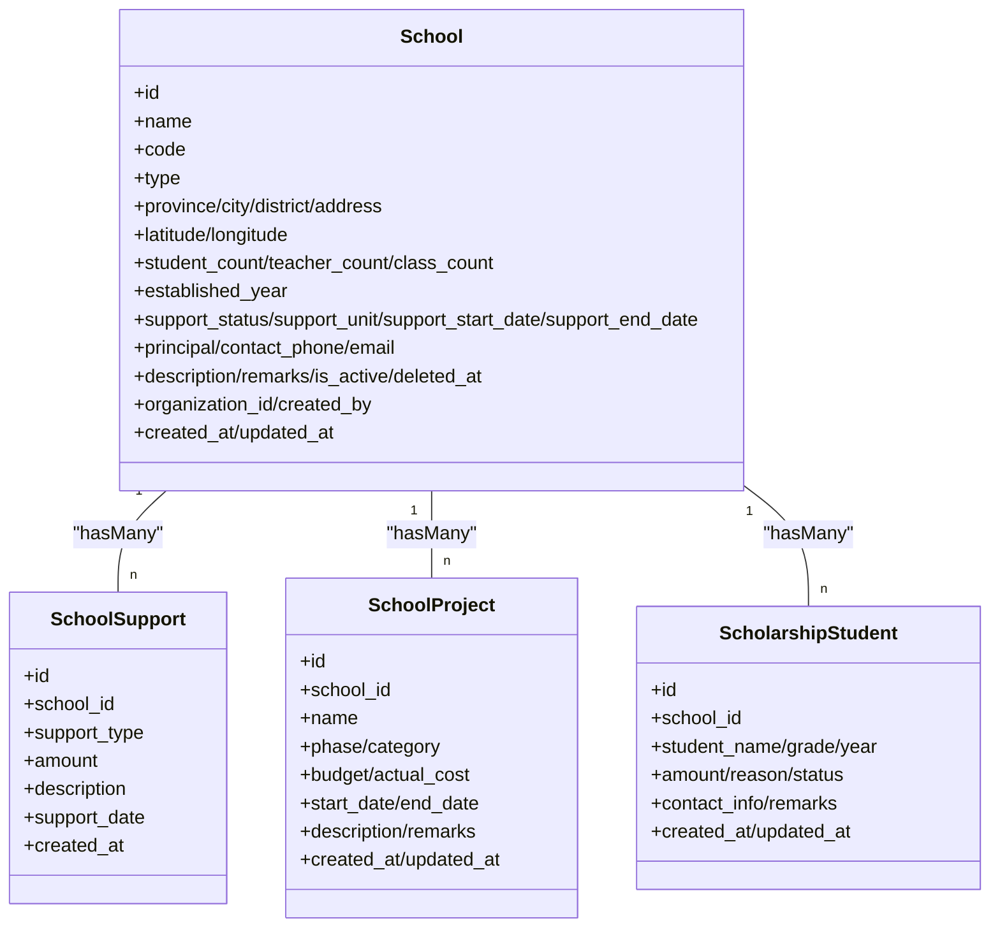
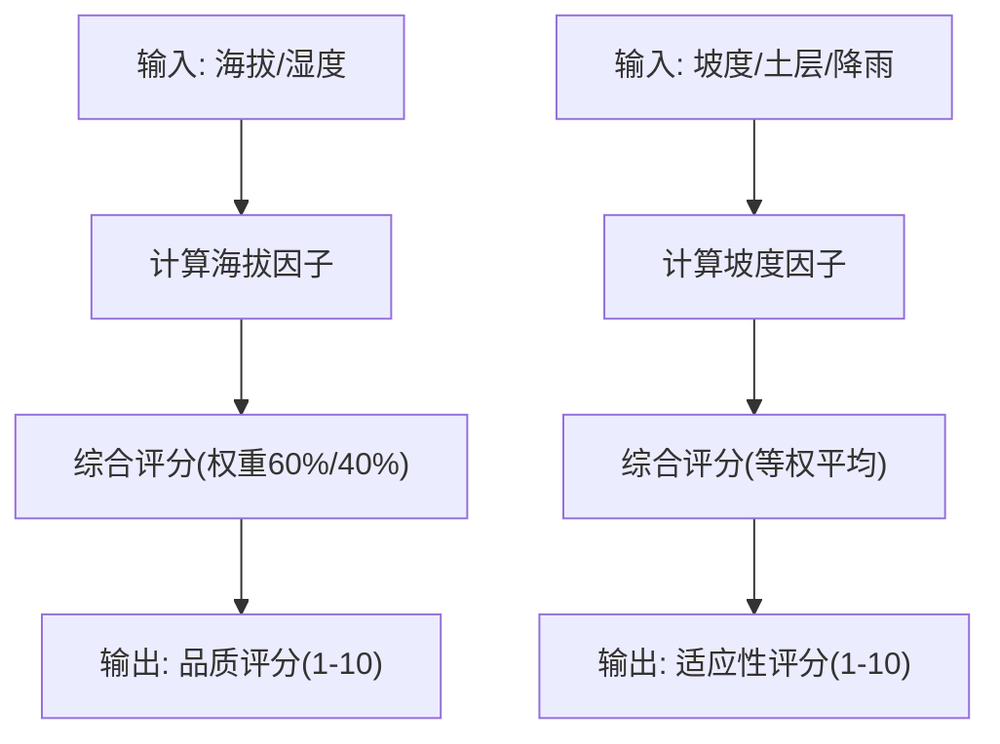
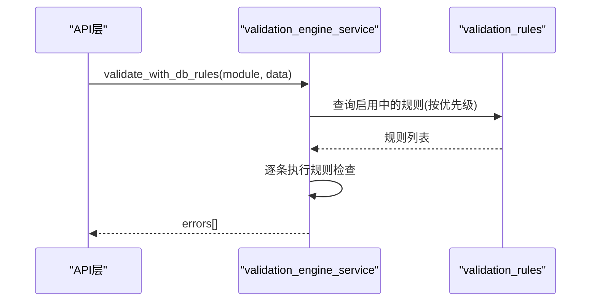
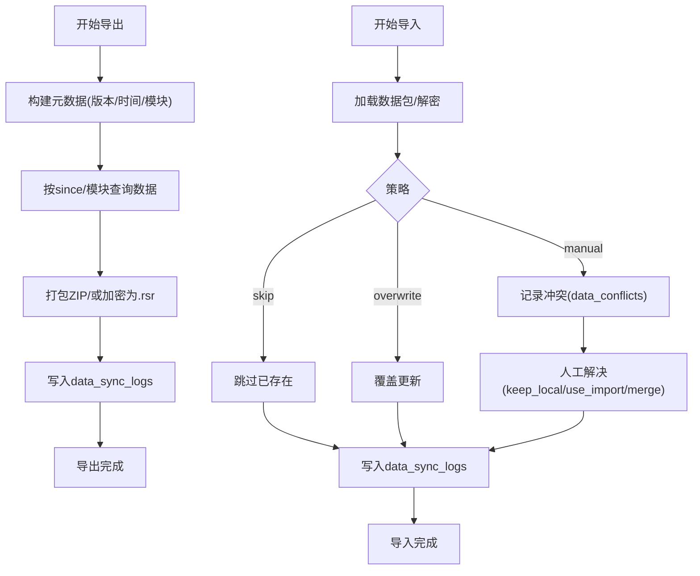
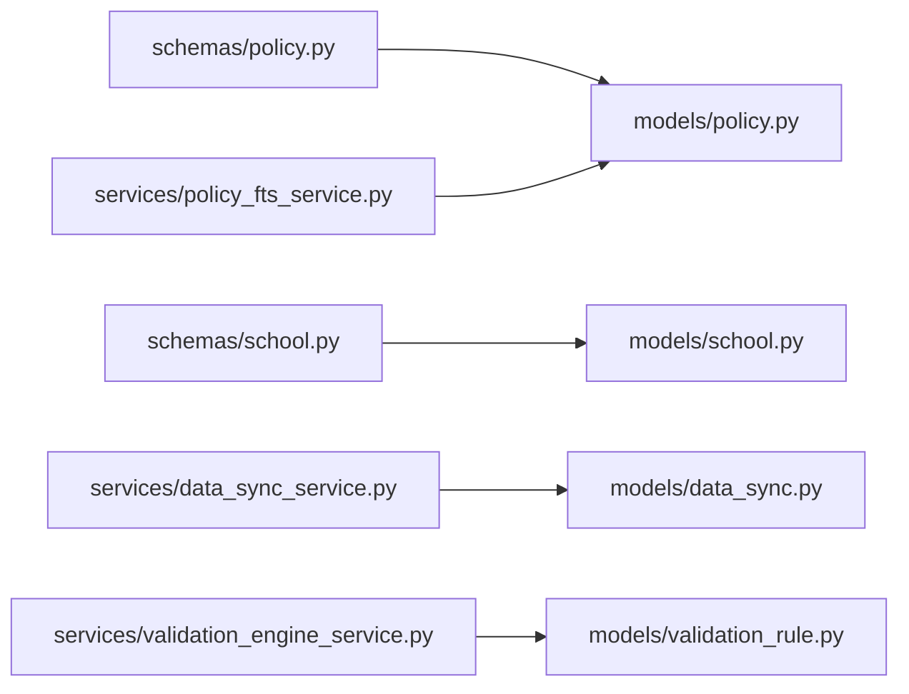

# 辅助业务模型

<cite>
**本文引用的文件**
- [backend/app/models/policy.py](file://backend/app/models/policy.py)
- [backend/app/models/school.py](file://backend/app/models/school.py)
- [backend/app/models/industry.py](file://backend/app/models/industry.py)
- [backend/app/models/region.py](file://backend/app/models/region.py)
- [backend/app/models/validation_rule.py](file://backend/app/models/validation_rule.py)
- [backend/app/services/policy_fts_service.py](file://backend/app/services/policy_fts_service.py)
- [backend/app/services/data_sync_service.py](file://backend/app/services/data_sync_service.py)
- [backend/app/services/validation_engine_service.py](file://backend/app/services/validation_engine_service.py)
- [backend/app/schemas/policy.py](file://backend/app/schemas/policy.py)
- [backend/app/schemas/school.py](file://backend/app/schemas/school.py)
- [backend/app/models/data_sync.py](file://backend/app/models/data_sync.py)
</cite>

## 目录
1. [简介](#简介)
2. [项目结构](#项目结构)
3. [核心组件](#核心组件)
4. [架构总览](#架构总览)
5. [详细组件分析](#详细组件分析)
6. [依赖关系分析](#依赖关系分析)
7. [性能考虑](#性能考虑)
8. [故障排查指南](#故障排查指南)
9. [结论](#结论)
10. [附录](#附录)

## 简介
本文件聚焦“辅助业务模型”的设计与实现，覆盖政策法规表、学校信息表、行业分类表（特色产业）、地区字典表和验证规则表的结构设计；阐述政策发布管理、学校帮扶信息与基础数据字典的业务逻辑；说明数据验证规则、分类标签管理与搜索索引优化；并给出数据同步机制、版本控制与数据完整性保证方案，以及参考数据结构与业务集成示例。

## 项目结构
围绕辅助业务的核心代码分布在以下位置：
- 数据模型层：policy、school、industry、region、validation_rule、data_sync
- 服务层：policy_fts_service（全文检索）、data_sync_service（导入导出与冲突处理）、validation_engine_service（动态校验）
- 接口契约层：schemas/policy.py、schemas/school.py（Pydantic 请求/响应模型）
- 迁移与索引：alembic versions（索引与字段演进）

图表来源
- [backend/app/models/policy.py:91-145](file://backend/app/models/policy.py#L91-L145)
- [backend/app/models/school.py:43-124](file://backend/app/models/school.py#L43-L124)
- [backend/app/models/industry.py:16-54](file://backend/app/models/industry.py#L16-L54)
- [backend/app/models/region.py:11-32](file://backend/app/models/region.py#L11-L32)
- [backend/app/models/validation_rule.py:31-55](file://backend/app/models/validation_rule.py#L31-L55)
- [backend/app/services/policy_fts_service.py:17-143](file://backend/app/services/policy_fts_service.py#L17-L143)
- [backend/app/services/data_sync_service.py:87-800](file://backend/app/services/data_sync_service.py#L87-L800)
- [backend/app/services/validation_engine_service.py:26-217](file://backend/app/services/validation_engine_service.py#L26-L217)
- [backend/app/schemas/policy.py:47-159](file://backend/app/schemas/policy.py#L47-L159)
- [backend/app/schemas/school.py:11-89](file://backend/app/schemas/school.py#L11-L89)
- [backend/app/models/data_sync.py:8-72](file://backend/app/models/data_sync.py#L8-L72)

章节来源
- [backend/app/models/policy.py:91-145](file://backend/app/models/policy.py#L91-L145)
- [backend/app/models/school.py:43-124](file://backend/app/models/school.py#L43-L124)
- [backend/app/models/industry.py:16-54](file://backend/app/models/industry.py#L16-L54)
- [backend/app/models/region.py:11-32](file://backend/app/models/region.py#L11-L32)
- [backend/app/models/validation_rule.py:31-55](file://backend/app/models/validation_rule.py#L31-L55)
- [backend/app/services/policy_fts_service.py:17-143](file://backend/app/services/policy_fts_service.py#L17-L143)
- [backend/app/services/data_sync_service.py:87-800](file://backend/app/services/data_sync_service.py#L87-L800)
- [backend/app/services/validation_engine_service.py:26-217](file://backend/app/services/validation_engine_service.py#L26-L217)
- [backend/app/schemas/policy.py:47-159](file://backend/app/schemas/policy.py#L47-L159)
- [backend/app/schemas/school.py:11-89](file://backend/app/schemas/school.py#L11-L89)
- [backend/app/models/data_sync.py:8-72](file://backend/app/models/data_sync.py#L8-L72)

## 核心组件
- 政策法规表（policies）：记录法规标题、文号、级别、类别、发布机关、发布日期、生效日期、摘要、全文、关键词、附件、状态、重要标记、组织归属、创建人、浏览量、下载量等，并提供多级索引以支撑筛选与排序。
- 政策分类表（policy_categories）：支持树形分类（parent_id），启用标记与排序。
- 学校信息表（schools）：包含基本信息、地理位置、师生规模、帮扶状态与单位、联系方式（电话加密存储）、软删除时间戳、组织与创建人等。
- 学校帮扶记录（school_supports）：按学校维度记录帮扶类型、金额、描述与日期。
- 学校帮扶项目（school_projects）：助学兴教项目阶段、预算与实际投入、起止时间等。
- 资助学生（scholarship_students）：年度资助、金额、原因、状态、联系方式等。
- 特色产业模型（industry）：茶园与刺梨园实体，关联村庄，提供品质/适应性评分计算。
- 地区字典表（regions）：省市区三级区划编码、层级、父级编码、中心经纬度与几何文本。
- 验证规则表（validation_rules）：模块+字段+规则类型+参数+错误提示+优先级，支持运行时加载执行。
- 数据同步日志与冲突（data_sync_logs、data_conflicts）：记录导出/导入过程、统计与冲突详情。

章节来源
- [backend/app/models/policy.py:38-145](file://backend/app/models/policy.py#L38-L145)
- [backend/app/models/school.py:43-375](file://backend/app/models/school.py#L43-L375)
- [backend/app/models/industry.py:16-181](file://backend/app/models/industry.py#L16-L181)
- [backend/app/models/region.py:11-40](file://backend/app/models/region.py#L11-L40)
- [backend/app/models/validation_rule.py:15-55](file://backend/app/models/validation_rule.py#L15-L55)
- [backend/app/models/data_sync.py:8-72](file://backend/app/models/data_sync.py#L8-L72)

## 架构总览
辅助业务由“模型 + 服务 + 契约”三层构成：
- 模型层定义持久化结构与索引策略。
- 服务层封装复杂业务：政策全文检索、数据同步与冲突解决、动态校验引擎。
- 契约层通过 Pydantic Schema 统一输入输出格式，屏蔽底层差异。

图表来源
- [backend/app/services/policy_fts_service.py:39-107](file://backend/app/services/policy_fts_service.py#L39-L107)
- [backend/app/services/data_sync_service.py:128-395](file://backend/app/services/data_sync_service.py#L128-L395)
- [backend/app/services/validation_engine_service.py:93-123](file://backend/app/services/validation_engine_service.py#L93-L123)

## 详细组件分析

### 政策法规表与发布管理
- 结构设计要点
  - 主键 id、唯一文号 code、标题 title、级别 level、类别 category、发布机关 issuing_authority、发布日期 issue_date、生效日期 effective_date、摘要 summary、全文 content、关键词 keywords、附件 file_path/file_size/file_type、状态 status、是否重要 is_important、活跃标记 is_active、组织归属 organization_id、创建人 created_by、浏览/下载次数 view_count/download_count、时间戳 created_at/updated_at。
  - 索引：status、level、category、issue_date、status+level 复合索引，提升筛选与排序效率。
- 发布管理流程
  - 创建/更新后调用 FTS 同步，确保全文检索可用。
  - 删除时从 FTS 移除，避免脏数据。
  - 搜索使用 FTS5 BM25 排序，失败回退 LIKE 模糊匹配。

图表来源
- [backend/app/services/policy_fts_service.py:17-143](file://backend/app/services/policy_fts_service.py#L17-L143)
- [backend/app/models/policy.py:91-145](file://backend/app/models/policy.py#L91-L145)

章节来源
- [backend/app/models/policy.py:91-145](file://backend/app/models/policy.py#L91-L145)
- [backend/app/services/policy_fts_service.py:17-143](file://backend/app/services/policy_fts_service.py#L17-L143)
- [backend/app/schemas/policy.py:47-159](file://backend/app/schemas/policy.py#L47-L159)

### 学校信息表与帮扶业务
- 结构设计要点
  - 学校主表 schools：名称、编码、类型、级别、地址、经纬度、师生规模、建校年份、帮扶状态/单位/起止日期、校长、联系电话（透明加密）、邮箱、简介、备注、活跃标记、软删除时间、组织与创建人、时间戳。
  - 帮扶记录 school_supports：按学校维度记录帮扶类型、金额、描述、日期。
  - 帮扶项目 school_projects：阶段、类别、预算与实际投入、起止时间、描述与备注。
  - 资助学生 scholarship_students：年度资助、金额、原因、状态、联系方式、备注。
- 业务逻辑
  - 帮扶状态枚举：active/inactive/completed。
  - 学校 to_dict 兼容 snake_case 与 camelCase，便于前端消费。
  - 敏感字段（如电话）采用透明加密存储。

图表来源
- [backend/app/models/school.py:43-375](file://backend/app/models/school.py#L43-L375)

章节来源
- [backend/app/models/school.py:43-375](file://backend/app/models/school.py#L43-L375)
- [backend/app/schemas/school.py:11-89](file://backend/app/schemas/school.py#L11-L89)

### 行业分类表（特色产业）
- 数据结构
  - 茶园 tea_plantations：名称、面积、品种、海拔、年产量、采收年份、喀斯特土壤湿度指数、品质评分、备注。
  - 刺梨园 cactus_fruit_plots：名称、面积、种植密度、年产量、采收年份、喀斯特适应性评分、坡度、土层厚度、年降雨量、备注。
- 算法与指标
  - 茶叶品质评分：基于海拔与土壤湿度的加权计算。
  - 刺梨适应性评分：基于坡度、土层厚度与年降雨量的综合评估。

图表来源
- [backend/app/models/industry.py:55-143](file://backend/app/models/industry.py#L55-L143)
- [backend/app/models/industry.py:146-176](file://backend/app/models/industry.py#L146-L176)

章节来源
- [backend/app/models/industry.py:16-181](file://backend/app/models/industry.py#L16-L181)

### 地区字典表
- 数据结构
  - regions：名称、编码（唯一）、层级（province/prefecture/county）、父级编码、中心经度/纬度、GeoJSON geometry。
- 用途
  - 作为省市区下拉选择与地理聚合的基础字典。
  - 配合学校/村庄等实体的区域字段进行筛选与展示。

章节来源
- [backend/app/models/region.py:11-40](file://backend/app/models/region.py#L11-L40)

### 验证规则表与校验引擎
- 数据结构
  - validation_rules：模块、字段、规则类型（必填/正数/非负/日期格式/文件类型/长度/范围/正则/跨字段/枚举值）、参数（JSON）、错误提示、描述、是否启用、优先级、审计字段。
- 校验引擎
  - 支持从数据库加载规则并按优先级执行，返回错误列表。
  - 内置多种规则类型检查，可扩展自定义验证器。

图表来源
- [backend/app/services/validation_engine_service.py:93-123](file://backend/app/services/validation_engine_service.py#L93-L123)
- [backend/app/models/validation_rule.py:15-55](file://backend/app/models/validation_rule.py#L15-L55)

章节来源
- [backend/app/models/validation_rule.py:15-55](file://backend/app/models/validation_rule.py#L15-L55)
- [backend/app/services/validation_engine_service.py:26-217](file://backend/app/services/validation_engine_service.py#L26-L217)

### 数据同步机制、版本控制与完整性保证
- 导出/导入
  - 增量导出：按 since 时间过滤 updated_at/created_at，生成 ZIP 数据包，可选打包上传文件。
  - 导入策略：skip/overwrite/manual（记录冲突）。
  - 加密导出/导入：AES-256-GCM + PBKDF2-SHA256，生成 .rrs 文件，附带元数据与哈希。
- 白名单与安全
  - 表名白名单与列名校验，防止 SQL 注入。
  - 敏感表禁止导入（users/machine_codes/audit_logs）。
- 日志与冲突
  - data_sync_logs：记录每次同步的元数据、统计与详情。
  - data_conflicts：记录冲突明细与解决方式（keep_local/use_import/merge）。
- 版本控制
  - 数据包元数据包含版本号、导出时间、模块列表、文件哈希等，便于追溯与比对。

图表来源
- [backend/app/services/data_sync_service.py:128-395](file://backend/app/services/data_sync_service.py#L128-L395)
- [backend/app/services/data_sync_service.py:576-800](file://backend/app/services/data_sync_service.py#L576-L800)
- [backend/app/models/data_sync.py:8-72](file://backend/app/models/data_sync.py#L8-L72)

章节来源
- [backend/app/services/data_sync_service.py:128-395](file://backend/app/services/data_sync_service.py#L128-L395)
- [backend/app/services/data_sync_service.py:576-800](file://backend/app/services/data_sync_service.py#L576-L800)
- [backend/app/models/data_sync.py:8-72](file://backend/app/models/data_sync.py#L8-L72)

## 依赖关系分析
- 模型间依赖
  - school_supports/school_projects/scholarship_students 均外键关联 schools。
  - tea_plantations/cactus_fruit_plots 关联 villages（延迟注册避免循环引用）。
  - policies 独立，但通过 FTS5 虚拟表与 policies 表双向映射。
- 服务与模型依赖
  - policy_fts_service 依赖 policies 表与 FTS5 虚拟表。
  - data_sync_service 依赖 data_sync_logs/data_conflicts 及业务表白名单。
  - validation_engine_service 依赖 validation_rules 表。
- 契约与模型耦合
  - schemas/policy.py 与 models/policy.py 字段对齐，提供统一的输入输出结构。
  - schemas/school.py 与 models/school.py 字段对齐，提供学校相关请求/响应结构。

图表来源
- [backend/app/schemas/policy.py:47-159](file://backend/app/schemas/policy.py#L47-L159)
- [backend/app/schemas/school.py:11-89](file://backend/app/schemas/school.py#L11-L89)
- [backend/app/services/policy_fts_service.py:17-143](file://backend/app/services/policy_fts_service.py#L17-L143)
- [backend/app/services/data_sync_service.py:87-800](file://backend/app/services/data_sync_service.py#L87-L800)
- [backend/app/services/validation_engine_service.py:26-217](file://backend/app/services/validation_engine_service.py#L26-L217)
- [backend/app/models/policy.py:91-145](file://backend/app/models/policy.py#L91-L145)
- [backend/app/models/school.py:43-375](file://backend/app/models/school.py#L43-L375)
- [backend/app/models/data_sync.py:8-72](file://backend/app/models/data_sync.py#L8-L72)
- [backend/app/models/validation_rule.py:15-55](file://backend/app/models/validation_rule.py#L15-L55)

章节来源
- [backend/app/schemas/policy.py:47-159](file://backend/app/schemas/policy.py#L47-L159)
- [backend/app/schemas/school.py:11-89](file://backend/app/schemas/school.py#L11-L89)
- [backend/app/services/policy_fts_service.py:17-143](file://backend/app/services/policy_fts_service.py#L17-L143)
- [backend/app/services/data_sync_service.py:87-800](file://backend/app/services/data_sync_service.py#L87-L800)
- [backend/app/services/validation_engine_service.py:26-217](file://backend/app/services/validation_engine_service.py#L26-L217)
- [backend/app/models/policy.py:91-145](file://backend/app/models/policy.py#L91-L145)
- [backend/app/models/school.py:43-375](file://backend/app/models/school.py#L43-L375)
- [backend/app/models/data_sync.py:8-72](file://backend/app/models/data_sync.py#L8-L72)
- [backend/app/models/validation_rule.py:15-55](file://backend/app/models/validation_rule.py#L15-L55)

## 性能考虑
- 索引优化
  - policies：status、level、category、issue_date、status+level 复合索引，加速筛选与排序。
  - schools：name、type、support_status、district、is_active、support_unit 索引，提升列表与条件查询性能。
  - regions：level、parent_code、code 唯一索引，保障字典查询与层级遍历效率。
  - industry：village_id、harvest_year 索引，支持按村与年份聚合。
- 全文检索
  - FTS5 虚拟表 + BM25 排序，提供高亮片段；失败自动回退 LIKE 模糊匹配，保障可用性。
- 数据同步
  - 增量导出基于 updated_at/created_at 过滤，减少数据传输量。
  - 导入过程分表处理，异常隔离，避免单表失败影响整体。
- 校验引擎
  - 规则按优先级执行，减少不必要的校验开销；可缓存规则以提升高频场景性能。

[本节为通用性能建议，不直接分析具体文件]

## 故障排查指南
- 政策搜索无结果
  - 检查 FTS5 虚拟表是否存在与同步是否成功；查看日志中 FTS 同步失败的警告。
  - 若 FTS 失败，确认回退 LIKE 搜索是否命中。
- 导入失败或冲突
  - 查看 data_sync_logs 的状态与 details，定位失败表与错误信息。
  - 在 data_conflicts 中查看冲突明细，选择 keep_local/use_import/merge 解决。
- 校验失败
  - 检查 validation_rules 中对应模块与字段的规则配置是否正确（参数、优先级、是否启用）。
  - 使用校验引擎的错误列表定位具体字段与规则。

章节来源
- [backend/app/services/policy_fts_service.py:75-93](file://backend/app/services/policy_fts_service.py#L75-L93)
- [backend/app/services/data_sync_service.py:304-395](file://backend/app/services/data_sync_service.py#L304-L395)
- [backend/app/services/validation_engine_service.py:93-123](file://backend/app/services/validation_engine_service.py#L93-L123)

## 结论
本系统围绕辅助业务构建了完善的数据模型与服务能力：政策法规表与 FTS5 全文检索支撑高效发布与搜索；学校信息表与帮扶记录形成完整的帮扶业务闭环；特色产业模型提供量化评估指标；地区字典表提供基础地理维度；验证规则表与引擎实现灵活的数据质量控制；数据同步服务提供安全可靠的导入导出与冲突处理能力。通过合理的索引设计与分层架构，系统在功能性与性能之间取得良好平衡。

[本节为总结性内容，不直接分析具体文件]

## 附录

### 参考数据结构（字段清单）
- 政策法规表（policies）
  - 标识：id、code（唯一）
  - 分类与级别：category、level
  - 发布信息：issuing_authority、issue_date、effective_date
  - 内容：title、summary、content、keywords
  - 附件：file_path、file_size、file_type
  - 状态与标记：status、is_important、is_active
  - 归属与审计：organization_id、created_by、view_count、download_count
  - 时间戳：created_at、updated_at
- 学校信息表（schools）
  - 标识：id、code（唯一）
  - 基本信息：name、type、level、address、province/city/district、经纬度
  - 规模：student_count、teacher_count、class_count、established_year
  - 帮扶：support_status、support_unit、support_start_date、support_end_date
  - 联系：principal、contact_phone（加密）、email
  - 其他：description、remarks、is_active、deleted_at
  - 归属与审计：organization_id、created_by
  - 时间戳：created_at、updated_at
- 地区字典表（regions）
  - 标识：id、code（唯一）
  - 名称与层级：name、level、parent_code
  - 地理：center_lng、center_lat、geometry_text
- 验证规则表（validation_rules）
  - 模块与字段：module、field
  - 规则：rule_type、params（JSON）
  - 提示与描述：error_message、description
  - 控制：is_active、priority
  - 审计：created_at、updated_at、created_by

章节来源
- [backend/app/models/policy.py:91-145](file://backend/app/models/policy.py#L91-L145)
- [backend/app/models/school.py:43-124](file://backend/app/models/school.py#L43-L124)
- [backend/app/models/region.py:11-40](file://backend/app/models/region.py#L11-L40)
- [backend/app/models/validation_rule.py:31-55](file://backend/app/models/validation_rule.py#L31-L55)

### 业务集成示例（流程说明）
- 政策发布与检索
  - 创建/更新政策后，调用 FTS 同步；用户搜索时优先走 FTS5，失败回退 LIKE。
- 学校帮扶录入
  - 录入学校基础信息；新增帮扶记录与项目；资助学生登记；支持状态流转。
- 数据同步
  - 导出：选择模块与时间范围，生成 ZIP 或加密 .rrs；记录同步日志。
  - 导入：选择策略（skip/overwrite/manual），处理冲突并记录；更新统计。
- 数据校验
  - 在提交前加载模块规则，执行必填、范围、正则、枚举等校验，返回错误列表。

章节来源
- [backend/app/services/policy_fts_service.py:39-107](file://backend/app/services/policy_fts_service.py#L39-L107)
- [backend/app/services/data_sync_service.py:128-395](file://backend/app/services/data_sync_service.py#L128-L395)
- [backend/app/services/validation_engine_service.py:93-123](file://backend/app/services/validation_engine_service.py#L93-L123)