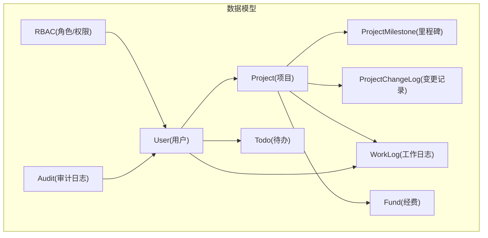
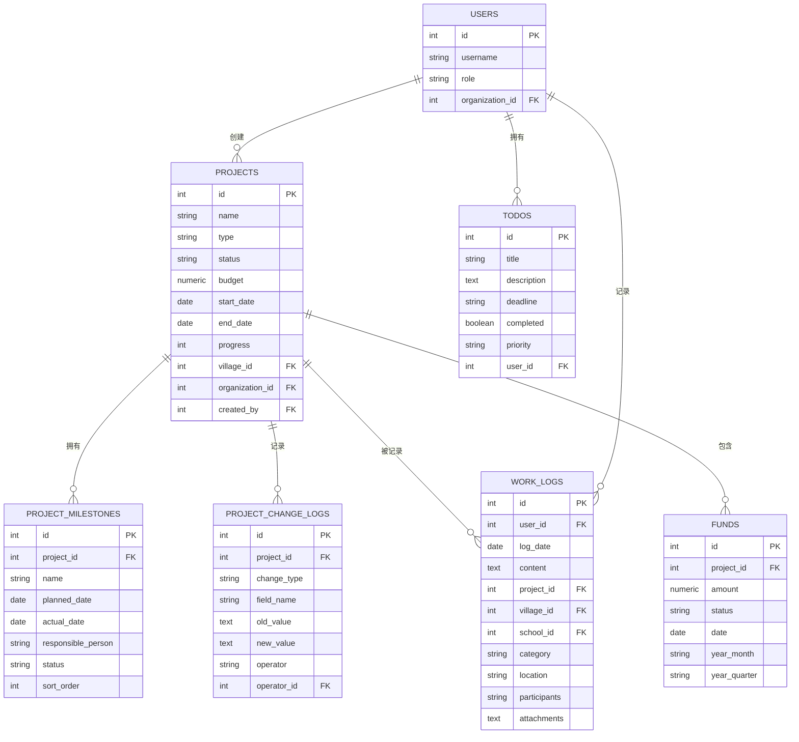
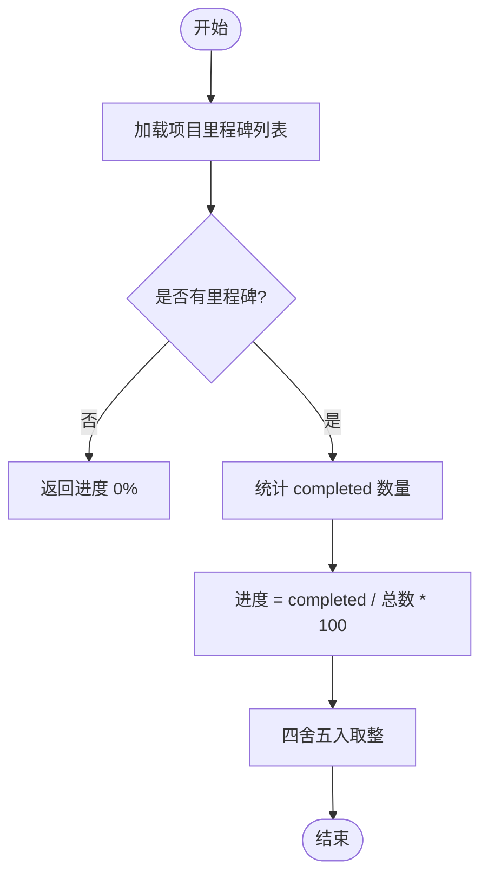
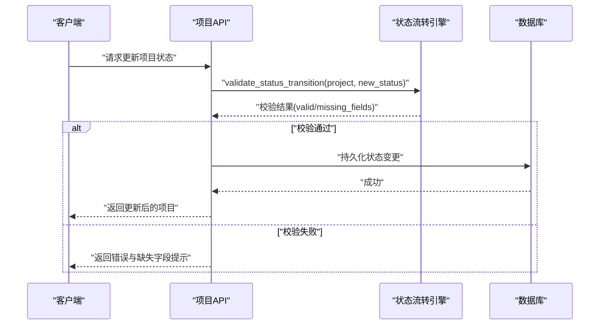
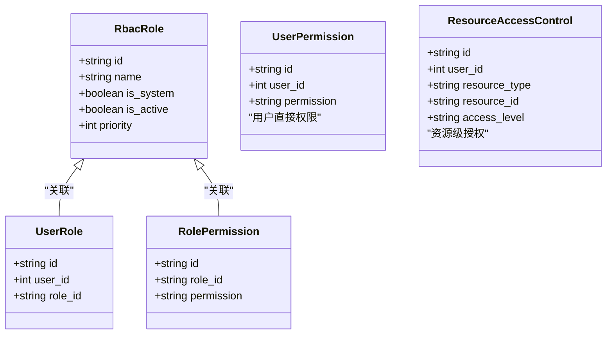
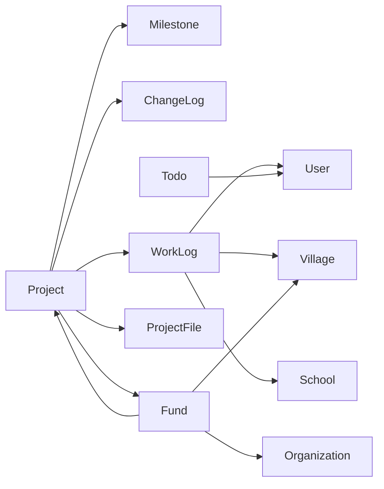

# 项目管理模型

<cite>
**本文引用的文件**
- [backend/app/models/project.py](file://backend/app/models/project.py)
- [backend/app/models/project_milestone.py](file://backend/app/models/project_milestone.py)
- [backend/app/models/work_log.py](file://backend/app/models/work_log.py)
- [backend/app/models/todo.py](file://backend/app/models/todo.py)
- [backend/app/schemas/project.py](file://backend/app/schemas/project.py)
- [backend/app/models/base.py](file://backend/app/models/base.py)
- [backend/app/models/audit.py](file://backend/app/models/audit.py)
- [backend/app/models/rbac.py](file://backend/app/models/rbac.py)
- [backend/app/models/fund.py](file://backend/app/models/fund.py)
- [backend/app/models/user.py](file://backend/app/models/user.py)
</cite>

## 目录
1. [简介](#简介)
2. [项目结构](#项目结构)
3. [核心组件](#核心组件)
4. [架构总览](#架构总览)
5. [详细组件分析](#详细组件分析)
6. [依赖关系分析](#依赖关系分析)
7. [性能考虑](#性能考虑)
8. [故障排查指南](#故障排查指南)
9. [结论](#结论)
10. [附录：常用查询与分析SQL示例](#附录常用查询与分析sql示例)

## 简介
本文件围绕“乡村振兴系统”中的项目管理域，系统化梳理项目主表、里程碑表、工作日志表与待办事项表的数据设计，解释项目生命周期状态管理、里程碑跟踪机制与工作进度统计逻辑，并说明项目关联关系、文档附件管理、协作功能的数据设计。同时给出权限控制、数据隔离与审计日志记录机制的实现要点，并提供完整的关系图、业务流程图以及常用查询与分析的SQL示例，帮助读者快速理解与落地使用。

## 项目结构
本项目采用分层与领域内聚的组织方式：
- 数据模型层（models）：定义项目、里程碑、变更日志、工作日志、待办、经费、用户、RBAC、审计等实体及索引策略。
- 接口契约层（schemas）：定义项目创建、更新、响应等Pydantic校验模型。
- 服务与API层：通过路由与服务编排业务逻辑（本文件聚焦数据模型与流程）。
- 基础能力：基类提供时间戳、软删除、加密字段等通用能力。

图表来源
- [backend/app/models/project.py:47-175](file://backend/app/models/project.py#L47-L175)
- [backend/app/models/project_milestone.py:12-104](file://backend/app/models/project_milestone.py#L12-L104)
- [backend/app/models/work_log.py:10-79](file://backend/app/models/work_log.py#L10-L79)
- [backend/app/models/todo.py:18-72](file://backend/app/models/todo.py#L18-L72)
- [backend/app/models/fund.py:61-167](file://backend/app/models/fund.py#L61-L167)
- [backend/app/models/user.py:26-90](file://backend/app/models/user.py#L26-L90)
- [backend/app/models/rbac.py:31-219](file://backend/app/models/rbac.py#L31-L219)
- [backend/app/models/audit.py:53-95](file://backend/app/models/audit.py#L53-L95)

章节来源
- [backend/app/models/project.py:47-175](file://backend/app/models/project.py#L47-L175)
- [backend/app/models/base.py:19-185](file://backend/app/models/base.py#L19-L185)

## 核心组件
- 项目主表（projects）：承载项目基本信息、预算、日期、进度、负责人、资金信息等，具备完善的索引以支撑多维查询与报表。
- 里程碑表（project_milestones）：按阶段拆分目标，支持计划与实际完成时间、责任人、排序与状态。
- 变更记录表（project_change_logs）：记录项目关键属性的变更历史，便于追溯与审计。
- 工作日志表（work_logs）：记录帮扶工作过程，可关联项目、村庄、学校，支持分类、地点、参与人与附件。
- 待办事项表（todos）：面向个人任务管理，支持优先级、截止日期与完成状态。
- 经费表（funds）：与项目强关联，记录申请、批准、拨付、使用与决算等全生命周期资金流。
- 用户与权限（users, rbac_*）：基于角色的访问控制与资源级授权，支持菜单与白名单配置。
- 审计日志（audit_logs, security_events, api_access_logs, data_export_logs）：统一记录操作与安全事件，支持多维度检索。

章节来源
- [backend/app/models/project.py:47-175](file://backend/app/models/project.py#L47-L175)
- [backend/app/models/project_milestone.py:12-104](file://backend/app/models/project_milestone.py#L12-L104)
- [backend/app/models/work_log.py:10-79](file://backend/app/models/work_log.py#L10-L79)
- [backend/app/models/todo.py:18-72](file://backend/app/models/todo.py#L18-L72)
- [backend/app/models/fund.py:61-167](file://backend/app/models/fund.py#L61-L167)
- [backend/app/models/rbac.py:31-219](file://backend/app/models/rbac.py#L31-L219)
- [backend/app/models/audit.py:53-95](file://backend/app/models/audit.py#L53-L95)

## 架构总览
下图展示项目域的核心实体关系与关键交互：

图表来源
- [backend/app/models/project.py:47-175](file://backend/app/models/project.py#L47-L175)
- [backend/app/models/project_milestone.py:12-104](file://backend/app/models/project_milestone.py#L12-L104)
- [backend/app/models/work_log.py:10-79](file://backend/app/models/work_log.py#L10-L79)
- [backend/app/models/todo.py:18-72](file://backend/app/models/todo.py#L18-L72)
- [backend/app/models/fund.py:61-167](file://backend/app/models/fund.py#L61-L167)
- [backend/app/models/user.py:26-90](file://backend/app/models/user.py#L26-L90)

## 详细组件分析

### 项目主表（projects）
- 关键字段
  - 标识与元信息：id、name、code、type、status、description、objectives
  - 组织与归属：organization_id、village_id（指向帮扶村）
  - 时间与进度：start_date、end_date、actual_start_date、actual_end_date、progress
  - 预算与成本：budget、actual_cost、invested_amount
  - 人员与联系：leader、contact、responsible_unit、responsible_person、contact_phone（透明加密）
  - 资金信息：fund_source、付款/收款账户与联系人等
  - 扩展字段：urgency_level、contract_number、is_delayed、delay_reason、expected_benefits、achievements、tags、remarks
  - 软删标记：is_active、deleted_at
  - 审计字段：created_by、created_at、updated_at
- 索引策略
  - 单列索引：status、type、village_id、organization_id、created_by、start_date、end_date、is_active
  - 复合索引：status+type、status+created_at、village_id+status、organization_id+status、status+village_id
- 关系
  - 一对多：tasks（project_tasks）、funds（funds）
  - 一对一/懒加载：village、organization
- 设计要点
  - 针对常见过滤与排序建立复合索引，提升列表与报表性能
  - 敏感字段（如联系电话）采用透明加密类型，读写自动加解密
  - 软删除保留回收站能力，配合deleted_at计算保留期

章节来源
- [backend/app/models/project.py:47-175](file://backend/app/models/project.py#L47-L175)
- [backend/app/models/base.py:23-46](file://backend/app/models/base.py#L23-L46)

### 里程碑表（project_milestones）与进度计算
- 关键字段：project_id、name、planned_date、actual_date、responsible_person、status、sort_order、created_at、updated_at
- 索引：project_id、status、planned_date
- 进度计算逻辑
  - 根据里程碑完成比例计算项目进度百分比：completed数/总数*100%
  - 适用于看板与报表中“按里程碑驱动”的进度展示
- 状态流转与准入条件
  - 定义合法的状态流转路径与必填字段校验，确保里程碑推进合规
- 与项目的关系
  - 通过project_id与项目绑定，支持按项目维度汇总里程碑完成情况

图表来源
- [backend/app/models/project_milestone.py:181-187](file://backend/app/models/project_milestone.py#L181-L187)

章节来源
- [backend/app/models/project_milestone.py:12-104](file://backend/app/models/project_milestone.py#L12-L104)
- [backend/app/models/project_milestone.py:181-187](file://backend/app/models/project_milestone.py#L181-L187)

### 变更记录表（project_change_logs）
- 作用：记录项目关键属性变更（状态、预算、进度、人员等），用于审计与回溯
- 关键字段：project_id、change_type、field_name、old_value、new_value、operator、operator_id、created_at
- 索引：project_id、change_type、created_at
- 与项目关系：通过project_id关联，支持按项目维度拉取变更历史

章节来源
- [backend/app/models/project_milestone.py:60-104](file://backend/app/models/project_milestone.py#L60-L104)

### 工作日志表（work_logs）
- 作用：记录帮扶工作过程，支持关联项目、村庄、学校，便于工作量统计与绩效评估
- 关键字段：user_id、log_date、content、project_id、village_id、school_id、category、location、participants、attachments
- 索引：user_id、project_id、village_id、log_date、user_id+log_date
- 兼容字段：title、work_date、log_type（hybrid_property）
- 协作意义：通过project_id将日志归集到项目下，形成项目工作轨迹；通过village_id/school_id实现跨域协作追踪

章节来源
- [backend/app/models/work_log.py:10-79](file://backend/app/models/work_log.py#L10-L79)

### 待办事项表（todos）
- 作用：个人任务管理，支持优先级、截止日期与完成状态
- 关键字段：title、description、deadline、completed、priority、user_id、created_at、updated_at
- 索引：user_id+completed、priority、user_id
- 协作意义：可作为项目任务的细化与提醒载体，结合项目上下文进行任务派发与跟踪

章节来源
- [backend/app/models/todo.py:18-72](file://backend/app/models/todo.py#L18-L72)

### 项目附件管理（project_files）
- 作用：按阶段分类存储项目文档与图片，便于归档与检索
- 关键字段：project_id、category（research/implementation/acceptance/photo）、filename、filepath、file_size、uploaded_by、created_at
- 索引：project_id、category
- 与项目关系：通过project_id关联，支持按项目维度列出附件

章节来源
- [backend/app/models/project.py:278-320](file://backend/app/models/project.py#L278-L320)

### 项目生命周期状态管理
- 状态枚举：draft、pending、approved、in_progress、completed、cancelled
- 流转规则：
  - 定义合法的路径映射，防止非法跳转
  - 各阶段设置准入条件（如提交审批需填写必要字段，启动需实际开始日期，完成需实际结束日期与成果）
- 校验函数：validate_status_transition 负责校验当前状态到目标状态的合法性与必填字段

图表来源
- [backend/app/models/project_milestone.py:110-178](file://backend/app/models/project_milestone.py#L110-L178)

章节来源
- [backend/app/models/project_milestone.py:110-178](file://backend/app/models/project_milestone.py#L110-L178)

### 工作进度统计逻辑
- 里程碑驱动：通过calculate_milestone_progress计算项目整体进度百分比
- 日志辅助：可通过work_logs统计项目周期内的活动频次与时长，作为进度佐证
- 经费联动：funds表记录预算与实际花费，结合项目进度进行投入产出分析

章节来源
- [backend/app/models/project_milestone.py:181-187](file://backend/app/models/project_milestone.py#L181-L187)
- [backend/app/models/work_log.py:10-79](file://backend/app/models/work_log.py#L10-L79)
- [backend/app/models/fund.py:61-167](file://backend/app/models/fund.py#L61-L167)

### 项目关联关系与协作功能数据设计
- 项目与村庄：通过village_id关联帮扶村，支持按村维度筛选项目
- 项目与组织：通过organization_id实现组织级数据隔离与权限控制
- 项目与经费：通过project_id关联，支持项目维度的资金流水与预算执行分析
- 项目与日志：通过project_id关联，形成项目工作轨迹
- 项目与任务：通过project_tasks（在项目中定义）管理子任务
- 项目与附件：通过project_files按阶段归档文档

章节来源
- [backend/app/models/project.py:47-175](file://backend/app/models/project.py#L47-L175)
- [backend/app/models/fund.py:61-167](file://backend/app/models/fund.py#L61-L167)
- [backend/app/models/work_log.py:10-79](file://backend/app/models/work_log.py#L10-L79)

### 权限控制、数据隔离与审计日志
- 权限模型（RBAC）
  - 角色与权限：rbac_roles、rbac_role_permissions
  - 用户角色：rbac_user_roles
  - 用户直接权限：rbac_user_permissions
  - 资源访问控制：rbac_resource_access（细粒度到资源ID）
  - 访问日志：rbac_access_logs
- 数据隔离
  - 用户数据范围：data_scope（all/org/org_children/self）
  - 组织隔离：organization_id贯穿项目、经费、用户等实体
- 审计日志
  - 操作审计：audit_logs（action、resource_type、resource_id、old/new value、request/response）
  - 安全事件：security_events（事件类型、严重级别、处理状态）
  - API访问：api_access_logs（endpoint、method、参数、耗时）
  - 导出审计：data_export_logs（导出类型、过滤器、文件大小）

图表来源
- [backend/app/models/rbac.py:31-219](file://backend/app/models/rbac.py#L31-L219)

章节来源
- [backend/app/models/rbac.py:31-219](file://backend/app/models/rbac.py#L31-L219)
- [backend/app/models/user.py:26-90](file://backend/app/models/user.py#L26-L90)
- [backend/app/models/audit.py:53-95](file://backend/app/models/audit.py#L53-L95)

## 依赖关系分析
- 模型间耦合
  - Project 与 ProjectMilestone、ProjectChangeLog、WorkLog、Fund、ProjectFile 存在外键关联
  - WorkLog 与 User、SupportedVillage、School 存在外键关联
  - Fund 与 Project、SupportedVillage、Organization 存在外键关联
  - Todo 与 User 存在外键关联
- 外部依赖
  - Base 提供时间戳、软删除、加密字段等通用能力
  - RBAC 与 Audit 为系统级能力，被各业务模块复用

图表来源
- [backend/app/models/project.py:47-175](file://backend/app/models/project.py#L47-L175)
- [backend/app/models/work_log.py:10-79](file://backend/app/models/work_log.py#L10-L79)
- [backend/app/models/fund.py:61-167](file://backend/app/models/fund.py#L61-L167)
- [backend/app/models/todo.py:18-72](file://backend/app/models/todo.py#L18-L72)

章节来源
- [backend/app/models/project.py:47-175](file://backend/app/models/project.py#L47-L175)
- [backend/app/models/work_log.py:10-79](file://backend/app/models/work_log.py#L10-L79)
- [backend/app/models/fund.py:61-167](file://backend/app/models/fund.py#L61-L167)
- [backend/app/models/todo.py:18-72](file://backend/app/models/todo.py#L18-L72)

## 性能考虑
- 索引优化
  - 项目表：针对status、type、village_id、organization_id、created_by、start_date、end_date、is_active建立单列索引；针对常见组合查询建立复合索引
  - 经费表：year_month、year_quarter等聚合冗余字段配合复合索引，避免GROUP BY函数导致的全表扫描
  - 工作日志：user_id+log_date复合索引加速按人按日统计
- 查询优化
  - 使用预聚合字段（如year_month）替代运行时函数计算
  - 合理选择lazy加载策略，减少N+1查询
- 存储优化
  - 大文本字段（如描述、备注）按需分表或归档
  - 附件路径集中管理，避免重复存储

[本节为通用性能建议，不直接分析具体文件]

## 故障排查指南
- 状态流转异常
  - 检查validate_status_transition返回值，确认是否满足准入条件与合法路径
  - 核对前端传递的必填字段是否与TRANSITION_REQUIREMENTS一致
- 进度计算偏差
  - 核查里程碑状态是否为completed，数量是否正确
  - 检查是否存在空里程碑或无效数据
- 权限与数据隔离问题
  - 检查用户的data_scope与organization_id是否匹配
  - 查看rbac_resource_access是否对特定资源授予了访问级别
- 审计日志缺失
  - 确认audit_logs写入是否生效，检查中间件或服务层是否调用审计记录
  - 核对API访问日志是否记录endpoint与方法

章节来源
- [backend/app/models/project_milestone.py:110-178](file://backend/app/models/project_milestone.py#L110-L178)
- [backend/app/models/project_milestone.py:181-187](file://backend/app/models/project_milestone.py#L181-L187)
- [backend/app/models/rbac.py:31-219](file://backend/app/models/rbac.py#L31-L219)
- [backend/app/models/audit.py:53-95](file://backend/app/models/audit.py#L53-L95)

## 结论
本项目管理模型以项目为核心，围绕里程碑、工作日志、待办与经费构建完整的协作与管控闭环。通过严谨的状态流转与准入校验、合理的索引设计与聚合冗余字段、完善的RBAC与审计机制，实现了高可用、可追溯、易扩展的项目管理能力。建议在实施中重点关注：
- 严格遵循状态流转规则与必填字段校验
- 充分利用复合索引与聚合字段提升查询性能
- 借助审计日志与变更记录实现全流程可追溯
- 结合组织与数据范围实现精细化数据隔离

[本节为总结性内容，不直接分析具体文件]

## 附录：常用查询与分析SQL示例
以下为基于上述模型的常用查询与分析示例（适配SQLite/PostgreSQL语法差异时请按需调整函数）：

- 项目列表与分页（按状态与组织过滤）
  - SELECT * FROM projects WHERE status = 'in_progress' AND organization_id = ? ORDER BY created_at DESC LIMIT ? OFFSET ?;
- 项目进度统计（按里程碑）
  - SELECT p.id, p.name, COUNT(m.id) AS total, SUM(CASE WHEN m.status='completed' THEN 1 ELSE 0 END) AS completed, ROUND(SUM(CASE WHEN m.status='completed' THEN 1 ELSE 0 END)*100.0/COUNT(m.id),0) AS progress_pct FROM projects p LEFT JOIN project_milestones m ON m.project_id=p.id GROUP BY p.id;
- 项目工作日志统计（按项目与月份）
  - SELECT wl.project_id, strftime('%Y-%m', wl.log_date) AS month, COUNT(*) AS log_count FROM work_logs wl WHERE wl.project_id IS NOT NULL GROUP BY wl.project_id, month;
- 项目经费执行率（按项目与季度）
  - SELECT f.project_id, f.year_quarter, SUM(f.amount) AS total_amount, SUM(f.used_amount) AS used_amount, ROUND(SUM(f.used_amount)*100.0/SUM(f.amount),2) AS execution_rate FROM funds f WHERE f.project_id IS NOT NULL GROUP BY f.project_id, f.year_quarter;
- 项目变更记录（最近30天）
  - SELECT * FROM project_change_logs WHERE project_id = ? AND created_at >= datetime('now','-30 days') ORDER BY created_at DESC;
- 待办事项统计（按用户与优先级）
  - SELECT user_id, priority, COUNT(*) AS count FROM todos GROUP BY user_id, priority;
- 项目附件按阶段统计
  - SELECT project_id, category, COUNT(*) AS file_count FROM project_files GROUP BY project_id, category;

[本节为概念性SQL示例，不直接引用具体代码文件]