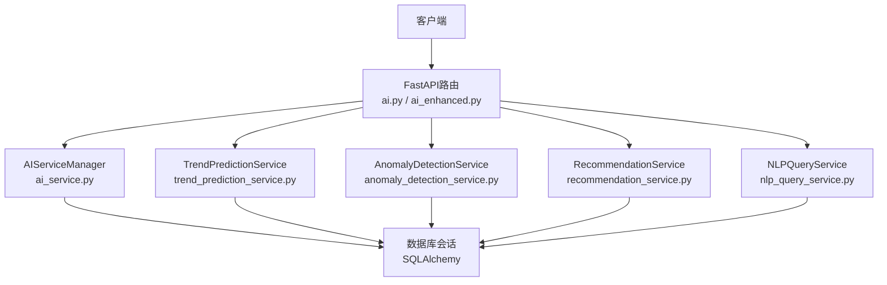
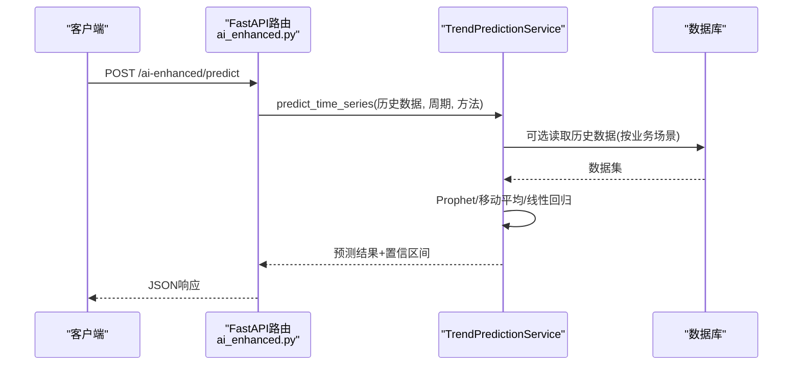
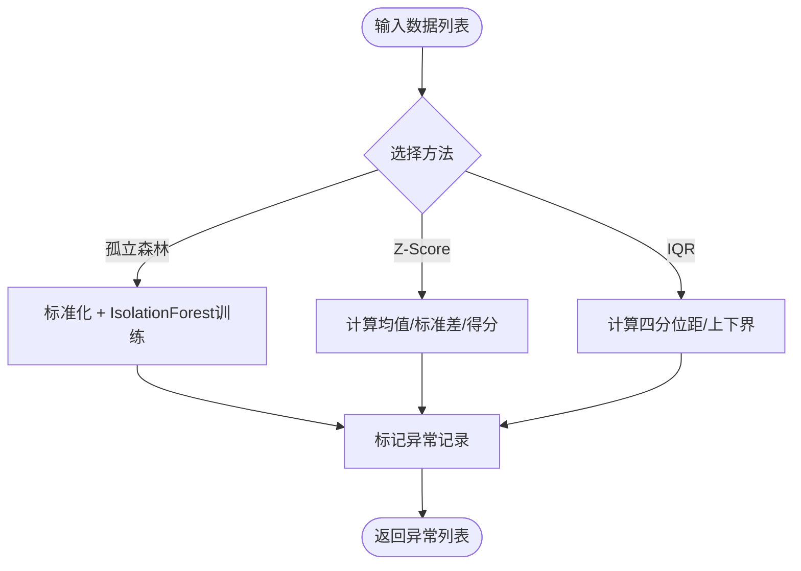
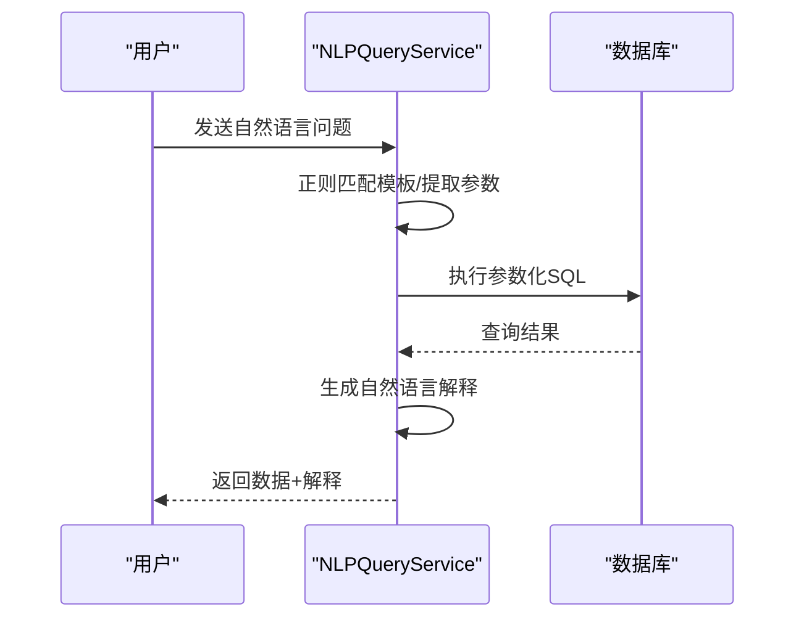
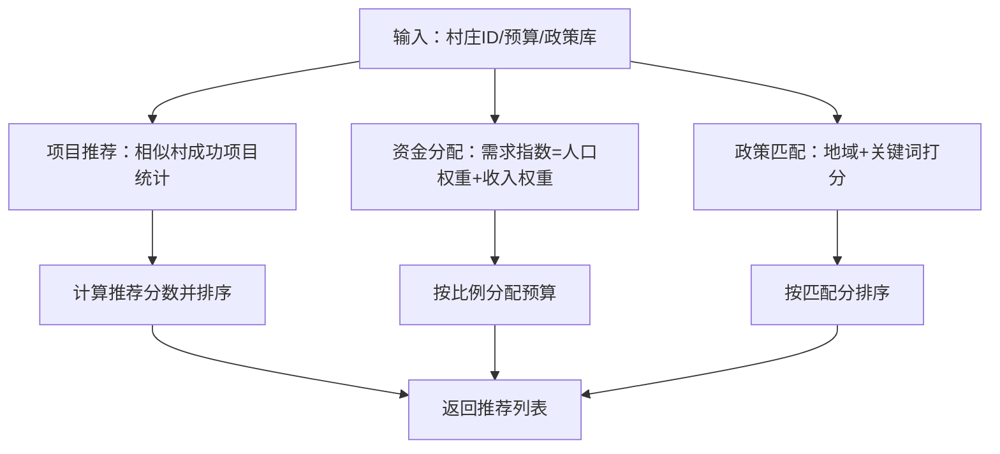
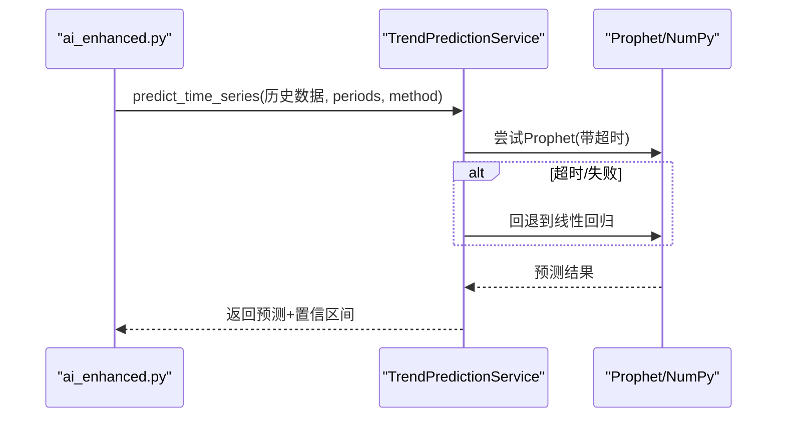
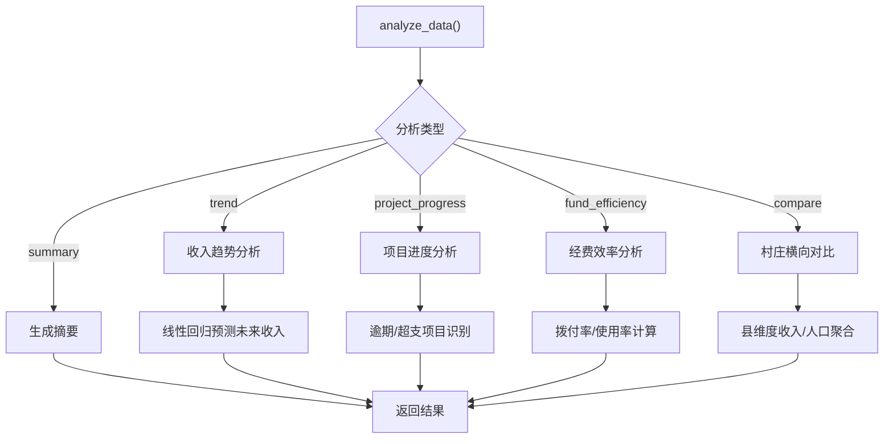
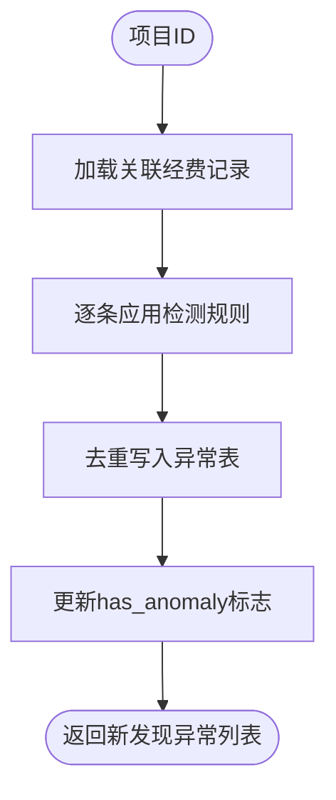
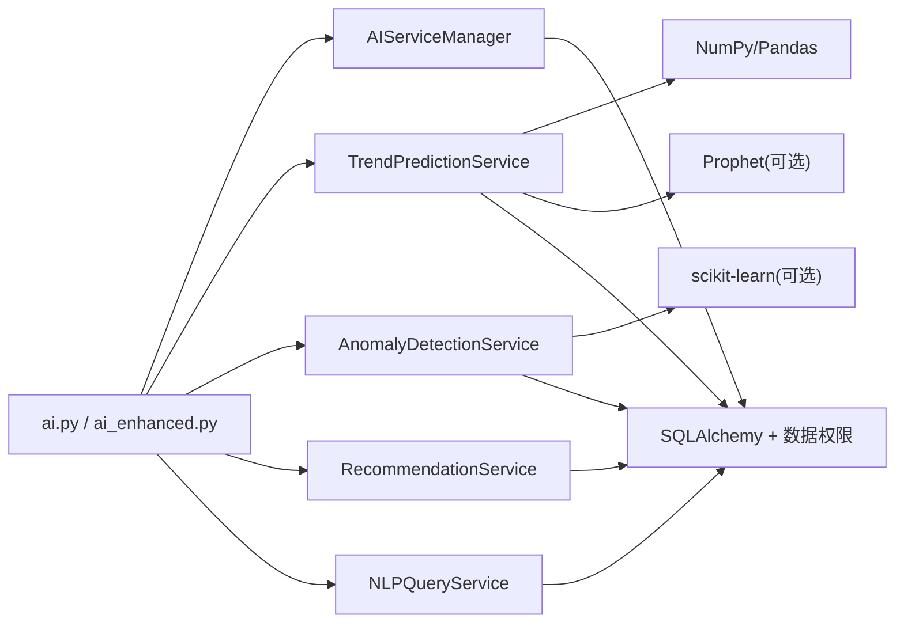

# AI智能服务

<cite>
**本文引用的文件**
- [backend/app/services/ai_service.py](file://backend/app/services/ai_service.py)
- [backend/app/api/v1/ai.py](file://backend/app/api/v1/ai.py)
- [backend/app/api/v1/ai_enhanced.py](file://backend/app/api/v1/ai_enhanced.py)
- [backend/app/services/ai/anomaly_detection_service.py](file://backend/app/services/ai/anomaly_detection_service.py)
- [backend/app/services/ai/nlp_query_service.py](file://backend/app/services/ai/nlp_query_service.py)
- [backend/app/services/ai/recommendation_service.py](file://backend/app/services/ai/recommendation_service.py)
- [backend/app/services/ai/trend_prediction_service.py](file://backend/app/services/ai/trend_prediction_service.py)
- [backend/app/services/fund_anomaly_detector.py](file://backend/app/services/fund_anomaly_detector.py)
- [backend/tests/unit/test_ai_service.py](file://backend/tests/unit/test_ai_service.py)
</cite>

## 目录
1. [简介](#简介)
2. [项目结构](#项目结构)
3. [核心组件](#核心组件)
4. [架构总览](#架构总览)
5. [详细组件分析](#详细组件分析)
6. [依赖关系分析](#依赖关系分析)
7. [性能考虑](#性能考虑)
8. [故障排查指南](#故障排查指南)
9. [结论](#结论)
10. [附录](#附录)

## 简介
本技术文档面向乡村振兴系统的AI智能服务，覆盖异常检测、自然语言查询、推荐算法与趋势预测四大能力。文档从系统架构、组件职责、数据流与处理逻辑、集成方式（含模型加载与回退策略）、数据预处理与结果后处理、扩展与新算法接入、以及性能优化与模型更新等方面进行全面说明，帮助开发者快速理解并安全扩展AI能力。

## 项目结构
AI能力主要分布在以下位置：
- API层：提供对外REST接口，负责鉴权、参数校验、调用服务层
- 服务层：封装具体AI算法与业务逻辑，包含异常检测、NLP查询、推荐、趋势预测等
- 数据访问：通过SQLAlchemy与数据库交互，结合数据权限过滤
- 测试：对关键路径进行单元测试与边界场景验证

**图表来源**
- [backend/app/api/v1/ai.py:1-141](file://backend/app/api/v1/ai.py#L1-L141)
- [backend/app/api/v1/ai_enhanced.py:1-145](file://backend/app/api/v1/ai_enhanced.py#L1-L145)
- [backend/app/services/ai_service.py:18-616](file://backend/app/services/ai_service.py#L18-L616)
- [backend/app/services/ai/trend_prediction_service.py:1-347](file://backend/app/services/ai/trend_prediction_service.py#L1-L347)
- [backend/app/services/ai/anomaly_detection_service.py:1-248](file://backend/app/services/ai/anomaly_detection_service.py#L1-L248)
- [backend/app/services/ai/recommendation_service.py:1-350](file://backend/app/services/ai/recommendation_service.py#L1-L350)
- [backend/app/services/ai/nlp_query_service.py:1-231](file://backend/app/services/ai/nlp_query_service.py#L1-L231)

**章节来源**
- [backend/app/api/v1/ai.py:1-141](file://backend/app/api/v1/ai.py#L1-L141)
- [backend/app/api/v1/ai_enhanced.py:1-145](file://backend/app/api/v1/ai_enhanced.py#L1-L145)
- [backend/app/services/ai_service.py:18-616](file://backend/app/services/ai_service.py#L18-L616)

## 核心组件
- AIServiceManager：本地统计分析引擎，统一入口，支持收入趋势、项目进度、经费效率、村庄对比、收入趋势预测、经费完成率预测及智能建议生成
- TrendPredictionService：时间序列预测，支持Prophet、移动平均、线性回归，具备超时保护与降级回退
- AnomalyDetectionService：异常检测，支持孤立森林、Z-Score、IQR；并提供资金与项目进度异常检测
- RecommendationService：智能推荐，包括项目推荐、资金分配建议、政策匹配
- NLPQueryService：自然语言查询解析为SQL模板执行，返回结构化结果与自然语言解释
- FundAnomalyDetector：规则引擎式经费异常检测，覆盖超支、偏差、闲置、重复支付、缺失凭证、大额提现、合同拆分、单一来源等

**章节来源**
- [backend/app/services/ai_service.py:18-616](file://backend/app/services/ai_service.py#L18-L616)
- [backend/app/services/ai/trend_prediction_service.py:1-347](file://backend/app/services/ai/trend_prediction_service.py#L1-L347)
- [backend/app/services/ai/anomaly_detection_service.py:1-248](file://backend/app/services/ai/anomaly_detection_service.py#L1-L248)
- [backend/app/services/ai/recommendation_service.py:1-350](file://backend/app/services/ai/recommendation_service.py#L1-L350)
- [backend/app/services/ai/nlp_query_service.py:1-231](file://backend/app/services/ai/nlp_query_service.py#L1-L231)
- [backend/app/services/fund_anomaly_detector.py:1-333](file://backend/app/services/fund_anomaly_detector.py#L1-L333)

## 架构总览
AI服务采用“API路由 -> 服务层 -> 数据访问”的分层架构。API层负责鉴权与请求校验；服务层实现算法与业务逻辑；数据访问通过SQLAlchemy与数据库交互，并使用数据权限过滤器确保多租户隔离。

**图表来源**
- [backend/app/api/v1/ai_enhanced.py:78-92](file://backend/app/api/v1/ai_enhanced.py#L78-L92)
- [backend/app/services/ai/trend_prediction_service.py:33-90](file://backend/app/services/ai/trend_prediction_service.py#L33-L90)

## 详细组件分析

### 异常检测（AnomalyDetectionService）
- 支持三种检测方法：孤立森林（需scikit-learn）、Z-Score、IQR；当依赖不可用时自动降级
- 提供通用异常检测入口与领域专用检测：资金异常、项目进度异常、数据录入异常
- 输出包含异常记录、分数或阈值信息，便于后续告警与处置

**图表来源**
- [backend/app/services/ai/anomaly_detection_service.py:30-61](file://backend/app/services/ai/anomaly_detection_service.py#L30-L61)
- [backend/app/services/ai/anomaly_detection_service.py:63-135](file://backend/app/services/ai/anomaly_detection_service.py#L63-L135)

**章节来源**
- [backend/app/services/ai/anomaly_detection_service.py:1-248](file://backend/app/services/ai/anomaly_detection_service.py#L1-L248)

### 自然语言查询（NLPQueryService）
- 基于正则模板匹配将自然语言转换为参数化SQL，防止注入
- 内置多种查询模板：省份村庄数、项目状态计数、资金总额、村庄收入、收入排名等
- 执行后生成自然语言解释，提升可读性

**图表来源**
- [backend/app/services/ai/nlp_query_service.py:82-135](file://backend/app/services/ai/nlp_query_service.py#L82-L135)
- [backend/app/services/ai/nlp_query_service.py:137-185](file://backend/app/services/ai/nlp_query_service.py#L137-L185)
- [backend/app/services/ai/nlp_query_service.py:187-231](file://backend/app/services/ai/nlp_query_service.py#L187-L231)

**章节来源**
- [backend/app/services/ai/nlp_query_service.py:1-231](file://backend/app/services/ai/nlp_query_service.py#L1-L231)

### 智能推荐（RecommendationService）
- 项目推荐：基于相似村庄的成功项目统计与评分，给出类型、成功率、预算均值与示例
- 资金分配建议：根据人口与收入构建需求指数，按比例分配预算
- 政策匹配：基于地域与关键词的简单匹配打分，返回相关政策

**图表来源**
- [backend/app/services/ai/recommendation_service.py:19-136](file://backend/app/services/ai/recommendation_service.py#L19-L136)
- [backend/app/services/ai/recommendation_service.py:138-269](file://backend/app/services/ai/recommendation_service.py#L138-L269)
- [backend/app/services/ai/recommendation_service.py:271-350](file://backend/app/services/ai/recommendation_service.py#L271-L350)

**章节来源**
- [backend/app/services/ai/recommendation_service.py:1-350](file://backend/app/services/ai/recommendation_service.py#L1-L350)

### 趋势预测（TrendPredictionService）
- 支持Prophet、移动平均、线性回归三种方法；在Windows环境下对Prophet初始化设置超时保护，失败时自动降级到线性回归
- 提供通用时间序列预测接口与领域接口（村庄收入、人口趋势）
- 输出预测值与置信区间（Prophet），或仅预测值（其他方法）

**图表来源**
- [backend/app/api/v1/ai_enhanced.py:78-92](file://backend/app/api/v1/ai_enhanced.py#L78-L92)
- [backend/app/services/ai/trend_prediction_service.py:33-90](file://backend/app/services/ai/trend_prediction_service.py#L33-L90)
- [backend/app/services/ai/trend_prediction_service.py:92-146](file://backend/app/services/ai/trend_prediction_service.py#L92-L146)
- [backend/app/services/ai/trend_prediction_service.py:188-235](file://backend/app/services/ai/trend_prediction_service.py#L188-L235)

**章节来源**
- [backend/app/services/ai/trend_prediction_service.py:1-347](file://backend/app/services/ai/trend_prediction_service.py#L1-L347)

### 本地统计分析（AIServiceManager）
- 统一入口：analyze_data分发至不同分析任务（摘要、趋势、项目进度、经费效率、村庄对比）
- 收入趋势预测：基于历史人均/集体收入进行线性回归，输出历史点、未来预测与R²置信度
- 经费完成率预测：按当前时间进度外推年末使用率，评估风险等级（低/中/高）
- 智能建议：基于项目逾期与超支情况生成预警与建议

**图表来源**
- [backend/app/services/ai_service.py:43-68](file://backend/app/services/ai_service.py#L43-L68)
- [backend/app/services/ai_service.py:74-131](file://backend/app/services/ai_service.py#L74-L131)
- [backend/app/services/ai_service.py:137-202](file://backend/app/services/ai_service.py#L137-L202)
- [backend/app/services/ai_service.py:208-277](file://backend/app/services/ai_service.py#L208-L277)
- [backend/app/services/ai_service.py:283-386](file://backend/app/services/ai_service.py#L283-L386)
- [backend/app/services/ai_service.py:392-483](file://backend/app/services/ai_service.py#L392-L483)
- [backend/app/services/ai_service.py:489-558](file://backend/app/services/ai_service.py#L489-L558)
- [backend/app/services/ai_service.py:571-611](file://backend/app/services/ai_service.py#L571-L611)

**章节来源**
- [backend/app/services/ai_service.py:18-616](file://backend/app/services/ai_service.py#L18-L616)

### 经费异常检测（FundAnomalyDetector）
- 规则引擎：超支、进度偏差、资金闲置、重复支付、缺失凭证、大额提现、合同拆分、单一来源采购
- 去重写入：同项目+同类型+同经费且未解决的异常不重复写入
- 标志更新：更新经费记录的异常标志，便于前端展示与筛选

**图表来源**
- [backend/app/services/fund_anomaly_detector.py:34-93](file://backend/app/services/fund_anomaly_detector.py#L34-L93)
- [backend/app/services/fund_anomaly_detector.py:99-177](file://backend/app/services/fund_anomaly_detector.py#L99-L177)
- [backend/app/services/fund_anomaly_detector.py:180-315](file://backend/app/services/fund_anomaly_detector.py#L180-L315)

**章节来源**
- [backend/app/services/fund_anomaly_detector.py:1-333](file://backend/app/services/fund_anomaly_detector.py#L1-L333)

## 依赖关系分析
- 外部依赖与可用性：
  - scikit-learn：用于孤立森林异常检测，未安装时降级到统计方法
  - Prophet：用于时间序列预测，未安装或初始化超时时降级到线性回归
- 内部依赖：
  - SQLAlchemy ORM与数据权限过滤器，确保多租户数据隔离
  - NumPy/Pandas：数值计算与时间序列处理
- 耦合与内聚：
  - API路由与服务层解耦，服务层内聚各自算法逻辑
  - 各服务独立可替换，便于扩展新算法

**图表来源**
- [backend/app/api/v1/ai.py:1-141](file://backend/app/api/v1/ai.py#L1-L141)
- [backend/app/api/v1/ai_enhanced.py:1-145](file://backend/app/api/v1/ai_enhanced.py#L1-L145)
- [backend/app/services/ai/trend_prediction_service.py:19-27](file://backend/app/services/ai/trend_prediction_service.py#L19-L27)
- [backend/app/services/ai/anomaly_detection_service.py:15-24](file://backend/app/services/ai/anomaly_detection_service.py#L15-L24)

**章节来源**
- [backend/app/api/v1/ai.py:1-141](file://backend/app/api/v1/ai.py#L1-L141)
- [backend/app/api/v1/ai_enhanced.py:1-145](file://backend/app/api/v1/ai_enhanced.py#L1-L145)
- [backend/app/services/ai/trend_prediction_service.py:19-27](file://backend/app/services/ai/trend_prediction_service.py#L19-L27)
- [backend/app/services/ai/anomaly_detection_service.py:15-24](file://backend/app/services/ai/anomaly_detection_service.py#L15-L24)

## 性能考虑
- 数据库查询优化：
  - 使用聚合函数与分组减少内存计算
  - 批量查询最新年份数据避免N+1问题（推荐服务）
  - 半开区间查询全年经费数据以命中索引
- 计算资源与并发：
  - 线程池执行耗时操作（如Prophet初始化）并设置超时，避免阻塞
  - 使用lru_cache缓存服务实例，减少重复导入开销
- 模型与算法选择：
  - 优先使用轻量级方法（线性回归、移动平均）作为默认或回退方案
  - 在数据不足或环境受限情况下自动降级，保证可用性

[本节为通用性能指导，无需特定文件引用]

## 故障排查指南
- 异常检测失败：
  - 检查scikit-learn是否安装；若未安装，确认已回退到Z-Score/IQR
  - 查看日志中的异常检测错误信息
- 趋势预测失败：
  - 检查Prophet初始化是否超时；若超时，确认已回退到线性回归
  - 确认历史数据格式正确（日期与数值字段）
- NLP查询无法解析：
  - 检查自然语言是否匹配现有模板；若不匹配，返回“无法理解的查询”
  - 查看执行SQL的错误信息，定位参数或语法问题
- 经费异常检测无结果：
  - 确认项目存在关联经费记录
  - 检查规则阈值配置是否合理

**章节来源**
- [backend/app/services/ai/anomaly_detection_service.py:15-24](file://backend/app/services/ai/anomaly_detection_service.py#L15-L24)
- [backend/app/services/ai/trend_prediction_service.py:19-27](file://backend/app/services/ai/trend_prediction_service.py#L19-L27)
- [backend/app/services/ai/nlp_query_service.py:129-135](file://backend/app/services/ai/nlp_query_service.py#L129-L135)
- [backend/app/services/fund_anomaly_detector.py:34-93](file://backend/app/services/fund_anomaly_detector.py#L34-L93)

## 结论
本AI智能服务以模块化设计提供异常检测、自然语言查询、推荐与趋势预测能力，具备强鲁棒性与可扩展性。通过依赖可用性检测与自动降级机制，确保在不同运行环境中稳定提供服务。建议在生产环境中持续监控模型效果与性能指标，定期评估与更新算法策略。

[本节为总结性内容，无需特定文件引用]

## 附录

### API端点概览
- 基础AI分析：
  - GET /ai/status：获取AI服务状态
  - POST /ai/analyze：执行数据分析（摘要、趋势等）
  - POST /ai/recommendations：获取智能建议
  - GET /ai/forecast/income：收入趋势预测
  - GET /ai/forecast/funds：年度经费完成率预测
- 增强AI能力：
  - POST /ai-enhanced/predict：时间序列预测（Prophet/移动平均/线性回归）
  - POST /ai-enhanced/anomaly-detection：异常检测（孤立森林/Z-Score/IQR）
  - GET /ai-enhanced/recommendations/projects：项目推荐
  - POST /ai-enhanced/recommendations/fund-allocation：资金分配建议
  - POST /ai-enhanced/nlp-query：自然语言查询

**章节来源**
- [backend/app/api/v1/ai.py:42-141](file://backend/app/api/v1/ai.py#L42-L141)
- [backend/app/api/v1/ai_enhanced.py:78-145](file://backend/app/api/v1/ai_enhanced.py#L78-L145)

### 数据预处理与结果后处理
- 数据预处理：
  - 时间序列：日期格式化、排序、缺失值处理
  - 异常检测：数值标准化（孤立森林）、统计量计算（Z-Score/IQR）
  - 推荐：批量查询最新年份数据，避免N+1；计算需求指数
- 结果后处理：
  - 预测：四舍五入、负值截断（收入预测）
  - 异常：附加方法名、分数或阈值信息
  - 推荐：排序、限制数量、生成原因说明
  - NLP：生成自然语言解释，便于用户理解

**章节来源**
- [backend/app/services/ai/trend_prediction_service.py:92-146](file://backend/app/services/ai/trend_prediction_service.py#L92-L146)
- [backend/app/services/ai/anomaly_detection_service.py:63-135](file://backend/app/services/ai/anomaly_detection_service.py#L63-L135)
- [backend/app/services/ai/recommendation_service.py:19-136](file://backend/app/services/ai/recommendation_service.py#L19-L136)
- [backend/app/services/ai/nlp_query_service.py:187-231](file://backend/app/services/ai/nlp_query_service.py#L187-L231)

### 扩展与新算法集成指南
- 新增异常检测方法：
  - 在AnomalyDetectionService中添加新方法，并在detect_anomalies中注册
  - 保持返回结构一致（异常记录+方法标识）
- 新增预测方法：
  - 在TrendPredictionService中实现新方法，并在predict_time_series中路由
  - 确保输出包含predictions与confidence_intervals（如适用）
- 新增NLP模板：
  - 在QUERY_TEMPLATES中添加模式与SQL，注意使用参数化占位符
  - 在_generate_explanation中添加对应解释逻辑
- 新增推荐策略：
  - 在RecommendationService中实现新策略，保持输入输出契约一致
  - 利用数据权限过滤器确保多租户隔离

**章节来源**
- [backend/app/services/ai/anomaly_detection_service.py:30-61](file://backend/app/services/ai/anomaly_detection_service.py#L30-L61)
- [backend/app/services/ai/trend_prediction_service.py:33-90](file://backend/app/services/ai/trend_prediction_service.py#L33-L90)
- [backend/app/services/ai/nlp_query_service.py:21-71](file://backend/app/services/ai/nlp_query_service.py#L21-L71)
- [backend/app/services/ai/recommendation_service.py:19-136](file://backend/app/services/ai/recommendation_service.py#L19-L136)

### 模型更新实施方案
- 依赖管理：
  - 通过requirements文件管理scikit-learn、Prophet等可选依赖
  - 启动时检测依赖可用性，记录日志并降级
- 版本控制：
  - 对预测模型与异常检测模型进行版本化管理，记录模型参数与效果指标
  - 定期评估模型效果，必要时切换新版本
- 灰度发布：
  - 在新版本上线前进行小范围灰度，观察异常率与预测精度
  - 提供开关以便快速回滚

**章节来源**
- [backend/app/services/ai/trend_prediction_service.py:19-27](file://backend/app/services/ai/trend_prediction_service.py#L19-L27)
- [backend/app/services/ai/anomaly_detection_service.py:15-24](file://backend/app/services/ai/anomaly_detection_service.py#L15-L24)

### 测试与验证
- 单元测试覆盖：
  - 收入趋势预测：数据不足、单点数据、线性增长、下降趋势、无效年份
  - 经费完成率预测：正常、高风险、超支、零分配、年初第一天
- 测试要点：
  - 验证返回结构与字段完整性
  - 验证边界条件与异常路径
  - 模拟数据库会话与用户权限

**章节来源**
- [backend/tests/unit/test_ai_service.py:34-184](file://backend/tests/unit/test_ai_service.py#L34-L184)