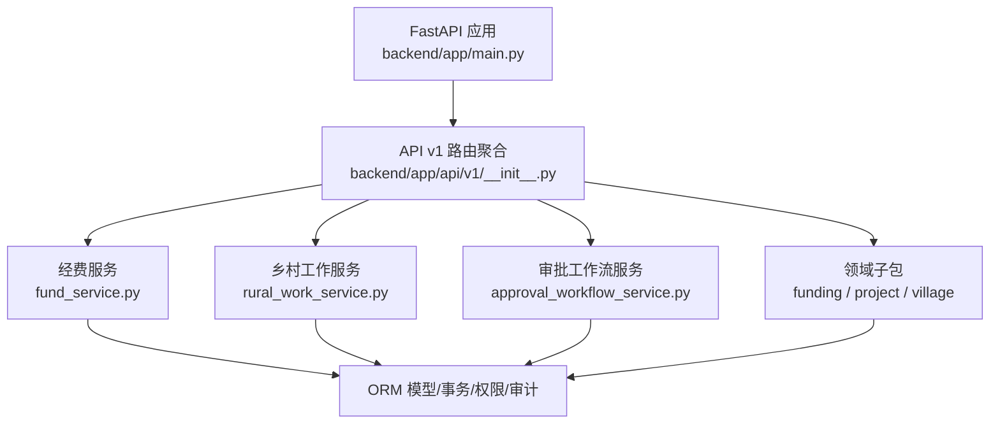
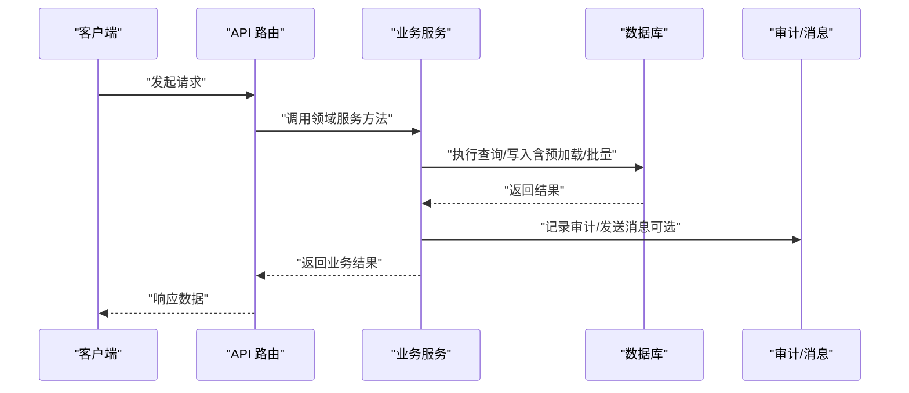
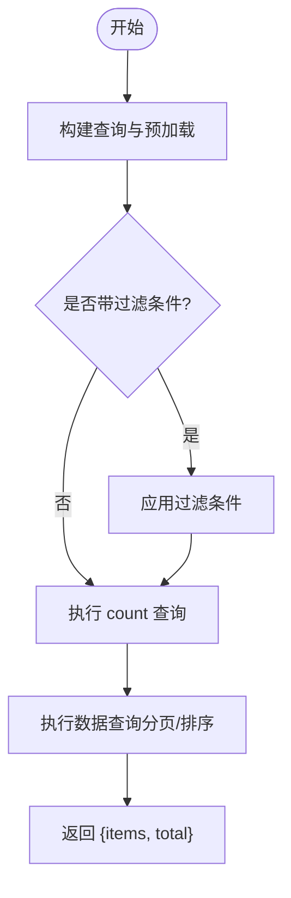
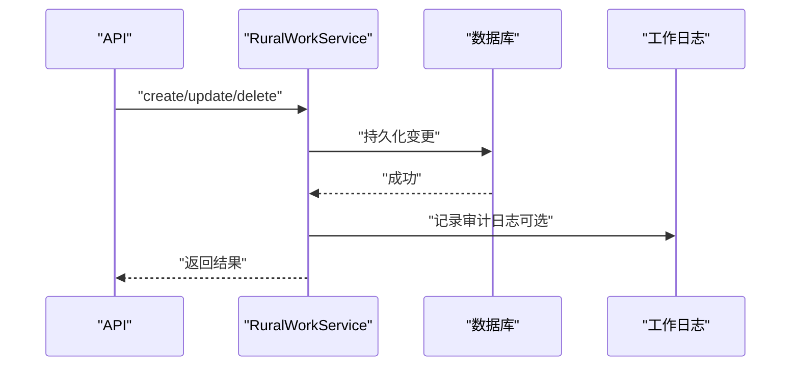
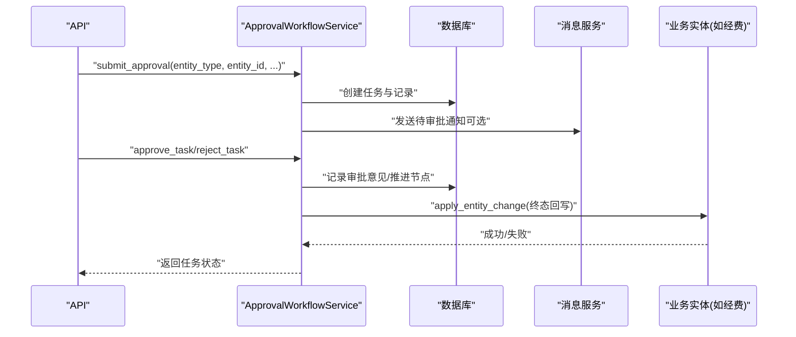
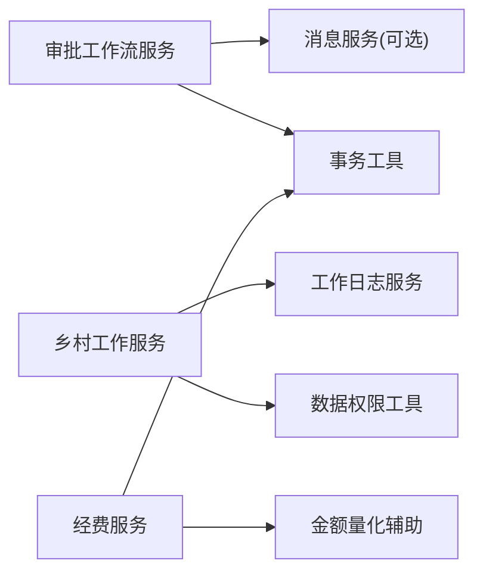

# 业务服务层

<cite>
**本文引用的文件**
- [backend/app/main.py](file://backend/app/main.py)
- [backend/app/services/__init__.py](file://backend/app/services/__init__.py)
- [backend/app/services/fund_service.py](file://backend/app/services/fund_service.py)
- [backend/app/services/rural_work_service.py](file://backend/app/services/rural_work_service.py)
- [backend/app/services/approval_workflow_service.py](file://backend/app/services/approval_workflow_service.py)
- [backend/app/services/funding/__init__.py](file://backend/app/services/funding/__init__.py)
- [backend/app/services/project/__init__.py](file://backend/app/services/project/__init__.py)
- [backend/app/services/village/data_permission.py](file://backend/app/services/village/data_permission.py)
- [backend/app/api/v1/__init__.py](file://backend/app/api/v1/__init__.py)
</cite>

## 目录
1. [简介](#简介)
2. [项目结构](#项目结构)
3. [核心组件](#核心组件)
4. [架构总览](#架构总览)
5. [详细组件分析](#详细组件分析)
6. [依赖关系分析](#依赖关系分析)
7. [性能考虑](#性能考虑)
8. [故障排查指南](#故障排查指南)
9. [结论](#结论)
10. [附录](#附录)

## 简介
本技术文档聚焦后端“业务服务层”，围绕经费管理、项目管理、乡村工作管理、审批工作流等核心域，系统阐述服务层的架构设计原则、职责划分、接口标准化、数据流转与错误处理策略，并提供扩展与定制指南及性能优化建议。服务层以领域服务为核心，向上承接 API 路由，向下通过 ORM 访问模型与数据库，横向复用缓存、事务、权限、审计等横切能力，形成高内聚、低耦合的可维护体系。

## 项目结构
服务层位于 backend/app/services，按领域与通用能力组织：
- 领域服务：fund_service（经费）、rural_work_service（乡村工作）、approval_workflow_service（审批工作流）以及 funding、project、village 等子包。
- 通用服务：缓存、备份、审计、消息、任务队列、加密、监控等。
- 入口与装配：main.py 负责应用生命周期、中间件、路由注册；api/v1/__init__.py 静态导入并挂载所有业务路由。

图表来源
- [backend/app/main.py:100-180](file://backend/app/main.py#L100-L180)
- [backend/app/api/v1/__init__.py:123-140](file://backend/app/api/v1/__init__.py#L123-L140)

章节来源
- [backend/app/main.py:100-180](file://backend/app/main.py#L100-L180)
- [backend/app/api/v1/__init__.py:1-148](file://backend/app/api/v1/__init__.py#L1-L148)

## 核心组件
- 经费管理服务（FundService）：提供经费的创建、查询、更新、删除、批量状态变更与编号生成，内置状态机校验与 N+1 优化。
- 乡村工作服务（RuralWorkService）：提供乡村工作的 CRUD、统计、报告、下拉数据同步，内置数据权限隔离与审计日志。
- 审批工作流服务（ApprovalWorkflowService）：实现流程定义、任务提交/审批/驳回/转交/撤回/重提、历史与差异对比、实体回写机制与失败重试。
- 领域子包：
  - funding：经费生命周期阶段服务（立项、预算汇总等）。
  - project：项目管理域（聚合根与评估/监控由顶层服务覆盖）。
  - village：村庄数据权限过滤委托实现。

章节来源
- [backend/app/services/fund_service.py:29-289](file://backend/app/services/fund_service.py#L29-L289)
- [backend/app/services/rural_work_service.py:124-521](file://backend/app/services/rural_work_service.py#L124-L521)
- [backend/app/services/approval_workflow_service.py:30-800](file://backend/app/services/approval_workflow_service.py#L30-L800)
- [backend/app/services/funding/__init__.py:1-19](file://backend/app/services/funding/__init__.py#L1-L19)
- [backend/app/services/project/__init__.py:1-22](file://backend/app/services/project/__init__.py#L1-L22)
- [backend/app/services/village/data_permission.py:1-36](file://backend/app/services/village/data_permission.py#L1-L36)

## 架构总览
服务层遵循分层与领域驱动思想：
- 表现层（API）：仅做参数校验、鉴权、调用服务、返回响应。
- 服务层：封装领域逻辑、编排跨实体操作、保证事务一致性、统一异常与审计。
- 数据层：ORM 模型与数据库交互，配合索引与预加载优化。
- 横切能力：缓存、审计、权限、消息、任务队列、监控等通过服务或中间件注入。

图表来源
- [backend/app/main.py:113-180](file://backend/app/main.py#L113-L180)
- [backend/app/api/v1/__init__.py:123-140](file://backend/app/api/v1/__init__.py#L123-L140)

## 详细组件分析

### 经费管理服务（FundService）
- 职责边界：专注 Fund 实体的状态管理与查询，不混入 HTTP 细节。
- 关键能力：
  - 分页列表与详情：使用 joinedload/selectinload 避免 N+1，count 独立优化。
  - 创建/更新/删除：支持 auto_commit 控制事务边界，便于上层编排。
  - 编号生成：ZJ + 年份 + 6位流水，基于自增 ID 保证唯一性。
  - 批量状态更新：内置状态机白名单校验，非法流转整体拒绝。
- 数据流：API → FundService → ORM → DB，必要时触发审计/事件。

图表来源
- [backend/app/services/fund_service.py:40-99](file://backend/app/services/fund_service.py#L40-L99)

章节来源
- [backend/app/services/fund_service.py:29-289](file://backend/app/services/fund_service.py#L29-L289)

### 乡村工作服务（RuralWorkService）
- 职责边界：乡村工作全生命周期管理、统计与报告、下拉数据同步。
- 关键能力：
  - 数据权限隔离：管理员全量；部门范围包含下级组织；仅本人按创建人过滤。
  - 列表/详情/统计：支持多条件筛选、年份提取、完成率计算。
  - 报告生成：按时间范围聚合状态/类型分布。
  - 审计日志：创建/更新/删除时记录工作日志，失败不影响主流程。
- 数据流：API → RuralWorkService → ORM → DB，必要时写入工作日志。

图表来源
- [backend/app/services/rural_work_service.py:260-368](file://backend/app/services/rural_work_service.py#L260-L368)

章节来源
- [backend/app/services/rural_work_service.py:124-521](file://backend/app/services/rural_work_service.py#L124-L521)

### 审批工作流服务（ApprovalWorkflowService）
- 职责边界：审批流程定义、任务编排、历史记录与差异对比、实体回写与重试。
- 关键能力：
  - 流程管理：创建/更新/删除流程，节点最多5级，支持角色型审批人解析。
  - 任务管理：提交、待办查询、分页统计、批量审批、自动全部通过（单机模式）。
  - 审批动作：通过/驳回/转交/撤回/重提，记录审批意见与时间戳。
  - 实体回写：通过处理器注册表将终态（通过/驳回）写回业务实体（如经费），失败标记可重试。
  - 历史与差异：获取审批记录与变更对比，兼容新旧键名。
- 数据流：API → ApprovalWorkflowService → ORM → DB，必要时推送消息与记录审计。

图表来源
- [backend/app/services/approval_workflow_service.py:203-278](file://backend/app/services/approval_workflow_service.py#L203-L278)
- [backend/app/services/approval_workflow_service.py:447-504](file://backend/app/services/approval_workflow_service.py#L447-L504)

章节来源
- [backend/app/services/approval_workflow_service.py:30-800](file://backend/app/services/approval_workflow_service.py#L30-L800)

### 领域子包概览
- funding：经费生命周期阶段服务（论证立项、汇总审核等），为复杂资金流转提供分阶段编排。
- project：项目管理域（聚合根与评估/监控由顶层服务覆盖），便于后续拆分独立服务。
- village：村庄数据权限过滤委托 core.data_permission，避免重复维护权限逻辑。

章节来源
- [backend/app/services/funding/__init__.py:1-19](file://backend/app/services/funding/__init__.py#L1-L19)
- [backend/app/services/project/__init__.py:1-22](file://backend/app/services/project/__init__.py#L1-L22)
- [backend/app/services/village/data_permission.py:1-36](file://backend/app/services/village/data_permission.py#L1-L36)

## 依赖关系分析
- 服务间依赖：
  - 审批工作流服务依赖消息模块（可选）与审计/事务工具。
  - 乡村工作服务依赖工作日志服务与数据权限工具。
  - 经费服务依赖事务工具与金额字段量化辅助。
- 外部集成点：
  - 数据库：SQLAlchemy ORM，配合 Alembic 迁移与索引优化。
  - 缓存/消息/任务队列：按需启用，非阻塞主流程。
- 耦合与内聚：
  - 服务内聚于各自领域，通过显式接口协作；横切能力通过工具函数或服务注入，降低耦合。

图表来源
- [backend/app/services/approval_workflow_service.py:253-277](file://backend/app/services/approval_workflow_service.py#L253-L277)
- [backend/app/services/rural_work_service.py:300-368](file://backend/app/services/rural_work_service.py#L300-L368)
- [backend/app/services/fund_service.py:114-185](file://backend/app/services/fund_service.py#L114-L185)

章节来源
- [backend/app/services/approval_workflow_service.py:203-278](file://backend/app/services/approval_workflow_service.py#L203-L278)
- [backend/app/services/rural_work_service.py:260-368](file://backend/app/services/rural_work_service.py#L260-L368)
- [backend/app/services/fund_service.py:114-185](file://backend/app/services/fund_service.py#L114-L185)

## 性能考虑
- 查询优化：
  - 预加载关联：joinedload/selectinload 避免 N+1。
  - 独立 count：count 查询不包含 eager_loads，提升性能。
  - 批量更新：使用 bulk update 减少循环开销。
- 事务与幂等：
  - auto_commit 控制事务边界，复杂编排中由外层统一提交。
  - 审批终态回写失败标记，支持重试，避免不一致。
- 缓存与异步：
  - 缓存服务用于热点数据；导出/备份等耗时任务走任务队列。
- 索引与迁移：
  - 启动时创建性能索引；Alembic 升级失败在开发环境降级兜底，生产环境中止以避免 schema 漂移风险。

[本节为通用指导，无需特定文件引用]

## 故障排查指南
- 审批回写失败：
  - 现象：任务状态附加 _apply_failed 后缀。
  - 处理：使用 retry_apply_entity_change 重试；检查处理器实现与依赖服务可用性。
- 乡村工作审计日志失败：
  - 现象：记录日志抛出异常。
  - 处理：日志失败不影响主流程，检查日志服务配置与权限。
- 数据库迁移失败：
  - 现象：/health 暴露 at_head=False 与 error_type。
  - 处理：查看服务端日志完整异常栈；生产环境需修复迁移后重启。

章节来源
- [backend/app/services/approval_workflow_service.py:46-71](file://backend/app/services/approval_workflow_service.py#L46-L71)
- [backend/app/services/approval_workflow_service.py:541-566](file://backend/app/services/approval_workflow_service.py#L541-L566)
- [backend/app/services/rural_work_service.py:300-368](file://backend/app/services/rural_work_service.py#L300-L368)
- [backend/app/main.py:237-262](file://backend/app/main.py#L237-L262)
- [backend/app/main.py:436-507](file://backend/app/main.py#L436-L507)

## 结论
业务服务层以领域服务为核心，清晰划分职责，提供稳定的接口与一致的事务语义。通过预加载、批量操作、状态机校验、审批回写与重试等机制，兼顾功能完整性与性能可靠性。扩展新业务模块时，遵循现有模式：定义领域服务、注册 API 路由、接入权限/审计/缓存等横切能力，即可快速落地。

[本节为总结性内容，无需特定文件引用]

## 附录
- 服务扩展与定制化指南
  - 新增业务模块步骤：
    1. 在 services 下创建领域服务类，封装 CRUD 与业务规则。
    2. 在 api/v1 下创建路由模块，调用服务并返回响应。
    3. 在 api/v1/__init__.py 中静态导入并 include_router。
    4. 如需审批，注册实体回写处理器到审批工作流服务。
    5. 接入数据权限、审计日志与缓存（可选）。
  - 最佳实践：
    - 保持服务单一职责，避免 HTTP 细节侵入。
    - 使用 auto_commit 控制事务边界，复杂流程由外层统一提交。
    - 对敏感/高频数据使用缓存与预加载。
    - 对关键操作记录审计日志，失败不影响主流程。
    - 对审批终态回写失败进行标记与重试。

[本节为通用指导，无需特定文件引用]