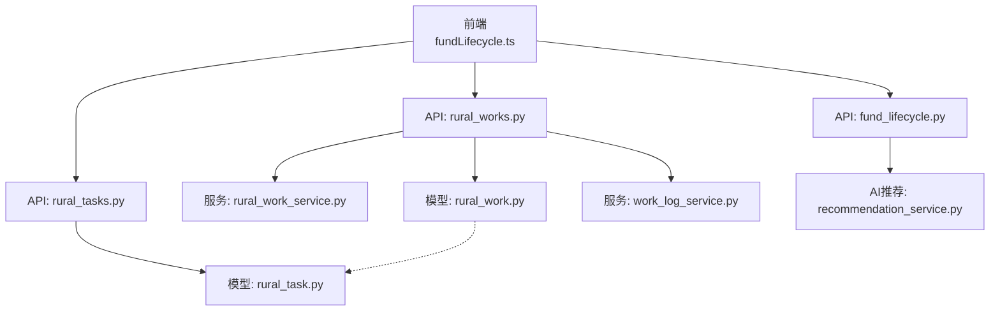
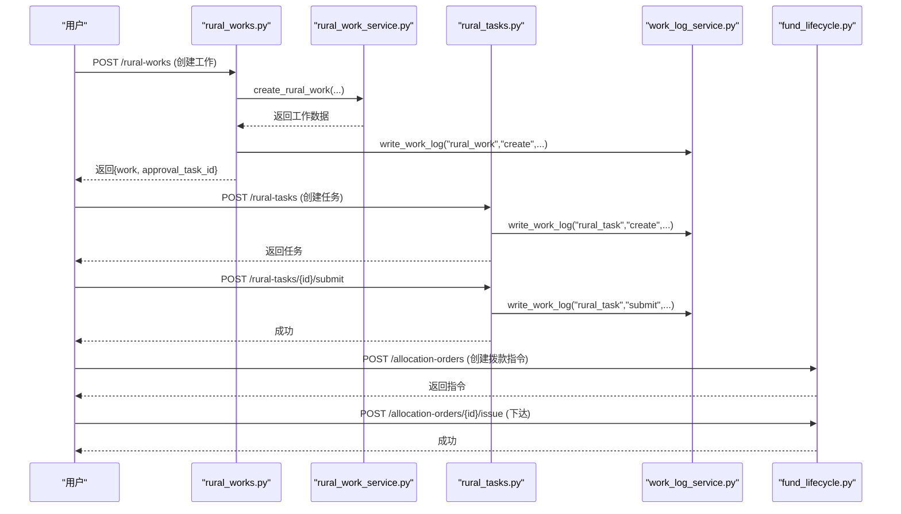
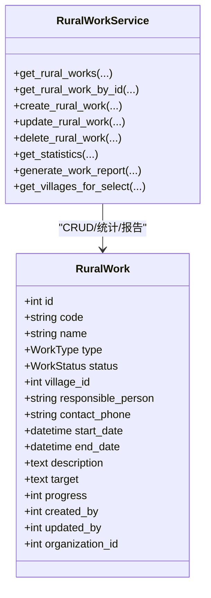
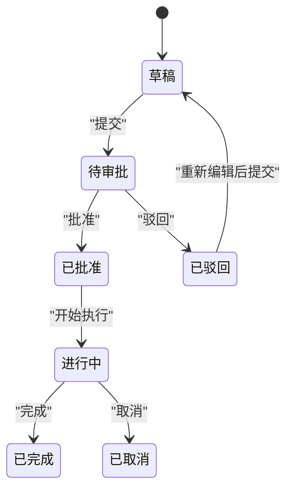
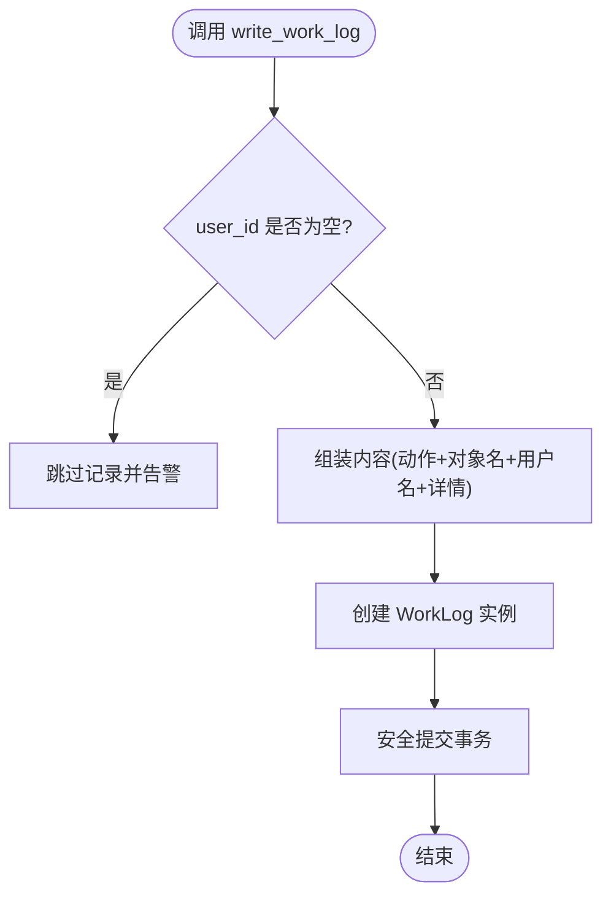
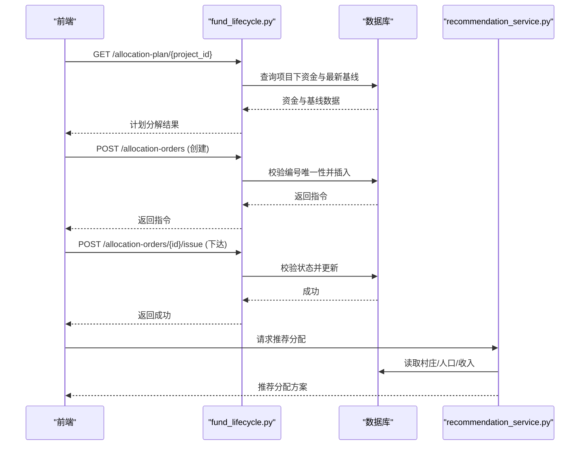
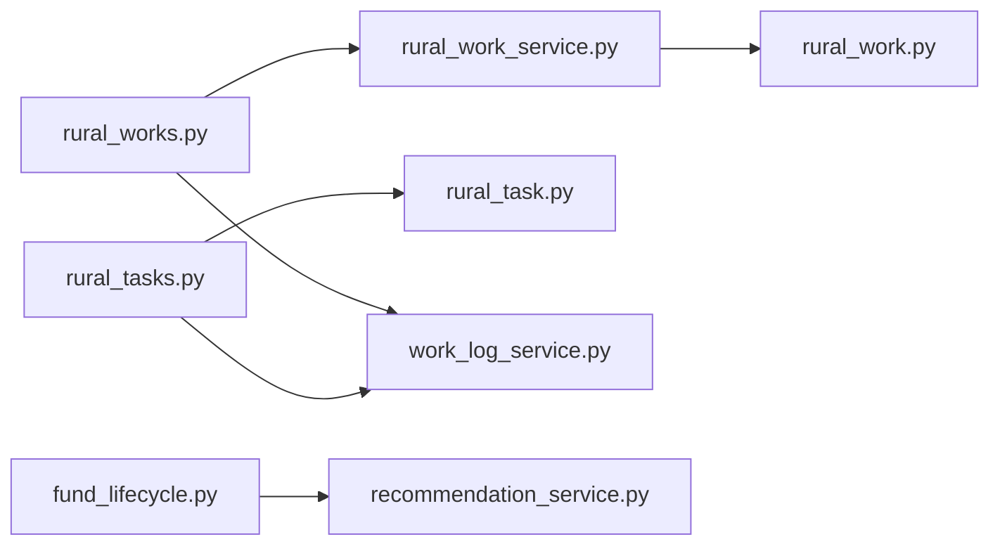

# 乡村工作服务

<cite>
**本文引用的文件**
- [backend/app/models/rural_work.py](file://backend/app/models/rural_work.py)
- [backend/app/models/rural_task.py](file://backend/app/models/rural_task.py)
- [backend/app/models/work_log.py](file://backend/app/models/work_log.py)
- [backend/app/services/rural_work_service.py](file://backend/app/services/rural_work_service.py)
- [backend/app/services/work_log_service.py](file://backend/app/services/work_log_service.py)
- [backend/app/api/v1/rural_works.py](file://backend/app/api/v1/rural_works.py)
- [backend/app/api/v1/rural_tasks.py](file://backend/app/api/v1/rural_tasks.py)
- [backend/app/api/v1/fund_lifecycle.py](file://backend/app/api/v1/fund_lifecycle.py)
- [backend/app/services/ai/recommendation_service.py](file://backend/app/services/ai/recommendation_service.py)
- [frontend/src/api/fundLifecycle.ts](file://frontend/src/api/fundLifecycle.ts)
</cite>

## 目录
1. [简介](#简介)
2. [项目结构](#项目结构)
3. [核心组件](#核心组件)
4. [架构总览](#架构总览)
5. [详细组件分析](#详细组件分析)
6. [依赖关系分析](#依赖关系分析)
7. [性能考虑](#性能考虑)
8. [故障排查指南](#故障排查指南)
9. [结论](#结论)
10. [附录](#附录)

## 简介
本技术文档面向“乡村工作服务”，围绕工作任务管理、工作报告处理与资源分配三大业务域，系统阐述：
- 工作任务生命周期管理（创建、提交审批、审批通过/驳回、执行、完成）
- 报告提交与审核流程（乡村工作新增/变更/删除自动触发审批任务）
- 资源分配机制（资金拨付计划分解、拨款指令下达、调拨订单）
- 工作日志记录与进度跟踪（审计留痕、自动日志、统计报表）
- 扩展点与自定义工作流设计指南
- 数据统计分析与报表生成能力

## 项目结构
后端采用分层架构：API路由层 → 服务层 → 数据模型层；同时提供通用能力（权限、事务、日志、审批）。前端通过 API 客户端调用。

图表来源
- [backend/app/api/v1/rural_works.py:150-202](file://backend/app/api/v1/rural_works.py#L150-L202)
- [backend/app/api/v1/rural_tasks.py:175-222](file://backend/app/api/v1/rural_tasks.py#L175-L222)
- [backend/app/api/v1/fund_lifecycle.py:1726-1764](file://backend/app/api/v1/fund_lifecycle.py#L1726-L1764)
- [backend/app/services/rural_work_service.py:260-368](file://backend/app/services/rural_work_service.py#L260-L368)
- [backend/app/services/work_log_service.py:58-99](file://backend/app/services/work_log_service.py#L58-L99)
- [backend/app/models/rural_work.py:34-75](file://backend/app/models/rural_work.py#L34-L75)
- [backend/app/models/rural_task.py:56-132](file://backend/app/models/rural_task.py#L56-L132)
- [frontend/src/api/fundLifecycle.ts:175-217](file://frontend/src/api/fundLifecycle.ts#L175-L217)

章节来源
- [backend/app/api/v1/rural_works.py:1-272](file://backend/app/api/v1/rural_works.py#L1-L272)
- [backend/app/api/v1/rural_tasks.py:1-366](file://backend/app/api/v1/rural_tasks.py#L1-L366)
- [backend/app/services/rural_work_service.py:1-533](file://backend/app/services/rural_work_service.py#L1-L533)
- [backend/app/services/work_log_service.py:1-100](file://backend/app/services/work_log_service.py#L1-L100)
- [backend/app/models/rural_work.py:1-76](file://backend/app/models/rural_work.py#L1-L76)
- [backend/app/models/rural_task.py:1-133](file://backend/app/models/rural_task.py#L1-L133)
- [backend/app/models/work_log.py:1-79](file://backend/app/models/work_log.py#L1-L79)
- [backend/app/api/v1/fund_lifecycle.py:581-619](file://backend/app/api/v1/fund_lifecycle.py#L581-L619)
- [backend/app/services/ai/recommendation_service.py:230-263](file://backend/app/services/ai/recommendation_service.py#L230-L263)
- [frontend/src/api/fundLifecycle.ts:175-217](file://frontend/src/api/fundLifecycle.ts#L175-L217)

## 核心组件
- 乡村工作模型 RuralWork：定义工作类型、状态、时间、组织隔离等字段及索引，支撑列表筛选与统计。
- 乡村工作任务 RuralTask：RuralWork 的子任务，支持年度/季度、分类、优先级、预算与实际花费、进度、审批字段与附件。
- 工作日志 WorkLog：记录操作人、日期、内容、类别、地点、参与人、附件等，并提供标题/日期/类型的兼容属性。
- 乡村工作服务 RuralWorkService：封装 CRUD、数据权限过滤、统计、报告生成、村庄下拉数据同步等。
- 工作日志服务 WorkLogService：提供日志的增删改查与统一写日志函数 write_work_log。
- 乡村工作 API：RESTful 接口，包含列表、详情、创建、更新、删除、批量删除、统计、报告、年份枚举、村庄选择等。
- 乡村任务 API：任务 CRUD、提交审批、审批通过/驳回、统计、批量删除。
- 资金生命周期 API：拨付计划分解、拨款指令创建与下达、调拨订单等。
- AI 推荐服务：基于人口与收入的需求指数进行资金分配建议。

章节来源
- [backend/app/models/rural_work.py:18-75](file://backend/app/models/rural_work.py#L18-L75)
- [backend/app/models/rural_task.py:21-132](file://backend/app/models/rural_task.py#L21-L132)
- [backend/app/models/work_log.py:10-79](file://backend/app/models/work_log.py#L10-L79)
- [backend/app/services/rural_work_service.py:124-533](file://backend/app/services/rural_work_service.py#L124-L533)
- [backend/app/services/work_log_service.py:9-99](file://backend/app/services/work_log_service.py#L9-L99)
- [backend/app/api/v1/rural_works.py:57-272](file://backend/app/api/v1/rural_works.py#L57-L272)
- [backend/app/api/v1/rural_tasks.py:72-366](file://backend/app/api/v1/rural_tasks.py#L72-L366)
- [backend/app/api/v1/fund_lifecycle.py:581-619](file://backend/app/api/v1/fund_lifecycle.py#L581-L619)
- [backend/app/services/ai/recommendation_service.py:230-263](file://backend/app/services/ai/recommendation_service.py#L230-L263)

## 架构总览
乡村工作服务以“工作-任务-日志-审批-资金”为主线，形成如下协作关系：
- 工作层：RuralWork 承载宏观工作项，具备类型、状态、组织隔离、时间范围等。
- 任务层：RuralTask 作为可执行单元，具备完整生命周期与审批节点。
- 日志层：所有关键操作通过 write_work_log 持久化，确保可追溯。
- 审批层：乡村工作的新增/变更/删除自动触发审批任务，任务本身也支持提交与审批。
- 资金层：拨付计划分解与拨款指令下发，结合 AI 推荐进行资源分配。

图表来源
- [backend/app/api/v1/rural_works.py:150-202](file://backend/app/api/v1/rural_works.py#L150-L202)
- [backend/app/api/v1/rural_tasks.py:175-222](file://backend/app/api/v1/rural_tasks.py#L175-L222)
- [backend/app/api/v1/rural_tasks.py:276-333](file://backend/app/api/v1/rural_tasks.py#L276-L333)
- [backend/app/api/v1/fund_lifecycle.py:1726-1764](file://backend/app/api/v1/fund_lifecycle.py#L1726-L1764)
- [backend/app/services/work_log_service.py:58-99](file://backend/app/services/work_log_service.py#L58-L99)

## 详细组件分析

### 乡村工作（RuralWork）
- 数据模型要点：类型枚举、状态枚举、时间范围、联系人加密、组织隔离字段、索引优化。
- 服务层能力：
  - 列表查询：支持状态、类型、村庄、搜索、起止日期、年度、排序分页，并内置数据权限过滤。
  - 单条访问：按数据权限校验是否可访问。
  - 创建/更新/删除：白名单字段写入，自动记录工作日志，失败不影响主流程。
  - 统计与报告：按状态/类型聚合，计算完成率；支持按年度/日期范围生成报告。
  - 村庄下拉：从帮扶村表同步到 villages 表，保证外键一致性与下拉数据可用。
- 扩展点：注册实体变更审批处理器（当前为空实现，便于后续回写逻辑扩展）。

图表来源
- [backend/app/models/rural_work.py:34-75](file://backend/app/models/rural_work.py#L34-L75)
- [backend/app/services/rural_work_service.py:124-533](file://backend/app/services/rural_work_service.py#L124-L533)

章节来源
- [backend/app/models/rural_work.py:18-75](file://backend/app/models/rural_work.py#L18-L75)
- [backend/app/services/rural_work_service.py:30-90](file://backend/app/services/rural_work_service.py#L30-L90)
- [backend/app/services/rural_work_service.py:162-221](file://backend/app/services/rural_work_service.py#L162-L221)
- [backend/app/services/rural_work_service.py:260-368](file://backend/app/services/rural_work_service.py#L260-L368)
- [backend/app/services/rural_work_service.py:370-500](file://backend/app/services/rural_work_service.py#L370-L500)
- [backend/app/api/v1/rural_works.py:57-272](file://backend/app/api/v1/rural_works.py#L57-L272)

### 乡村工作任务（RuralTask）
- 数据模型要点：关联工作、年度/季度、分类、优先级、预算/实际花费、进度、责任人、时间、审批字段、附件、索引优化。
- 生命周期：
  - 草稿 draft → 待审批 pending_approval → 已批准 approved / 已驳回 rejected → 进行中 in_progress → 已完成 completed / 已取消 cancelled。
  - 提交审批：仅草稿或被驳回的任务可提交，设置提交人与时间。
  - 审批：仅待审批的任务可审批，通过后进入已批准，驳回则回到被驳回。
  - 审计：每个关键动作均记录工作日志。
- 列表与统计：支持多维度筛选与统计（状态、分类、预算、完成率）。

图表来源
- [backend/app/models/rural_task.py:35-45](file://backend/app/models/rural_task.py#L35-L45)
- [backend/app/api/v1/rural_tasks.py:276-333](file://backend/app/api/v1/rural_tasks.py#L276-L333)

章节来源
- [backend/app/models/rural_task.py:21-132](file://backend/app/models/rural_task.py#L21-L132)
- [backend/app/api/v1/rural_tasks.py:72-161](file://backend/app/api/v1/rural_tasks.py#L72-L161)
- [backend/app/api/v1/rural_tasks.py:175-222](file://backend/app/api/v1/rural_tasks.py#L175-L222)
- [backend/app/api/v1/rural_tasks.py:276-333](file://backend/app/api/v1/rural_tasks.py#L276-L333)
- [backend/app/api/v1/rural_tasks.py:336-366](file://backend/app/api/v1/rural_tasks.py#L336-L366)

### 工作日志（WorkLog）
- 数据模型要点：记录人、日期、内容、类别、地点、参与人、附件、时间戳；提供 title/work_date/log_type 兼容属性。
- 服务层能力：
  - 统一写日志函数 write_work_log：组装内容、防御 user_id 为 None、仅写入合法列、安全提交。
  - 日志 CRUD：列表、详情、创建、更新、删除。
- 使用场景：乡村工作与服务层各关键操作（创建/更新/删除、批量删除、任务提交/审批/删除）均调用写日志，确保审计可追溯。

图表来源
- [backend/app/services/work_log_service.py:58-99](file://backend/app/services/work_log_service.py#L58-L99)

章节来源
- [backend/app/models/work_log.py:10-79](file://backend/app/models/work_log.py#L10-L79)
- [backend/app/services/work_log_service.py:9-99](file://backend/app/services/work_log_service.py#L9-L99)
- [backend/app/api/v1/rural_works.py:230-272](file://backend/app/api/v1/rural_works.py#L230-L272)
- [backend/app/api/v1/rural_tasks.py:214-222](file://backend/app/api/v1/rural_tasks.py#L214-L222)
- [backend/app/api/v1/rural_tasks.py:292-333](file://backend/app/api/v1/rural_tasks.py#L292-L333)

### 资源分配与资金生命周期
- 拨付计划分解：根据项目下的资金与最新基线金额，输出计划/批准/已分配/基线金额与锁定状态。
- 拨款指令：创建时校验编号唯一性，记录创建人；仅草稿状态可下达。
- 调拨订单：前端提供列表、创建、下达等接口，用于对接下游财务系统。
- AI 推荐：基于村庄人口与收入计算需求指数，按比例分配预算，输出推荐金额与占比。

图表来源
- [backend/app/api/v1/fund_lifecycle.py:581-619](file://backend/app/api/v1/fund_lifecycle.py#L581-L619)
- [backend/app/api/v1/fund_lifecycle.py:1726-1764](file://backend/app/api/v1/fund_lifecycle.py#L1726-L1764)
- [backend/app/services/ai/recommendation_service.py:230-263](file://backend/app/services/ai/recommendation_service.py#L230-L263)
- [frontend/src/api/fundLifecycle.ts:175-217](file://frontend/src/api/fundLifecycle.ts#L175-L217)

章节来源
- [backend/app/api/v1/fund_lifecycle.py:581-619](file://backend/app/api/v1/fund_lifecycle.py#L581-L619)
- [backend/app/api/v1/fund_lifecycle.py:1726-1764](file://backend/app/api/v1/fund_lifecycle.py#L1726-L1764)
- [backend/app/services/ai/recommendation_service.py:230-263](file://backend/app/services/ai/recommendation_service.py#L230-L263)
- [frontend/src/api/fundLifecycle.ts:175-217](file://frontend/src/api/fundLifecycle.ts#L175-L217)

## 依赖关系分析
- 模块耦合：
  - API 路由依赖服务层与模型层，服务层依赖模型与通用工具（事务、权限、日志）。
  - 乡村工作与任务通过外键关联；日志独立但被多模块复用。
  - 资金生命周期与 AI 推荐服务解耦，通过数据库交互获取基础数据。
- 外部依赖：
  - FastAPI、SQLAlchemy、Pydantic 等框架与库。
  - 前端通过 TypeScript API 客户端调用后端 REST 接口。

图表来源
- [backend/app/api/v1/rural_works.py:150-202](file://backend/app/api/v1/rural_works.py#L150-L202)
- [backend/app/api/v1/rural_tasks.py:175-222](file://backend/app/api/v1/rural_tasks.py#L175-L222)
- [backend/app/services/rural_work_service.py:260-368](file://backend/app/services/rural_work_service.py#L260-L368)
- [backend/app/api/v1/fund_lifecycle.py:1726-1764](file://backend/app/api/v1/fund_lifecycle.py#L1726-L1764)
- [backend/app/services/ai/recommendation_service.py:230-263](file://backend/app/services/ai/recommendation_service.py#L230-L263)

章节来源
- [backend/app/api/v1/rural_works.py:1-272](file://backend/app/api/v1/rural_works.py#L1-L272)
- [backend/app/api/v1/rural_tasks.py:1-366](file://backend/app/api/v1/rural_tasks.py#L1-L366)
- [backend/app/services/rural_work_service.py:1-533](file://backend/app/services/rural_work_service.py#L1-L533)
- [backend/app/api/v1/fund_lifecycle.py:581-619](file://backend/app/api/v1/fund_lifecycle.py#L581-L619)
- [backend/app/services/ai/recommendation_service.py:230-263](file://backend/app/services/ai/recommendation_service.py#L230-L263)

## 性能考虑
- 列表查询优化：
  - 使用索引字段（status、type、village_id、year）提升筛选效率。
  - 避免 N+1 查询：在拨付计划分解中预加载基线数据。
- 分页与排序：
  - 所有列表接口支持 skip/limit 与 order_by/order_desc，减少大数据量传输。
- 事务与安全提交：
  - 使用 safe_commit 确保事务一致性，异常时回滚。
- 日志写入：
  - 日志失败不影响主流程，降低对核心路径的性能影响。
- 推荐算法：
  - 基于子查询与分组聚合计算需求指数，注意在大表上建立合适索引。

[本节为通用性能指导，不直接分析具体文件]

## 故障排查指南
- 常见错误与定位：
  - 任务提交/审批状态非法：检查任务当前状态是否符合前置条件。
  - 拨款指令重复编号：创建前校验唯一性，避免冲突。
  - 工作日志写入失败：检查 user_id 是否为空，必要时调整上下文或跳过记录。
  - 数据权限不足：确认当前用户的数据范围（本人/本部门/全部），以及记录的组织归属。
- 调试建议：
  - 查看工作日志中的 action/detail 字段，快速定位操作轨迹。
  - 使用统计接口验证数据聚合是否正确。
  - 核对拨付计划分解结果与基线数据是否一致。

章节来源
- [backend/app/api/v1/rural_tasks.py:276-333](file://backend/app/api/v1/rural_tasks.py#L276-L333)
- [backend/app/api/v1/fund_lifecycle.py:1726-1764](file://backend/app/api/v1/fund_lifecycle.py#L1726-L1764)
- [backend/app/services/work_log_service.py:58-99](file://backend/app/services/work_log_service.py#L58-L99)
- [backend/app/services/rural_work_service.py:30-90](file://backend/app/services/rural_work_service.py#L30-L90)

## 结论
乡村工作服务以清晰的分层与职责划分，实现了工作任务全生命周期管理、报告审批联动、资源分配与审计留痕。通过数据权限控制、索引优化与事务保障，系统在功能完整性与性能稳定性之间取得平衡。未来可在审批回写、推荐策略与报表维度方面持续扩展。

[本节为总结性内容，不直接分析具体文件]

## 附录

### 扩展点与自定义工作流设计指南
- 乡村工作审批回写：
  - 已在路由中注册实体变更处理器占位，可在其中添加审批终态回写逻辑（如状态流转、字段更新）。
- 任务审批流程：
  - 当前任务支持提交与审批，如需多级审批，可扩展 ApprovalWorkflowService 或引入工作流引擎。
- 日志增强：
  - 在 write_work_log 中增加更多上下文（如 IP、设备指纹），或在调用处补充 detail 字段。
- 资源分配策略：
  - 在 recommendation_service 中扩展权重因子（如贫困程度、基础设施缺口），提高推荐准确性。

章节来源
- [backend/app/api/v1/rural_works.py:33-41](file://backend/app/api/v1/rural_works.py#L33-L41)
- [backend/app/api/v1/rural_tasks.py:276-333](file://backend/app/api/v1/rural_tasks.py#L276-L333)
- [backend/app/services/work_log_service.py:58-99](file://backend/app/services/work_log_service.py#L58-L99)
- [backend/app/services/ai/recommendation_service.py:230-263](file://backend/app/services/ai/recommendation_service.py#L230-L263)