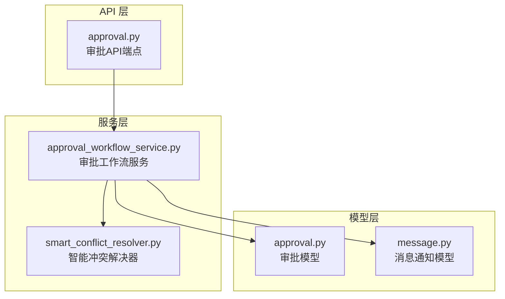
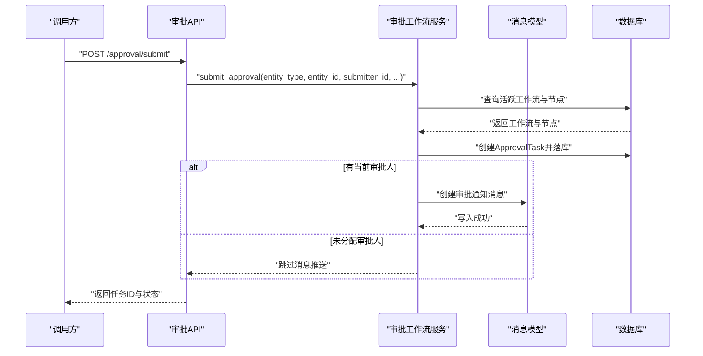
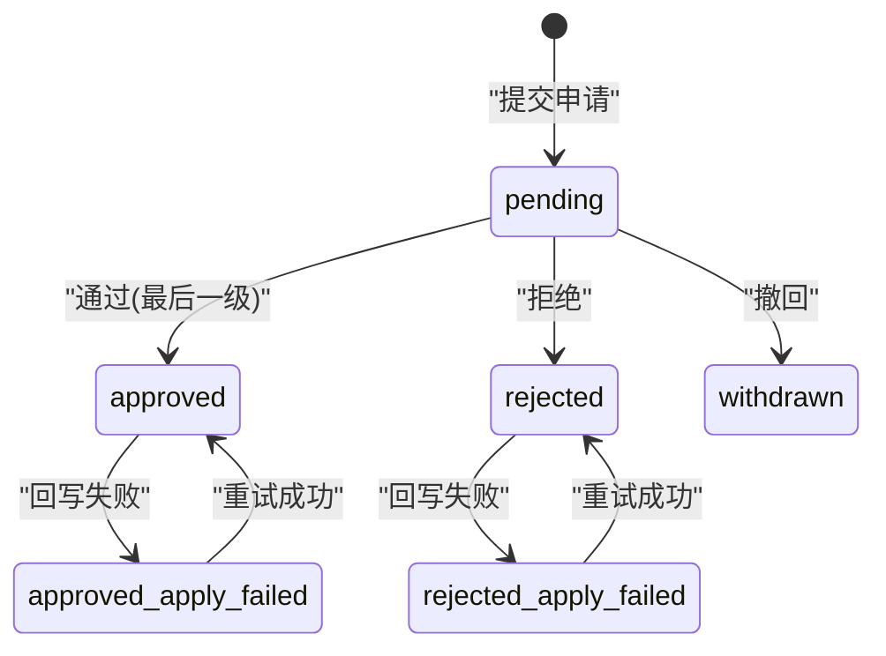
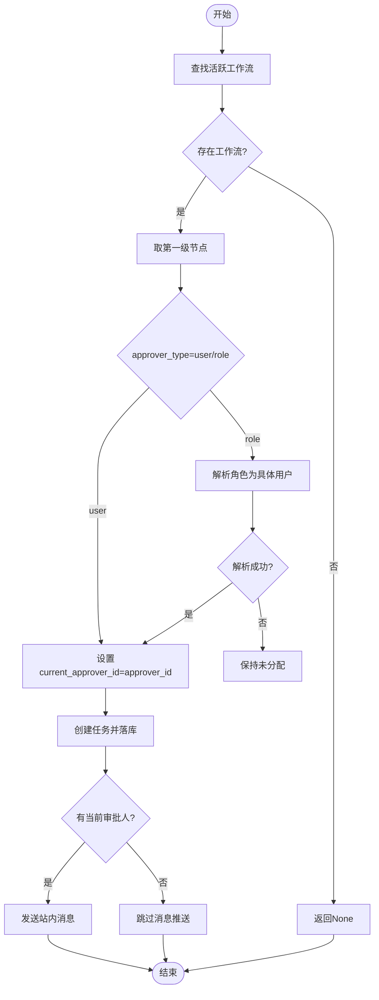
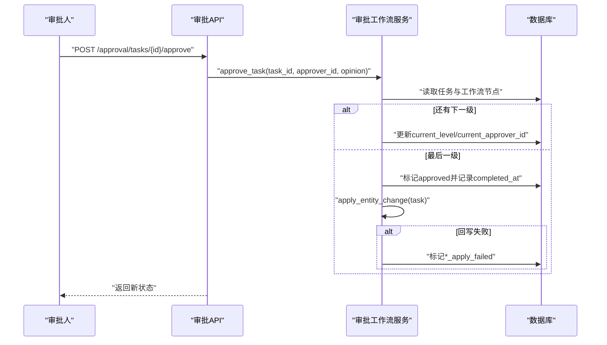
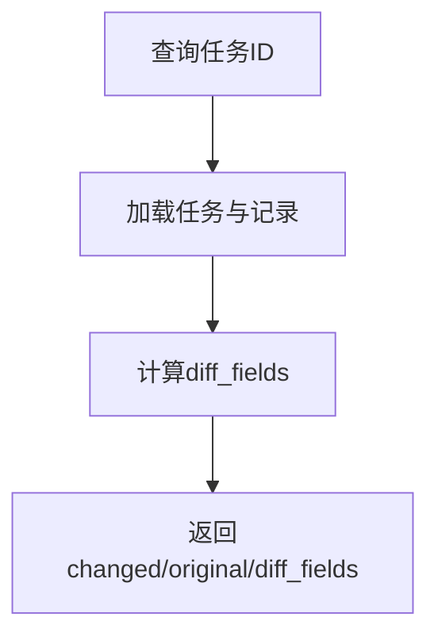
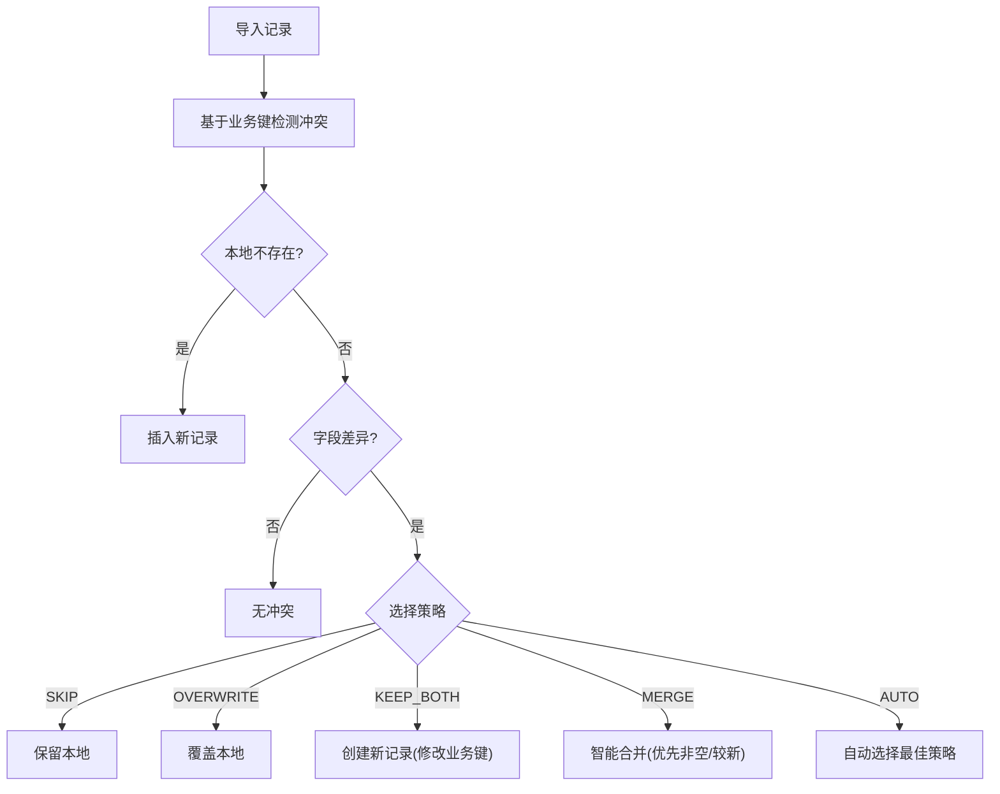
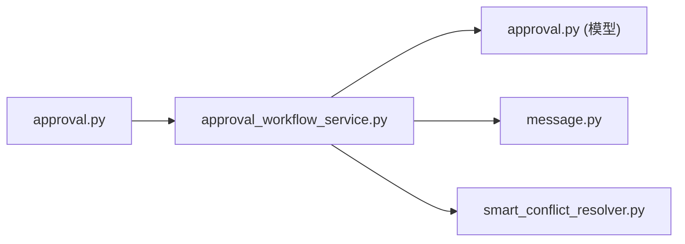

# 审批工作流服务

<cite>
**本文引用的文件**
- [backend/app/services/approval_workflow_service.py](file://backend/app/services/approval_workflow_service.py)
- [backend/app/models/approval.py](file://backend/app/models/approval.py)
- [backend/app/api/v1/approval.py](file://backend/app/api/v1/approval.py)
- [backend/app/models/message.py](file://backend/app/models/message.py)
- [backend/app/services/smart_conflict_resolver.py](file://backend/app/services/smart_conflict_resolver.py)
</cite>

## 目录
1. [简介](#简介)
2. [项目结构](#项目结构)
3. [核心组件](#核心组件)
4. [架构总览](#架构总览)
5. [详细组件分析](#详细组件分析)
6. [依赖关系分析](#依赖关系分析)
7. [性能与并发优化](#性能与并发优化)
8. [故障排查指南](#故障排查指南)
9. [结论](#结论)
10. [附录：扩展点与自定义流程开发指南](#附录：扩展点与自定义流程开发指南)

## 简介
本技术文档围绕“审批工作流服务”展开，系统性阐述多级审批流程的核心业务逻辑、任务自动分配、状态管理机制、历史记录追踪、规则引擎与冲突解决策略，以及启动/执行/暂停/恢复等状态转换过程。同时提供自定义审批流程的扩展点说明与性能优化建议，帮助开发者快速理解并扩展系统能力。

## 项目结构
审批相关代码主要分布在以下模块：
- 数据模型层：定义审批流程、节点、任务、记录及消息通知模型
- 服务层：实现审批工作流的生命周期管理、任务推进、回写业务实体、重试机制等
- API 层：暴露审批流程配置、任务操作、批量处理、历史查询等接口
- 冲突解决：提供导入场景下的智能冲突检测与解决策略（与审批回写配合）

**图表来源**
- [backend/app/api/v1/approval.py:1-120](file://backend/app/api/v1/approval.py#L1-L120)
- [backend/app/services/approval_workflow_service.py:1-120](file://backend/app/services/approval_workflow_service.py#L1-L120)
- [backend/app/models/approval.py:1-120](file://backend/app/models/approval.py#L1-L120)
- [backend/app/models/message.py:1-87](file://backend/app/models/message.py#L1-L87)
- [backend/app/services/smart_conflict_resolver.py:1-120](file://backend/app/services/smart_conflict_resolver.py#L1-L120)

**章节来源**
- [backend/app/api/v1/approval.py:1-120](file://backend/app/api/v1/approval.py#L1-L120)
- [backend/app/services/approval_workflow_service.py:1-120](file://backend/app/services/approval_workflow_service.py#L1-L120)
- [backend/app/models/approval.py:1-120](file://backend/app/models/approval.py#L1-L120)
- [backend/app/models/message.py:1-87](file://backend/app/models/message.py#L1-L87)
- [backend/app/services/smart_conflict_resolver.py:1-120](file://backend/app/services/smart_conflict_resolver.py#L1-L120)

## 核心组件
- 审批工作流服务：负责流程CRUD、任务提交与推进、状态机流转、历史与差异对比、批处理与重试、实体变更回写注册与执行
- 审批数据模型：流程、节点、任务、记录、状态与动作枚举
- 审批API：面向前端的完整接口集合，含权限控制、消息通知、单机版快捷操作
- 消息通知：审批任务创建与结果通知
- 冲突解决：导入场景下基于业务键的冲突检测与策略执行（SKIP/OVERWRITE/KEEP_BOTH/MERGE/AUTO）

**章节来源**
- [backend/app/services/approval_workflow_service.py:30-120](file://backend/app/services/approval_workflow_service.py#L30-L120)
- [backend/app/models/approval.py:29-291](file://backend/app/models/approval.py#L29-L291)
- [backend/app/api/v1/approval.py:223-800](file://backend/app/api/v1/approval.py#L223-L800)
- [backend/app/models/message.py:25-87](file://backend/app/models/message.py#L25-L87)
- [backend/app/services/smart_conflict_resolver.py:17-145](file://backend/app/services/smart_conflict_resolver.py#L17-L145)

## 架构总览
审批工作流采用分层架构：API 层接收请求并进行权限校验与参数绑定；服务层封装核心业务逻辑与状态机；模型层持久化数据；消息模块用于通知；冲突解决器在导入场景中辅助数据一致性。

**图表来源**
- [backend/app/api/v1/approval.py:380-414](file://backend/app/api/v1/approval.py#L380-L414)
- [backend/app/services/approval_workflow_service.py:203-278](file://backend/app/services/approval_workflow_service.py#L203-L278)
- [backend/app/models/message.py:34-87](file://backend/app/models/message.py#L34-L87)

## 详细组件分析

### 审批数据模型与状态机
- 流程与工作流：支持最多5级审批节点，按 level 顺序推进
- 任务：记录实体类型、实体ID、提交人、当前级别、当前审批人、状态、变更前后数据、优先级、标题、完成时间等
- 记录：每次审批操作的留痕（通过/拒绝/转交），包含意见、目标用户、原因等
- 状态机：pending → approved/rejected/withdrawn；支持 *_apply_failed 中间态以标记回写失败可重试

**图表来源**
- [backend/app/models/approval.py:36-51](file://backend/app/models/approval.py#L36-L51)
- [backend/app/models/approval.py:138-223](file://backend/app/models/approval.py#L138-L223)
- [backend/app/services/approval_workflow_service.py:447-567](file://backend/app/services/approval_workflow_service.py#L447-L567)

**章节来源**
- [backend/app/models/approval.py:29-291](file://backend/app/models/approval.py#L29-L291)
- [backend/app/services/approval_workflow_service.py:447-567](file://backend/app/services/approval_workflow_service.py#L447-L567)

### 审批任务自动分配与角色解析
- 提交流程：根据实体类型匹配活跃工作流，取第一级节点确定当前审批人
- 角色型节点：将角色标识解析为具体用户（如管理员），解析失败则保持未分配，由待审批板块兜底可见
- 待审批列表：管理员视角可查看所有 pending 任务；普通用户仅查看分配给自己或自己提交的 pending 任务

**图表来源**
- [backend/app/services/approval_workflow_service.py:203-308](file://backend/app/services/approval_workflow_service.py#L203-L308)
- [backend/app/services/approval_workflow_service.py:318-367](file://backend/app/services/approval_workflow_service.py#L318-L367)

**章节来源**
- [backend/app/services/approval_workflow_service.py:203-308](file://backend/app/services/approval_workflow_service.py#L203-L308)
- [backend/app/services/approval_workflow_service.py:318-367](file://backend/app/services/approval_workflow_service.py#L318-L367)

### 审批执行与状态推进（通过/拒绝/转交/撤回/重新提交）
- 通过：记录审批意见，若还有下一级则推进到下一节点；否则标记为已通过并尝试回写业务实体
- 拒绝：记录拒绝意见，终止流程并尝试回写业务实体
- 转交：记录转交信息，更新当前审批人
- 撤回：仅提交人可撤回，标记为已撤回
- 重新提交：被驳回或撤回的任务可重置到第一级并重新进入流程

**图表来源**
- [backend/app/api/v1/approval.py:416-450](file://backend/app/api/v1/approval.py#L416-L450)
- [backend/app/services/approval_workflow_service.py:447-504](file://backend/app/services/approval_workflow_service.py#L447-L504)

**章节来源**
- [backend/app/api/v1/approval.py:416-450](file://backend/app/api/v1/approval.py#L416-L450)
- [backend/app/services/approval_workflow_service.py:447-504](file://backend/app/services/approval_workflow_service.py#L447-L504)

### 审批历史记录与变更对比
- 历史记录：按任务维度记录每次操作（通过/拒绝/转交），支持按实体、提交人、状态过滤与分页
- 变更对比：返回变更前后数据与差异字段，兼容新旧前端键名

**图表来源**
- [backend/app/services/approval_workflow_service.py:759-822](file://backend/app/services/approval_workflow_service.py#L759-L822)

**章节来源**
- [backend/app/services/approval_workflow_service.py:759-822](file://backend/app/services/approval_workflow_service.py#L759-L822)

### 规则引擎与冲突解决策略
- 规则引擎：通过工作流节点配置（level、approver_type、approver_id、timeout_hours）驱动审批链
- 冲突解决：导入时基于业务唯一键检测冲突，支持 SKIP/OVERWRITE/KEEP_BOTH/MERGE/AUTO 策略；AUTO 依据差异数量与更新时间智能选择
- 与审批回写协同：审批终态触发业务实体状态变更；导入冲突解决确保数据一致性，避免重复或覆盖错误

**图表来源**
- [backend/app/services/smart_conflict_resolver.py:82-145](file://backend/app/services/smart_conflict_resolver.py#L82-L145)
- [backend/app/services/smart_conflict_resolver.py:179-339](file://backend/app/services/smart_conflict_resolver.py#L179-L339)

**章节来源**
- [backend/app/services/smart_conflict_resolver.py:82-145](file://backend/app/services/smart_conflict_resolver.py#L82-L145)
- [backend/app/services/smart_conflict_resolver.py:179-339](file://backend/app/services/smart_conflict_resolver.py#L179-L339)

### 消息通知与审计日志
- 消息通知：任务创建与审批结果均会生成站内消息，失败不阻断主流程
- 审计日志：关键操作（如重试回写）记录工作日志，便于追溯

**章节来源**
- [backend/app/api/v1/approval.py:65-84](file://backend/app/api/v1/approval.py#L65-L84)
- [backend/app/models/message.py:34-87](file://backend/app/models/message.py#L34-L87)
- [backend/app/api/v1/approval.py:486-512](file://backend/app/api/v1/approval.py#L486-L512)

## 依赖关系分析
- API 依赖服务：审批API调用 ApprovalWorkflowService 完成核心逻辑
- 服务依赖模型：使用 ApprovalWorkflow/ApprovalNode/ApprovalTask/ApprovalRecord 进行数据持久化
- 服务依赖消息：创建审批通知消息
- 服务依赖冲突解决：在导入场景下使用 SmartConflictResolver 保证数据一致性

**图表来源**
- [backend/app/api/v1/approval.py:223-800](file://backend/app/api/v1/approval.py#L223-L800)
- [backend/app/services/approval_workflow_service.py:1-120](file://backend/app/services/approval_workflow_service.py#L1-L120)
- [backend/app/models/approval.py:1-120](file://backend/app/models/approval.py#L1-L120)
- [backend/app/models/message.py:1-87](file://backend/app/models/message.py#L1-L87)
- [backend/app/services/smart_conflict_resolver.py:1-120](file://backend/app/services/smart_conflict_resolver.py#L1-L120)

**章节来源**
- [backend/app/api/v1/approval.py:223-800](file://backend/app/api/v1/approval.py#L223-L800)
- [backend/app/services/approval_workflow_service.py:1-120](file://backend/app/services/approval_workflow_service.py#L1-L120)
- [backend/app/models/approval.py:1-120](file://backend/app/models/approval.py#L1-L120)
- [backend/app/models/message.py:1-87](file://backend/app/models/message.py#L1-L87)
- [backend/app/services/smart_conflict_resolver.py:1-120](file://backend/app/services/smart_conflict_resolver.py#L1-L120)

## 性能与并发优化
- 事务隔离：使用 safe_commit 包裹关键写入，确保原子性；批处理中每个任务独立事务，避免单点失败影响整体
- 索引优化：模型层对常用查询字段建立索引（如 workflow_id、entity_type/entity_id、status、priority/created_at 等）
- 查询优化：使用 joinedload 预加载关联对象，减少N+1查询；分页查询结合 count 统计提升列表性能
- 幂等与重试：*_apply_failed 状态支持重试，避免业务状态不一致；消息推送失败不阻断主流程
- 并发安全：批量审批与自动审批遍历任务时捕获异常并继续，保证整体稳定性

[本节为通用指导，无需特定文件引用]

## 故障排查指南
- 无法创建审批任务：检查是否存在对应实体类型的活跃工作流；若无，系统将自动创建默认单节点流程
- 审批失败：确认任务状态为 pending 且当前用户具备审批权限；单机模式下允许跳过审批人校验
- 回写失败：查看任务状态是否包含 *_apply_failed；管理员可通过重试接口恢复最终状态
- 消息推送失败：检查消息模块可用性；失败不影响审批主流程，仅记录警告日志

**章节来源**
- [backend/app/services/approval_workflow_service.py:203-278](file://backend/app/services/approval_workflow_service.py#L203-L278)
- [backend/app/services/approval_workflow_service.py:447-567](file://backend/app/services/approval_workflow_service.py#L447-L567)
- [backend/app/api/v1/approval.py:486-512](file://backend/app/api/v1/approval.py#L486-L512)

## 结论
审批工作流服务提供了完整的多级审批能力，涵盖流程配置、任务分配、状态机推进、历史记录、冲突解决与通知机制。通过可扩展的回写处理器与灵活的节点配置，系统能够适配多种业务场景。建议在部署时关注索引与事务设计，结合重试机制保障数据一致性与系统稳定性。

[本节为总结性内容，无需特定文件引用]

## 附录：扩展点与自定义流程开发指南
- 注册实体变更回写处理器：通过类方法注册回调，在审批终态时更新业务实体状态
- 自定义审批流程：创建流程与节点，指定实体类型、审批人类型与超时策略
- 集成业务模块：在数据变更后调用通用入口函数，自动创建审批任务；若无工作流则自动创建默认流程
- 冲突解决策略：在导入场景中选择合适策略，确保数据一致性与完整性

**章节来源**
- [backend/app/services/approval_workflow_service.py:30-71](file://backend/app/services/approval_workflow_service.py#L30-L71)
- [backend/app/services/approval_workflow_service.py:76-124](file://backend/app/services/approval_workflow_service.py#L76-L124)
- [backend/app/services/approval_workflow_service.py:825-875](file://backend/app/services/approval_workflow_service.py#L825-L875)
- [backend/app/services/smart_conflict_resolver.py:17-25](file://backend/app/services/smart_conflict_resolver.py#L17-L25)
- [backend/app/services/smart_conflict_resolver.py:179-339](file://backend/app/services/smart_conflict_resolver.py#L179-L339)