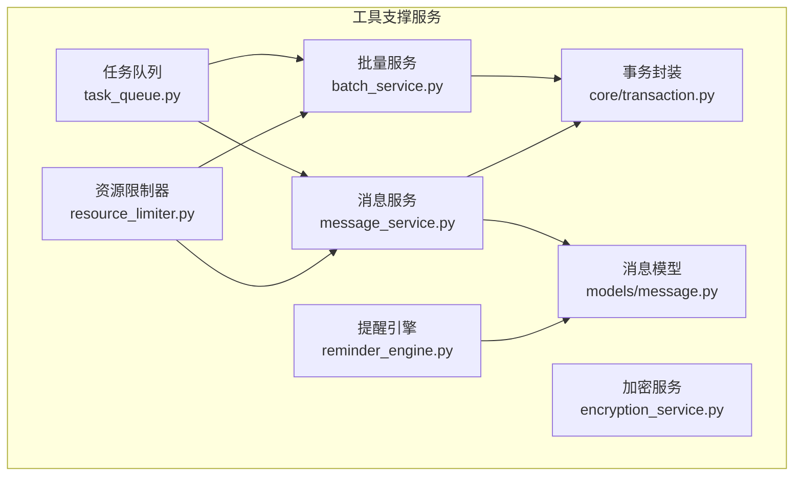
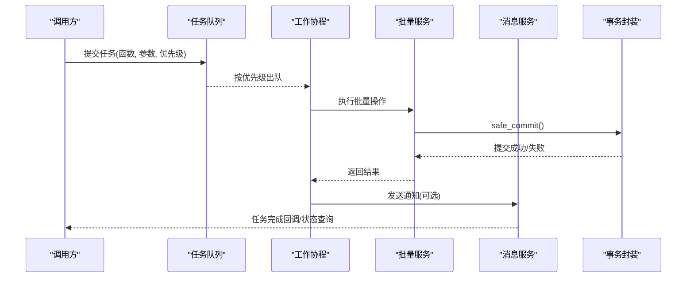
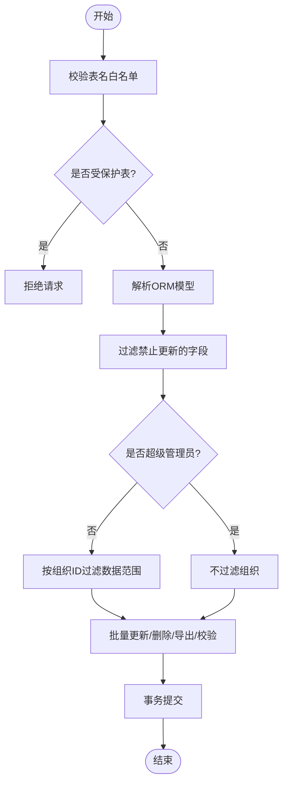
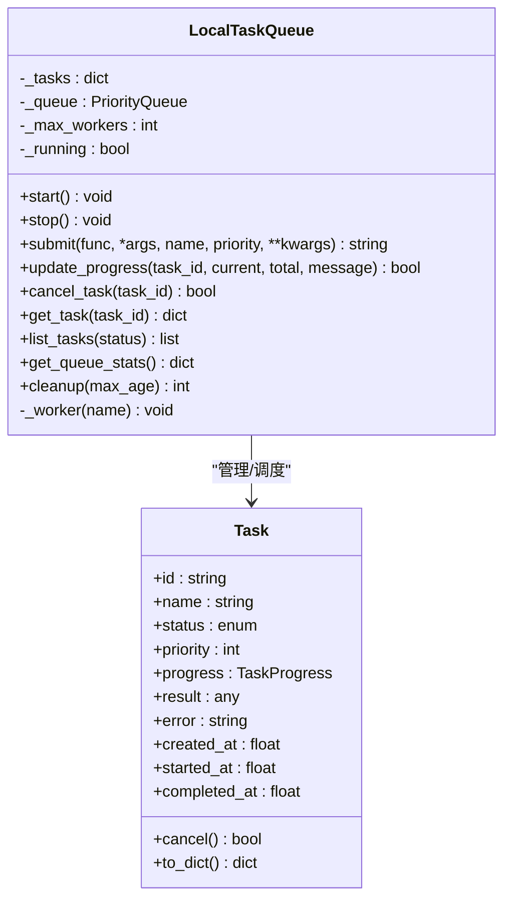
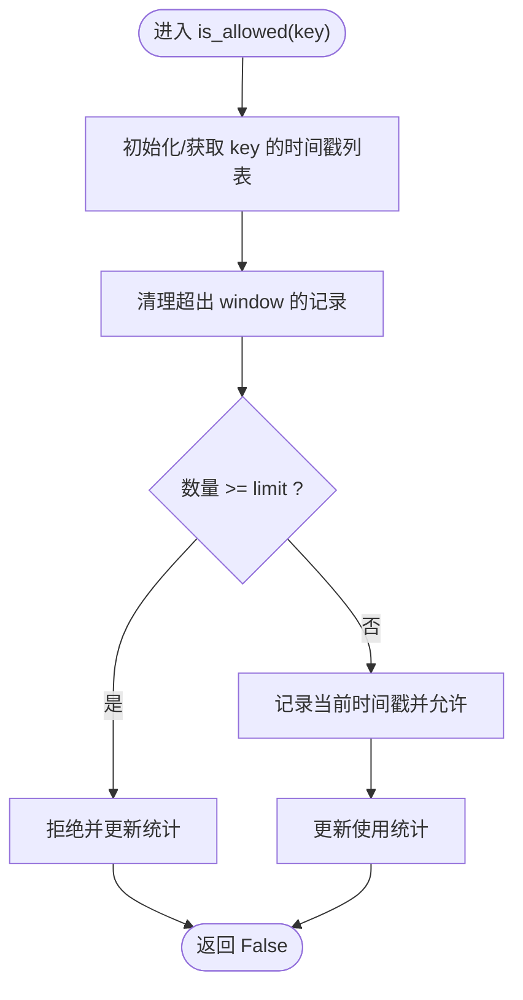
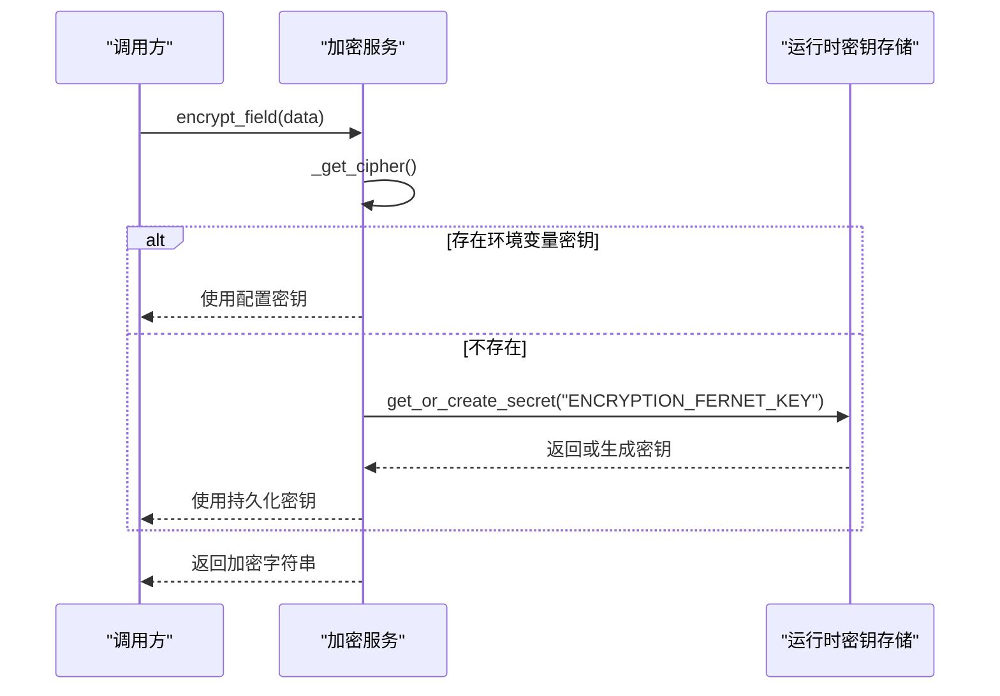
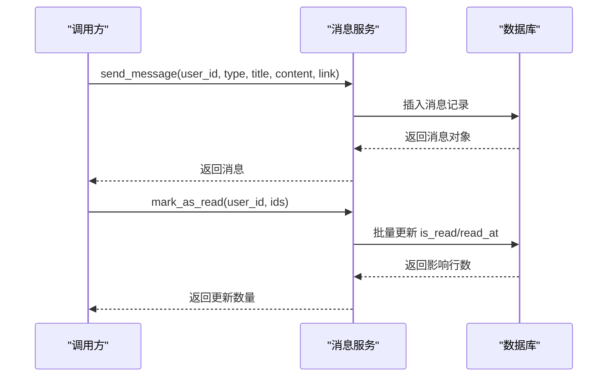
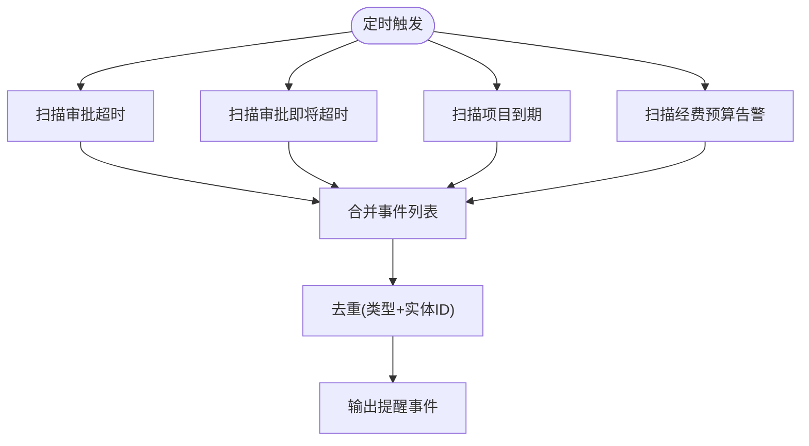
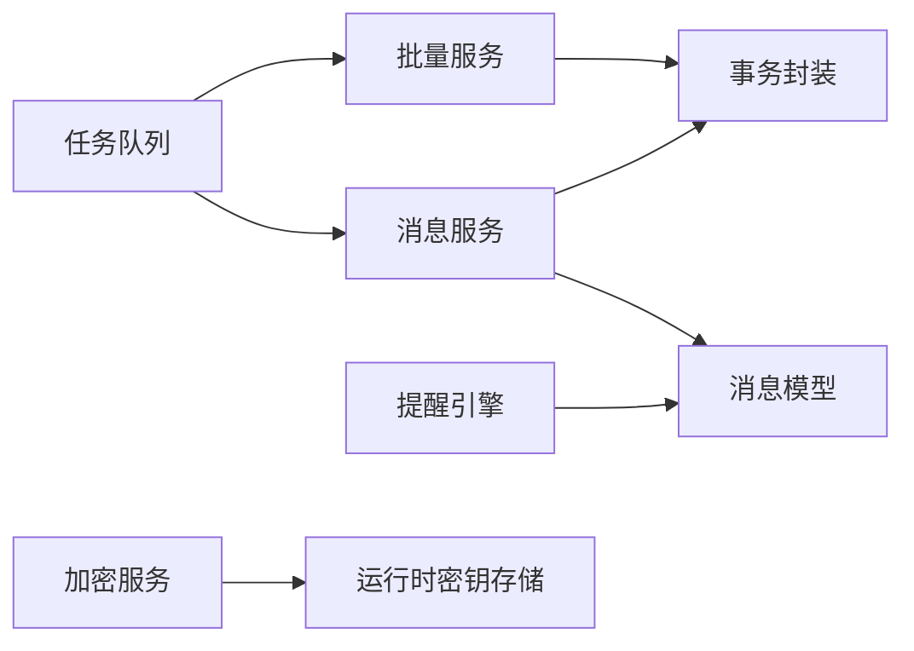

# 工具支撑服务

<cite>
**本文引用的文件**
- [backend/app/services/batch_service.py](file://backend/app/services/batch_service.py)
- [backend/app/services/task_queue.py](file://backend/app/services/task_queue.py)
- [backend/app/services/resource_limiter.py](file://backend/app/services/resource_limiter.py)
- [backend/app/services/encryption_service.py](file://backend/app/services/encryption_service.py)
- [backend/app/services/message_service.py](file://backend/app/services/message_service.py)
- [backend/app/services/reminder_engine.py](file://backend/app/services/reminder_engine.py)
- [backend/app/core/transaction.py](file://backend/app/core/transaction.py)
- [backend/app/models/message.py](file://backend/app/models/message.py)
</cite>

## 目录
1. [简介](#简介)
2. [项目结构](#项目结构)
3. [核心组件](#核心组件)
4. [架构总览](#架构总览)
5. [详细组件分析](#详细组件分析)
6. [依赖关系分析](#依赖关系分析)
7. [性能与并发优化](#性能与并发优化)
8. [故障排查指南](#故障排查指南)
9. [结论](#结论)
10. [附录：配置与扩展指南](#附录：配置与扩展指南)

## 简介
本技术文档聚焦“工具支撑服务”的通用能力，覆盖批量处理、任务队列、资源限制、加密解密、消息通知与提醒引擎等模块。重点说明异步任务调度、限流控制与安全加密的技术实现，并给出消息模板管理、提醒规则与通知渠道的配置方法，以及复用模式与扩展开发指南，附带并发处理与性能优化的最佳实践。

## 项目结构
工具支撑服务主要位于后端服务的 services 层，围绕以下关键文件组织：
- 批量操作：batch_service.py
- 本地任务队列：task_queue.py
- 资源限制：resource_limiter.py
- 数据加密：encryption_service.py
- 站内消息：message_service.py
- 提醒引擎：reminder_engine.py
- 事务封装：core/transaction.py
- 消息模型：models/message.py

**图表来源**
- [backend/app/services/batch_service.py:1-244](file://backend/app/services/batch_service.py#L1-L244)
- [backend/app/services/task_queue.py:1-307](file://backend/app/services/task_queue.py#L1-L307)
- [backend/app/services/resource_limiter.py:1-172](file://backend/app/services/resource_limiter.py#L1-L172)
- [backend/app/services/encryption_service.py:1-261](file://backend/app/services/encryption_service.py#L1-L261)
- [backend/app/services/message_service.py:1-416](file://backend/app/services/message_service.py#L1-L416)
- [backend/app/services/reminder_engine.py:1-128](file://backend/app/services/reminder_engine.py#L1-L128)
- [backend/app/core/transaction.py:1-200](file://backend/app/core/transaction.py#L1-L200)
- [backend/app/models/message.py:1-200](file://backend/app/models/message.py#L1-L200)

**章节来源**
- [backend/app/services/batch_service.py:1-244](file://backend/app/services/batch_service.py#L1-L244)
- [backend/app/services/task_queue.py:1-307](file://backend/app/services/task_queue.py#L1-L307)
- [backend/app/services/resource_limiter.py:1-172](file://backend/app/services/resource_limiter.py#L1-L172)
- [backend/app/services/encryption_service.py:1-261](file://backend/app/services/encryption_service.py#L1-L261)
- [backend/app/services/message_service.py:1-416](file://backend/app/services/message_service.py#L1-L416)
- [backend/app/services/reminder_engine.py:1-128](file://backend/app/services/reminder_engine.py#L1-L128)
- [backend/app/core/transaction.py:1-200](file://backend/app/core/transaction.py#L1-L200)
- [backend/app/models/message.py:1-200](file://backend/app/models/message.py#L1-L200)

## 核心组件
- 批量服务：提供表级白名单校验、受保护表拒绝、敏感字段过滤、软删除策略、组织数据隔离与批量更新/删除/导出/校验能力。
- 任务队列：内存优先队列，支持优先级、进度追踪、取消、统计与清理；自动启动 worker；兼容同步/异步函数执行。
- 资源限制器：基于时间窗口的滑动计数限流，支持配额设置、使用统计与监控开关。
- 加密服务：Fernet 对称加密，支持文件/数据加解密、密钥生成与持久化缓存（环境变量或运行时密钥存储）。
- 消息服务：站内消息发送、未读计数、列表查询（类型/状态/时间）、标记已读、批量删除、过期清理与统计。
- 提醒引擎：扫描审批超时/即将超时、项目到期预警、经费预算告警，输出统一事件结构供上层编排。

**章节来源**
- [backend/app/services/batch_service.py:1-244](file://backend/app/services/batch_service.py#L1-L244)
- [backend/app/services/task_queue.py:1-307](file://backend/app/services/task_queue.py#L1-L307)
- [backend/app/services/resource_limiter.py:1-172](file://backend/app/services/resource_limiter.py#L1-L172)
- [backend/app/services/encryption_service.py:1-261](file://backend/app/services/encryption_service.py#L1-L261)
- [backend/app/services/message_service.py:1-416](file://backend/app/services/message_service.py#L1-L416)
- [backend/app/services/reminder_engine.py:1-128](file://backend/app/services/reminder_engine.py#L1-L128)

## 架构总览
工具支撑服务以“可插拔+可组合”的方式为业务模块提供通用能力。典型调用链如下：
- API/业务逻辑 → 任务队列提交异步任务 → Worker 执行 → 批量服务/消息服务/加密服务等具体能力 → 事务提交/结果返回
- 提醒引擎定时扫描 → 生成提醒事件 → 通过消息服务下发站内通知

**图表来源**
- [backend/app/services/task_queue.py:124-288](file://backend/app/services/task_queue.py#L124-L288)
- [backend/app/services/batch_service.py:138-204](file://backend/app/services/batch_service.py#L138-L204)
- [backend/app/services/message_service.py:44-91](file://backend/app/services/message_service.py#L44-L91)
- [backend/app/core/transaction.py:1-200](file://backend/app/core/transaction.py#L1-L200)

## 详细组件分析

### 批量处理（BatchService）
- 安全边界
  - 表名白名单校验，受保护表（如用户、组织）直接拒绝，防止提权通道。
  - 敏感字段黑名单过滤，避免误改 id、权限、密码等关键字段。
- 数据隔离
  - 非超级管理员在批量更新/删除时按 organization_id 进行数据范围限制。
- 批量优化
  - 使用 in_ 条件批量查询，避免 N+1 问题；批量 COUNT 提升校验效率。
- 软删除策略
  - 优先使用 is_active/is_deleted 标记，否则执行物理删除。
- 事务一致性
  - 通过事务封装统一提交，确保批量操作的原子性。

**图表来源**
- [backend/app/services/batch_service.py:36-80](file://backend/app/services/batch_service.py#L36-L80)
- [backend/app/services/batch_service.py:142-204](file://backend/app/services/batch_service.py#L142-L204)

**章节来源**
- [backend/app/services/batch_service.py:1-244](file://backend/app/services/batch_service.py#L1-L244)
- [backend/app/core/transaction.py:1-200](file://backend/app/core/transaction.py#L1-L200)

### 任务队列（LocalTaskQueue）
- 优先级调度
  - 基于 asyncio.PriorityQueue，数值越小优先级越高；同优先级按创建时间排序。
- 自动启动与自愈
  - 首次 submit 时自动启动 worker；应用未显式 start 也能执行任务。
- 任务生命周期
  - 支持 PENDING/RUNNING/COMPLETED/FAILED/CANCELLED 状态流转；支持进度更新与取消。
- 执行模型
  - 自动识别协程函数；对普通函数通过线程池执行，避免阻塞事件循环。
- 资源治理
  - 提供统计信息与历史任务清理，避免内存膨胀。

**图表来源**
- [backend/app/services/task_queue.py:20-122](file://backend/app/services/task_queue.py#L20-L122)
- [backend/app/services/task_queue.py:124-288](file://backend/app/services/task_queue.py#L124-L288)

**章节来源**
- [backend/app/services/task_queue.py:1-307](file://backend/app/services/task_queue.py#L1-L307)

### 资源限制（ResourceLimiter）
- 滑动窗口限流
  - 维护每个 key 的请求时间戳列表，按 window 清理过期记录，判断是否超过 limit。
- 配额管理
  - set_quota/clear_quota 动态配置；is_allowed 同时更新使用统计。
- 监控与统计
  - 提供 UsageStats 统计总量、允许数、拒绝数与最近重置时间；支持监控开关。

**图表来源**
- [backend/app/services/resource_limiter.py:65-96](file://backend/app/services/resource_limiter.py#L65-L96)
- [backend/app/services/resource_limiter.py:137-148](file://backend/app/services/resource_limiter.py#L137-L148)

**章节来源**
- [backend/app/services/resource_limiter.py:1-172](file://backend/app/services/resource_limiter.py#L1-L172)

### 加密解密（EncryptionService）
- 算法与密钥
  - 使用 Fernet 对称加密；支持传入密钥或自动生成；提供密钥生成工具。
- 持久化缓存
  - 优先从环境变量/配置读取 ENCRYPTION_KEY；否则从运行时密钥存储加载或生成并持久化；缓存 cipher 实例减少开销。
- 功能范围
  - 文件与字节数据加解密；字段级加解密便捷方法；异常时抛出明确错误信息。

**图表来源**
- [backend/app/services/encryption_service.py:177-224](file://backend/app/services/encryption_service.py#L177-L224)
- [backend/app/services/encryption_service.py:233-260](file://backend/app/services/encryption_service.py#L233-L260)

**章节来源**
- [backend/app/services/encryption_service.py:1-261](file://backend/app/services/encryption_service.py#L1-L261)

### 消息通知（MessageService）
- 消息类型
  - 系统通知、审批通知、任务提醒三类；发送时进行类型校验。
- 未读计数
  - 全局未读数与按类型分组计数，便于前端展示。
- 列表查询
  - 支持按类型、已读状态、时间范围筛选；分页与倒序排列。
- 已读与删除
  - 单条/批量标记已读；批量删除；一键清空已读消息。
- 清理与统计
  - 按保留天数清理过期消息；提供统计接口汇总总数、未读数、分类型未读数。

**图表来源**
- [backend/app/services/message_service.py:44-91](file://backend/app/services/message_service.py#L44-L91)
- [backend/app/services/message_service.py:254-281](file://backend/app/services/message_service.py#L254-L281)
- [backend/app/models/message.py:1-200](file://backend/app/models/message.py#L1-L200)

**章节来源**
- [backend/app/services/message_service.py:1-416](file://backend/app/services/message_service.py#L1-L416)
- [backend/app/models/message.py:1-200](file://backend/app/models/message.py#L1-L200)

### 提醒引擎（ReminderEngine）
- 扫描规则
  - 审批超时：PENDING 且超过阈值小时的任务。
  - 审批即将超时：在预警区间内的 PENDING 任务。
  - 项目到期：活跃项目且截止日期临近。
  - 经费预算告警：已用金额占比达到预警/危险阈值。
- 输出结构
  - 统一的事件字典，包含类型、实体ID、标题、耗时/剩余天数、严重级别与归属人（user_id），便于后续编排与去重。

**图表来源**
- [backend/app/services/reminder_engine.py:15-128](file://backend/app/services/reminder_engine.py#L15-L128)

**章节来源**
- [backend/app/services/reminder_engine.py:1-128](file://backend/app/services/reminder_engine.py#L1-L128)

## 依赖关系分析
- 组件耦合
  - 批量服务依赖事务封装保证一致性；消息服务依赖消息模型与事务封装；提醒引擎依赖业务模型（审批、项目、经费）。
  - 任务队列作为调度中心，可驱动批量服务与消息服务，形成“异步编排”链路。
- 外部依赖
  - 加密服务依赖 cryptography 库；任务队列依赖 asyncio；消息服务依赖 SQLAlchemy ORM。
- 潜在风险
  - 批量服务需严格维护表名白名单与敏感字段黑名单；任务队列在高并发下需关注内存占用与 worker 数量；加密密钥需安全存储与轮换。

**图表来源**
- [backend/app/services/task_queue.py:124-288](file://backend/app/services/task_queue.py#L124-L288)
- [backend/app/services/batch_service.py:138-204](file://backend/app/services/batch_service.py#L138-L204)
- [backend/app/services/message_service.py:44-91](file://backend/app/services/message_service.py#L44-L91)
- [backend/app/services/reminder_engine.py:15-128](file://backend/app/services/reminder_engine.py#L15-L128)
- [backend/app/services/encryption_service.py:177-224](file://backend/app/services/encryption_service.py#L177-L224)

**章节来源**
- [backend/app/services/task_queue.py:1-307](file://backend/app/services/task_queue.py#L1-L307)
- [backend/app/services/batch_service.py:1-244](file://backend/app/services/batch_service.py#L1-L244)
- [backend/app/services/message_service.py:1-416](file://backend/app/services/message_service.py#L1-L416)
- [backend/app/services/reminder_engine.py:1-128](file://backend/app/services/reminder_engine.py#L1-L128)
- [backend/app/services/encryption_service.py:1-261](file://backend/app/services/encryption_service.py#L1-L261)

## 性能与并发优化
- 批量处理
  - 使用 in_ 批量查询与批量 COUNT，避免 N+1；组织维度过滤减少无效数据；软删除优先使用布尔列，降低 IO。
- 任务队列
  - 合理设置 max_workers；对 CPU 密集任务使用线程池执行；及时清理已完成任务释放内存；利用优先级保障关键任务。
- 资源限制
  - 滑动窗口清理过期记录，避免列表无限增长；按 key 粒度限流，区分不同业务场景。
- 加密服务
  - 缓存 cipher 实例；密钥持久化减少重复生成；大文件加解密建议分块处理（可扩展）。
- 消息服务
  - 分页与索引优化查询；批量更新/删除减少事务次数；定期清理过期消息。

[本节为通用指导，不直接分析具体文件]

## 故障排查指南
- 批量操作失败
  - 检查表名是否在白名单；确认是否命中受保护表；核对敏感字段是否被过滤；验证组织数据隔离条件。
- 任务队列异常
  - 检查 worker 是否启动；确认任务是否为协程或可在线程池执行；查看任务状态与错误日志；必要时调整 max_workers。
- 资源限制误判
  - 核对 key 的 limit 与 window 配置；检查时间戳列表是否被正确清理；查看使用统计是否异常。
- 加密失败
  - 确认密钥格式与来源（环境变量/运行时存储）；检查密钥文件权限与磁盘空间；捕获并记录具体异常。
- 消息发送/更新失败
  - 检查消息类型是否合法；确认 user_id 与权限；查看事务提交是否成功；排查数据库连接与锁等待。

**章节来源**
- [backend/app/services/batch_service.py:36-80](file://backend/app/services/batch_service.py#L36-L80)
- [backend/app/services/task_queue.py:251-288](file://backend/app/services/task_queue.py#L251-L288)
- [backend/app/services/resource_limiter.py:65-96](file://backend/app/services/resource_limiter.py#L65-L96)
- [backend/app/services/encryption_service.py:177-224](file://backend/app/services/encryption_service.py#L177-L224)
- [backend/app/services/message_service.py:44-91](file://backend/app/services/message_service.py#L44-L91)

## 结论
工具支撑服务通过“批量处理+任务队列+资源限制+加密解密+消息通知+提醒引擎”的组合，提供了稳定、安全、可扩展的通用能力。其设计强调安全边界（白名单/黑名单/数据隔离）、异步编排（优先级队列/进度追踪）与性能优化（批量查询/缓存/清理）。在实际使用中，应结合业务场景合理配置限流与队列参数，规范密钥管理与消息模板，持续监控与调优，以获得更佳的稳定性与吞吐表现。

## 附录：配置与扩展指南
- 消息模板管理
  - 建议在消息服务基础上抽象模板引擎，将标题与内容拆分为模板与变量；在发送前渲染模板，支持多语言与多渠道（站内、邮件、短信等）。
- 提醒规则配置
  - 将阈值（小时/天/百分比）抽离为配置项；支持按组织/角色差异化配置；提醒事件统一由编排器分发到通知渠道。
- 通知渠道扩展
  - 定义统一的通知接口；实现站内、邮件、短信、IM 等适配器；根据用户偏好与渠道可用性选择投递策略。
- 复用模式
  - 将批量服务、任务队列、资源限制器封装为可注入的服务；通过工厂或依赖注入在不同模块中复用；保持接口稳定，内部实现可替换。
- 扩展开发
  - 新增批量表：在白名单中添加表名映射，并在模型中确保具备组织隔离字段；新增提醒规则：在提醒引擎中增加扫描函数并接入编排器；新增加密用途：复用 _get_cipher 与字段级加解密方法。

[本节为概念性指导，不直接分析具体文件]