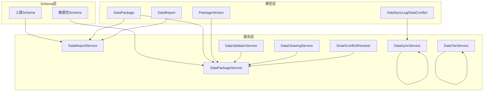
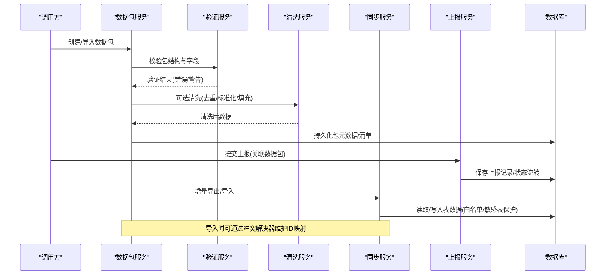
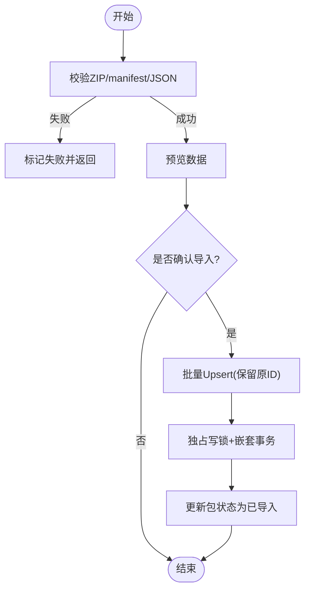
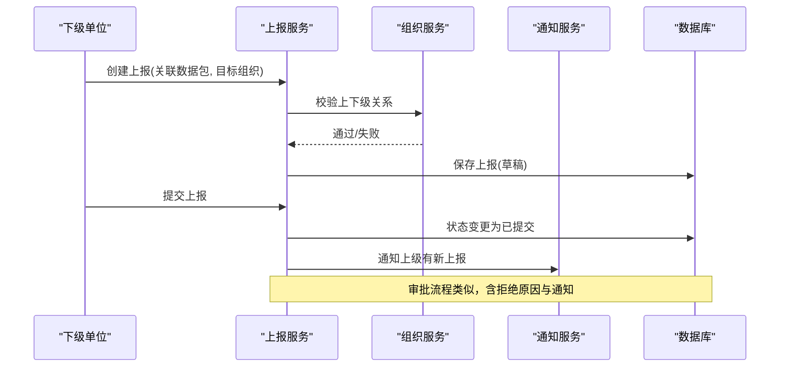
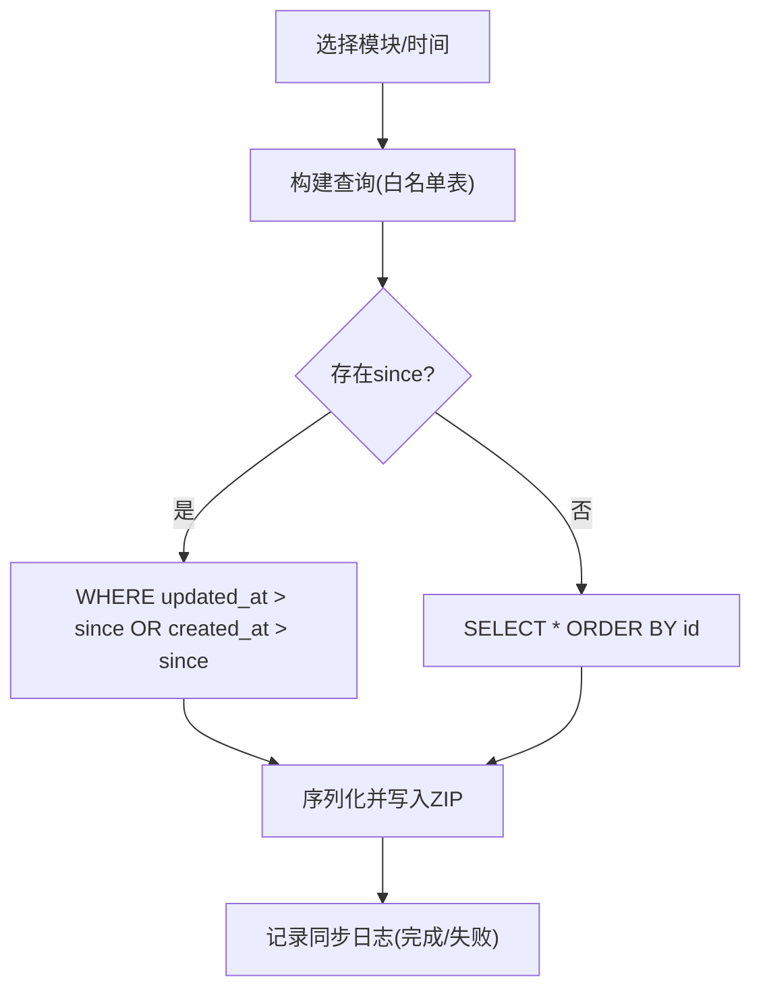
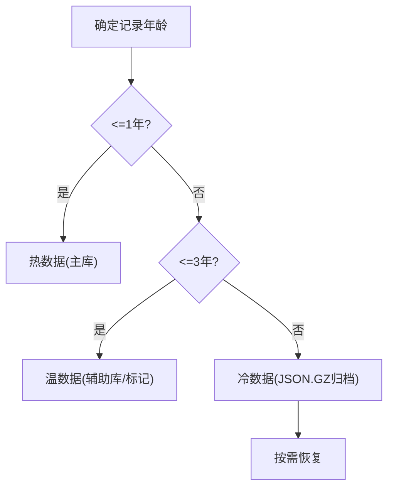
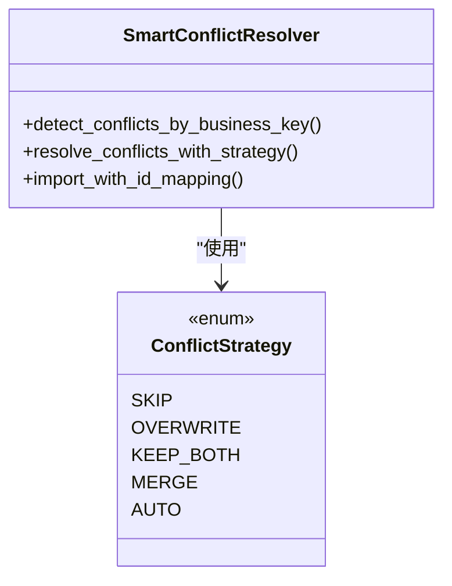
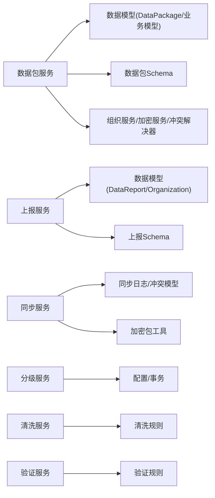
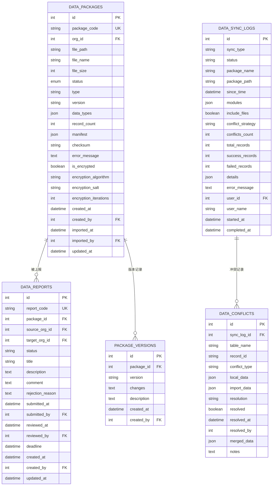

# 数据管理服务

<cite>
**本文引用的文件**
- [data_package.py](file://backend/app/models/data_package.py)
- [data_report.py](file://backend/app/models/data_report.py)
- [data_sync.py](file://backend/app/models/data_sync.py)
- [package_version.py](file://backend/app/models/package_version.py)
- [schemas/data_package.py](file://backend/app/schemas/data_package.py)
- [schemas/data_report.py](file://backend/app/schemas/data_report.py)
- [data_package_service.py](file://backend/app/services/data_package_service.py)
- [data_report_service.py](file://backend/app/services/data_report_service.py)
- [data_sync_service.py](file://backend/app/services/data_sync_service.py)
- [data_tier_service.py](file://backend/app/services/data_tier_service.py)
- [data_cleaning_service.py](file://backend/app/services/data_cleaning_service.py)
- [data_validator_service.py](file://backend/app/services/data_validator_service.py)
- [smart_conflict_resolver.py](file://backend/app/services/smart_conflict_resolver.py)
</cite>

## 目录
1. [简介](#简介)
2. [项目结构](#项目结构)
3. [核心组件](#核心组件)
4. [架构总览](#架构总览)
5. [详细组件分析](#详细组件分析)
6. [依赖关系分析](#依赖关系分析)
7. [性能与内存优化](#性能与内存优化)
8. [故障排查指南](#故障排查指南)
9. [结论](#结论)
10. [附录：接口与数据模型说明](#附录接口与数据模型说明)

## 简介
本技术文档围绕“数据管理服务”展开，覆盖数据包管理、数据报告生成、数据同步、数据分级、数据清洗与数据验证等核心能力。重点阐述各服务间的协作关系与数据流转机制，并文档化导入导出、增量同步、冲突解决与版本管理的实现细节；同时提供数据质量监控与治理的接口说明，以及大数据量处理与内存优化的最佳实践。

## 项目结构
后端采用分层架构：
- 模型层（models）：定义数据包、上报、同步日志/冲突、版本等实体。
- Schema层（schemas）：定义请求/响应契约，如数据包导出/导入、上报审核等。
- 服务层（services）：封装业务逻辑，包括数据包服务、上报服务、同步服务、分级服务、清洗服务、验证服务、冲突解决器等。
- 核心支撑：数据库协调器、事务工具、加密服务、路径工具等。

图表来源
- [data_package.py:38-123](file://backend/app/models/data_package.py#L38-L123)
- [data_report.py:29-141](file://backend/app/models/data_report.py#L29-L141)
- [data_sync.py:8-72](file://backend/app/models/data_sync.py#L8-L72)
- [package_version.py:15-44](file://backend/app/models/package_version.py#L15-L44)
- [schemas/data_package.py:61-170](file://backend/app/schemas/data_package.py#L61-L170)
- [schemas/data_report.py:17-107](file://backend/app/schemas/data_report.py#L17-L107)
- [data_package_service.py:68-800](file://backend/app/services/data_package_service.py#L68-L800)
- [data_report_service.py:81-492](file://backend/app/services/data_report_service.py#L81-L492)
- [data_sync_service.py:87-933](file://backend/app/services/data_sync_service.py#L87-L933)
- [data_tier_service.py:51-407](file://backend/app/services/data_tier_service.py#L51-L407)
- [data_cleaning_service.py:14-297](file://backend/app/services/data_cleaning_service.py#L14-L297)
- [data_validator_service.py:86-800](file://backend/app/services/data_validator_service.py#L86-L800)
- [smart_conflict_resolver.py:76-459](file://backend/app/services/smart_conflict_resolver.py#L76-L459)

章节来源
- [data_package.py:38-123](file://backend/app/models/data_package.py#L38-L123)
- [data_report.py:29-141](file://backend/app/models/data_report.py#L29-L141)
- [data_sync.py:8-72](file://backend/app/models/data_sync.py#L8-L72)
- [package_version.py:15-44](file://backend/app/models/package_version.py#L15-L44)
- [schemas/data_package.py:61-170](file://backend/app/schemas/data_package.py#L61-L170)
- [schemas/data_report.py:17-107](file://backend/app/schemas/data_report.py#L17-L107)

## 核心组件
- 数据包管理：负责数据的打包导出、校验、预览、导入、加密/解密、确认导入与冲突策略集成。
- 数据上报：组织间的数据提交、审批流、统计与下级单位看板。
- 数据同步：增量导出/导入、表级白名单、敏感表保护、冲突记录与解决。
- 数据分级：热/温/冷三级存储迁移与归档恢复。
- 数据清洗：去重、格式标准化、缺失值填充、空白规范化。
- 数据验证：文件格式/大小/行数限制、必填字段、类型与范围校验、重复检测、县市区白名单校验。
- 冲突解决：基于业务键的冲突检测与多策略解决（跳过/覆盖/保留双份/合并/自动）。

章节来源
- [data_package_service.py:68-800](file://backend/app/services/data_package_service.py#L68-L800)
- [data_report_service.py:81-492](file://backend/app/services/data_report_service.py#L81-L492)
- [data_sync_service.py:87-933](file://backend/app/services/data_sync_service.py#L87-L933)
- [data_tier_service.py:51-407](file://backend/app/services/data_tier_service.py#L51-L407)
- [data_cleaning_service.py:14-297](file://backend/app/services/data_cleaning_service.py#L14-L297)
- [data_validator_service.py:86-800](file://backend/app/services/data_validator_service.py#L86-L800)
- [smart_conflict_resolver.py:76-459](file://backend/app/services/smart_conflict_resolver.py#L76-L459)

## 架构总览
数据从上游系统或用户导入后，经清洗与验证进入数据包；数据包可被上报至上级组织进行审批；也可通过同步服务进行跨环境/跨库的增量同步；历史数据按生命周期分级归档；导入过程中遇到冲突由智能冲突解决器统一处理。

图表来源
- [data_package_service.py:98-181](file://backend/app/services/data_package_service.py#L98-L181)
- [data_validator_service.py:165-302](file://backend/app/services/data_validator_service.py#L165-L302)
- [data_cleaning_service.py:18-279](file://backend/app/services/data_cleaning_service.py#L18-L279)
- [data_sync_service.py:128-233](file://backend/app/services/data_sync_service.py#L128-L233)
- [data_report_service.py:110-193](file://backend/app/services/data_report_service.py#L110-L193)
- [smart_conflict_resolver.py:340-400](file://backend/app/services/smart_conflict_resolver.py#L340-L400)

## 详细组件分析

### 数据包管理（导入/导出/加密/确认导入）
- 导出：支持全量与增量（基于 sync_version 或 updated_at），生成 manifest.json 与 data/*.json，计算校验和，落库 DataPackage。
- 导入：校验 ZIP/manifest/JSON，持久化包记录，支持预览与字段级校验摘要。
- 确认导入：使用批量 Upsert（保留原始 ID，避免外键孤儿），结合独占写锁与嵌套事务保障一致性；支持 overwrite/nothing 策略。
- 加密：导出后可对 ZIP 进行 AES 加密，导入时自动解密并清理临时文件。
- 冲突集成：可与 SmartConflictResolver 配合，按依赖顺序导入并维护 ID 映射。

图表来源
- [data_package_service.py:286-350](file://backend/app/services/data_package_service.py#L286-L350)
- [data_package_service.py:397-481](file://backend/app/services/data_package_service.py#L397-L481)
- [data_package_service.py:514-559](file://backend/app/services/data_package_service.py#L514-L559)
- [data_package_service.py:565-611](file://backend/app/services/data_package_service.py#L565-L611)
- [data_package_service.py:613-687](file://backend/app/services/data_package_service.py#L613-L687)

章节来源
- [data_package_service.py:98-181](file://backend/app/services/data_package_service.py#L98-L181)
- [data_package_service.py:239-350](file://backend/app/services/data_package_service.py#L239-L350)
- [data_package_service.py:397-559](file://backend/app/services/data_package_service.py#L397-L559)
- [data_package_service.py:565-687](file://backend/app/services/data_package_service.py#L565-L687)

### 数据上报（提交/审批/统计/看板）
- 创建上报：绑定数据包，校验目标组织为上级，生成上报编码。
- 提交上报：状态机约束（草稿→已提交），记录提交人与时间，通知上级。
- 审批上报：支持批准/拒绝，记录审批意见与原因，通知下级。
- 统计与看板：汇总各状态数量、逾期数、批准率；按组织维度聚合展示。

图表来源
- [data_report_service.py:110-193](file://backend/app/services/data_report_service.py#L110-L193)
- [data_report_service.py:195-235](file://backend/app/services/data_report_service.py#L195-L235)
- [data_report_service.py:285-435](file://backend/app/services/data_report_service.py#L285-L435)

章节来源
- [data_report_service.py:110-193](file://backend/app/services/data_report_service.py#L110-L193)
- [data_report_service.py:195-235](file://backend/app/services/data_report_service.py#L195-L235)
- [data_report_service.py:285-435](file://backend/app/services/data_report_service.py#L285-L435)

### 数据同步（增量导出/导入/冲突记录）
- 增量导出：按 since 时间过滤，逐表导出到 ZIP，记录同步日志。
- 导入：表名白名单与敏感表保护；根据策略 skip/overwrite/manual 处理冲突；manual 模式记录 DataConflict 待人工解决。
- 加密同步：支持 .rrs 格式的加密导出/导入，带哈希与元数据。

图表来源
- [data_sync_service.py:128-233](file://backend/app/services/data_sync_service.py#L128-L233)
- [data_sync_service.py:304-395](file://backend/app/services/data_sync_service.py#L304-L395)
- [data_sync_service.py:576-704](file://backend/app/services/data_sync_service.py#L576-L704)

章节来源
- [data_sync_service.py:128-233](file://backend/app/services/data_sync_service.py#L128-L233)
- [data_sync_service.py:304-395](file://backend/app/services/data_sync_service.py#L304-L395)
- [data_sync_service.py:576-704](file://backend/app/services/data_sync_service.py#L576-L704)

### 数据分级（热/温/冷）
- 分级规则：依据记录日期划分热（<1年）、温（1-3年）、冷（>3年）。
- 归档：温数据可迁移至辅助库，冷数据压缩为 JSON.GZ 归档并删除主库记录。
- 恢复：支持从归档文件恢复指定记录或全部。
- 统计与建议：提供存储占用统计与优化建议。

图表来源
- [data_tier_service.py:80-101](file://backend/app/services/data_tier_service.py#L80-L101)
- [data_tier_service.py:143-252](file://backend/app/services/data_tier_service.py#L143-L252)
- [data_tier_service.py:264-316](file://backend/app/services/data_tier_service.py#L264-L316)

章节来源
- [data_tier_service.py:80-101](file://backend/app/services/data_tier_service.py#L80-L101)
- [data_tier_service.py:143-252](file://backend/app/services/data_tier_service.py#L143-L252)
- [data_tier_service.py:264-316](file://backend/app/services/data_tier_service.py#L264-L316)

### 数据清洗（去重/标准化/填充）
- 去重：支持关键字段模糊匹配（相似度阈值）。
- 标准化：电话、邮箱、地址等格式统一。
- 缺失值填充：默认值、均值、中位数、众数策略。
- 批量清洗：组合规则一次性处理数据集。

章节来源
- [data_cleaning_service.py:18-279](file://backend/app/services/data_cleaning_service.py#L18-L279)

### 数据验证（Excel/通用）
- Excel导入验证：文件格式/大小/行数限制、必填字段、类型与范围、县市区白名单、重复检查。
- 通用验证：身份证号格式与校验码、重复检测、输入清理。
- 结果摘要：按错误类型/字段分组，便于前端展示与定位。

章节来源
- [data_validator_service.py:165-302](file://backend/app/services/data_validator_service.py#L165-L302)
- [data_validator_service.py:514-665](file://backend/app/services/data_validator_service.py#L514-L665)
- [data_validator_service.py:724-800](file://backend/app/services/data_validator_service.py#L724-L800)

### 冲突解决（智能）
- 业务键冲突检测：按数据类型定义的业务唯一键（如 code/village_name）比对本地与导入数据。
- 策略：跳过、覆盖、保留双份（修改业务键避免冲突）、合并（优先非空值/较新时间戳）、自动（差异少则合并，否则比较更新时间）。
- 依赖顺序导入：villages → schools → projects → funds，维护 ID 映射以正确更新外键。

图表来源
- [smart_conflict_resolver.py:76-459](file://backend/app/services/smart_conflict_resolver.py#L76-L459)

章节来源
- [smart_conflict_resolver.py:82-144](file://backend/app/services/smart_conflict_resolver.py#L82-L144)
- [smart_conflict_resolver.py:179-274](file://backend/app/services/smart_conflict_resolver.py#L179-L274)
- [smart_conflict_resolver.py:340-400](file://backend/app/services/smart_conflict_resolver.py#L340-L400)

## 依赖关系分析
- 数据包服务依赖：
  - 模型：DataPackage、Project/Fund/School/SupportedVillage
  - Schema：数据包导出/导入/预览/验证/确认等
  - 服务：OrganizationService、PasswordEncryptionService、SmartConflictResolver、validate_records
- 上报服务依赖：
  - 模型：DataReport、DataPackage、Organization
  - Schema：上报创建/审核/统计/看板
  - 服务：OrganizationService、NotificationService（简化实现）
- 同步服务依赖：
  - 模型：DataSyncLog、DataConflict
  - 工具：加密包 create_encrypted_package/extract_encrypted_package
  - 安全：表名白名单与敏感表保护
- 分级服务依赖：
  - 配置：数据库路径、归档目录
  - 事务：safe_commit
- 清洗/验证服务：
  - 无外部强依赖，纯数据处理与规则校验

图表来源
- [data_package_service.py:68-800](file://backend/app/services/data_package_service.py#L68-L800)
- [data_report_service.py:81-492](file://backend/app/services/data_report_service.py#L81-L492)
- [data_sync_service.py:87-933](file://backend/app/services/data_sync_service.py#L87-L933)
- [data_tier_service.py:51-407](file://backend/app/services/data_tier_service.py#L51-L407)
- [data_cleaning_service.py:14-297](file://backend/app/services/data_cleaning_service.py#L14-L297)
- [data_validator_service.py:86-800](file://backend/app/services/data_validator_service.py#L86-L800)

章节来源
- [data_package_service.py:68-800](file://backend/app/services/data_package_service.py#L68-L800)
- [data_report_service.py:81-492](file://backend/app/services/data_report_service.py#L81-L492)
- [data_sync_service.py:87-933](file://backend/app/services/data_sync_service.py#L87-L933)
- [data_tier_service.py:51-407](file://backend/app/services/data_tier_service.py#L51-L407)
- [data_cleaning_service.py:14-297](file://backend/app/services/data_cleaning_service.py#L14-L297)
- [data_validator_service.py:86-800](file://backend/app/services/data_validator_service.py#L86-L800)

## 性能与内存优化
- 事件循环保护：涉及大量 I/O 与同步 DB 操作的方法统一为同步 def，避免阻塞异步路由。
- 批量写入：使用 SQLAlchemy 2.0 批量插入/更新，减少往返次数。
- 事务与锁：使用 SAVEPOINT 与 exclusive_write 防止 SQLite_BUSY 与并发写冲突。
- 增量导出：基于 sync_version 或 updated_at 过滤，降低数据量。
- 流式读取：ZIP 内文件按需读取，避免一次性加载大对象。
- 字段归一化：批量前补齐键集合，减少 SQL 编译失败与回滚。
- 白名单与敏感表：同步导入时对表名严格校验，避免注入与误改。
- 归档压缩：冷数据使用 gzip 压缩，降低存储与传输成本。
- 内存控制：分批处理（batch_size=1000），及时释放中间变量。

章节来源
- [data_package_service.py:68-800](file://backend/app/services/data_package_service.py#L68-L800)
- [data_sync_service.py:128-233](file://backend/app/services/data_sync_service.py#L128-L233)
- [data_tier_service.py:143-252](file://backend/app/services/data_tier_service.py#L143-L252)

## 故障排查指南
- 数据包验证失败：检查 ZIP 完整性、manifest.json 是否存在且版本受支持、数据文件与清单记录数是否一致。
- 导入失败：查看包 error_message；确认状态是否为 validated；检查字段级校验 rejected 明细。
- 同步导入失败：核对表名是否在白名单；检查敏感表是否被禁止；查看同步日志 details 中的 errors。
- 冲突未解决：在 manual 模式下，查询 DataConflict 列表，按策略 resolve（keep_local/use_import/merge）。
- 加密导入失败：确认密码正确；检查临时解密文件是否被清理；查看异常信息。
- 上报状态异常：检查状态转换是否合法；确认目标组织是否为上级。

章节来源
- [data_package_service.py:286-350](file://backend/app/services/data_package_service.py#L286-L350)
- [data_package_service.py:397-481](file://backend/app/services/data_package_service.py#L397-L481)
- [data_sync_service.py:304-395](file://backend/app/services/data_sync_service.py#L304-L395)
- [data_sync_service.py:515-574](file://backend/app/services/data_sync_service.py#L515-L574)
- [data_report_service.py:195-235](file://backend/app/services/data_report_service.py#L195-L235)

## 结论
数据管理服务通过清晰的分层与职责划分，实现了从导入导出、上报审批、同步迁移、分级归档到清洗验证的全链路能力。借助批量写入、增量过滤、冲突解决与加密安全等机制，系统在大规模数据场景下具备良好的一致性与性能表现。建议在持续演进中完善告警与审计指标，进一步扩展自动化冲突解决策略与冷热数据迁移调度。

## 附录：接口与数据模型说明

### 数据包相关
- 导出请求：包含 org_id、data_types、type、incremental、since_sync_version 等。
- 导出结果：返回 package_id、package_code、file_path、manifest、download_url。
- 导入结果：返回 package_id、status、manifest、preview、validation、records_imported、errors。
- 确认导入：支持 overwrite_existing、selected_types 等参数。

章节来源
- [schemas/data_package.py:61-170](file://backend/app/schemas/data_package.py#L61-L170)
- [data_package_service.py:98-181](file://backend/app/services/data_package_service.py#L98-L181)
- [data_package_service.py:239-350](file://backend/app/services/data_package_service.py#L239-L350)
- [data_package_service.py:397-481](file://backend/app/services/data_package_service.py#L397-L481)

### 上报相关
- 创建上报：title、report_type、package_id、target_org_id、deadline 等。
- 审核动作：action（approve/reject）兼容 status 映射，支持 comment 与 rejection_reason。
- 统计与看板：返回总数、各状态计数、逾期数、批准率、下级单位汇总。

章节来源
- [schemas/data_report.py:17-107](file://backend/app/schemas/data_report.py#L17-L107)
- [data_report_service.py:110-193](file://backend/app/services/data_report_service.py#L110-L193)
- [data_report_service.py:285-435](file://backend/app/services/data_report_service.py#L285-L435)

### 同步相关
- 增量导出：ExportConfig(since、modules、include_files、user_id/user_name)。
- 导入策略：skip/overwrite/manual，记录冲突并支持后续解决。
- 加密导出/导入：.rrs 格式，带 metadata 与 file_hash。

章节来源
- [data_sync_service.py:76-108](file://backend/app/services/data_sync_service.py#L76-L108)
- [data_sync_service.py:128-233](file://backend/app/services/data_sync_service.py#L128-L233)
- [data_sync_service.py:304-395](file://backend/app/services/data_sync_service.py#L304-L395)
- [data_sync_service.py:576-704](file://backend/app/services/data_sync_service.py#L576-L704)

### 数据模型概览

图表来源
- [data_package.py:38-123](file://backend/app/models/data_package.py#L38-L123)
- [data_report.py:29-141](file://backend/app/models/data_report.py#L29-L141)
- [data_sync.py:8-72](file://backend/app/models/data_sync.py#L8-L72)
- [package_version.py:15-44](file://backend/app/models/package_version.py#L15-L44)