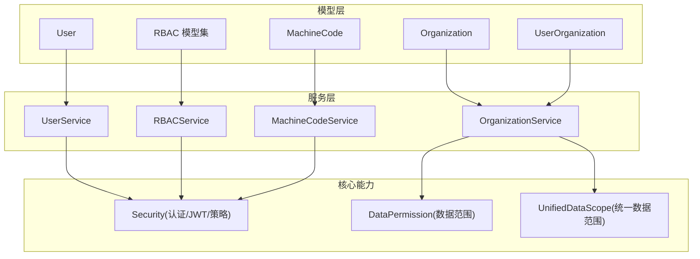
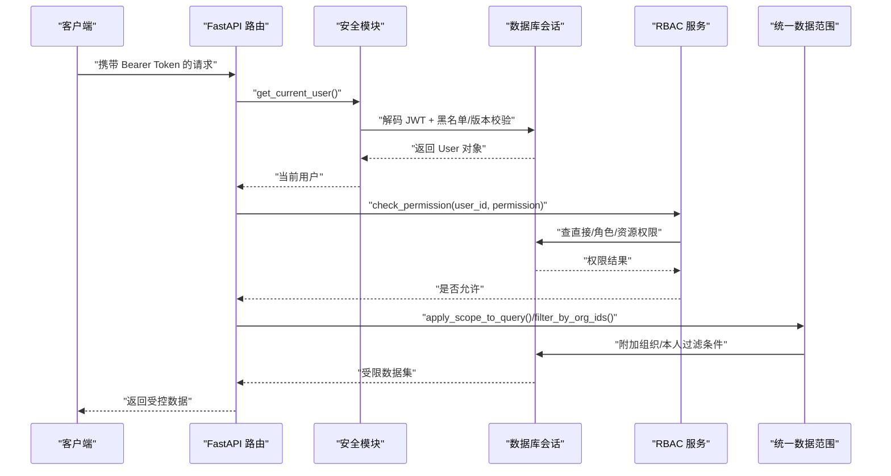
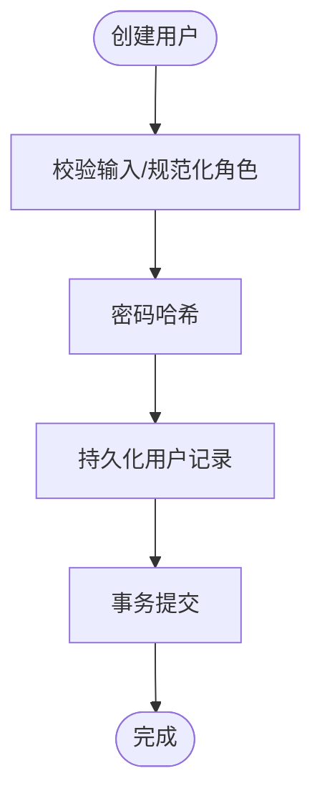
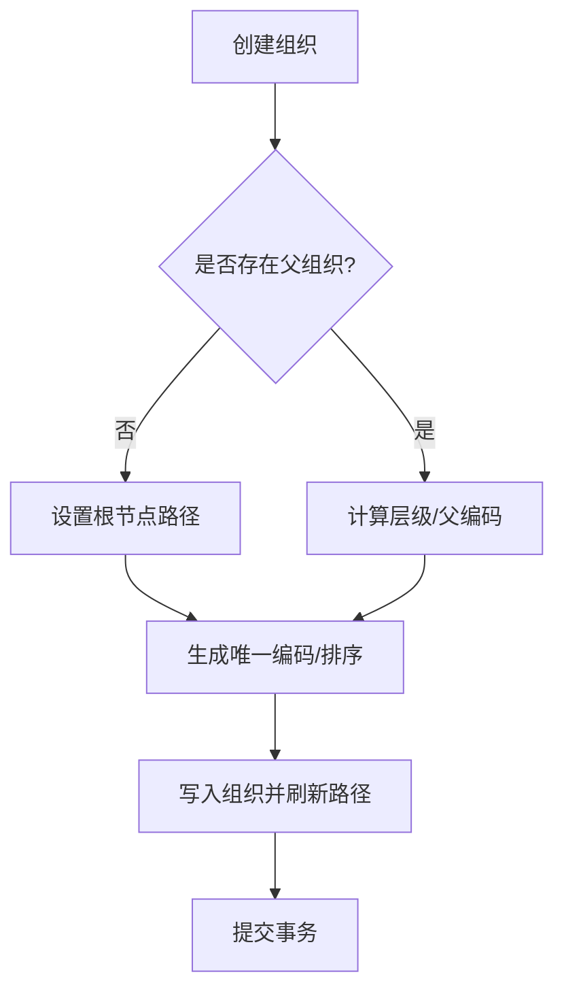
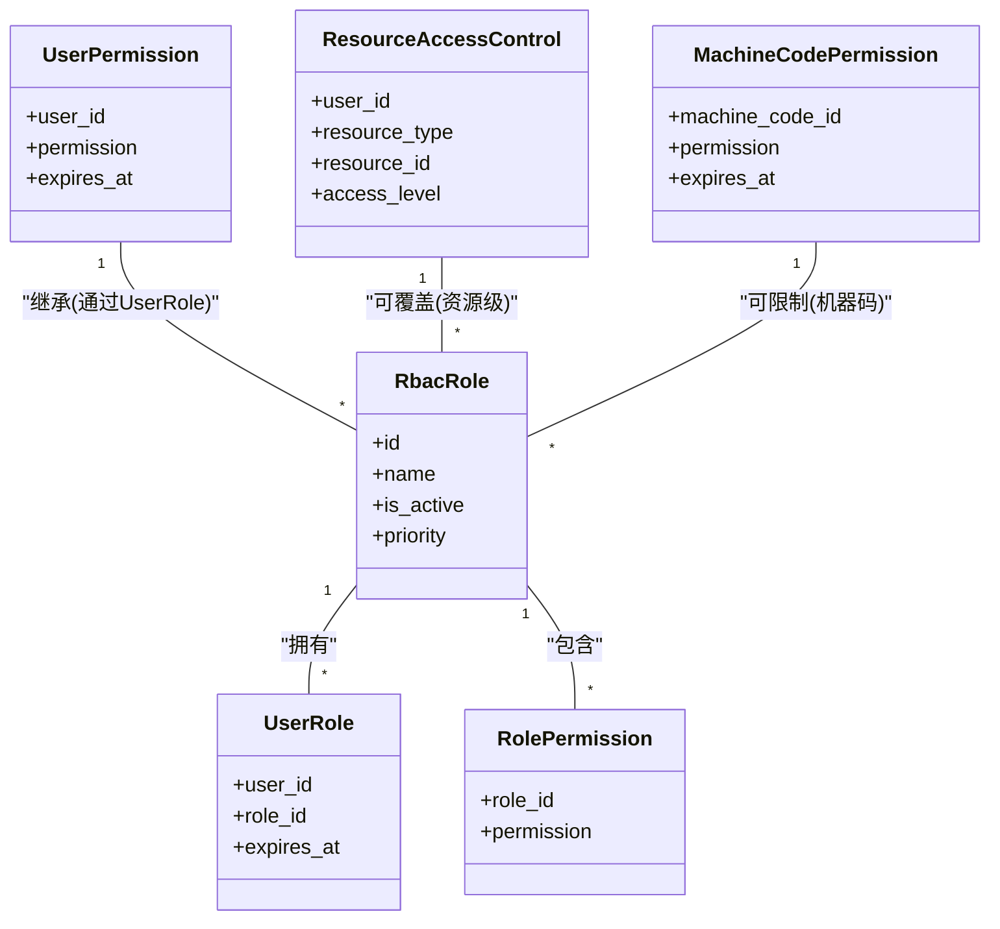
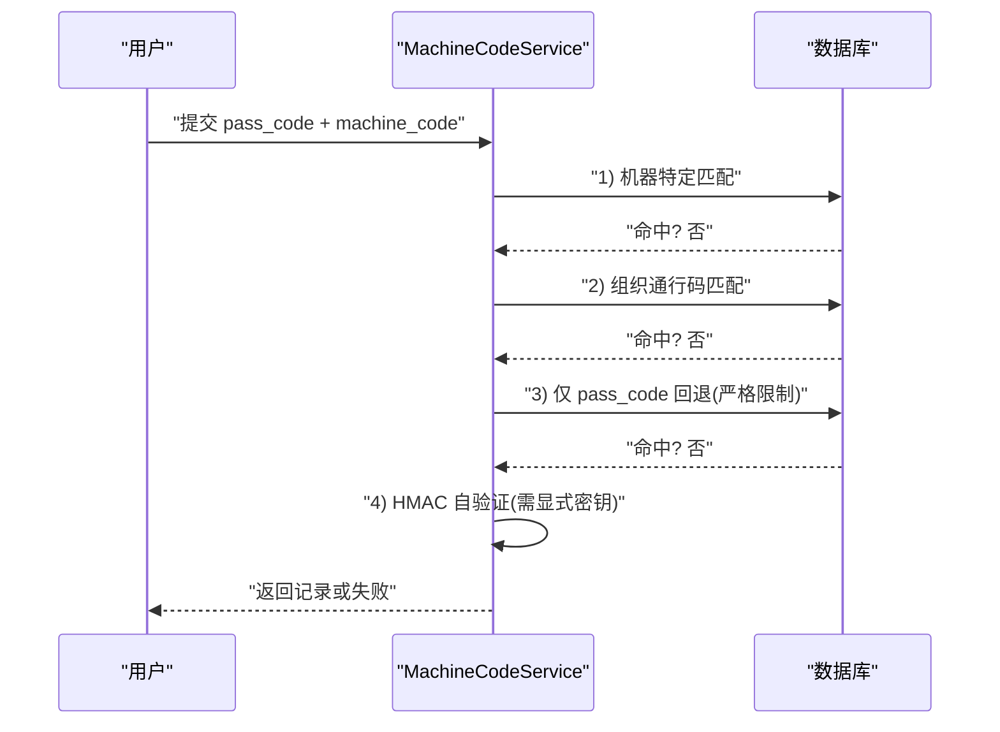
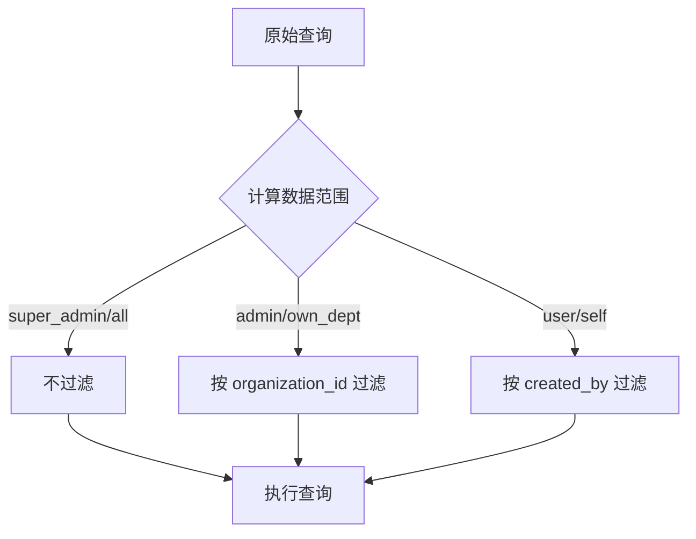
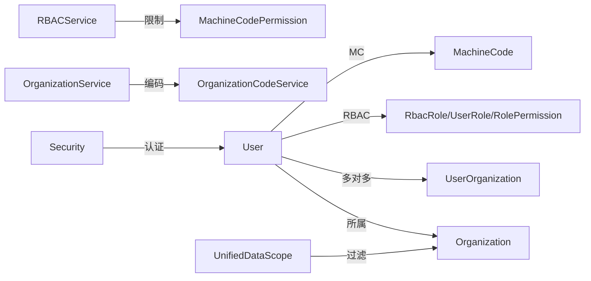

# 用户组织服务

<cite>
**本文引用的文件**
- [backend/app/models/user.py](file://backend/app/models/user.py)
- [backend/app/models/organization.py](file://backend/app/models/organization.py)
- [backend/app/models/rbac.py](file://backend/app/models/rbac.py)
- [backend/app/models/machine_code.py](file://backend/app/models/machine_code.py)
- [backend/app/models/user_organization.py](file://backend/app/models/user_organization.py)
- [backend/app/services/user_service.py](file://backend/app/services/user_service.py)
- [backend/app/services/organization_service.py](file://backend/app/services/organization_service.py)
- [backend/app/services/rbac_service.py](file://backend/app/services/rbac_service.py)
- [backend/app/services/machine_code_service.py](file://backend/app/services/machine_code_service.py)
- [backend/app/core/security.py](file://backend/app/core/security.py)
- [backend/app/core/data_permission.py](file://backend/app/core/data_permission.py)
- [backend/app/core/unified_data_scope.py](file://backend/app/core/unified_data_scope.py)
</cite>

## 目录
1. [简介](#简介)
2. [项目结构](#项目结构)
3. [核心组件](#核心组件)
4. [架构总览](#架构总览)
5. [详细组件分析](#详细组件分析)
6. [依赖关系分析](#依赖关系分析)
7. [性能考虑](#性能考虑)
8. [故障排查指南](#故障排查指南)
9. [结论](#结论)
10. [附录](#附录)

## 简介
本技术文档聚焦“用户组织服务”，围绕用户管理、组织管理、角色与权限控制（RBAC）、机器码绑定与通行码机制，系统阐述数据范围隔离、权限继承、多租户支持与安全认证授权的最佳实践。文档面向开发者与运维人员，既提供高层架构视图，也深入到关键实现细节与调用流程，帮助读者快速理解并安全扩展该服务。

## 项目结构
后端采用分层架构：模型层定义实体与关系；服务层封装业务逻辑；核心模块提供安全、数据范围、事务等横切能力；API 层通过 FastAPI 暴露接口（不在本文重点展开）。

图表来源
- [backend/app/models/user.py:26-85](file://backend/app/models/user.py#L26-L85)
- [backend/app/models/organization.py:31-78](file://backend/app/models/organization.py#L31-L78)
- [backend/app/models/rbac.py:31-263](file://backend/app/models/rbac.py#L31-L263)
- [backend/app/models/machine_code.py:16-77](file://backend/app/models/machine_code.py#L16-L77)
- [backend/app/models/user_organization.py:21-69](file://backend/app/models/user_organization.py#L21-L69)
- [backend/app/services/user_service.py:20-124](file://backend/app/services/user_service.py#L20-L124)
- [backend/app/services/organization_service.py:70-521](file://backend/app/services/organization_service.py#L70-L521)
- [backend/app/services/rbac_service.py:104-746](file://backend/app/services/rbac_service.py#L104-L746)
- [backend/app/services/machine_code_service.py:38-800](file://backend/app/services/machine_code_service.py#L38-L800)
- [backend/app/core/security.py:243-371](file://backend/app/core/security.py#L243-L371)
- [backend/app/core/data_permission.py:20-187](file://backend/app/core/data_permission.py#L20-L187)
- [backend/app/core/unified_data_scope.py:43-343](file://backend/app/core/unified_data_scope.py#L43-L343)

章节来源
- [backend/app/models/user.py:26-85](file://backend/app/models/user.py#L26-L85)
- [backend/app/models/organization.py:31-78](file://backend/app/models/organization.py#L31-L78)
- [backend/app/models/rbac.py:31-263](file://backend/app/models/rbac.py#L31-L263)
- [backend/app/models/machine_code.py:16-77](file://backend/app/models/machine_code.py#L16-L77)
- [backend/app/models/user_organization.py:21-69](file://backend/app/models/user_organization.py#L21-L69)
- [backend/app/services/user_service.py:20-124](file://backend/app/services/user_service.py#L20-L124)
- [backend/app/services/organization_service.py:70-521](file://backend/app/services/organization_service.py#L70-L521)
- [backend/app/services/rbac_service.py:104-746](file://backend/app/services/rbac_service.py#L104-L746)
- [backend/app/services/machine_code_service.py:38-800](file://backend/app/services/machine_code_service.py#L38-L800)
- [backend/app/core/security.py:243-371](file://backend/app/core/security.py#L243-L371)
- [backend/app/core/data_permission.py:20-187](file://backend/app/core/data_permission.py#L20-L187)
- [backend/app/core/unified_data_scope.py:43-343](file://backend/app/core/unified_data_scope.py#L43-L343)

## 核心组件
- 用户模型与服务：负责用户生命周期（创建、更新、删除、查询），包含角色、数据范围、白名单权限、菜单可见性、Token 版本控制、强制机器码绑定开关等。
- 组织模型与服务：树形组织架构，编码生成、路径维护、层级统计、父子关系校验、软/硬删除保护。
- RBAC 权限模型与服务：角色、用户-角色、角色-权限、用户直接权限、资源访问控制、访问日志；支持管理员特权、过期时间、批量授予/撤销、原子保存。
- 机器码与通行码：基于硬件指纹的机器码生成与缓存，HMAC 通行码自验证，四级匹配策略，激活/撤销/回退改绑审计。
- 安全与数据范围：JWT 认证、密码策略、速率限制、安全响应头；数据范围按角色与用户配置进行过滤，统一入口供各模块复用。

章节来源
- [backend/app/models/user.py:26-152](file://backend/app/models/user.py#L26-L152)
- [backend/app/services/user_service.py:20-124](file://backend/app/services/user_service.py#L20-L124)
- [backend/app/models/organization.py:31-78](file://backend/app/models/organization.py#L31-L78)
- [backend/app/services/organization_service.py:70-521](file://backend/app/services/organization_service.py#L70-L521)
- [backend/app/models/rbac.py:31-263](file://backend/app/models/rbac.py#L31-L263)
- [backend/app/services/rbac_service.py:104-746](file://backend/app/services/rbac_service.py#L104-L746)
- [backend/app/models/machine_code.py:16-77](file://backend/app/models/machine_code.py#L16-L77)
- [backend/app/services/machine_code_service.py:38-800](file://backend/app/services/machine_code_service.py#L38-L800)
- [backend/app/core/security.py:243-371](file://backend/app/core/security.py#L243-L371)
- [backend/app/core/data_permission.py:20-187](file://backend/app/core/data_permission.py#L20-L187)
- [backend/app/core/unified_data_scope.py:43-343](file://backend/app/core/unified_data_scope.py#L43-L343)

## 架构总览
下图展示从请求到鉴权、授权、数据范围过滤的核心链路，以及机器码绑定对登录的影响。

图表来源
- [backend/app/core/security.py:243-371](file://backend/app/core/security.py#L243-L371)
- [backend/app/services/rbac_service.py:133-222](file://backend/app/services/rbac_service.py#L133-L222)
- [backend/app/core/unified_data_scope.py:85-160](file://backend/app/core/unified_data_scope.py#L85-L160)

## 详细组件分析

### 用户管理与生命周期
- 用户模型字段涵盖基础信息、角色、数据范围、白名单权限、菜单可见性、Token 版本、强制机器码绑定等。
- 用户服务提供按用户名/邮箱/ID 查询、列表分页、创建、更新、删除等能力，使用安全哈希存储密码，并通过事务提交保证一致性。
- 生命周期要点：
  - 创建：规范化角色、加密密码、默认激活。
  - 更新：动态属性赋值后提交。
  - 删除：物理删除（注意级联影响）。
  - 令牌失效：通过 token_version 递增使旧 JWT 失效。

图表来源
- [backend/app/services/user_service.py:76-95](file://backend/app/services/user_service.py#L76-L95)
- [backend/app/models/user.py:26-85](file://backend/app/models/user.py#L26-L85)

章节来源
- [backend/app/models/user.py:26-152](file://backend/app/models/user.py#L26-L152)
- [backend/app/services/user_service.py:20-124](file://backend/app/services/user_service.py#L20-L124)

### 组织架构与维护
- 组织模型支持树形结构（parent_id、path、level），具备唯一编码、排序、联系人、地址、区域编码等字段。
- 组织服务提供：
  - 创建：父组织校验、编码生成、排序值自动递增、路径维护。
  - 查询：单条、树形、下级组织、祖先组织、统计。
  - 更新：增量更新并记录操作人。
  - 删除：存在下级单位或仍被业务数据引用时拒绝硬删。
  - 搜索：名称/编码模糊匹配。
  - 排序：批量更新同级排序。

图表来源
- [backend/app/services/organization_service.py:82-156](file://backend/app/services/organization_service.py#L82-L156)

章节来源
- [backend/app/models/organization.py:31-78](file://backend/app/models/organization.py#L31-L78)
- [backend/app/services/organization_service.py:70-521](file://backend/app/services/organization_service.py#L70-L521)

### RBAC 权限模型与权限继承
- 模型：
  - RbacRole：角色（含优先级、系统内置标记、启用状态）。
  - UserRole：用户-角色关联（可设过期时间）。
  - RolePermission：角色-权限关联。
  - UserPermission：用户直接权限（可设过期时间）。
  - ResourceAccessControl：资源级访问控制（read/write/delete）。
  - AccessLog：访问日志（记录授权结果与原因）。
  - MachineCodePermission：机器码功能权限限制。
- 权限计算流程（检查顺序）：
  1) 机器码限制权限（若命中则拒绝）
  2) 管理员特权（admin:all）
  3) 用户直接权限
  4) 角色权限（仅启用且未过期的角色）
  5) 资源级权限（write）
  6) 否则拒绝并记录日志
- 权限继承与合并：
  - 用户最终权限 = 直接权限 ∪ 角色权限
  - 若用户设置了 allowed_permissions（白名单），则取交集
  - 再减去 machine_code 限制的权限集合
- 批量操作：
  - 批量授予/撤销权限，原子保存（删除旧+授予新）
  - 分配/撤销角色，支持过期时间

图表来源
- [backend/app/models/rbac.py:31-263](file://backend/app/models/rbac.py#L31-L263)
- [backend/app/services/rbac_service.py:133-320](file://backend/app/services/rbac_service.py#L133-L320)

章节来源
- [backend/app/models/rbac.py:31-263](file://backend/app/models/rbac.py#L31-L263)
- [backend/app/services/rbac_service.py:104-746](file://backend/app/services/rbac_service.py#L104-L746)

### 机器码绑定与通行码机制
- 机器码：基于 CPU/MAC/主机名等硬件信息生成 SHA256 指纹，进程级缓存避免重复计算。
- 通行码：HMAC-SHA256(machine_code, PASS_CODE_SECRET)，格式化输出；支持跨机器自验证（需显式配置密钥，否则 fail-closed）。
- 四级验证策略：
  1) 机器特定通行码（pass_code + machine_code + pending/active未绑定）
  2) 组织通行码（pass_code + organization_id 非空 + pending/active未绑定）
  3) 仅凭 pass_code 回退（限 pending 且无组织绑定，自动改绑机器码并审计）
  4) HMAC 自验证（跨机器场景，未配置密钥则拒绝）
- 激活/撤销/查询：
  - 激活：绑定用户、记录时间
  - 撤销：标记 revoked
  - 查询：分页、预加载用户关系

图表来源
- [backend/app/services/machine_code_service.py:411-585](file://backend/app/services/machine_code_service.py#L411-L585)
- [backend/app/services/machine_code_service.py:267-324](file://backend/app/services/machine_code_service.py#L267-L324)

章节来源
- [backend/app/models/machine_code.py:16-77](file://backend/app/models/machine_code.py#L16-L77)
- [backend/app/services/machine_code_service.py:38-800](file://backend/app/services/machine_code_service.py#L38-L800)

### 数据范围隔离与多租户支持
- 角色数据范围：
  - super_admin → 全部
  - admin → 本部门/组织
  - user/viewer → 仅本人
- 统一数据范围：
  - 基于角色的 DataScope 与基于组织树的 OrgScopeFilter 统一入口
  - 支持 self_only、org_children（当前组织及下级）、全量等模式
  - 当用户无组织归属时，fail-closed 回退为仅本人，避免越权
- 应用方式：
  - 在查询前调用 apply_scope_to_query/filter_by_org_ids 附加过滤条件
  - 单记录访问 check_record_access 判断是否允许

图表来源
- [backend/app/core/data_permission.py:54-134](file://backend/app/core/data_permission.py#L54-L134)
- [backend/app/core/unified_data_scope.py:56-160](file://backend/app/core/unified_data_scope.py#L56-L160)

章节来源
- [backend/app/core/data_permission.py:20-187](file://backend/app/core/data_permission.py#L20-L187)
- [backend/app/core/unified_data_scope.py:43-343](file://backend/app/core/unified_data_scope.py#L43-L343)

### 安全认证与授权最佳实践
- 认证：
  - Bearer Token 校验，支持黑名单与 token_version 强制下线
  - 获取当前用户并注入审计上下文
- 授权：
  - RBAC 权限检查，结合机器码限制与资源级权限
  - 管理员特权与白名单权限交集控制
- 安全策略：
  - 密码策略（长度、复杂度、弱口令检测）
  - 速率限制（滑动窗口，防暴力破解）
  - 安全响应头（X-Frame-Options、Referrer-Policy 等）
  - 敏感信息脱敏与日志清理

章节来源
- [backend/app/core/security.py:243-371](file://backend/app/core/security.py#L243-L371)
- [backend/app/core/security.py:524-590](file://backend/app/core/security.py#L524-L590)
- [backend/app/core/security.py:598-637](file://backend/app/core/security.py#L598-L637)
- [backend/app/services/rbac_service.py:133-222](file://backend/app/services/rbac_service.py#L133-L222)

## 依赖关系分析
- 模型间依赖：
  - User 关联 Organization（所属组织）
  - UserOrganization 支持多组织成员关系
  - RBAC 模型通过外键连接用户、角色、权限、资源
  - MachineCode 关联用户与组织，支持功能权限限制
- 服务间依赖：
  - UserService 依赖安全模块进行密码处理
  - OrganizationService 依赖编码服务与事务工具
  - RBACService 依赖 MachineCodePermissionService 进行机器码限制
  - MachineCodeService 依赖事务工具与审计日志
- 核心能力依赖：
  - 安全模块提供认证、密码策略、速率限制、安全头
  - 数据范围模块提供统一的数据过滤入口

图表来源
- [backend/app/models/user.py:26-85](file://backend/app/models/user.py#L26-L85)
- [backend/app/models/user_organization.py:21-69](file://backend/app/models/user_organization.py#L21-L69)
- [backend/app/models/rbac.py:31-263](file://backend/app/models/rbac.py#L31-L263)
- [backend/app/models/machine_code.py:16-77](file://backend/app/models/machine_code.py#L16-L77)
- [backend/app/services/rbac_service.py:224-235](file://backend/app/services/rbac_service.py#L224-L235)
- [backend/app/services/organization_service.py:70-81](file://backend/app/services/organization_service.py#L70-L81)
- [backend/app/core/security.py:243-371](file://backend/app/core/security.py#L243-L371)
- [backend/app/core/unified_data_scope.py:279-343](file://backend/app/core/unified_data_scope.py#L279-L343)

章节来源
- [backend/app/models/user.py:26-85](file://backend/app/models/user.py#L26-L85)
- [backend/app/models/user_organization.py:21-69](file://backend/app/models/user_organization.py#L21-L69)
- [backend/app/models/rbac.py:31-263](file://backend/app/models/rbac.py#L31-L263)
- [backend/app/models/machine_code.py:16-77](file://backend/app/models/machine_code.py#L16-L77)
- [backend/app/services/rbac_service.py:224-235](file://backend/app/services/rbac_service.py#L224-L235)
- [backend/app/services/organization_service.py:70-81](file://backend/app/services/organization_service.py#L70-L81)
- [backend/app/core/security.py:243-371](file://backend/app/core/security.py#L243-L371)
- [backend/app/core/unified_data_scope.py:279-343](file://backend/app/core/unified_data_scope.py#L279-L343)

## 性能考虑
- 查询优化：
  - 使用索引：用户表（角色/部门/组织）、组织表（名称/父ID/类型/层级）、RBAC 表（角色-权限/用户-权限）
  - 预加载关系：如机器码列表使用 joinedload 减少 N+1 查询
- 权限计算：
  - 请求级缓存：机器码限制权限在单次请求内缓存，避免重复查询
  - 一次性计算：get_user_permissions_with_restrictions 合并直接/角色/限制权限
- 数据范围：
  - 统一入口减少重复逻辑，降低维护成本
  - 组织树遍历限制深度，防止循环引用导致性能问题
- 认证与限流：
  - 内存速率限制器定期清理过期键，避免内存泄漏
  - 安全响应头减少前端安全风险

章节来源
- [backend/app/models/user.py:31-35](file://backend/app/models/user.py#L31-L35)
- [backend/app/models/organization.py:36-43](file://backend/app/models/organization.py#L36-L43)
- [backend/app/models/rbac.py:35-117](file://backend/app/models/rbac.py#L35-L117)
- [backend/app/services/machine_code_service.py:722-733](file://backend/app/services/machine_code_service.py#L722-L733)
- [backend/app/services/rbac_service.py:45-47](file://backend/app/services/rbac_service.py#L45-L47)
- [backend/app/core/unified_data_scope.py:36-37](file://backend/app/core/unified_data_scope.py#L36-L37)
- [backend/app/core/security.py:419-488](file://backend/app/core/security.py#L419-L488)

## 故障排查指南
- 认证失败：
  - 检查 Token 是否过期或被吊销（黑名单/版本不匹配）
  - 确认 type 是否为 access，jti 是否在黑名单
- 权限不足：
  - 查看 RBAC 访问日志，确认拒绝原因（机器码限制/权限不足）
  - 检查用户白名单权限是否与期望一致
- 数据范围异常：
  - 确认用户 role/data_scope/organization_id 是否正确
  - 对于无组织归属的用户，确认是否回退为仅本人
- 机器码绑定问题：
  - 检查通行码格式与状态（pending/active/revoked）
  - 若使用 HMAC 自验证，确认已显式配置 PASS_CODE_SECRET
  - 关注回退改绑审计日志，确认机器码变更轨迹

章节来源
- [backend/app/core/security.py:243-371](file://backend/app/core/security.py#L243-L371)
- [backend/app/services/rbac_service.py:716-742](file://backend/app/services/rbac_service.py#L716-L742)
- [backend/app/core/unified_data_scope.py:279-343](file://backend/app/core/unified_data_scope.py#L279-L343)
- [backend/app/services/machine_code_service.py:411-585](file://backend/app/services/machine_code_service.py#L411-L585)

## 结论
用户组织服务以 RBAC 为核心，结合机器码绑定与通行码机制，实现了细粒度的功能权限控制与设备级安全约束；通过统一的数据范围模块，提供了灵活的多租户数据隔离方案。系统在认证、授权、数据访问层面均遵循 fail-closed 原则，确保最小权限与可追溯性。建议在生产环境中：
- 显式配置 PASS_CODE_SECRET 以启用安全的跨机器自验证
- 合理设置用户 data_scope 与 allowed_permissions，避免过度授权
- 定期审查 RBAC 访问日志与机器码绑定记录，发现异常及时处置
- 利用组织树 path 与 level 字段优化查询与统计

## 附录
- 术语说明：
  - 数据范围：ALL（全部）、OWN_DEPT（本部门）、OWN（仅本人）
  - 机器码：基于硬件信息的唯一标识
  - 通行码：用于激活/注册的可验证凭证
  - RBAC：基于角色的访问控制
- 参考实现路径：
  - 用户生命周期：[backend/app/services/user_service.py:76-118](file://backend/app/services/user_service.py#L76-L118)
  - 组织树构建：[backend/app/services/organization_service.py:182-243](file://backend/app/services/organization_service.py#L182-L243)
  - 权限计算：[backend/app/services/rbac_service.py:256-320](file://backend/app/services/rbac_service.py#L256-L320)
  - 通行码验证：[backend/app/services/machine_code_service.py:411-585](file://backend/app/services/machine_code_service.py#L411-L585)
  - 数据范围过滤：[backend/app/core/unified_data_scope.py:85-160](file://backend/app/core/unified_data_scope.py#L85-L160)