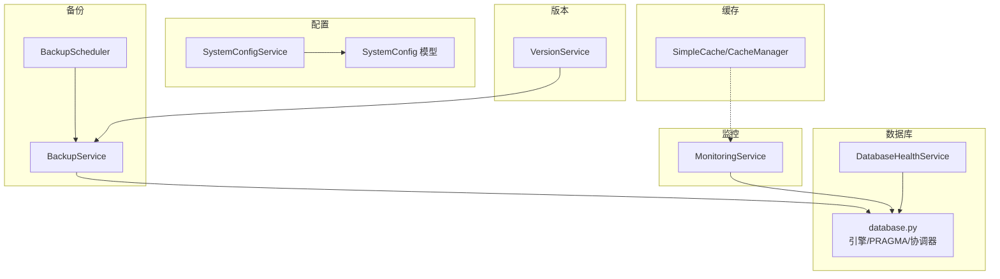
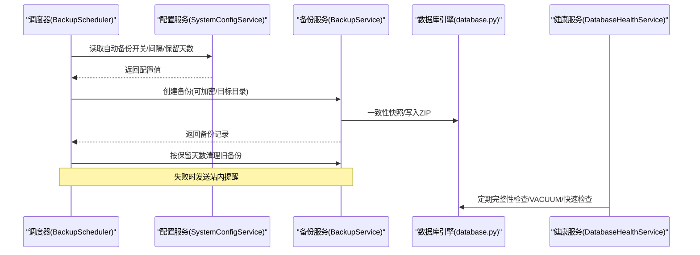
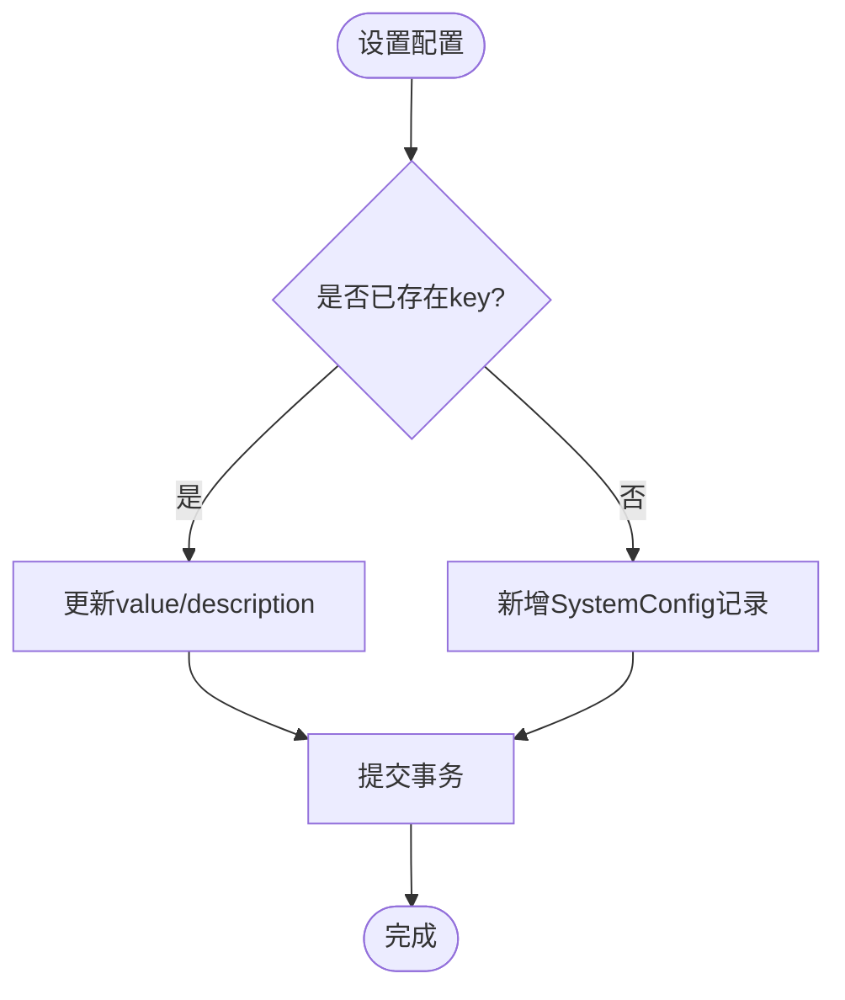
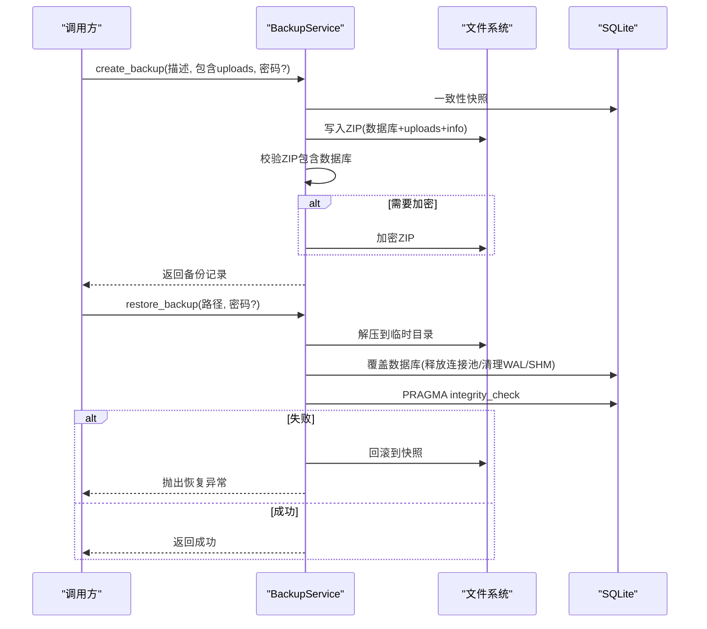
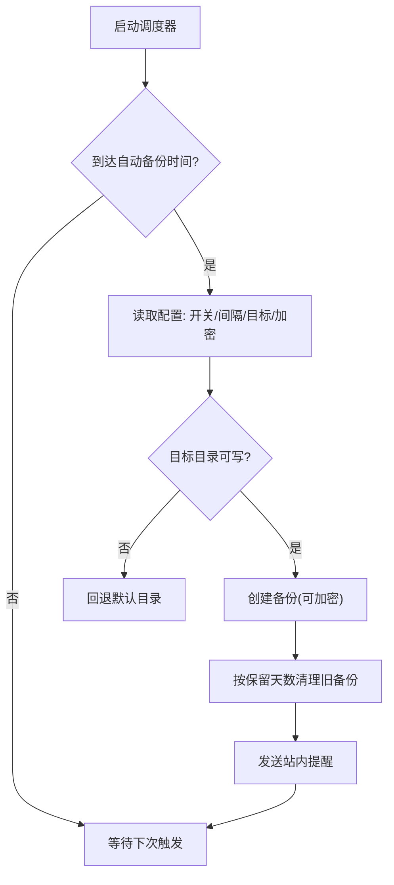
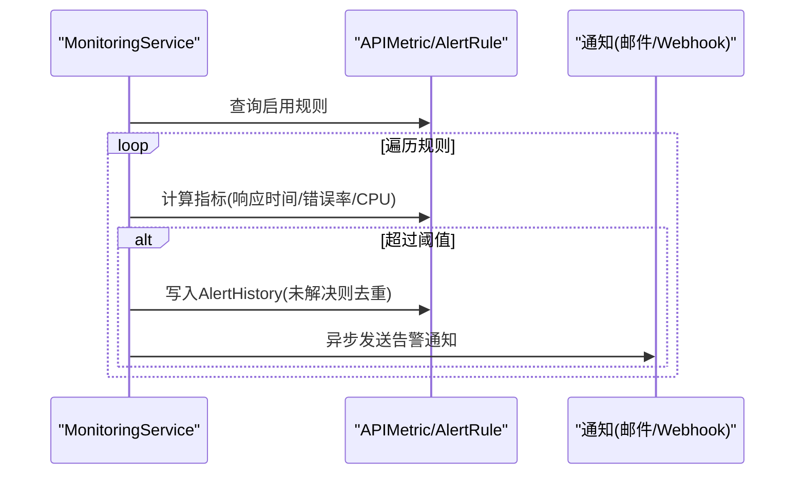
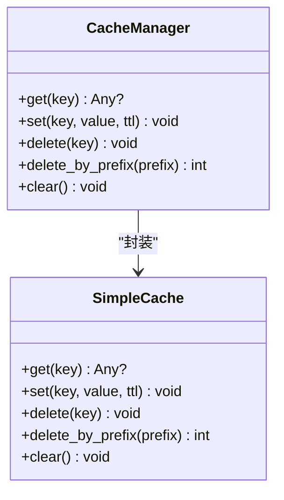
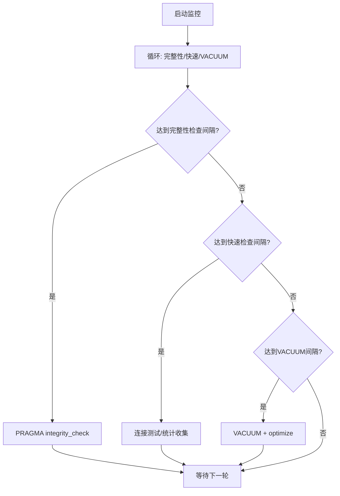
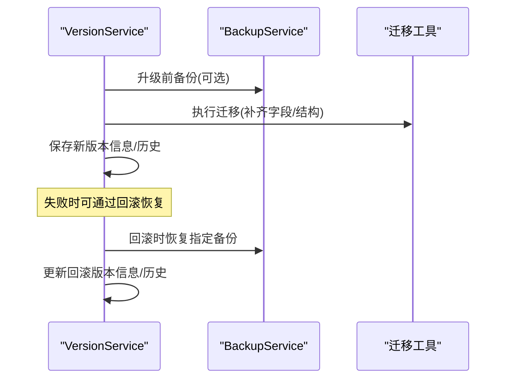
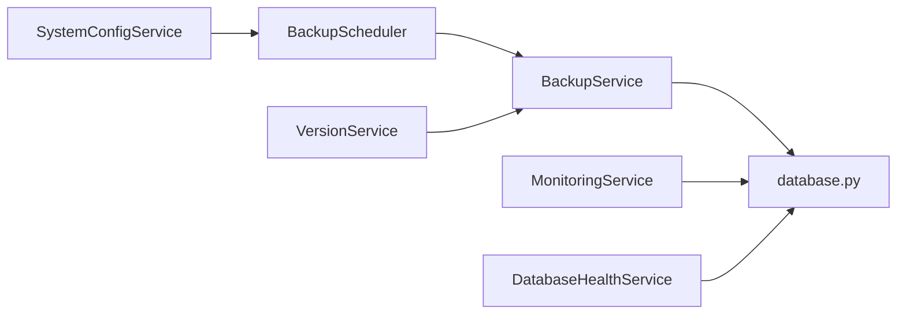

# 系统管理服务

<cite>
**本文引用的文件**
- [backend/app/services/system_config_service.py](file://backend/app/services/system_config_service.py)
- [backend/app/models/system_config.py](file://backend/app/models/system_config.py)
- [backend/app/services/backup_service.py](file://backend/app/services/backup_service.py)
- [backend/app/services/backup_scheduler.py](file://backend/app/services/backup_scheduler.py)
- [backend/app/core/database.py](file://backend/app/core/database.py)
- [backend/app/services/database_health_service.py](file://backend/app/services/database_health_service.py)
- [backend/app/services/monitoring_service.py](file://backend/app/services/monitoring_service.py)
- [backend/app/core/cache.py](file://backend/app/core/cache.py)
- [backend/app/services/version_service.py](file://backend/app/services/version_service.py)
</cite>

## 目录
1. [简介](#简介)
2. [项目结构](#项目结构)
3. [核心组件](#核心组件)
4. [架构总览](#架构总览)
5. [详细组件分析](#详细组件分析)
6. [依赖关系分析](#依赖关系分析)
7. [性能考虑](#性能考虑)
8. [故障排查指南](#故障排查指南)
9. [结论](#结论)
10. [附录](#附录)

## 简介
本技术文档面向“系统管理服务”，围绕系统配置管理、备份与恢复、监控告警、缓存管理、数据库健康与版本管理等核心能力，提供从架构到实现细节的系统化说明。重点覆盖：
- 系统参数的动态配置与默认值治理
- 定时备份策略（含加密、保留策略、目标路径校验）
- 监控指标采集与告警触发机制
- 内存缓存策略与键空间清理
- SQLite 连接池与 WAL 优化、数据库健康巡检与维护
- 版本升级与回滚流程，以及与备份的联动

## 项目结构
系统管理服务位于后端服务中，按“领域服务 + 核心基础设施”组织：
- 配置管理：SystemConfigService + SystemConfig 模型
- 备份与恢复：BackupService + BackupScheduler（调度）
- 监控与告警：MonitoringService + 相关模型
- 缓存：SimpleCache / CacheManager
- 数据库健康：DatabaseHealthService
- 版本管理：VersionService

图表来源
- [backend/app/services/system_config_service.py:68-266](file://backend/app/services/system_config_service.py#L68-L266)
- [backend/app/models/system_config.py:11-51](file://backend/app/models/system_config.py#L11-L51)
- [backend/app/services/backup_service.py:74-760](file://backend/app/services/backup_service.py#L74-L760)
- [backend/app/services/backup_scheduler.py:60-543](file://backend/app/services/backup_scheduler.py#L60-L543)
- [backend/app/core/database.py:55-158](file://backend/app/core/database.py#L55-L158)
- [backend/app/services/database_health_service.py:16-413](file://backend/app/services/database_health_service.py#L16-L413)
- [backend/app/services/monitoring_service.py:26-312](file://backend/app/services/monitoring_service.py#L26-L312)
- [backend/app/core/cache.py:14-166](file://backend/app/core/cache.py#L14-L166)
- [backend/app/services/version_service.py:17-404](file://backend/app/services/version_service.py#L17-L404)

章节来源
- [backend/app/services/system_config_service.py:68-266](file://backend/app/services/system_config_service.py#L68-L266)
- [backend/app/services/backup_service.py:74-760](file://backend/app/services/backup_service.py#L74-L760)
- [backend/app/services/backup_scheduler.py:60-543](file://backend/app/services/backup_scheduler.py#L60-L543)
- [backend/app/core/database.py:55-158](file://backend/app/core/database.py#L55-L158)
- [backend/app/services/database_health_service.py:16-413](file://backend/app/services/database_health_service.py#L16-L413)
- [backend/app/services/monitoring_service.py:26-312](file://backend/app/services/monitoring_service.py#L26-L312)
- [backend/app/core/cache.py:14-166](file://backend/app/core/cache.py#L14-L166)
- [backend/app/services/version_service.py:17-404](file://backend/app/services/version_service.py#L17-L404)

## 核心组件
- 系统配置管理：提供配置的读取、写入、导出导入、初始化默认项；支持布尔/整数/JSON 类型转换与全局函数式访问。
- 备份与恢复：一致性快照、ZIP 打包、可选 AES-256 加密、上传文件包含、完整性校验、旧备份清理、磁盘空间预检。
- 定时调度：基于线程定时器实现每日/每周/间隔任务，包括自动备份、KPI 预计算、异常检测、消息清理、提醒扫描、待办提醒、周报等。
- 监控与告警：API 性能统计、错误率统计、资源使用统计；规则驱动告警并异步通知（邮件/Webhook）。
- 缓存管理：线程安全内存缓存，支持 TTL、前缀删除、LRU 淘汰；提供异步包装器与装饰器。
- 数据库健康：周期性完整性检查、快速检查、VACUUM 优化、索引检查与分析；启动自检。
- 版本管理：版本信息持久化、升级/回滚流程、迁移执行、历史追踪。

章节来源
- [backend/app/services/system_config_service.py:68-266](file://backend/app/services/system_config_service.py#L68-L266)
- [backend/app/services/backup_service.py:74-760](file://backend/app/services/backup_service.py#L74-L760)
- [backend/app/services/backup_scheduler.py:60-543](file://backend/app/services/backup_scheduler.py#L60-L543)
- [backend/app/services/monitoring_service.py:26-312](file://backend/app/services/monitoring_service.py#L26-L312)
- [backend/app/core/cache.py:14-166](file://backend/app/core/cache.py#L14-L166)
- [backend/app/services/database_health_service.py:16-413](file://backend/app/services/database_health_service.py#L16-L413)
- [backend/app/services/version_service.py:17-404](file://backend/app/services/version_service.py#L17-L404)

## 架构总览
系统管理服务以“配置中心 + 调度器”为中枢，驱动备份、监控、维护与版本变更等后台任务；通过数据库引擎层对 SQLite 进行深度优化，保障一致性与性能。

图表来源
- [backend/app/services/backup_scheduler.py:60-148](file://backend/app/services/backup_scheduler.py#L60-L148)
- [backend/app/services/system_config_service.py:68-266](file://backend/app/services/system_config_service.py#L68-L266)
- [backend/app/services/backup_service.py:231-395](file://backend/app/services/backup_service.py#L231-L395)
- [backend/app/core/database.py:78-158](file://backend/app/core/database.py#L78-L158)
- [backend/app/services/database_health_service.py:80-134](file://backend/app/services/database_health_service.py#L80-L134)

## 详细组件分析

### 系统配置管理
- 功能要点
  - 默认配置集：系统标识、初始化标记、备份策略、自动打包策略、异常检测阈值等。
  - 类型转换：get_int/get_bool/get_json 便捷方法。
  - 生命周期：initialize_defaults 初始化默认项；export/import 配置包。
  - 全局函数：get_config/set_config/delete_config 便于无上下文调用。
- 数据模型
  - key 唯一索引，value 文本存储，description 描述，时间戳自动维护。
- 关键行为
  - set 时自动序列化复杂类型；delete 后提交事务；reload 清空会话缓存。

图表来源
- [backend/app/services/system_config_service.py:155-189](file://backend/app/services/system_config_service.py#L155-L189)
- [backend/app/models/system_config.py:11-26](file://backend/app/models/system_config.py#L11-L26)

章节来源
- [backend/app/services/system_config_service.py:68-266](file://backend/app/services/system_config_service.py#L68-L266)
- [backend/app/models/system_config.py:11-51](file://backend/app/models/system_config.py#L11-L51)

### 备份与恢复
- 一致性快照：优先使用 SQLite Backup API 生成快照，失败回退 WAL checkpoint + 裸拷贝。
- 打包与校验：ZIP 压缩，必须包含数据库文件，否则视为失败并删除半成品。
- 加密：AES-256（Fernet），带盐与密钥派生；解密至临时文件避免破坏原备份。
- 恢复流程：解压→恢复数据库→恢复上传文件→完整性校验→失败回滚到快照。
- 清理策略：按数量或保留天数清理旧备份。
- 空间预检：备份前检查磁盘剩余空间，不足则提前失败。

图表来源
- [backend/app/services/backup_service.py:231-395](file://backend/app/services/backup_service.py#L231-L395)
- [backend/app/services/backup_service.py:397-600](file://backend/app/services/backup_service.py#L397-L600)
- [backend/app/core/database.py:292-343](file://backend/app/core/database.py#L292-L343)

章节来源
- [backend/app/services/backup_service.py:74-760](file://backend/app/services/backup_service.py#L74-L760)

### 定时备份策略与调度
- 调度方式：基于 threading.Timer 的轻量调度器，支持日/周/间隔任务。
- 自动备份：读取配置开关、间隔天数、目标目录、是否加密；完成后按保留天数清理并发送站内提醒。
- 其他任务：KPI 预计算、资金异常检测、消息清理、提醒扫描、待办提醒、工作周报、回收站保留期清理等。

图表来源
- [backend/app/services/backup_scheduler.py:60-148](file://backend/app/services/backup_scheduler.py#L60-L148)
- [backend/app/services/backup_scheduler.py:455-543](file://backend/app/services/backup_scheduler.py#L455-L543)

章节来源
- [backend/app/services/backup_scheduler.py:60-543](file://backend/app/services/backup_scheduler.py#L60-L543)

### 监控与告警
- 指标采集：API 响应时间、错误率、端点维度聚合；系统资源（CPU/内存/磁盘）。
- 告警规则：支持响应时间、错误率、资源三类规则；去重触发；异步通知（邮件/Webhook）。
- 统计查询：按小时范围聚合，支持端点过滤与 Top-N。

图表来源
- [backend/app/services/monitoring_service.py:184-312](file://backend/app/services/monitoring_service.py#L184-L312)

章节来源
- [backend/app/services/monitoring_service.py:26-312](file://backend/app/services/monitoring_service.py#L26-L312)

### 缓存管理
- 设计：线程安全内存缓存，每键 TTL，LRU 淘汰；支持前缀批量删除。
- 使用：同步 SimpleCache 与异步 CacheManager；提供装饰器 cached/cached_result 用于函数级缓存。
- 容量：最大条目数由配置控制，过期即失效。

图表来源
- [backend/app/core/cache.py:14-166](file://backend/app/core/cache.py#L14-L166)

章节来源
- [backend/app/core/cache.py:14-166](file://backend/app/core/cache.py#L14-L166)

### 数据库健康与维护
- 健康检查：完整性检查、快速检查（连接/大小/表数）、索引检查、ANALYZE。
- 维护任务：VACUUM、WAL checkpoint、optimize；启动自检。
- 监控循环：后台线程按周期执行，支持立即停止。

图表来源
- [backend/app/services/database_health_service.py:80-134](file://backend/app/services/database_health_service.py#L80-L134)
- [backend/app/services/database_health_service.py:135-331](file://backend/app/services/database_health_service.py#L135-L331)

章节来源
- [backend/app/services/database_health_service.py:16-413](file://backend/app/services/database_health_service.py#L16-L413)

### 版本管理与升级回滚
- 版本信息：本地 version.json 持久化，支持构建号、发布日期、描述。
- 升级流程：可选升级前备份→执行迁移→更新配置→保存新版本→记录历史。
- 回滚流程：根据历史定位备份→恢复备份→更新版本信息→记录回滚历史。
- 迁移：调用迁移辅助工具确保缺失列/结构补齐。

图表来源
- [backend/app/services/version_service.py:132-328](file://backend/app/services/version_service.py#L132-L328)
- [backend/app/services/version_service.py:330-368](file://backend/app/services/version_service.py#L330-L368)

章节来源
- [backend/app/services/version_service.py:17-404](file://backend/app/services/version_service.py#L17-L404)

## 依赖关系分析
- 配置 → 备份：备份策略（自动备份、保留天数、目标目录、加密）来自配置服务。
- 备份 → 数据库：一致性快照、WAL 操作、磁盘空间检查均依赖数据库引擎层。
- 调度 → 备份/监控/维护：调度器统一编排各后台任务。
- 监控 → 数据库：指标来源于 APIMetric 与系统资源采集。
- 版本 → 备份：升级/回滚与备份服务紧密耦合，保证可逆性。

图表来源
- [backend/app/services/system_config_service.py:68-266](file://backend/app/services/system_config_service.py#L68-L266)
- [backend/app/services/backup_scheduler.py:60-543](file://backend/app/services/backup_scheduler.py#L60-L543)
- [backend/app/services/backup_service.py:74-760](file://backend/app/services/backup_service.py#L74-L760)
- [backend/app/core/database.py:55-158](file://backend/app/core/database.py#L55-L158)
- [backend/app/services/monitoring_service.py:26-312](file://backend/app/services/monitoring_service.py#L26-L312)
- [backend/app/services/version_service.py:17-404](file://backend/app/services/version_service.py#L17-L404)
- [backend/app/services/database_health_service.py:16-413](file://backend/app/services/database_health_service.py#L16-L413)

章节来源
- [backend/app/services/system_config_service.py:68-266](file://backend/app/services/system_config_service.py#L68-L266)
- [backend/app/services/backup_scheduler.py:60-543](file://backend/app/services/backup_scheduler.py#L60-L543)
- [backend/app/services/backup_service.py:74-760](file://backend/app/services/backup_service.py#L74-L760)
- [backend/app/core/database.py:55-158](file://backend/app/core/database.py#L55-L158)
- [backend/app/services/monitoring_service.py:26-312](file://backend/app/services/monitoring_service.py#L26-L312)
- [backend/app/services/version_service.py:17-404](file://backend/app/services/version_service.py#L17-L404)
- [backend/app/services/database_health_service.py:16-413](file://backend/app/services/database_health_service.py#L16-L413)

## 性能考虑
- SQLite 调优
  - WAL 模式、NORMAL 同步、busy_timeout=10s、cache_size/mmap_size 可调、自动索引开启、连接关闭时 optimize。
  - 长事务独占写协调器，避免大批量导入时的 SQLITE_BUSY。
- 备份性能
  - 一致性快照减少锁竞争；ZIP 压缩级别可配置；增量备份清单机制预留扩展。
- 监控开销
  - 指标聚合采用 SQL 分组与限制返回条数；告警通知异步化不阻塞主流程。
- 缓存命中
  - 合理 TTL 与键前缀清理，降低热点数据重复计算与 IO。

章节来源
- [backend/app/core/database.py:78-158](file://backend/app/core/database.py#L78-L158)
- [backend/app/core/database.py:198-285](file://backend/app/core/database.py#L198-L285)
- [backend/app/services/backup_service.py:231-395](file://backend/app/services/backup_service.py#L231-L395)
- [backend/app/services/monitoring_service.py:29-128](file://backend/app/services/monitoring_service.py#L29-L128)
- [backend/app/core/cache.py:14-166](file://backend/app/core/cache.py#L14-L166)

## 故障排查指南
- 备份失败
  - 现象：ZIP 不包含数据库文件或磁盘空间不足。
  - 处理：检查磁盘空间预检结果；确认数据库路径解析正确；查看日志中的“备份未能包含数据库文件”提示。
- 恢复失败
  - 现象：完整性检查未通过或解锁/覆盖期间冲突。
  - 处理：确认已释放连接池；检查残留 -wal/-shm；查看恢复后完整性检查结果。
- 自动备份未执行
  - 现象：未按计划生成备份。
  - 处理：检查 auto_backup 开关、backup_interval_days、last_backup_time；确认目标目录可写。
- 告警不触发
  - 现象：指标超标但未收到通知。
  - 处理：检查 AlertRule 是否启用；确认通知配置（邮件/Webhook）；查看异步通知是否因无事件循环而降级为线程执行。
- 数据库健康异常
  - 现象：完整性检查失败或频繁慢查询。
  - 处理：运行 quick_check 与 analyze；必要时执行 VACUUM；关注碎片率与空闲页。
- 版本升级失败
  - 现象：升级中断或迁移失败。
  - 处理：利用升级前备份进行回滚；检查迁移日志与版本历史。

章节来源
- [backend/app/services/backup_service.py:216-395](file://backend/app/services/backup_service.py#L216-L395)
- [backend/app/services/backup_service.py:453-600](file://backend/app/services/backup_service.py#L453-L600)
- [backend/app/services/backup_scheduler.py:60-148](file://backend/app/services/backup_scheduler.py#L60-L148)
- [backend/app/services/monitoring_service.py:184-312](file://backend/app/services/monitoring_service.py#L184-L312)
- [backend/app/services/database_health_service.py:135-331](file://backend/app/services/database_health_service.py#L135-L331)
- [backend/app/services/version_service.py:132-328](file://backend/app/services/version_service.py#L132-L328)

## 结论
系统管理服务通过“配置驱动 + 调度编排 + 健壮的数据保护”形成闭环：
- 配置集中且可热更新，支撑备份策略与系统行为。
- 备份具备一致性、可验证、可加密与可清理的生命周期管理。
- 监控与告警提供可观测性与及时干预能力。
- 数据库健康巡检与维护保障长期稳定运行。
- 版本管理结合备份实现安全的升级与回滚。

建议在生产环境：
- 启用自动备份与加密，配置合理的保留天数与目标目录。
- 开启数据库健康监控与定期维护。
- 配置告警规则与通知渠道，确保异常及时触达。
- 在升级前强制备份，并验证回滚流程可用。

## 附录
- 高可用与灾难恢复最佳实践
  - 多副本备份：将备份复制到外部介质（U盘/共享盘），配合自动打包任务定期落盘。
  - 异地容灾：将备份同步至远端存储，定期演练恢复流程。
  - 权限隔离：备份目录与上传目录严格校验，防止路径穿越攻击。
  - 恢复演练：定期执行恢复演练，验证备份可用性与恢复时长。
  - 监控告警：对备份失败、磁盘空间不足、数据库完整性异常设置告警。
  - 版本基线：每次升级前备份，保留至少一个可回滚基线。