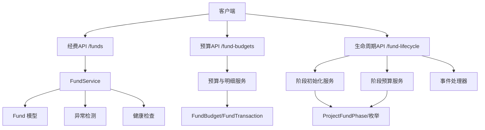
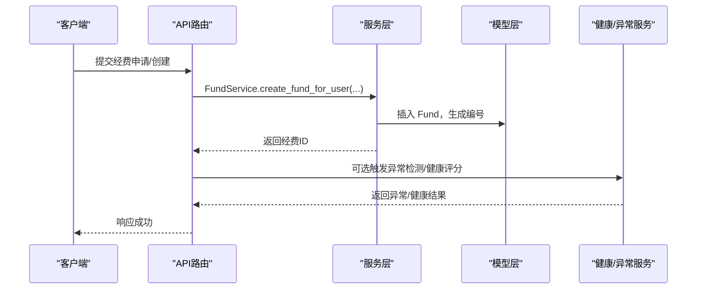
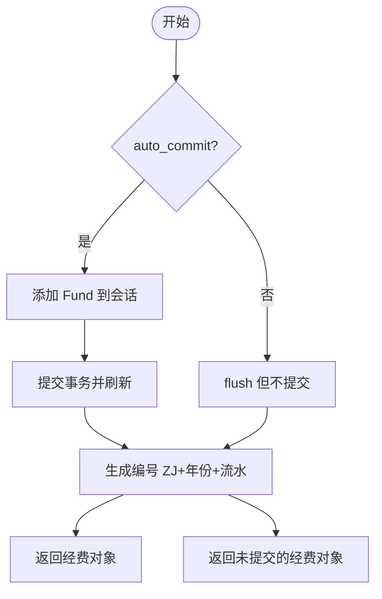
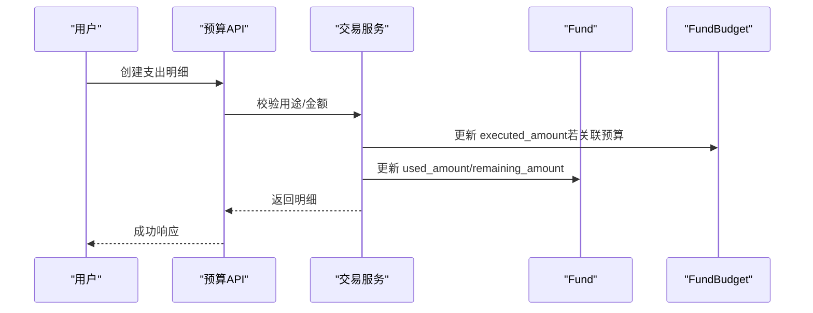
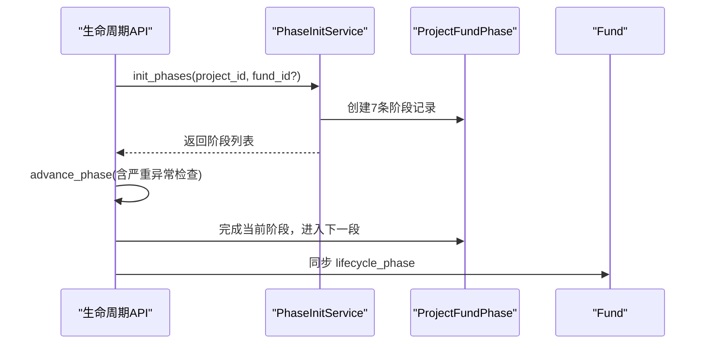
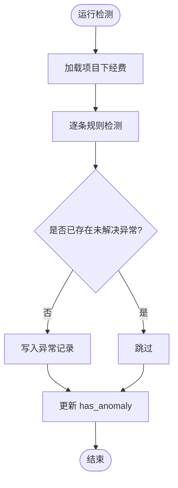
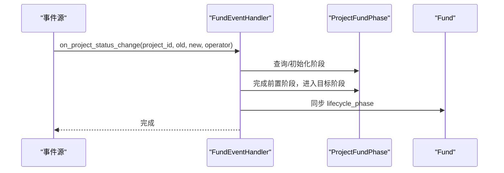
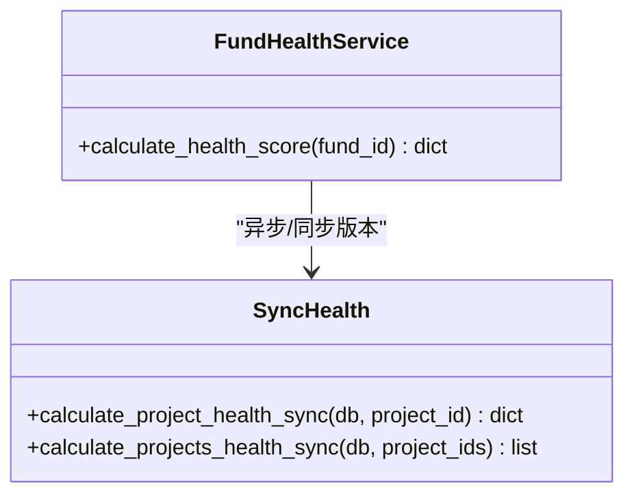
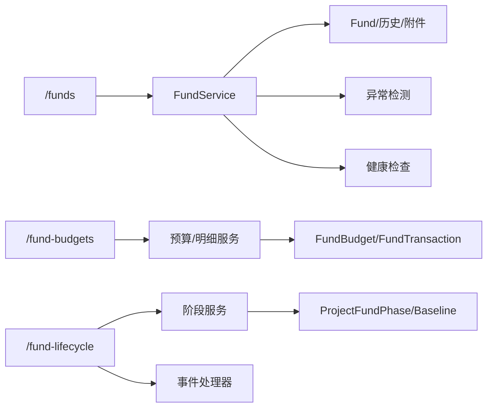

# 经费管理服务

<cite>
**本文引用的文件**
- [backend/app/services/fund_service.py](file://backend/app/services/fund_service.py)
- [backend/app/models/fund.py](file://backend/app/models/fund.py)
- [backend/app/models/fund_budget.py](file://backend/app/models/fund_budget.py)
- [backend/app/models/fund_lifecycle.py](file://backend/app/models/fund_lifecycle.py)
- [backend/app/api/v1/funds.py](file://backend/app/api/v1/funds.py)
- [backend/app/api/v1/fund_budgets.py](file://backend/app/api/v1/fund_budgets.py)
- [backend/app/api/v1/fund_lifecycle.py](file://backend/app/api/v1/fund_lifecycle.py)
- [backend/app/services/fund_anomaly_detector.py](file://backend/app/services/fund_anomaly_detector.py)
- [backend/app/services/fund_event_handler.py](file://backend/app/services/fund_event_handler.py)
- [backend/app/services/fund_health_service.py](file://backend/app/services/fund_health_service.py)
- [backend/app/services/funding/phase_budget_service.py](file://backend/app/services/funding/phase_budget_service.py)
- [backend/app/services/funding/phase_init_service.py](file://backend/app/services/funding/phase_init_service.py)
</cite>

## 目录
1. [简介](#简介)
2. [项目结构](#项目结构)
3. [核心组件](#核心组件)
4. [架构总览](#架构总览)
5. [详细组件分析](#详细组件分析)
6. [依赖关系分析](#依赖关系分析)
7. [性能考虑](#性能考虑)
8. [故障排查指南](#故障排查指南)
9. [结论](#结论)
10. [附录](#附录)

## 简介
本技术文档围绕“经费管理”子系统，系统化阐述预算编制、资金拨付、资产核查、财务报表等核心业务逻辑的实现细节；说明经费异常检测机制、事件处理流程与健康检查服务；文档化阶段预算服务与阶段初始化服务的业务流程和接口设计；提供扩展点与定制化开发指南（新经费类型接入）；并总结数据一致性与事务处理的最佳实践。

## 项目结构
经费管理在系统中采用分层架构：API 路由层负责请求校验与编排；服务层封装核心业务逻辑；模型层定义数据实体与约束；辅助服务提供异常检测、健康评分、事件联动等能力。关键目录与职责如下：
- API 路由：/funds、/fund-budgets、/fund-lifecycle
- 服务层：FundService、PhaseInitService、PhaseBudgetService、FundAnomalyDetector、FundHealthService、FundEventHandler
- 模型层：Fund、FundBudget、FundTransaction、ProjectFundPhase、BudgetBaseline、FundTransferVoucher、FundContract、FundSettlement、FundAnomaly 等
- 工具与基础设施：数据库会话、事务封装、权限与数据范围适配、审计日志

**图表来源**
- [backend/app/api/v1/funds.py:360-445](file://backend/app/api/v1/funds.py#L360-L445)
- [backend/app/api/v1/fund_budgets.py:114-172](file://backend/app/api/v1/fund_budgets.py#L114-L172)
- [backend/app/api/v1/fund_lifecycle.py:73-123](file://backend/app/api/v1/fund_lifecycle.py#L73-L123)
- [backend/app/services/fund_service.py:29-130](file://backend/app/services/fund_service.py#L29-L130)
- [backend/app/services/funding/phase_init_service.py:19-70](file://backend/app/services/funding/phase_init_service.py#L19-L70)
- [backend/app/services/funding/phase_budget_service.py:14-45](file://backend/app/services/funding/phase_budget_service.py#L14-L45)

**章节来源**
- [backend/app/api/v1/funds.py:360-445](file://backend/app/api/v1/funds.py#L360-L445)
- [backend/app/api/v1/fund_budgets.py:114-172](file://backend/app/api/v1/fund_budgets.py#L114-L172)
- [backend/app/api/v1/fund_lifecycle.py:73-123](file://backend/app/api/v1/fund_lifecycle.py#L73-L123)

## 核心组件
- FundService：经费聚合根的核心数据操作与状态机流转，支持批量状态更新、自动编号生成、金额字段量化与事务控制。
- 预算与明细：FundBudget/FundTransaction 提供年度预算、执行额、预警阈值与使用明细台账。
- 生命周期模型：ProjectFundPhase/BudgetBaseline/FundTransferVoucher/FundContract/FundSettlement/FundAnomaly 等支撑七阶段管理与风控。
- 异常检测：detect_anomalies 实现超支、偏差、闲置、重复支付、缺失凭证、大额提现、合同拆分、单一来源等规则。
- 健康检查：按多维度计算项目/经费健康分，输出健康等级与明细。
- 事件处理：项目状态变更时联动推进经费阶段，同步 Fund.lifecycle_phase。
- 阶段服务：PhaseInitService（阶段初始化）、PhaseBudgetService（预算基线管理）。

**章节来源**
- [backend/app/services/fund_service.py:29-288](file://backend/app/services/fund_service.py#L29-L288)
- [backend/app/models/fund_budget.py:19-202](file://backend/app/models/fund_budget.py#L19-L202)
- [backend/app/models/fund_lifecycle.py:24-449](file://backend/app/models/fund_lifecycle.py#L24-L449)
- [backend/app/services/fund_anomaly_detector.py:34-93](file://backend/app/services/fund_anomaly_detector.py#L34-L93)
- [backend/app/services/fund_health_service.py:14-199](file://backend/app/services/fund_health_service.py#L14-L199)
- [backend/app/services/fund_event_handler.py:17-97](file://backend/app/services/fund_event_handler.py#L17-L97)
- [backend/app/services/funding/phase_init_service.py:19-70](file://backend/app/services/funding/phase_init_service.py#L19-L70)
- [backend/app/services/funding/phase_budget_service.py:14-45](file://backend/app/services/funding/phase_budget_service.py#L14-L45)

## 架构总览
经费管理以“API 路由 + 服务 + 模型”的分层模式组织，通过统一的数据权限适配与事务封装保证一致性。关键交互如下：
- 创建/申请经费：API → FundService → 写入 Fund，自动生成编号，触发审批任务。
- 预算与明细：API → 写入 FundBudget/FundTransaction，自动回写 Fund.used_amount 与 remaining_amount，并触发预算预警。
- 生命周期推进：API → 阶段服务 → 更新 ProjectFundPhase，同步 Fund.lifecycle_phase。
- 异常检测与健康：后台或定时调用 detect_anomalies 与 calculate_project_health_sync，持久化异常记录与健康分。

**图表来源**
- [backend/app/api/v1/funds.py:483-531](file://backend/app/api/v1/funds.py#L483-L531)
- [backend/app/services/fund_service.py:114-185](file://backend/app/services/fund_service.py#L114-L185)
- [backend/app/models/fund.py:61-167](file://backend/app/models/fund.py#L61-L167)
- [backend/app/services/fund_anomaly_detector.py:34-93](file://backend/app/services/fund_anomaly_detector.py#L34-L93)
- [backend/app/services/fund_health_service.py:142-193](file://backend/app/services/fund_health_service.py#L142-L193)

## 详细组件分析

### 经费主数据与服务（FundService）
- 列表查询：使用 SQLAlchemy 2.0 select/joinedload/selectinload 预加载关联，避免 N+1；分页支持 offset 与 keyset。
- 创建经费：支持 auto_commit 控制事务边界；自动编号 ZJ+年份+6位流水；兼容前端 type/fund_type 映射。
- 批量状态更新：严格状态机白名单校验，非法流转整体拒绝；bulk update 提升性能。
- 删除：软删标记 is_active=False，保留审计恢复能力。

**图表来源**
- [backend/app/services/fund_service.py:114-185](file://backend/app/services/fund_service.py#L114-L185)
- [backend/app/services/fund_service.py:245-288](file://backend/app/services/fund_service.py#L245-L288)

**章节来源**
- [backend/app/services/fund_service.py:29-288](file://backend/app/services/fund_service.py#L29-L288)

### 预算与使用明细（FundBudget/FundTransaction）
- 预算 CRUD：支持按年度/科目/村筛选；剩余金额与执行率计算；预算预警阈值（80%/90%/100%）。
- 使用明细：创建明细时自动更新关联预算的 executed_amount 与 Fund.used_amount/remaining_amount；禁止超预算核销。
- 附件上报：预算附件以 JSON 数组追加至备注，便于追踪上传轨迹。

**图表来源**
- [backend/app/api/v1/fund_budgets.py:324-376](file://backend/app/api/v1/fund_budgets.py#L324-L376)
- [backend/app/models/fund_budget.py:143-202](file://backend/app/models/fund_budget.py#L143-L202)

**章节来源**
- [backend/app/api/v1/fund_budgets.py:114-494](file://backend/app/api/v1/fund_budgets.py#L114-L494)
- [backend/app/models/fund_budget.py:19-202](file://backend/app/models/fund_budget.py#L19-L202)

### 生命周期与阶段服务（PhaseInitService/PhaseBudgetService）
- 阶段初始化：为项目创建 7 个阶段记录，第一阶段默认进行中，其余未开始；支持按 fund_id 关联。
- 阶段推进：当前阶段未完成则先完成再进入下一阶段；存在严重异常时阻止推进；同步 Fund.lifecycle_phase。
- 预算基线：锁定后生成快照，后续拨付额度不得超基线；提供汇总统计（总额、锁定数）。

**图表来源**
- [backend/app/services/funding/phase_init_service.py:42-70](file://backend/app/services/funding/phase_init_service.py#L42-L70)
- [backend/app/api/v1/fund_lifecycle.py:188-228](file://backend/app/api/v1/fund_lifecycle.py#L188-L228)
- [backend/app/services/funding/phase_budget_service.py:20-45](file://backend/app/services/funding/phase_budget_service.py#L20-L45)

**章节来源**
- [backend/app/services/funding/phase_init_service.py:19-70](file://backend/app/services/funding/phase_init_service.py#L19-L70)
- [backend/app/services/funding/phase_budget_service.py:14-45](file://backend/app/services/funding/phase_budget_service.py#L14-L45)
- [backend/app/api/v1/fund_lifecycle.py:73-228](file://backend/app/api/v1/fund_lifecycle.py#L73-L228)

### 经费异常检测机制
- 规则集：超支、进度偏差、资金闲置、重复支付、缺失凭证、大额提现、合同拆分、单一来源采购。
- 去重策略：同项目+同类型+同经费且未解决的异常不重复写入。
- 指标回写：更新 Fund.has_anomaly 标志，便于前端快速识别风险。

**图表来源**
- [backend/app/services/fund_anomaly_detector.py:34-93](file://backend/app/services/fund_anomaly_detector.py#L34-L93)
- [backend/app/services/fund_anomaly_detector.py:99-315](file://backend/app/services/fund_anomaly_detector.py#L99-L315)

**章节来源**
- [backend/app/services/fund_anomaly_detector.py:1-333](file://backend/app/services/fund_anomaly_detector.py#L1-L333)

### 事件处理流程（项目状态→经费阶段）
- 映射表：项目状态到目标阶段的映射（如 approved→汇总审核）。
- 自动初始化：若阶段不存在则创建 7 条记录。
- 阶段推进：将目标阶段之前全部标记完成，目标阶段设为进行中；同步 Fund.lifecycle_phase。

**图表来源**
- [backend/app/services/fund_event_handler.py:17-97](file://backend/app/services/fund_event_handler.py#L17-L97)

**章节来源**
- [backend/app/services/fund_event_handler.py:1-97](file://backend/app/services/fund_event_handler.py#L1-L97)

### 经费健康检查服务
- 单经费健康分：基于未解决异常扣分、预算使用率扣分，输出健康等级。
- 项目健康分：多维度加权（预算执行、支付及时性、凭证完整性、异常数量、合同履约、决算完成度），输出总分与明细。

**图表来源**
- [backend/app/services/fund_health_service.py:14-52](file://backend/app/services/fund_health_service.py#L14-L52)
- [backend/app/services/fund_health_service.py:142-199](file://backend/app/services/fund_health_service.py#L142-L199)

**章节来源**
- [backend/app/services/fund_health_service.py:1-199](file://backend/app/services/fund_health_service.py#L1-L199)

### 财务报表与统计
- 概览统计：单次聚合查询，支持按年度过滤；包含预算总额/已执行、申请/批准/拨付/使用情况。
- 多维度统计：按周期/类型/来源/状态分组，利用冗余字段 year/year_month/year_quarter 优化 GROUP BY。
- 预算汇总：按科目汇总预算与执行额，计算执行率与结余。

**章节来源**
- [backend/app/api/v1/funds.py:617-760](file://backend/app/api/v1/funds.py#L617-L760)
- [backend/app/api/v1/fund_budgets.py:249-289](file://backend/app/api/v1/fund_budgets.py#L249-L289)

## 依赖关系分析
- API 路由依赖服务层进行业务编排；服务层依赖模型层进行数据存取；异常检测与健康服务作为横切能力被多端复用。
- 数据权限与范围适配在 API 层注入，确保跨组织访问隔离。
- 事务封装 safe_commit 贯穿各写操作，保证原子性。

**图表来源**
- [backend/app/api/v1/funds.py:360-531](file://backend/app/api/v1/funds.py#L360-L531)
- [backend/app/api/v1/fund_budgets.py:114-376](file://backend/app/api/v1/fund_budgets.py#L114-L376)
- [backend/app/api/v1/fund_lifecycle.py:73-228](file://backend/app/api/v1/fund_lifecycle.py#L73-L228)
- [backend/app/services/fund_anomaly_detector.py:34-93](file://backend/app/services/fund_anomaly_detector.py#L34-L93)
- [backend/app/services/fund_health_service.py:142-199](file://backend/app/services/fund_health_service.py#L142-L199)
- [backend/app/services/fund_event_handler.py:17-97](file://backend/app/services/fund_event_handler.py#L17-L97)

**章节来源**
- [backend/app/api/v1/funds.py:360-531](file://backend/app/api/v1/funds.py#L360-L531)
- [backend/app/api/v1/fund_budgets.py:114-376](file://backend/app/api/v1/fund_budgets.py#L114-L376)
- [backend/app/api/v1/fund_lifecycle.py:73-228](file://backend/app/api/v1/fund_lifecycle.py#L73-L228)

## 性能考虑
- 预加载与去重：列表与详情查询使用 joinedload/selectinload，并使用 unique() 防止笛卡尔积重复行。
- 统计优化：引入 year/year_month/year_quarter 冗余字段，GROUP BY 直接命中索引，避免 strftime 全表扫描。
- 批量更新：批量状态更新使用 bulk update，避免 N+1 循环。
- 分页：支持 offset 与 keyset 两种分页方式，keyset 适合大数据量滚动加载。

**章节来源**
- [backend/app/services/fund_service.py:40-99](file://backend/app/services/fund_service.py#L40-L99)
- [backend/app/models/fund.py:61-86](file://backend/app/models/fund.py#L61-L86)
- [backend/app/api/v1/funds.py:679-760](file://backend/app/api/v1/funds.py#L679-L760)

## 故障排查指南
- 状态流转非法：当尝试非法状态切换时会抛出错误，需检查当前状态与目标状态是否在白名单内。
- 预算超支：创建明细时若 projected > budget_total，会拒绝写入；需调整预算或减少支出。
- 阶段推进受阻：存在未解决的严重异常时无法推进；需先处理异常。
- 日期解析失败：前端传入字符串日期需符合 ISO 格式；否则会被警告并原样传递由数据库报错。

**章节来源**
- [backend/app/services/fund_service.py:245-288](file://backend/app/services/fund_service.py#L245-L288)
- [backend/app/api/v1/fund_budgets.py:324-376](file://backend/app/api/v1/fund_budgets.py#L324-L376)
- [backend/app/api/v1/fund_lifecycle.py:188-228](file://backend/app/api/v1/fund_lifecycle.py#L188-L228)
- [backend/app/api/v1/funds.py:296-323](file://backend/app/api/v1/funds.py#L296-L323)

## 结论
经费管理服务通过清晰的分层架构、严格的状态机与规则引擎、完善的异常检测与健康评分，以及高效的统计与报表能力，实现了从预算编制、资金拨付到资产核查与决算的全流程闭环。借助阶段服务与事件处理器，系统能够自动化推进生命周期并保持一致性。建议在生产环境中结合定时任务运行异常检测与健康评分，持续监控经费健康度并及时干预。

## 附录

### 阶段预算服务与阶段初始化服务接口设计
- 阶段初始化服务
  - list_phases(project_id): 获取项目阶段列表
  - get_phase(phase_id): 获取单个阶段
  - init_phases(project_id, fund_id?): 初始化 7 个阶段
- 阶段预算服务
  - list_baselines(fund_id): 列出预算基线
  - create_baseline(**kwargs): 创建预算基线
  - get_budget_summary(fund_id): 获取预算汇总（总额、数量、锁定数）

**章节来源**
- [backend/app/services/funding/phase_init_service.py:28-70](file://backend/app/services/funding/phase_init_service.py#L28-L70)
- [backend/app/services/funding/phase_budget_service.py:20-45](file://backend/app/services/funding/phase_budget_service.py#L20-L45)

### 服务扩展点与定制化开发指南（新经费类型接入）
- 新增经费类型
  - 在 FundType/FundSource 枚举中扩展新类型（如 emergency、other）。
  - 在 Fund 模型中确保相关字段与索引覆盖（已有 fund_type/fund_source 列与索引）。
  - 在统计维度标签映射中补充新类型的显示名称（如 type/source/status 的 label_maps）。
- 扩展异常检测规则
  - 在 detect_anomalies 中添加新的 _check_xxx 函数，并在主流程中调用。
  - 在 AnomalyType/AnomalySeverity 中定义新类型与严重级别。
- 扩展生命周期阶段
  - 如需新增阶段，扩展 LifecyclePhase 与 PHASE_LABELS，并在阶段推进逻辑中适配。
- 扩展预算科目
  - 在 FundBudget.category 中允许新科目；在 check_budget_alerts 中保持通用阈值逻辑。

**章节来源**
- [backend/app/models/fund.py:30-47](file://backend/app/models/fund.py#L30-L47)
- [backend/app/models/fund_lifecycle.py:24-44](file://backend/app/models/fund_lifecycle.py#L24-L44)
- [backend/app/api/v1/funds.py:728-738](file://backend/app/api/v1/funds.py#L728-L738)
- [backend/app/services/fund_anomaly_detector.py:81-97](file://backend/app/services/fund_anomaly_detector.py#L81-L97)

### 数据一致性与事务处理最佳实践
- 使用 safe_commit 统一提交事务，复杂业务流中通过 auto_commit=False 挂起事务，由外层统一控制提交时机。
- 批量更新前进行合法性校验（如状态机白名单），任一非法即整体拒绝，避免部分更新导致的不一致。
- 对金额字段进行量化处理（quantize_money/quantize_money_fields），避免浮点误差。
- 软删标记 is_active 与审计字段（created_by/operator/audit_*）配合，确保可追溯与可恢复。
- 在创建明细时同步更新关联实体的聚合字段（如 Fund.used_amount/remaining_amount），保持数据一致性。

**章节来源**
- [backend/app/services/fund_service.py:114-185](file://backend/app/services/fund_service.py#L114-L185)
- [backend/app/services/fund_service.py:245-288](file://backend/app/services/fund_service.py#L245-L288)
- [backend/app/api/v1/fund_budgets.py:324-376](file://backend/app/api/v1/fund_budgets.py#L324-L376)
- [backend/app/models/fund.py:145-167](file://backend/app/models/fund.py#L145-L167)