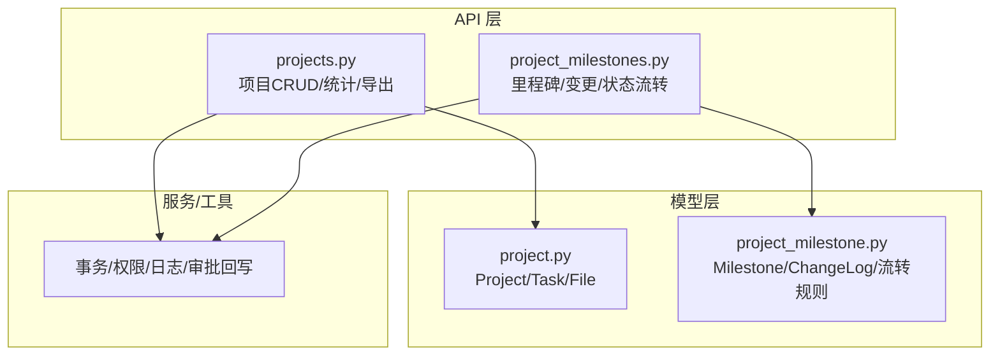
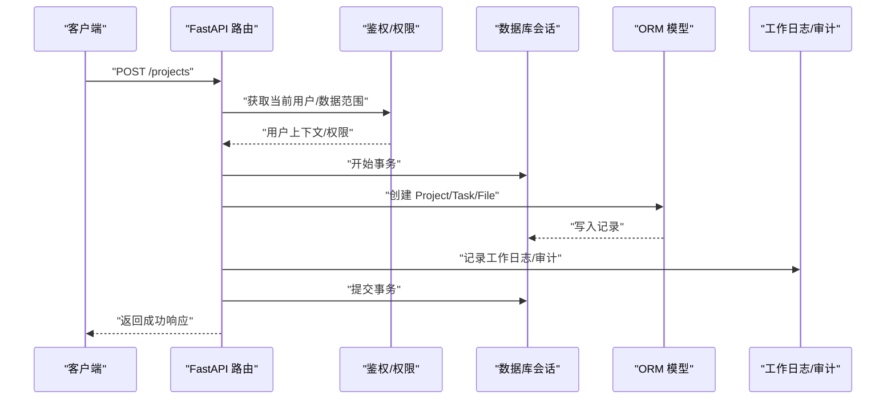
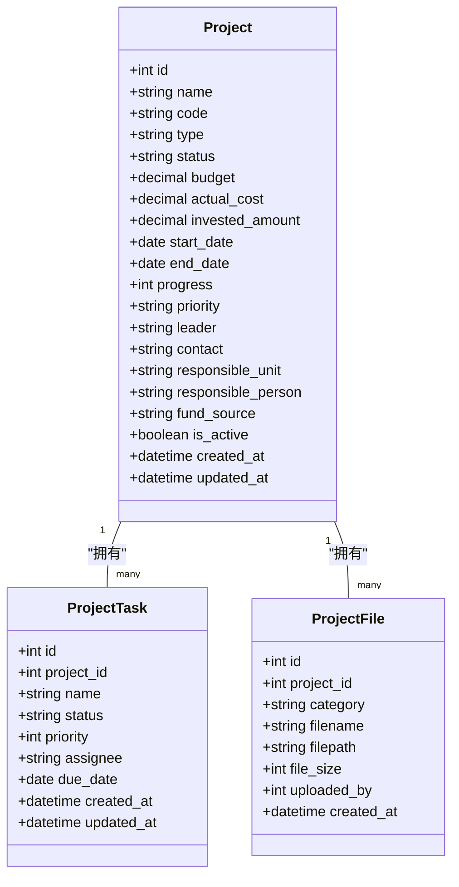
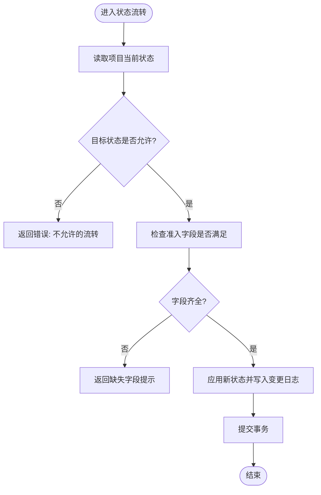
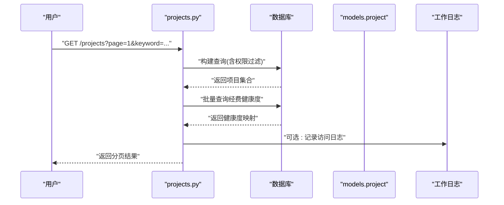
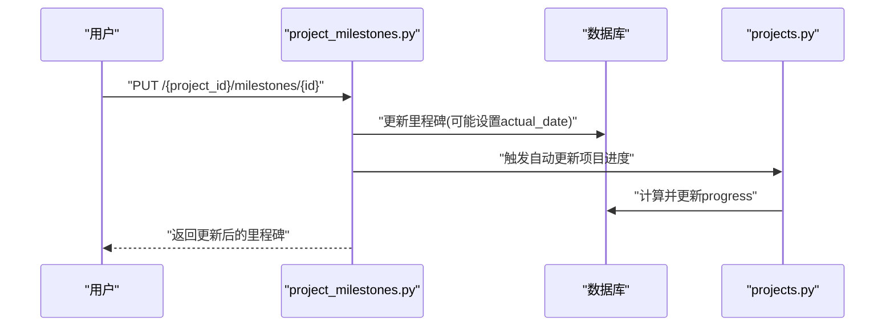
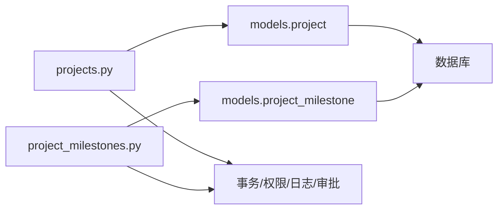

# 项目管理系统

<cite>
**本文引用的文件**
- [backend/app/models/project.py](file://backend/app/models/project.py)
- [backend/app/models/project_milestone.py](file://backend/app/models/project_milestone.py)
- [backend/app/api/v1/projects.py](file://backend/app/api/v1/projects.py)
- [backend/app/api/v1/project_milestones.py](file://backend/app/api/v1/project_milestones.py)
- [backend/app/schemas/project.py](file://backend/app/schemas/project.py)
</cite>

## 目录
1. [简介](#简介)
2. [项目结构](#项目结构)
3. [核心组件](#核心组件)
4. [架构总览](#架构总览)
5. [详细组件分析](#详细组件分析)
6. [依赖关系分析](#依赖关系分析)
7. [性能考虑](#性能考虑)
8. [故障排查指南](#故障排查指南)
9. [结论](#结论)
10. [附录](#附录)

## 简介
本技术文档聚焦项目管理系统的后端实现，围绕项目全生命周期管理展开，涵盖项目创建、编辑、状态跟踪、里程碑管理、进度汇报、文档附件、协作与权限控制、审计日志等关键能力。文档以代码级视角解释数据模型、API 流程、业务规则与数据流转机制，并提供可视化图示帮助理解系统结构与交互。

## 项目结构
本项目采用分层架构：
- 模型层（Models）：定义项目、里程碑、变更记录、任务、附件等实体及索引优化。
- API 层（FastAPI）：提供项目 CRUD、里程碑管理、状态流转、统计导出等接口。
- 服务/工具层：封装事务提交、数据权限、工作日志、审批回写等通用能力。
- 配置与迁移：通过 Alembic 维护数据库结构演进。

**图表来源**
- [backend/app/api/v1/projects.py:1-120](file://backend/app/api/v1/projects.py#L1-L120)
- [backend/app/api/v1/project_milestones.py:1-60](file://backend/app/api/v1/project_milestones.py#L1-L60)
- [backend/app/models/project.py:47-175](file://backend/app/models/project.py#L47-L175)
- [backend/app/models/project_milestone.py:12-105](file://backend/app/models/project_milestone.py#L12-L105)

**章节来源**
- [backend/app/api/v1/projects.py:1-120](file://backend/app/api/v1/projects.py#L1-L120)
- [backend/app/api/v1/project_milestones.py:1-60](file://backend/app/api/v1/project_milestones.py#L1-L60)
- [backend/app/models/project.py:47-175](file://backend/app/models/project.py#L47-L175)
- [backend/app/models/project_milestone.py:12-105](file://backend/app/models/project_milestone.py#L12-L105)

## 核心组件
- 项目模型与扩展字段：包含基础信息、预算与资金、时间计划、优先级、紧急程度、合同与效益、软删除标记、创建人/时间等；提供 to_dict 序列化。
- 项目任务与附件：任务用于拆解执行项；附件按阶段分类存储并关联项目。
- 里程碑与变更记录：里程碑跟踪关键节点；变更记录记录关键字段变更历史。
- 状态流转引擎：定义合法流转路径与准入条件，支持校验与自动进度计算。
- API 路由：项目列表/详情/创建/更新/统计/导出；里程碑增删改查、状态流转、变更记录查询、即将到期/逾期里程碑仪表板。

**章节来源**
- [backend/app/models/project.py:47-320](file://backend/app/models/project.py#L47-L320)
- [backend/app/models/project_milestone.py:12-187](file://backend/app/models/project_milestone.py#L12-L187)
- [backend/app/api/v1/projects.py:513-787](file://backend/app/api/v1/projects.py#L513-L787)
- [backend/app/api/v1/project_milestones.py:105-336](file://backend/app/api/v1/project_milestones.py#L105-L336)

## 架构总览
下图展示从请求到持久化的端到端调用链，包括权限校验、数据范围过滤、事务提交与审计日志。

**图表来源**
- [backend/app/api/v1/projects.py:790-800](file://backend/app/api/v1/projects.py#L790-L800)
- [backend/app/api/v1/projects.py:657-753](file://backend/app/api/v1/projects.py#L657-L753)
- [backend/app/api/v1/project_milestones.py:121-140](file://backend/app/api/v1/project_milestones.py#L121-L140)
- [backend/app/models/project.py:47-175](file://backend/app/models/project.py#L47-L175)
- [backend/app/models/project_milestone.py:12-105](file://backend/app/models/project_milestone.py#L12-L105)

## 详细组件分析

### 项目数据模型与关系
- Project：项目主表，含状态枚举、类型枚举、预算与实际花费、投资额、起止日期、进度、优先级、负责人/单位、联系方式（加密）、资金来源与拨付信息、扩展字段、软删除标记、创建人与时间戳。
- ProjectTask：项目任务，关联项目，支持状态与优先级。
- ProjectFile：项目附件，按阶段分类（research/implementation/acceptance/photo），记录文件名、路径、大小与上传人。

**图表来源**
- [backend/app/models/project.py:47-175](file://backend/app/models/project.py#L47-L175)
- [backend/app/models/project.py:239-320](file://backend/app/models/project.py#L239-L320)

**章节来源**
- [backend/app/models/project.py:47-320](file://backend/app/models/project.py#L47-L320)

### 里程碑与变更记录
- ProjectMilestone：里程碑名称、描述、计划完成日期、实际完成日期、负责人、状态、排序序号。
- ProjectChangeLog：记录项目关键字段变更（状态/预算/进度/人员/其他），含旧值/新值/原因/操作人/时间。
- 状态流转引擎：VALID_TRANSITIONS 定义合法流转路径；TRANSITION_REQUIREMENTS 定义各阶段准入字段；validate_status_transition 进行校验；calculate_milestone_progress 根据里程碑完成率计算项目进度。

**图表来源**
- [backend/app/models/project_milestone.py:110-187](file://backend/app/models/project_milestone.py#L110-L187)
- [backend/app/api/v1/project_milestones.py:249-306](file://backend/app/api/v1/project_milestones.py#L249-L306)

**章节来源**
- [backend/app/models/project_milestone.py:12-187](file://backend/app/models/project_milestone.py#L12-L187)
- [backend/app/api/v1/project_milestones.py:218-306](file://backend/app/api/v1/project_milestones.py#L218-L306)

### 项目 API 与业务流程
- 列表与详情：支持分页、关键词/类型/状态/村庄/地区/年份筛选；使用 selectinload 预加载关联数据；应用数据范围过滤；批量计算经费健康度指标。
- 创建与更新：Pydantic 校验日期格式与数值范围；更新时校验状态合法性；审批通过后自动回写项目状态为已批准。
- 统计与导出：统计各状态数量与预算汇总；导出 Excel/CSV，限制条数防内存溢出。
- 任务与经费：任务独立管理；经费健康度、预算执行率、支付偏差率在列表/详情中聚合返回。

**图表来源**
- [backend/app/api/v1/projects.py:657-753](file://backend/app/api/v1/projects.py#L657-L753)
- [backend/app/api/v1/projects.py:513-549](file://backend/app/api/v1/projects.py#L513-L549)
- [backend/app/api/v1/projects.py:555-651](file://backend/app/api/v1/projects.py#L555-L651)

**章节来源**
- [backend/app/api/v1/projects.py:513-787](file://backend/app/api/v1/projects.py#L513-L787)
- [backend/app/models/project.py:47-175](file://backend/app/models/project.py#L47-L175)

### 里程碑 API 与自动化
- 里程碑 CRUD：创建/更新/删除均记录工作日志；更新为“完成”时自动填充实际日期；删除后重新计算项目进度。
- 状态流转：提供获取可用流转规则与执行流转接口；流转失败时回滚临时写入字段。
- 仪表板：即将到期与逾期里程碑查询，应用数据范围过滤，避免 N+1 查询。

**图表来源**
- [backend/app/api/v1/project_milestones.py:143-180](file://backend/app/api/v1/project_milestones.py#L143-L180)
- [backend/app/api/v1/project_milestones.py:458-465](file://backend/app/api/v1/project_milestones.py#L458-L465)

**章节来源**
- [backend/app/api/v1/project_milestones.py:105-336](file://backend/app/api/v1/project_milestones.py#L105-L336)
- [backend/app/api/v1/project_milestones.py:458-465](file://backend/app/api/v1/project_milestones.py#L458-L465)

### 项目模板与批量操作
- 模板导入：项目中未直接暴露模板导入接口；可结合系统通用的导入导出能力（如 Excel 模板）在统一入口进行批量导入。
- 批量操作：项目列表导出支持批量导出；批量经费健康度计算避免 N+1 查询；可通过系统提供的批处理服务扩展批量更新/导入。

说明：如需项目模板与批量操作的具体接口，请参照系统统一的导入导出模块与服务。

[本节为概念性说明，不直接分析具体文件]

### 项目进度汇报流程
- 进度来源：项目进度可由里程碑完成情况自动计算；也可通过任务或外部流程更新。
- 汇报记录：建议在统一的工作日志或服务中记录进度汇报内容（时间、百分比、描述、上报人）。
- 数据一致性：确保里程碑与项目进度同步更新，避免不一致。

[本节为概念性说明，不直接分析具体文件]

### 文档附件管理与协作
- 附件模型：ProjectFile 支持按阶段分类存储，记录原始文件名、存储路径、大小与上传人。
- 协作：通过项目与任务关联，配合 RBAC 与数据范围过滤，实现组织内协作与访问控制。
- 安全：上传需结合系统上传安全策略（类型、大小、病毒扫描等）。

**章节来源**
- [backend/app/models/project.py:278-320](file://backend/app/models/project.py#L278-L320)

### 数据权限控制与审计日志最佳实践
- 数据权限：使用 apply_scope_filter/filter_by_data_scope 对查询施加组织/下级组织范围；详情接口使用 require_data_permission/check_record_access 做细粒度校验。
- 审计日志：通过 write_work_log 记录关键操作（创建/更新/删除里程碑、状态流转等）；变更日志表记录关键字段前后值与原因。
- 审批闭环：注册审批回调，将审批通过事件回写到项目状态，保证跨模块一致性。

**章节来源**
- [backend/app/api/v1/projects.py:118-146](file://backend/app/api/v1/projects.py#L118-L146)
- [backend/app/api/v1/projects.py:756-787](file://backend/app/api/v1/projects.py#L756-L787)
- [backend/app/api/v1/project_milestones.py:121-140](file://backend/app/api/v1/project_milestones.py#L121-L140)
- [backend/app/api/v1/project_milestones.py:249-306](file://backend/app/api/v1/project_milestones.py#L249-L306)

## 依赖关系分析
- 模型依赖：Project 与 ProjectTask/ProjectFile 一对多；Project 与 ProjectMilestone/ProjectChangeLog 一对多。
- API 依赖：projects.py 依赖 models.project 与 services（事务、权限、日志、审批）；project_milestones.py 依赖 models.project_milestone 与 services。
- 数据范围：所有列表/详情/仪表板查询均应用数据范围过滤，确保非管理员仅可见组织范围内数据。

**图表来源**
- [backend/app/api/v1/projects.py:1-120](file://backend/app/api/v1/projects.py#L1-L120)
- [backend/app/api/v1/project_milestones.py:1-60](file://backend/app/api/v1/project_milestones.py#L1-L60)
- [backend/app/models/project.py:47-175](file://backend/app/models/project.py#L47-L175)
- [backend/app/models/project_milestone.py:12-105](file://backend/app/models/project_milestone.py#L12-L105)

**章节来源**
- [backend/app/api/v1/projects.py:1-120](file://backend/app/api/v1/projects.py#L1-L120)
- [backend/app/api/v1/project_milestones.py:1-60](file://backend/app/api/v1/project_milestones.py#L1-L60)
- [backend/app/models/project.py:47-175](file://backend/app/models/project.py#L47-L175)
- [backend/app/models/project_milestone.py:12-105](file://backend/app/models/project_milestone.py#L12-L105)

## 性能考虑
- 预加载关联：使用 selectinload 预加载 tasks/funds/village/organization，减少 N+1 查询。
- 批量计算：经费健康度指标通过一次查询并按 project_id 分组计算，避免逐条查询。
- 导出限制：导出接口限制最大条数（如 10000），防止内存溢出。
- 索引优化：项目表与里程碑表建立多维度索引，覆盖常见查询组合（状态、类型、村庄、组织、日期等）。

**章节来源**
- [backend/app/api/v1/projects.py:680-753](file://backend/app/api/v1/projects.py#L680-L753)
- [backend/app/api/v1/projects.py:353-404](file://backend/app/api/v1/projects.py#L353-L404)
- [backend/app/api/v1/projects.py:555-651](file://backend/app/api/v1/projects.py#L555-L651)
- [backend/app/models/project.py:52-68](file://backend/app/models/project.py#L52-L68)
- [backend/app/models/project_milestone.py:17-21](file://backend/app/models/project_milestone.py#L17-L21)

## 故障排查指南
- 状态流转失败：检查 VALID_TRANSITIONS 与 TRANSITION_REQUIREMENTS，确认当前状态与目标状态是否允许，以及必填字段是否齐全。
- 无权访问：确认数据范围过滤是否正确应用；检查 created_by 与 organization_id 是否符合权限策略。
- 进度不一致：检查里程碑状态更新是否触发自动进度计算；确认 calculate_milestone_progress 逻辑与里程碑数据一致性。
- 导出异常：确认 openpyxl 是否安装；若缺失则回退 CSV；检查数据量是否超过限制。

**章节来源**
- [backend/app/models/project_milestone.py:110-187](file://backend/app/models/project_milestone.py#L110-L187)
- [backend/app/api/v1/projects.py:756-787](file://backend/app/api/v1/projects.py#L756-L787)
- [backend/app/api/v1/project_milestones.py:458-465](file://backend/app/api/v1/project_milestones.py#L458-L465)
- [backend/app/api/v1/projects.py:555-651](file://backend/app/api/v1/projects.py#L555-L651)

## 结论
本项目管理系统在后端实现了完整的项目生命周期管理能力，涵盖数据模型设计、API 流程、状态流转与进度联动、权限与审计、性能优化等方面。通过清晰的职责划分与严格的校验机制，保障了数据的准确性与安全性。建议在生产环境中持续监控性能指标与审计日志，定期评估索引与查询效率，确保系统稳定高效运行。

## 附录
- 相关 Schema：schemas/project.py 定义了基础项目与进度相关的 Pydantic 模型，可用于前端契约与校验。
- 测试用例：单元测试与集成测试覆盖了项目与里程碑的核心流程，可作为回归验证依据。

**章节来源**
- [backend/app/schemas/project.py:9-75](file://backend/app/schemas/project.py#L9-L75)