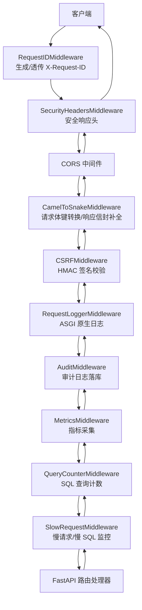
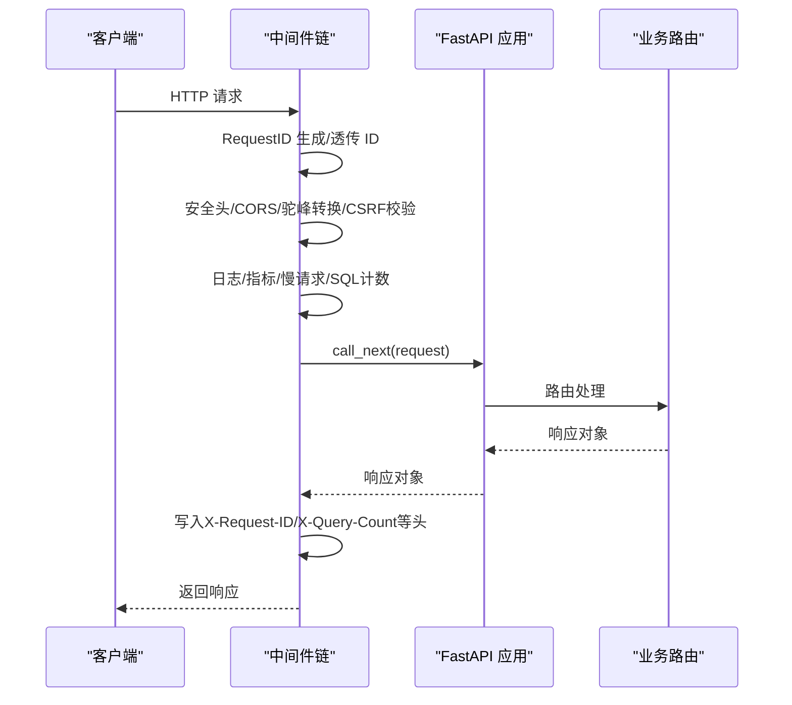
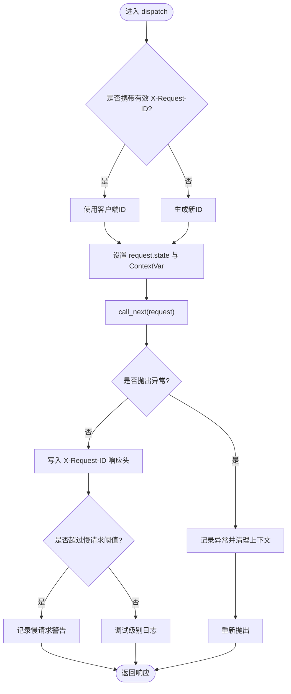
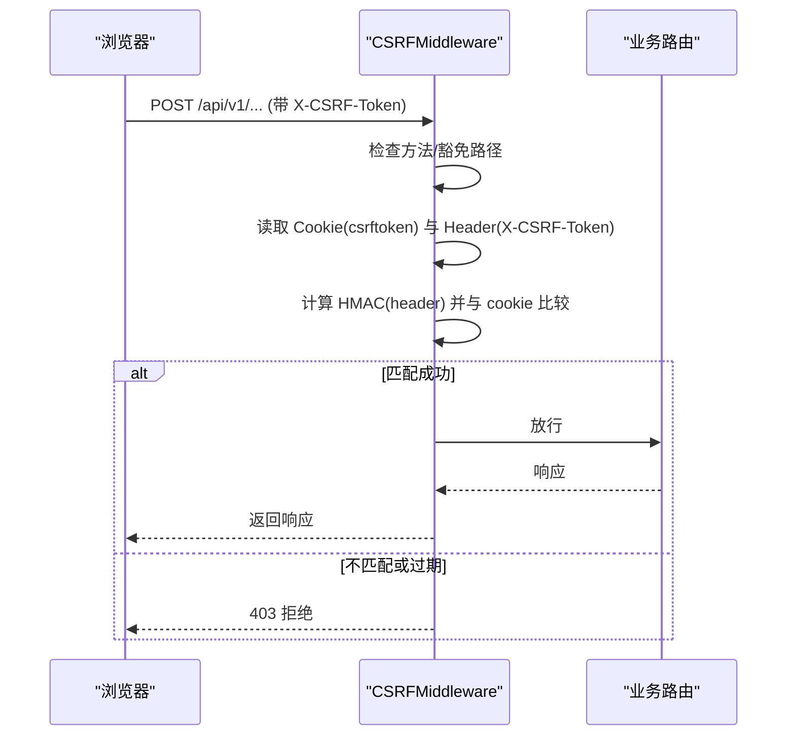
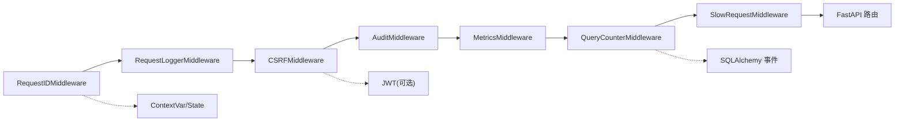

# 中间件架构设计

<cite>
**本文引用的文件**
- [backend/app/main.py](file://backend/app/main.py)
- [backend/app/middleware/request_id.py](file://backend/app/middleware/request_id.py)
- [backend/app/middleware/request_logger.py](file://backend/app/middleware/request_logger.py)
- [backend/app/middleware/csrf_middleware.py](file://backend/app/middleware/csrf_middleware.py)
- [backend/app/middleware/metrics_middleware.py](file://backend/app/middleware/metrics_middleware.py)
- [backend/app/middleware/query_counter.py](file://backend/app/middleware/query_counter.py)
- [backend/app/middleware/slow_request_monitor.py](file://backend/app/middleware/slow_request_monitor.py)
- [backend/app/middleware/camel_to_snake.py](file://backend/app/middleware/camel_to_snake.py)
- [backend/app/middleware/cache_headers.py](file://backend/app/middleware/cache_headers.py)
- [backend/app/middleware/body_size_limit.py](file://backend/app/middleware/body_size_limit.py)
- [backend/app/middleware/audit_context.py](file://backend/app/middleware/audit_context.py)
- [backend/app/core/audit_middleware.py](file://backend/app/core/audit_middleware.py)
</cite>

## 目录
1. [简介](#简介)
2. [项目结构](#项目结构)
3. [核心组件](#核心组件)
4. [架构总览](#架构总览)
5. [详细组件分析](#详细组件分析)
6. [依赖关系分析](#依赖关系分析)
7. [性能考量](#性能考量)
8. [故障排查指南](#故障排查指南)
9. [结论](#结论)
10. [附录](#附录)

## 简介
本技术文档围绕 FastAPI（基于 Starlette）的中间件架构，系统阐述请求处理链的执行顺序、生命周期管理、错误处理策略与上下文传递机制。结合仓库中已实现的中间件集合，说明注册顺序对执行顺序的影响、异步中间件的使用场景与最佳实践，并提供可复用的开发规范与示例路径，帮助开发者编写高质量、可观测、可扩展的自定义中间件。

## 项目结构
后端应用通过 main.py 集中注册中间件，形成“外层到内层”的请求拦截链。Starlette/FastAPI 的 add_middleware 遵循“后进先出”的执行顺序：最后添加的中间件最先执行，最先进入；最先添加的中间件最后执行，最后离开。因此，链路从外到内的实际执行顺序为：
- 请求进入：RequestID → SecurityHeaders → CORS → CamelToSnake → CSRF → RequestLogger → Audit → Metrics → QueryCounter/SlowRequestMonitor → 业务路由
- 响应返回：反向顺序回到客户端

图表来源
- [backend/app/main.py:113-165](file://backend/app/main.py#L113-L165)
- [backend/app/middleware/request_id.py:40-119](file://backend/app/middleware/request_id.py#L40-L119)
- [backend/app/middleware/request_logger.py:52-114](file://backend/app/middleware/request_logger.py#L52-L114)
- [backend/app/middleware/csrf_middleware.py:177-284](file://backend/app/middleware/csrf_middleware.py#L177-L284)
- [backend/app/middleware/metrics_middleware.py:132-177](file://backend/app/middleware/metrics_middleware.py#L132-L177)
- [backend/app/middleware/query_counter.py:39-78](file://backend/app/middleware/query_counter.py#L39-L78)
- [backend/app/middleware/slow_request_monitor.py:55-132](file://backend/app/middleware/slow_request_monitor.py#L55-L132)

章节来源
- [backend/app/main.py:113-165](file://backend/app/main.py#L113-L165)

## 核心组件
- 请求ID与链路追踪：RequestIDMiddleware 负责生成或透传唯一请求ID，注入响应头并设置上下文变量，便于日志关联与问题定位。
- 请求日志：RequestLoggerMiddleware 以 ASGI 原生方式记录方法、路径、IP、UA、状态码与耗时，支持跳过静态与健康检查路径。
- CSRF 保护：CSRFMiddleware 实现 HMAC 双提交 Cookie 模式，支持过期检测与豁免路径，兼容旧版明文比对降级。
- 指标采集：MetricsMiddleware 统计请求数、错误率、活跃请求、端点耗时分布与慢请求列表。
- SQL 查询计数：QueryCounterMiddleware 借助 SQLAlchemy after_cursor_execute 事件统计每个请求的 SQL 次数，输出响应头与告警。
- 慢请求/慢 SQL 监控：SlowRequestMiddleware 通过 ASGI 与 SQLAlchemy 事件捕获慢请求与慢 SQL，维护环形缓冲区与统计摘要。
- 请求体转换与响应信封：CamelToSnakeMiddleware 将前端 camelCase 键转换为 snake_case，并对裸 dict JSON 响应最小化补全 code/success 元数据。
- 缓存头：CacheHeadersMiddleware 为特定路径添加 Cache-Control 头，减少重复请求与数据库压力。
- 请求体大小限制：BodySizeLimitMiddleware 在非 multipart 且非白名单路径时限制请求体大小，防止超大 JSON 攻击。
- 审计上下文：AuditContext 使用 ContextVar 在异步环境中安全传递当前用户ID与请求ID，供审计与日志模块使用。
- 审计中间件：AuditMiddleware 解析 JWT 提取用户身份，记录访问日志并落库（独立短事务，失败不破坏业务）。

章节来源
- [backend/app/middleware/request_id.py:40-119](file://backend/app/middleware/request_id.py#L40-L119)
- [backend/app/middleware/request_logger.py:52-114](file://backend/app/middleware/request_logger.py#L52-L114)
- [backend/app/middleware/csrf_middleware.py:177-284](file://backend/app/middleware/csrf_middleware.py#L177-L284)
- [backend/app/middleware/metrics_middleware.py:132-177](file://backend/app/middleware/metrics_middleware.py#L132-L177)
- [backend/app/middleware/query_counter.py:39-78](file://backend/app/middleware/query_counter.py#L39-L78)
- [backend/app/middleware/slow_request_monitor.py:55-132](file://backend/app/middleware/slow_request_monitor.py#L55-L132)
- [backend/app/middleware/camel_to_snake.py:59-106](file://backend/app/middleware/camel_to_snake.py#L59-L106)
- [backend/app/middleware/cache_headers.py:20-31](file://backend/app/middleware/cache_headers.py#L20-L31)
- [backend/app/middleware/body_size_limit.py:48-79](file://backend/app/middleware/body_size_limit.py#L48-L79)
- [backend/app/middleware/audit_context.py:15-58](file://backend/app/middleware/audit_context.py#L15-L58)
- [backend/app/core/audit_middleware.py:11-109](file://backend/app/core/audit_middleware.py#L11-L109)

## 架构总览
中间件按“关注点分离”原则组织：
- 横切关注点：安全（CSRF、安全头）、可观测性（日志、指标、慢请求、SQL 计数）、兼容性（驼峰转换、缓存头）、防护（请求体大小限制）。
- 执行顺序由 main.py 中的 add_middleware 调用顺序决定，最终形成稳定的请求/响应双向管道。
- 上下文传递采用 ContextVar 与 request.state 组合，确保在异步环境下线程/协程安全的跨组件共享。

图表来源
- [backend/app/main.py:113-165](file://backend/app/main.py#L113-L165)
- [backend/app/middleware/request_id.py:50-119](file://backend/app/middleware/request_id.py#L50-L119)
- [backend/app/middleware/query_counter.py:47-78](file://backend/app/middleware/query_counter.py#L47-L78)

## 详细组件分析

### 请求ID与链路追踪（RequestIDMiddleware）
- 功能要点：
  - 优先使用客户端传入的 X-Request-ID（需格式校验），否则生成新ID。
  - 将ID写入 request.state.request_id 与 ContextVar，供日志过滤器注入。
  - 捕获 anyio.EndOfStream 异常，避免客户端断开时的崩溃。
  - 记录慢请求阈值（毫秒级）与耗时。
- 关键路径参考：
  - [backend/app/middleware/request_id.py:40-119](file://backend/app/middleware/request_id.py#L40-L119)

图表来源
- [backend/app/middleware/request_id.py:50-119](file://backend/app/middleware/request_id.py#L50-L119)

章节来源
- [backend/app/middleware/request_id.py:40-119](file://backend/app/middleware/request_id.py#L40-L119)

### 请求日志（RequestLoggerMiddleware）
- 功能要点：
  - ASGI 原生实现，记录方法、路径、查询串、客户端IP、UA、状态码与耗时。
  - 跳过静态资源与健康检查路径，降低噪音。
  - 通过 send_wrapper 捕获 http.response.start 获取状态码。
- 关键路径参考：
  - [backend/app/middleware/request_logger.py:52-114](file://backend/app/middleware/request_logger.py#L52-L114)

章节来源
- [backend/app/middleware/request_logger.py:52-114](file://backend/app/middleware/request_logger.py#L52-L114)

### CSRF 保护（CSRFMiddleware）
- 功能要点：
  - 双提交 Cookie + HMAC 签名校验：Cookie 存储 HMAC(raw_token)，Header 携带 raw_token。
  - 支持豁免路径与安全方法直接放行。
  - 过期检测：token 内嵌时间戳，超过窗口拒绝。
  - 兼容旧版明文比对降级，并记录警告。
  - 可信代理 IP 透传控制（fail-closed）。
- 关键路径参考：
  - [backend/app/middleware/csrf_middleware.py:177-284](file://backend/app/middleware/csrf_middleware.py#L177-L284)

图表来源
- [backend/app/middleware/csrf_middleware.py:177-284](file://backend/app/middleware/csrf_middleware.py#L177-L284)

章节来源
- [backend/app/middleware/csrf_middleware.py:177-284](file://backend/app/middleware/csrf_middleware.py#L177-L284)

### 指标采集（MetricsMiddleware）
- 功能要点：
  - 统计请求总数、错误数、活跃请求、平均耗时、端点 TopN 耗时、慢请求列表。
  - 线程安全存储（锁保护），避免并发竞争。
  - 跳过健康检查与指标自身路径。
- 关键路径参考：
  - [backend/app/middleware/metrics_middleware.py:132-177](file://backend/app/middleware/metrics_middleware.py#L132-L177)

章节来源
- [backend/app/middleware/metrics_middleware.py:132-177](file://backend/app/middleware/metrics_middleware.py#L132-L177)

### SQL 查询计数（QueryCounterMiddleware）
- 功能要点：
  - 通过 SQLAlchemy after_cursor_execute 事件递增计数器，桥接至 ContextVar。
  - 合并显式计数与事件计数，写入 request.state.query_count。
  - 输出 X-Query-Count 与 X-Response-Time 响应头，超阈值告警。
- 关键路径参考：
  - [backend/app/middleware/query_counter.py:39-78](file://backend/app/middleware/query_counter.py#L39-L78)

章节来源
- [backend/app/middleware/query_counter.py:39-78](file://backend/app/middleware/query_counter.py#L39-L78)

### 慢请求/慢 SQL 监控（SlowRequestMiddleware）
- 功能要点：
  - ASGI 层记录慢 API 请求（环形缓冲，保留最近 N 条）。
  - 通过 SQLAlchemy before/after_cursor_execute 捕获慢 SQL。
  - 提供统计摘要与查询接口（get_slow_api_records/get_slow_sql_records/get_slow_stats）。
- 关键路径参考：
  - [backend/app/middleware/slow_request_monitor.py:55-132](file://backend/app/middleware/slow_request_monitor.py#L55-L132)

章节来源
- [backend/app/middleware/slow_request_monitor.py:55-132](file://backend/app/middleware/slow_request_monitor.py#L55-L132)

### 请求体转换与响应信封（CamelToSnakeMiddleware）
- 功能要点：
  - 请求体：递归将 camelCase 键转换为 snake_case，仅当变更时重写 body。
  - 响应：对裸 dict JSON 响应最小化补全 code/success/message，保持数据结构不变。
  - 跳过非 JSON 与错误响应。
- 关键路径参考：
  - [backend/app/middleware/camel_to_snake.py:59-106](file://backend/app/middleware/camel_to_snake.py#L59-L106)

章节来源
- [backend/app/middleware/camel_to_snake.py:59-106](file://backend/app/middleware/camel_to_snake.py#L59-L106)

### 缓存头（CacheHeadersMiddleware）
- 功能要点：
  - 为特定路径前缀设置 Cache-Control，如筛选选项、组织树、静态资源。
  - 避免对统计/概览类端点缓存，保证数据即时可见。
- 关键路径参考：
  - [backend/app/middleware/cache_headers.py:20-31](file://backend/app/middleware/cache_headers.py#L20-L31)

章节来源
- [backend/app/middleware/cache_headers.py:20-31](file://backend/app/middleware/cache_headers.py#L20-L31)

### 请求体大小限制（BodySizeLimitMiddleware）
- 功能要点：
  - 非 multipart 且不在白名单路径时，限制请求体大小（默认 10MB）。
  - 白名单包含导入导出、批量操作、备份恢复等可能接收大体积数据的端点。
- 关键路径参考：
  - [backend/app/middleware/body_size_limit.py:48-79](file://backend/app/middleware/body_size_limit.py#L48-L79)

章节来源
- [backend/app/middleware/body_size_limit.py:48-79](file://backend/app/middleware/body_size_limit.py#L48-L79)

### 审计上下文（AuditContext）
- 功能要点：
  - 使用 ContextVar 在异步环境中安全传递当前用户ID与请求ID。
  - 提供 get/set 接口，供审计与日志模块使用。
- 关键路径参考：
  - [backend/app/middleware/audit_context.py:15-58](file://backend/app/middleware/audit_context.py#L15-L58)

章节来源
- [backend/app/middleware/audit_context.py:15-58](file://backend/app/middleware/audit_context.py#L15-L58)

### 审计中间件（AuditMiddleware）
- 功能要点：
  - 解析 Authorization 头中的 JWT，提取用户身份（user_id/username）。
  - 记录访问日志并落库到 api_access_logs（独立短 session，失败仅 WARNING）。
  - 不影响主请求事务，确保健壮性。
- 关键路径参考：
  - [backend/app/core/audit_middleware.py:11-109](file://backend/app/core/audit_middleware.py#L11-L109)

章节来源
- [backend/app/core/audit_middleware.py:11-109](file://backend/app/core/audit_middleware.py#L11-L109)

## 依赖关系分析
- 中间件之间的耦合度较低，主要通过 request.state、ContextVar 与标准响应头进行协作。
- 外部依赖：
  - Starlette/FastAPI：中间件基类与请求/响应模型。
  - SQLAlchemy：SQL 事件监听用于查询计数与慢 SQL 监控。
  - anyio：处理客户端断开的流式异常。
  - JWT：审计中间件解析令牌。
- 循环依赖规避：
  - CSRF 中间件延迟导入 settings，避免启动时循环依赖。
  - 审计中间件在落库时使用独立 SessionLocal，避免与业务事务耦合。

图表来源
- [backend/app/main.py:113-165](file://backend/app/main.py#L113-L165)
- [backend/app/middleware/query_counter.py:39-78](file://backend/app/middleware/query_counter.py#L39-L78)
- [backend/app/middleware/slow_request_monitor.py:55-132](file://backend/app/middleware/slow_request_monitor.py#L55-L132)
- [backend/app/core/audit_middleware.py:11-109](file://backend/app/core/audit_middleware.py#L11-L109)

章节来源
- [backend/app/main.py:113-165](file://backend/app/main.py#L113-L165)

## 性能考量
- 中间件选择与顺序：
  - 将轻量级、无阻塞的中间件置于外层（如 RequestID、CORS、安全头），将较重逻辑（如审计落库、指标统计）置于内层，减少不必要的开销。
  - 对高频静态/低变化数据启用缓存头，降低数据库压力。
- 异步中间件：
  - 所有中间件均使用 async/await 或 ASGI 原生 __call__，避免阻塞事件循环。
  - 审计落库使用独立短事务，失败不阻断主流程。
- I/O 优化：
  - 仅在必要时读取请求体（如驼峰转换），避免重复解码。
  - 指标与日志记录尽量轻量，避免在热路径中进行重型序列化。
- 监控与调优：
  - 利用慢请求/慢 SQL 监控识别瓶颈，结合 X-Query-Count 与 X-Response-Time 快速定位问题。
  - 调整阈值（慢请求、慢 SQL、查询计数告警）以适应不同环境。

[本节为通用指导，无需具体文件引用]

## 故障排查指南
- 客户端连接提前断开：
  - 现象：anyio.EndOfStream 异常导致响应不完整。
  - 处理：RequestIDMiddleware 捕获该异常并返回空响应，避免崩溃。
  - 参考路径：[backend/app/middleware/request_id.py:64-79](file://backend/app/middleware/request_id.py#L64-L79)
- CSRF 验证失败：
  - 现象：403 拒绝，提示缺少 token 或 token 无效/过期。
  - 排查：确认前端是否正确获取 csrf-token 并在请求头携带；检查豁免路径配置；核对密钥与时间戳。
  - 参考路径：[backend/app/middleware/csrf_middleware.py:211-284](file://backend/app/middleware/csrf_middleware.py#L211-L284)
- 审计落库失败：
  - 现象：WARNING 日志记录失败原因，但不影响业务请求。
  - 处理：检查数据库连接与表结构；确认独立 SessionLocal 可用。
  - 参考路径：[backend/app/core/audit_middleware.py:80-109](file://backend/app/core/audit_middleware.py#L80-L109)
- 请求体过大：
  - 现象：413 拒绝，提示超过大小限制。
  - 处理：确认是否为 multipart 或白名单路径；调整 BodySizeLimitMiddleware 配置。
  - 参考路径：[backend/app/middleware/body_size_limit.py:48-79](file://backend/app/middleware/body_size_limit.py#L48-L79)
- 慢请求/慢 SQL：
  - 现象：慢请求/慢 SQL 告警日志与环形缓冲区记录。
  - 处理：结合 X-Query-Count 与慢 SQL 列表优化查询；考虑索引与分页。
  - 参考路径：[backend/app/middleware/slow_request_monitor.py:70-132](file://backend/app/middleware/slow_request_monitor.py#L70-L132), [backend/app/middleware/query_counter.py:61-78](file://backend/app/middleware/query_counter.py#L61-L78)

章节来源
- [backend/app/middleware/request_id.py:64-79](file://backend/app/middleware/request_id.py#L64-L79)
- [backend/app/middleware/csrf_middleware.py:211-284](file://backend/app/middleware/csrf_middleware.py#L211-L284)
- [backend/app/core/audit_middleware.py:80-109](file://backend/app/core/audit_middleware.py#L80-L109)
- [backend/app/middleware/body_size_limit.py:48-79](file://backend/app/middleware/body_size_limit.py#L48-L79)
- [backend/app/middleware/slow_request_monitor.py:70-132](file://backend/app/middleware/slow_request_monitor.py#L70-L132)
- [backend/app/middleware/query_counter.py:61-78](file://backend/app/middleware/query_counter.py#L61-L78)

## 结论
本项目的中间件架构以 Starlette/FastAPI 为基础，通过合理的注册顺序与职责划分，实现了安全、可观测、健壮且高性能的请求处理链。各中间件之间松耦合、高内聚，借助 ContextVar 与 request.state 实现异步安全的上下文传递。通过慢请求/慢 SQL 监控、指标采集与审计落库，形成了完整的可观测体系。建议在实际开发中遵循本文档的规范与实践，持续优化中间件性能与稳定性。

[本节为总结，无需具体文件引用]

## 附录
- 中间件开发规范（建议）：
  - 明确职责：每个中间件只关注单一横切关注点。
  - 轻量高效：避免在热路径中进行重型 I/O 或复杂计算。
  - 异步友好：使用 async/await 或 ASGI 原生 __call__，避免阻塞事件循环。
  - 上下文安全：使用 ContextVar 与 request.state 传递跨组件信息。
  - 错误隔离：中间件内部异常不应影响下游处理；必要时返回合理错误响应。
  - 可配置：通过参数或环境变量控制行为（如阈值、白名单）。
  - 可测试：提供单元测试覆盖关键分支（如跳过路径、异常分支）。
- 代码示例路径（参考实现）：
  - 请求ID与链路追踪：[backend/app/middleware/request_id.py:40-119](file://backend/app/middleware/request_id.py#L40-L119)
  - 请求日志：[backend/app/middleware/request_logger.py:52-114](file://backend/app/middleware/request_logger.py#L52-L114)
  - CSRF 保护：[backend/app/middleware/csrf_middleware.py:177-284](file://backend/app/middleware/csrf_middleware.py#L177-L284)
  - 指标采集：[backend/app/middleware/metrics_middleware.py:132-177](file://backend/app/middleware/metrics_middleware.py#L132-L177)
  - SQL 查询计数：[backend/app/middleware/query_counter.py:39-78](file://backend/app/middleware/query_counter.py#L39-L78)
  - 慢请求/慢 SQL：[backend/app/middleware/slow_request_monitor.py:55-132](file://backend/app/middleware/slow_request_monitor.py#L55-L132)
  - 驼峰转换与响应信封：[backend/app/middleware/camel_to_snake.py:59-106](file://backend/app/middleware/camel_to_snake.py#L59-L106)
  - 缓存头：[backend/app/middleware/cache_headers.py:20-31](file://backend/app/middleware/cache_headers.py#L20-L31)
  - 请求体大小限制：[backend/app/middleware/body_size_limit.py:48-79](file://backend/app/middleware/body_size_limit.py#L48-L79)
  - 审计上下文：[backend/app/middleware/audit_context.py:15-58](file://backend/app/middleware/audit_context.py#L15-L58)
  - 审计中间件：[backend/app/core/audit_middleware.py:11-109](file://backend/app/core/audit_middleware.py#L11-L109)

[本节为附录，无需具体文件引用]