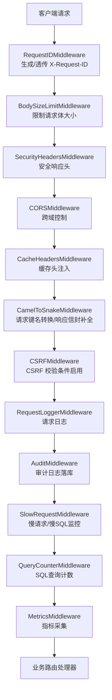
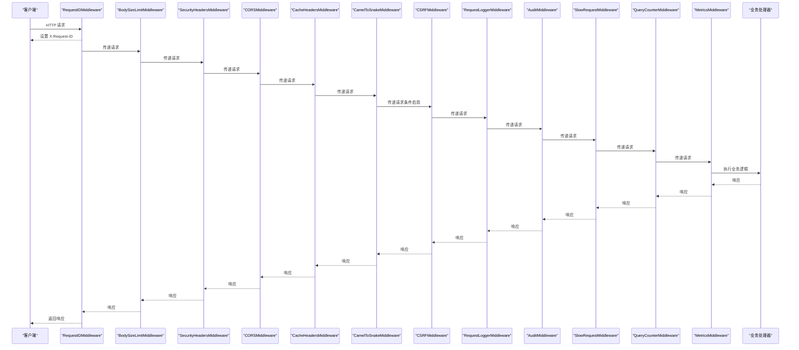
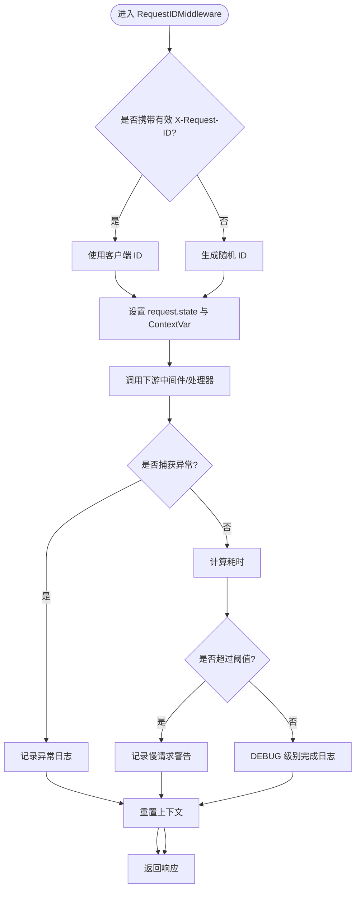
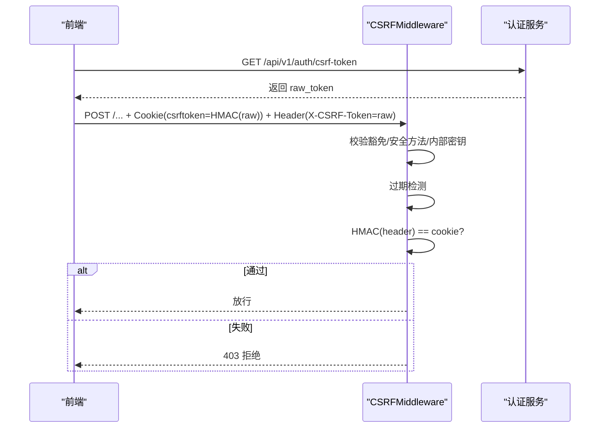
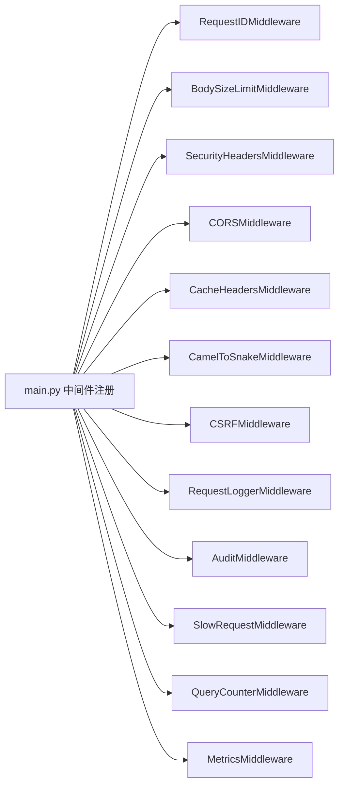

# 中间件系统

<cite>
**本文引用的文件**
- [backend/app/main.py](file://backend/app/main.py)
- [backend/app/middleware/request_logger.py](file://backend/app/middleware/request_logger.py)
- [backend/app/middleware/csrf_middleware.py](file://backend/app/middleware/csrf_middleware.py)
- [backend/app/middleware/slow_request_monitor.py](file://backend/app/middleware/slow_request_monitor.py)
- [backend/app/middleware/metrics_middleware.py](file://backend/app/middleware/metrics_middleware.py)
- [backend/app/middleware/request_id.py](file://backend/app/middleware/request_id.py)
- [backend/app/core/audit_middleware.py](file://backend/app/core/audit_middleware.py)
- [backend/app/middleware/body_size_limit.py](file://backend/app/middleware/body_size_limit.py)
- [backend/app/middleware/cache_headers.py](file://backend/app/middleware/cache_headers.py)
- [backend/app/middleware/query_counter.py](file://backend/app/middleware/query_counter.py)
- [backend/app/middleware/camel_to_snake.py](file://backend/app/middleware/camel_to_snake.py)
</cite>

## 目录
1. [简介](#简介)
2. [项目结构](#项目结构)
3. [核心组件](#核心组件)
4. [架构总览](#架构总览)
5. [详细组件分析](#详细组件分析)
6. [依赖关系分析](#依赖关系分析)
7. [性能考量](#性能考量)
8. [故障排查指南](#故障排查指南)
9. [结论](#结论)
10. [附录](#附录)

## 简介
本技术文档聚焦后端中间件系统，系统性说明请求处理链的执行顺序、中间件的注册机制与职责边界；覆盖请求日志记录、慢请求监控、审计日志、CORS、CSRF保护、请求体大小限制、缓存头注入、SQL查询计数与键名转换等能力。同时提供自定义中间件开发规范、最佳实践、性能影响与优化策略（含异步中间件使用场景），以及调试与故障排查方法（请求追踪与性能分析工具）。

## 项目结构
中间件集中在 backend/app/middleware 目录，由应用入口在启动时按特定顺序注册到 FastAPI/Starlette 管道中。注册顺序决定执行顺序：Starlette 按添加的逆序执行，因此“最后添加的最先执行”。

图表来源
- [backend/app/main.py:113-165](file://backend/app/main.py#L113-L165)

章节来源
- [backend/app/main.py:113-165](file://backend/app/main.py#L113-L165)

## 核心组件
- 请求链路追踪：RequestIDMiddleware 为每个请求生成或接受 X-Request-ID，并注入日志上下文，便于跨层关联。
- 请求日志：RequestLoggerMiddleware 记录方法、路径、参数、IP、UA、状态码与耗时，跳过静态与健康检查路径。
- 审计日志：AuditMiddleware 解析认证信息，记录访问日志并持久化到数据库，失败不破坏主流程。
- CORS：FastAPI CORSMiddleware 配置允许源、方法、头与凭证策略。
- CSRF 保护：CSRFMiddleware 实现 HMAC 签名增强双提交 Cookie 模式，支持过期检测与豁免路径。
- 慢请求监控：SlowRequestMiddleware 记录超过阈值的 API 耗时与慢 SQL（通过 SQLAlchemy 事件监听）。
- 指标采集：MetricsMiddleware 统计请求数、错误率、活跃请求、端点耗时分布与慢请求列表。
- 请求体大小限制：BodySizeLimitMiddleware 对非 multipart 且非白名单路径的请求进行体积限制。
- 缓存头：CacheHeadersMiddleware 为指定前缀响应附加 Cache-Control 头，减少重复查询。
- SQL 查询计数：QueryCounterMiddleware 通过 SQLAlchemy 事件统计每请求 SQL 次数，输出响应头与告警。
- 键名转换：CamelToSnakeMiddleware 将前端 camelCase JSON 键转换为 snake_case，并对裸 dict 响应最小补全信封元数据。

章节来源
- [backend/app/middleware/request_id.py:40-128](file://backend/app/middleware/request_id.py#L40-L128)
- [backend/app/middleware/request_logger.py:52-114](file://backend/app/middleware/request_logger.py#L52-L114)
- [backend/app/core/audit_middleware.py:11-109](file://backend/app/core/audit_middleware.py#L11-L109)
- [backend/app/middleware/csrf_middleware.py:177-284](file://backend/app/middleware/csrf_middleware.py#L177-L284)
- [backend/app/middleware/slow_request_monitor.py:55-132](file://backend/app/middleware/slow_request_monitor.py#L55-L132)
- [backend/app/middleware/metrics_middleware.py:132-177](file://backend/app/middleware/metrics_middleware.py#L132-L177)
- [backend/app/middleware/body_size_limit.py:48-79](file://backend/app/middleware/body_size_limit.py#L48-L79)
- [backend/app/middleware/cache_headers.py:20-31](file://backend/app/middleware/cache_headers.py#L20-L31)
- [backend/app/middleware/query_counter.py:39-88](file://backend/app/middleware/query_counter.py#L39-L88)
- [backend/app/middleware/camel_to_snake.py:59-106](file://backend/app/middleware/camel_to_snake.py#L59-L106)

## 架构总览
中间件以 ASGI 形式串联，形成“外层拦截—内层处理—外层收尾”的洋葱模型。关键特性：
- 执行顺序：由 main.py 中的 add_middleware 调用顺序决定，实际执行顺序为其逆序。
- 可插拔性：各中间件独立封装单一职责，可通过环境变量或配置开关启用/禁用（如 CSRF）。
- 低侵入：多数中间件基于 Starlette/FastAPI 原生扩展点，避免修改业务代码。
- 可观测性：统一通过日志、响应头、内存计数器暴露可观测数据。

图表来源
- [backend/app/main.py:113-165](file://backend/app/main.py#L113-L165)

## 详细组件分析

### 请求链路追踪（RequestIDMiddleware）
- 功能：生成或接受 X-Request-ID，写入 request.state 与上下文变量，响应头回传，记录耗时与慢请求告警。
- 关键点：客户端传入 ID 需格式校验；异常分支记录 debug 日志；连接断开时返回特定状态码。
- 适用场景：全链路追踪、问题定位、日志聚合。

图表来源
- [backend/app/middleware/request_id.py:40-128](file://backend/app/middleware/request_id.py#L40-L128)

章节来源
- [backend/app/middleware/request_id.py:40-128](file://backend/app/middleware/request_id.py#L40-L128)

### 请求日志（RequestLoggerMiddleware）
- 功能：记录方法、路径、查询串、客户端 IP、UA、状态码与耗时；跳过健康检查与静态资源。
- 关键点：ASGI send_wrapper 捕获状态码；异常分支记录错误日志。
- 适用场景：访问审计、流量分析、问题回溯。

章节来源
- [backend/app/middleware/request_logger.py:52-114](file://backend/app/middleware/request_logger.py#L52-L114)

### 审计日志（AuditMiddleware）
- 功能：解析 JWT 提取用户身份，记录访问日志并持久化到 api_access_logs；落库失败仅记录警告，不影响主流程。
- 关键点：独立短 session 落库；token 解析失败视为匿名请求。
- 适用场景：合规审计、操作追溯。

章节来源
- [backend/app/core/audit_middleware.py:11-109](file://backend/app/core/audit_middleware.py#L11-L109)

### CORS 处理（CORSMiddleware）
- 功能：配置允许的源、方法、头与凭证策略，暴露必要响应头。
- 关键点：max_age 控制预检缓存；expose_headers 包含 X-Request-ID 等。
- 适用场景：前后端分离部署、跨域访问。

章节来源
- [backend/app/main.py:147-155](file://backend/app/main.py#L147-L155)

### CSRF 保护（CSRFMiddleware）
- 功能：HMAC 签名增强的双提交 Cookie 模式；支持过期检测、豁免路径、可信代理透传真实 IP。
- 关键点：新流程 HMAC(header)=cookie；旧流程明文兼容并记录退化日志；内部通道密钥豁免。
- 适用场景：表单提交、状态变更接口防护。

图表来源
- [backend/app/middleware/csrf_middleware.py:65-124](file://backend/app/middleware/csrf_middleware.py#L65-L124)
- [backend/app/middleware/csrf_middleware.py:177-284](file://backend/app/middleware/csrf_middleware.py#L177-L284)

章节来源
- [backend/app/middleware/csrf_middleware.py:177-284](file://backend/app/middleware/csrf_middleware.py#L177-L284)

### 慢请求监控（SlowRequestMiddleware）
- 功能：记录超过阈值的 API 耗时与慢 SQL；维护环形缓冲区与统计摘要。
- 关键点：通过 SQLAlchemy before/after_cursor_execute 监听 SQL 耗时；内存计数器与最近记录导出。
- 适用场景：性能瓶颈识别、慢查询治理。

章节来源
- [backend/app/middleware/slow_request_monitor.py:55-132](file://backend/app/middleware/slow_request_monitor.py#L55-L132)

### 指标采集（MetricsMiddleware）
- 功能：统计请求计数、错误率、活跃请求、端点耗时分布、慢请求列表；线程安全存储。
- 关键点：跳过健康检查与指标端点；异常分支记录错误计数。
- 适用场景：运行态监控、容量规划。

章节来源
- [backend/app/middleware/metrics_middleware.py:132-177](file://backend/app/middleware/metrics_middleware.py#L132-L177)

### 请求体大小限制（BodySizeLimitMiddleware）
- 功能：对非 multipart 且非白名单路径的请求限制最大请求体大小，防止超大 JSON 攻击。
- 关键点：multipart/form-data 与批量导入路径放行；超限返回 413。
- 适用场景：防 DoS、资源保护。

章节来源
- [backend/app/middleware/body_size_limit.py:48-79](file://backend/app/middleware/body_size_limit.py#L48-L79)

### 缓存头注入（CacheHeadersMiddleware）
- 功能：为指定前缀响应附加 Cache-Control 头，减少重复请求与数据库压力。
- 关键点：字典/筛选选项短期缓存；静态资源长期缓存 immutable。
- 适用场景：读多写少接口、静态资源。

章节来源
- [backend/app/middleware/cache_headers.py:20-31](file://backend/app/middleware/cache_headers.py#L20-L31)

### SQL 查询计数（QueryCounterMiddleware）
- 功能：统计每请求 SQL 次数，输出 X-Query-Count 与 X-Response-Time 响应头；超阈值告警。
- 关键点：通过 contextvar 桥接 SQLAlchemy 事件与请求上下文；兼容显式递增接口。
- 适用场景：N+1 检测、查询优化。

章节来源
- [backend/app/middleware/query_counter.py:39-88](file://backend/app/middleware/query_counter.py#L39-L88)

### 键名转换与响应信封补全（CamelToSnakeMiddleware）
- 功能：将前端 camelCase JSON 键转换为 snake_case；对裸 dict 响应最小补全 success/code/message。
- 关键点：仅在 application/json 且非错误响应时处理；文件/流式响应跳过。
- 适用场景：前后端命名约定统一、响应一致性。

章节来源
- [backend/app/middleware/camel_to_snake.py:59-106](file://backend/app/middleware/camel_to_snake.py#L59-L106)

## 依赖关系分析
- 入口依赖：main.py 集中注册所有中间件，并通过环境变量控制启用（如 CSRF_ENABLED）。
- 中间件间耦合：多数中间件相互独立，仅共享 request/response 对象与上下文；审计与慢请求监控涉及数据库与 SQLAlchemy 事件。
- 外部依赖：JWT、SQLAlchemy、Starlette/FastAPI、anyio 等。

图表来源
- [backend/app/main.py:113-165](file://backend/app/main.py#L113-L165)

章节来源
- [backend/app/main.py:113-165](file://backend/app/main.py#L113-L165)

## 性能考量
- 中间件开销：尽量保持轻量，避免阻塞 I/O；I/O 操作（如审计落库）应隔离于主事务，失败不阻断请求。
- 异步中间件：优先使用 async def __call__ 或 BaseHTTPMiddleware.dispatch 的异步范式，避免阻塞事件循环。
- 采样与阈值：慢请求与慢 SQL 监控采用阈值与环形缓冲，控制内存占用；指标采集跳过健康与指标端点。
- 缓存策略：对只读、低频变化数据启用缓存头，降低 DB 压力。
- 请求体限制：尽早拒绝超大请求，减少后续处理成本。
- 建议：
  - 将 CPU 密集任务下沉至后台任务队列，不在中间件中执行。
  - 对高频路径开启缓存头；对统计类接口谨慎缓存，确保数据时效性。
  - 合理设置慢请求阈值，避免误报过多导致日志风暴。

[本节为通用指导，无需具体文件引用]

## 故障排查指南
- 请求追踪：
  - 通过 X-Request-ID 关联全链路日志；在日志中查找 rid 字段。
  - 若客户端连接提前断开，RequestIDMiddleware 会返回特定状态码并记录 debug 日志。
- 慢请求与慢 SQL：
  - 查看 SlowRequestMiddleware 的慢 API/慢 SQL 记录与统计摘要；结合 QueryCounterMiddleware 的 X-Query-Count 判断是否存在 N+1。
  - 针对慢 SQL 优化索引或改写查询。
- 审计日志：
  - 若审计落库失败，仅记录 WARNING，不影响业务；检查数据库连接与权限。
- CSRF 验证失败：
  - 确认前端已获取 token 并正确设置 Cookie 与 Header；检查豁免路径与内部密钥配置。
  - 关注退化路径日志，提示升级前端至 HMAC 流程。
- 指标与监控：
  - 通过 MetricsMiddleware 的统计摘要观察错误率、活跃请求与慢请求趋势。
- 性能分析工具：
  - 结合慢请求监控与 SQL 计数，定位热点接口与慢查询。
  - 在生产环境开启结构化日志与集中式日志收集，便于检索与分析。

章节来源
- [backend/app/middleware/request_id.py:40-128](file://backend/app/middleware/request_id.py#L40-L128)
- [backend/app/middleware/slow_request_monitor.py:55-132](file://backend/app/middleware/slow_request_monitor.py#L55-L132)
- [backend/app/middleware/query_counter.py:39-88](file://backend/app/middleware/query_counter.py#L39-L88)
- [backend/app/core/audit_middleware.py:11-109](file://backend/app/core/audit_middleware.py#L11-L109)
- [backend/app/middleware/csrf_middleware.py:177-284](file://backend/app/middleware/csrf_middleware.py#L177-L284)
- [backend/app/middleware/metrics_middleware.py:132-177](file://backend/app/middleware/metrics_middleware.py#L132-L177)

## 结论
本中间件系统以清晰的分层与职责划分，提供了完整的可观测性、安全性与性能保障能力。通过合理的注册顺序与可配置开关，既保证了核心功能的稳定性，又具备良好的扩展性。建议在新增中间件时遵循单一职责、异步优先、低侵入原则，并结合监控与日志完善可观测性闭环。

[本节为总结性内容，无需具体文件引用]

## 附录
- 自定义中间件开发规范与最佳实践：
  - 明确职责：每个中间件只做一件事（如日志、鉴权、限流）。
  - 异步优先：使用 async def __call__ 或 BaseHTTPMiddleware.dispatch，避免阻塞事件循环。
  - 低侵入：不修改业务代码，通过 request/state 与响应头传递上下文。
  - 容错设计：I/O 失败不阻断主流程（如审计落库失败仅记录警告）。
  - 可配置：通过环境变量或配置项控制启用/禁用与阈值。
  - 可测试：提供单元测试覆盖关键分支（如超时、异常、边界值）。
  - 可观测：统一日志格式、注入请求 ID、输出关键指标。
- 异步中间件使用场景：
  - 网络 I/O（如远程鉴权、缓存读取）、数据库 I/O（审计落库）、CPU 密集任务（应下沉至后台任务）。
  - 注意：避免在中间件中执行长时间阻塞操作，必要时使用线程池或任务队列。

[本节为通用指导，无需具体文件引用]