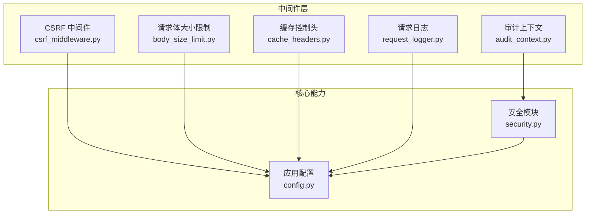
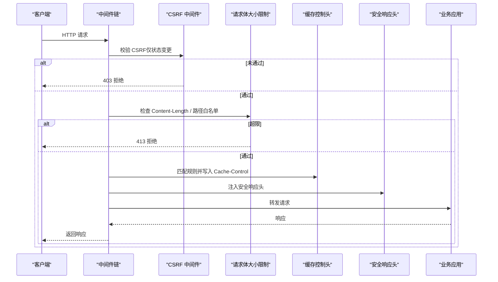
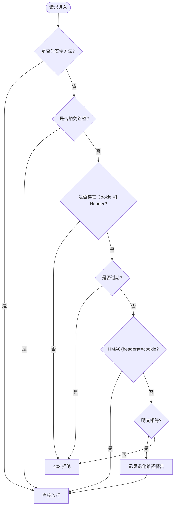
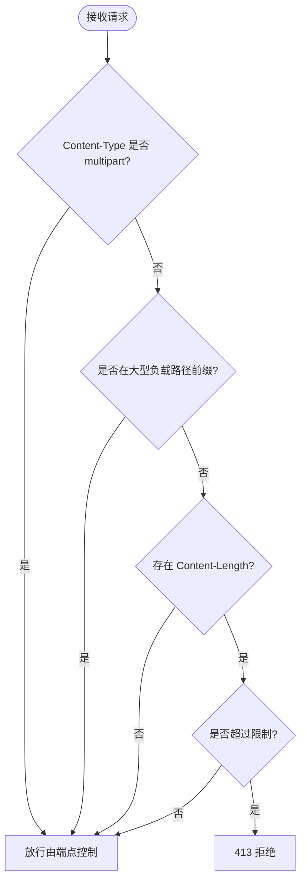
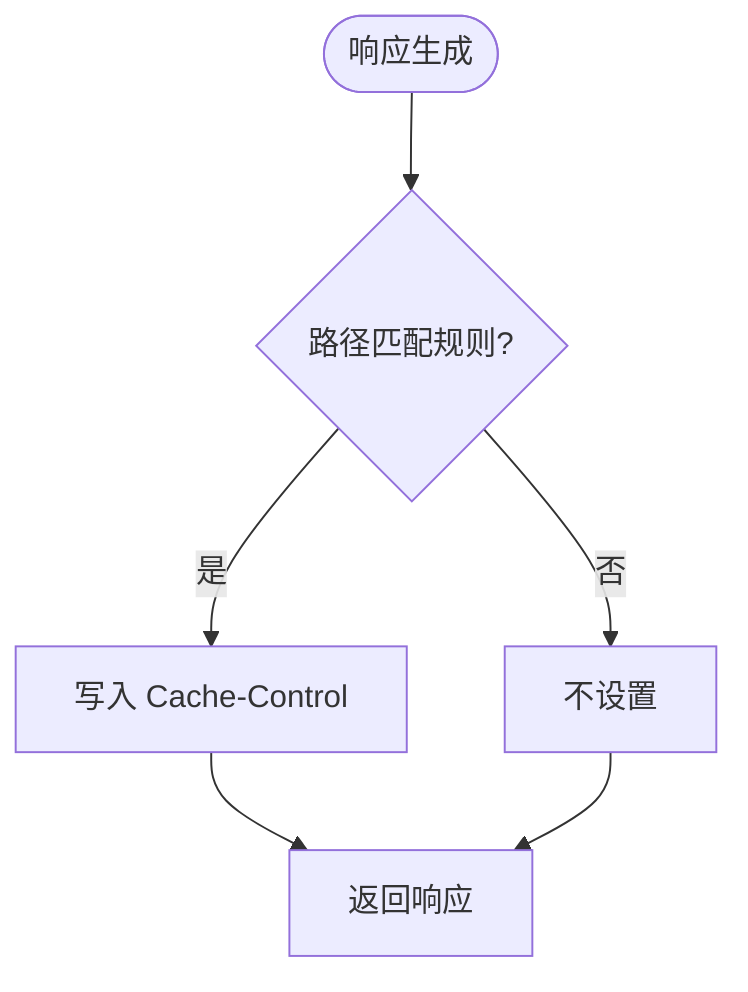
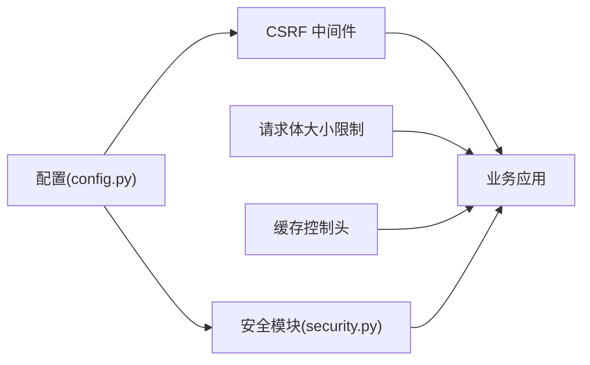

# 安全中间件

<cite>
**本文引用的文件**
- [backend/app/middleware/csrf_middleware.py](file://backend/app/middleware/csrf_middleware.py)
- [backend/app/middleware/body_size_limit.py](file://backend/app/middleware/body_size_limit.py)
- [backend/app/middleware/cache_headers.py](file://backend/app/middleware/cache_headers.py)
- [backend/app/core/security.py](file://backend/app/core/security.py)
- [backend/app/core/config.py](file://backend/app/core/config.py)
- [backend/app/middleware/request_logger.py](file://backend/app/middleware/request_logger.py)
- [backend/app/middleware/audit_context.py](file://backend/app/middleware/audit_context.py)
</cite>

## 目录
1. [简介](#简介)
2. [项目结构](#项目结构)
3. [核心组件](#核心组件)
4. [架构总览](#架构总览)
5. [详细组件分析](#详细组件分析)
6. [依赖关系分析](#依赖关系分析)
7. [性能考量](#性能考量)
8. [故障排查指南](#故障排查指南)
9. [结论](#结论)
10. [附录](#附录)

## 简介
本技术文档聚焦后端安全中间件，系统性说明 CSRF 保护机制（令牌生成、验证流程与防护措施）、请求体大小限制策略、缓存控制头设置策略，以及其它安全相关能力（CORS、输入校验、速率限制、审计日志等）。文档同时给出最佳实践与常见威胁防护方案，帮助开发者在生产环境中正确配置与安全加固。

## 项目结构
安全相关中间件主要位于 backend/app/middleware 目录，核心安全能力在 backend/app/core 中提供支撑（如安全头、速率限制、输入清理、认证依赖等），配置集中在 backend/app/core/config.py。

图表来源
- [backend/app/middleware/csrf_middleware.py:1-284](file://backend/app/middleware/csrf_middleware.py#L1-L284)
- [backend/app/middleware/body_size_limit.py:1-79](file://backend/app/middleware/body_size_limit.py#L1-L79)
- [backend/app/middleware/cache_headers.py:1-31](file://backend/app/middleware/cache_headers.py#L1-L31)
- [backend/app/core/security.py:598-702](file://backend/app/core/security.py#L598-L702)
- [backend/app/core/config.py:126-175](file://backend/app/core/config.py#L126-L175)

章节来源
- [backend/app/middleware/csrf_middleware.py:1-284](file://backend/app/middleware/csrf_middleware.py#L1-L284)
- [backend/app/middleware/body_size_limit.py:1-79](file://backend/app/middleware/body_size_limit.py#L1-L79)
- [backend/app/middleware/cache_headers.py:1-31](file://backend/app/middleware/cache_headers.py#L1-L31)
- [backend/app/core/security.py:598-702](file://backend/app/core/security.py#L598-L702)
- [backend/app/core/config.py:126-175](file://backend/app/core/config.py#L126-L175)

## 核心组件
- CSRF 保护：基于 Double Submit Cookie + HMAC 签名校验，支持过期检测与旧版明文兼容回退；可配置豁免路径与可信代理透传。
- 请求体大小限制：默认非 multipart 请求限制 10MB，对特定业务路径放行以支持大 JSON/批量导入；multipart 由端点级 MAX_FILE_SIZE 控制。
- 缓存控制头：为静态资源与低变化数据添加 Cache-Control，减少重复请求与数据库查询压力。
- 安全响应头：统一注入 X-Content-Type-Options、X-Frame-Options、Referrer-Policy 等，增强浏览器侧安全。
- CORS：通过配置允许的来源、方法、头部，实现跨域访问控制。
- 输入校验与速率限制：提供 SQL 注入模式检测、输入清理函数；内置滑动窗口速率限制器，支持按 IP/用户维度限流。
- 审计与日志：记录请求元信息、耗时、状态码；审计上下文用于写操作归因到当前用户。

章节来源
- [backend/app/middleware/csrf_middleware.py:1-284](file://backend/app/middleware/csrf_middleware.py#L1-L284)
- [backend/app/middleware/body_size_limit.py:1-79](file://backend/app/middleware/body_size_limit.py#L1-L79)
- [backend/app/middleware/cache_headers.py:1-31](file://backend/app/middleware/cache_headers.py#L1-L31)
- [backend/app/core/security.py:379-412](file://backend/app/core/security.py#L379-L412)
- [backend/app/core/security.py:414-517](file://backend/app/core/security.py#L414-L517)
- [backend/app/core/security.py:598-702](file://backend/app/core/security.py#L598-L702)
- [backend/app/core/config.py:136-175](file://backend/app/core/config.py#L136-L175)
- [backend/app/middleware/request_logger.py:1-114](file://backend/app/middleware/request_logger.py#L1-L114)
- [backend/app/middleware/audit_context.py:1-58](file://backend/app/middleware/audit_context.py#L1-L58)

## 架构总览
安全中间件在请求进入业务逻辑前进行统一防护：先做 CSRF 校验（可选），再限制请求体大小，随后附加缓存控制与安全响应头；同时记录请求日志并维护审计上下文。

图表来源
- [backend/app/middleware/csrf_middleware.py:177-284](file://backend/app/middleware/csrf_middleware.py#L177-L284)
- [backend/app/middleware/body_size_limit.py:48-79](file://backend/app/middleware/body_size_limit.py#L48-L79)
- [backend/app/middleware/cache_headers.py:20-31](file://backend/app/middleware/cache_headers.py#L20-L31)
- [backend/app/core/security.py:598-636](file://backend/app/core/security.py#L598-L636)

## 详细组件分析

### CSRF 保护机制
- 令牌生成：服务端生成包含时间戳的原始 token，并通过 HMAC-SHA256 签名后写入 Cookie；前端在请求头携带原始 token。
- 验证流程：优先执行 HMAC(header) == cookie 的常量时间比较；若失败则回退到明文比对（旧版兼容并记录警告）；同时检查 token 是否超过有效期。
- 豁免与信任：GET/HEAD/OPTIONS 及安全路径（如登录、健康检查、文档）豁免；支持可信代理透传真实客户端 IP。
- 配置项：CSRF_ENABLED、CSRF_SECRET_KEY、CSRF_TOKEN_EXPIRY、TRUSTED_PROXIES。

图表来源
- [backend/app/middleware/csrf_middleware.py:65-125](file://backend/app/middleware/csrf_middleware.py#L65-L125)
- [backend/app/middleware/csrf_middleware.py:177-284](file://backend/app/middleware/csrf_middleware.py#L177-L284)

章节来源
- [backend/app/middleware/csrf_middleware.py:1-284](file://backend/app/middleware/csrf_middleware.py#L1-L284)
- [backend/app/core/config.py:148-155](file://backend/app/core/config.py#L148-L155)

### 请求体大小限制
- 默认限制：非 multipart 请求超过 10MB 返回 413。
- 放行策略：multipart/form-data 一律放行（由端点级 MAX_FILE_SIZE 控制）；部分业务路径（导入导出、备份恢复、批量操作等）也放行以支持大 JSON。
- 配置与管理：可通过构造函数参数调整 max_body_size；结合业务路径前缀列表管理放行范围。

图表来源
- [backend/app/middleware/body_size_limit.py:20-79](file://backend/app/middleware/body_size_limit.py#L20-L79)

章节来源
- [backend/app/middleware/body_size_limit.py:1-79](file://backend/app/middleware/body_size_limit.py#L1-L79)
- [backend/app/core/config.py:170-175](file://backend/app/core/config.py#L170-L175)

### 缓存控制头设置策略
- 策略：为静态资源与极少变化的参考数据设置合适的 Cache-Control，降低重复请求与数据库压力。
- 安全性：统计/概览类端点不缓存，确保增删改后可见性；静态资源使用 immutable 提升缓存效率。
- 兼容性：遵循标准 Cache-Control 语义，浏览器与 CDN 均可识别。

图表来源
- [backend/app/middleware/cache_headers.py:8-31](file://backend/app/middleware/cache_headers.py#L8-L31)

章节来源
- [backend/app/middleware/cache_headers.py:1-31](file://backend/app/middleware/cache_headers.py#L1-L31)

### 其他安全相关功能
- 安全响应头：统一注入 X-Content-Type-Options、X-Frame-Options、Referrer-Policy 等，防止 MIME 嗅探、点击劫持与过度引用泄露。
- CORS：通过配置允许的源、方法与头部，实现跨域访问控制；生产环境建议仅允许本机或受控域名。
- 输入校验：提供 SQL 注入模式检测与输入清理函数，减少注入风险。
- 速率限制：内置滑动窗口限流器，支持按 key（如 IP/用户名）限制单位时间内的请求数；缺失 key 时严格拒绝，避免静默放行。
- 审计与日志：记录请求方法、路径、状态码、耗时、客户端 IP、User-Agent；审计上下文将写操作归因到当前用户。

章节来源
- [backend/app/core/security.py:598-702](file://backend/app/core/security.py#L598-L702)
- [backend/app/core/config.py:136-159](file://backend/app/core/config.py#L136-L159)
- [backend/app/core/security.py:379-412](file://backend/app/core/security.py#L379-L412)
- [backend/app/core/security.py:414-517](file://backend/app/core/security.py#L414-L517)
- [backend/app/middleware/request_logger.py:1-114](file://backend/app/middleware/request_logger.py#L1-L114)
- [backend/app/middleware/audit_context.py:1-58](file://backend/app/middleware/audit_context.py#L1-L58)

## 依赖关系分析
- CSRF 中间件依赖配置模块读取 CSRF_ENABLED、CSRF_SECRET_KEY 等；依赖 Starlette 基础中间件接口。
- 请求体大小限制依赖 Starlette Request/Response；与上传端点策略解耦。
- 缓存控制头与业务路径前缀绑定，不影响业务逻辑。
- 安全响应头由核心安全模块提供，与中间件协同工作。
- 速率限制与输入校验为核心工具，被 API 层按需调用。

图表来源
- [backend/app/core/config.py:126-175](file://backend/app/core/config.py#L126-L175)
- [backend/app/middleware/csrf_middleware.py:177-284](file://backend/app/middleware/csrf_middleware.py#L177-L284)
- [backend/app/core/security.py:598-702](file://backend/app/core/security.py#L598-L702)

章节来源
- [backend/app/core/config.py:126-175](file://backend/app/core/config.py#L126-L175)
- [backend/app/middleware/csrf_middleware.py:177-284](file://backend/app/middleware/csrf_middleware.py#L177-L284)
- [backend/app/core/security.py:598-702](file://backend/app/core/security.py#L598-L702)

## 性能考量
- CSRF 校验仅在状态变更请求执行，且采用常量时间比较，开销可控。
- 请求体大小限制在早期阶段拦截超大请求，减少后续处理成本。
- 缓存控制头降低重复请求与数据库查询，提升整体吞吐。
- 速率限制使用内存存储与周期性清理，避免内存泄漏；合理设置窗口与阈值平衡安全与可用性。
- 日志记录跳过静态与健康检查路径，减少 I/O 压力。

[本节为通用指导，无需具体文件引用]

## 故障排查指南
- CSRF 验证失败：
  - 检查是否已调用获取 token 的端点并在请求头携带 X-CSRF-Token。
  - 确认 Cookie 名称与头名一致，且未启用调试关闭 CSRF。
  - 查看日志中的“退化路径”提示，升级前端至签名流程。
- 请求体过大：
  - 确认是否为 multipart 或业务路径白名单；必要时调整 max_body_size 或放宽路径前缀。
- 缓存未生效：
  - 检查路径是否匹配规则；确认响应未被上游代理覆盖 Cache-Control。
- 速率限制触发：
  - 核对限流 key 是否正确传入；检查窗口与阈值配置；关注清理周期。
- 安全头缺失：
  - 确认安全中间件已注册；检查响应头是否被业务代码覆盖。

章节来源
- [backend/app/middleware/csrf_middleware.py:211-284](file://backend/app/middleware/csrf_middleware.py#L211-L284)
- [backend/app/middleware/body_size_limit.py:53-79](file://backend/app/middleware/body_size_limit.py#L53-L79)
- [backend/app/middleware/cache_headers.py:23-31](file://backend/app/middleware/cache_headers.py#L23-L31)
- [backend/app/core/security.py:439-488](file://backend/app/core/security.py#L439-L488)
- [backend/app/core/security.py:598-636](file://backend/app/core/security.py#L598-L636)

## 结论
本项目安全中间件体系围绕 CSRF、请求体限制、缓存控制与安全响应头等关键能力构建，配合 CORS、输入校验、速率限制与审计日志，形成端到端的防护闭环。建议在部署时严格启用 CSRF、合理配置 CORS 与缓存策略，并结合业务路径精细化调整大小限制与放行规则，以实现安全与性能的平衡。

[本节为总结性内容，无需具体文件引用]

## 附录
- 安全配置最佳实践
  - 始终启用 CSRF，并为前端集成签名流程；保留旧版兼容但尽快迁移。
  - 生产环境收紧 CORS 源与方法，仅允许受控域名与必要头部。
  - 为静态资源与参考数据设置合理的 Cache-Control，避免敏感数据缓存。
  - 针对上传与批量导入场景，明确区分 multipart 与 JSON 大小限制策略。
  - 启用安全响应头，禁止框架默认覆盖；定期审查与更新。
  - 使用速率限制保护易受攻击的端点（如登录、验证码），并记录告警。
  - 审计上下文与请求日志应覆盖关键写操作，便于溯源与合规。
- 常见威胁与防护
  - CSRF：Double Submit Cookie + HMAC 签名，过期检测与豁免路径管理。
  - 大文件/DoS：请求体大小限制与端点级上传控制。
  - XSS/点击劫持：安全响应头与 CSP/Referrer-Policy。
  - 注入攻击：输入清理与 SQL 注入模式检测。
  - 滥用与暴力破解：速率限制与账户锁定策略。

[本节为通用指导，无需具体文件引用]