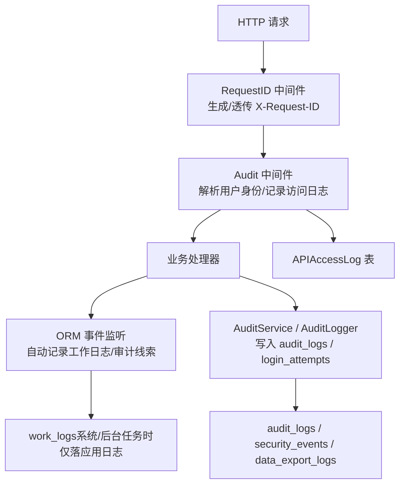
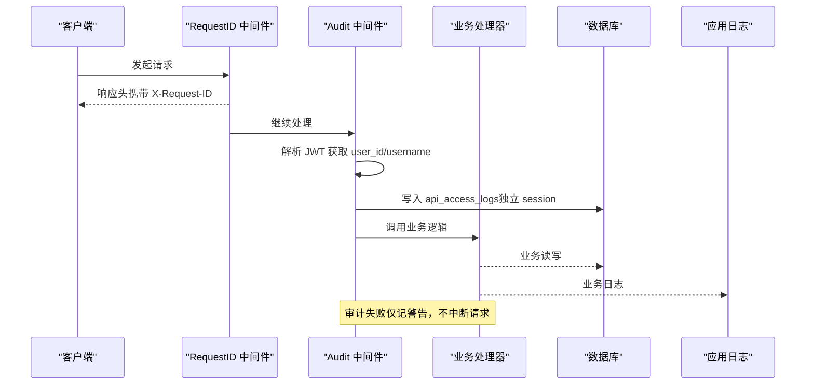
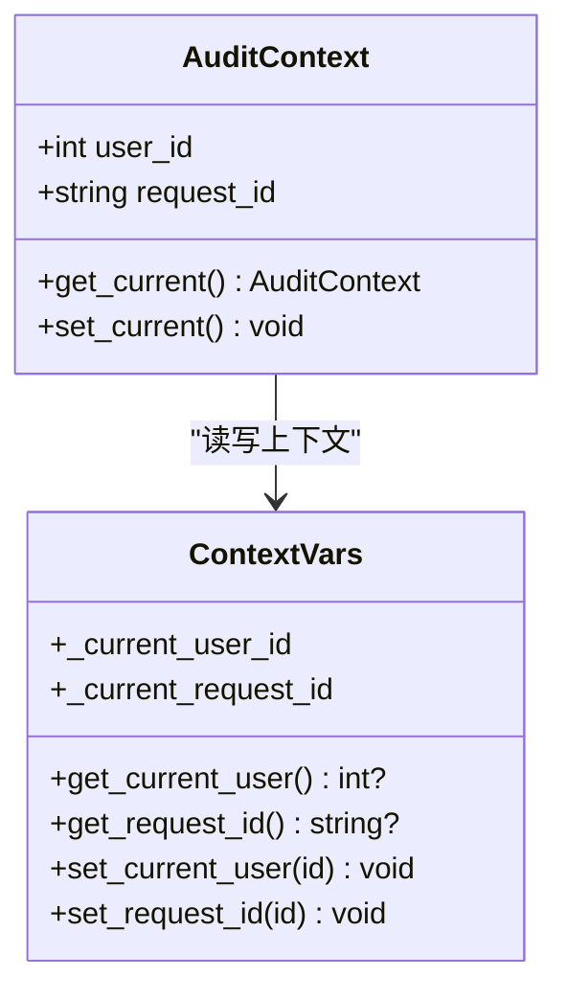
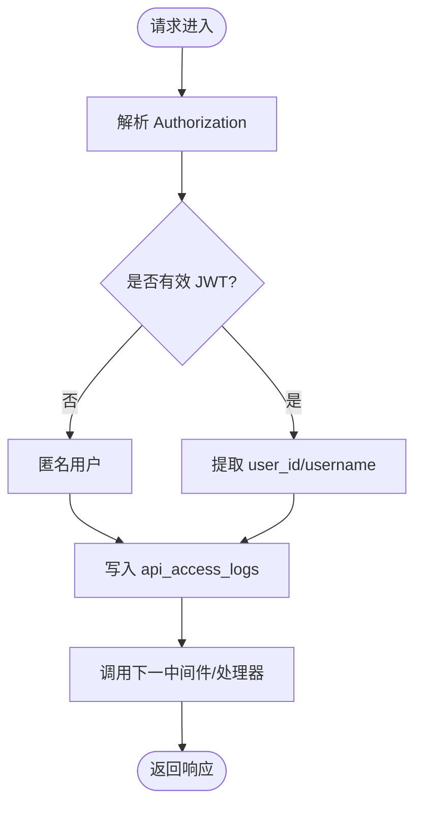
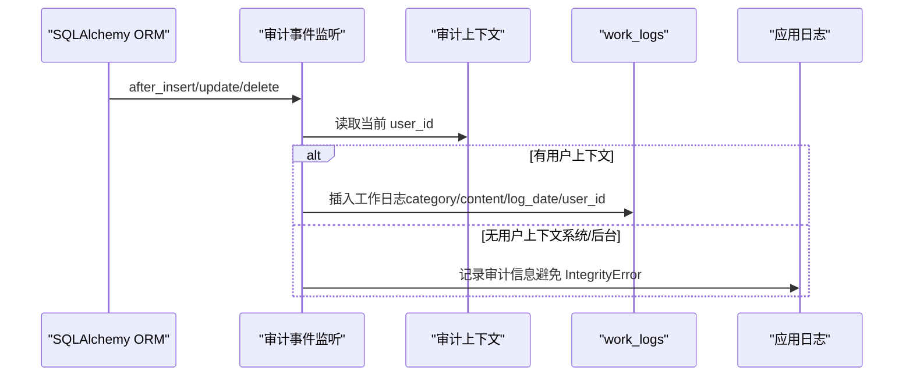
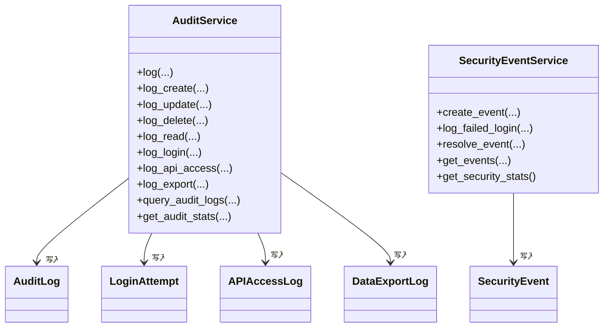
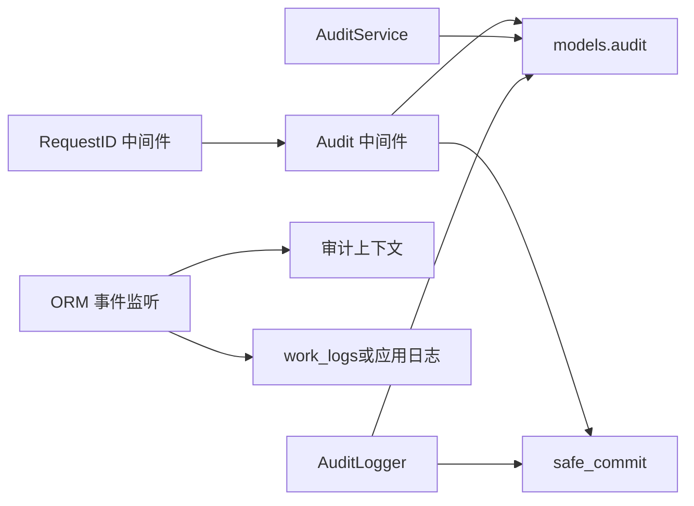

# 审计上下文中间件

<cite>
**本文引用的文件**
- [backend/app/middleware/audit_context.py](file://backend/app/middleware/audit_context.py)
- [backend/app/core/audit_middleware.py](file://backend/app/core/audit_middleware.py)
- [backend/app/models/audit.py](file://backend/app/models/audit.py)
- [backend/app/models/audit_change.py](file://backend/app/models/audit_change.py)
- [backend/app/services/audit_service.py](file://backend/app/services/audit_service.py)
- [backend/app/services/audit_event_handler.py](file://backend/app/services/audit_event_handler.py)
- [backend/app/utils/audit_logger.py](file://backend/app/utils/audit_logger.py)
- [backend/app/api/v1/system/audit.py](file://backend/app/api/v1/system/audit.py)
- [backend/app/core/transaction.py](file://backend/app/core/transaction.py)
- [backend/app/middleware/request_id.py](file://backend/app/middleware/request_id.py)
</cite>

## 目录
1. [简介](#简介)
2. [项目结构](#项目结构)
3. [核心组件](#核心组件)
4. [架构总览](#架构总览)
5. [详细组件分析](#详细组件分析)
6. [依赖关系分析](#依赖关系分析)
7. [性能与可靠性](#性能与可靠性)
8. [故障排查指南](#故障排查指南)
9. [结论](#结论)
10. [附录：查询与分析方法](#附录：查询与分析方法)

## 简介
本技术文档围绕“审计上下文中间件”展开，系统阐述审计上下文的创建与管理机制（用户会话跟踪、操作上下文传递、数据变更追踪），明确审计数据的采集范围（操作类型、对象、结果、时间戳等）、存储策略与查询接口，并说明审计与业务逻辑的解耦设计。同时提供面向管理员的安全审计与合规检查的数据分析方法与工具建议。

## 项目结构
审计能力由多层协作构成：
- 请求级上下文：通过 ContextVar 在异步安全地传递当前用户ID与请求ID
- HTTP 中间件：自动记录访问日志与耗时，独立落库不影响业务事务
- ORM 事件监听：对关键模型写操作自动产生审计轨迹
- 服务层：统一的审计写入、查询与统计
- API 层：面向管理端的审计查询、导出、清理与安全事件管理
- 工具层：统一审计日志输出到日志系统与数据库

**图表来源**
- [backend/app/middleware/request_id.py:35-128](file://backend/app/middleware/request_id.py#L35-L128)
- [backend/app/core/audit_middleware.py:18-109](file://backend/app/core/audit_middleware.py#L18-L109)
- [backend/app/services/audit_event_handler.py:84-176](file://backend/app/services/audit_event_handler.py#L84-L176)
- [backend/app/services/audit_service.py:58-376](file://backend/app/services/audit_service.py#L58-L376)
- [backend/app/utils/audit_logger.py:60-185](file://backend/app/utils/audit_logger.py#L60-L185)
- [backend/app/models/audit.py:53-205](file://backend/app/models/audit.py#L53-L205)

**章节来源**
- [backend/app/middleware/audit_context.py:1-58](file://backend/app/middleware/audit_context.py#L1-L58)
- [backend/app/core/audit_middleware.py:1-109](file://backend/app/core/audit_middleware.py#L1-L109)
- [backend/app/models/audit.py:1-205](file://backend/app/models/audit.py#L1-L205)
- [backend/app/models/audit_change.py:1-33](file://backend/app/models/audit_change.py#L1-L33)
- [backend/app/services/audit_service.py:1-510](file://backend/app/services/audit_service.py#L1-L510)
- [backend/app/services/audit_event_handler.py:1-176](file://backend/app/services/audit_event_handler.py#L1-L176)
- [backend/app/utils/audit_logger.py:1-297](file://backend/app/utils/audit_logger.py#L1-L297)
- [backend/app/api/v1/system/audit.py:1-615](file://backend/app/api/v1/system/audit.py#L1-L615)
- [backend/app/core/transaction.py:200-234](file://backend/app/core/transaction.py#L200-L234)
- [backend/app/middleware/request_id.py:1-128](file://backend/app/middleware/request_id.py#L1-L128)

## 核心组件
- 审计上下文（ContextVar）：跨调用链透明传递 user_id、request_id
- 审计中间件：提取用户身份、记录访问日志、独立事务落库
- ORM 事件监听：基于 SQLAlchemy 事件自动为写操作生成审计线索
- 审计服务：统一写入/查询/统计，支持登录尝试、导出、安全事件
- 审计工具：双写（日志+数据库），敏感操作高亮
- 管理端 API：分页查询、导出、批量删除、安全事件处理

**章节来源**
- [backend/app/middleware/audit_context.py:10-58](file://backend/app/middleware/audit_context.py#L10-L58)
- [backend/app/core/audit_middleware.py:18-109](file://backend/app/core/audit_middleware.py#L18-L109)
- [backend/app/services/audit_event_handler.py:22-176](file://backend/app/services/audit_event_handler.py#L22-L176)
- [backend/app/services/audit_service.py:58-376](file://backend/app/services/audit_service.py#L58-L376)
- [backend/app/utils/audit_logger.py:60-185](file://backend/app/utils/audit_logger.py#L60-L185)
- [backend/app/api/v1/system/audit.py:80-615](file://backend/app/api/v1/system/audit.py#L80-L615)

## 架构总览
下图展示一次典型请求从进入系统到审计落库的全链路：

**图表来源**
- [backend/app/middleware/request_id.py:50-119](file://backend/app/middleware/request_id.py#L50-L119)
- [backend/app/core/audit_middleware.py:18-109](file://backend/app/core/audit_middleware.py#L18-L109)
- [backend/app/models/audit.py:148-176](file://backend/app/models/audit.py#L148-L176)

## 详细组件分析

### 审计上下文（ContextVar）
- 作用：以线程/协程安全的上下文变量保存当前 user_id 与 request_id，供后续组件读取
- 关键点：
  - 使用 ContextVar 避免全局状态污染
  - 提供 get/set 便捷函数，便于认证中间件设置、事件监听器读取
  - 与 RequestID 中间件配合，实现全链路追踪

**图表来源**
- [backend/app/middleware/audit_context.py:10-58](file://backend/app/middleware/audit_context.py#L10-L58)

**章节来源**
- [backend/app/middleware/audit_context.py:10-58](file://backend/app/middleware/audit_context.py#L10-L58)

### 审计中间件（HTTP 访问日志）
- 职责：
  - 记录请求方法、路径、状态码、耗时
  - 从 Authorization 头解析 JWT，提取 user_id/username
  - 将访问日志写入 api_access_logs，使用独立短事务，失败仅告警
- 特性：
  - 与业务事务完全解耦，确保可用性
  - 兼容未认证请求（匿名场景）

**图表来源**
- [backend/app/core/audit_middleware.py:18-109](file://backend/app/core/audit_middleware.py#L18-L109)

**章节来源**
- [backend/app/core/audit_middleware.py:18-109](file://backend/app/core/audit_middleware.py#L18-L109)

### ORM 事件监听（自动审计线索）
- 机制：注册 after_insert/after_update/after_delete 事件，自动为写操作生成审计线索
- 用户归因：优先从审计上下文（ContextVar）读取 user_id；若为空则视为系统/后台任务，仅记录应用日志，避免 work_logs 外键约束冲突
- 实体映射：内置常见实体类型映射，便于资源归类

**图表来源**
- [backend/app/services/audit_event_handler.py:22-176](file://backend/app/services/audit_event_handler.py#L22-L176)

**章节来源**
- [backend/app/services/audit_event_handler.py:22-176](file://backend/app/services/audit_event_handler.py#L22-L176)

### 审计服务（写入/查询/统计）
- 写入：
  - 通用 log() 与专用 log_create/log_update/log_delete/log_read
  - 登录成功/失败记录至 login_attempts，并同步写入 audit_logs
  - 导出记录 DataExportLog，并关联审计动作
- 查询：
  - 支持按用户、动作、资源类型、时间、状态、级别过滤的分页查询
  - 统计：动作分布、状态分布、级别分布、活跃用户、最近活动、今日操作数等
- 安全事件：
  - 记录安全事件（含严重等级、详情、受影响资源）
  - 支持查询、解决事件

**图表来源**
- [backend/app/services/audit_service.py:23-510](file://backend/app/services/audit_service.py#L23-L510)
- [backend/app/models/audit.py:53-205](file://backend/app/models/audit.py#L53-L205)

**章节来源**
- [backend/app/services/audit_service.py:58-376](file://backend/app/services/audit_service.py#L58-L376)
- [backend/app/services/audit_service.py:379-510](file://backend/app/services/audit_service.py#L379-L510)

### 审计工具（双写与敏感操作）
- 双写：同一事件同时写入 Python 日志系统（带 [AUDIT] 标记）与数据库（audit_logs/login_attempts）
- 敏感操作：权限变更、备份恢复等标记为 CRITICAL
- 健壮性：独立 session 持久化，失败回滚并记录错误，不阻断主流程

**章节来源**
- [backend/app/utils/audit_logger.py:60-185](file://backend/app/utils/audit_logger.py#L60-L185)

### 管理端 API（查询/导出/清理/安全事件）
- 审计日志：
  - GET /api/v1/system/audit/logs：分页查询，支持多维度过滤
  - GET /api/v1/system/audit/logs/export：导出 JSON/Excel/CSV
  - DELETE /api/v1/system/audit/logs/batch：批量删除（支持 ids/actions/before_date）
  - PATCH /api/v1/system/audit/logs/{id}/remark：更新备注（存入 metadata）
- 安全事件：
  - GET /api/v1/system/audit/security/events：查询安全事件
  - POST /api/v1/system/audit/security/events/{id}/resolve：解决事件
- 其他：
  - GET /api/v1/system/audit/stats：审计统计
  - GET /api/v1/system/audit/login-attempts：登录尝试
  - GET /api/v1/system/audit/api-access：API 访问日志
  - GET /api/v1/system/audit/exports：导出记录
  - GET /api/v1/system/audit/user-activity/{user_id}：用户活动

**章节来源**
- [backend/app/api/v1/system/audit.py:80-615](file://backend/app/api/v1/system/audit.py#L80-L615)

## 依赖关系分析
- 中间件层：
  - RequestID 中间件负责请求ID注入与慢请求告警
  - Audit 中间件依赖 JWT 配置与数据库会话，独立事务落库
- 服务层：
  - AuditService 依赖 models.audit 中的多个模型
  - AuditEventHanlder 依赖 SQLAlchemy event 与审计上下文
- 工具层：
  - AuditLogger 依赖 transaction.safe_commit 保证提交一致性
- 数据层：
  - 多张审计相关表具备索引优化查询性能

**图表来源**
- [backend/app/middleware/request_id.py:50-119](file://backend/app/middleware/request_id.py#L50-L119)
- [backend/app/core/audit_middleware.py:18-109](file://backend/app/core/audit_middleware.py#L18-L109)
- [backend/app/services/audit_service.py:58-376](file://backend/app/services/audit_service.py#L58-L376)
- [backend/app/services/audit_event_handler.py:84-176](file://backend/app/services/audit_event_handler.py#L84-L176)
- [backend/app/utils/audit_logger.py:60-185](file://backend/app/utils/audit_logger.py#L60-L185)
- [backend/app/core/transaction.py:200-234](file://backend/app/core/transaction.py#L200-L234)
- [backend/app/models/audit.py:53-205](file://backend/app/models/audit.py#L53-L205)

**章节来源**
- [backend/app/models/audit.py:53-205](file://backend/app/models/audit.py#L53-L205)
- [backend/app/core/transaction.py:200-234](file://backend/app/core/transaction.py#L200-L234)

## 性能与可靠性
- 隔离性：审计落库使用独立 session，失败仅记录 WARNING，绝不破坏业务请求
- 幂等与健壮：safe_commit 封装提交异常，必要时回滚并重抛，保证调用方可感知
- 可观测性：RequestID 贯穿日志，便于问题定位；慢请求阈值告警
- 可扩展性：通过 ORM 事件监听覆盖多数写操作，减少侵入式代码
- 查询性能：审计表建立复合索引（如 user_id+created_at、endpoint+created_at）

[本节为通用指导，无需特定文件引用]

## 故障排查指南
- 审计日志未入库：
  - 检查数据库连接与会话生命周期
  - 查看中间件与服务层的 WARNING/ERROR 日志
  - 确认 safe_commit 是否抛出异常并被捕获
- 用户归因为空：
  - 确认认证中间件是否正确设置审计上下文
  - 后台任务/定时任务默认视为系统操作，仅落应用日志
- 批量删除误匹配路由：
  - 静态路由需在动态路由之前注册，避免 “batch” 被解析为整数导致 422
- 登录失败风暴：
  - 关注 login_attempts 与安全事件的频率，结合 IP/用户名维度排查

**章节来源**
- [backend/app/core/audit_middleware.py:80-109](file://backend/app/core/audit_middleware.py#L80-L109)
- [backend/app/utils/audit_logger.py:135-185](file://backend/app/utils/audit_logger.py#L135-L185)
- [backend/app/api/v1/system/audit.py:80-141](file://backend/app/api/v1/system/audit.py#L80-L141)
- [backend/app/services/audit_service.py:411-442](file://backend/app/services/audit_service.py#L411-L442)

## 结论
本方案通过“上下文+中间件+事件监听+服务+API”的分层设计，实现了审计与业务的解耦与透明化。审计数据覆盖访问、操作、登录、导出与安全事件，具备完善的查询、导出与清理能力，满足历史追溯与合规审计需求。借助 RequestID 与双写机制，既保证了可观测性，又提升了鲁棒性。

[本节为总结性内容，无需特定文件引用]

## 附录：查询与分析方法
- 常用查询维度
  - 按用户、动作、资源类型、时间范围、状态、级别筛选
  - 分页与排序：按 created_at 倒序，支持 page/page_size
- 导出与归档
  - 支持 JSON/Excel/CSV 导出，便于离线分析与归档
- 安全事件分析
  - 按 severity/event_type/resolved 筛选，支持解决与备注
- 建议的分析指标
  - 今日操作数、活跃用户数、失败操作数、警告数
  - 登录失败次数与来源 IP 分布
  - 高频访问端点与慢请求占比

[本节为通用指导，无需特定文件引用]