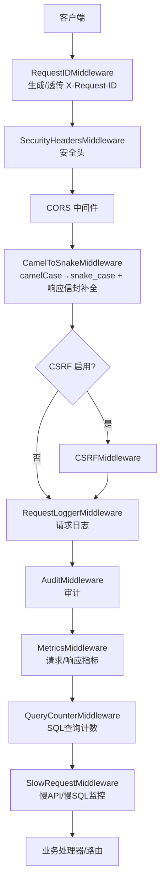
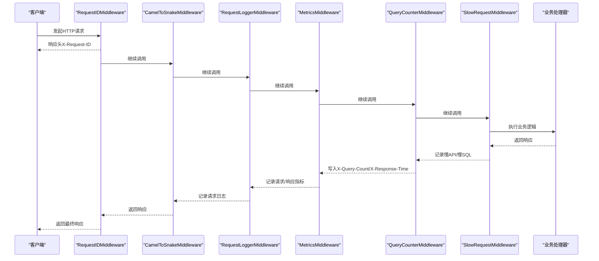
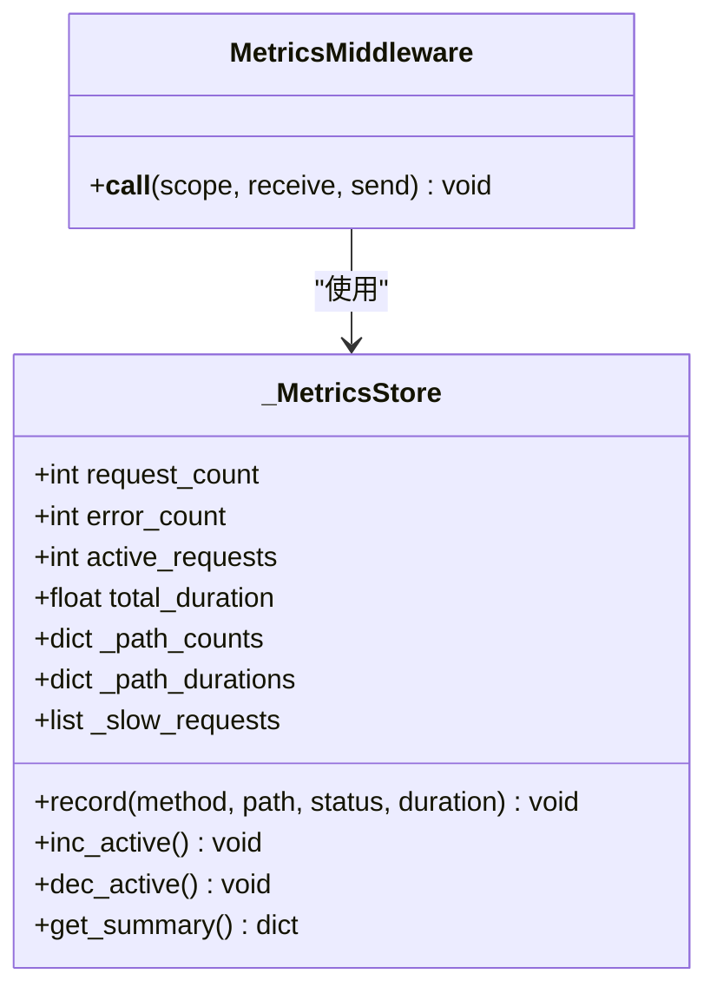
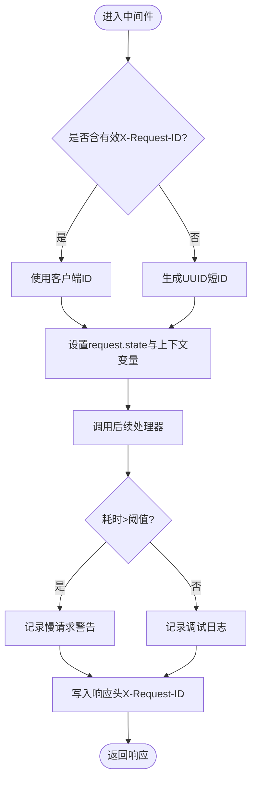
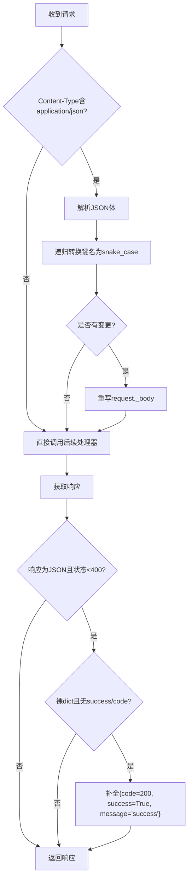
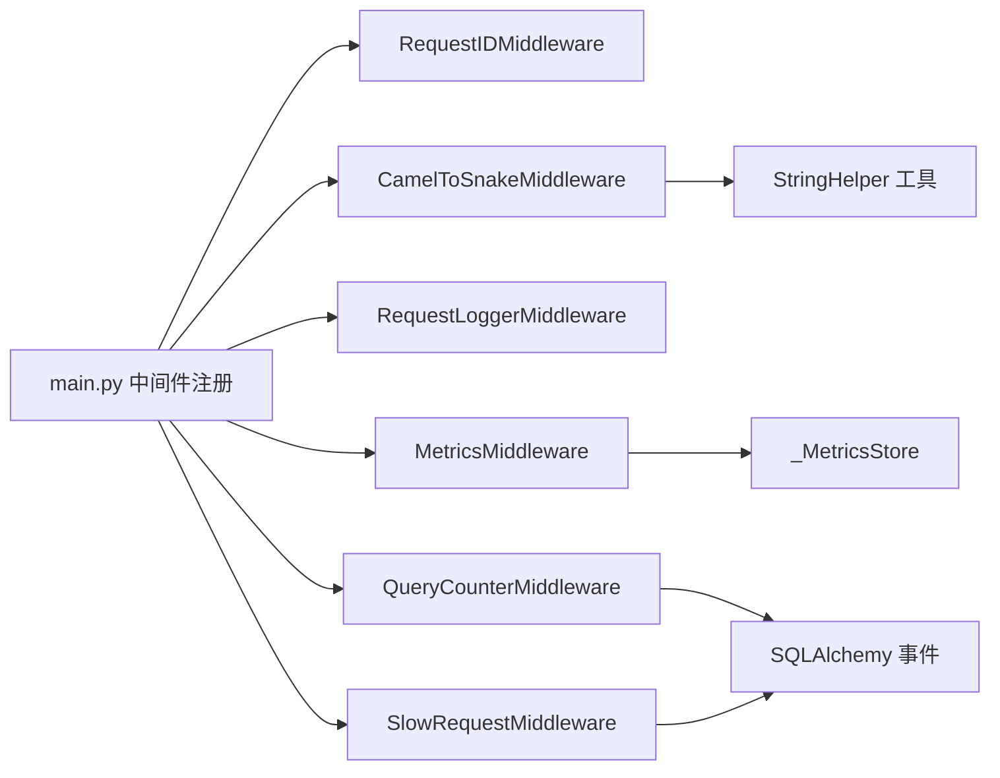

# 性能优化中间件

<cite>
**本文引用的文件**
- [backend/app/main.py](file://backend/app/main.py)
- [backend/app/middleware/metrics_middleware.py](file://backend/app/middleware/metrics_middleware.py)
- [backend/app/middleware/request_id.py](file://backend/app/middleware/request_id.py)
- [backend/app/middleware/camel_to_snake.py](file://backend/app/middleware/camel_to_snake.py)
- [backend/app/middleware/cache_headers.py](file://backend/app/middleware/cache_headers.py)
- [backend/app/middleware/query_counter.py](file://backend/app/middleware/query_counter.py)
- [backend/app/middleware/slow_request_monitor.py](file://backend/app/middleware/slow_request_monitor.py)
- [backend/app/middleware/request_logger.py](file://backend/app/middleware/request_logger.py)
- [backend/app/services/business_metrics_service.py](file://backend/app/services/business_metrics_service.py)
</cite>

## 目录
1. [简介](#简介)
2. [项目结构](#项目结构)
3. [核心组件](#核心组件)
4. [架构总览](#架构总览)
5. [详细组件分析](#详细组件分析)
6. [依赖关系分析](#依赖关系分析)
7. [性能考量](#性能考量)
8. [故障排查指南](#故障排查指南)
9. [结论](#结论)
10. [附录](#附录)

## 简介
本技术文档聚焦于后端性能优化中间件体系，覆盖以下关键能力：
- 指标采集与上报：请求级指标、响应级指标、慢请求/慢SQL监控、活跃请求数、错误率等。
- 请求ID生成与链路追踪：支持客户端透传、上下文传递、日志注入，便于分布式链路追踪与问题定位。
- 数据格式转换：自动将前端 camelCase JSON 键转换为后端 snake_case，并对裸 dict 响应补全统一信封（success/code/message），提升前后端协作效率。
- 缓存头部策略：为静态资源与低变化接口添加 Cache-Control，优化浏览器与CDN缓存效果。
- 业务指标：资金审批、资金使用、数据上报、用户活跃度、系统错误率等，并支持 Prometheus 导出格式。
- 最佳实践：关键性能指标监控与告警配置建议。

## 项目结构
应用通过 FastAPI 启动，按特定顺序注册多个中间件，形成“请求进入→处理→响应返回”的完整链路。中间件执行顺序（从外到内）如下：
- RequestID → SecurityHeaders → CORS → CamelToSnake → CSRF(可选) → RequestLogger → Audit → Metrics → QueryCounter → SlowRequestMonitor

图表来源
- [backend/app/main.py:113-165](file://backend/app/main.py#L113-L165)

章节来源
- [backend/app/main.py:113-165](file://backend/app/main.py#L113-L165)

## 核心组件
- 指标采集中间件：统计请求计数、错误率、平均耗时、活跃请求、Top 端点、慢请求列表。
- 请求ID中间件：生成或接受客户端传入的请求ID，注入响应头与日志上下文。
- 驼峰转蛇形中间件：请求体键名转换；响应体对裸 dict 补全 success/code/message。
- 缓存头中间件：为指定路径添加 Cache-Control，减少重复请求。
- SQL 查询计数中间件：统计每个请求的 SQL 次数，输出响应头与阈值告警。
- 慢请求监控中间件：记录慢 API 与慢 SQL，提供最近 N 条记录与统计摘要。
- 请求日志中间件：记录方法、路径、参数、IP、UA、状态码、耗时。
- 业务指标服务：聚合多维度业务指标，支持 Prometheus 格式导出。

章节来源
- [backend/app/middleware/metrics_middleware.py:1-177](file://backend/app/middleware/metrics_middleware.py#L1-L177)
- [backend/app/middleware/request_id.py:1-128](file://backend/app/middleware/request_id.py#L1-L128)
- [backend/app/middleware/camel_to_snake.py:1-106](file://backend/app/middleware/camel_to_snake.py#L1-L106)
- [backend/app/middleware/cache_headers.py:1-31](file://backend/app/middleware/cache_headers.py#L1-L31)
- [backend/app/middleware/query_counter.py:1-88](file://backend/app/middleware/query_counter.py#L1-L88)
- [backend/app/middleware/slow_request_monitor.py:1-132](file://backend/app/middleware/slow_request_monitor.py#L1-L132)
- [backend/app/middleware/request_logger.py:1-114](file://backend/app/middleware/request_logger.py#L1-L114)
- [backend/app/services/business_metrics_service.py:1-376](file://backend/app/services/business_metrics_service.py#L1-L376)

## 架构总览
下图展示了请求在中间件链中的流转过程，以及各中间件的关键职责与产出。

图表来源
- [backend/app/middleware/request_id.py:50-119](file://backend/app/middleware/request_id.py#L50-L119)
- [backend/app/middleware/camel_to_snake.py:66-105](file://backend/app/middleware/camel_to_snake.py#L66-L105)
- [backend/app/middleware/request_logger.py:62-113](file://backend/app/middleware/request_logger.py#L62-L113)
- [backend/app/middleware/metrics_middleware.py:142-177](file://backend/app/middleware/metrics_middleware.py#L142-L177)
- [backend/app/middleware/query_counter.py:47-77](file://backend/app/middleware/query_counter.py#L47-L77)
- [backend/app/middleware/slow_request_monitor.py:103-131](file://backend/app/middleware/slow_request_monitor.py#L103-L131)

## 详细组件分析

### 指标采集中间件（MetricsMiddleware）
- 功能要点
  - 统计请求总数、错误数、错误率、平均耗时、活跃请求数、每秒请求数。
  - 按方法+状态码维度统计请求量。
  - 按方法+路径维度统计总耗时、次数、最大耗时，并输出 Top 10 端点。
  - 记录慢请求（默认阈值1秒），保留最近100条。
  - 跳过健康检查、指标端点、favicon 等路径。
- 数据结构与复杂度
  - 使用线程锁保护计数器与字典，避免并发写冲突。
  - 时间复杂度：每次请求 O(1) 更新；汇总时按端点排序取前10，近似 O(k log k)，k≤端点数。
- 依赖与集成
  - 全局单例存储 metrics_store，供外部查询。
  - 与慢请求监控、请求日志配合，形成多维观测。

图表来源
- [backend/app/middleware/metrics_middleware.py:26-129](file://backend/app/middleware/metrics_middleware.py#L26-L129)
- [backend/app/middleware/metrics_middleware.py:132-177](file://backend/app/middleware/metrics_middleware.py#L132-L177)

章节来源
- [backend/app/middleware/metrics_middleware.py:1-177](file://backend/app/middleware/metrics_middleware.py#L1-L177)

### 请求ID与链路追踪（RequestIDMiddleware）
- 功能要点
  - 优先使用客户端传入的 X-Request-ID（需符合正则校验），否则生成唯一ID。
  - 将 request_id 存入 request.state 与异步上下文变量，供日志模块注入。
  - 在响应头中回显 X-Request-ID。
  - 记录慢请求（默认2秒阈值）与异常日志，包含耗时与状态码。
- 分布式追踪
  - 客户端可透传请求ID，便于跨服务链路关联。
  - 结合日志过滤器，所有日志自动携带 request_id。

图表来源
- [backend/app/middleware/request_id.py:50-119](file://backend/app/middleware/request_id.py#L50-L119)

章节来源
- [backend/app/middleware/request_id.py:1-128](file://backend/app/middleware/request_id.py#L1-L128)

### 数据格式转换中间件（CamelToSnakeMiddleware）
- 功能要点
  - 请求体：递归将 JSON 键名从 camelCase 转为 snake_case，仅当存在变更时才重写 body。
  - 响应体：对裸 dict 响应补全 success/code/message 元数据，保持原有数据层级不变；已含 success 或 code 的响应不修改；非 JSON、流式/文件响应跳过。
- 性能考虑
  - 仅在 content-type 为 application/json 且 body 非空时解析。
  - 转换失败（JSON 解码错误）则忽略，保证健壮性。

图表来源
- [backend/app/middleware/camel_to_snake.py:66-105](file://backend/app/middleware/camel_to_snake.py#L66-L105)

章节来源
- [backend/app/middleware/camel_to_snake.py:1-106](file://backend/app/middleware/camel_to_snake.py#L1-L106)

### 缓存头部中间件（CacheHeadersMiddleware）
- 功能要点
  - 为匹配的路径前缀添加 Cache-Control 头，减少重复请求与数据库压力。
  - 典型规则：筛选选项/字典数据缓存5分钟；静态资源缓存1小时并标记 immutable。
- 适用场景
  - 前端与CDN可依据该头进行缓存，降低带宽与后端负载。

章节来源
- [backend/app/middleware/cache_headers.py:1-31](file://backend/app/middleware/cache_headers.py#L1-L31)

### SQL 查询计数中间件（QueryCounterMiddleware）
- 功能要点
  - 通过 SQLAlchemy after_cursor_execute 事件递增当前请求的查询计数。
  - 将查询计数写入响应头 X-Query-Count，同时输出 X-Response-Time。
  - 超过阈值（默认50）记录警告日志，辅助发现 N+1 问题。
- 上下文桥接
  - 使用 contextvar 在 SQLAlchemy 事件中累积计数，并在请求结束时合并至 request.state。

章节来源
- [backend/app/middleware/query_counter.py:1-88](file://backend/app/middleware/query_counter.py#L1-L88)

### 慢请求监控中间件（SlowRequestMiddleware）
- 功能要点
  - 记录慢 API（默认阈值500ms）与慢 SQL（默认阈值200ms）。
  - 维护环形缓冲区保存最近 N 条记录，并提供统计摘要（平均值、峰值等）。
  - 通过 SQLAlchemy before/after 事件捕获慢 SQL，附带语句片段与参数。
- 使用方式
  - 在 main.py 中注册中间件，可按需调整阈值。

章节来源
- [backend/app/middleware/slow_request_monitor.py:1-132](file://backend/app/middleware/slow_request_monitor.py#L1-L132)

### 请求日志中间件（RequestLoggerMiddleware）
- 功能要点
  - 记录请求方法、路径、查询参数、客户端 IP、User-Agent、状态码、耗时。
  - 跳过健康检查、指标端点、静态资源等路径，减少噪音。
  - 异常路径记录错误堆栈，便于快速定位问题。

章节来源
- [backend/app/middleware/request_logger.py:1-114](file://backend/app/middleware/request_logger.py#L1-L114)

### 业务指标服务（BusinessMetricsService）
- 功能要点
  - 聚合多维度业务指标：资金审批成功率、待审批数量、平均审批时间；资金使用分布与拨付率；数据上报完成率与及时率；用户活跃度；系统错误率。
  - 内置内存缓存（TTL 60s），降低数据库压力。
  - 支持导出为 Prometheus 格式，便于接入监控系统。
- 数据源
  - 基于 ORM 模型（ApprovalTask、Fund、DataReport、User、APIMetric）进行统计。

章节来源
- [backend/app/services/business_metrics_service.py:1-376](file://backend/app/services/business_metrics_service.py#L1-L376)

## 依赖关系分析
- 中间件注册顺序由 main.py 控制，决定了请求处理的先后与数据可见性。
- MetricsMiddleware 依赖全局 _MetricsStore，提供线程安全的指标收集。
- RequestIDMiddleware 依赖 ContextVar 实现异步上下文传递，确保日志中正确注入 request_id。
- QueryCounterMiddleware 依赖 SQLAlchemy 事件钩子，与 slow_request_monitor 共享事件机制但关注点不同。
- CamelToSnakeMiddleware 依赖字符串工具进行键名转换，并对响应体进行最小化补丁。
- CacheHeadersMiddleware 通过路径前缀匹配添加缓存头，与静态资源服务协同优化缓存命中。

图表来源
- [backend/app/main.py:113-165](file://backend/app/main.py#L113-L165)
- [backend/app/middleware/metrics_middleware.py:26-129](file://backend/app/middleware/metrics_middleware.py#L26-L129)
- [backend/app/middleware/query_counter.py:30-58](file://backend/app/middleware/query_counter.py#L30-L58)
- [backend/app/middleware/slow_request_monitor.py:70-101](file://backend/app/middleware/slow_request_monitor.py#L70-L101)
- [backend/app/middleware/camel_to_snake.py:21-41](file://backend/app/middleware/camel_to_snake.py#L21-L41)

章节来源
- [backend/app/main.py:113-165](file://backend/app/main.py#L113-L165)

## 性能考量
- 指标采集开销
  - 使用线程锁保护计数器，避免并发竞争；统计聚合在 get_summary 时计算，降低请求路径负担。
  - 慢请求记录限制长度，防止内存无限增长。
- 请求ID与日志
  - 仅在必要时解析/生成 ID；日志级别区分 DEBUG/WARNING，避免生产环境过度日志。
- 数据转换
  - 仅在 JSON 内容类型下解析；转换失败静默忽略，保障稳定性。
- 缓存策略
  - 静态资源使用 immutable 与长期 max-age，显著减少重复下载。
  - 低变化接口缓存 5 分钟，平衡新鲜度与性能。
- SQL 监控
  - 通过事件钩子统计查询次数，识别 N+1 问题；阈值告警帮助优化热点接口。
- 慢请求监控
  - 环形缓冲区限制记录数量；提供统计摘要用于趋势分析。

[本节为通用性能指导，不直接分析具体代码]

## 故障排查指南
- 慢请求与慢SQL
  - 查看慢请求记录与慢SQL记录，定位耗时瓶颈；结合 X-Query-Count 与 X-Response-Time 判断是否为数据库查询过多导致。
- 请求链路追踪
  - 通过 X-Request-ID 关联日志，快速定位问题请求；确认客户端是否正确透传该头。
- 缓存未生效
  - 检查响应头 Cache-Control 是否被正确设置；确认 CDN/浏览器缓存策略是否允许缓存。
- 指标缺失
  - 确认中间件注册顺序与路径过滤规则；检查 /health 与 /metrics 等路径是否被跳过。
- 业务指标异常
  - 检查数据库连接与模型字段；确认缓存 TTL 与数据一致性；验证 Prometheus 导出格式是否符合预期。

章节来源
- [backend/app/middleware/slow_request_monitor.py:32-52](file://backend/app/middleware/slow_request_monitor.py#L32-L52)
- [backend/app/middleware/query_counter.py:61-77](file://backend/app/middleware/query_counter.py#L61-L77)
- [backend/app/middleware/request_id.py:50-119](file://backend/app/middleware/request_id.py#L50-L119)
- [backend/app/middleware/cache_headers.py:20-30](file://backend/app/middleware/cache_headers.py#L20-L30)
- [backend/app/services/business_metrics_service.py:297-371](file://backend/app/services/business_metrics_service.py#L297-L371)

## 结论
本中间件体系围绕“可观测、可追踪、可优化”的目标构建：
- 指标采集与慢请求监控提供实时性能视图，帮助快速定位瓶颈。
- 请求ID贯穿全链路，结合日志注入实现端到端追踪。
- 数据格式转换与缓存头部策略提升前后端协作效率与缓存命中率。
- 业务指标服务聚合关键业务KPI，支持 Prometheus 导出，便于纳入统一监控平台。
建议在生产环境合理配置阈值与缓存策略，并结合日志与指标进行持续优化。

[本节为总结性内容，不直接分析具体代码]

## 附录
- 关键中间件注册位置与顺序参考：
  - [backend/app/main.py:113-165](file://backend/app/main.py#L113-L165)
- 指标与监控相关中间件：
  - [backend/app/middleware/metrics_middleware.py:1-177](file://backend/app/middleware/metrics_middleware.py#L1-L177)
  - [backend/app/middleware/slow_request_monitor.py:1-132](file://backend/app/middleware/slow_request_monitor.py#L1-L132)
  - [backend/app/middleware/query_counter.py:1-88](file://backend/app/middleware/query_counter.py#L1-L88)
- 链路追踪与日志：
  - [backend/app/middleware/request_id.py:1-128](file://backend/app/middleware/request_id.py#L1-L128)
  - [backend/app/middleware/request_logger.py:1-114](file://backend/app/middleware/request_logger.py#L1-L114)
- 数据格式与缓存：
  - [backend/app/middleware/camel_to_snake.py:1-106](file://backend/app/middleware/camel_to_snake.py#L1-L106)
  - [backend/app/middleware/cache_headers.py:1-31](file://backend/app/middleware/cache_headers.py#L1-L31)
- 业务指标：
  - [backend/app/services/business_metrics_service.py:1-376](file://backend/app/services/business_metrics_service.py#L1-L376)