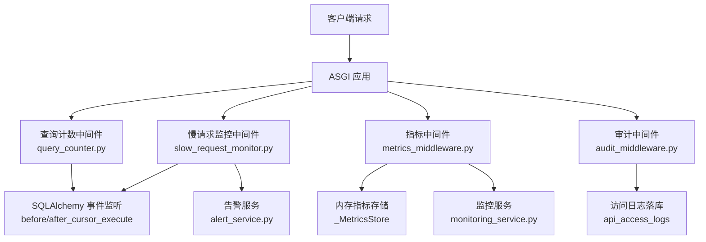
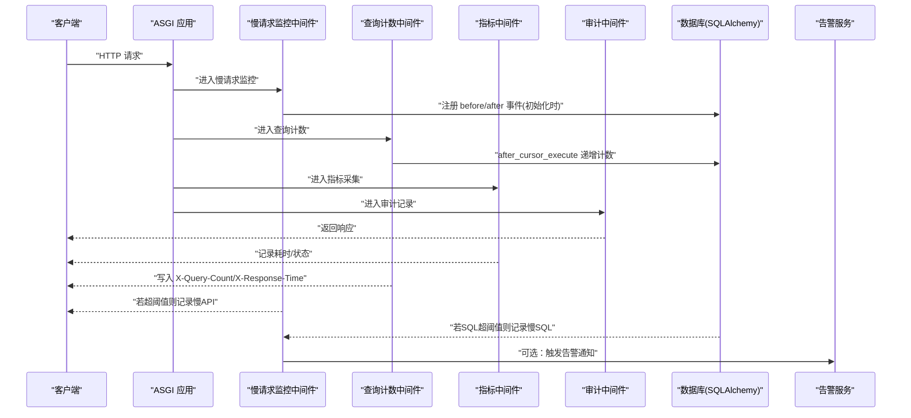
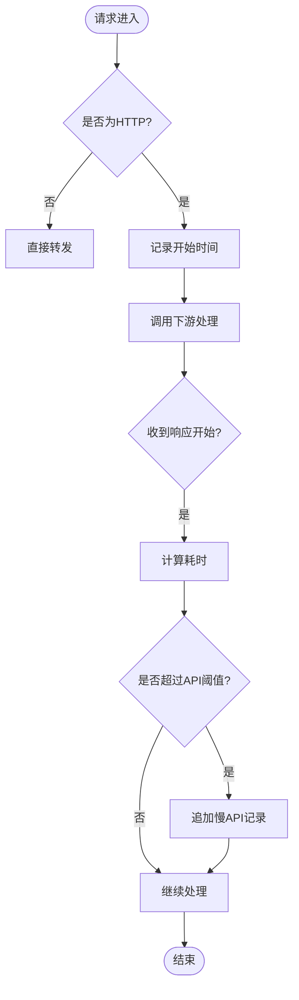
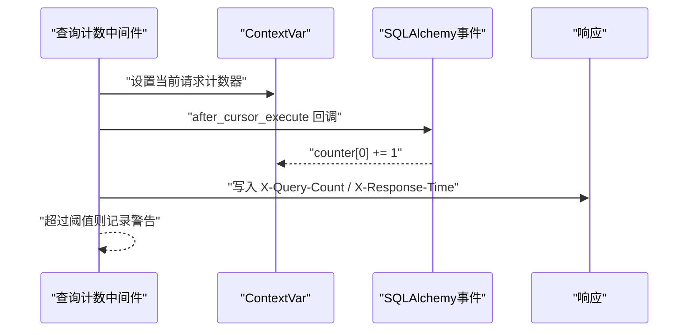
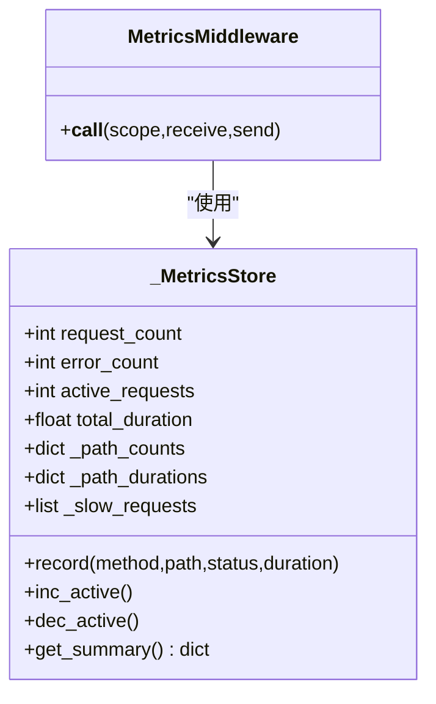
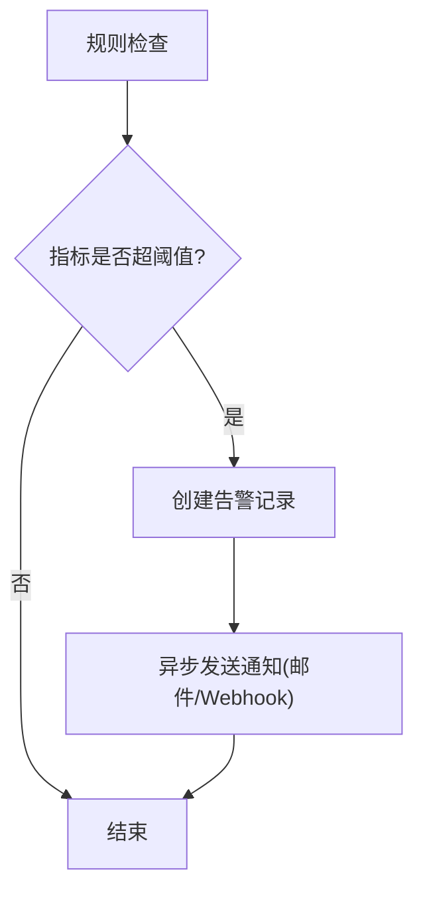
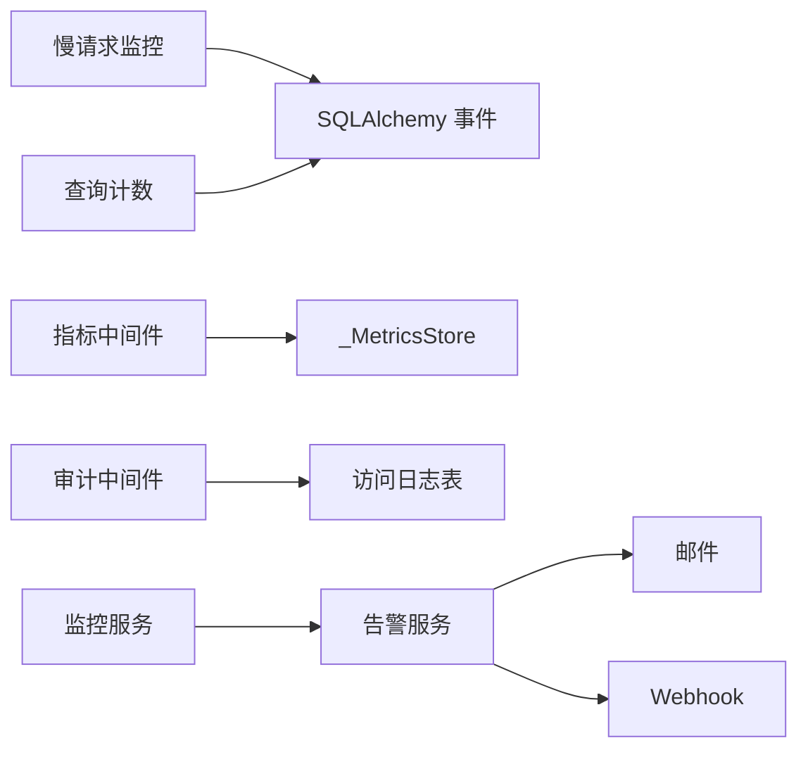

# 慢请求监控中间件

<cite>
**本文引用的文件**
- [slow_request_monitor.py](file://backend/app/middleware/slow_request_monitor.py)
- [query_counter.py](file://backend/app/middleware/query_counter.py)
- [metrics_middleware.py](file://backend/app/middleware/metrics_middleware.py)
- [audit_middleware.py](file://backend/app/core/audit_middleware.py)
- [alert_service.py](file://backend/app/services/alert_service.py)
- [monitoring_service.py](file://backend/app/services/monitoring_service.py)
</cite>

## 目录
1. [简介](#简介)
2. [项目结构](#项目结构)
3. [核心组件](#核心组件)
4. [架构总览](#架构总览)
5. [详细组件分析](#详细组件分析)
6. [依赖关系分析](#依赖关系分析)
7. [性能考量](#性能考量)
8. [故障排查指南](#故障排查指南)
9. [结论](#结论)
10. [附录](#附录)

## 简介
本技术文档围绕“慢请求监控中间件”展开，系统阐述以下能力：
- 慢请求检测机制与阈值配置（API 与 SQL）
- 请求处理时间的统计与分析方法
- 慢请求识别标准、告警触发条件与通知机制
- 数据库查询计数器的实现原理（SQL 追踪、N+1 问题识别）
- 慢请求根因分析方法（调用栈、依赖服务、SQL 瓶颈）
- 性能优化建议与最佳实践

该方案以中间件为核心，结合指标采集、审计日志与告警服务，形成从“发现—定位—告警—治理”的闭环。

## 项目结构
与慢请求监控相关的代码主要位于后端中间件与服务层：
- 中间件层
  - 慢请求监控：记录超过阈值的 API 与 SQL
  - 查询计数器：统计每个请求的 SQL 数量并输出响应头
  - 指标中间件：收集 HTTP 请求级指标（耗时、错误率、活跃数等）
  - 审计中间件：记录访问日志（含耗时、用户身份）
- 服务层
  - 告警服务：邮件与 Webhook 通知
  - 监控服务：规则检查、历史告警、资源与端点统计

图表来源
- [slow_request_monitor.py:55-132](file://backend/app/middleware/slow_request_monitor.py#L55-L132)
- [query_counter.py:39-77](file://backend/app/middleware/query_counter.py#L39-L77)
- [metrics_middleware.py:132-177](file://backend/app/middleware/metrics_middleware.py#L132-L177)
- [audit_middleware.py:11-44](file://backend/app/core/audit_middleware.py#L11-L44)
- [alert_service.py:20-111](file://backend/app/services/alert_service.py#L20-L111)
- [monitoring_service.py:26-312](file://backend/app/services/monitoring_service.py#L26-L312)

章节来源
- [slow_request_monitor.py:1-132](file://backend/app/middleware/slow_request_monitor.py#L1-L132)
- [query_counter.py:1-88](file://backend/app/middleware/query_counter.py#L1-L88)
- [metrics_middleware.py:1-177](file://backend/app/middleware/metrics_middleware.py#L1-L177)
- [audit_middleware.py:1-109](file://backend/app/core/audit_middleware.py#L1-L109)
- [alert_service.py:1-111](file://backend/app/services/alert_service.py#L1-L111)
- [monitoring_service.py:1-312](file://backend/app/services/monitoring_service.py#L1-L312)

## 核心组件
- 慢请求监控中间件
  - 基于 ASGI 拦截 HTTP 响应开始阶段，计算耗时并判断是否超过 API 阈值
  - 通过 SQLAlchemy 事件钩子捕获慢 SQL，记录 SQL、参数与耗时
  - 维护环形缓冲区保存最近 N 条慢记录，并提供统计摘要接口
- 查询计数中间件
  - 使用 contextvar 将当前请求上下文与 SQLAlchemy 事件桥接，累计 SQL 次数
  - 在响应头中注入 X-Query-Count 与 X-Response-Time，便于前端或网关观测
  - 超过阈值时输出警告日志，辅助识别 N+1 问题
- 指标中间件
  - 线程安全地聚合请求计数、错误率、平均耗时、慢请求列表等
  - 提供按路径维度的耗时统计与 Top 端点
- 审计中间件
  - 记录每次请求的方法、路径、状态码、耗时与用户身份
  - 独立短事务落库，失败不阻塞业务
- 告警服务与监控服务
  - 支持邮件与 Webhook 通知
  - 基于规则对响应时间、错误率、资源使用率进行周期性检查并触发告警

章节来源
- [slow_request_monitor.py:19-52](file://backend/app/middleware/slow_request_monitor.py#L19-L52)
- [query_counter.py:21-77](file://backend/app/middleware/query_counter.py#L21-L77)
- [metrics_middleware.py:26-125](file://backend/app/middleware/metrics_middleware.py#L26-L125)
- [audit_middleware.py:11-44](file://backend/app/core/audit_middleware.py#L11-L44)
- [alert_service.py:20-111](file://backend/app/services/alert_service.py#L20-L111)
- [monitoring_service.py:183-312](file://backend/app/services/monitoring_service.py#L183-L312)

## 架构总览
下图展示了从请求进入、中间件链路、SQL 事件到告警触发的完整流程。

图表来源
- [slow_request_monitor.py:55-132](file://backend/app/middleware/slow_request_monitor.py#L55-L132)
- [query_counter.py:39-77](file://backend/app/middleware/query_counter.py#L39-L77)
- [metrics_middleware.py:132-177](file://backend/app/middleware/metrics_middleware.py#L132-L177)
- [audit_middleware.py:11-44](file://backend/app/core/audit_middleware.py#L11-L44)
- [alert_service.py:20-111](file://backend/app/services/alert_service.py#L20-L111)

## 详细组件分析

### 慢请求监控中间件（API 与 SQL）
- 检测机制
  - API 耗时：在 ASGI 响应开始阶段计算 elapsed_ms，超过 slow_api_ms 即记为慢请求
  - SQL 耗时：通过 before_cursor_execute 记录开始时间，after_cursor_execute 计算耗时，超过 slow_sql_ms 记为慢 SQL
- 数据存储
  - 使用固定长度的双端队列缓存最近 N 条慢记录（默认 200），避免内存无限增长
  - 提供获取最近记录与统计摘要的接口（如近 50 条平均值、峰值）
- 可观测性
  - 记录 method/path/status/elapsed_ms（API）与 sql/params/elapsed_ms（SQL）
  - 输出警告日志，便于集中式日志平台检索
- 配置项
  - slow_api_ms：API 慢请求阈值（毫秒）
  - slow_sql_ms：SQL 慢请求阈值（毫秒）

图表来源
- [slow_request_monitor.py:103-132](file://backend/app/middleware/slow_request_monitor.py#L103-L132)

章节来源
- [slow_request_monitor.py:19-52](file://backend/app/middleware/slow_request_monitor.py#L19-L52)
- [slow_request_monitor.py:55-132](file://backend/app/middleware/slow_request_monitor.py#L55-L132)

### 数据库查询计数器（SQL 追踪与 N+1 识别）
- 实现原理
  - 使用 contextvar 在当前请求上下文中维护一个可变计数器列表
  - 通过 SQLAlchemy after_cursor_execute 事件递增计数器，兼容旧接口
  - 中间件结束时合并显式计数与事件计数，写回 request.state
- 输出与告警
  - 在响应头中注入 X-Query-Count 与 X-Response-Time
  - 当查询数超过阈值（默认 50）时输出警告日志，提示可能存在 N+1 问题
- 适用场景
  - 批量导出、复杂报表、多表关联查询等易产生 N+1 的场景

图表来源
- [query_counter.py:21-77](file://backend/app/middleware/query_counter.py#L21-L77)

章节来源
- [query_counter.py:21-77](file://backend/app/middleware/query_counter.py#L21-L77)

### 指标中间件（请求级指标聚合）
- 功能要点
  - 记录请求总数、错误数、活跃请求数、总耗时
  - 按 (method, path) 维度统计总耗时、次数、最大耗时，并输出 Top 端点
  - 维护慢请求列表（默认保留 100 条，阈值 1 秒）
- 线程安全
  - 使用锁保护共享状态，保证并发安全
- 跳过路径
  - 健康检查、指标自身、静态资源等路径不参与采集

图表来源
- [metrics_middleware.py:26-125](file://backend/app/middleware/metrics_middleware.py#L26-L125)
- [metrics_middleware.py:132-177](file://backend/app/middleware/metrics_middleware.py#L132-L177)

章节来源
- [metrics_middleware.py:26-125](file://backend/app/middleware/metrics_middleware.py#L26-L125)
- [metrics_middleware.py:132-177](file://backend/app/middleware/metrics_middleware.py#L132-L177)

### 审计中间件（访问日志）
- 功能要点
  - 记录方法、路径、状态码、耗时与用户身份（从 JWT 解析）
  - 使用独立短会话落库到 api_access_logs，失败仅记录警告，不影响主流程
- 价值
  - 用于事后回溯与合规审计，配合慢请求数据快速定位问题

章节来源
- [audit_middleware.py:11-44](file://backend/app/core/audit_middleware.py#L11-L44)
- [audit_middleware.py:46-109](file://backend/app/core/audit_middleware.py#L46-L109)

### 告警服务与监控服务（规则与通知）
- 告警服务
  - 支持邮件与 Webhook（通用、钉钉、企业微信）两种通知方式
  - 发送失败记录错误日志，不中断主流程
- 监控服务
  - 提供 API 性能统计、端点统计、错误统计、资源使用统计
  - 基于规则（响应时间、错误率、资源）周期检查并触发告警
  - 告警通知异步发送，避免阻塞主流程

图表来源
- [monitoring_service.py:183-312](file://backend/app/services/monitoring_service.py#L183-L312)
- [alert_service.py:20-111](file://backend/app/services/alert_service.py#L20-L111)

章节来源
- [monitoring_service.py:183-312](file://backend/app/services/monitoring_service.py#L183-L312)
- [alert_service.py:20-111](file://backend/app/services/alert_service.py#L20-L111)

## 依赖关系分析
- 中间件之间松耦合，职责清晰：
  - 慢请求监控关注“超时”，查询计数关注“SQL 数量”，指标中间件关注“整体吞吐与耗时”，审计中间件关注“访问轨迹”
- 外部依赖
  - SQLAlchemy 事件：before_cursor_execute、after_cursor_execute
  - 配置中心：settings（SMTP、Webhook 等）
  - 第三方库：httpx（Webhook）、psutil（资源统计）
- 潜在循环依赖
  - 各模块通过函数/类引用，未见循环导入迹象

图表来源
- [slow_request_monitor.py:70-101](file://backend/app/middleware/slow_request_monitor.py#L70-L101)
- [query_counter.py:30-37](file://backend/app/middleware/query_counter.py#L30-L37)
- [metrics_middleware.py:26-125](file://backend/app/middleware/metrics_middleware.py#L26-L125)
- [audit_middleware.py:79-109](file://backend/app/core/audit_middleware.py#L79-L109)
- [monitoring_service.py:250-312](file://backend/app/services/monitoring_service.py#L250-L312)
- [alert_service.py:20-111](file://backend/app/services/alert_service.py#L20-L111)

章节来源
- [slow_request_monitor.py:70-101](file://backend/app/middleware/slow_request_monitor.py#L70-L101)
- [query_counter.py:30-37](file://backend/app/middleware/query_counter.py#L30-L37)
- [metrics_middleware.py:26-125](file://backend/app/middleware/metrics_middleware.py#L26-L125)
- [audit_middleware.py:79-109](file://backend/app/core/audit_middleware.py#L79-L109)
- [monitoring_service.py:250-312](file://backend/app/services/monitoring_service.py#L250-L312)
- [alert_service.py:20-111](file://backend/app/services/alert_service.py#L20-L111)

## 性能考量
- 阈值调优
  - slow_api_ms：根据业务 SLA 设定，建议初期保守（如 500ms），逐步收紧
  - slow_sql_ms：根据数据库负载与查询复杂度设定（如 200ms）
  - 查询计数阈值：默认 50，过高可能影响用户体验，需结合具体场景调整
- 存储与内存
  - 慢记录采用固定长度双端队列，避免内存泄漏
  - 指标中间件维护 Top 端点与慢请求列表，注意控制大小
- 并发与锁
  - 指标存储使用线程锁，确保高并发下的正确性
- 日志与告警
  - 慢请求与慢 SQL 使用警告级别日志，便于集中采集
  - 告警通知异步发送，避免阻塞主流程

## 故障排查指南
- 无法安装 SQL 监听器
  - 现象：启动时出现“数据库尚未初始化”相关调试日志
  - 原因：在引擎未就绪时尝试注册事件
  - 处理：确保数据库连接已建立后再注册；或在异常分支中忽略并降级
- 查询计数不准确
  - 现象：X-Query-Count 与预期不符
  - 原因：部分查询未走 SQLAlchemy 事件或未正确设置 contextvar
  - 处理：检查是否在请求生命周期内正确设置/重置 contextvar；确认所有查询均通过 ORM/Engine 执行
- 告警未触发
  - 现象：规则已启用但未收到通知
  - 原因：配置缺失（SMTP/Webhook URL）或网络不可达
  - 处理：核对 settings 中的 SMTP_HOST/PORT/USER/PASSWORD 与 ALERT_WEBHOOK_URL；检查防火墙与代理
- 慢请求频繁但无根因
  - 建议步骤：
    - 查看慢 API 列表与慢 SQL 列表，定位高频端点与 SQL
    - 结合审计日志与响应头中的耗时，缩小范围
    - 针对慢 SQL 进行 EXPLAIN 分析与索引优化
    - 对 N+1 场景使用 JOIN/预加载优化

章节来源
- [slow_request_monitor.py:70-101](file://backend/app/middleware/slow_request_monitor.py#L70-L101)
- [query_counter.py:21-77](file://backend/app/middleware/query_counter.py#L21-L77)
- [alert_service.py:20-111](file://backend/app/services/alert_service.py#L20-L111)
- [monitoring_service.py:183-312](file://backend/app/services/monitoring_service.py#L183-L312)

## 结论
本方案通过多层中间件与服务的协同，实现了端到端的慢请求监控与治理：
- 以慢请求监控中间件为核心，覆盖 API 与 SQL 两个关键维度
- 以查询计数中间件为抓手，识别 N+1 等常见性能陷阱
- 以指标中间件与审计中间件为支撑，提供全局视角与可追溯性
- 以告警与监控服务为出口，形成自动化预警与闭环治理

建议在生产环境持续校准阈值、完善告警策略，并结合数据库与代码层面的优化，持续提升系统性能与稳定性。

## 附录
- 常用指标说明
  - 慢 API 平均耗时（近 50 条）：评估近期慢请求趋势
  - 慢 SQL 平均耗时（近 50 条）：评估近期慢查询趋势
  - 峰值耗时：捕捉极端情况，辅助容量规划
  - X-Query-Count：单请求 SQL 数量，辅助识别 N+1
  - X-Response-Time：单请求总耗时，便于前端与网关联动
- 最佳实践
  - 分层阈值：API 与 SQL 分别设定阈值，避免相互干扰
  - 渐进式优化：先解决最频繁的慢请求与慢 SQL，再逐步收敛
  - 可观测性优先：确保日志、指标、告警三者一致且可检索
  - 变更管控：上线前进行压测与回归，避免引入新的慢查询