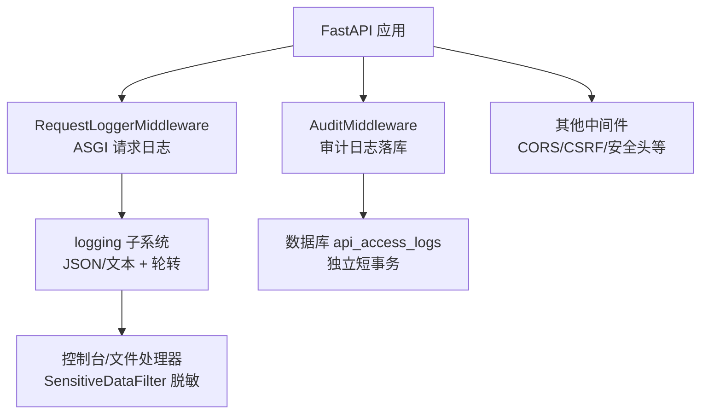
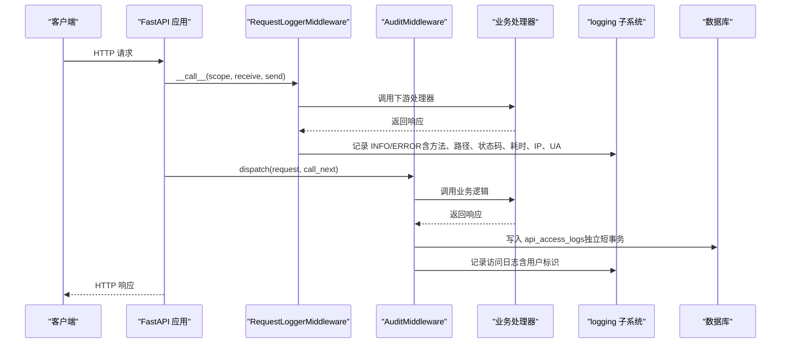
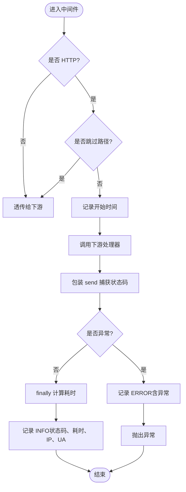
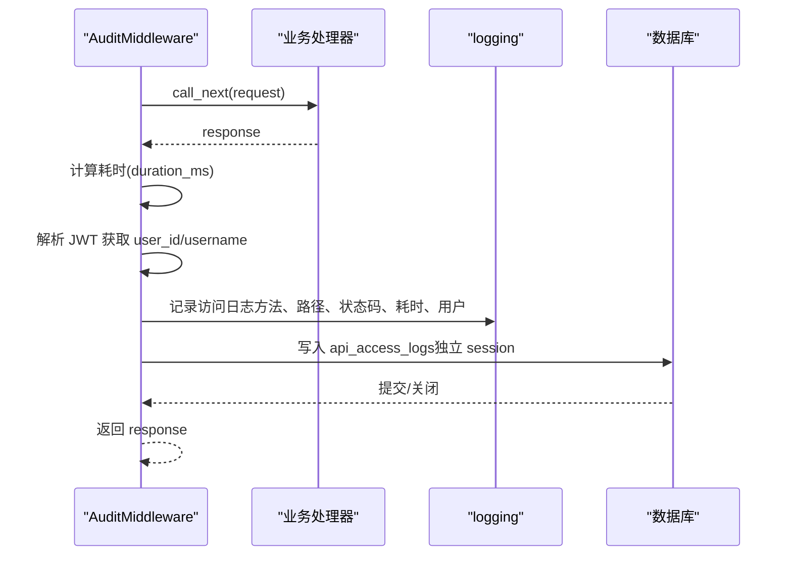
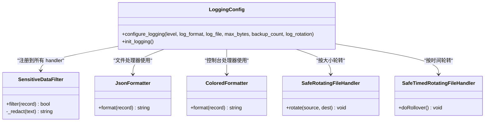
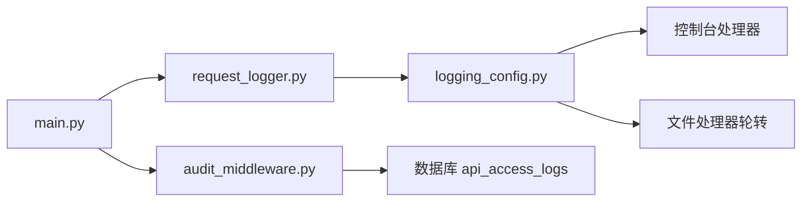

# 请求日志中间件

<cite>
**本文引用的文件**
- [backend/app/middleware/request_logger.py](file://backend/app/middleware/request_logger.py)
- [backend/app/core/logging_config.py](file://backend/app/core/logging_config.py)
- [backend/app/core/logging.py](file://backend/app/core/logging.py)
- [backend/app/core/audit_middleware.py](file://backend/app/core/audit_middleware.py)
- [backend/app/core/config.py](file://backend/app/core/config.py)
- [backend/app/main.py](file://backend/app/main.py)
</cite>

## 目录
1. [简介](#简介)
2. [项目结构](#项目结构)
3. [核心组件](#核心组件)
4. [架构总览](#架构总览)
5. [详细组件分析](#详细组件分析)
6. [依赖关系分析](#依赖关系分析)
7. [性能考量](#性能考量)
8. [故障排查指南](#故障排查指南)
9. [结论](#结论)
10. [附录](#附录)

## 简介
本技术文档聚焦于“请求日志中间件”的完整实现与使用，覆盖以下方面：
- 请求与响应的全链路日志记录机制（方法、路径、查询参数、客户端 IP、User-Agent、响应状态码、处理耗时等）
- 日志格式配置（JSON/文本）、日志级别控制、日志轮转策略（按大小/按时间）
- 敏感信息脱敏与安全考虑（身份证号、手机号、邮箱、口令/令牌键值对等）
- 性能优化建议（异步写入、批量落库、存储优化）
- 日志查询与分析最佳实践（常用查询模式、故障定位方法）

该中间件基于 ASGI 原生实现，跳过静态资源与健康检查路径，确保高吞吐场景下的低开销。

## 项目结构
与请求日志相关的代码主要分布在以下位置：
- 请求日志中间件：ASGI 中间件，负责采集请求/响应关键指标并输出结构化日志
- 审计中间件：在业务层记录访问日志并持久化到数据库（独立短事务）
- 日志系统配置：统一初始化日志器、格式化器、处理器与轮转策略，并在日志层进行敏感信息脱敏
- 应用入口：注册中间件顺序与全局日志初始化

图表来源
- [backend/app/main.py:113-165](file://backend/app/main.py#L113-L165)
- [backend/app/middleware/request_logger.py:52-114](file://backend/app/middleware/request_logger.py#L52-L114)
- [backend/app/core/audit_middleware.py:11-44](file://backend/app/core/audit_middleware.py#L11-L44)
- [backend/app/core/logging_config.py:161-253](file://backend/app/core/logging_config.py#L161-L253)

章节来源
- [backend/app/main.py:113-165](file://backend/app/main.py#L113-L165)

## 核心组件
- RequestLoggerMiddleware：ASGI 中间件，记录 HTTP 请求的方法、路径、查询串、客户端 IP、User-Agent、响应状态码与耗时；跳过健康检查与静态资源路径。
- AuditMiddleware：基于 Starlette BaseHTTPMiddleware，记录方法、路径、状态码、耗时与认证用户，并将访问日志持久化到数据库（失败不破坏业务）。
- logging_config：统一日志初始化，提供 JSON/文本格式化、按大小/按时间轮转、敏感信息过滤（身份证、手机、邮箱、口令/令牌键值对）。
- config：集中式配置项，包含日志级别、日志文件路径、轮转策略、备份数量等。

章节来源
- [backend/app/middleware/request_logger.py:52-114](file://backend/app/middleware/request_logger.py#L52-L114)
- [backend/app/core/audit_middleware.py:11-44](file://backend/app/core/audit_middleware.py#L11-L44)
- [backend/app/core/logging_config.py:75-119](file://backend/app/core/logging_config.py#L75-L119)
- [backend/app/core/config.py:161-168](file://backend/app/core/config.py#L161-L168)

## 架构总览
请求进入 FastAPI 后，依次经过多个中间件。其中：
- RequestLoggerMiddleware 在 ASGI 层捕获请求与响应，计算耗时并输出结构化日志
- AuditMiddleware 在业务层提取认证用户信息，记录访问日志并落库
- 日志通过 logging_config 统一配置，启用 SensitiveDataFilter 进行脱敏，支持按大小或按时间轮转

图表来源
- [backend/app/middleware/request_logger.py:62-114](file://backend/app/middleware/request_logger.py#L62-L114)
- [backend/app/core/audit_middleware.py:18-44](file://backend/app/core/audit_middleware.py#L18-L44)
- [backend/app/core/logging_config.py:161-253](file://backend/app/core/logging_config.py#L161-L253)

## 详细组件分析

### RequestLoggerMiddleware（ASGI 请求日志）
- 功能要点
  - 仅处理 HTTP 类型请求，非 HTTP 直接透传
  - 跳过 /health、/metrics、/favicon.ico、/static/ 前缀路径
  - 从 ASGI scope 提取客户端 IP（优先 x-forwarded-for/x-real-ip，回退 socket client）
  - 从 headers 提取 User-Agent（限制长度）
  - 包装 send 以捕获 http.response.start 的状态码
  - 计算耗时并记录 INFO/ERROR 日志（方法、路径、查询串、状态码、耗时、IP、UA）
- 数据流
  - 进入中间件 → 记录开始时间 → 调用下游 → 捕获状态码 → finally 计算耗时 → 输出日志
- 错误处理
  - 异常时记录 ERROR 并抛出，保证上游可感知
- 性能
  - 轻量级字符串拼接与时间测量，避免读取请求体，减少 I/O 开销

图表来源
- [backend/app/middleware/request_logger.py:62-114](file://backend/app/middleware/request_logger.py#L62-L114)

章节来源
- [backend/app/middleware/request_logger.py:28-49](file://backend/app/middleware/request_logger.py#L28-L49)
- [backend/app/middleware/request_logger.py:52-114](file://backend/app/middleware/request_logger.py#L52-L114)

### AuditMiddleware（审计日志与落库）
- 功能要点
  - 记录方法、路径、状态码、耗时与认证用户
  - 解析 Authorization Bearer Token 获取用户标识（sub/username），失败则匿名
  - 将访问日志写入 api_access_logs（独立 SessionLocal，失败仅 WARNING，不影响业务）
- 数据流
  - 进入中间件 → 调用下游 → 计算耗时 → 提取用户身份 → 记录日志 → 落库（独立事务）
- 错误处理
  - 落库失败仅记录 WARNING，确保业务请求不受影响

图表来源
- [backend/app/core/audit_middleware.py:18-44](file://backend/app/core/audit_middleware.py#L18-L44)
- [backend/app/core/audit_middleware.py:46-77](file://backend/app/core/audit_middleware.py#L46-L77)
- [backend/app/core/audit_middleware.py:79-109](file://backend/app/core/audit_middleware.py#L79-L109)

章节来源
- [backend/app/core/audit_middleware.py:11-44](file://backend/app/core/audit_middleware.py#L11-L44)
- [backend/app/core/audit_middleware.py:46-109](file://backend/app/core/audit_middleware.py#L46-L109)

### 日志系统与配置（logging_config）
- 格式化器
  - JsonFormatter：输出结构化 JSON 行（时间戳、级别、logger、消息、模块、函数、行号、异常）
  - ColoredFormatter：控制台彩色输出（开发友好）
- 轮转策略
  - SafeRotatingFileHandler：按大小轮转（maxBytes、backupCount）
  - SafeTimedRotatingFileHandler：按时间轮转（when="midnight"，backupCount）
  - Windows 兼容：doRollover/rotate 捕获 PermissionError 并重试，避免 WinError 32
- 敏感信息脱敏
  - SensitiveDataFilter：正则替换身份证号、手机号、邮箱、口令/令牌键值对（password/token/secret/api_key/csrf_secret 等）
  - 脱敏失败不阻断日志输出
- 初始化流程
  - configure_logging：设置根日志级别、添加控制台/文件处理器、附加脱敏过滤器、抑制第三方噪音日志
  - init_logging：从 settings 读取 LOG_LEVEL/LOG_FORMAT/LOG_FILE/LOG_MAX_SIZE_MB/LOG_BACKUP_COUNT/LOG_ROTATION 并调用 configure_logging

图表来源
- [backend/app/core/logging_config.py:75-119](file://backend/app/core/logging_config.py#L75-L119)
- [backend/app/core/logging_config.py:122-158](file://backend/app/core/logging_config.py#L122-L158)
- [backend/app/core/logging_config.py:161-253](file://backend/app/core/logging_config.py#L161-L253)

章节来源
- [backend/app/core/logging_config.py:75-119](file://backend/app/core/logging_config.py#L75-L119)
- [backend/app/core/logging_config.py:122-158](file://backend/app/core/logging_config.py#L122-L158)
- [backend/app/core/logging_config.py:161-253](file://backend/app/core/logging_config.py#L161-L253)
- [backend/app/core/logging.py:1-24](file://backend/app/core/logging.py#L1-L24)

### 应用入口与中间件注册（main.py）
- 中间件注册顺序（Starlette 逆序执行）
  - 最外层：RequestIDMiddleware（链路追踪）
  - 安全头：SecurityHeadersMiddleware
  - CORS：CORSMiddleware
  - 驼峰转换：CamelToSnakeMiddleware
  - CSRF：CSRFMiddleware（可选）
  - 请求日志：RequestLoggerMiddleware
  - 审计日志：AuditMiddleware
  - 性能监控：MetricsMiddleware、慢请求监控、查询计数
- 日志初始化：启动时调用 init_logging()，统一配置日志级别、格式、文件与轮转

章节来源
- [backend/app/main.py:113-165](file://backend/app/main.py#L113-L165)
- [backend/app/main.py:53-56](file://backend/app/main.py#L53-L56)

## 依赖关系分析
- RequestLoggerMiddleware 依赖 ASGI scope 与 logging 子系统，无外部服务依赖
- AuditMiddleware 依赖 JWT 解析与数据库会话（独立短事务），失败降级为警告
- logging_config 依赖 Python logging.handlers，提供跨平台安全的轮转实现
- main.py 作为装配点，串联各中间件与日志初始化

图表来源
- [backend/app/main.py:113-165](file://backend/app/main.py#L113-L165)
- [backend/app/middleware/request_logger.py:52-114](file://backend/app/middleware/request_logger.py#L52-L114)
- [backend/app/core/audit_middleware.py:11-44](file://backend/app/core/audit_middleware.py#L11-L44)
- [backend/app/core/logging_config.py:161-253](file://backend/app/core/logging_config.py#L161-L253)

章节来源
- [backend/app/main.py:113-165](file://backend/app/main.py#L113-L165)

## 性能考量
- 请求日志中间件
  - 轻量级：仅读取 scope 与 headers，不读取请求体，避免额外 I/O
  - 跳过高频路径：/health、/metrics、/static/ 等不记录，降低日志量
  - 使用 time.time() 计算耗时，误差可接受且开销极低
- 审计日志
  - 独立短事务：每次请求一个 SessionLocal，避免阻塞主事务
  - 失败降级：落库失败仅记录 WARNING，不影响业务请求
- 日志系统
  - 结构化 JSON：便于后续分析与聚合
  - 轮转策略：按大小或按时间轮转，防止日志文件无限增长
  - 敏感信息脱敏：在日志层统一处理，避免业务侧重复实现
- 建议优化
  - 异步写入：可将日志写入队列，由后台线程批量落盘（当前为同步写入）
  - 批量处理：对审计日志采用批插入（当前为单条插入）
  - 存储优化：根据日志量调整 maxBytes/backupCount，或使用专用日志收集系统（如 Loki/ELK）

[本节为通用指导，无需特定文件引用]

## 故障排查指南
- 常见问题
  - 日志未输出：检查 init_logging() 是否被调用，确认 LOG_LEVEL/LOG_FILE 配置正确
  - 轮转失败（Windows）：SafeTimedRotatingFileHandler/SafeRotatingFileHandler 已内置重试逻辑，若仍失败会记录 stderr 提示
  - 敏感信息未脱敏：确认 SensitiveDataFilter 已添加到所有 handler，检查正则匹配范围
  - 审计日志未落库：检查数据库连接与权限，关注 WARNING 日志中的异常信息
- 定位方法
  - 查看控制台/文件日志，搜索关键字（方法、路径、状态码、耗时）
  - 检查 audit 中间件的 JWT 解析与用户标识提取
  - 检查 request_logger 的跳过路径配置，确认目标路径未被忽略
  - 检查 main.py 的中间件注册顺序，确保 RequestLogger/Audit 生效

章节来源
- [backend/app/core/logging_config.py:161-253](file://backend/app/core/logging_config.py#L161-L253)
- [backend/app/core/audit_middleware.py:79-109](file://backend/app/core/audit_middleware.py#L79-L109)
- [backend/app/middleware/request_logger.py:67-72](file://backend/app/middleware/request_logger.py#L67-L72)

## 结论
本项目实现了完整的请求日志中间件体系：
- ASGI 层的 RequestLoggerMiddleware 提供轻量、高效的请求/响应日志采集
- 业务层的 AuditMiddleware 提供带用户标识的访问日志与持久化
- logging_config 提供统一的日志初始化、格式化、轮转与敏感信息脱敏
- 通过合理的中间件注册顺序与配置，系统在安全性、性能与可观测性之间取得平衡

在生产环境中，建议结合日志收集系统（如 ELK/Loki）与告警规则，进一步提升可维护性与问题定位效率。

## 附录
- 配置项参考（来自 Settings）
  - LOG_LEVEL：日志级别（DEBUG/INFO/WARNING/ERROR）
  - LOG_FILE：日志文件路径
  - LOG_FORMAT：日志格式（json/text）
  - LOG_ROTATION：时间轮转策略（如 "10 days"）
  - LOG_RETENTION：日志保留策略（如 "30 days"）
  - LOG_MAX_SIZE_MB：单个日志文件大小上限（MB）
  - LOG_BACKUP_COUNT：保留的日志备份数量

章节来源
- [backend/app/core/config.py:161-168](file://backend/app/core/config.py#L161-L168)