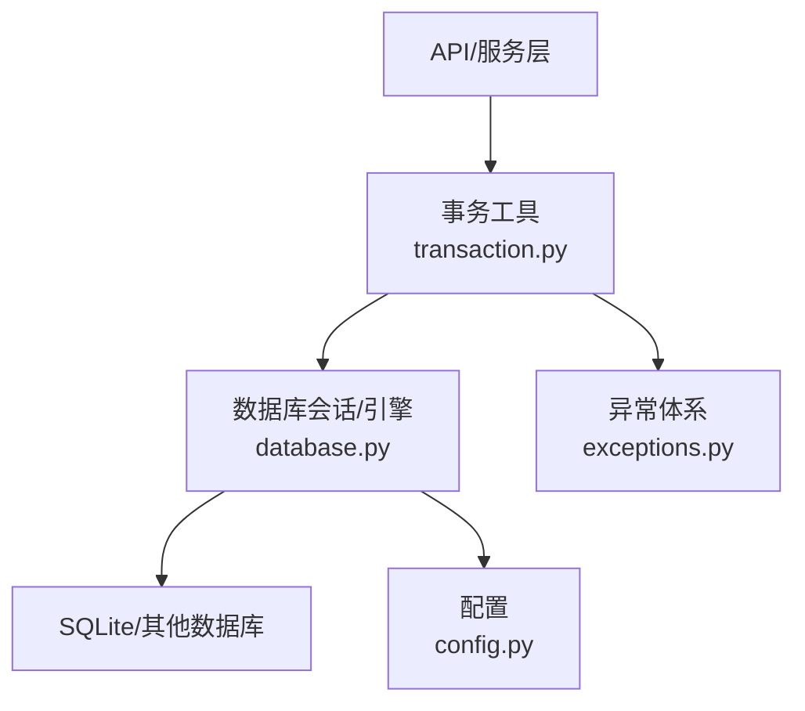
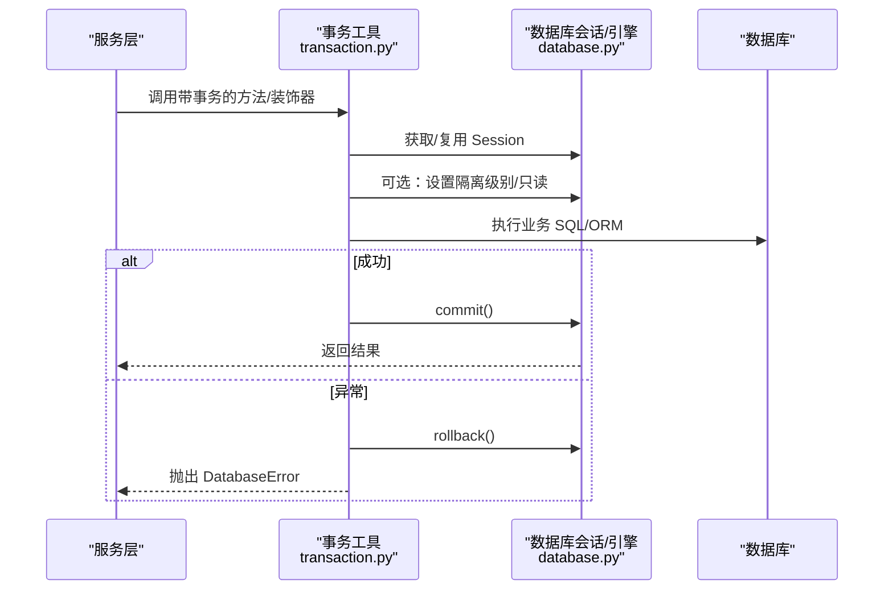
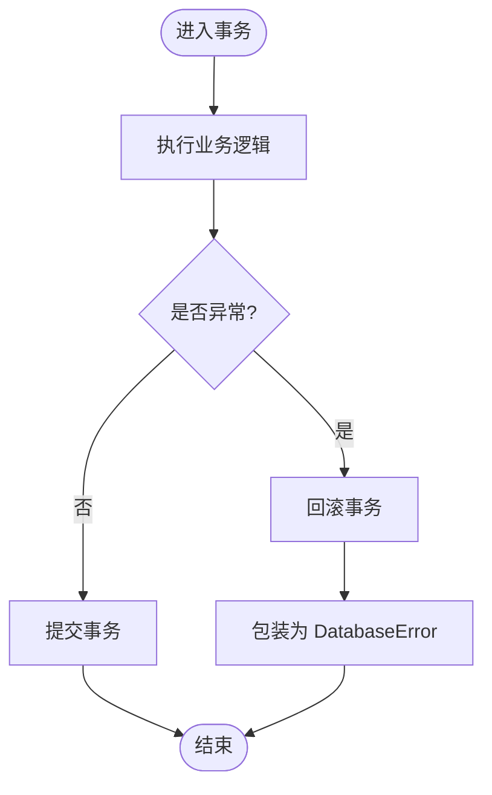
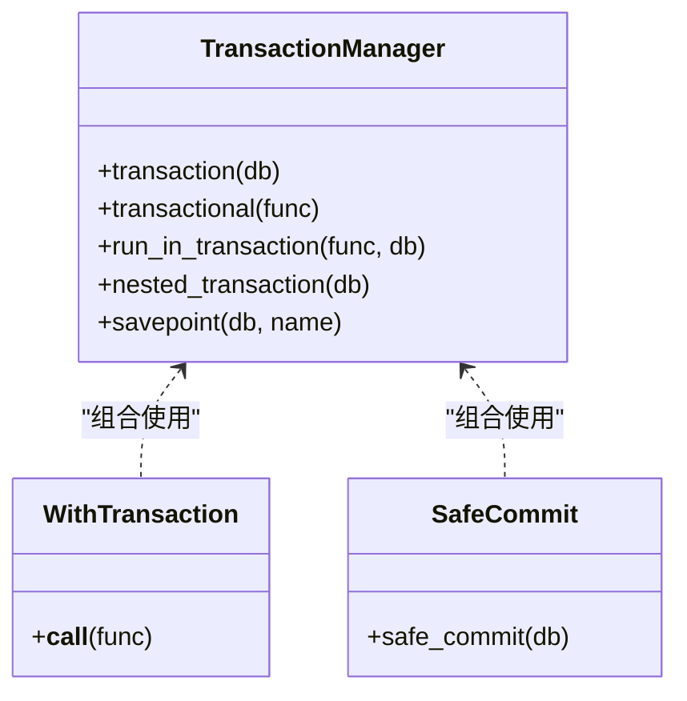
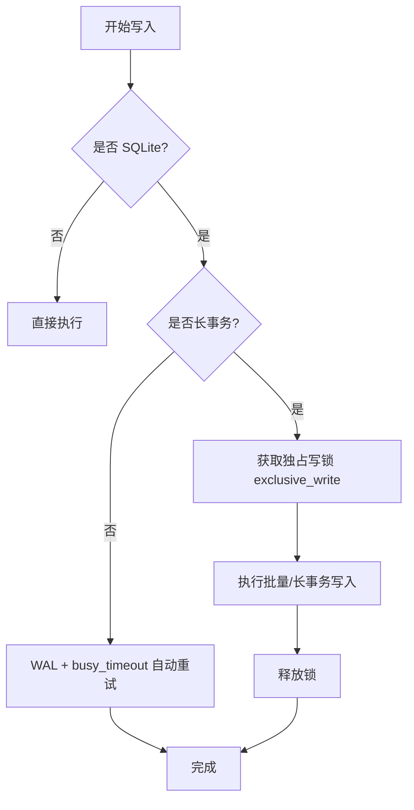
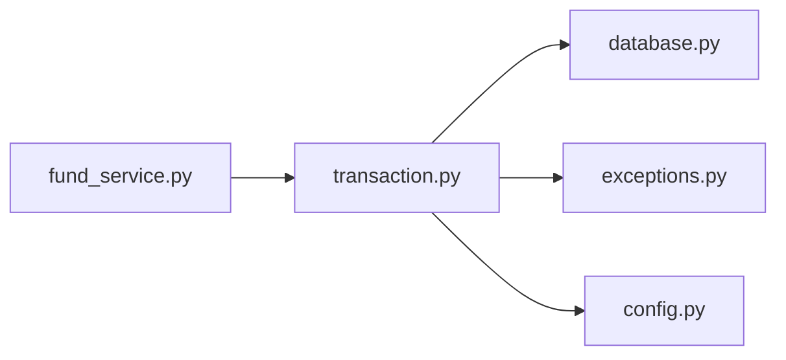

# 事务管理

<cite>
**本文引用的文件**
- [backend/app/core/transaction.py](file://backend/app/core/transaction.py)
- [backend/app/core/database.py](file://backend/app/core/database.py)
- [backend/app/core/exceptions.py](file://backend/app/core/exceptions.py)
- [backend/app/core/config.py](file://backend/app/core/config.py)
- [backend/app/services/fund_service.py](file://backend/app/services/fund_service.py)
- [backend/tests/unit/test_core_transaction.py](file://backend/tests/unit/test_core_transaction.py)
</cite>

## 目录
1. [简介](#简介)
2. [项目结构](#项目结构)
3. [核心组件](#核心组件)
4. [架构总览](#架构总览)
5. [详细组件分析](#详细组件分析)
6. [依赖关系分析](#依赖关系分析)
7. [性能考量](#性能考量)
8. [故障排查指南](#故障排查指南)
9. [结论](#结论)
10. [附录](#附录)

## 简介
本技术文档围绕数据库事务的生命周期管理、隔离级别与并发控制、异步与分布式事务方案、事务边界划分与长事务优化、失败回滚与错误恢复、以及监控与性能分析（含死锁检测与自动重试）进行系统化说明。内容基于后端核心模块中的事务工具、数据库配置与服务层实践，并结合单元测试覆盖的行为验证。

## 项目结构
本项目的事务能力集中在以下位置：
- 事务工具与装饰器：backend/app/core/transaction.py
- 数据库引擎、会话与 SQLite 写入协调器：backend/app/core/database.py
- 异常体系与全局异常处理：backend/app/core/exceptions.py
- 应用配置（连接池、慢查询阈值等）：backend/app/core/config.py
- 服务层事务使用示例（如经费服务）：backend/app/services/fund_service.py
- 事务相关单元测试：backend/tests/unit/test_core_transaction.py

图表来源
- [backend/app/core/transaction.py:48-197](file://backend/app/core/transaction.py#L48-L197)
- [backend/app/core/database.py:55-67](file://backend/app/core/database.py#L55-L67)
- [backend/app/core/exceptions.py:88-93](file://backend/app/core/exceptions.py#L88-L93)
- [backend/app/core/config.py:95-104](file://backend/app/core/config.py#L95-L104)

章节来源
- [backend/app/core/transaction.py:1-457](file://backend/app/core/transaction.py#L1-L457)
- [backend/app/core/database.py:1-343](file://backend/app/core/database.py#L1-L343)
- [backend/app/core/exceptions.py:1-145](file://backend/app/core/exceptions.py#L1-L145)
- [backend/app/core/config.py:1-200](file://backend/app/core/config.py#L1-L200)

## 核心组件
- 事务管理器与上下文：提供声明式与编程式事务边界，支持嵌套事务与保存点，统一提交/回滚与异常包装。
- 高级事务装饰器：支持设置隔离级别与只读事务，自动创建或复用会话，并在非 SQLite 下执行 SET TRANSACTION。
- 死锁重试装饰器：对包含“deadlock/lock”的数据库异常进行有限次重试，避免瞬时竞争导致失败。
- 批量操作工具：按批次插入/更新/删除，定期 flush 控制内存占用，最终统一提交。
- 数据库会话与 SQLite 写入协调器：WAL 模式、PRAGMA 调优、独占写锁用于长事务导入场景。
- 安全提交：safe_commit 在提交失败时确保回滚并抛出异常，便于上层统一处理。
- 异常体系：DatabaseError 作为数据库层异常基类，配合全局异常处理器返回标准错误格式。

章节来源
- [backend/app/core/transaction.py:48-197](file://backend/app/core/transaction.py#L48-L197)
- [backend/app/core/transaction.py:200-363](file://backend/app/core/transaction.py#L200-L363)
- [backend/app/core/transaction.py:366-457](file://backend/app/core/transaction.py#L366-L457)
- [backend/app/core/database.py:174-289](file://backend/app/core/database.py#L174-L289)
- [backend/app/core/exceptions.py:88-93](file://backend/app/core/exceptions.py#L88-L93)

## 架构总览
下图展示从 API/服务层到数据库的事务调用链路与关键控制点。

图表来源
- [backend/app/core/transaction.py:52-73](file://backend/app/core/transaction.py#L52-L73)
- [backend/app/core/transaction.py:236-281](file://backend/app/core/transaction.py#L236-L281)
- [backend/app/core/database.py:174-186](file://backend/app/core/database.py#L174-L186)

## 详细组件分析

### 事务生命周期与边界
- 上下文管理器 transaction：进入时执行业务，退出时根据是否异常决定 commit 或 rollback，并将异常包装为 DatabaseError。
- 装饰器 transactional：自动查找 Session（参数或关键字），若无则通过 get_db_context 创建；异常时回滚并包装。
- run_in_transaction：以函数形式在事务中执行，统一提交/回滚。
- 嵌套事务与保存点：begin_nested 实现子事务/保存点，失败仅回滚到保存点，外层仍可继续。
- safe_commit：commit 失败时立即 rollback 并抛出异常，避免会话处于脏状态。

图表来源
- [backend/app/core/transaction.py:52-73](file://backend/app/core/transaction.py#L52-L73)
- [backend/app/core/transaction.py:76-117](file://backend/app/core/transaction.py#L76-L117)
- [backend/app/core/transaction.py:120-140](file://backend/app/core/transaction.py#L120-L140)
- [backend/app/core/transaction.py:143-189](file://backend/app/core/transaction.py#L143-L189)
- [backend/app/core/transaction.py:200-233](file://backend/app/core/transaction.py#L200-L233)

章节来源
- [backend/app/core/transaction.py:52-189](file://backend/app/core/transaction.py#L52-L189)
- [backend/app/core/transaction.py:200-233](file://backend/app/core/transaction.py#L200-L233)

### 隔离级别与只读事务
- with_transaction：支持传入隔离级别与 readonly 标志。定义期校验隔离级别白名单，防止注入。
- _apply_tx_settings：在非 SQLite 环境下执行 SET TRANSACTION ISOLATION LEVEL / READ ONLY；SQLite 下短路不执行。
- 测试覆盖：验证无效隔离级别抛错、只读事务行为、自动创建会话等。

图表来源
- [backend/app/core/transaction.py:48-197](file://backend/app/core/transaction.py#L48-L197)
- [backend/app/core/transaction.py:236-319](file://backend/app/core/transaction.py#L236-L319)
- [backend/app/core/transaction.py:200-233](file://backend/app/core/transaction.py#L200-L233)

章节来源
- [backend/app/core/transaction.py:236-319](file://backend/app/core/transaction.py#L236-L319)
- [backend/tests/unit/test_core_transaction.py:229-368](file://backend/tests/unit/test_core_transaction.py#L229-L368)

### 并发控制与 SQLite 写入协调器
- WAL 模式与 PRAGMA 调优：启用 WAL、外键约束、NORMAL 同步、busy_timeout=10s、缓存与 mmap 调优、临时存储内存化、自动 checkpoint、自动索引。
- 连接池：QueuePool、pool_size/max_overflow/recycle/pre_ping/timeout 等可调。
- 长事务独占写：exclusive_write 通过进程内互斥锁串行化长事务写入，避免 SQLITE_BUSY 截断；短事务走 WAL+busy_timeout 自动重试路径。
- 队列兼容：保留 enqueue/_process_queue 用于旧版串行写入。

图表来源
- [backend/app/core/database.py:78-157](file://backend/app/core/database.py#L78-L157)
- [backend/app/core/database.py:198-289](file://backend/app/core/database.py#L198-L289)

章节来源
- [backend/app/core/database.py:78-157](file://backend/app/core/database.py#L78-L157)
- [backend/app/core/database.py:198-289](file://backend/app/core/database.py#L198-L289)

### 异步事务与分布式事务
- 异步事务：当前事务工具基于同步 Session 与 SQLAlchemy ORM，未提供 AsyncSession 封装；若需异步，应在服务层将耗时任务放入后台任务（如 FastAPI BackgroundTasks）并使用独立 Session 执行。
- 分布式事务：仓库未实现跨库/跨服务的两阶段提交或 Saga/TCC 编排；建议通过消息队列与补偿机制实现最终一致性，或将跨域操作拆分为本地事务+事件驱动。

[本节为概念性说明，不直接分析具体文件]

### 事务边界划分原则与最佳实践
- 最小化事务范围：仅包裹必要的写操作，减少锁持有时间。
- 明确提交点：复杂流程中使用 auto_commit=False 由外层统一提交，避免半提交数据。
- 批量操作分片：BatchOperation 按批次 flush，控制内存峰值，最后统一提交。
- 读写分离：只读查询可开启 readonly 事务，降低写冲突概率。
- 长事务隔离：大导入/大批量更新使用 exclusive_write 串行化，避免阻塞短事务读取。

章节来源
- [backend/app/services/fund_service.py:114-185](file://backend/app/services/fund_service.py#L114-L185)
- [backend/app/core/transaction.py:366-457](file://backend/app/core/transaction.py#L366-L457)
- [backend/app/core/database.py:198-289](file://backend/app/core/database.py#L198-L289)

### 失败回滚与错误恢复
- 统一回滚：所有事务入口在异常分支均执行 rollback，保证会话干净。
- 异常包装：DatabaseError 携带标准化错误信息，配合全局异常处理器返回统一 JSON。
- 安全提交：safe_commit 在提交失败时强制回滚并抛出异常，避免悬挂事务。
- 重试策略：retry_on_deadlock 针对“deadlock/lock”异常进行有限次重试，提升鲁棒性。

章节来源
- [backend/app/core/transaction.py:52-73](file://backend/app/core/transaction.py#L52-L73)
- [backend/app/core/transaction.py:200-233](file://backend/app/core/transaction.py#L200-L233)
- [backend/app/core/transaction.py:323-363](file://backend/app/core/transaction.py#L323-L363)
- [backend/app/core/exceptions.py:88-93](file://backend/app/core/exceptions.py#L88-L93)

### 监控与性能分析
- 查询计数：after_cursor_execute 事件将 SQL 执行计数写入请求级计数器，供中间件消费，用于 N+1 检测与慢查询定位。
- 连接健康：pool_pre_ping 在复用前检查连接有效性，避免陈旧连接导致失败。
- 慢查询阈值：SLOW_QUERY_THRESHOLD_MS 可用于日志或指标采集（结合中间件）。
- 磁盘空间：check_disk_space 在备份/导入前检查剩余空间，避免 I/O 失败。

章节来源
- [backend/app/core/database.py:70-75](file://backend/app/core/database.py#L70-L75)
- [backend/app/core/database.py:292-343](file://backend/app/core/database.py#L292-L343)
- [backend/app/core/config.py:95-104](file://backend/app/core/config.py#L95-L104)

## 依赖关系分析
- transaction.py 依赖 database.get_db 获取会话，依赖 exceptions.DatabaseError 包装异常，依赖 config 中的 IS_SQLITE 判断是否执行 SET TRANSACTION。
- database.py 提供引擎、会话工厂、SQLite PRAGMA 调优与写入协调器，被事务工具广泛使用。
- fund_service.py 演示在服务层使用 safe_commit 与 auto_commit 控制事务边界。

图表来源
- [backend/app/core/transaction.py:16-18](file://backend/app/core/transaction.py#L16-L18)
- [backend/app/core/database.py:174-186](file://backend/app/core/database.py#L174-L186)
- [backend/app/services/fund_service.py:23-24](file://backend/app/services/fund_service.py#L23-L24)

章节来源
- [backend/app/core/transaction.py:16-18](file://backend/app/core/transaction.py#L16-L18)
- [backend/app/core/database.py:174-186](file://backend/app/core/database.py#L174-L186)
- [backend/app/services/fund_service.py:23-24](file://backend/app/services/fund_service.py#L23-L24)

## 性能考量
- SQLite 优化：WAL、NORMAL 同步、busy_timeout、cache_size/mmap_size、temp_store=MEMORY、wal_autocheckpoint、automatic_index、optimize 等 PRAGMAs。
- 连接池：QueuePool 限制连接数，pre_ping 保活，recycle 回收，timeout 防阻塞。
- 长事务串行化：exclusive_write 避免长事务被 busy_timeout 截断，同时不影响短事务读取。
- 批量操作：bulk_insert/update/delete 配合 flush 分批提交，降低内存峰值与锁竞争。
- 只读事务：readonly 减少写锁争用，提高读吞吐。

章节来源
- [backend/app/core/database.py:78-157](file://backend/app/core/database.py#L78-L157)
- [backend/app/core/database.py:55-67](file://backend/app/core/database.py#L55-L67)
- [backend/app/core/database.py:198-289](file://backend/app/core/database.py#L198-L289)
- [backend/app/core/transaction.py:366-457](file://backend/app/core/transaction.py#L366-L457)
- [backend/app/core/transaction.py:236-245](file://backend/app/core/transaction.py#L236-L245)

## 故障排查指南
- 事务失败回滚：确认是否在异常分支执行了 rollback；优先使用 transaction/transactional/run_in_transaction/safe_commit 统一处理。
- 死锁与锁超时：使用 retry_on_deadlock 增加重试；检查是否存在长事务或热点行竞争；必要时拆分批量大小或调整 busy_timeout。
- 隔离级别错误：with_transaction 定义期即校验隔离级别白名单，非法值会抛错；确认传入值为 READ COMMITTED/REPEATABLE READ/SERIALIZABLE。
- SQLite 写入阻塞：长事务使用 exclusive_write；短事务依赖 WAL+busy_timeout；监控 pending 队列长度。
- 提交失败：safe_commit 会在失败时回滚并抛出异常；检查底层数据库错误与磁盘空间。

章节来源
- [backend/app/core/transaction.py:52-73](file://backend/app/core/transaction.py#L52-L73)
- [backend/app/core/transaction.py:323-363](file://backend/app/core/transaction.py#L323-L363)
- [backend/app/core/transaction.py:236-319](file://backend/app/core/transaction.py#L236-L319)
- [backend/app/core/database.py:198-289](file://backend/app/core/database.py#L198-L289)
- [backend/app/core/database.py:292-343](file://backend/app/core/database.py#L292-L343)

## 结论
本项目提供了完善的事务管理能力：统一的上下文与装饰器简化事务边界划分；SQLite 深度优化与写入协调器保障高并发下的稳定性；批量操作与只读事务提升吞吐；死锁重试与安全提交增强鲁棒性。对于异步与分布式场景，建议在服务层采用后台任务与消息补偿实现最终一致性。通过查询计数、连接健康与慢查询阈值等监控手段，可有效定位性能瓶颈。

## 附录
- 常用 API 速查
  - 事务上下文：transaction(db)、nested_transaction(db)、savepoint(db, name)
  - 事务装饰器：transactional(func)、with_transaction(isolation_level, readonly)
  - 运行于事务：run_in_transaction(func, db, *args, **kwargs)
  - 安全提交：safe_commit(db)
  - 死锁重试：retry_on_deadlock(max_retries, delay)
  - 批量操作：BatchOperation.batch_insert/update/delete
  - 写入协调器：db_coordinator.exclusive_write(timeout)

章节来源
- [backend/app/core/transaction.py:48-197](file://backend/app/core/transaction.py#L48-L197)
- [backend/app/core/transaction.py:200-363](file://backend/app/core/transaction.py#L200-L363)
- [backend/app/core/transaction.py:366-457](file://backend/app/core/transaction.py#L366-L457)
- [backend/app/core/database.py:198-289](file://backend/app/core/database.py#L198-L289)