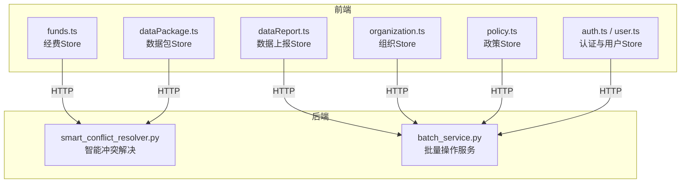
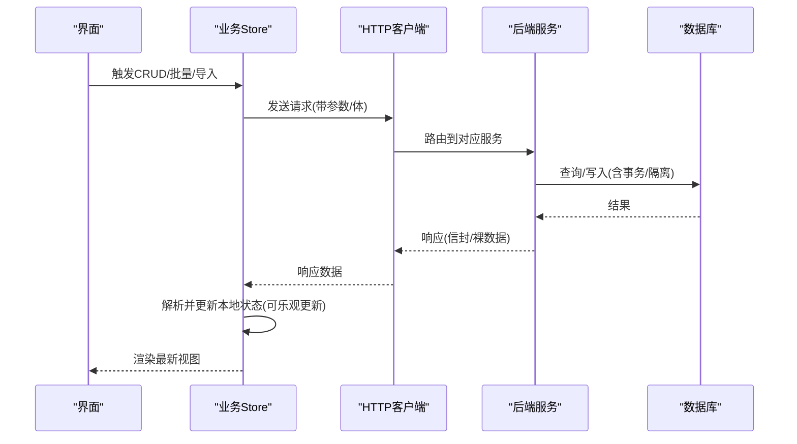
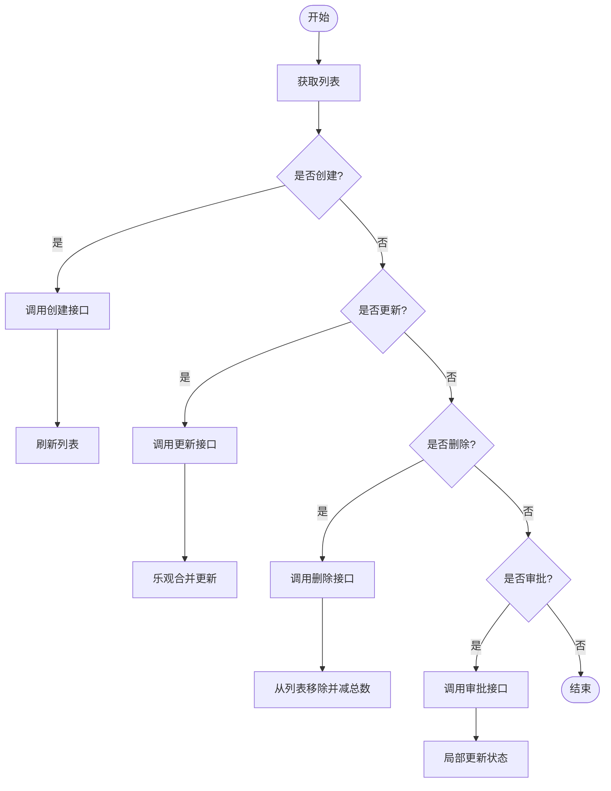
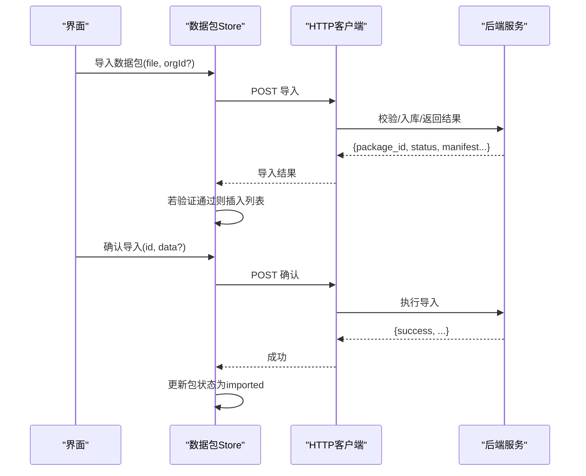
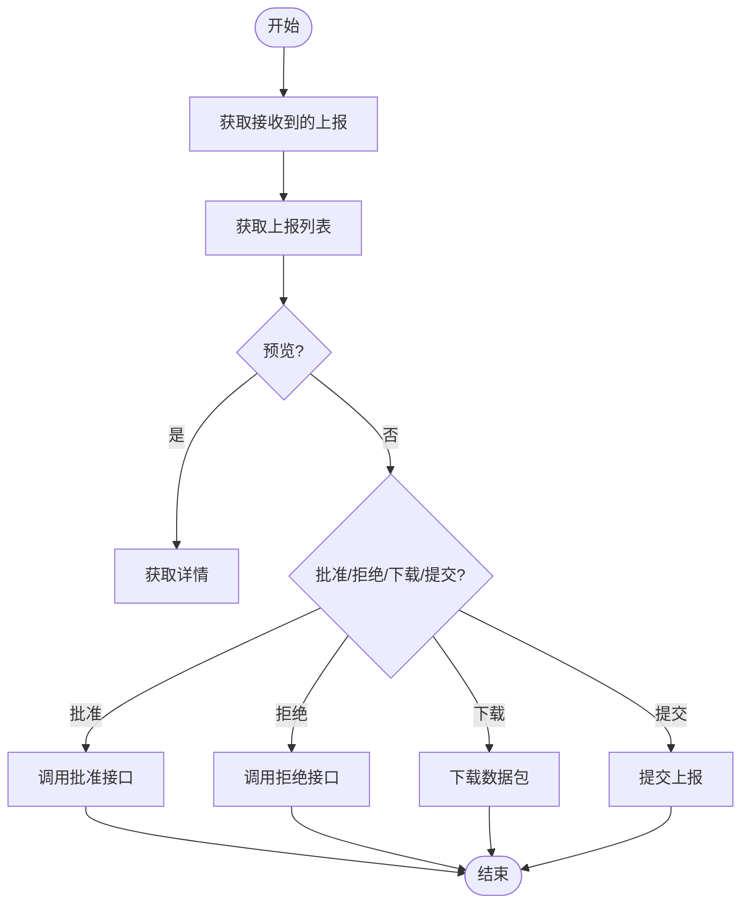
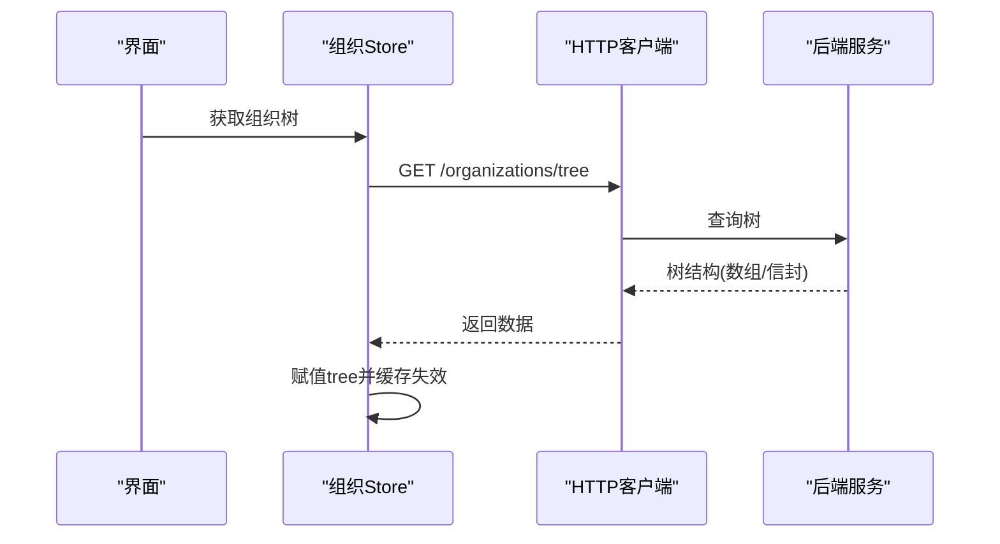
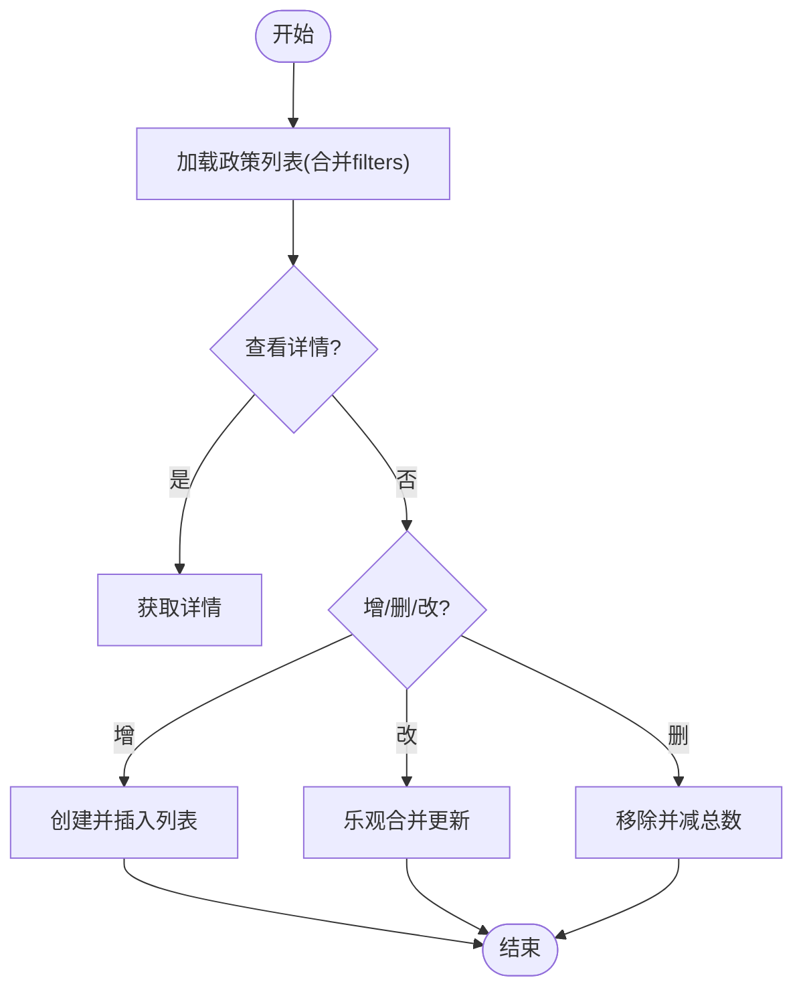
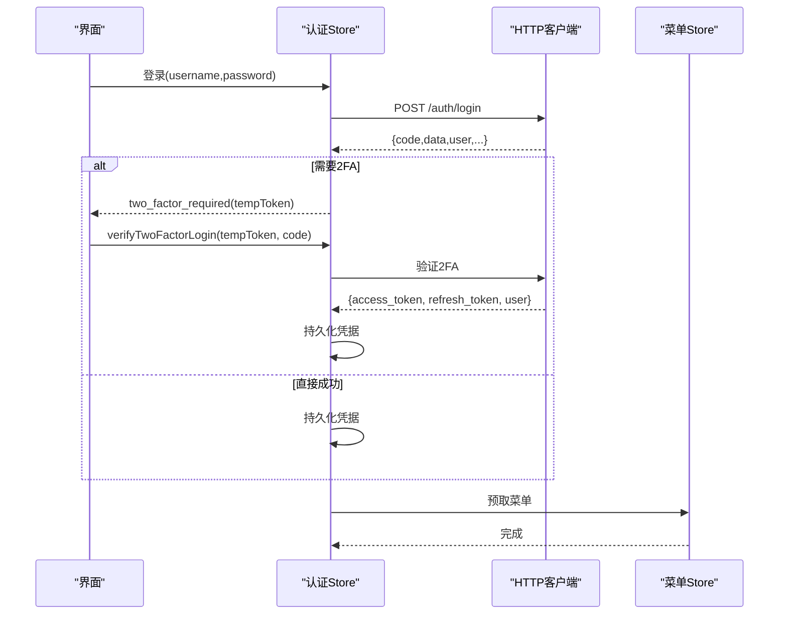
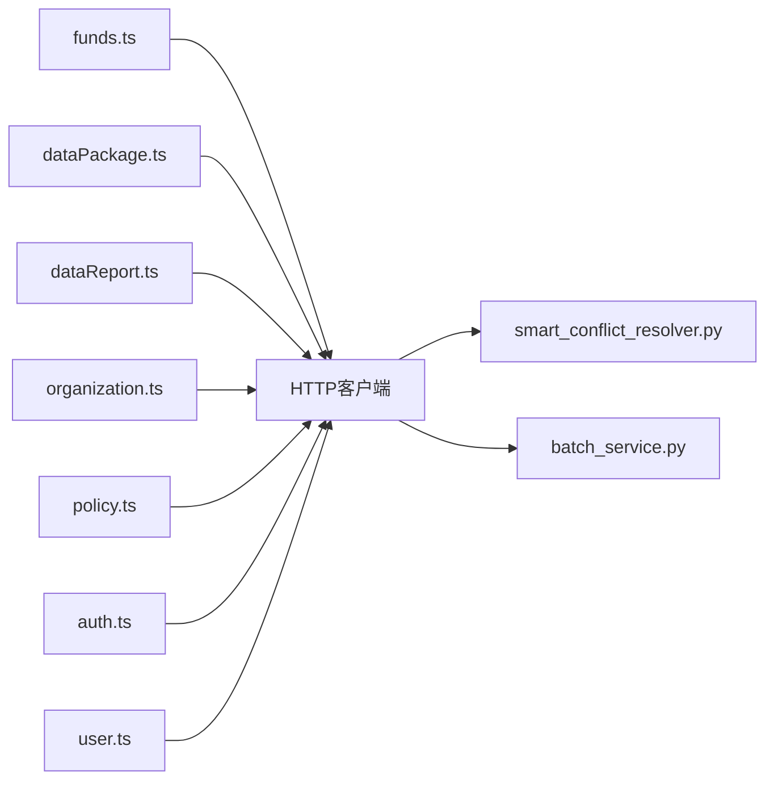

# 业务状态管理

<cite>
**本文引用的文件**
- [frontend/src/stores/funds.ts](file://frontend/src/stores/funds.ts)
- [frontend/src/stores/dataPackage.ts](file://frontend/src/stores/dataPackage.ts)
- [frontend/src/stores/dataReport.ts](file://frontend/src/stores/dataReport.ts)
- [frontend/src/stores/organization.ts](file://frontend/src/stores/organization.ts)
- [frontend/src/stores/policy.ts](file://frontend/src/stores/policy.ts)
- [frontend/src/stores/auth.ts](file://frontend/src/stores/auth.ts)
- [frontend/src/stores/user.ts](file://frontend/src/stores/user.ts)
- [backend/app/services/smart_conflict_resolver.py](file://backend/app/services/smart_conflict_resolver.py)
- [backend/app/services/batch_service.py](file://backend/app/services/batch_service.py)
</cite>

## 目录
1. [简介](#简介)
2. [项目结构](#项目结构)
3. [核心组件](#核心组件)
4. [架构总览](#架构总览)
5. [详细组件分析](#详细组件分析)
6. [依赖关系分析](#依赖关系分析)
7. [性能考虑](#性能考虑)
8. [故障排查指南](#故障排查指南)
9. [结论](#结论)
10. [附录](#附录)

## 简介
本技术文档聚焦于业务状态管理，覆盖经费管理、数据包管理、数据报表、组织管理、政策管理等核心领域的状态设计与实现。重点说明：
- 前端 Pinia Store 如何封装 CRUD、列表与详情、分页、筛选等状态；
- 与服务端数据的同步机制（请求生命周期、乐观更新策略、错误回滚）；
- 复杂场景下的状态模式（表单状态、批量操作、异步任务）；
- 跨模块的状态依赖与数据流转；
- 冲突解决与一致性保障（后端智能冲突解决器与批量服务）；
- 最佳实践与性能优化建议。

## 项目结构
前端采用基于 Pinia 的模块化 Store，每个业务域一个 store，统一通过 HTTP 客户端访问后端 API。后端提供领域服务层，包括智能冲突解决与批量操作服务，用于保证导入、批量写等场景的一致性与安全性。

**图表来源**
- [frontend/src/stores/funds.ts:1-102](file://frontend/src/stores/funds.ts#L1-L102)
- [frontend/src/stores/dataPackage.ts:1-264](file://frontend/src/stores/dataPackage.ts#L1-L264)
- [frontend/src/stores/dataReport.ts:1-126](file://frontend/src/stores/dataReport.ts#L1-L126)
- [frontend/src/stores/organization.ts:1-118](file://frontend/src/stores/organization.ts#L1-L118)
- [frontend/src/stores/policy.ts:1-87](file://frontend/src/stores/policy.ts#L1-L87)
- [frontend/src/stores/auth.ts:1-295](file://frontend/src/stores/auth.ts#L1-L295)
- [frontend/src/stores/user.ts:1-216](file://frontend/src/stores/user.ts#L1-L216)
- [backend/app/services/smart_conflict_resolver.py:1-459](file://backend/app/services/smart_conflict_resolver.py#L1-L459)
- [backend/app/services/batch_service.py:1-244](file://backend/app/services/batch_service.py#L1-L244)

**章节来源**
- [frontend/src/stores/funds.ts:1-102](file://frontend/src/stores/funds.ts#L1-L102)
- [frontend/src/stores/dataPackage.ts:1-264](file://frontend/src/stores/dataPackage.ts#L1-L264)
- [frontend/src/stores/dataReport.ts:1-126](file://frontend/src/stores/dataReport.ts#L1-L126)
- [frontend/src/stores/organization.ts:1-118](file://frontend/src/stores/organization.ts#L1-L118)
- [frontend/src/stores/policy.ts:1-87](file://frontend/src/stores/policy.ts#L1-L87)
- [frontend/src/stores/auth.ts:1-295](file://frontend/src/stores/auth.ts#L1-L295)
- [frontend/src/stores/user.ts:1-216](file://frontend/src/stores/user.ts#L1-L216)
- [backend/app/services/smart_conflict_resolver.py:1-459](file://backend/app/services/smart_conflict_resolver.py#L1-L459)
- [backend/app/services/batch_service.py:1-244](file://backend/app/services/batch_service.py#L1-L244)

## 核心组件
- 经费管理 Store：维护经费列表、当前项、加载态、总数与聚合指标；提供获取、创建、更新、删除、审批与概览统计能力。
- 数据包 Store：维护数据包列表、当前包、预览数据、导入/导出结果与加载/错误态；支持导入、预览、确认导入、下载、删除等操作。
- 数据上报 Store：维护上报列表、接收到的上报列表、加载与错误态；支持获取、预览、批准/拒绝、下载与提交。
- 组织管理 Store：维护组织列表、树形结构、当前组织、下级组织；支持增删改查与树刷新。
- 政策管理 Store：维护政策列表、当前项、加载与总数、筛选条件；支持增删改查与过滤。
- 认证与用户 Store：维护登录态、用户信息、权限映射、会话锁屏；支持登录、2FA、登出、获取/更新个人资料与头像上传。

**章节来源**
- [frontend/src/stores/funds.ts:1-102](file://frontend/src/stores/funds.ts#L1-L102)
- [frontend/src/stores/dataPackage.ts:1-264](file://frontend/src/stores/dataPackage.ts#L1-L264)
- [frontend/src/stores/dataReport.ts:1-126](file://frontend/src/stores/dataReport.ts#L1-L126)
- [frontend/src/stores/organization.ts:1-118](file://frontend/src/stores/organization.ts#L1-L118)
- [frontend/src/stores/policy.ts:1-87](file://frontend/src/stores/policy.ts#L1-L87)
- [frontend/src/stores/auth.ts:1-295](file://frontend/src/stores/auth.ts#L1-L295)
- [frontend/src/stores/user.ts:1-216](file://frontend/src/stores/user.ts#L1-L216)

## 架构总览
前端各 Store 通过统一的 HTTP 客户端发起请求，服务端返回标准信封或裸数据格式，Store 负责解析并更新本地状态。对于写操作，多数 Store 采用“先成功后更新本地”的策略，部分更新使用“乐观更新”以提升交互体验。后端在导入与批量写场景中提供冲突检测与解决、批量安全校验与数据隔离。

**图表来源**
- [frontend/src/stores/funds.ts:25-60](file://frontend/src/stores/funds.ts#L25-L60)
- [frontend/src/stores/dataPackage.ts:41-156](file://frontend/src/stores/dataPackage.ts#L41-L156)
- [frontend/src/stores/dataReport.ts:17-108](file://frontend/src/stores/dataReport.ts#L17-L108)
- [frontend/src/stores/organization.ts:13-77](file://frontend/src/stores/organization.ts#L13-L77)
- [frontend/src/stores/policy.ts:16-71](file://frontend/src/stores/policy.ts#L16-L71)
- [backend/app/services/smart_conflict_resolver.py:82-400](file://backend/app/services/smart_conflict_resolver.py#L82-L400)
- [backend/app/services/batch_service.py:142-239](file://backend/app/services/batch_service.py#L142-L239)

## 详细组件分析

### 经费管理（funds.ts）
- 状态设计
  - 列表 fundList、当前项 current、加载 loading、总数 total。
  - 计算属性：总额、已用、剩余（万元）。
- 数据同步
  - 列表获取：请求后解包 items/total 并赋值。
  - 创建：成功后重新拉取列表。
  - 更新：成功后进行乐观合并更新。
  - 删除：成功后从列表移除并递减总数。
  - 审批：成功后局部更新状态字段。
  - 概览：独立接口返回统计对象，失败时返回默认值。
- 错误处理
  - 列表获取失败时清空列表与总数，确保 UI 稳定。
- 复杂度与性能
  - 列表聚合为 O(n)，适合常规规模；若列表较大可考虑服务端聚合。

**图表来源**
- [frontend/src/stores/funds.ts:25-84](file://frontend/src/stores/funds.ts#L25-L84)

**章节来源**
- [frontend/src/stores/funds.ts:1-102](file://frontend/src/stores/funds.ts#L1-L102)

### 数据包管理（dataPackage.ts）
- 状态设计
  - 列表 packages、当前包 currentPackage、预览数据 previewData、导入/导出结果 importResult/exportResult、加载/导入/导出/错误态、总数 total。
  - 计算属性：按状态过滤的包集合（validated/imported/failed）。
- 数据同步
  - 列表/详情：请求后设置 loading/error，finally 重置 loading。
  - 导入：成功后将新包插入列表头部。
  - 确认导入：成功后更新包状态为 imported。
  - 下载：生成 Blob URL 并触发下载。
  - 删除：成功后从列表移除并清理当前包。
- 错误处理
  - 所有异步操作捕获错误并设置 error，finally 中恢复 loading。
- 复杂度与性能
  - 列表过滤为 O(n)；导入/预览/确认导入均为单次网络 I/O。

**图表来源**
- [frontend/src/stores/dataPackage.ts:93-156](file://frontend/src/stores/dataPackage.ts#L93-L156)

**章节来源**
- [frontend/src/stores/dataPackage.ts:1-264](file://frontend/src/stores/dataPackage.ts#L1-L264)

### 数据报表（dataReport.ts）
- 状态设计
  - 上报列表 reports、当前报告 currentReport、加载 loading、错误 error。
  - 接收到的上报 receivedReports/receivedTotal。
- 数据同步
  - 获取接收到的上报：请求后解包 items/total。
  - 获取通用上报列表：请求后解包 items。
  - 预览/批准/拒绝/下载/提交：分别调用对应接口。
- 错误处理
  - 列表获取失败时设置错误消息并清空数据。
- 复杂度与性能
  - 列表展示为 O(n)；预览/下载为单条记录 I/O。

**图表来源**
- [frontend/src/stores/dataReport.ts:17-108](file://frontend/src/stores/dataReport.ts#L17-L108)

**章节来源**
- [frontend/src/stores/dataReport.ts:1-126](file://frontend/src/stores/dataReport.ts#L1-L126)

### 组织管理（organization.ts）
- 状态设计
  - 组织列表 orgs、当前组织 current、树形 tree、加载 loading、下级组织 subordinateOrganizations。
- 数据同步
  - 列表/详情：请求后设置 loading，finally 重置。
  - 树：兼容数组直返与信封两种格式。
  - 增删改：成功后更新列表与树（必要时清空缓存）。
  - 我的组织/下级组织：分别调用专用接口。
- 错误处理
  - 静默捕获异常，避免影响主流程。
- 复杂度与性能
  - 树构建由后端完成；前端仅做赋值与缓存失效。

**图表来源**
- [frontend/src/stores/organization.ts:39-49](file://frontend/src/stores/organization.ts#L39-L49)

**章节来源**
- [frontend/src/stores/organization.ts:1-118](file://frontend/src/stores/organization.ts#L1-L118)

### 政策管理（policy.ts）
- 状态设计
  - 政策列表 policyList、当前项 current、加载 loading、总数 total、筛选 filters。
- 数据同步
  - 列表：合并 filters 与 params，兼容多种响应形状。
  - 详情：请求后设置 current。
  - 增删改：成功后更新列表与总数。
- 错误处理
  - 静默捕获异常。
- 复杂度与性能
  - 列表过滤在前端以 filters 形式传递至后端，减少前端计算开销。

**图表来源**
- [frontend/src/stores/policy.ts:16-71](file://frontend/src/stores/policy.ts#L16-L71)

**章节来源**
- [frontend/src/stores/policy.ts:1-87](file://frontend/src/stores/policy.ts#L1-L87)

### 认证与用户（auth.ts / user.ts）
- 状态设计
  - 认证：token、refreshToken、user、error、mustChangePassword、modulePermissions、canViewDeleted。
  - 用户：userList、currentUser、loading、error、total。
- 数据同步
  - 登录：处理 2FA 流程，持久化凭据并预取菜单。
  - 登出：尝试通知服务端吊销，清理本地状态。
  - 锁屏/解锁：清除会话级标记。
  - 用户资料：获取/更新个人资料、修改密码、上传头像。
- 错误处理
  - 登录/2FA/资料更新均捕获错误并设置错误消息。
- 复杂度与性能
  - 权限映射使用 Proxy 提升动态访问性能；登录成功后立即预取菜单减少闪烁。

**图表来源**
- [frontend/src/stores/auth.ts:171-259](file://frontend/src/stores/auth.ts#L171-L259)

**章节来源**
- [frontend/src/stores/auth.ts:1-295](file://frontend/src/stores/auth.ts#L1-L295)
- [frontend/src/stores/user.ts:1-216](file://frontend/src/stores/user.ts#L1-L216)

## 依赖关系分析
- 前端 Store 之间
  - 认证 Store 与菜单 Store 协作：登录后预取菜单。
  - 用户 Store 与认证 Store 共享用户上下文（currentUser 与 token）。
- 前端与后端
  - 数据包导入依赖后端的智能冲突解决服务，确保多类型数据导入时的 ID 映射与冲突处理。
  - 批量操作依赖后端的批量服务，进行表名白名单、敏感字段过滤、数据隔离与安全提交。
- 后端服务内部
  - 智能冲突解决器：基于业务键检测冲突，支持 SKIP/OVERWRITE/KEEP_BOTH/MERGE/AUTO 策略，维护 ID 映射并按依赖顺序导入。
  - 批量服务：提供批量更新/删除/导出/校验，保护高权限表，过滤禁止字段，支持软删除与组织数据隔离。

**图表来源**
- [frontend/src/stores/funds.ts:1-102](file://frontend/src/stores/funds.ts#L1-L102)
- [frontend/src/stores/dataPackage.ts:1-264](file://frontend/src/stores/dataPackage.ts#L1-L264)
- [frontend/src/stores/dataReport.ts:1-126](file://frontend/src/stores/dataReport.ts#L1-L126)
- [frontend/src/stores/organization.ts:1-118](file://frontend/src/stores/organization.ts#L1-L118)
- [frontend/src/stores/policy.ts:1-87](file://frontend/src/stores/policy.ts#L1-L87)
- [frontend/src/stores/auth.ts:1-295](file://frontend/src/stores/auth.ts#L1-L295)
- [frontend/src/stores/user.ts:1-216](file://frontend/src/stores/user.ts#L1-L216)
- [backend/app/services/smart_conflict_resolver.py:1-459](file://backend/app/services/smart_conflict_resolver.py#L1-L459)
- [backend/app/services/batch_service.py:1-244](file://backend/app/services/batch_service.py#L1-L244)

**章节来源**
- [backend/app/services/smart_conflict_resolver.py:82-400](file://backend/app/services/smart_conflict_resolver.py#L82-L400)
- [backend/app/services/batch_service.py:142-239](file://backend/app/services/batch_service.py#L142-L239)

## 性能考虑
- 列表与聚合
  - 经费总额/已用/剩余在前端计算，适用于中小规模列表；大数据量建议服务端聚合。
- 乐观更新
  - 经费更新、删除与审批采用乐观更新，减少二次请求，提升交互流畅度。
- 批量操作
  - 后端批量服务使用批量查询替代 N+1，减少数据库往返；对高权限表与敏感字段进行防护。
- 导入流程
  - 数据包导入按依赖顺序处理，维护 ID 映射，避免外键引用错误；冲突检测与自动策略降低人工干预成本。
- 缓存与失效
  - 组织树在增删改后主动失效，确保后续读取一致。
- 超时与重试
  - 关键接口设置合理超时；登录等耗时操作放宽超时限制。

[本节为通用指导，不直接分析具体文件]

## 故障排查指南
- 列表加载失败
  - 检查 Store 中的错误分支是否设置了错误消息；确认后端接口返回格式是否符合预期。
- 更新未生效
  - 确认乐观更新逻辑是否正确匹配 id；检查后端返回码与数据结构。
- 导入冲突
  - 查看智能冲突解决器的差异字段与策略选择；根据业务需求调整策略（SKIP/OVERWRITE/KEEP_BOTH/MERGE/AUTO）。
- 批量操作被拒
  - 检查表名是否在白名单；确认非超级管理员的组织数据隔离；核对禁止字段是否被误传。
- 认证问题
  - 登录/2FA 失败时查看错误消息；确认刷新令牌与菜单预取流程；检查锁屏标记是否清除。

**章节来源**
- [frontend/src/stores/dataReport.ts:30-38](file://frontend/src/stores/dataReport.ts#L30-L38)
- [frontend/src/stores/dataPackage.ts:54-59](file://frontend/src/stores/dataPackage.ts#L54-L59)
- [backend/app/services/smart_conflict_resolver.py:179-338](file://backend/app/services/smart_conflict_resolver.py#L179-L338)
- [backend/app/services/batch_service.py:142-239](file://backend/app/services/batch_service.py#L142-L239)
- [frontend/src/stores/auth.ts:171-259](file://frontend/src/stores/auth.ts#L171-L259)

## 结论
本项目的业务状态管理以 Pinia Store 为核心，结合后端智能冲突解决与批量服务，形成了前后端协同的一致性保障体系。通过乐观更新、批量安全校验、数据隔离与冲突策略，系统在用户体验与数据一致性之间取得平衡。建议在后续迭代中继续强化：
- 更细粒度的错误提示与回滚机制；
- 大数据量场景的服务端聚合与分页优化；
- 导入/批量操作的进度反馈与断点续传；
- 更完善的审计与变更追踪。

[本节为总结性内容，不直接分析具体文件]

## 附录
- 术语
  - 乐观更新：先更新本地状态，再等待服务端确认；失败时回滚。
  - 冲突策略：处理重复或差异数据的规则（跳过、覆盖、保留两者、合并、自动）。
  - 数据隔离：按组织维度限制可操作的数据范围。
- 最佳实践
  - 统一错误处理：Store 内捕获并设置错误消息，UI 层统一展示。
  - 明确状态职责：列表、详情、表单、异步任务状态分离。
  - 谨慎乐观更新：仅在确定性高的场景使用，并提供回滚路径。
  - 批量操作安全：白名单表、禁止字段、组织隔离、事务提交。

[本节为补充说明，不直接分析具体文件]