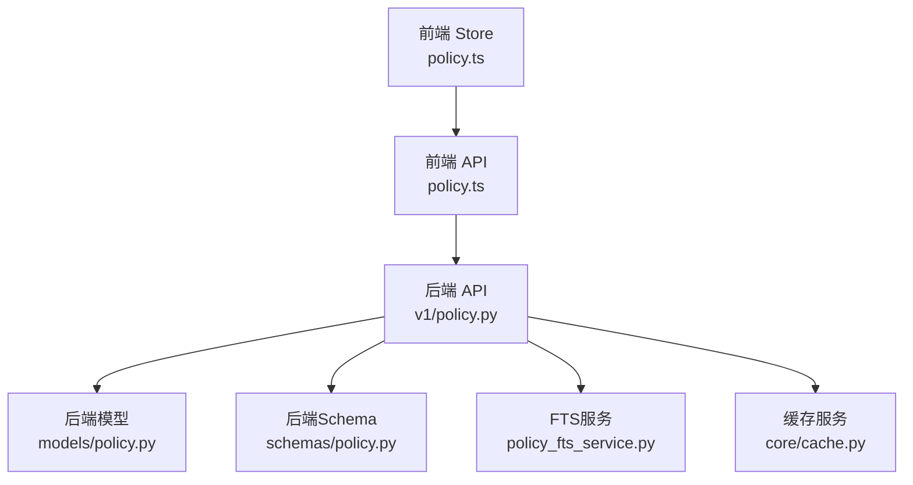
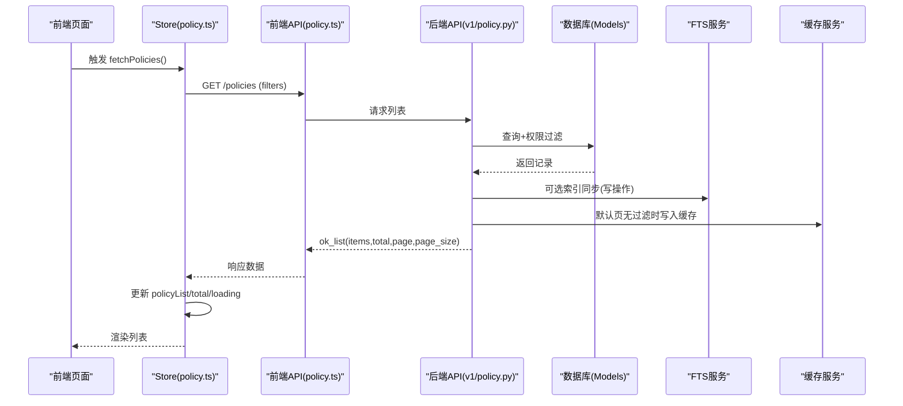
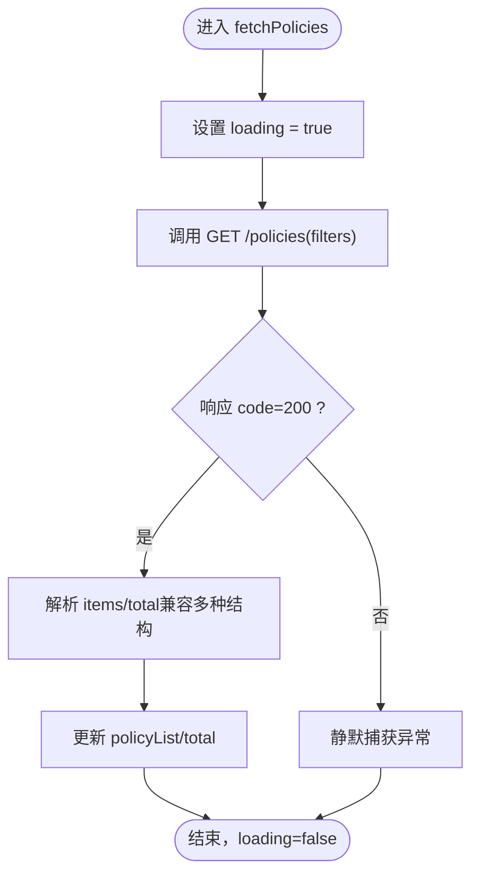
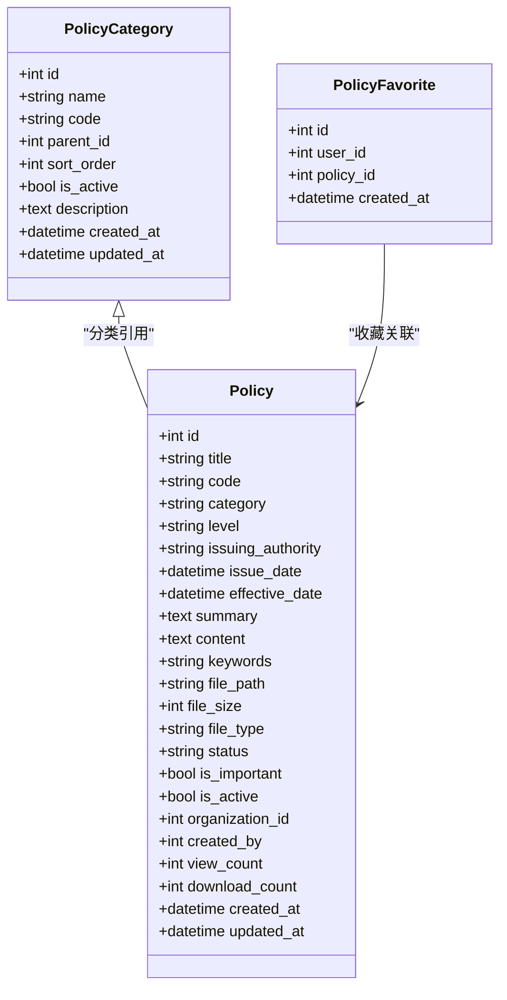
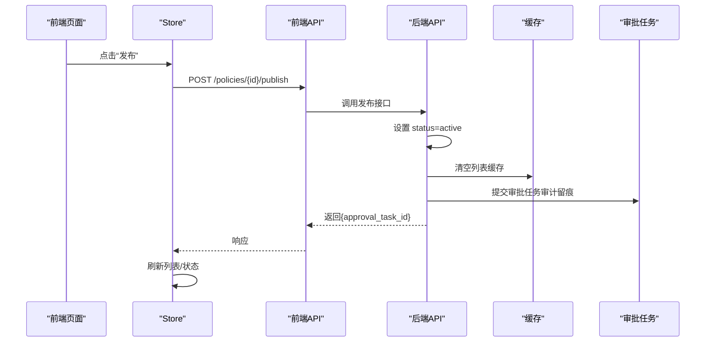
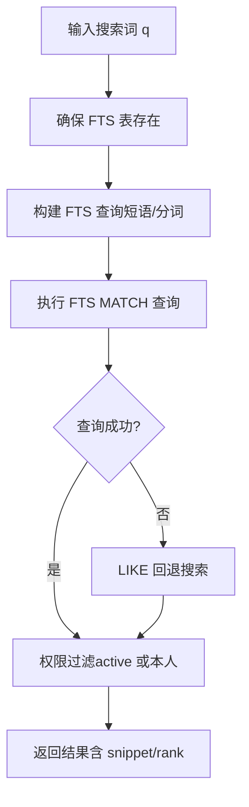
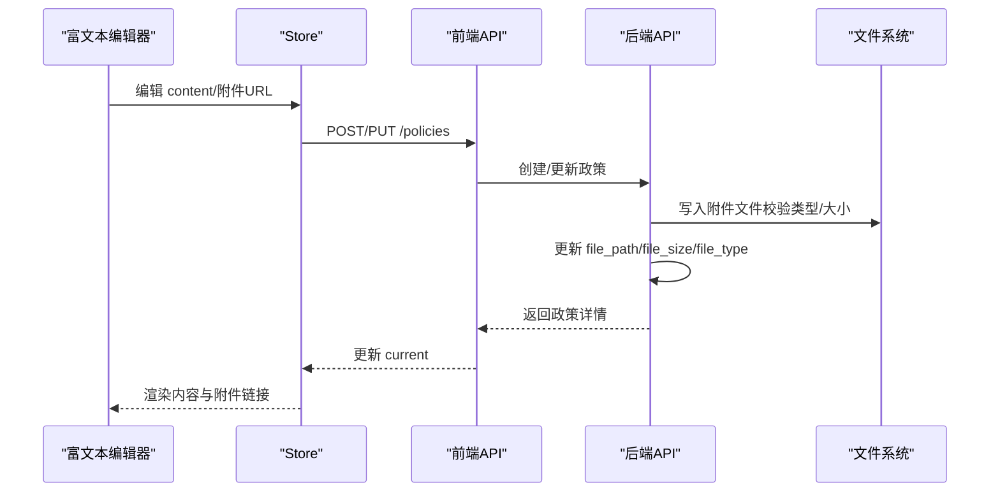
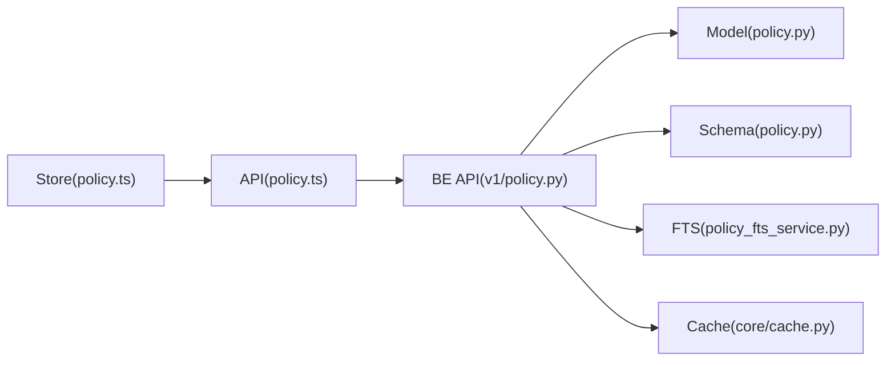

# 政策管理状态

<cite>
**本文引用的文件**
- [frontend/src/stores/policy.ts](file://frontend/src/stores/policy.ts)
- [frontend/src/api/policy.ts](file://frontend/src/api/policy.ts)
- [backend/app/models/policy.py](file://backend/app/models/policy.py)
- [backend/app/schemas/policy.py](file://backend/app/schemas/policy.py)
- [backend/app/api/v1/policy.py](file://backend/app/api/v1/policy.py)
- [backend/app/services/policy_fts_service.py](file://backend/app/services/policy_fts_service.py)
- [backend/app/core/cache.py](file://backend/app/core/cache.py)
</cite>

## 目录
1. [简介](#简介)
2. [项目结构](#项目结构)
3. [核心组件](#核心组件)
4. [架构总览](#架构总览)
5. [详细组件分析](#详细组件分析)
6. [依赖关系分析](#依赖关系分析)
7. [性能考虑](#性能考虑)
8. [故障排查指南](#故障排查指南)
9. [结论](#结论)
10. [附录](#附录)

## 简介
本技术文档聚焦“政策管理”模块的状态设计与实现，覆盖以下关键主题：
- 政策列表、分类标签、搜索与过滤等前端状态字段的设计与同步机制
- 政策的发布、归档（失效）、收藏等业务操作的后端状态变更与缓存/索引一致性
- 富文本编辑场景下的内容保存、预览与附件处理流程
- 全文检索与分类筛选、标签管理的后端实现与前端状态联动
- 用户体验优化：加载态、错误提示、离线支持等交互改进建议

## 项目结构
政策管理涉及前后端多模块协作：
- 前端 Store 负责本地状态（列表、当前项、分页、过滤器、加载态）
- 前端 API 层封装策略相关的接口调用（CRUD、分类、统计、收藏、导入导出、文件上传/预览/下载）
- 后端模型定义政策、分类、收藏等实体及状态枚举
- 后端 Schema 定义请求/响应契约与展示映射
- 后端 API 路由实现业务逻辑（列表查询、详情、创建/更新/删除、发布/归档、收藏、搜索、导入导出、文件处理）
- FTS 服务提供全文检索能力
- 缓存服务用于列表页缓存与失效控制

**图表来源**
- [frontend/src/stores/policy.ts:1-87](file://frontend/src/stores/policy.ts#L1-L87)
- [frontend/src/api/policy.ts:1-155](file://frontend/src/api/policy.ts#L1-L155)
- [backend/app/api/v1/policy.py:1059-1164](file://backend/app/api/v1/policy.py#L1059-L1164)
- [backend/app/models/policy.py:91-145](file://backend/app/models/policy.py#L91-L145)
- [backend/app/schemas/policy.py:47-159](file://backend/app/schemas/policy.py#L47-L159)
- [backend/app/services/policy_fts_service.py:17-143](file://backend/app/services/policy_fts_service.py#L17-L143)
- [backend/app/core/cache.py:14-96](file://backend/app/core/cache.py#L14-L96)

**章节来源**
- [frontend/src/stores/policy.ts:1-87](file://frontend/src/stores/policy.ts#L1-L87)
- [frontend/src/api/policy.ts:1-155](file://frontend/src/api/policy.ts#L1-L155)
- [backend/app/models/policy.py:91-145](file://backend/app/models/policy.py#L91-L145)
- [backend/app/schemas/policy.py:47-159](file://backend/app/schemas/policy.py#L47-L159)
- [backend/app/api/v1/policy.py:1059-1164](file://backend/app/api/v1/policy.py#L1059-L1164)
- [backend/app/services/policy_fts_service.py:17-143](file://backend/app/services/policy_fts_service.py#L17-L143)
- [backend/app/core/cache.py:14-96](file://backend/app/core/cache.py#L14-L96)

## 核心组件
- 前端 Store（policy.ts）
  - 状态字段：policyList、current、loading、total、filters
  - 方法：fetchPolicies、fetchPolicy、createPolicy、updatePolicy、deletePolicy、setFilters
  - 职责：维护列表与当前项、合并过滤条件、统一加载态、兼容多种响应格式
- 前端 API（policy.ts）
  - 类型定义：PolicyCategory、PolicyStatus、Policy、PolicyQuery、PolicyStatistics 等
  - 接口封装：CRUD、分类树、统计、搜索、收藏、导入导出、文件上传/预览/下载
- 后端模型（policy.py）
  - Policy 表：标题、文号、分类、级别、发布日期、生效日期、摘要、正文、关键词、附件信息、状态、是否重要、软删除标记、组织归属、创建人、查看/下载次数、时间戳
  - PolicyCategory：分类名称、编码、父级、排序、启用标记、描述、时间戳
  - PolicyFavorite：用户与政策的多对一收藏关系（唯一约束）
- 后端 Schema（policy.py）
  - PolicyBase/PolicyCreate/PolicyUpdate/PolicyResponse/PolicyListResponse 等
  - 常量映射：类别名、级别名、状态名；响应中附加显示字段（category_name、level_name、status_name）
- 后端 API（v1/policy.py）
  - 列表查询：支持分类、级别、状态、关键字、年度、文号、排序、分页；数据权限控制（已发布公共可见，草稿/失效仅本人或管理员）
  - 详情/相关：详情读取并原子递增浏览量；相关政策按分类与权限过滤
  - 创建/更新：字段映射（organization_level→level、document_number→code、publish_date→issue_date），日期转换，附件URL映射，FTS索引同步，审计日志
  - 删除：软删除（is_active=False），FTS索引清理，缓存失效
  - 发布/归档：状态变更为 active/invalid，缓存失效，审批任务留痕
  - 收藏：增删收藏、获取用户收藏（防IDOR）
  - 导入导出：Excel/PDF/WPS 导出，模板下载，批量导入并生成审批任务
  - 文件上传/预览/下载：校验类型与大小，存储路径，PDF/DOCX预览，下载计数原子递增
- FTS 服务（policy_fts_service.py）
  - 确保 FTS5 虚拟表存在并初始化
  - 全文检索：BM25 排序、片段高亮、结果聚合；失败回退 LIKE 搜索
  - 索引同步：创建/更新后插入，删除后移除
- 缓存服务（core/cache.py）
  - 内存缓存 SimpleCache + 异步包装 CacheManager
  - 列表默认页无过滤时缓存，写操作后按前缀失效

**章节来源**
- [frontend/src/stores/policy.ts:1-87](file://frontend/src/stores/policy.ts#L1-L87)
- [frontend/src/api/policy.ts:1-155](file://frontend/src/api/policy.ts#L1-L155)
- [backend/app/models/policy.py:21-145](file://backend/app/models/policy.py#L21-L145)
- [backend/app/schemas/policy.py:12-159](file://backend/app/schemas/policy.py#L12-L159)
- [backend/app/api/v1/policy.py:1059-1575](file://backend/app/api/v1/policy.py#L1059-L1575)
- [backend/app/services/policy_fts_service.py:17-143](file://backend/app/services/policy_fts_service.py#L17-L143)
- [backend/app/core/cache.py:14-96](file://backend/app/core/cache.py#L14-L96)

## 架构总览
政策管理模块采用前后端分离架构，Store 作为状态中枢，API 层封装 HTTP 调用；后端通过 FastAPI 暴露 RESTful 接口，结合 SQLAlchemy 模型与 Pydantic Schema 完成数据校验与序列化；全文检索由 SQLite FTS5 提供服务；列表页使用内存缓存提升性能。

**图表来源**
- [frontend/src/stores/policy.ts:16-31](file://frontend/src/stores/policy.ts#L16-L31)
- [frontend/src/api/policy.ts:62-66](file://frontend/src/api/policy.ts#L62-L66)
- [backend/app/api/v1/policy.py:1059-1164](file://backend/app/api/v1/policy.py#L1059-L1164)
- [backend/app/services/policy_fts_service.py:17-35](file://backend/app/services/policy_fts_service.py#L17-L35)
- [backend/app/core/cache.py:72-96](file://backend/app/core/cache.py#L72-L96)

## 详细组件分析

### 前端 Store 状态设计
- 状态字段
  - policyList：政策列表数组
  - current：当前选中政策详情
  - loading：全局加载标志
  - total：总数（用于分页）
  - filters：过滤条件集合（分类、级别、状态、关键字等）
- 关键方法
  - setFilters：合并新过滤条件
  - fetchPolicies：设置 loading=true，调用 /policies，兼容三种响应形状（裸数组、信封 data.items、拦截器展开 items），更新列表与总数，finally 重置 loading
  - fetchPolicy：获取单条详情，更新 current
  - createPolicy/updatePolicy/deletePolicy：在成功响应后增量更新本地列表与总数，保持 UI 一致性

**图表来源**
- [frontend/src/stores/policy.ts:16-31](file://frontend/src/stores/policy.ts#L16-L31)

**章节来源**
- [frontend/src/stores/policy.ts:1-87](file://frontend/src/stores/policy.ts#L1-L87)

### 后端模型与状态枚举
- PolicyStatus：active、invalid、draft
- PolicyLevel：national、provincial、municipal、county
- Policy 字段涵盖标题、文号、分类、级别、发布日期、生效日期、摘要、正文、关键词、附件信息、状态、是否重要、软删除标记、组织归属、创建人、查看/下载次数、时间戳
- PolicyCategory：分类树结构（parent_id、sort_order、is_active）
- PolicyFavorite：用户-政策收藏关系（唯一约束 user_id+policy_id）

**图表来源**
- [backend/app/models/policy.py:21-145](file://backend/app/models/policy.py#L21-L145)

**章节来源**
- [backend/app/models/policy.py:21-145](file://backend/app/models/policy.py#L21-L145)

### 后端 Schema 与展示映射
- PolicyBase/PolicyCreate/PolicyUpdate/PolicyResponse/PolicyListResponse
- 常量映射：类别名、级别名、状态名
- 响应扩展：category_name、level_name、status_name、download_count、is_important、attachment_urls 等

**章节来源**
- [backend/app/schemas/policy.py:12-159](file://backend/app/schemas/policy.py#L12-L159)

### 列表查询与数据权限
- 支持参数：skip/limit、category、organization_level/level、search/keyword、order_by/order_desc、year、document_code、page/page_size
- 数据权限：非管理员仅可见已发布(active)或本人创建的政策；管理员全量可见
- 关键字搜索：title/code/keywords 模糊匹配
- 排序：默认按创建时间降序，可切换 publish_date/title
- 分页：兼容 skip/limit 与 page/page_size
- 缓存：默认页且无过滤时写入缓存，键包含用户隔离

**章节来源**
- [backend/app/api/v1/policy.py:1059-1164](file://backend/app/api/v1/policy.py#L1059-L1164)
- [backend/app/core/cache.py:72-96](file://backend/app/core/cache.py#L72-L96)

### 详情、相关、浏览计数
- 详情：权限校验（非管理员不可见草稿/失效），原子递增 view_count
- 相关：按分类过滤，权限控制（仅已发布或本人创建）

**章节来源**
- [backend/app/api/v1/policy.py:1167-1254](file://backend/app/api/v1/policy.py#L1167-L1254)

### 创建/更新/删除
- 创建：字段映射（organization_level→level、document_number→code、publish_date→issue_date），日期转换，附件URL映射，FTS索引同步，审计日志，缓存失效
- 更新：同创建流程的字段映射与日期转换，过滤无效列，附件URL映射，FTS索引同步，审计日志，缓存失效
- 删除：软删除（is_active=False），FTS索引清理，缓存失效，审计日志

**章节来源**
- [backend/app/api/v1/policy.py:1257-1434](file://backend/app/api/v1/policy.py#L1257-L1434)

### 发布与归档（状态同步）
- 发布：将状态设为 active，缓存失效，提交审批任务（审计留痕）
- 归档：将状态设为 invalid，缓存失效，提交审批任务（审计留痕）

**图表来源**
- [backend/app/api/v1/policy.py:1437-1490](file://backend/app/api/v1/policy.py#L1437-L1490)
- [backend/app/core/cache.py:72-96](file://backend/app/core/cache.py#L72-L96)

**章节来源**
- [backend/app/api/v1/policy.py:1437-1490](file://backend/app/api/v1/policy.py#L1437-L1490)

### 收藏功能
- 添加收藏：唯一约束防止重复，基于当前登录用户（防IDOR）
- 取消收藏：校验是否存在，删除记录
- 获取收藏：仅允许查看自己的收藏

**章节来源**
- [backend/app/api/v1/policy.py:1496-1557](file://backend/app/api/v1/policy.py#L1496-L1557)

### 全文检索与高亮
- FTS5 虚拟表：索引 title/content/summary/keywords，BM25 排序，片段高亮
- 搜索接口：/policies/search，支持 limit/offset，权限过滤（非管理员仅 active 或本人创建）
- 降级策略：FTS 失败时回退 LIKE 搜索

**图表来源**
- [backend/app/services/policy_fts_service.py:17-107](file://backend/app/services/policy_fts_service.py#L17-L107)
- [backend/app/api/v1/policy.py:1196-1223](file://backend/app/api/v1/policy.py#L1196-L1223)

**章节来源**
- [backend/app/services/policy_fts_service.py:17-107](file://backend/app/services/policy_fts_service.py#L17-L107)
- [backend/app/api/v1/policy.py:1196-1223](file://backend/app/api/v1/policy.py#L1196-L1223)

### 富文本编辑与附件处理
- 编辑器状态：前端 Store 的 current 字段承载详情内容；content 为富文本字符串
- 草稿保存：创建/更新时 content 持久化，状态默认 draft；更新时字段映射与日期转换
- 版本控制：当前实现未内置版本表；可通过外部版本服务或审计日志追踪变更
- 附件上传：限制类型（pdf/doc/docx/pptx）与大小（≤50MB），存储至 uploads/policies，更新 file_path/file_size/file_type
- 预览：无附件时以 HTML 形式输出转义后的标题与内容；PDF 直接返回；DOC/DOCX 尝试转换为 HTML（mammoth），失败回退下载
- 下载：原子递增 download_count，返回文件流

**图表来源**
- [backend/app/api/v1/policy.py:860-910](file://backend/app/api/v1/policy.py#L860-L910)
- [backend/app/api/v1/policy.py:913-985](file://backend/app/api/v1/policy.py#L913-L985)
- [backend/app/api/v1/policy.py:988-1013](file://backend/app/api/v1/policy.py#L988-L1013)
- [frontend/src/stores/policy.ts:46-62](file://frontend/src/stores/policy.ts#L46-L62)

**章节来源**
- [backend/app/api/v1/policy.py:860-1013](file://backend/app/api/v1/policy.py#L860-L1013)
- [frontend/src/stores/policy.ts:46-62](file://frontend/src/stores/policy.ts#L46-L62)

### 分类与标签管理
- 分类树：/categories/tree 返回层级结构；/categories 返回扁平列表（兼容静态配置）
- 级别选项：/options/levels 返回国家级/省级/市级/县级/专项
- 状态选项：/options/statuses 返回有效/失效/草稿
- 标签：keywords 字段用于标签式检索；前端可按需拆分/组合

**章节来源**
- [backend/app/api/v1/policy.py:232-323](file://backend/app/api/v1/policy.py#L232-L323)
- [backend/app/api/v1/policy.py:835-854](file://backend/app/api/v1/policy.py#L835-L854)
- [frontend/src/api/policy.ts:46-56](file://frontend/src/api/policy.ts#L46-L56)

### 导入导出
- 导入：POST /policies/import，Excel 模板下载，批量导入后生成审批任务
- 导出：/export/excel、/export/pdf、/export/wps，支持分类/级别/状态/关键字筛选

**章节来源**
- [backend/app/api/v1/policy.py:442-498](file://backend/app/api/v1/policy.py#L442-L498)
- [backend/app/api/v1/policy.py:713-802](file://backend/app/api/v1/policy.py#L713-L802)
- [frontend/src/api/policy.ts:101-121](file://frontend/src/api/policy.ts#L101-L121)

## 依赖关系分析
- 前端 Store 依赖前端 API 层进行网络请求
- 前端 API 依赖后端 RESTful 接口
- 后端 API 依赖模型、Schema、FTS 服务、缓存服务
- 缓存服务提供线程安全内存缓存与异步包装
- FTS 服务依赖 SQLite FTS5 虚拟表

**图表来源**
- [frontend/src/stores/policy.ts:1-87](file://frontend/src/stores/policy.ts#L1-L87)
- [frontend/src/api/policy.ts:1-155](file://frontend/src/api/policy.ts#L1-L155)
- [backend/app/api/v1/policy.py:1059-1575](file://backend/app/api/v1/policy.py#L1059-L1575)
- [backend/app/models/policy.py:91-145](file://backend/app/models/policy.py#L91-L145)
- [backend/app/schemas/policy.py:47-159](file://backend/app/schemas/policy.py#L47-L159)
- [backend/app/services/policy_fts_service.py:17-143](file://backend/app/services/policy_fts_service.py#L17-L143)
- [backend/app/core/cache.py:14-96](file://backend/app/core/cache.py#L14-L96)

**章节来源**
- [frontend/src/stores/policy.ts:1-87](file://frontend/src/stores/policy.ts#L1-L87)
- [frontend/src/api/policy.ts:1-155](file://frontend/src/api/policy.ts#L1-L155)
- [backend/app/api/v1/policy.py:1059-1575](file://backend/app/api/v1/policy.py#L1059-L1575)
- [backend/app/models/policy.py:91-145](file://backend/app/models/policy.py#L91-L145)
- [backend/app/schemas/policy.py:47-159](file://backend/app/schemas/policy.py#L47-L159)
- [backend/app/services/policy_fts_service.py:17-143](file://backend/app/services/policy_fts_service.py#L17-L143)
- [backend/app/core/cache.py:14-96](file://backend/app/core/cache.py#L14-L96)

## 性能考虑
- 列表缓存：默认页且无过滤时缓存 300 秒，写操作后按前缀失效，降低数据库压力
- 全文检索：FTS5 BM25 排序与片段高亮，失败回退 LIKE 搜索保证可用性
- 原子计数：view_count/download_count 使用 SQL 原子递增避免并发丢失更新
- 权限过滤：减少不必要的数据传输与计算
- 附件预览：DOCX 转换失败回退下载，避免 500 错误

**章节来源**
- [backend/app/api/v1/policy.py:1089-1164](file://backend/app/api/v1/policy.py#L1089-L1164)
- [backend/app/services/policy_fts_service.py:56-107](file://backend/app/services/policy_fts_service.py#L56-L107)
- [backend/app/api/v1/policy.py:1246-1252](file://backend/app/api/v1/policy.py#L1246-L1252)
- [backend/app/api/v1/policy.py:1001-1007](file://backend/app/api/v1/policy.py#L1001-L1007)

## 故障排查指南
- 列表为空或数据不一致
  - 检查 filters 是否正确合并（setFilters）
  - 确认后端权限过滤是否符合预期（active 或本人创建）
  - 验证缓存是否被正确失效（写操作后）
- 搜索无结果
  - 检查 FTS 表是否初始化成功（ensure_fts_table）
  - 查看降级 LIKE 搜索是否命中
- 附件预览失败
  - 确认文件类型与大小限制
  - DOCX 转换失败时回退下载是否正常
- 收藏异常
  - 检查唯一约束冲突（已收藏）
  - 权限校验（仅能查看自己的收藏）

**章节来源**
- [frontend/src/stores/policy.ts:12-31](file://frontend/src/stores/policy.ts#L12-L31)
- [backend/app/api/v1/policy.py:1089-1164](file://backend/app/api/v1/policy.py#L1089-L1164)
- [backend/app/services/policy_fts_service.py:17-107](file://backend/app/services/policy_fts_service.py#L17-L107)
- [backend/app/api/v1/policy.py:860-985](file://backend/app/api/v1/policy.py#L860-L985)
- [backend/app/api/v1/policy.py:1496-1557](file://backend/app/api/v1/policy.py#L1496-L1557)

## 结论
政策管理模块通过清晰的前后端分层与状态设计，实现了列表、详情、分类、搜索、收藏、导入导出、附件处理等完整业务流程。后端通过权限控制、缓存、FTS 与原子计数保障性能与一致性；前端 Store 提供统一的加载态与数据同步机制。建议在后续迭代中引入版本控制与更丰富的富文本编辑能力，进一步提升用户体验与可维护性。

## 附录
- 常用状态映射
  - 状态：draft（草稿）、active（有效）、invalid（失效）
  - 级别：national（国家级）、provincial（省级）、municipal（市级）、county（县级）、military（专项）
  - 分类：military（专项政策）、local（地方政策）、national（国家政策）、regulation（法规条例）、notice（通知公告）
- 关键接口
  - 列表：GET /policies
  - 详情：GET /policies/{id}
  - 创建：POST /policies
  - 更新：PUT /policies/{id}
  - 删除：DELETE /policies/{id}
  - 发布：POST /policies/{id}/publish
  - 归档：POST /policies/{id}/archive
  - 收藏：POST/DELETE /policies/{id}/favorite；GET /policies/user/{userId}/favorites
  - 搜索：GET /policies/search?q=...
  - 分类：GET /policies/categories、/categories/tree
  - 选项：GET /policies/options/levels、/options/statuses
  - 导入导出：POST /policies/import；GET /policies/export/{excel,pdf,wps}
  - 文件：POST /policies/{id}/upload；GET /policies/{id}/preview、/download

**章节来源**
- [backend/app/schemas/policy.py:12-41](file://backend/app/schemas/policy.py#L12-L41)
- [backend/app/api/v1/policy.py:232-323](file://backend/app/api/v1/policy.py#L232-L323)
- [backend/app/api/v1/policy.py:835-854](file://backend/app/api/v1/policy.py#L835-L854)
- [backend/app/api/v1/policy.py:1059-1575](file://backend/app/api/v1/policy.py#L1059-L1575)
- [frontend/src/api/policy.ts:46-121](file://frontend/src/api/policy.ts#L46-L121)