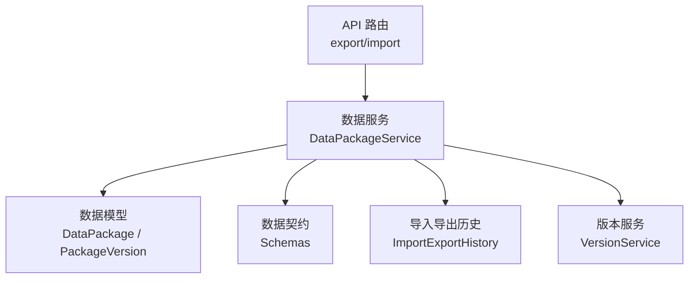
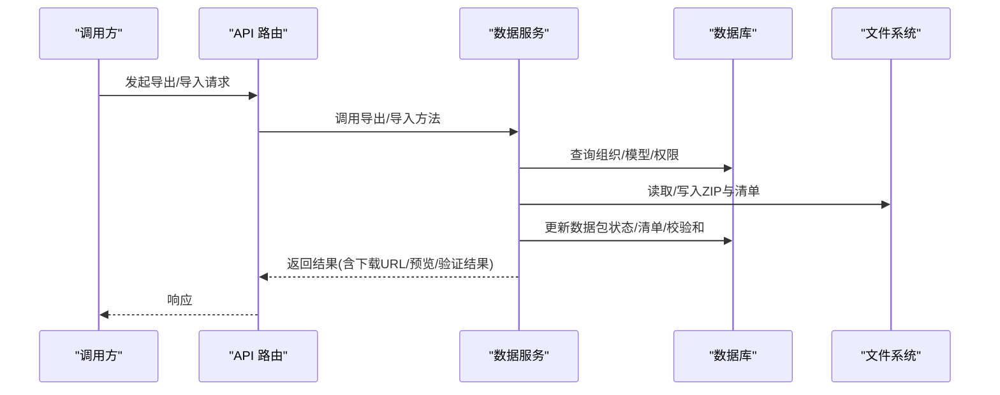
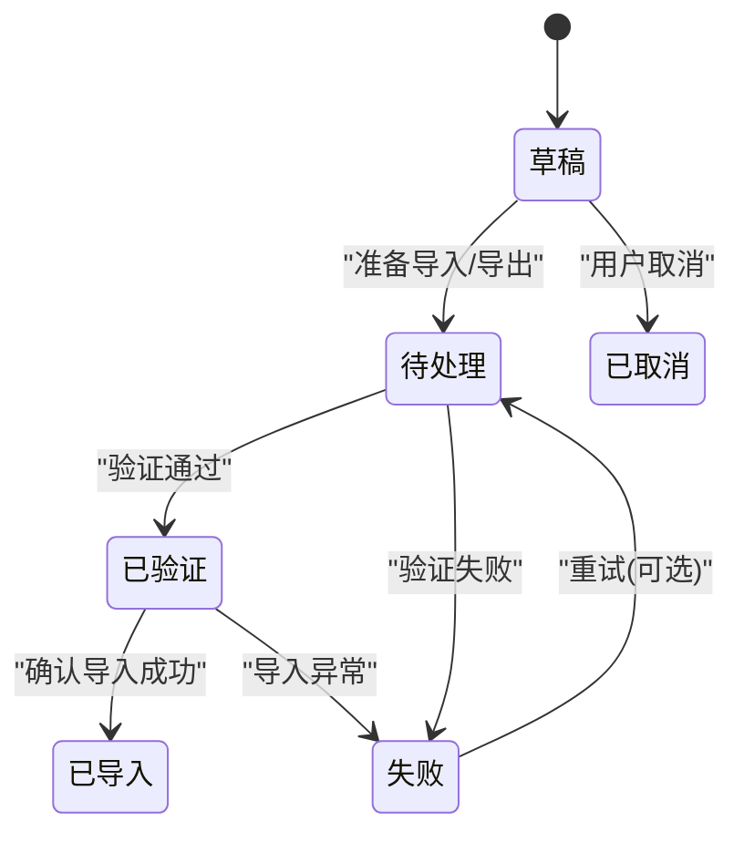
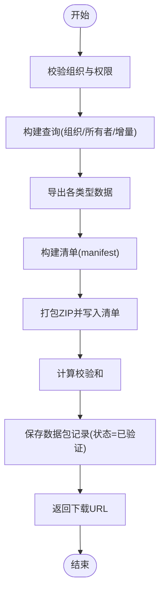
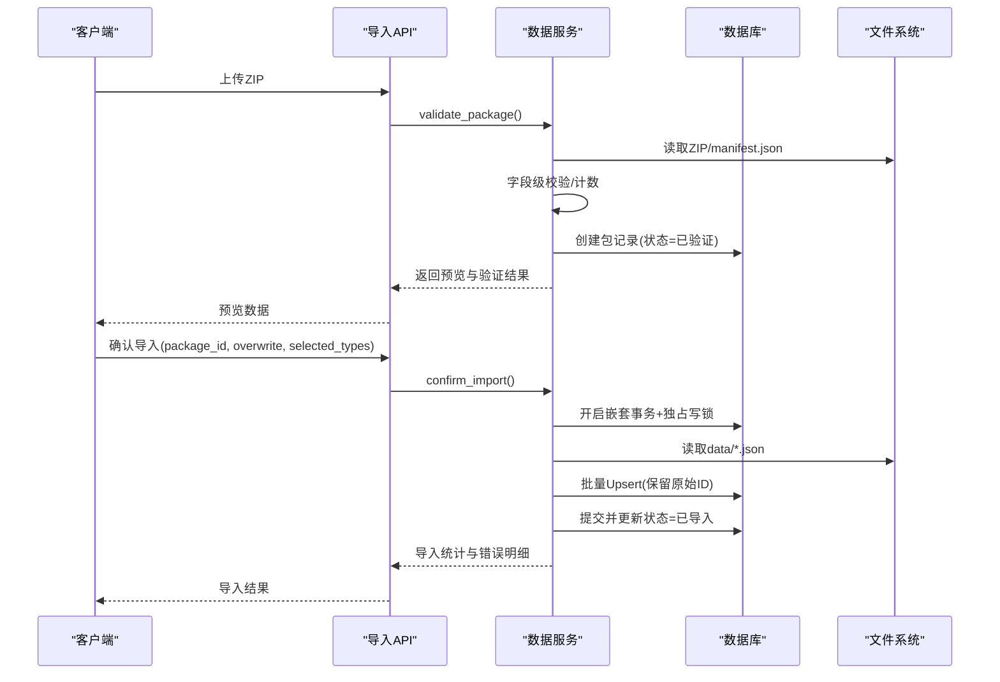
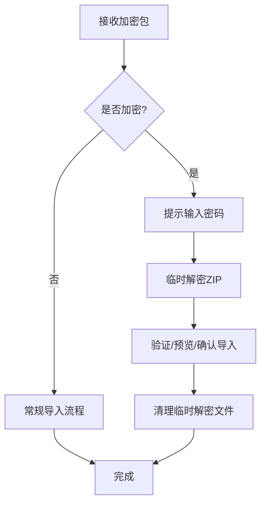
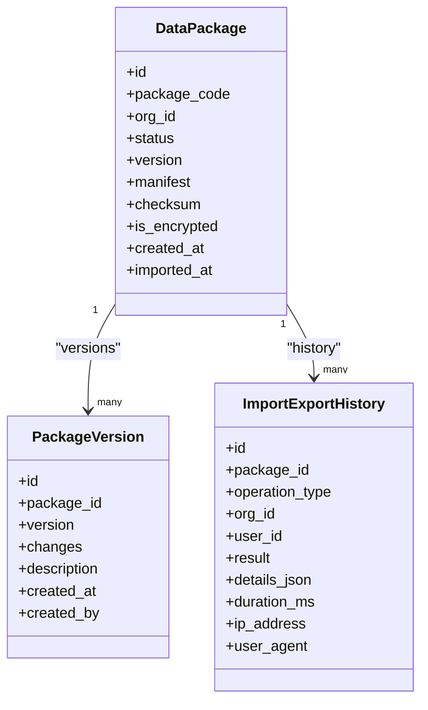
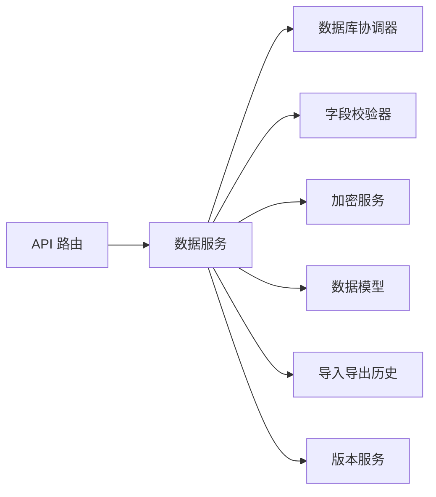

# 数据包管理状态

<cite>
**本文引用的文件**
- [backend/app/models/data_package.py](file://backend/app/models/data_package.py)
- [backend/app/schemas/data_package.py](file://backend/app/schemas/data_package.py)
- [backend/app/services/data_package_service.py](file://backend/app/services/data_package_service.py)
- [backend/app/models/package_version.py](file://backend/app/models/package_version.py)
- [backend/app/services/version_service.py](file://backend/app/services/version_service.py)
- [backend/app/models/import_export_history.py](file://backend/app/models/import_export_history.py)
- [backend/app/api/v1/import_export/export.py](file://backend/app/api/v1/import_export/export.py)
- [backend/app/api/v1/import_export/import_data.py](file://backend/app/api/v1/import_export/import_data.py)
</cite>

## 目录
1. [简介](#简介)
2. [项目结构](#项目结构)
3. [核心组件](#核心组件)
4. [架构总览](#架构总览)
5. [详细组件分析](#详细组件分析)
6. [依赖关系分析](#依赖关系分析)
7. [性能与并发优化](#性能与并发优化)
8. [故障排查指南](#故障排查指南)
9. [结论](#结论)
10. [附录](#附录)

## 简介
本技术文档聚焦“数据包管理状态”，围绕数据包的创建、上传、下载、版本控制、导入导出流程，以及异步任务状态管理、进度跟踪、错误处理等复杂业务场景进行系统化说明。重点解释数据包列表、版本信息、导入导出状态等核心状态字段，并给出与组织、项目等业务实体的关联关系管理与最佳实践建议（大文件处理、并发控制、缓存策略）。

## 项目结构
后端采用分层架构：API 层负责路由与参数校验；服务层封装导入/导出、验证、加密、冲突解决等核心逻辑；模型层定义持久化实体与枚举；Schema 层定义请求/响应契约；历史与版本模型提供审计与版本管理能力。

图表来源
- [backend/app/api/v1/import_export/export.py:1-450](file://backend/app/api/v1/import_export/export.py#L1-L450)
- [backend/app/api/v1/import_export/import_data.py:1-607](file://backend/app/api/v1/import_export/import_data.py#L1-L607)
- [backend/app/services/data_package_service.py:1-821](file://backend/app/services/data_package_service.py#L1-L821)
- [backend/app/models/data_package.py:1-123](file://backend/app/models/data_package.py#L1-L123)
- [backend/app/models/package_version.py:1-44](file://backend/app/models/package_version.py#L1-L44)
- [backend/app/models/import_export_history.py:1-120](file://backend/app/models/import_export_history.py#L1-L120)
- [backend/app/services/version_service.py:1-404](file://backend/app/services/version_service.py#L1-L404)

章节来源
- [backend/app/api/v1/import_export/export.py:1-450](file://backend/app/api/v1/import_export/export.py#L1-L450)
- [backend/app/api/v1/import_export/import_data.py:1-607](file://backend/app/api/v1/import_export/import_data.py#L1-L607)
- [backend/app/services/data_package_service.py:1-821](file://backend/app/services/data_package_service.py#L1-L821)
- [backend/app/models/data_package.py:1-123](file://backend/app/models/data_package.py#L1-L123)
- [backend/app/models/package_version.py:1-44](file://backend/app/models/package_version.py#L1-L44)
- [backend/app/models/import_export_history.py:1-120](file://backend/app/models/import_export_history.py#L1-L120)
- [backend/app/services/version_service.py:1-404](file://backend/app/services/version_service.py#L1-L404)

## 核心组件
- 数据包模型与状态
  - 数据包主表包含编码、组织ID、文件路径/名称/大小、状态、类型、版本、数据类型清单、记录总数、清单元数据、校验和、错误信息、描述、加密相关字段、创建/导入时间、创建人/导入人等。
  - 状态枚举包括草稿、待处理、已验证、已导入、失败、已取消；并提供是否可导入/可编辑的便捷属性。
- 数据包清单与响应契约
  - 清单包含版本号、包类型、组织信息、数据类型、记录数、导出时间、导出人、描述、校验和、加密方式、压缩方式、依赖包、增量标记、基础包ID、导出范围、变更记录等。
  - 导出/导入结果、预览、验证结果、确认导入请求/结果等统一通过 Schema 表达。
- 数据服务
  - 导出：按组织与数据类型导出数据为 ZIP，生成清单与校验和，落库并返回下载链接。
  - 导入：验证包结构/清单/数据格式，持久化包记录，支持预览与确认导入；支持批量 Upsert、事务回滚与独占写锁。
  - 加密：支持导出时加密、导入时解密预览与确认导入，临时文件安全清理。
  - 冲突解决：跨类型外键映射与冲突策略处理。
- 版本与历史
  - 版本模型用于记录数据包版本变更与说明。
  - 版本服务维护系统级版本信息与升级/回滚流程。
  - 导入导出历史模型记录操作类型、结果、详情、耗时、IP/UA 等审计信息。

章节来源
- [backend/app/models/data_package.py:19-123](file://backend/app/models/data_package.py#L19-L123)
- [backend/app/schemas/data_package.py:13-170](file://backend/app/schemas/data_package.py#L13-L170)
- [backend/app/services/data_package_service.py:68-821](file://backend/app/services/data_package_service.py#L68-L821)
- [backend/app/models/package_version.py:15-44](file://backend/app/models/package_version.py#L15-L44)
- [backend/app/services/version_service.py:17-404](file://backend/app/services/version_service.py#L17-L404)
- [backend/app/models/import_export_history.py:19-120](file://backend/app/models/import_export_history.py#L19-L120)

## 架构总览
数据包管理的整体流程由 API 路由触发，调用数据服务完成导出/导入/验证/加密/冲突解决等操作，并通过模型持久化状态与历史，必要时联动版本服务。

图表来源
- [backend/app/api/v1/import_export/export.py:1-450](file://backend/app/api/v1/import_export/export.py#L1-L450)
- [backend/app/api/v1/import_export/import_data.py:1-607](file://backend/app/api/v1/import_export/import_data.py#L1-L607)
- [backend/app/services/data_package_service.py:98-181](file://backend/app/services/data_package_service.py#L98-L181)
- [backend/app/services/data_package_service.py:239-284](file://backend/app/services/data_package_service.py#L239-L284)

## 详细组件分析

### 数据包模型与状态机
- 状态流转
  - 导出：创建包记录后直接置为“已验证”，便于后续下载与导入。
  - 导入：验证通过后进入“已验证”；确认导入成功后置为“已导入”；任何异常置为“失败”。
  - 辅助：草稿/待处理/已取消用于扩展流程或外部编排。
- 关键字段
  - package_code：唯一标识，便于追踪与去重。
  - org_id：组织隔离，确保数据边界。
  - manifest：清单元数据，支撑预览、校验、增量更新。
  - checksum：完整性校验。
  - is_encrypted/encryption_*：加密包元数据。
  - created_by/imported_by：责任人追溯。

图表来源
- [backend/app/models/data_package.py:27-36](file://backend/app/models/data_package.py#L27-L36)
- [backend/app/services/data_package_service.py:165-174](file://backend/app/services/data_package_service.py#L165-L174)
- [backend/app/services/data_package_service.py:463-481](file://backend/app/services/data_package_service.py#L463-L481)

章节来源
- [backend/app/models/data_package.py:38-123](file://backend/app/models/data_package.py#L38-L123)
- [backend/app/services/data_package_service.py:165-174](file://backend/app/services/data_package_service.py#L165-L174)
- [backend/app/services/data_package_service.py:463-481](file://backend/app/services/data_package_service.py#L463-L481)

### 导出流程与清单
- 导出步骤
  - 校验组织与权限，生成包编码。
  - 按数据类型导出数据，构建清单（含记录数、导出时间、导出范围、增量标记等）。
  - 打包为 ZIP，计算校验和，落库并返回下载 URL。
- 增量导出
  - 基于 sync_version 或 updated_at 过滤变更记录，支持 base_package_id 与 export_scope 标记。

图表来源
- [backend/app/services/data_package_service.py:98-181](file://backend/app/services/data_package_service.py#L98-L181)
- [backend/app/services/data_package_service.py:183-234](file://backend/app/services/data_package_service.py#L183-L234)
- [backend/app/schemas/data_package.py:80-114](file://backend/app/schemas/data_package.py#L80-L114)

章节来源
- [backend/app/services/data_package_service.py:98-234](file://backend/app/services/data_package_service.py#L98-L234)
- [backend/app/schemas/data_package.py:80-114](file://backend/app/schemas/data_package.py#L80-L114)

### 导入流程与预览/确认
- 导入步骤
  - 验证 ZIP 结构与清单，检查 JSON 数据与字段校验摘要。
  - 复制文件到永久路径，生成包记录（状态=已验证），返回预览数据。
  - 确认导入：读取清单与数据，执行字段级校验，批量 Upsert 写入，事务保护与独占写锁，成功后更新状态为“已导入”。
- 预览
  - 从 ZIP 中读取清单与各类型数据，返回样本列与条数。

图表来源
- [backend/app/services/data_package_service.py:239-284](file://backend/app/services/data_package_service.py#L239-L284)
- [backend/app/services/data_package_service.py:367-395](file://backend/app/services/data_package_service.py#L367-L395)
- [backend/app/services/data_package_service.py:397-481](file://backend/app/services/data_package_service.py#L397-L481)

章节来源
- [backend/app/services/data_package_service.py:239-481](file://backend/app/services/data_package_service.py#L239-L481)

### 加密导入导出
- 导出加密：在普通导出基础上对 ZIP 进行 AES256+Fernet+PBKDF2 加密，更新包记录的加密元数据，删除明文文件。
- 导入解密：检测是否为加密包，要求密码，临时解密后进行验证与预览；确认导入时同样支持解密与冲突解决。
- 安全清理：finally 块确保临时解密文件被删除。

图表来源
- [backend/app/services/data_package_service.py:565-611](file://backend/app/services/data_package_service.py#L565-L611)
- [backend/app/services/data_package_service.py:613-687](file://backend/app/services/data_package_service.py#L613-L687)

章节来源
- [backend/app/services/data_package_service.py:565-687](file://backend/app/services/data_package_service.py#L565-L687)

### 版本控制与历史记录
- 数据包版本：记录每个数据包的版本、变更记录与说明，支持溯源。
- 系统版本：维护当前版本、历史、升级/回滚流程，并在升级前后执行备份与迁移。
- 导入导出历史：记录每次操作的类型、结果、详情、耗时、IP/UA 等，便于审计与排障。

图表来源
- [backend/app/models/data_package.py:38-123](file://backend/app/models/data_package.py#L38-L123)
- [backend/app/models/package_version.py:15-44](file://backend/app/models/package_version.py#L15-L44)
- [backend/app/models/import_export_history.py:39-120](file://backend/app/models/import_export_history.py#L39-L120)

章节来源
- [backend/app/models/package_version.py:15-44](file://backend/app/models/package_version.py#L15-L44)
- [backend/app/services/version_service.py:17-404](file://backend/app/services/version_service.py#L17-L404)
- [backend/app/models/import_export_history.py:39-120](file://backend/app/models/import_export_history.py#L39-L120)

### 与组织、项目等业务实体的关联
- 组织隔离：所有导出/导入均基于 org_id 过滤，确保数据边界。
- 数据类型映射：villages/projects/funds/schools 等模型通过映射字典参与导出/导入。
- 权限与范围：支持仅导出本人录入的数据（export_scope=self）或全组织（org）。

章节来源
- [backend/app/services/data_package_service.py:53-58](file://backend/app/services/data_package_service.py#L53-L58)
- [backend/app/services/data_package_service.py:117-135](file://backend/app/services/data_package_service.py#L117-L135)
- [backend/app/api/v1/import_export/export.py:112-274](file://backend/app/api/v1/import_export/export.py#L112-L274)

## 依赖关系分析
- API 层依赖服务层，服务层依赖模型与工具（数据库协调器、JSON 编码器、加密服务等）。
- 数据服务内部依赖：
  - 数据库协调器 exclusive_write 防止 SQLite 并发冲突。
  - 批量 Upsert 使用 SQLAlchemy 方言插入语句，提升写入性能。
  - 字段级校验通过专用验证器聚合 ok/corrected/rejected 结果。
- 版本与历史作为横切关注点，贯穿生命周期。

图表来源
- [backend/app/services/data_package_service.py:22-47](file://backend/app/services/data_package_service.py#L22-L47)
- [backend/app/services/data_package_service.py:412-481](file://backend/app/services/data_package_service.py#L412-L481)
- [backend/app/models/import_export_history.py:39-120](file://backend/app/models/import_export_history.py#L39-L120)
- [backend/app/services/version_service.py:17-404](file://backend/app/services/version_service.py#L17-L404)

章节来源
- [backend/app/services/data_package_service.py:22-47](file://backend/app/services/data_package_service.py#L22-L47)
- [backend/app/services/data_package_service.py:412-481](file://backend/app/services/data_package_service.py#L412-L481)
- [backend/app/models/import_export_history.py:39-120](file://backend/app/models/import_export_history.py#L39-L120)
- [backend/app/services/version_service.py:17-404](file://backend/app/services/version_service.py#L17-L404)

## 性能与并发优化
- 大文件处理
  - 使用 ZIP 流式写入清单与数据，避免一次性加载至内存。
  - 分块计算 SHA256 校验和，降低大文件内存占用。
- 并发控制
  - 确认导入阶段使用 SAVEPOINT 事务与 exclusive_write 独占写锁，避免 SQLite_BUSY 与脏写。
  - 批量 Upsert 减少多次往返，提高吞吐。
- 缓存策略
  - 清单与校验和落库，避免重复计算。
  - 预览仅读取样本数据，限制 sample_size。
- 资源清理
  - 加密/解密临时文件在 finally 中确保删除，避免磁盘泄漏。

章节来源
- [backend/app/services/data_package_service.py:224-234](file://backend/app/services/data_package_service.py#L224-L234)
- [backend/app/services/data_package_service.py:774-779](file://backend/app/services/data_package_service.py#L774-L779)
- [backend/app/services/data_package_service.py:412-481](file://backend/app/services/data_package_service.py#L412-L481)
- [backend/app/services/data_package_service.py:647-687](file://backend/app/services/data_package_service.py#L647-L687)

## 故障排查指南
- 常见错误
  - 文件不存在/非 ZIP/损坏：验证阶段返回错误条目，需检查上传与存储路径。
  - 缺少 manifest.json 或 data/*.json：清单不完整导致验证失败。
  - 不支持的版本：manifest.version 不在支持列表中。
  - 密码错误：加密包导入/预览时抛出错误，需核对密码。
  - 数据库锁定/写入失败：确认导入阶段出现异常会回滚并记录错误信息。
- 定位手段
  - 查看数据包 error_message 与清单 validation_summary。
  - 通过导入导出历史查看操作类型、结果、耗时、IP/UA 等。
  - 检查日志中的异常堆栈与警告信息。

章节来源
- [backend/app/services/data_package_service.py:286-350](file://backend/app/services/data_package_service.py#L286-L350)
- [backend/app/services/data_package_service.py:613-687](file://backend/app/services/data_package_service.py#L613-L687)
- [backend/app/models/import_export_history.py:39-120](file://backend/app/models/import_export_history.py#L39-L120)

## 结论
数据包管理模块以“清单驱动、状态机约束、事务与锁保障、审计可追溯”为核心设计原则，实现了高可靠、可扩展的导入导出能力。通过组织隔离、增量导出、加密传输、批量写入与冲突解决，满足复杂业务场景下的数据交换需求。建议在大规模数据交换中结合异步任务队列与分片策略进一步提升吞吐与稳定性。

## 附录
- API 参考
  - 导出：支持多实体导出与综合报表导出（xlsx/csv/docx/pdf）。
  - 导入：模板下载、通用实体导入、数据验证、预览、历史记录查询。
- 最佳实践
  - 大文件：分块处理、流式 I/O、及时清理临时文件。
  - 并发：使用独占写锁与事务保护，避免竞争条件。
  - 缓存：清单与校验和落库，减少重复计算。
  - 审计：完整记录导入导出历史，便于合规与排障。

章节来源
- [backend/app/api/v1/import_export/export.py:75-450](file://backend/app/api/v1/import_export/export.py#L75-L450)
- [backend/app/api/v1/import_export/import_data.py:114-607](file://backend/app/api/v1/import_export/import_data.py#L114-L607)