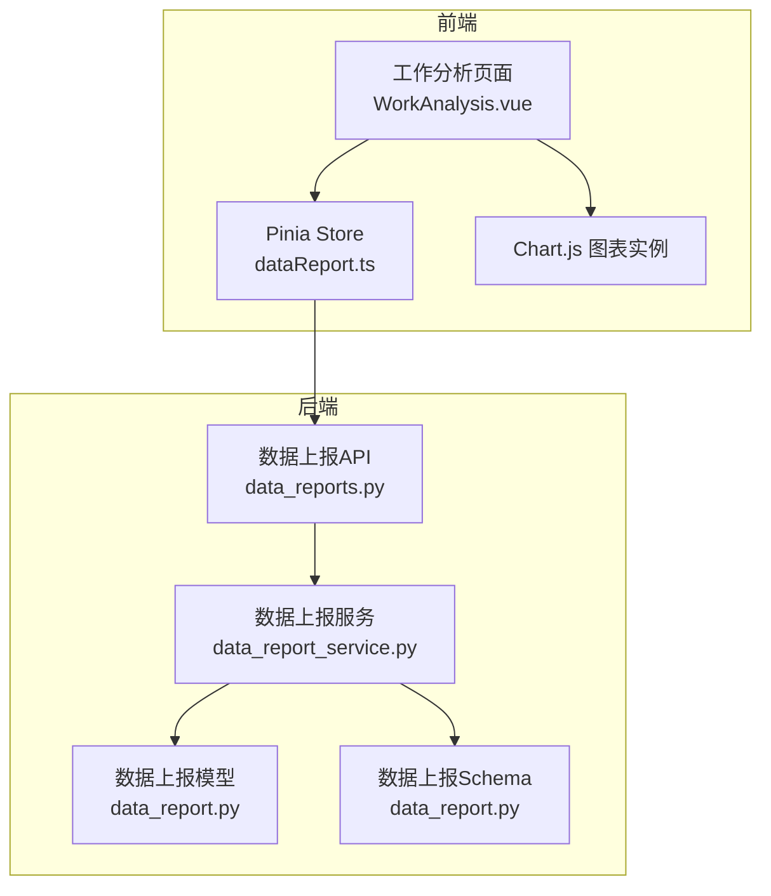
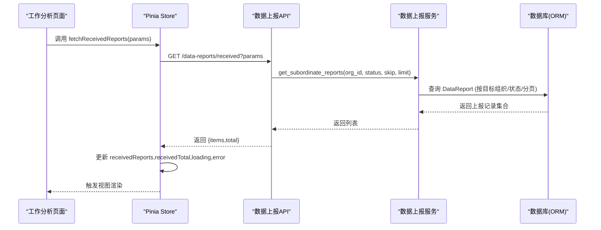
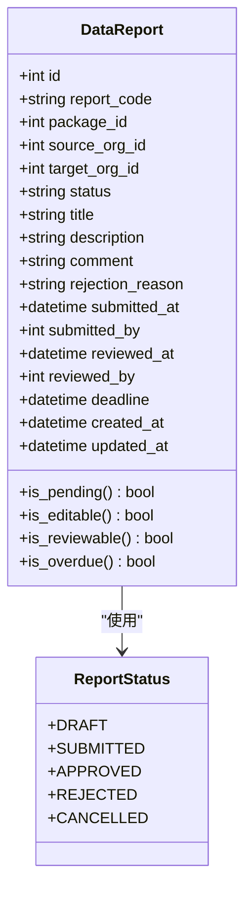
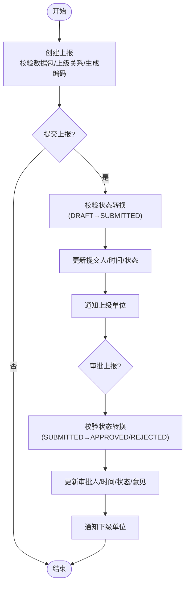
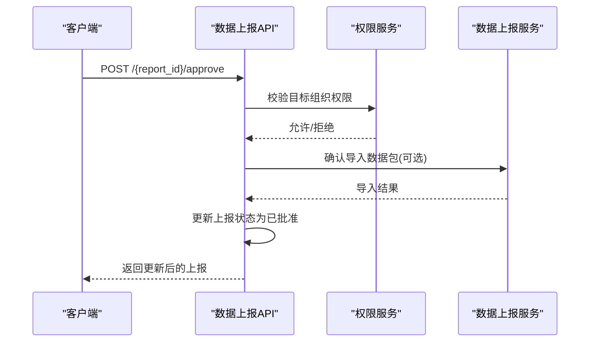
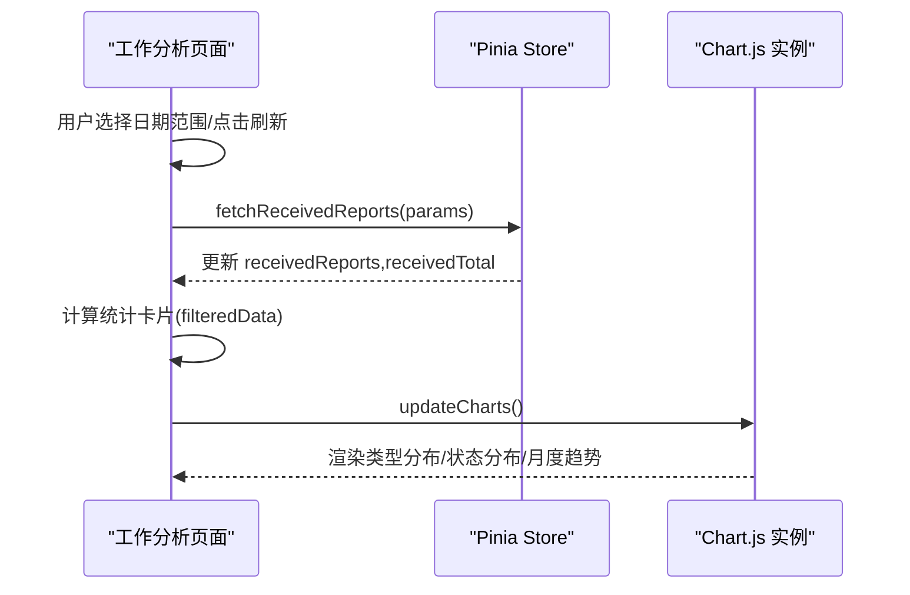
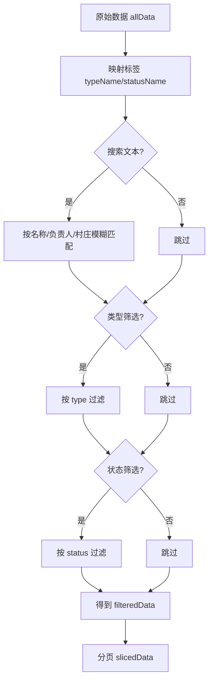
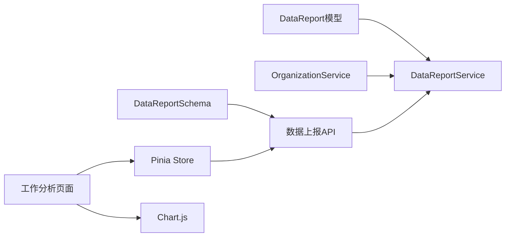

# 数据报表状态

<cite>
**本文引用的文件**
- [backend/app/models/data_report.py](file://backend/app/models/data_report.py)
- [backend/app/schemas/data_report.py](file://backend/app/schemas/data_report.py)
- [backend/app/services/data_report_service.py](file://backend/app/services/data_report_service.py)
- [backend/app/api/v1/data/data/data_reports.py](file://backend/app/api/v1/data/data/data_reports.py)
- [frontend/src/stores/dataReport.ts](file://frontend/src/stores/dataReport.ts)
- [frontend/src/views/analytics/reports/WorkAnalysis.vue](file://frontend/src/views/analytics/reports/WorkAnalysis.vue)
</cite>

## 目录
1. [简介](#简介)
2. [项目结构](#项目结构)
3. [核心组件](#核心组件)
4. [架构总览](#架构总览)
5. [详细组件分析](#详细组件分析)
6. [依赖关系分析](#依赖关系分析)
7. [性能考虑](#性能考虑)
8. [故障排查指南](#故障排查指南)
9. [结论](#结论)
10. [附录](#附录)

## 简介
本技术文档围绕“数据报表状态”展开，聚焦后端的数据上报模型、服务与API，以及前端的Pinia状态管理与可视化集成。重点说明：
- 报表数据、查询条件、图表配置等核心状态字段的设计与流转
- 分页加载、实时刷新、数据过滤的状态管理策略
- 复杂报表场景（多维度分析、时间序列、对比分析）的状态管理模式
- 报表状态与可视化组件的集成方式（数据绑定、交互响应、动态更新）
- 性能优化策略（预加载、增量更新、内存管理）

## 项目结构
本项目在前后端分离架构下实现数据报表能力：
- 后端通过FastAPI暴露数据上报相关接口，使用SQLAlchemy ORM持久化，Pydantic进行请求/响应校验
- 前端通过Pinia集中管理报表列表、当前选中项、加载与错误状态，并通过Chart.js渲染图表
- 视图层负责用户交互（筛选、分页、刷新、导出），并驱动状态更新与图表重绘

**图示来源**
- [backend/app/api/v1/data/data/data_reports.py:1-487](file://backend/app/api/v1/data/data/data_reports.py#L1-L487)
- [backend/app/services/data_report_service.py:1-492](file://backend/app/services/data_report_service.py#L1-L492)
- [backend/app/models/data_report.py:1-141](file://backend/app/models/data_report.py#L1-L141)
- [backend/app/schemas/data_report.py:1-107](file://backend/app/schemas/data_report.py#L1-L107)
- [frontend/src/stores/dataReport.ts:1-126](file://frontend/src/stores/dataReport.ts#L1-L126)
- [frontend/src/views/analytics/reports/WorkAnalysis.vue:1-799](file://frontend/src/views/analytics/reports/WorkAnalysis.vue#L1-L799)

**章节来源**
- [backend/app/api/v1/data/data/data_reports.py:1-487](file://backend/app/api/v1/data/data/data_reports.py#L1-L487)
- [backend/app/services/data_report_service.py:1-492](file://backend/app/services/data_report_service.py#L1-L492)
- [backend/app/models/data_report.py:1-141](file://backend/app/models/data_report.py#L1-L141)
- [backend/app/schemas/data_report.py:1-107](file://backend/app/schemas/data_report.py#L1-L107)
- [frontend/src/stores/dataReport.ts:1-126](file://frontend/src/stores/dataReport.ts#L1-L126)
- [frontend/src/views/analytics/reports/WorkAnalysis.vue:1-799](file://frontend/src/views/analytics/reports/WorkAnalysis.vue#L1-L799)

## 核心组件
- 数据上报模型与状态枚举：定义上报生命周期状态（草稿、已提交、已批准、已拒绝、已取消）及属性（编码、数据包ID、来源/目标组织、提交/审批时间、截止时间等）
- 数据上报服务：封装创建、提交、审批、查询、统计、下级单位仪表板等核心业务逻辑，包含状态转换校验与通知机制
- 数据上报API：提供分页列表、待审批、接收列表、详情、预览、下载、批准等REST接口，并进行权限校验
- 前端Pinia Store：统一管理上报列表、当前上报、加载与错误状态，封装获取列表、预览、批准、拒绝、下载、提交等方法
- 工作分析页面：维护本地筛选、分页、图表实例，驱动数据加载与图表更新

**章节来源**
- [backend/app/models/data_report.py:19-141](file://backend/app/models/data_report.py#L19-L141)
- [backend/app/services/data_report_service.py:81-492](file://backend/app/services/data_report_service.py#L81-L492)
- [backend/app/api/v1/data/data/data_reports.py:44-487](file://backend/app/api/v1/data/data/data_reports.py#L44-L487)
- [frontend/src/stores/dataReport.ts:6-126](file://frontend/src/stores/dataReport.ts#L6-L126)
- [frontend/src/views/analytics/reports/WorkAnalysis.vue:170-799](file://frontend/src/views/analytics/reports/WorkAnalysis.vue#L170-L799)

## 架构总览
数据报表状态贯穿“前端状态 → 后端API → 服务层 → 数据模型”的完整链路，关键流程如下：

**图示来源**
- [frontend/src/stores/dataReport.ts:16-38](file://frontend/src/stores/dataReport.ts#L16-L38)
- [backend/app/api/v1/data/data/data_reports.py:128-164](file://backend/app/api/v1/data/data/data_reports.py#L128-L164)
- [backend/app/services/data_report_service.py:241-261](file://backend/app/services/data_report_service.py#L241-L261)
- [backend/app/models/data_report.py:29-113](file://backend/app/models/data_report.py#L29-L113)

## 详细组件分析

### 数据上报模型与状态设计
- 状态枚举：支持草稿、已提交、已批准、已拒绝、已取消，并提供便捷属性判断（是否待审、可编辑、可审批、是否逾期）
- 关键字段：上报编码、数据包ID、来源/目标组织、状态、标题、描述、意见、拒绝原因、提交/审批时间、截止时间、创建/更新时间
- 索引优化：针对来源组织、目标组织、状态、提交时间、截止时间建立索引，提升查询性能

**图示来源**
- [backend/app/models/data_report.py:19-141](file://backend/app/models/data_report.py#L19-L141)

**章节来源**
- [backend/app/models/data_report.py:19-141](file://backend/app/models/data_report.py#L19-L141)

### 数据上报服务与状态流转
- 有效状态转换：定义从草稿到提交/取消、提交到批准/拒绝、拒绝到提交/取消的合法转换路径
- 创建上报：校验数据包存在性、目标组织为上级、生成唯一上报编码、写入初始状态为草稿
- 提交上报：校验状态转换、更新提交信息与时间、发送通知给上级
- 审批上报：根据动作确定目标状态、校验转换、更新审批信息与时间、发送通知给下级
- 查询与统计：支持下级上报列表、本单位提交列表、统计信息（总数、各状态计数、逾期数、批准率、按月统计）、下级单位仪表板（一次性批量查询避免N+1）

**图示来源**
- [backend/app/services/data_report_service.py:87-103](file://backend/app/services/data_report_service.py#L87-L103)
- [backend/app/services/data_report_service.py:110-193](file://backend/app/services/data_report_service.py#L110-L193)
- [backend/app/services/data_report_service.py:195-235](file://backend/app/services/data_report_service.py#L195-L235)
- [backend/app/services/data_report_service.py:448-467](file://backend/app/services/data_report_service.py#L448-L467)

**章节来源**
- [backend/app/services/data_report_service.py:81-492](file://backend/app/services/data_report_service.py#L81-L492)

### 数据上报API与权限控制
- 列表接口：支持方向参数（received/submitted）、分页、状态筛选；返回统一分页结构
- 待审批接口：仅返回状态为已提交的记录
- 接收列表接口：直接基于目标组织查询，支持状态过滤与分页
- 详情/预览/下载：权限校验（来源/目标组织或上级访问），预览返回上报与数据包摘要，下载优先返回物理文件否则返回JSON摘要
- 批准接口：批准后导入数据包并更新状态

**图示来源**
- [backend/app/api/v1/data/data/data_reports.py:313-360](file://backend/app/api/v1/data/data/data_reports.py#L313-L360)
- [backend/app/api/v1/data/data/data_reports.py:167-186](file://backend/app/api/v1/data/data/data_reports.py#L167-L186)
- [backend/app/api/v1/data/data/data_reports.py:387-433](file://backend/app/api/v1/data/data/data_reports.py#L387-L433)
- [backend/app/api/v1/data/data/data_reports.py:436-487](file://backend/app/api/v1/data/data/data_reports.py#L436-L487)

**章节来源**
- [backend/app/api/v1/data/data/data_reports.py:44-487](file://backend/app/api/v1/data/data/data_reports.py#L44-L487)

### 前端状态管理与可视化集成
- Pinia Store：维护上报列表、当前上报、加载与错误状态；封装获取接收列表、通用列表、预览、批准、拒绝、下载、提交等方法
- 工作分析页面：维护本地筛选（类型、状态、搜索）、分页、图表实例；数据加载后计算统计卡片、更新图表、处理导出
- 图表集成：使用Chart.js创建饼图、柱状图、折线图；数据变化时销毁旧实例并重建，确保内存安全与渲染正确

**图示来源**
- [frontend/src/stores/dataReport.ts:16-38](file://frontend/src/stores/dataReport.ts#L16-L38)
- [frontend/src/views/analytics/reports/WorkAnalysis.vue:227-341](file://frontend/src/views/analytics/reports/WorkAnalysis.vue#L227-L341)
- [frontend/src/views/analytics/reports/WorkAnalysis.vue:344-501](file://frontend/src/views/analytics/reports/WorkAnalysis.vue#L344-L501)

**章节来源**
- [frontend/src/stores/dataReport.ts:6-126](file://frontend/src/stores/dataReport.ts#L6-L126)
- [frontend/src/views/analytics/reports/WorkAnalysis.vue:170-799](file://frontend/src/views/analytics/reports/WorkAnalysis.vue#L170-L799)

### 复杂报表场景下的状态管理模式
- 多维度分析：通过前端computed派生filteredData，结合类型、状态、搜索词进行多维过滤；后端支持按状态与分页查询
- 时间序列数据：工作分析页面基于数据中的开始/创建时间计算月度新增与完成数量，生成趋势折线图
- 对比分析：统计卡片展示总数、进行中、已完成、平均进度等指标，便于横向对比；后端统计接口提供按来源组织与月份的聚合数据

**图示来源**
- [frontend/src/views/analytics/reports/WorkAnalysis.vue:277-308](file://frontend/src/views/analytics/reports/WorkAnalysis.vue#L277-L308)

**章节来源**
- [frontend/src/views/analytics/reports/WorkAnalysis.vue:227-341](file://frontend/src/views/analytics/reports/WorkAnalysis.vue#L227-L341)
- [backend/app/services/data_report_service.py:285-344](file://backend/app/services/data_report_service.py#L285-L344)

## 依赖关系分析
- 模型依赖：DataReport关联DataPackage、Organization、User，形成上报与数据包、组织、用户的强关系
- 服务依赖：DataReportService依赖OrganizationService进行上下级关系校验，依赖NotificationService发送通知
- API依赖：路由依赖权限服务进行访问控制，依赖事务工具保证写操作一致性
- 前端依赖：Store依赖apiRequest进行HTTP通信，依赖unwrapList解析统一响应格式；页面依赖Chart.js进行可视化

**图示来源**
- [backend/app/models/data_report.py:99-113](file://backend/app/models/data_report.py#L99-L113)
- [backend/app/services/data_report_service.py:105-108](file://backend/app/services/data_report_service.py#L105-L108)
- [backend/app/api/v1/data/data/data_reports.py:36-41](file://backend/app/api/v1/data/data/data_reports.py#L36-L41)
- [frontend/src/stores/dataReport.ts:1-5](file://frontend/src/stores/dataReport.ts#L1-L5)
- [frontend/src/views/analytics/reports/WorkAnalysis.vue:170-187](file://frontend/src/views/analytics/reports/WorkAnalysis.vue#L170-L187)

**章节来源**
- [backend/app/models/data_report.py:99-113](file://backend/app/models/data_report.py#L99-L113)
- [backend/app/services/data_report_service.py:105-108](file://backend/app/services/data_report_service.py#L105-L108)
- [backend/app/api/v1/data/data/data_reports.py:36-41](file://backend/app/api/v1/data/data/data_reports.py#L36-L41)
- [frontend/src/stores/dataReport.ts:1-5](file://frontend/src/stores/dataReport.ts#L1-L5)
- [frontend/src/views/analytics/reports/WorkAnalysis.vue:170-187](file://frontend/src/views/analytics/reports/WorkAnalysis.vue#L170-L187)

## 性能考虑
- 分页与索引：后端对列表查询使用skip/limit分页，并对常用过滤字段建立索引（来源组织、目标组织、状态、提交时间、截止时间），减少全表扫描
- 批量查询避免N+1：下级单位仪表板一次性查询所有相关报告并按组织分组，避免多次单独查询
- 前端内存管理：图表实例在更新前销毁，防止内存泄漏；大数据集采用本地分页与过滤，降低渲染压力
- 网络优化：Store设置合理超时，统一错误处理与兜底文案，提升用户体验
- 缓存建议：对于高频统计与仪表板数据，可在后端引入Redis缓存（如按组织维度缓存统计数据），并结合版本号或时间戳失效策略

[本节为通用性能指导，不直接分析具体文件]

## 故障排查指南
- 上报不存在：当请求的上报ID无效时，服务层抛出特定错误，API层转换为404响应
- 状态错误：状态转换不符合规则时，服务层抛出状态错误，API层返回400并附带错误信息
- 权限不足：查看/审批/下载等操作需校验来源/目标组织或上级权限，失败时返回403
- 前端错误处理：Store捕获网络异常并设置error状态，页面显示友好提示；图表更新失败时回退为空数据

**章节来源**
- [backend/app/services/data_report_service.py:30-46](file://backend/app/services/data_report_service.py#L30-L46)
- [backend/app/api/v1/data/data/data_reports.py:167-186](file://backend/app/api/v1/data/data/data_reports.py#L167-L186)
- [backend/app/api/v1/data/data/data_reports.py:227-251](file://backend/app/api/v1/data/data/data_reports.py#L227-L251)
- [frontend/src/stores/dataReport.ts:16-38](file://frontend/src/stores/dataReport.ts#L16-L38)

## 结论
本系统通过清晰的状态模型、严谨的服务层状态转换、完善的API权限控制，以及前端Pinia与Chart.js的紧密集成，实现了数据报表的全生命周期管理。针对复杂报表场景，提供了多维度过滤、时间序列分析与对比分析的支撑。性能方面通过分页、索引、批量查询与前端内存管理保障体验。后续可进一步引入缓存与增量更新机制，以应对更大规模数据与更高并发场景。

[本节为总结性内容，不直接分析具体文件]

## 附录
- 状态字段参考：上报状态枚举、上报记录关键字段、统计字段（总数、各状态计数、逾期数、批准率、按月统计）
- API参考：列表、待审批、接收列表、详情、预览、下载、批准、提交、拒绝等接口及其参数与返回结构
- 前端状态参考：Pinia Store中的列表、当前项、加载与错误状态，以及方法签名与职责划分

[本节为补充信息，不直接分析具体文件]