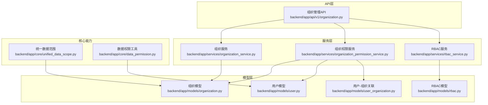
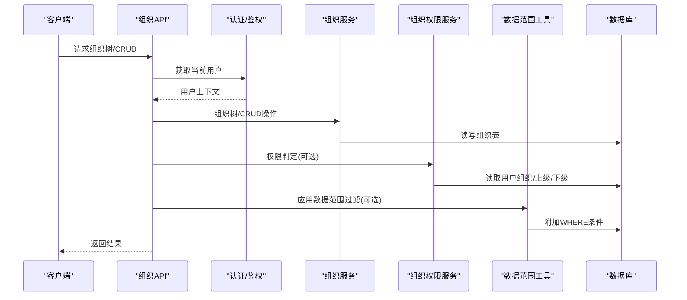
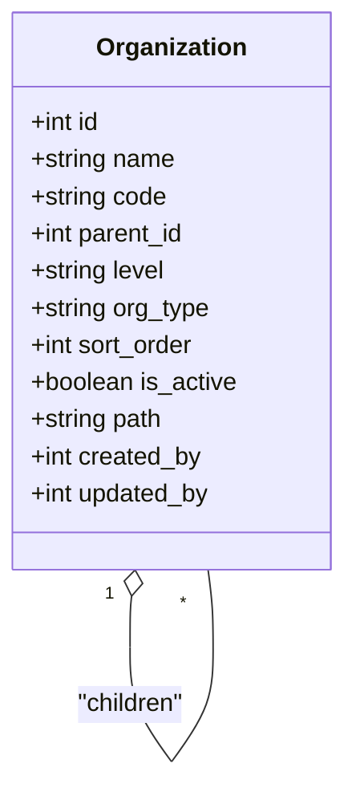
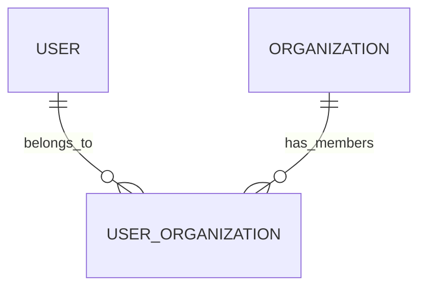
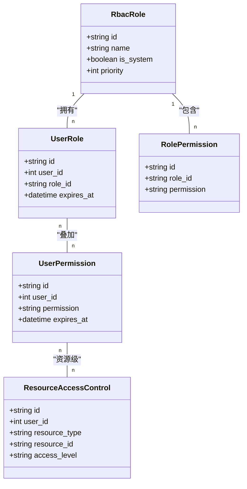
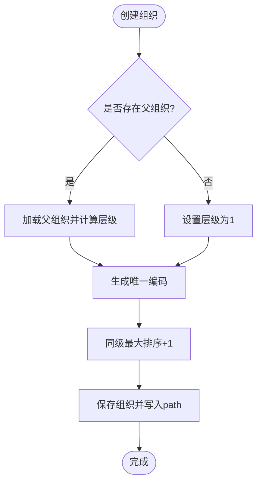
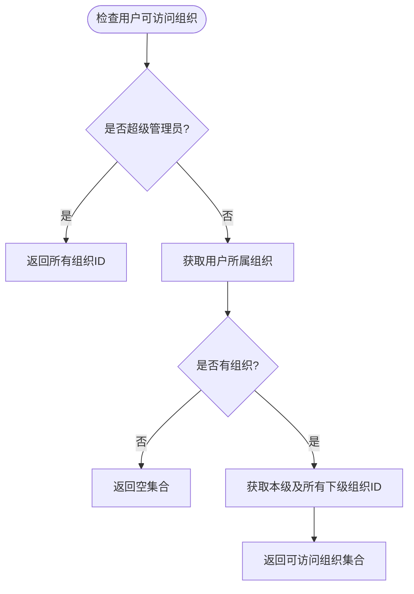
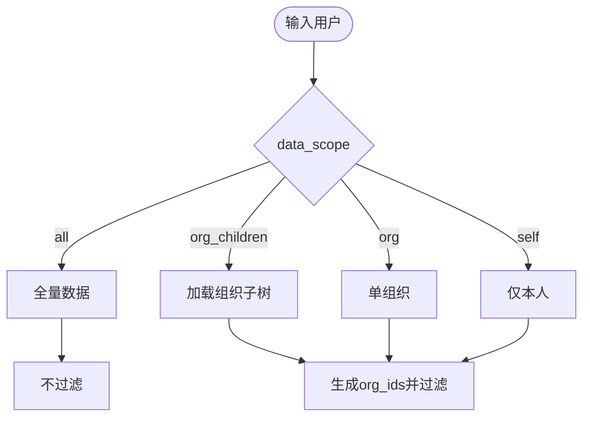
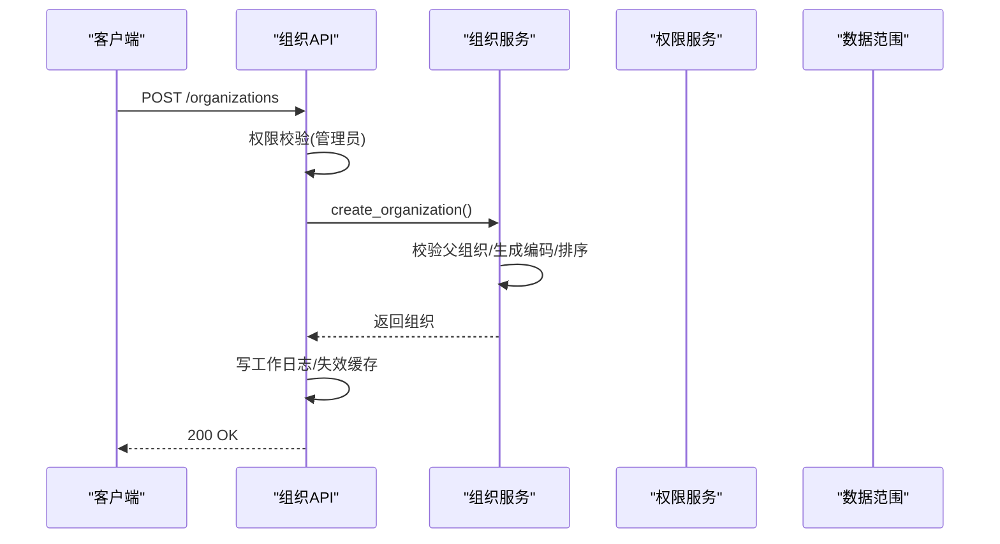
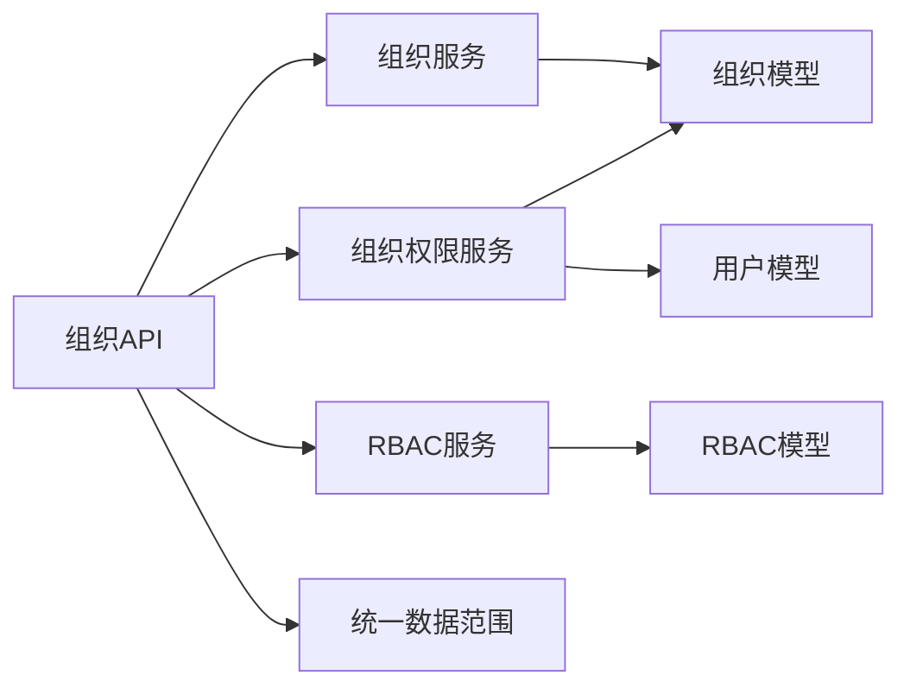

# 组织管理状态

<cite>
**本文引用的文件**
- [backend/app/models/organization.py](file://backend/app/models/organization.py)
- [backend/app/models/user.py](file://backend/app/models/user.py)
- [backend/app/models/user_organization.py](file://backend/app/models/user_organization.py)
- [backend/app/models/rbac.py](file://backend/app/models/rbac.py)
- [backend/app/schemas/organization.py](file://backend/app/schemas/organization.py)
- [backend/app/api/v1/organization.py](file://backend/app/api/v1/organization.py)
- [backend/app/services/organization_service.py](file://backend/app/services/organization_service.py)
- [backend/app/services/organization_permission_service.py](file://backend/app/services/organization_permission_service.py)
- [backend/app/core/data_permission.py](file://backend/app/core/data_permission.py)
- [backend/app/core/unified_data_scope.py](file://backend/app/core/unified_data_scope.py)
- [backend/app/services/rbac_service.py](file://backend/app/services/rbac_service.py)
</cite>

## 目录
1. [简介](#简介)
2. [项目结构](#项目结构)
3. [核心组件](#核心组件)
4. [架构总览](#架构总览)
5. [详细组件分析](#详细组件分析)
6. [依赖关系分析](#依赖关系分析)
7. [性能考虑](#性能考虑)
8. [故障排查指南](#故障排查指南)
9. [结论](#结论)
10. [附录](#附录)

## 简介
本技术文档聚焦“组织管理状态”的完整设计与实现，覆盖组织架构树、用户与组织的关系、部门信息、权限继承与数据隔离等核心状态字段；说明组织层级关系的维护机制（父子关系、路径前缀、排序）、组织相关的 CRUD 操作及其状态管理；阐述组织状态与认证、权限控制的集成方式（角色权限验证、菜单控制、数据范围限制）；并提供面向多级组织架构与复杂权限体系的扩展性设计建议。

## 项目结构
后端围绕“模型-服务-API”分层组织：
- 模型层：定义组织、用户、RBAC 等实体及关系
- 服务层：封装组织树构建、权限判定、数据范围过滤等业务逻辑
- API 层：暴露组织管理接口，负责鉴权、参数校验、缓存失效与审计日志

**图表来源**
- [backend/app/api/v1/organization.py:1-120](file://backend/app/api/v1/organization.py#L1-L120)
- [backend/app/services/organization_service.py:70-160](file://backend/app/services/organization_service.py#L70-L160)
- [backend/app/services/organization_permission_service.py:45-130](file://backend/app/services/organization_permission_service.py#L45-L130)
- [backend/app/core/unified_data_scope.py:187-343](file://backend/app/core/unified_data_scope.py#L187-L343)
- [backend/app/core/data_permission.py:20-187](file://backend/app/core/data_permission.py#L20-L187)
- [backend/app/models/organization.py:31-78](file://backend/app/models/organization.py#L31-L78)
- [backend/app/models/user.py:26-90](file://backend/app/models/user.py#L26-L90)
- [backend/app/models/user_organization.py:21-69](file://backend/app/models/user_organization.py#L21-L69)
- [backend/app/models/rbac.py:31-160](file://backend/app/models/rbac.py#L31-L160)

**章节来源**
- [backend/app/api/v1/organization.py:1-120](file://backend/app/api/v1/organization.py#L1-L120)
- [backend/app/services/organization_service.py:70-160](file://backend/app/services/organization_service.py#L70-L160)
- [backend/app/services/organization_permission_service.py:45-130](file://backend/app/services/organization_permission_service.py#L45-L130)
- [backend/app/core/unified_data_scope.py:187-343](file://backend/app/core/unified_data_scope.py#L187-L343)
- [backend/app/core/data_permission.py:20-187](file://backend/app/core/data_permission.py#L20-L187)
- [backend/app/models/organization.py:31-78](file://backend/app/models/organization.py#L31-L78)
- [backend/app/models/user.py:26-90](file://backend/app/models/user.py#L26-L90)
- [backend/app/models/user_organization.py:21-69](file://backend/app/models/user_organization.py#L21-L69)
- [backend/app/models/rbac.py:31-160](file://backend/app/models/rbac.py#L31-L160)

## 核心组件
- 组织模型：支持自引用树形结构、路径前缀、层级与类型、排序、启用状态、联系人加密等
- 用户模型：包含所属组织、数据范围、白名单权限、可见菜单、权限包绑定等
- 用户-组织关联：支持多组织归属与组织内角色
- RBAC 模型：角色、用户角色、角色权限、用户直接权限、资源访问控制、访问日志、机器码权限
- 组织服务：创建/查询/更新/删除组织、构建树、获取下级/祖先、排序批量更新、防循环引用
- 组织权限服务：计算可访问组织集合、管理权限判定、数据范围过滤条件生成
- 数据范围工具：基于角色的数据范围（全部/本部门/本人）与基于组织树的范围过滤
- API：组织列表、树、统计、导出、CRUD、移动、排序、子级/祖先查询等

**章节来源**
- [backend/app/models/organization.py:31-78](file://backend/app/models/organization.py#L31-L78)
- [backend/app/models/user.py:26-90](file://backend/app/models/user.py#L26-L90)
- [backend/app/models/user_organization.py:21-69](file://backend/app/models/user_organization.py#L21-L69)
- [backend/app/models/rbac.py:31-160](file://backend/app/models/rbac.py#L31-L160)
- [backend/app/services/organization_service.py:70-521](file://backend/app/services/organization_service.py#L70-L521)
- [backend/app/services/organization_permission_service.py:45-452](file://backend/app/services/organization_permission_service.py#L45-L452)
- [backend/app/core/unified_data_scope.py:187-343](file://backend/app/core/unified_data_scope.py#L187-L343)
- [backend/app/core/data_permission.py:20-187](file://backend/app/core/data_permission.py#L20-L187)
- [backend/app/api/v1/organization.py:126-800](file://backend/app/api/v1/organization.py#L126-L800)

## 架构总览
组织管理状态由“组织树 + 用户-组织关系 + RBAC + 数据范围”共同构成。API 接收请求后，先进行身份认证与角色/权限校验，再调用服务层完成组织树操作或权限判定，最终通过数据范围工具对业务数据进行隔离过滤。

**图表来源**
- [backend/app/api/v1/organization.py:126-800](file://backend/app/api/v1/organization.py#L126-L800)
- [backend/app/services/organization_service.py:82-160](file://backend/app/services/organization_service.py#L82-L160)
- [backend/app/services/organization_permission_service.py:90-175](file://backend/app/services/organization_permission_service.py#L90-L175)
- [backend/app/core/unified_data_scope.py:279-343](file://backend/app/core/unified_data_scope.py#L279-L343)

## 详细组件分析

### 组织模型与树形结构
- 自引用关系：parent_id 指向父组织，children 反向关系用于树遍历
- 路径前缀 path：以“/id/”形式存储祖先链，便于快速匹配子树
- 层级 level、类型 org_type、排序 sort_order：支撑展示与拖拽排序
- 启用状态 is_active：软停用组织，不影响历史数据
- 索引优化：name、parent_id、org_type、is_active、level、created_by 等列建立索引

**图表来源**
- [backend/app/models/organization.py:31-78](file://backend/app/models/organization.py#L31-L78)

**章节来源**
- [backend/app/models/organization.py:31-78](file://backend/app/models/organization.py#L31-L78)

### 用户与组织关系
- 用户模型包含 organization_id（所属组织）、data_scope（数据范围）、allowed_menus（可见菜单）、permission_pack_id（权限包）等
- 用户-组织关联表 user_organizations 支持多组织归属与组织内角色（admin/member/viewer）

**图表来源**
- [backend/app/models/user.py:26-90](file://backend/app/models/user.py#L26-L90)
- [backend/app/models/user_organization.py:21-69](file://backend/app/models/user_organization.py#L21-L69)

**章节来源**
- [backend/app/models/user.py:26-90](file://backend/app/models/user.py#L26-L90)
- [backend/app/models/user_organization.py:21-69](file://backend/app/models/user_organization.py#L21-L69)

### RBAC 权限体系
- 角色 RbacRole：名称、描述、是否系统内置、优先级、启用状态
- 用户角色 UserRole：用户与角色关联，支持过期时间
- 角色权限 RolePermission：角色到权限标识的映射
- 用户直接权限 UserPermission：用户到权限标识的直接授权
- 资源访问控制 ResourceAccessControl：用户对具体资源的访问级别
- 访问日志 AccessLog：记录权限检查与访问结果
- 机器码权限 MachineCodePermission：按机器码限制功能权限

**图表来源**
- [backend/app/models/rbac.py:31-160](file://backend/app/models/rbac.py#L31-L160)

**章节来源**
- [backend/app/models/rbac.py:31-160](file://backend/app/models/rbac.py#L31-L160)
- [backend/app/services/rbac_service.py:104-223](file://backend/app/services/rbac_service.py#L104-L223)

### 组织服务：树构建与层级维护
- 创建组织：校验父组织、生成编码、计算层级与排序、写入 path
- 获取组织树：按根节点或顶级组织加载，使用 path 前缀匹配子树并递归构建
- 获取下级/祖先：path 前缀匹配与解析祖先ID
- 更新/删除：更新时禁止将自身设为父级；删除前检查激活子组织与业务引用
- 批量排序：批量更新 sort_order

**图表来源**
- [backend/app/services/organization_service.py:82-156](file://backend/app/services/organization_service.py#L82-L156)

**章节来源**
- [backend/app/services/organization_service.py:82-156](file://backend/app/services/organization_service.py#L82-L156)
- [backend/app/services/organization_service.py:182-243](file://backend/app/services/organization_service.py#L182-L243)
- [backend/app/services/organization_service.py:245-316](file://backend/app/services/organization_service.py#L245-L316)
- [backend/app/services/organization_service.py:318-398](file://backend/app/services/organization_service.py#L318-L398)
- [backend/app/services/organization_service.py:466-521](file://backend/app/services/organization_service.py#L466-L521)

### 组织权限服务：访问控制与数据范围
- 可访问组织集合：超级管理员全量；普通用户为其所属组织及所有下级
- 管理权限：超级管理员可管理所有；普通用户仅能管理其组织的下级组织（不能管理自身组织）
- 数据范围过滤：根据可访问组织生成 in_(org_ids) 条件
- 访问尝试日志：记录允许/拒绝与IP等信息

**图表来源**
- [backend/app/services/organization_permission_service.py:90-141](file://backend/app/services/organization_permission_service.py#L90-L141)

**章节来源**
- [backend/app/services/organization_permission_service.py:90-175](file://backend/app/services/organization_permission_service.py#L90-L175)
- [backend/app/services/organization_permission_service.py:202-277](file://backend/app/services/organization_permission_service.py#L202-L277)
- [backend/app/services/organization_permission_service.py:278-311](file://backend/app/services/organization_permission_service.py#L278-L311)

### 数据范围工具：角色与组织树双通道
- 角色数据范围：all（超级管理员）、own_dept（管理员/本部门）、own（仅本人）
- 组织树数据范围：基于用户 data_scope 字段与 organization_id 计算组织子树
- 统一入口：unified_data_scope 提供 get_org_scope 与 filter_by_org_ids

**图表来源**
- [backend/app/core/unified_data_scope.py:56-120](file://backend/app/core/unified_data_scope.py#L56-L120)
- [backend/app/core/unified_data_scope.py:279-343](file://backend/app/core/unified_data_scope.py#L279-L343)

**章节来源**
- [backend/app/core/data_permission.py:20-187](file://backend/app/core/data_permission.py#L20-L187)
- [backend/app/core/unified_data_scope.py:56-120](file://backend/app/core/unified_data_scope.py#L56-L120)
- [backend/app/core/unified_data_scope.py:279-343](file://backend/app/core/unified_data_scope.py#L279-L343)

### API 层：组织管理端点与状态同步
- 列表/树/统计/导出：分页、过滤、缓存命中与失效
- 创建/更新/删除：权限校验、编码唯一性、枚举转换、软删除、工作日志
- 移动组织：防止循环引用、刷新缓存
- 批量排序：事务化批量更新

**图表来源**
- [backend/app/api/v1/organization.py:511-577](file://backend/app/api/v1/organization.py#L511-L577)
- [backend/app/services/organization_service.py:82-156](file://backend/app/services/organization_service.py#L82-L156)

**章节来源**
- [backend/app/api/v1/organization.py:126-800](file://backend/app/api/v1/organization.py#L126-L800)

## 依赖关系分析
- API 依赖服务：组织API 调用组织服务、权限服务、RBAC 服务
- 服务依赖模型：组织服务/权限服务依赖组织、用户、RBAC 模型
- 数据范围工具被多处复用：统一在 unified_data_scope 中聚合
- 外部依赖：数据库会话、缓存管理器、审计日志

**图表来源**
- [backend/app/api/v1/organization.py:1-120](file://backend/app/api/v1/organization.py#L1-L120)
- [backend/app/services/organization_service.py:70-160](file://backend/app/services/organization_service.py#L70-L160)
- [backend/app/services/organization_permission_service.py:45-130](file://backend/app/services/organization_permission_service.py#L45-L130)
- [backend/app/services/rbac_service.py:104-223](file://backend/app/services/rbac_service.py#L104-L223)
- [backend/app/core/unified_data_scope.py:279-343](file://backend/app/core/unified_data_scope.py#L279-L343)

**章节来源**
- [backend/app/api/v1/organization.py:1-120](file://backend/app/api/v1/organization.py#L1-L120)
- [backend/app/services/organization_service.py:70-160](file://backend/app/services/organization_service.py#L70-L160)
- [backend/app/services/organization_permission_service.py:45-130](file://backend/app/services/organization_permission_service.py#L45-L130)
- [backend/app/services/rbac_service.py:104-223](file://backend/app/services/rbac_service.py#L104-L223)
- [backend/app/core/unified_data_scope.py:279-343](file://backend/app/core/unified_data_scope.py#L279-L343)

## 性能考虑
- 组织树查询：使用 path 前缀匹配减少递归深度，避免全表扫描
- 索引策略：对 parent_id、org_type、is_active、level、name 等高频查询列建立索引
- 缓存策略：默认无过滤的组织列表使用缓存，写操作后主动失效
- 批量操作：批量排序与权限授予采用预查询与批量写入，降低数据库往返
- 数据范围：优先使用 in_(org_ids) 条件，避免多次子查询

[本节为通用性能建议，不直接分析具体文件]

## 故障排查指南
- 组织不存在：检查 org_id 是否存在，确认软删除状态
- 存在子组织无法删除：先处理激活的子组织或迁移数据
- 编码重复：确保 code 唯一性或交由服务自动生成
- 权限不足：检查用户角色、直接权限、机器码限制与白名单
- 数据范围异常：核对用户 data_scope 与 organization_id 配置
- 缓存不一致：写操作后确认缓存已失效

**章节来源**
- [backend/app/services/organization_service.py:351-398](file://backend/app/services/organization_service.py#L351-L398)
- [backend/app/services/organization_permission_service.py:143-200](file://backend/app/services/organization_permission_service.py#L143-L200)
- [backend/app/services/rbac_service.py:133-223](file://backend/app/services/rbac_service.py#L133-L223)
- [backend/app/api/v1/organization.py:632-700](file://backend/app/api/v1/organization.py#L632-L700)

## 结论
组织管理状态以“组织树 + 用户-组织关系 + RBAC + 数据范围”为核心，通过路径前缀与索引优化高效维护层级关系；服务层封装了创建、查询、更新、删除、移动、排序等关键操作，并结合权限服务与数据范围工具实现细粒度的访问控制与数据隔离；API 层提供完整的组织管理能力，并在写操作后及时失效缓存以保证一致性。该设计具备良好的扩展性，可支撑多级组织架构与复杂权限体系。

[本节为总结性内容，不直接分析具体文件]

## 附录
- 扩展建议
  - 引入组织代码前缀与层级规则引擎，支持更灵活的编码策略
  - 增加组织模板与批量导入，提升大规模组织初始化效率
  - 强化审计日志与变更追踪，记录组织结构调整的历史轨迹
  - 结合前端菜单控制与权限包，实现更精细的功能可见性管理

[本节为概念性内容，不直接分析具体文件]