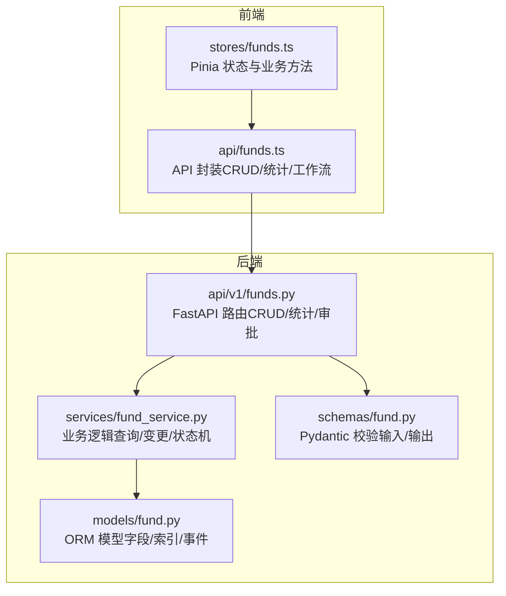
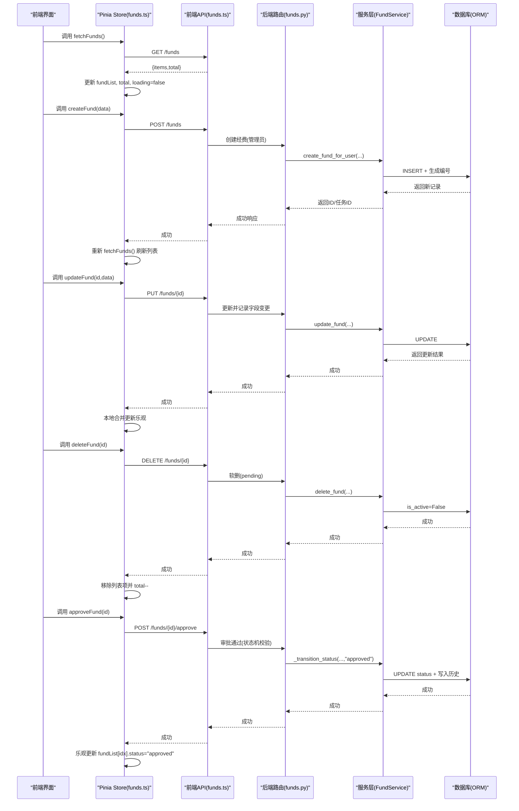
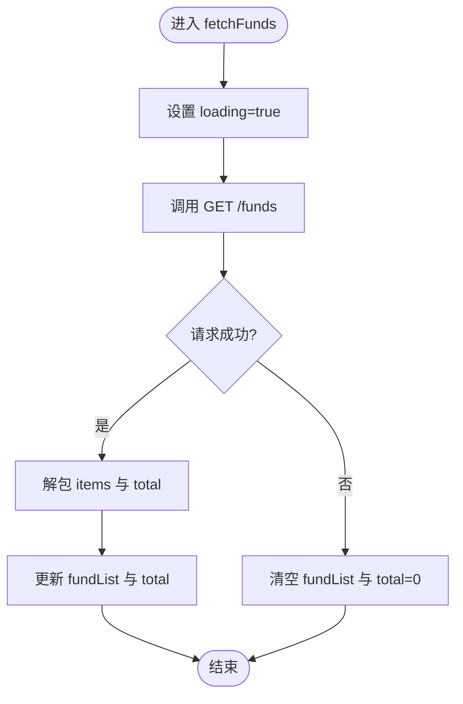
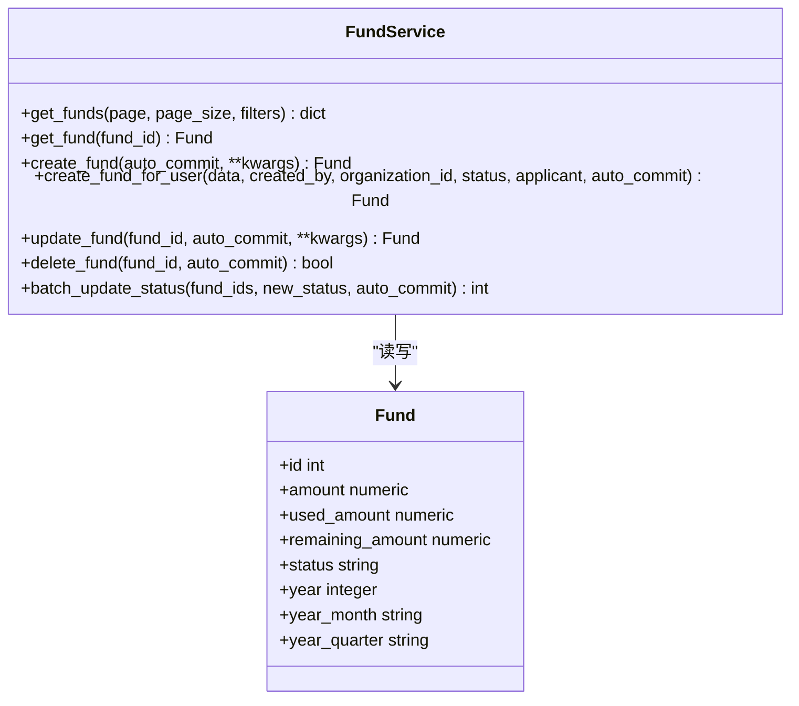
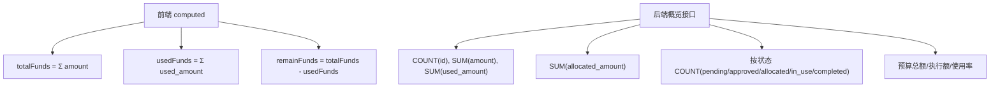
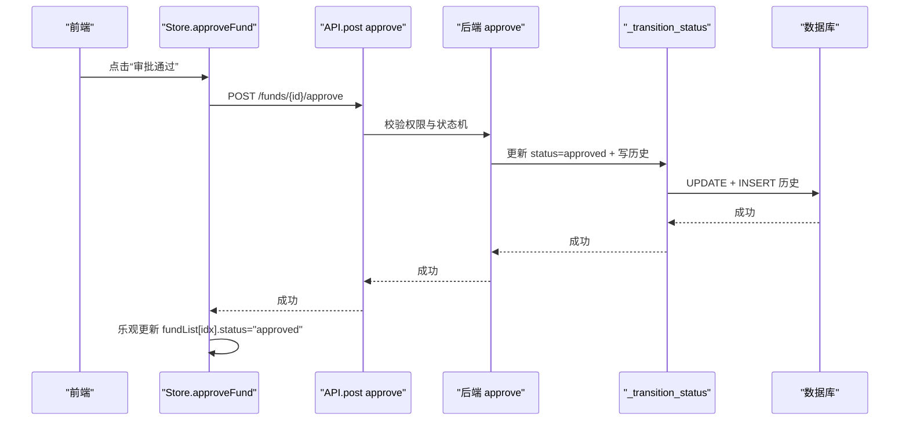
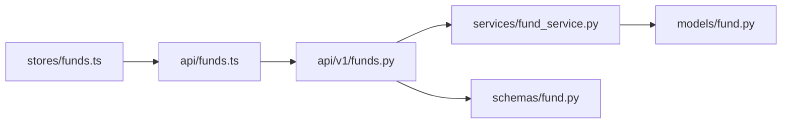

# 经费管理状态

<cite>
**本文引用的文件**
- [frontend/src/stores/funds.ts](file://frontend/src/stores/funds.ts)
- [backend/app/api/v1/funds.py](file://backend/app/api/v1/funds.py)
- [backend/app/services/fund_service.py](file://backend/app/services/fund_service.py)
- [backend/app/models/fund.py](file://backend/app/models/fund.py)
- [backend/app/schemas/fund.py](file://backend/app/schemas/fund.py)
- [frontend/src/api/funds.ts](file://frontend/src/api/funds.ts)
</cite>

## 目录
1. [简介](#简介)
2. [项目结构](#项目结构)
3. [核心组件](#核心组件)
4. [架构总览](#架构总览)
5. [详细组件分析](#详细组件分析)
6. [依赖关系分析](#依赖关系分析)
7. [性能考量](#性能考量)
8. [故障排查指南](#故障排查指南)
9. [结论](#结论)

## 简介
本技术文档聚焦“经费管理”模块的前端状态设计与后端实现，系统性说明：
- 前端 Pinia Store 中的核心状态字段：经费列表、当前经费、加载状态、总数及统计派生值。
- 经费数据的 CRUD 操作：获取列表、创建、更新、删除与审批的完整链路。
- 经费统计计算逻辑：总额、已使用金额、剩余金额的计算方式与数据来源。
- 审批流程的状态同步机制：approveFund 的乐观更新策略与后端状态机校验。
- 前后端交互模式、错误处理与数据一致性保障方案。

## 项目结构
经费管理涉及前端状态管理、API 封装、后端路由、服务层、模型与 Schema 等层次。下图展示关键文件与职责划分：

图表来源
- [frontend/src/stores/funds.ts:1-102](file://frontend/src/stores/funds.ts#L1-L102)
- [frontend/src/api/funds.ts:1-297](file://frontend/src/api/funds.ts#L1-L297)
- [backend/app/api/v1/funds.py:1-1428](file://backend/app/api/v1/funds.py#L1-L1428)
- [backend/app/services/fund_service.py:1-304](file://backend/app/services/fund_service.py#L1-L304)
- [backend/app/models/fund.py:1-299](file://backend/app/models/fund.py#L1-L299)
- [backend/app/schemas/fund.py:1-148](file://backend/app/schemas/fund.py#L1-L148)

章节来源
- [frontend/src/stores/funds.ts:1-102](file://frontend/src/stores/funds.ts#L1-L102)
- [backend/app/api/v1/funds.py:1-1428](file://backend/app/api/v1/funds.py#L1-L1428)

## 核心组件
- 前端状态管理（Pinia）
  - 列表 fundList、当前 current、加载 loading、总数 total。
  - 派生统计 computed：totalFunds（总额）、usedFunds（已使用）、remainFunds（剩余）。
  - 方法：fetchFunds、createFund、updateFund、deleteFund、getSummary、approveFund。
- 后端 API（FastAPI）
  - 列表 GET /funds（支持分页、过滤、权限隔离）。
  - 详情 GET /funds/{id}。
  - 创建 POST /funds（管理员）与申请 POST /funds/apply（用户）。
  - 更新 PUT /funds/{id}（含字段级变更审计）。
  - 删除 DELETE /funds/{id}（软删，仅 pending）。
  - 审批与流转：approve/reject/allocate/start-use/complete/audit。
  - 统计：概览 /statistics/overview、多维度 /statistics/multi-dimension。
- 服务层（FundService）
  - 列表查询（预加载关联、优化 count）。
  - 创建/更新/删除（事务控制 auto_commit）。
  - 批量状态更新（带状态机白名单校验）。
- 模型与 Schema
  - Fund 模型包含资金字段、生命周期字段、冗余聚合字段（year/year_month/year_quarter）与索引。
  - Pydantic Schemas 用于请求/响应校验与序列化。

章节来源
- [frontend/src/stores/funds.ts:6-24](file://frontend/src/stores/funds.ts#L6-L24)
- [backend/app/api/v1/funds.py:360-610](file://backend/app/api/v1/funds.py#L360-L610)
- [backend/app/services/fund_service.py:40-228](file://backend/app/services/fund_service.py#L40-L228)
- [backend/app/models/fund.py:61-167](file://backend/app/models/fund.py#L61-L167)
- [backend/app/schemas/fund.py:41-127](file://backend/app/schemas/fund.py#L41-L127)

## 架构总览
下图展示从前端到后端的完整调用链，包括列表获取、创建、更新、删除与审批的关键路径。

图表来源
- [frontend/src/stores/funds.ts:25-84](file://frontend/src/stores/funds.ts#L25-L84)
- [frontend/src/api/funds.ts:70-125](file://frontend/src/api/funds.ts#L70-L125)
- [backend/app/api/v1/funds.py:360-610](file://backend/app/api/v1/funds.py#L360-L610)
- [backend/app/api/v1/funds.py:863-875](file://backend/app/api/v1/funds.py#L863-L875)
- [backend/app/services/fund_service.py:114-228](file://backend/app/services/fund_service.py#L114-L228)

## 详细组件分析

### 前端状态设计（Pinia Store）
- 核心状态字段
  - fundList：经费列表数组。
  - current：当前选中经费（未使用于列表统计）。
  - loading：加载指示器。
  - total：列表总数。
- 派生统计（computed）
  - totalFunds：对 fundList 中 amount 求和（单位：万元）。
  - usedFunds：对 fundList 中 used_amount 求和（单位：万元）。
  - remainFunds：totalFunds - usedFunds。
- 方法
  - fetchFunds(params)：GET /funds，解包 items 与 total，异常时清空列表与总数。
  - createFund(data)：POST /funds，成功后重新拉取列表。
  - updateFund(id,data)：PUT /funds/{id}，成功后本地合并更新对应项。
  - deleteFund(id)：DELETE /funds/{id}，成功后从列表移除并 total--。
  - getSummary()：GET /funds/statistics/overview，失败返回默认空统计。
  - approveFund(id)：POST /funds/{id}/approve，成功后本地将对应项状态改为 approved（乐观更新）。

图表来源
- [frontend/src/stores/funds.ts:25-43](file://frontend/src/stores/funds.ts#L25-L43)

章节来源
- [frontend/src/stores/funds.ts:6-24](file://frontend/src/stores/funds.ts#L6-L24)
- [frontend/src/stores/funds.ts:25-84](file://frontend/src/stores/funds.ts#L25-L84)

### 后端 API 与业务逻辑
- 列表查询
  - 支持 offset/keyset 分页、关键字搜索、按状态/类型/组织/项目/村/学校过滤。
  - 预加载 project/village/school/organization，避免 N+1。
  - 数据权限隔离（DataScope），默认隐藏软删记录。
- 创建与申请
  - 管理员创建：POST /funds，自动创建审批任务。
  - 用户申请：POST /funds/apply，默认状态 pending，自动创建审批任务。
- 更新
  - PUT /funds/{id}：仅允许 pending/planned/rejected 状态修改；记录字段级变更历史；可能触发审批任务。
- 删除
  - DELETE /funds/{id}：仅允许 pending 状态；软删（is_active=False，记录 deleted_at）。
- 审批与流转
  - approve/reject/allocate/start-use/complete/audit：严格状态机校验，写入状态历史与操作日志。
- 统计
  - 概览：单次聚合查询，排除软删；支持年度过滤；同时汇总预算执行。
  - 多维度：按 period/type/source/status 分组，利用冗余字段 year/year_month/year_quarter 提升性能。

图表来源
- [backend/app/services/fund_service.py:29-288](file://backend/app/services/fund_service.py#L29-L288)
- [backend/app/models/fund.py:61-167](file://backend/app/models/fund.py#L61-L167)

章节来源
- [backend/app/api/v1/funds.py:360-610](file://backend/app/api/v1/funds.py#L360-L610)
- [backend/app/api/v1/funds.py:617-760](file://backend/app/api/v1/funds.py#L617-L760)
- [backend/app/api/v1/funds.py:863-962](file://backend/app/api/v1/funds.py#L863-L962)
- [backend/app/services/fund_service.py:40-288](file://backend/app/services/fund_service.py#L40-L288)

### 经费统计计算逻辑
- 前端计算
  - totalFunds = sum(f.amount for f in fundList)
  - usedFunds = sum(f.used_amount for f in fundList)
  - remainFunds = totalFunds - usedFunds
- 后端统计
  - 概览接口：一次性聚合 total_count、total_amount、used_amount、allocated_amount 及各状态计数；同时汇总预算总额与执行额，计算使用率。
  - 多维度接口：按 period/type/source/status 分组，利用冗余字段 year/year_month/year_quarter 直接命中索引，避免全表扫描。
  - 帮扶村/学校汇总：按 village_id/school_id 与年份聚合 planned/approved/allocated/used，并计算 remaining_amount。

图表来源
- [frontend/src/stores/funds.ts:12-23](file://frontend/src/stores/funds.ts#L12-L23)
- [backend/app/api/v1/funds.py:617-676](file://backend/app/api/v1/funds.py#L617-L676)
- [backend/app/api/v1/funds.py:679-760](file://backend/app/api/v1/funds.py#L679-L760)
- [backend/app/api/v1/funds.py:1084-1143](file://backend/app/api/v1/funds.py#L1084-L1143)

章节来源
- [frontend/src/stores/funds.ts:12-23](file://frontend/src/stores/funds.ts#L12-L23)
- [backend/app/api/v1/funds.py:617-760](file://backend/app/api/v1/funds.py#L617-L760)

### 审批流程与乐观更新
- 前端乐观更新
  - approveFund 调用 POST /funds/{id}/approve，成功后立即将 fundList 中对应项的 status 设为 approved，无需等待服务端返回最新对象。
  - 若网络或权限失败，后续 fetchFunds 可回滚至真实状态。
- 后端状态机
  - approve：允许从 pending/planned → approved，要求至少一个附件；记录审批人/时间；写入状态历史与操作日志；同步完结待审批任务。
  - reject：从 pending/planned → rejected，需填写原因；同样记录历史与日志。
  - allocate/start-use/complete/audit：依次推进状态，强制校验前置条件（如里程碑完成、必需附件类别）。

图表来源
- [frontend/src/stores/funds.ts:80-84](file://frontend/src/stores/funds.ts#L80-L84)
- [backend/app/api/v1/funds.py:863-875](file://backend/app/api/v1/funds.py#L863-L875)
- [backend/app/api/v1/funds.py:768-861](file://backend/app/api/v1/funds.py#L768-L861)

章节来源
- [frontend/src/stores/funds.ts:80-84](file://frontend/src/stores/funds.ts#L80-L84)
- [backend/app/api/v1/funds.py:768-875](file://backend/app/api/v1/funds.py#L768-L875)

### 数据与服务端 API 交互模式
- 列表与分页
  - 前端通过 apiRequest GET /funds，解包 items 与 total；支持 keyword/status_filter/fund_type/fund_source/project_id/village_id/school_id。
  - 后端支持 offset 与 keyset 两种分页；统一 envelope 格式。
- 创建与申请
  - 管理员创建：POST /funds，返回 id 与审批任务 ID。
  - 用户申请：POST /funds/apply，默认 pending，返回 id 与审批任务 ID。
- 更新与删除
  - 更新：PUT /funds/{id}，仅允许特定状态；记录字段级变更；可能触发审批任务。
  - 删除：DELETE /funds/{id}，仅允许 pending；软删。
- 统计
  - 概览：单次聚合，支持年度过滤；返回预算与执行情况。
  - 多维度：按 period/type/source/status 分组，利用冗余字段提升性能。
- 附件
  - 上传/预览/下载/删除；权限校验与操作日志记录。

章节来源
- [frontend/src/api/funds.ts:70-206](file://frontend/src/api/funds.ts#L70-L206)
- [backend/app/api/v1/funds.py:360-610](file://backend/app/api/v1/funds.py#L360-L610)
- [backend/app/api/v1/funds.py:617-760](file://backend/app/api/v1/funds.py#L617-L760)
- [backend/app/api/v1/funds.py:1248-1420](file://backend/app/api/v1/funds.py#L1248-L1420)

### 错误处理与数据一致性
- 前端
  - fetchFunds 捕获异常，清空列表与总数，确保 UI 稳定。
  - getSummary 失败返回默认空统计，避免页面崩溃。
  - 乐观更新：approveFund 本地立即更新状态，失败时可通过重试或重新拉取恢复一致。
- 后端
  - 权限与存在性校验：_get_fund_or_404 区分不存在与无权访问。
  - 状态机校验：非法流转抛出 400；必需附件缺失提示具体类别。
  - 事务控制：safe_commit 保证原子提交；复杂流程可挂起事务由外层控制。
  - 审计闭环：状态历史、字段变更、操作日志与审批任务联动，确保可追溯。

章节来源
- [frontend/src/stores/funds.ts:25-78](file://frontend/src/stores/funds.ts#L25-L78)
- [backend/app/api/v1/funds.py:345-352](file://backend/app/api/v1/funds.py#L345-L352)
- [backend/app/api/v1/funds.py:768-861](file://backend/app/api/v1/funds.py#L768-L861)
- [backend/app/services/fund_service.py:114-228](file://backend/app/services/fund_service.py#L114-L228)

## 依赖关系分析
- 前端依赖
  - stores/funds.ts 依赖 api/funds.ts 进行 HTTP 调用；依赖 unwrapList 解包列表。
- 后端依赖
  - api/v1/funds.py 依赖 services/fund_service.py 执行业务逻辑；依赖 models/fund.py 进行 ORM 操作；依赖 schemas/fund.py 进行参数校验。
  - fund_service.py 依赖 core/transaction 与 utils/helpers 进行事务与金额精度处理。
- 数据一致性
  - 状态变更通过状态机白名单校验，防止非法流转。
  - 审批任务与经费状态双向同步，形成闭环。

图表来源
- [frontend/src/stores/funds.ts:1-102](file://frontend/src/stores/funds.ts#L1-L102)
- [frontend/src/api/funds.ts:1-297](file://frontend/src/api/funds.ts#L1-L297)
- [backend/app/api/v1/funds.py:1-1428](file://backend/app/api/v1/funds.py#L1-L1428)
- [backend/app/services/fund_service.py:1-304](file://backend/app/services/fund_service.py#L1-L304)
- [backend/app/models/fund.py:1-299](file://backend/app/models/fund.py#L1-L299)
- [backend/app/schemas/fund.py:1-148](file://backend/app/schemas/fund.py#L1-L148)

章节来源
- [frontend/src/stores/funds.ts:1-102](file://frontend/src/stores/funds.ts#L1-L102)
- [backend/app/api/v1/funds.py:1-1428](file://backend/app/api/v1/funds.py#L1-L1428)

## 性能考量
- 列表查询优化
  - 使用 joinedload/selectinload 预加载关联，避免 N+1。
  - 独立 count 查询不包含 eager_loads，提升 count 性能。
  - 支持 keyset 分页，适合大数据量场景。
- 统计优化
  - 概览接口单次聚合，避免多次扫描。
  - 多维度统计利用冗余字段 year/year_month/year_quarter 直接命中索引。
- 事务与并发
  - 服务层支持 auto_commit 控制，复杂流程可挂起事务，防止半截子数据。
  - 批量状态更新使用 bulk update，避免循环 N+1。

章节来源
- [backend/app/api/v1/funds.py:378-445](file://backend/app/api/v1/funds.py#L378-L445)
- [backend/app/api/v1/funds.py:617-760](file://backend/app/api/v1/funds.py#L617-L760)
- [backend/app/services/fund_service.py:40-99](file://backend/app/services/fund_service.py#L40-L99)
- [backend/app/services/fund_service.py:245-288](file://backend/app/services/fund_service.py#L245-L288)

## 故障排查指南
- 列表为空或总数为 0
  - 检查 fetchFunds 是否捕获异常并清空状态；确认后端权限与软删过滤。
- 审批通过后前端状态未更新
  - 确认 approveFund 是否执行乐观更新；若失败，调用 fetchFunds 刷新。
- 更新被拒绝
  - 检查当前状态是否允许修改（仅 pending/planned/rejected）；查看字段变更是否触发审批任务。
- 删除失败
  - 仅允许 pending 状态软删；检查权限与是否存在。
- 统计异常
  - 概览接口依赖冗余字段；确认 year/year_month/year_quarter 是否正确填充；检查数据权限隔离。

章节来源
- [frontend/src/stores/funds.ts:25-78](file://frontend/src/stores/funds.ts#L25-L78)
- [backend/app/api/v1/funds.py:534-610](file://backend/app/api/v1/funds.py#L534-L610)
- [backend/app/api/v1/funds.py:617-760](file://backend/app/api/v1/funds.py#L617-L760)

## 结论
本模块通过清晰的前后端分层与严格的业务约束，实现了经费管理的完整生命周期：
- 前端以 Pinia Store 集中管理状态，提供直观的统计与操作方法。
- 后端以 FastAPI 路由暴露标准化接口，服务层封装业务逻辑与状态机，模型层提供高性能查询与审计能力。
- 审批流程与状态同步采用乐观更新与强校验结合，兼顾用户体验与数据一致性。
- 统计计算充分利用冗余字段与聚合查询，确保大屏与报表的高性能表现。