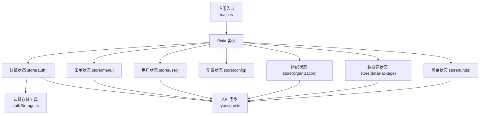
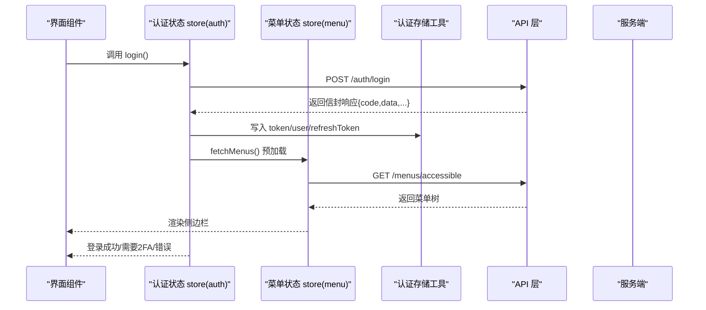
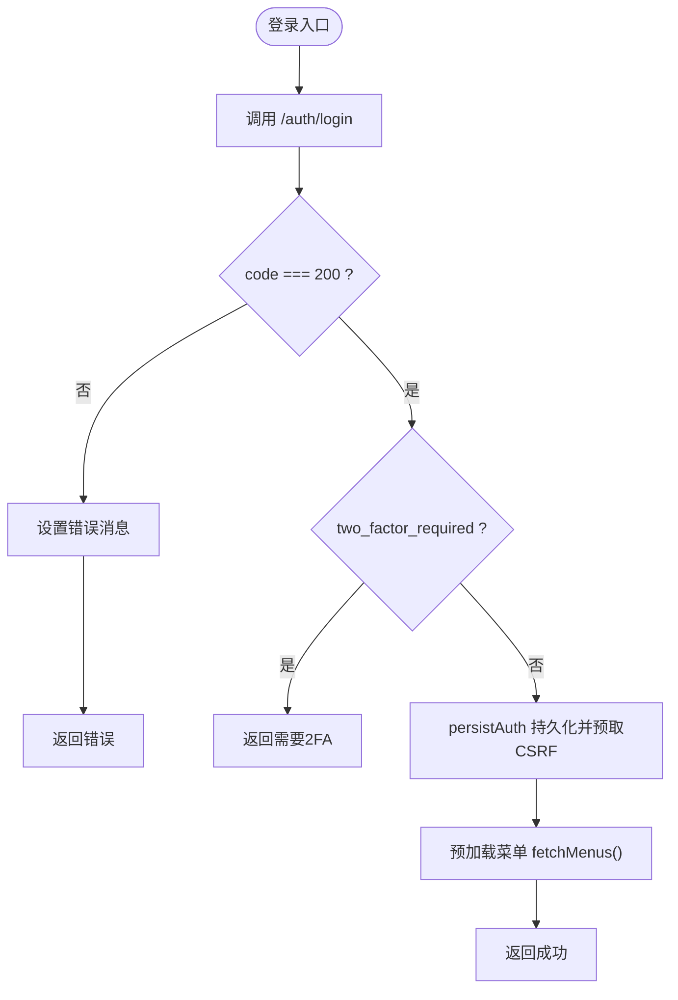
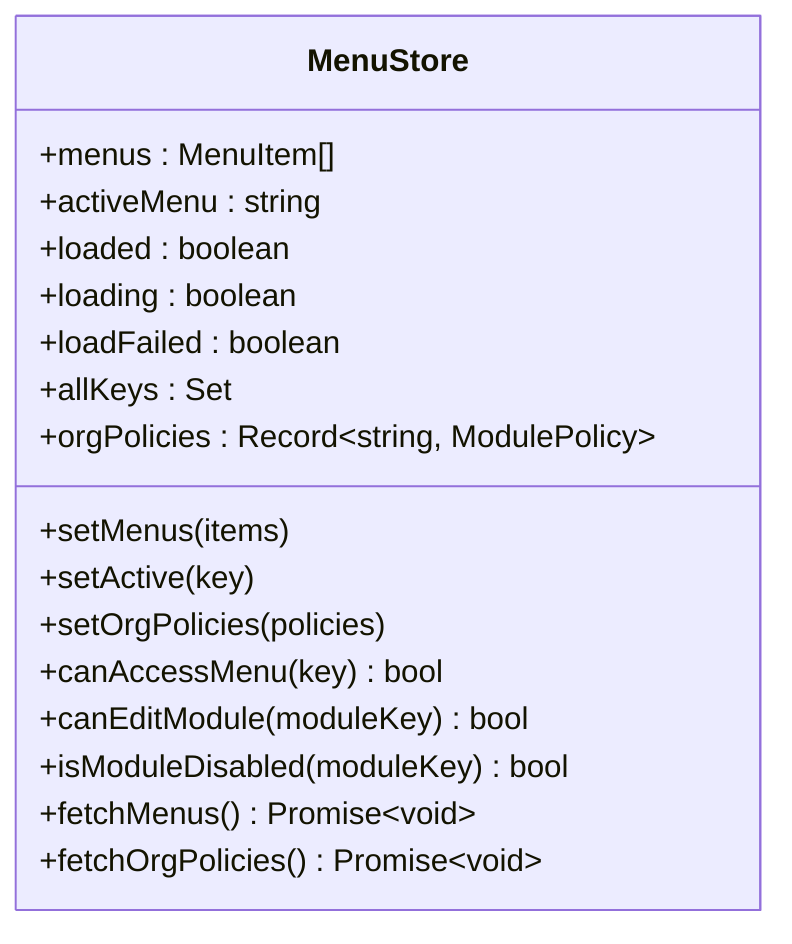
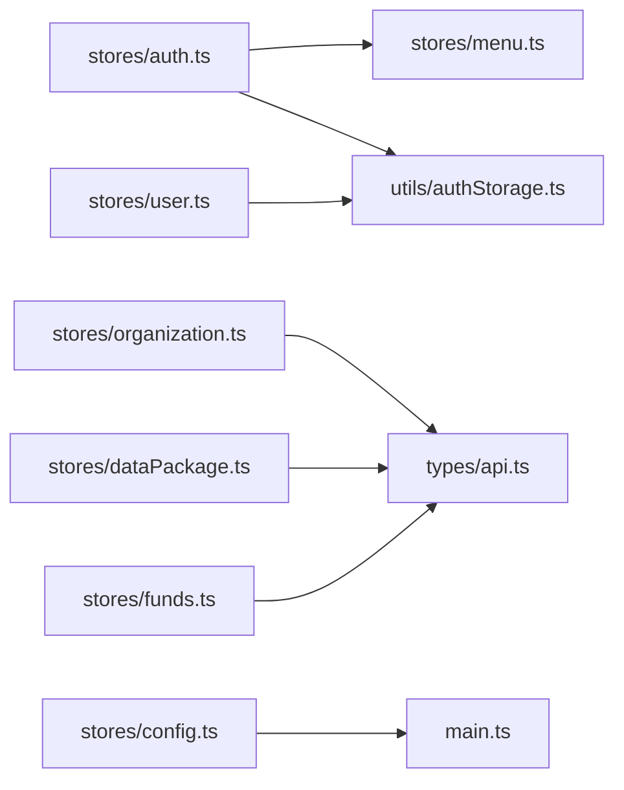

# 前端状态管理

<cite>
**本文引用的文件**
- [frontend/src/main.ts](file://frontend/src/main.ts)
- [frontend/src/stores/auth.ts](file://frontend/src/stores/auth.ts)
- [frontend/src/stores/user.ts](file://frontend/src/stores/user.ts)
- [frontend/src/stores/menu.ts](file://frontend/src/stores/menu.ts)
- [frontend/src/stores/config.ts](file://frontend/src/stores/config.ts)
- [frontend/src/stores/organization.ts](file://frontend/src/stores/organization.ts)
- [frontend/src/stores/dataPackage.ts](file://frontend/src/stores/dataPackage.ts)
- [frontend/src/stores/funds.ts](file://frontend/src/stores/funds.ts)
- [frontend/src/utils/authStorage.ts](file://frontend/src/utils/authStorage.ts)
- [frontend/src/types/api.ts](file://frontend/src/types/api.ts)
</cite>

## 目录
1. [简介](#简介)
2. [项目结构](#项目结构)
3. [核心组件](#核心组件)
4. [架构总览](#架构总览)
5. [详细组件分析](#详细组件分析)
6. [依赖关系分析](#依赖关系分析)
7. [性能考虑](#性能考虑)
8. [故障排查指南](#故障排查指南)
9. [结论](#结论)
10. [附录](#附录)

## 简介
本技术文档聚焦于前端状态管理，围绕 Pinia 的模块化组织、各状态模块职责划分、状态持久化与同步策略、响应式更新机制与性能优化、以及最佳实践与常见问题进行系统化说明。本项目采用 Vue 3 + Pinia 作为状态管理方案，通过多个领域 Store（认证、用户、菜单、配置、组织、数据包、资金等）实现高内聚、低耦合的状态治理，并通过统一的存储工具类完成会话级与持久化的安全分离。

## 项目结构
前端状态管理位于 frontend/src/stores 目录，按业务域拆分为独立 Store；全局初始化在 main.ts 中完成 Pinia 挂载与主题应用；认证持久化由 utils/authStorage.ts 统一封装；API 类型定义集中在 types/api.ts。

图表来源
- [frontend/src/main.ts:46-55](file://frontend/src/main.ts#L46-L55)
- [frontend/src/stores/auth.ts:31-294](file://frontend/src/stores/auth.ts#L31-L294)
- [frontend/src/stores/user.ts:20-215](file://frontend/src/stores/user.ts#L20-L215)
- [frontend/src/stores/menu.ts:35-144](file://frontend/src/stores/menu.ts#L35-L144)
- [frontend/src/stores/config.ts:38-50](file://frontend/src/stores/config.ts#L38-L50)
- [frontend/src/stores/organization.ts:6-117](file://frontend/src/stores/organization.ts#L6-L117)
- [frontend/src/stores/dataPackage.ts:18-263](file://frontend/src/stores/dataPackage.ts#L18-L263)
- [frontend/src/stores/funds.ts:6-101](file://frontend/src/stores/funds.ts#L6-L101)
- [frontend/src/utils/authStorage.ts:54-258](file://frontend/src/utils/authStorage.ts#L54-L258)
- [frontend/src/types/api.ts:6-20](file://frontend/src/types/api.ts#L6-L20)

章节来源
- [frontend/src/main.ts:46-55](file://frontend/src/main.ts#L46-L55)
- [frontend/src/stores/auth.ts:31-294](file://frontend/src/stores/auth.ts#L31-L294)
- [frontend/src/stores/menu.ts:35-144](file://frontend/src/stores/menu.ts#L35-L144)
- [frontend/src/stores/config.ts:38-50](file://frontend/src/stores/config.ts#L38-L50)
- [frontend/src/utils/authStorage.ts:54-258](file://frontend/src/utils/authStorage.ts#L54-L258)
- [frontend/src/types/api.ts:6-20](file://frontend/src/types/api.ts#L6-L20)

## 核心组件
- 认证状态（auth）：负责登录、登出、锁屏/解锁、权限推导、2FA 流程、CSRF 预取、菜单预加载等。
- 用户状态（user）：维护当前用户与用户列表、个人资料、密码修改、头像上传等。
- 菜单状态（menu）：维护可访问菜单树、模块策略、访问控制判断与并发请求去重。
- 配置状态（config）：应用名称、版本、主题切换与 DOM 主题应用。
- 组织状态（organization）：组织树、当前组织、下属组织等。
- 数据包状态（dataPackage）：数据包的导入、导出、预览、确认、下载、删除等全生命周期。
- 资金状态（funds）：经费列表、统计汇总、审批操作等。

章节来源
- [frontend/src/stores/auth.ts:31-294](file://frontend/src/stores/auth.ts#L31-L294)
- [frontend/src/stores/user.ts:20-215](file://frontend/src/stores/user.ts#L20-L215)
- [frontend/src/stores/menu.ts:35-144](file://frontend/src/stores/menu.ts#L35-L144)
- [frontend/src/stores/config.ts:38-50](file://frontend/src/stores/config.ts#L38-L50)
- [frontend/src/stores/organization.ts:6-117](file://frontend/src/stores/organization.ts#L6-L117)
- [frontend/src/stores/dataPackage.ts:18-263](file://frontend/src/stores/dataPackage.ts#L18-L263)
- [frontend/src/stores/funds.ts:6-101](file://frontend/src/stores/funds.ts#L6-L101)

## 架构总览
整体采用“Store 驱动”的响应式架构：页面组件通过订阅 Store 中的 ref/computed 获取状态变化；Store 内部通过 API 层与后端交互，并将结果写回响应式状态；认证相关状态通过统一的存储工具在 sessionStorage/localStorage 间安全迁移与持久化。

图表来源
- [frontend/src/stores/auth.ts:171-225](file://frontend/src/stores/auth.ts#L171-L225)
- [frontend/src/stores/menu.ts:93-112](file://frontend/src/stores/menu.ts#L93-L112)
- [frontend/src/utils/authStorage.ts:127-149](file://frontend/src/utils/authStorage.ts#L127-L149)
- [frontend/src/types/api.ts:6-12](file://frontend/src/types/api.ts#L6-L12)

## 详细组件分析

### 认证状态（auth）
- 职责
  - 登录/登出、锁屏/解锁、2FA 验证、权限推导（模块级 view/edit）、强制改密提示、CSRF 预取、菜单预加载。
- 关键设计
  - 使用 computed 派生 isAuthenticated、isAdmin、canViewDeleted、modulePermissions，避免重复计算。
  - persistAuth 集中处理 token/user/refreshToken 的本地持久化与 CSRF 预取。
  - logout 尽力通知服务端吊销并清理本地凭据，确保登出幂等可用。
  - lockSession/unlockSession 支持自动/手动锁屏，保留“记住登录”的持久凭据。
- 数据流
  - 登录成功后立即触发菜单预加载，减少首屏闪烁与路由守卫误判。
  - 刷新恢复时仅在有 token 且无 user 时拉取当前用户信息。

图表来源
- [frontend/src/stores/auth.ts:171-225](file://frontend/src/stores/auth.ts#L171-L225)
- [frontend/src/stores/menu.ts:93-112](file://frontend/src/stores/menu.ts#L93-L112)

章节来源
- [frontend/src/stores/auth.ts:31-294](file://frontend/src/stores/auth.ts#L31-L294)

### 用户状态（user）
- 职责
  - 用户列表、当前用户、个人资料、密码修改、角色分配、头像上传等。
- 关键设计
  - 初始化从 AuthStorage 恢复 currentUser，防止刷新丢失。
  - 对后端不同返回格式做兼容处理（裸对象或信封）。
  - 提供 getUserProfile/updateUserProfile 等便捷方法。
- 数据流
  - 增删改后及时更新本地列表与 total，保持视图一致。

章节来源
- [frontend/src/stores/user.ts:20-215](file://frontend/src/stores/user.ts#L20-L215)

### 菜单状态（menu）
- 职责
  - 维护可访问菜单树、活跃菜单、模块策略、访问控制判断。
- 关键设计
  - 并发请求去重：通过 _inflight Promise 保证同一时刻仅一次网络请求。
  - 组织策略优先：hidden 模块不可见；edit_mode 控制编辑能力。
  - 提取 allKeys 集合用于快速判定可访问性。
- 数据流
  - fetchMenus 失败时标记 loadFailed，允许重试；空菜单视为合法。

图表来源
- [frontend/src/stores/menu.ts:6-144](file://frontend/src/stores/menu.ts#L6-L144)

章节来源
- [frontend/src/stores/menu.ts:35-144](file://frontend/src/stores/menu.ts#L35-L144)

### 配置状态（config）
- 职责
  - 应用名、版本、主题切换与 DOM 主题应用。
- 关键设计
  - 默认主题为“军绿”，通过移除 data-theme 属性生效；其他主题通过设置 data-theme 生效。
  - 主题值持久化到 localStorage，启动时提前应用以避免 FOUC。
- 数据流
  - setTheme 同时更新内存状态与持久化存储，并即时应用到 DOM。

章节来源
- [frontend/src/stores/config.ts:38-50](file://frontend/src/stores/config.ts#L38-L50)
- [frontend/src/main.ts:39-41](file://frontend/src/main.ts#L39-L41)

### 组织状态（organization）
- 职责
  - 组织列表、当前组织、组织树、下属组织等。
- 关键设计
  - 兼容数组直返与信封两种响应格式。
  - 增删改后清空 tree 缓存，保证下次查询最新结构。
- 数据流
  - 通过 apiRequest/get/post/put/del 与后端交互，统一错误处理。

章节来源
- [frontend/src/stores/organization.ts:6-117](file://frontend/src/stores/organization.ts#L6-L117)

### 数据包状态（dataPackage）
- 职责
  - 数据包的导入、导出、预览、确认、下载、删除等全生命周期管理。
- 关键设计
  - 多状态标志（loading/exporting/importing）区分不同异步阶段。
  - computed 派生 validatedPackages/importedPackages/failedPackages 便于筛选展示。
  - $reset 提供一键重置能力，便于测试与复用。
- 数据流
  - 导入成功后将新包加入列表；确认导入后更新状态为 imported。

章节来源
- [frontend/src/stores/dataPackage.ts:18-263](file://frontend/src/stores/dataPackage.ts#L18-L263)

### 资金状态（funds）
- 职责
  - 经费列表、统计汇总、审批操作等。
- 关键设计
  - computed 计算总额、已用、剩余金额，简化模板逻辑。
  - unwrapList 统一解包列表响应，提升健壮性。
- 数据流
  - 创建/更新/删除后同步本地列表与总数；getSummary 提供概览统计。

章节来源
- [frontend/src/stores/funds.ts:6-101](file://frontend/src/stores/funds.ts#L6-L101)

## 依赖关系分析
- 模块耦合
  - auth 依赖 menu 进行登录后菜单预加载；所有 Store 依赖 types/api.ts 的类型定义；auth/user 依赖 authStorage 进行凭据存取。
- 外部依赖
  - Pinia 提供响应式状态容器；Vue 3 的 ref/computed 提供响应式基础；Element Plus 提供 UI 组件与命令式消息。
- 潜在循环依赖
  - 当前未见循环引用；auth 与 menu 为单向依赖（auth -> menu）。

图表来源
- [frontend/src/stores/auth.ts:31-294](file://frontend/src/stores/auth.ts#L31-L294)
- [frontend/src/stores/menu.ts:35-144](file://frontend/src/stores/menu.ts#L35-L144)
- [frontend/src/stores/user.ts:20-215](file://frontend/src/stores/user.ts#L20-L215)
- [frontend/src/stores/organization.ts:6-117](file://frontend/src/stores/organization.ts#L6-L117)
- [frontend/src/stores/dataPackage.ts:18-263](file://frontend/src/stores/dataPackage.ts#L18-L263)
- [frontend/src/stores/funds.ts:6-101](file://frontend/src/stores/funds.ts#L6-L101)
- [frontend/src/stores/config.ts:38-50](file://frontend/src/stores/config.ts#L38-L50)
- [frontend/src/main.ts:46-55](file://frontend/src/main.ts#L46-L55)
- [frontend/src/utils/authStorage.ts:54-258](file://frontend/src/utils/authStorage.ts#L54-L258)
- [frontend/src/types/api.ts:6-20](file://frontend/src/types/api.ts#L6-L20)

章节来源
- [frontend/src/stores/auth.ts:31-294](file://frontend/src/stores/auth.ts#L31-L294)
- [frontend/src/stores/menu.ts:35-144](file://frontend/src/stores/menu.ts#L35-L144)
- [frontend/src/utils/authStorage.ts:54-258](file://frontend/src/utils/authStorage.ts#L54-L258)
- [frontend/src/types/api.ts:6-20](file://frontend/src/types/api.ts#L6-L20)

## 性能考虑
- 响应式最小化更新
  - 大量使用 computed 派生状态（如 modulePermissions、accessibleKeys、totalFunds/usedFunds/remainFunds），减少模板计算开销。
- 并发请求去重
  - menu.fetchMenus 通过 _inflight Promise 合并并发请求，避免重复网络开销与竞态条件。
- 懒加载与预取
  - 登录后预取菜单与 CSRF token，降低首屏阻塞与首次写操作失败概率。
- 列表与分页
  - funds/dataPackage 等 Store 使用 unwrapList 与分页字段，避免全量渲染大列表。
- 主题应用
  - 启动前应用主题，避免 FOUC；通过 data-theme 切换而非频繁样式重写。

[本节为通用性能建议，不直接分析具体代码文件]

## 故障排查指南
- 登录失败/2FA 流程异常
  - 检查 auth.login 的错误分支与 message 映射；确认后端返回 code/message 字段；必要时查看网络请求与超时配置。
- 菜单加载失败导致 403
  - 若 fetchMenus 失败会标记 loadFailed，但不会阻断后续重试；确保登录后再次触发 fetchMenus。
- 主题未生效
  - 检查 config.setTheme 是否被调用；确认 main.ts 在挂载前已应用主题；核对 data-theme 属性是否正确设置。
- 认证状态不一致
  - 检查 AuthStorage 的读写路径；确认迁移逻辑 migrateFromLocalStorage 是否执行；退出登录需调用 clear 彻底清除。
- 列表数据不同步
  - 检查对应 Store 的增删改后是否更新本地列表与 total；确认 unwrapList 的使用场景与后端返回格式匹配。

章节来源
- [frontend/src/stores/auth.ts:171-225](file://frontend/src/stores/auth.ts#L171-L225)
- [frontend/src/stores/menu.ts:93-112](file://frontend/src/stores/menu.ts#L93-L112)
- [frontend/src/stores/config.ts:38-50](file://frontend/src/stores/config.ts#L38-L50)
- [frontend/src/utils/authStorage.ts:218-258](file://frontend/src/utils/authStorage.ts#L218-L258)
- [frontend/src/stores/funds.ts:25-43](file://frontend/src/stores/funds.ts#L25-L43)

## 结论
本项目基于 Pinia 构建了清晰、可扩展的前端状态管理体系：以领域为边界拆分 Store，结合 computed 派生状态与并发去重策略，保障响应式更新的高效与稳定；通过统一的认证存储工具实现会话级与持久化的安全分离；配合启动前主题应用与登录后的菜单预取，提升了用户体验与系统稳定性。建议在新增功能时遵循现有模式：单一职责、明确输入输出、合理派生状态、统一错误处理与类型约束。

[本节为总结性内容，不直接分析具体代码文件]

## 附录

### 状态持久化机制与同步方案
- 会话级存储
  - 认证凭据（token/user/refreshToken）默认写入 sessionStorage，页面关闭即清除，安全性更高。
- 持久化存储
  - “记住登录”开启时，凭据写入 localStorage 的持久键，供下次开机免登录；退出登录时彻底清除。
- 迁移策略
  - 启动时执行一次性迁移：将旧版 localStorage 数据迁移至 sessionStorage，并清理旧键，避免脏数据。
- 与服务端协调
  - 登录/2FA 成功后统一持久化；登出时尽力通知服务端吊销并清理本地；刷新时仅在 token 存在且 user 缺失时拉取当前用户。

章节来源
- [frontend/src/utils/authStorage.ts:54-258](file://frontend/src/utils/authStorage.ts#L54-L258)
- [frontend/src/stores/auth.ts:93-157](file://frontend/src/stores/auth.ts#L93-L157)
- [frontend/src/stores/auth.ts:265-276](file://frontend/src/stores/auth.ts#L265-L276)

### 状态调试与测试方法
- 调试
  - 利用浏览器开发者工具的 Pinia Devtools 观察各 Store 状态变化；关注 computed 派生值是否符合预期。
  - 通过控制台打印关键状态（如 menus.loaded、auth.isAuthenticated）辅助定位问题。
- 测试
  - 使用 $reset 重置 Store 状态，便于单元测试隔离；针对数据包的 import/export/confirm 等流程编写用例。
  - 对菜单并发去重逻辑进行覆盖：多次并发调用 fetchMenus 应仅产生一次网络请求。

章节来源
- [frontend/src/stores/dataPackage.ts:218-229](file://frontend/src/stores/dataPackage.ts#L218-L229)
- [frontend/src/stores/menu.ts:87-112](file://frontend/src/stores/menu.ts#L87-L112)