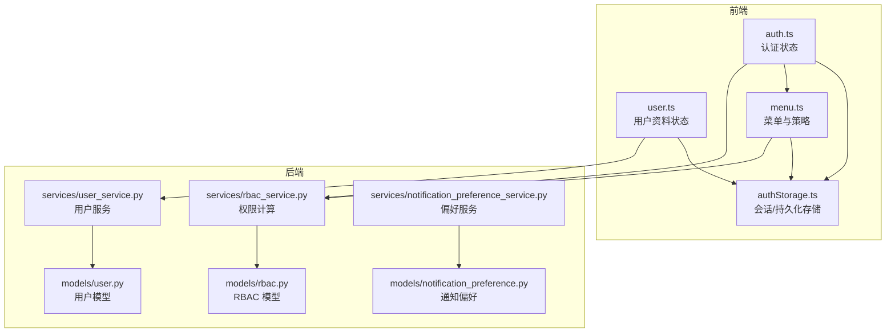
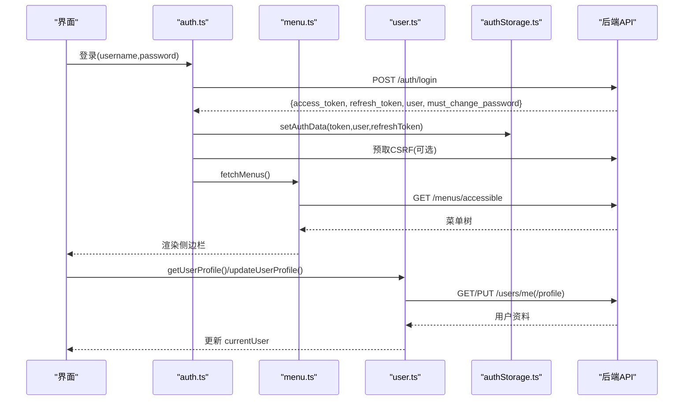
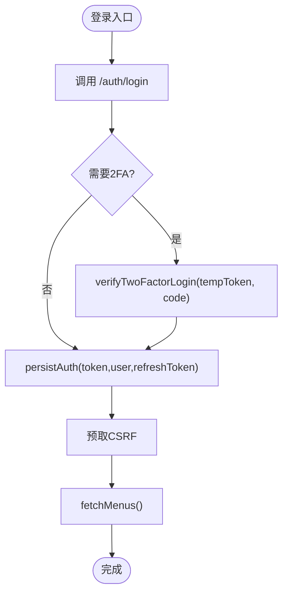
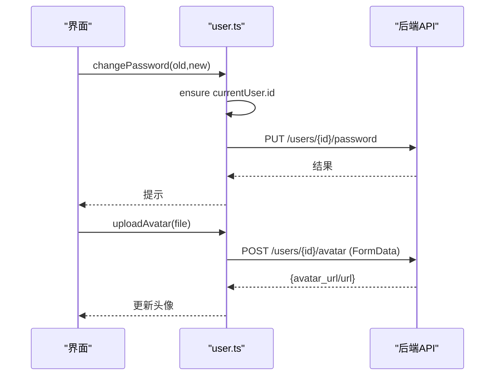
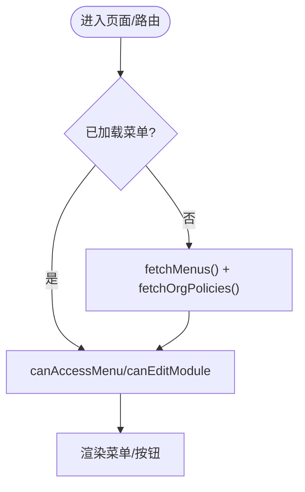
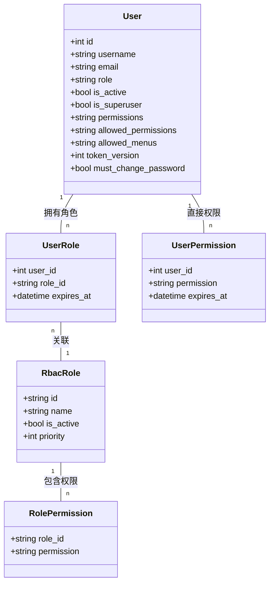
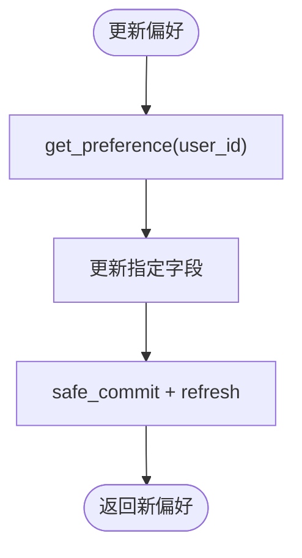
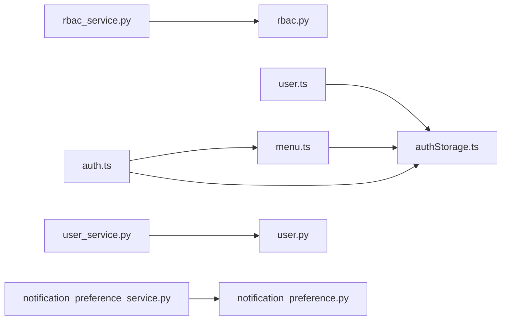

# 用户状态管理

<cite>
**本文引用的文件**
- [frontend/src/stores/user.ts](file://frontend/src/stores/user.ts)
- [frontend/src/stores/auth.ts](file://frontend/src/stores/auth.ts)
- [frontend/src/stores/menu.ts](file://frontend/src/stores/menu.ts)
- [frontend/src/utils/authStorage.ts](file://frontend/src/utils/authStorage.ts)
- [backend/app/models/user.py](file://backend/app/models/user.py)
- [backend/app/models/rbac.py](file://backend/app/models/rbac.py)
- [backend/app/services/user_service.py](file://backend/app/services/user_service.py)
- [backend/app/services/rbac_service.py](file://backend/app/services/rbac_service.py)
- [backend/app/models/notification_preference.py](file://backend/app/models/notification_preference.py)
- [backend/app/services/notification_preference_service.py](file://backend/app/services/notification_preference_service.py)
</cite>

## 目录
1. [简介](#简介)
2. [项目结构](#项目结构)
3. [核心组件](#核心组件)
4. [架构总览](#架构总览)
5. [详细组件分析](#详细组件分析)
6. [依赖关系分析](#依赖关系分析)
7. [性能考虑](#性能考虑)
8. [故障排查指南](#故障排查指南)
9. [结论](#结论)
10. [附录](#附录)

## 简介
本技术文档聚焦“用户状态管理”，覆盖以下方面：
- 用户基本信息的管理策略：获取、更新、头像上传、密码修改、角色分配。
- 用户角色与权限的状态管理：菜单权限、操作权限的动态加载与校验，组织级模块策略控制。
- 用户偏好设置与本地配置的状态同步：通知偏好、认证持久化（记住登录）等。
- 与其他模块的交互模式：与认证状态、菜单状态的协调。
- 最佳实践与性能优化建议：缓存、并发请求去重、最小化渲染闪烁、安全存储等。

## 项目结构
前端采用 Pinia 进行状态管理，围绕三个关键 store 构建用户状态体系：
- auth.ts：认证状态、令牌与用户信息、模块权限映射、锁屏/解锁、2FA 流程。
- user.ts：用户资料 CRUD、当前用户 Profile、头像上传、密码修改、角色分配。
- menu.ts：可访问菜单树、模块策略、菜单可见性与编辑能力判定。

后端提供 RBAC 模型与服务、用户服务、通知偏好模型与服务，以及用户模型中的权限字段与白名单机制。

**图表来源**
- [frontend/src/stores/auth.ts:31-295](file://frontend/src/stores/auth.ts#L31-L295)
- [frontend/src/stores/user.ts:20-216](file://frontend/src/stores/user.ts#L20-L216)
- [frontend/src/stores/menu.ts:35-145](file://frontend/src/stores/menu.ts#L35-L145)
- [frontend/src/utils/authStorage.ts:54-259](file://frontend/src/utils/authStorage.ts#L54-L259)
- [backend/app/models/user.py:26-152](file://backend/app/models/user.py#L26-L152)
- [backend/app/models/rbac.py:31-263](file://backend/app/models/rbac.py#L31-L263)
- [backend/app/services/rbac_service.py:104-746](file://backend/app/services/rbac_service.py#L104-L746)
- [backend/app/services/user_service.py:20-124](file://backend/app/services/user_service.py#L20-L124)
- [backend/app/models/notification_preference.py:17-132](file://backend/app/models/notification_preference.py#L17-L132)
- [backend/app/services/notification_preference_service.py:26-301](file://backend/app/services/notification_preference_service.py#L26-L301)

**章节来源**
- [frontend/src/stores/auth.ts:31-295](file://frontend/src/stores/auth.ts#L31-L295)
- [frontend/src/stores/user.ts:20-216](file://frontend/src/stores/user.ts#L20-L216)
- [frontend/src/stores/menu.ts:35-145](file://frontend/src/stores/menu.ts#L35-L145)
- [frontend/src/utils/authStorage.ts:54-259](file://frontend/src/utils/authStorage.ts#L54-L259)
- [backend/app/models/user.py:26-152](file://backend/app/models/user.py#L26-L152)
- [backend/app/models/rbac.py:31-263](file://backend/app/models/rbac.py#L31-L263)
- [backend/app/services/rbac_service.py:104-746](file://backend/app/services/rbac_service.py#L104-L746)
- [backend/app/services/user_service.py:20-124](file://backend/app/services/user_service.py#L20-L124)
- [backend/app/models/notification_preference.py:17-132](file://backend/app/models/notification_preference.py#L17-L132)
- [backend/app/services/notification_preference_service.py:26-301](file://backend/app/services/notification_preference_service.py#L26-L301)

## 核心组件
- 认证状态（auth.ts）
  - 维护 token、refresh_token、用户对象、错误信息。
  - 计算 isAuthenticated、isAdmin、canViewDeleted、mustChangePassword。
  - 将权限列表转换为模块级视图/编辑权限映射（modulePermissions）。
  - 登录成功后预取 CSRF 并加载菜单，避免侧边栏闪烁。
  - 支持锁屏/解锁、登出时尝试服务端吊销 refresh_token。
- 用户资料状态（user.ts）
  - 维护 userList、currentUser、loading、error、total。
  - 提供用户列表、详情、创建、更新、删除、密码重置、改密、角色分配。
  - 通过 /users/me 与 /users/me/profile 管理当前用户 Profile。
  - 头像上传使用 FormData，自动处理 Content-Type。
- 菜单状态（menu.ts）
  - 维护 menus、activeMenu、loaded、loading、loadFailed、allKeys、orgPolicies。
  - 提供 canAccessMenu、canEditModule、isModuleDisabled 等判定方法。
  - fetchMenus 防抖并发请求（共享 _inflight Promise），失败不阻塞后续重试。
  - 支持组织级模块策略（visibility/edit_mode）。
- 认证存储（authStorage.ts）
  - 统一 sessionStorage 为主，兼容 localStorage 旧数据。
  - 支持“记住登录”持久化（localStorage）与迁移清理。
  - 提供 set/get Token/User/RefreshToken、clearSession/clear、migrateFromLocalStorage。

**章节来源**
- [frontend/src/stores/auth.ts:31-295](file://frontend/src/stores/auth.ts#L31-L295)
- [frontend/src/stores/user.ts:20-216](file://frontend/src/stores/user.ts#L20-L216)
- [frontend/src/stores/menu.ts:35-145](file://frontend/src/stores/menu.ts#L35-L145)
- [frontend/src/utils/authStorage.ts:54-259](file://frontend/src/utils/authStorage.ts#L54-L259)

## 架构总览
用户状态管理的端到端流程如下：
- 登录：auth.login 调用后端 /auth/login，返回 access_token、refresh_token、user 及 must_change_password；若需要 2FA，则进入 verifyTwoFactorLogin。
- 登录后：persistAuth 写入 session/localStorage，预取 CSRF，并触发 useMenuStore.fetchMenus() 动态加载菜单。
- 菜单与权限：menu.store 从 /menus/accessible 拉取菜单树，结合 org-policies/current 决定可见性与编辑能力；auth.store 将权限字符串解析为 modulePermissions。
- 用户资料：user.store 通过 /users/me 与 /users/me/profile 获取和更新当前用户；头像上传走 /users/{id}/avatar。
- 偏好设置：后端 NotificationPreference 提供默认值与更新接口，供通知渠道过滤。

**图表来源**
- [frontend/src/stores/auth.ts:171-249](file://frontend/src/stores/auth.ts#L171-L249)
- [frontend/src/stores/menu.ts:87-125](file://frontend/src/stores/menu.ts#L87-L125)
- [frontend/src/stores/user.ts:161-181](file://frontend/src/stores/user.ts#L161-L181)
- [frontend/src/utils/authStorage.ts:127-149](file://frontend/src/utils/authStorage.ts#L127-L149)

## 详细组件分析

### 认证状态（auth.ts）
- 职责
  - 管理认证生命周期：登录、2FA验证、锁屏/解锁、登出。
  - 维护用户对象与权限映射，导出 computed 属性用于路由守卫与指令。
  - 登录后预取菜单，减少首次渲染闪烁。
- 关键点
  - modulePermissions：将权限字符串（如 "village:read"）转为结构化查找表，支持 super_admin 全量权限。
  - persistAuth：集中写入 token、user、refreshToken，并触发 unlockSession 与 CSRF 预取。
  - logout：尽力调用服务端吊销 refresh_token，但本地清理必须成功。
  - fetchUser：页面刷新恢复用户信息，仅在 token 存在且 user 缺失时调用。

**图表来源**
- [frontend/src/stores/auth.ts:171-249](file://frontend/src/stores/auth.ts#L171-L249)
- [frontend/src/stores/menu.ts:87-125](file://frontend/src/stores/menu.ts#L87-L125)

**章节来源**
- [frontend/src/stores/auth.ts:31-295](file://frontend/src/stores/auth.ts#L31-L295)

### 用户资料状态（user.ts）
- 职责
  - 管理用户列表与当前用户资料，提供 CRUD、改密、头像上传、角色分配。
  - 通过 /users/me 与 /users/me/profile 管理当前用户 Profile。
- 关键点
  - fetchUsers/fetchUser：兼容后端裸格式与 envelope 格式。
  - updateUser：局部更新后同步到 userList 与 currentUser。
  - changePassword：确保 currentUser.id 存在，否则先调用 getUserProfile。
  - uploadAvatar：使用 FormData，post() 自动移除 Content-Type。
  - assignRole：以 query 参数传递 role_code。

**图表来源**
- [frontend/src/stores/user.ts:112-194](file://frontend/src/stores/user.ts#L112-L194)

**章节来源**
- [frontend/src/stores/user.ts:20-216](file://frontend/src/stores/user.ts#L20-L216)

### 菜单与权限（menu.ts）
- 职责
  - 动态加载可访问菜单，维护模块策略，提供可见性与编辑能力判定。
- 关键点
  - fetchMenus：并发保护（_inflight），失败标记 loadFailed，允许下次重试。
  - canAccessMenu：优先检查组织策略 visibility=hidden，再判断 allKeys。
  - canEditModule/isModuleDisabled：基于 edit_mode 与 visibility 控制。
  - fetchOrgPolicies：加载当前组织的模块策略。

**图表来源**
- [frontend/src/stores/menu.ts:87-125](file://frontend/src/stores/menu.ts#L87-L125)

**章节来源**
- [frontend/src/stores/menu.ts:35-145](file://frontend/src/stores/menu.ts#L35-L145)

### 认证存储（authStorage.ts）
- 职责
  - 统一管理认证数据的读写，支持会话级与持久化存储，提供迁移工具。
- 关键点
  - 优先 sessionStorage，回退到 localStorage 的持久键（记住登录）。
  - clearSession：仅清除会话，保留记住登录凭据（锁屏场景）。
  - clear：彻底清除所有认证数据（退出登录）。
  - migrateFromLocalStorage：一次性迁移旧数据并清理旧键。

**章节来源**
- [frontend/src/utils/authStorage.ts:54-259](file://frontend/src/utils/authStorage.ts#L54-L259)

### 后端 RBAC 与用户模型
- 用户模型（user.py）
  - 包含角色、数据范围、权限列表、白名单权限、允许菜单、token_version、must_change_password 等字段。
  - 提供 allowed_permissions_list、allowed_menus_list 等解析方法。
- RBAC 模型（rbac.py）
  - 定义角色、用户角色关联、角色权限、用户直接权限、资源访问控制、访问日志、机器码权限等。
- RBAC 服务（rbac_service.py）
  - 计算用户有效权限（含机器码限制）、批量授予/撤销权限、原子保存权限集合、记录访问日志。
  - 管理员权限与白名单交集逻辑，保证最小权限原则。

**图表来源**
- [backend/app/models/user.py:26-152](file://backend/app/models/user.py#L26-L152)
- [backend/app/models/rbac.py:31-263](file://backend/app/models/rbac.py#L31-L263)

**章节来源**
- [backend/app/models/user.py:26-152](file://backend/app/models/user.py#L26-L152)
- [backend/app/models/rbac.py:31-263](file://backend/app/models/rbac.py#L31-L263)
- [backend/app/services/rbac_service.py:104-746](file://backend/app/services/rbac_service.py#L104-L746)

### 通知偏好设置
- 模型（notification_preference.py）
  - 邮件、站内消息、推送三类通知开关，支持按类型（system/approval/task）控制。
  - 提供 should_send_* 方法与默认配置。
- 服务（notification_preference_service.py）
  - 获取/更新偏好，支持站点消息、邮件设置更新，报告类默认行为。
  - 批量筛选应接收通知的用户。

**图表来源**
- [backend/app/services/notification_preference_service.py:85-119](file://backend/app/services/notification_preference_service.py#L85-L119)

**章节来源**
- [backend/app/models/notification_preference.py:17-132](file://backend/app/models/notification_preference.py#L17-L132)
- [backend/app/services/notification_preference_service.py:26-301](file://backend/app/services/notification_preference_service.py#L26-L301)

## 依赖关系分析
- 前端依赖
  - auth.ts 依赖 menu.ts（登录后预加载菜单）与 authStorage.ts（持久化）。
  - user.ts 依赖 authStorage.ts（恢复 currentUser）与 API 层。
  - menu.ts 依赖 authStorage.ts（读取 token）与 API 层。
- 后端依赖
  - rbac_service.py 依赖 rbac 模型与 machine_code_permission_service（机器码限制）。
  - user_service.py 依赖 user 模型与 security/constants。
  - notification_preference_service.py 依赖 notification_preference 模型。

**图表来源**
- [frontend/src/stores/auth.ts:31-295](file://frontend/src/stores/auth.ts#L31-L295)
- [frontend/src/stores/menu.ts:35-145](file://frontend/src/stores/menu.ts#L35-L145)
- [frontend/src/stores/user.ts:20-216](file://frontend/src/stores/user.ts#L20-L216)
- [backend/app/services/rbac_service.py:104-746](file://backend/app/services/rbac_service.py#L104-L746)
- [backend/app/services/user_service.py:20-124](file://backend/app/services/user_service.py#L20-L124)
- [backend/app/services/notification_preference_service.py:26-301](file://backend/app/services/notification_preference_service.py#L26-L301)

**章节来源**
- [frontend/src/stores/auth.ts:31-295](file://frontend/src/stores/auth.ts#L31-L295)
- [frontend/src/stores/menu.ts:35-145](file://frontend/src/stores/menu.ts#L35-L145)
- [frontend/src/stores/user.ts:20-216](file://frontend/src/stores/user.ts#L20-L216)
- [backend/app/services/rbac_service.py:104-746](file://backend/app/services/rbac_service.py#L104-L746)
- [backend/app/services/user_service.py:20-124](file://backend/app/services/user_service.py#L20-L124)
- [backend/app/services/notification_preference_service.py:26-301](file://backend/app/services/notification_preference_service.py#L26-L301)

## 性能考虑
- 前端
  - 菜单加载并发保护：menu.store 使用 _inflight 共享 Promise，避免重复请求与竞态。
  - 登录成功后预取菜单：减少首屏闪烁与路由守卫误判。
  - 认证存储优先 sessionStorage：降低跨标签页污染风险，提升安全性与一致性。
  - 用户资料更新局部合并：updateUser 仅合并变更字段，减少不必要的全量刷新。
- 后端
  - 权限计算单次查询：rbac_service 合并直接权限与角色权限，并在一次计算中应用白名单与机器码限制。
  - 批量操作：grant_permissions_batch/save_permissions 使用预查询与批量 INSERT/DELETE，减少数据库往返。
  - 访问日志异步化：记录失败不影响主流程，避免阻塞。

[本节为通用指导，无需具体文件引用]

## 故障排查指南
- 登录失败或 2FA 失败
  - 检查 auth.login 返回值与 error.value；确认 temp_token 与验证码正确。
  - 参考：[frontend/src/stores/auth.ts:171-259](file://frontend/src/stores/auth.ts#L171-L259)
- 菜单未显示或闪烁
  - 检查 menu.store.loaded 与 loadFailed；确认 fetchMenus 是否被调用且成功。
  - 参考：[frontend/src/stores/menu.ts:87-125](file://frontend/src/stores/menu.ts#L87-L125)
- 用户资料更新无效
  - 检查 updateUser 是否命中 userList 索引并合并；确认 currentUser 同步。
  - 参考：[frontend/src/stores/user.ts:84-94](file://frontend/src/stores/user.ts#L84-L94)
- 头像上传失败
  - 检查 FormData 构造与 post() 对 Content-Type 的处理；确认 /users/{id}/avatar 响应。
  - 参考：[frontend/src/stores/user.ts:183-194](file://frontend/src/stores/user.ts#L183-L194)
- 权限不足
  - 检查 modulePermissions 与菜单 key；确认 RBAC 服务计算逻辑（白名单、机器码限制）。
  - 参考：[backend/app/services/rbac_service.py:237-320](file://backend/app/services/rbac_service.py#L237-L320)

**章节来源**
- [frontend/src/stores/auth.ts:171-259](file://frontend/src/stores/auth.ts#L171-L259)
- [frontend/src/stores/menu.ts:87-125](file://frontend/src/stores/menu.ts#L87-L125)
- [frontend/src/stores/user.ts:84-94](file://frontend/src/stores/user.ts#L84-L94)
- [frontend/src/stores/user.ts:183-194](file://frontend/src/stores/user.ts#L183-L194)
- [backend/app/services/rbac_service.py:237-320](file://backend/app/services/rbac_service.py#L237-L320)

## 结论
本系统通过前端 Pinia 三件套（auth/user/menu）与后端 RBAC/用户/偏好服务，构建了完整的用户状态管理体系：
- 认证与权限：登录、2FA、锁屏/解锁、模块权限映射、菜单动态加载。
- 用户资料：Profile 获取/更新、头像上传、密码修改、角色分配。
- 偏好设置：通知偏好默认值与更新，支持多通道过滤。
- 性能与安全：并发保护、最小化闪烁、会话级存储与持久化分离、白名单与机器码限制。

遵循上述最佳实践，可在保障安全性的同时提升用户体验与系统稳定性。

[本节为总结性内容，无需具体文件引用]

## 附录
- 术语
  - 模块权限：形如 "village:read" 的权限标识，前端解析为 view/edit 能力。
  - 组织策略：针对模块的 visibility 与 edit_mode 控制。
  - 白名单权限：用户级别的权限裁剪，与角色/直接权限取交集。
  - 机器码限制：设备维度的权限限制，参与最终权限计算。
- 相关接口路径（示例）
  - 认证：/auth/login、/auth/logout
  - 用户：/users、/users/{id}、/users/me、/users/me/profile、/users/{id}/avatar、/users/{id}/admin-reset-password
  - 菜单：/menus/accessible
  - 组织策略：/org-policies/current
  - 偏好：/notifications/preferences（由服务层适配）

[本节为补充说明，无需具体文件引用]