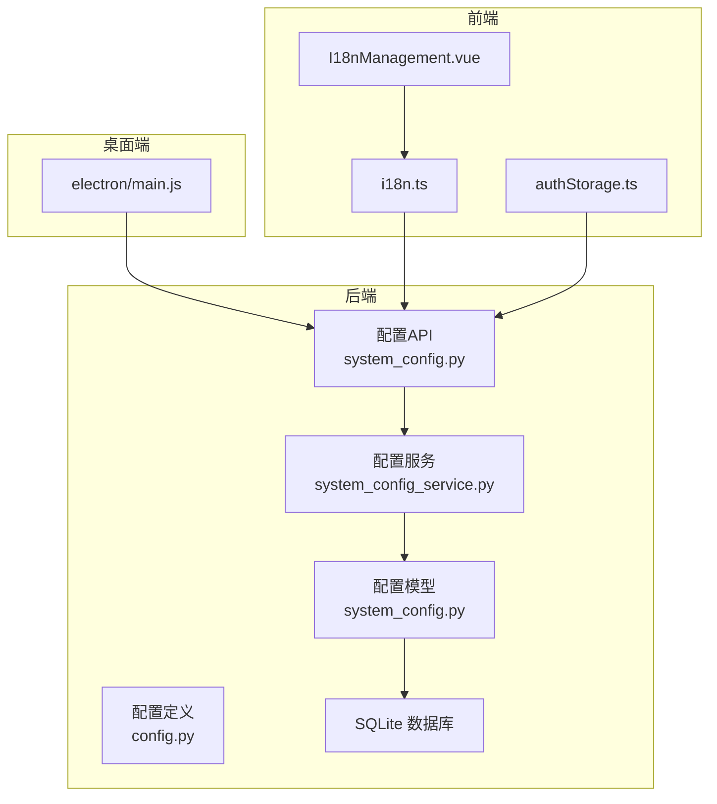
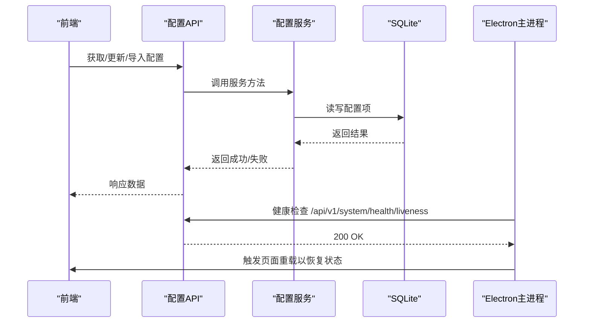
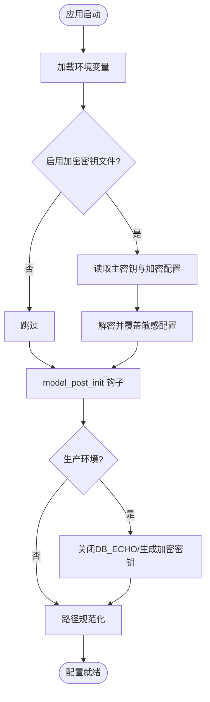
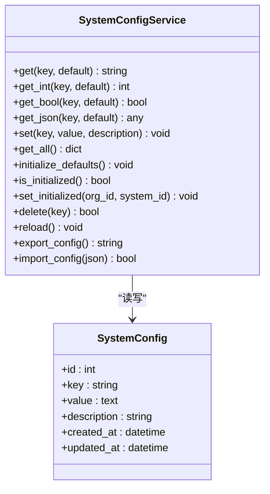
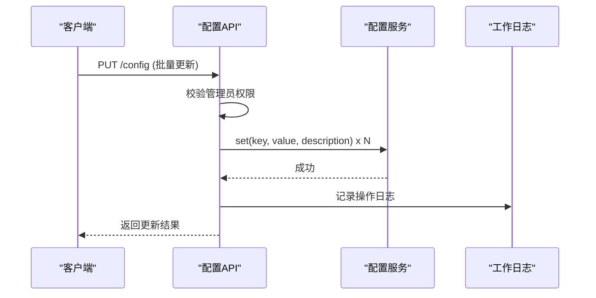
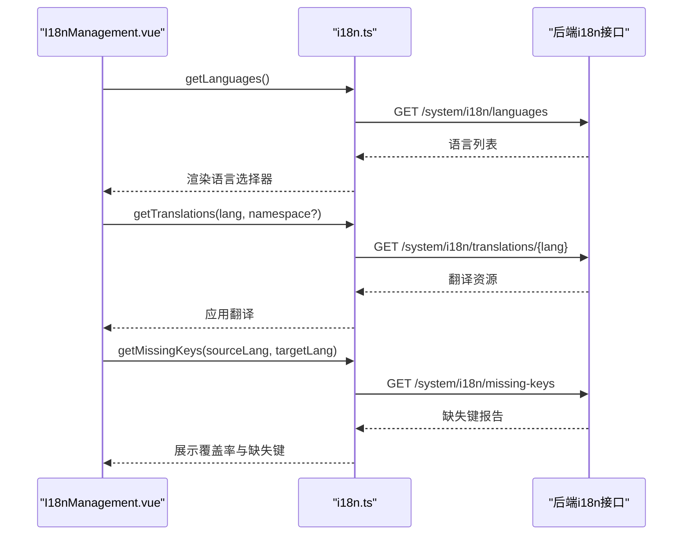
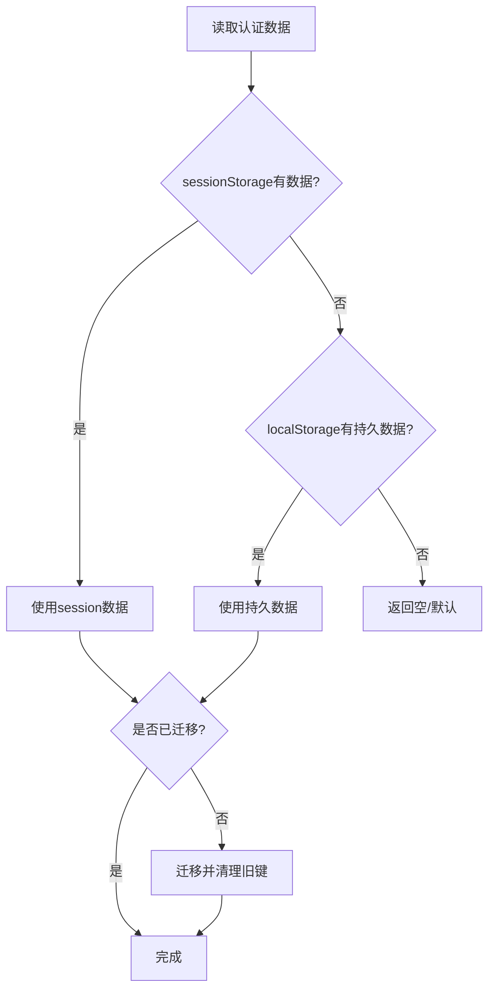
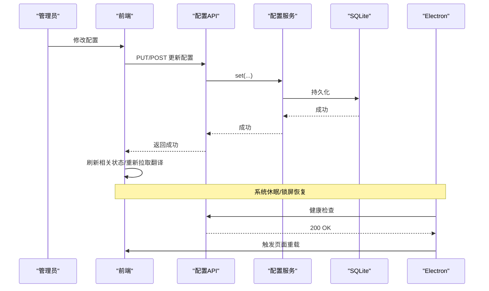
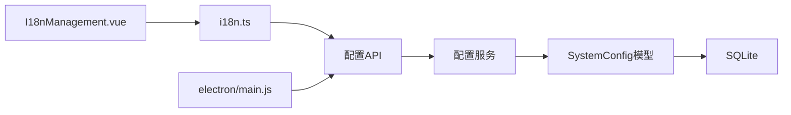

# 系统配置状态管理

<cite>
**本文引用的文件**
- [backend/app/core/config.py](file://backend/app/core/config.py)
- [backend/app/models/system_config.py](file://backend/app/models/system_config.py)
- [backend/app/services/system_config_service.py](file://backend/app/services/system_config_service.py)
- [backend/app/api/v1/system/system_config.py](file://backend/app/api/v1/system/system_config.py)
- [frontend/src/api/i18n.ts](file://frontend/src/api/i18n.ts)
- [frontend/src/views/system/I18nManagement.vue](file://frontend/src/views/system/I18nManagement.vue)
- [frontend/src/utils/authStorage.ts](file://frontend/src/utils/authStorage.ts)
- [electron/main.js](file://electron/main.js)
</cite>

## 目录
1. [简介](#简介)
2. [项目结构](#项目结构)
3. [核心组件](#核心组件)
4. [架构总览](#架构总览)
5. [详细组件分析](#详细组件分析)
6. [依赖关系分析](#依赖关系分析)
7. [性能考虑](#性能考虑)
8. [故障排查指南](#故障排查指南)
9. [结论](#结论)
10. [附录](#附录)

## 简介
本技术文档围绕“系统配置状态管理”展开，覆盖应用配置、主题与国际化配置的加载与更新机制；说明配置状态的持久化方案（本地存储与服务端同步）；阐述配置热更新与变更通知策略；对比开发/生产环境下的差异；并提供最佳实践与安全建议。

## 项目结构
后端采用分层设计：
- 配置定义与环境变量加载：app/core/config.py
- 配置数据模型与持久化：app/models/system_config.py
- 配置服务层（读/写/导入导出/默认值初始化）：app/services/system_config_service.py
- 配置API（查询、批量更新、导入导出、默认值）：app/api/v1/system/system_config.py

前端侧：
- 国际化API封装：frontend/src/api/i18n.ts
- 国际化管理界面：frontend/src/views/system/I18nManagement.vue
- 认证与本地存储工具（含会话/持久化迁移）：frontend/src/utils/authStorage.ts
- Electron主进程负责后端生命周期与恢复后页面重载：electron/main.js

图表来源
- [backend/app/core/config.py:54-383](file://backend/app/core/config.py#L54-L383)
- [backend/app/models/system_config.py:11-51](file://backend/app/models/system_config.py#L11-L51)
- [backend/app/services/system_config_service.py:68-266](file://backend/app/services/system_config_service.py#L68-L266)
- [backend/app/api/v1/system/system_config.py:21-281](file://backend/app/api/v1/system/system_config.py#L21-L281)
- [frontend/src/api/i18n.ts:51-104](file://frontend/src/api/i18n.ts#L51-L104)
- [frontend/src/views/system/I18nManagement.vue:1-40](file://frontend/src/views/system/I18nManagement.vue#L1-L40)
- [frontend/src/utils/authStorage.ts:1-282](file://frontend/src/utils/authStorage.ts#L1-L282)
- [electron/main.js:667-692](file://electron/main.js#L667-L692)

章节来源
- [backend/app/core/config.py:54-383](file://backend/app/core/config.py#L54-L383)
- [backend/app/models/system_config.py:11-51](file://backend/app/models/system_config.py#L11-L51)
- [backend/app/services/system_config_service.py:68-266](file://backend/app/services/system_config_service.py#L68-L266)
- [backend/app/api/v1/system/system_config.py:21-281](file://backend/app/api/v1/system/system_config.py#L21-L281)
- [frontend/src/api/i18n.ts:51-104](file://frontend/src/api/i18n.ts#L51-L104)
- [frontend/src/views/system/I18nManagement.vue:1-40](file://frontend/src/views/system/I18nManagement.vue#L1-L40)
- [frontend/src/utils/authStorage.ts:1-282](file://frontend/src/utils/authStorage.ts#L1-L282)
- [electron/main.js:667-692](file://electron/main.js#L667-L692)

## 核心组件
- 应用配置（Settings）：集中从环境变量加载，支持加密密钥文件回退、路径动态解析、生产环境安全加固（关闭SQL日志、强制字段加密密钥生成）。
- 系统配置服务：提供键值对配置读写、类型转换（int/bool/json）、默认值注入、导入导出、初始化与重载。
- 配置API：对外暴露获取/更新/导入导出/默认值等能力，并记录审计工作日志。
- 国际化API与界面：提供语言列表、翻译资源、缺失键检测、当前语言查询与管理界面。
- 本地存储与迁移：统一使用sessionStorage为主，兼容localStorage读取与迁移清理，支持“记住登录”的持久化令牌。
- Electron主进程：负责后端启动/重启/健康探测与恢复后页面重载，保障配置与状态一致性。

章节来源
- [backend/app/core/config.py:54-383](file://backend/app/core/config.py#L54-L383)
- [backend/app/services/system_config_service.py:68-266](file://backend/app/services/system_config_service.py#L68-L266)
- [backend/app/api/v1/system/system_config.py:21-281](file://backend/app/api/v1/system/system_config.py#L21-L281)
- [frontend/src/api/i18n.ts:51-104](file://frontend/src/api/i18n.ts#L51-L104)
- [frontend/src/views/system/I18nManagement.vue:1-40](file://frontend/src/views/system/I18nManagement.vue#L1-L40)
- [frontend/src/utils/authStorage.ts:1-282](file://frontend/src/utils/authStorage.ts#L1-L282)
- [electron/main.js:667-692](file://electron/main.js#L667-L692)

## 架构总览
下图展示了配置在前后端的流转：前端通过i18n API与配置API交互，后端服务层将配置持久化到SQLite；Electron在主进程中监控后端健康并在恢复时重载页面以刷新前端状态。

图表来源
- [backend/app/api/v1/system/system_config.py:46-281](file://backend/app/api/v1/system/system_config.py#L46-L281)
- [backend/app/services/system_config_service.py:100-266](file://backend/app/services/system_config_service.py#L100-L266)
- [backend/app/models/system_config.py:11-51](file://backend/app/models/system_config.py#L11-L51)
- [electron/main.js:667-692](file://electron/main.js#L667-L692)

## 详细组件分析

### 应用配置（Settings）
- 环境变量加载：基于BaseSettings，支持多环境.env文件与大小写不敏感。
- 路径与目录：动态计算数据、缓存、上传、导出、日志目录，解决Windows安装版权限问题。
- 安全加固：生产环境强制关闭DB_ECHO；未配置ENCRYPTION_KEY时自动生成并持久化；SECRET_KEY/CSRF_SECRET_KEY自动持久化。
- 可选加密密钥文件：支持从加密文件加载敏感配置，失败则回退环境变量。

图表来源
- [backend/app/core/config.py:54-383](file://backend/app/core/config.py#L54-L383)

章节来源
- [backend/app/core/config.py:54-383](file://backend/app/core/config.py#L54-L383)

### 系统配置服务与模型
- 模型：SystemConfig表包含key/value/description/时间戳；SystemUpdateLog用于版本更新记录。
- 服务：
  - 读取：get/get_int/get_bool/get_json，无DB时回退到DEFAULT_CONFIGS。
  - 写入：set自动序列化布尔/字典/列表为字符串，存在则更新，不存在则新增。
  - 初始化：initialize_defaults按默认清单插入缺失项。
  - 导入导出：export_config/import_config便于备份与迁移。
  - 重载：reload清空ORM缓存。

图表来源
- [backend/app/models/system_config.py:11-51](file://backend/app/models/system_config.py#L11-L51)
- [backend/app/services/system_config_service.py:68-266](file://backend/app/services/system_config_service.py#L68-L266)

章节来源
- [backend/app/models/system_config.py:11-51](file://backend/app/models/system_config.py#L11-L51)
- [backend/app/services/system_config_service.py:68-266](file://backend/app/services/system_config_service.py#L68-L266)

### 配置API（CRUD与导入导出）
- 获取全部/单个配置：附带描述信息。
- 批量更新：限制管理员权限，记录工作日志。
- 导入/导出JSON：用于迁移与恢复。
- 默认值接口：供前端展示可配置项。
- 删除配置：禁止删除核心默认项。

图表来源
- [backend/app/api/v1/system/system_config.py:69-106](file://backend/app/api/v1/system/system_config.py#L69-L106)
- [backend/app/services/system_config_service.py:155-189](file://backend/app/services/system_config_service.py#L155-L189)

章节来源
- [backend/app/api/v1/system/system_config.py:21-281](file://backend/app/api/v1/system/system_config.py#L21-L281)

### 国际化配置（加载与更新）
- 前端API：提供语言列表、翻译资源、单键翻译、缺失键报告、当前语言查询。
- 管理界面：选择目标语言、检查缺失键、刷新翻译资源。
- 典型流程：前端调用i18n API获取翻译资源，渲染界面文本；通过缺失键报告定位遗漏翻译。

图表来源
- [frontend/src/api/i18n.ts:51-104](file://frontend/src/api/i18n.ts#L51-L104)
- [frontend/src/views/system/I18nManagement.vue:1-40](file://frontend/src/views/system/I18nManagement.vue#L1-L40)

章节来源
- [frontend/src/api/i18n.ts:51-104](file://frontend/src/api/i18n.ts#L51-L104)
- [frontend/src/views/system/I18nManagement.vue:1-40](file://frontend/src/views/system/I18nManagement.vue#L1-L40)

### 本地存储与迁移（认证与偏好）
- 存储策略：优先sessionStorage，读取时回退到localStorage与“记住登录”持久区；迁移完成后清理旧键。
- 用途：保存token、用户信息、刷新令牌；支持锁屏场景保留持久凭据。
- 与配置的关系：用户语言偏好等可通过系统配置持久化，结合前端本地存储实现快速切换。

图表来源
- [frontend/src/utils/authStorage.ts:1-282](file://frontend/src/utils/authStorage.ts#L1-L282)

章节来源
- [frontend/src/utils/authStorage.ts:1-282](file://frontend/src/utils/authStorage.ts#L1-L282)

### 配置热更新与变更通知
- 服务端热更新：通过API即时写入配置并落库；服务层reload可清空ORM缓存，确保后续读取最新值。
- 前端热更新：
  - 国际化：通过API拉取最新翻译资源并替换当前语言包。
  - 其他配置：可在页面或全局store中调用配置API刷新局部状态。
- 桌面端恢复：Electron在主进程检测到系统恢复后，探测后端健康并触发页面重载，保证前端状态与后端一致。

图表来源
- [backend/app/api/v1/system/system_config.py:69-159](file://backend/app/api/v1/system/system_config.py#L69-L159)
- [backend/app/services/system_config_service.py:246-251](file://backend/app/services/system_config_service.py#L246-L251)
- [electron/main.js:667-692](file://electron/main.js#L667-L692)

章节来源
- [backend/app/services/system_config_service.py:246-251](file://backend/app/services/system_config_service.py#L246-L251)
- [electron/main.js:667-692](file://electron/main.js#L667-L692)

### 环境差异（开发 vs 生产）
- 开发环境：
  - 允许更多CORS源（含Vite开发端口），便于本地调试。
  - 可开启DB_ECHO以便观察SQL（但生产强制关闭）。
- 生产环境：
  - 强制关闭DB_ECHO防止敏感信息泄露。
  - 未配置ENCRYPTION_KEY时自动生成并持久化。
  - 严格CORS策略（仅本机回环地址）。
  - 访问令牌有效期缩短至8小时，增强安全性。

章节来源
- [backend/app/core/config.py:127-153](file://backend/app/core/config.py#L127-L153)
- [backend/app/core/config.py:301-329](file://backend/app/core/config.py#L301-L329)

## 依赖关系分析
- 配置API依赖配置服务；服务依赖模型与数据库；模型映射到SQLite。
- 前端i18n模块依赖HTTP请求封装；管理界面依赖i18n API。
- Electron主进程通过健康检查与页面重载协调前后端状态。

图表来源
- [backend/app/api/v1/system/system_config.py:21-281](file://backend/app/api/v1/system/system_config.py#L21-L281)
- [backend/app/services/system_config_service.py:68-266](file://backend/app/services/system_config_service.py#L68-L266)
- [backend/app/models/system_config.py:11-51](file://backend/app/models/system_config.py#L11-L51)
- [frontend/src/api/i18n.ts:51-104](file://frontend/src/api/i18n.ts#L51-L104)
- [frontend/src/views/system/I18nManagement.vue:1-40](file://frontend/src/views/system/I18nManagement.vue#L1-L40)
- [electron/main.js:667-692](file://electron/main.js#L667-L692)

章节来源
- [backend/app/api/v1/system/system_config.py:21-281](file://backend/app/api/v1/system/system_config.py#L21-L281)
- [backend/app/services/system_config_service.py:68-266](file://backend/app/services/system_config_service.py#L68-L266)
- [backend/app/models/system_config.py:11-51](file://backend/app/models/system_config.py#L11-L51)
- [frontend/src/api/i18n.ts:51-104](file://frontend/src/api/i18n.ts#L51-L104)
- [frontend/src/views/system/I18nManagement.vue:1-40](file://frontend/src/views/system/I18nManagement.vue#L1-L40)
- [electron/main.js:667-692](file://electron/main.js#L667-L692)

## 性能考虑
- 批量更新：通过批量接口减少多次网络往返，降低延迟。
- 导入导出：大配置集建议使用JSON导入导出，避免逐条更新。
- 缓存与重载：服务层reload清空ORM缓存，避免脏读；前端按需刷新，避免全量重拉。
- 连接池：SQLite走QueuePool，WAL模式提升并发读性能；根据压测调整连接数。

[本节为通用指导，无需具体文件引用]

## 故障排查指南
- 配置导入失败：检查JSON格式是否正确；确认管理员权限；查看工作日志。
- 无法删除配置：若为目标键为核心默认项，将被拒绝；需先确认键是否在默认清单中。
- 后端异常退出：Electron会尝试自动重启；若超过阈值，提示可能原因（杀软拦截、临时目录、磁盘空间不足）并引导查看日志。
- 系统恢复后状态不一致：Electron会在resume时探测后端健康并触发页面重载，确保前端状态与后端一致。

章节来源
- [backend/app/api/v1/system/system_config.py:130-159](file://backend/app/api/v1/system/system_config.py#L130-L159)
- [backend/app/api/v1/system/system_config.py:245-281](file://backend/app/api/v1/system/system_config.py#L245-L281)
- [electron/main.js:332-379](file://electron/main.js#L332-L379)
- [electron/main.js:667-692](file://electron/main.js#L667-L692)

## 结论
本系统通过清晰的分层架构实现了配置的统一管理与持久化：后端以Settings集中管理运行期配置，以SystemConfigService提供健壮的键值配置能力；前端通过i18n API与管理界面实现多语言资源的加载与可视化维护；Electron主进程保障桌面端运行时的稳定性与状态一致性。配合严格的权限控制、审计日志与环境差异化策略，系统在安全性与可运维性方面具备良好基础。

[本节为总结，无需具体文件引用]

## 附录
- 最佳实践
  - 所有敏感配置通过环境变量或加密密钥文件管理，避免硬编码。
  - 生产环境禁用SQL日志输出，防止敏感信息泄露。
  - 使用批量接口更新配置，减少网络开销。
  - 定期导出配置备份，便于灾难恢复。
  - 前端在关键操作后主动刷新相关状态，避免显示陈旧数据。
- 安全考虑
  - 配置修改需管理员权限，并记录审计日志。
  - 生产环境强制关闭DB_ECHO，自动生成并持久化加密密钥。
  - 限制CORS与访问令牌有效期，降低攻击面。
  - 使用sessionStorage为主存储，谨慎处理localStorage中的持久化数据。

[本节为通用指导，无需具体文件引用]