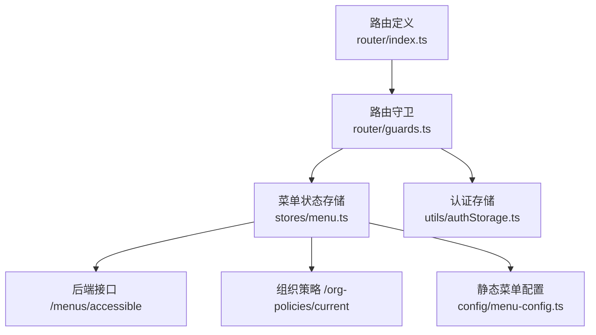
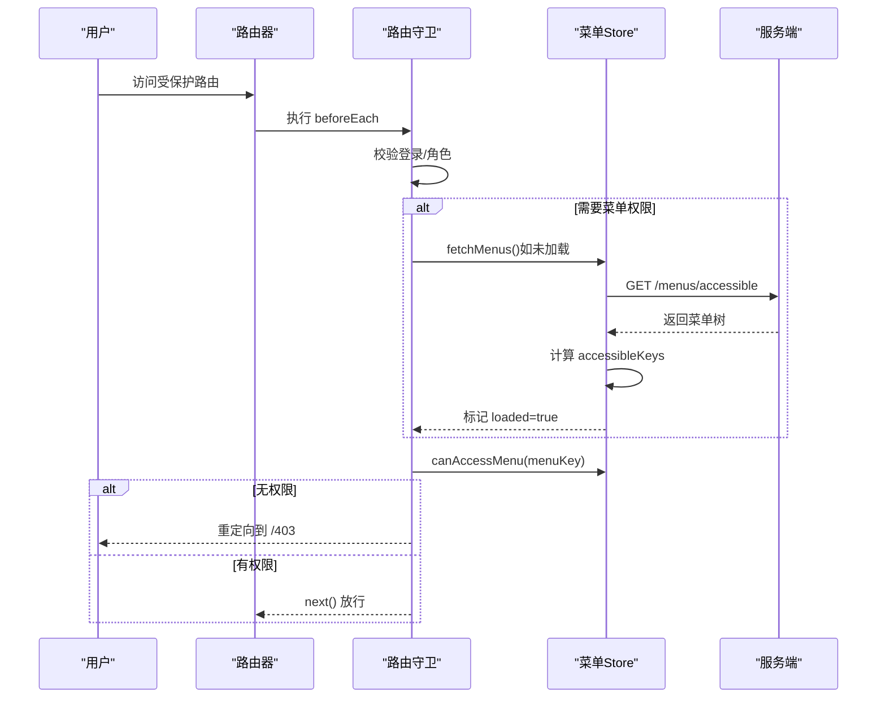
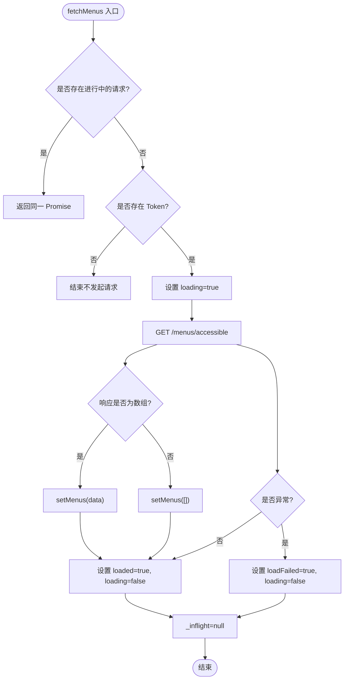
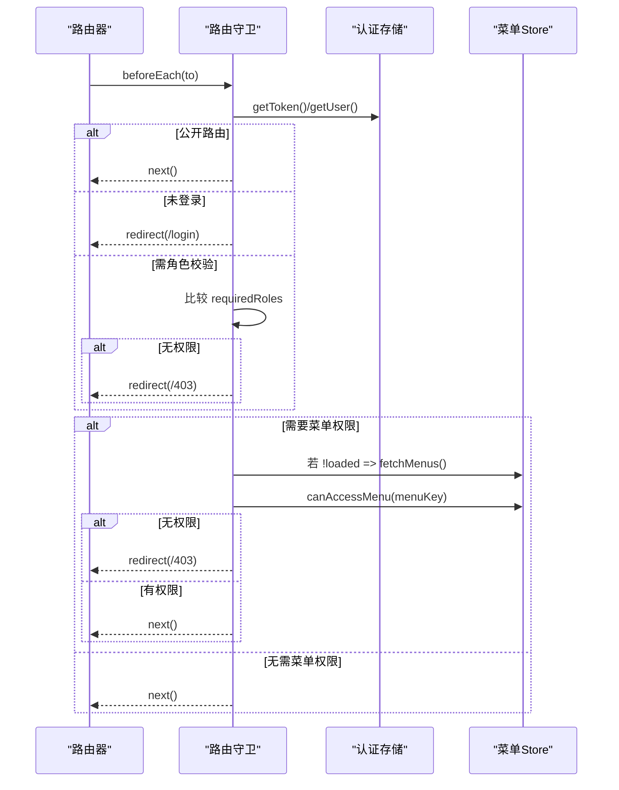
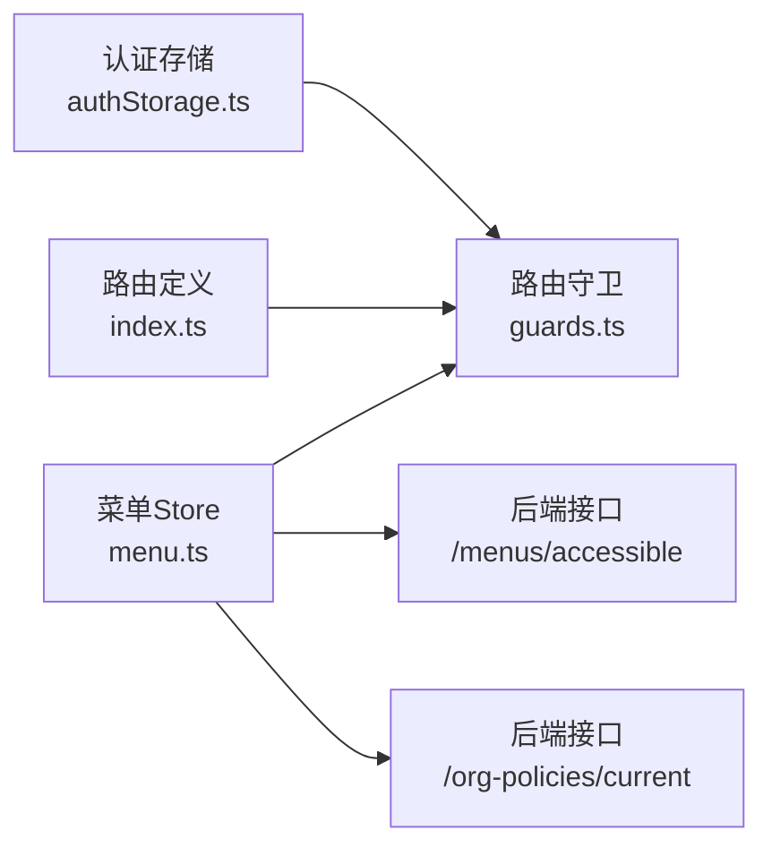

# 菜单状态管理

<cite>
**本文引用的文件**
- [menu.ts](file://frontend/src/stores/menu.ts)
- [guards.ts](file://frontend/src/router/guards.ts)
- [index.ts](file://frontend/src/router/index.ts)
- [menu-config.ts](file://frontend/src/config/menu-config.ts)
- [authStorage.ts](file://frontend/src/utils/authStorage.ts)
- [MenuVisibilityPanel.test.ts](file://frontend/tests/unit/components/MenuVisibilityPanel.test.ts)
- [guards.test.ts](file://frontend/tests/unit/router/guards.test.ts)
- [menu.test.ts](file://frontend/tests/unit/stores/menu.test.ts)
</cite>

## 目录
1. [简介](#简介)
2. [项目结构](#项目结构)
3. [核心组件](#核心组件)
4. [架构总览](#架构总览)
5. [详细组件分析](#详细组件分析)
6. [依赖关系分析](#依赖关系分析)
7. [性能考虑](#性能考虑)
8. [故障排查指南](#故障排查指南)
9. [结论](#结论)
10. [附录](#附录)

## 简介
本技术文档围绕“菜单状态管理”展开，聚焦动态菜单的生成与管理、基于用户权限的菜单过滤、菜单树构建算法、与路由系统的集成（路由守卫配合、高亮状态）、配置层次结构与扩展机制、以及性能优化策略（懒加载、缓存）。目标是帮助开发者快速理解并安全扩展系统的前端菜单能力。

## 项目结构
前端菜单相关代码主要分布在以下位置：
- 菜单状态与数据源：stores/menu.ts
- 路由与权限守卫：router/index.ts、router/guards.ts
- 静态菜单配置（回退与开发期）：config/menu-config.ts
- 认证与用户信息：utils/authStorage.ts
- 测试用例覆盖关键流程：tests/unit/stores/menu.test.ts、tests/unit/router/guards.test.ts、tests/unit/components/MenuVisibilityPanel.test.ts

图表来源
- [index.ts:1-800](file://frontend/src/router/index.ts#L1-L800)
- [guards.ts:1-88](file://frontend/src/router/guards.ts#L1-L88)
- [menu.ts:1-145](file://frontend/src/stores/menu.ts#L1-L145)
- [authStorage.ts:1-283](file://frontend/src/utils/authStorage.ts#L1-L283)
- [menu-config.ts:1-364](file://frontend/src/config/menu-config.ts#L1-L364)

章节来源
- [index.ts:1-800](file://frontend/src/router/index.ts#L1-L800)
- [guards.ts:1-88](file://frontend/src/router/guards.ts#L1-L88)
- [menu.ts:1-145](file://frontend/src/stores/menu.ts#L1-L145)
- [authStorage.ts:1-283](file://frontend/src/utils/authStorage.ts#L1-L283)
- [menu-config.ts:1-364](file://frontend/src/config/menu-config.ts#L1-L364)

## 核心组件
- 菜单状态存储（Pinia store）：维护菜单树、当前激活项、加载状态、可访问键集合、组织模块策略；提供获取、设置、权限判断等方法。
- 路由守卫：负责认证检查、角色校验、菜单可见性校验，并在首次访问时触发菜单加载。
- 路由定义：为每个页面声明 meta.menuKey，用于与菜单 key 对齐，实现权限控制与高亮。
- 静态菜单配置：作为开发期或后端不可用时的回退菜单树，并提供全量 key 提取工具。
- 认证存储：提供 token、用户信息等读取，供守卫与菜单加载使用。

章节来源
- [menu.ts:1-145](file://frontend/src/stores/menu.ts#L1-L145)
- [guards.ts:1-88](file://frontend/src/router/guards.ts#L1-L88)
- [index.ts:1-800](file://frontend/src/router/index.ts#L1-L800)
- [menu-config.ts:1-364](file://frontend/src/config/menu-config.ts#L1-L364)
- [authStorage.ts:1-283](file://frontend/src/utils/authStorage.ts#L1-L283)

## 架构总览
菜单状态管理的整体流程如下：
- 路由进入时，守卫先进行认证与角色检查。
- 若目标路由包含 meta.menuKey，则确保菜单已加载；未加载则调用菜单 store 拉取当前用户可见菜单。
- 菜单 store 去重并发请求，从后端获取菜单树，计算所有可访问 key，并更新 loaded 状态。
- 守卫根据 canAccessMenu 判断是否允许进入；否则跳转 403。
- 菜单树可用于侧边栏渲染，结合当前路由路径实现高亮。

图表来源
- [guards.ts:1-88](file://frontend/src/router/guards.ts#L1-L88)
- [menu.ts:1-145](file://frontend/src/stores/menu.ts#L1-L145)

章节来源
- [guards.ts:1-88](file://frontend/src/router/guards.ts#L1-L88)
- [menu.ts:1-145](file://frontend/src/stores/menu.ts#L1-L145)

## 详细组件分析

### 菜单状态存储（stores/menu.ts）
- 数据结构
  - menus：菜单树数组，节点包含 key、label、path、icon、roles、children、order。
  - activeMenu：当前激活菜单 key。
  - loaded/loading/loadFailed：加载状态标志。
  - allKeys：从菜单树中提取的所有 key（含子节点），用于快速权限判定。
  - orgPolicies：组织级模块策略映射，支持 visibility/edit_mode 控制。
- 关键方法
  - setMenus：写入菜单树，计算 allKeys，置位 loaded，清理失败态。
  - setActive：设置当前激活菜单。
  - setOrgPolicies：将策略列表转为映射。
  - canAccessMenu：优先检查组织策略 hidden，再判断是否在 allKeys 中。
  - canEditModule/isModuleDisabled：基于 edit_mode 与 visibility 控制编辑与禁用。
  - fetchMenus：并发安全的菜单加载，去重 in-flight Promise，兼容多种响应格式。
  - fetchOrgPolicies：异步加载组织策略，失败不阻塞。
- 复杂度
  - _extractAllKeys：O(N)，N 为菜单节点总数。
  - canAccessMenu：O(1) 查找 Set。
- 错误处理
  - 网络异常时设置 loadFailed=true，保持 loaded=false 以便重试。
  - 非数组响应安全降级为空菜单。

图表来源
- [menu.ts:87-112](file://frontend/src/stores/menu.ts#L87-L112)

章节来源
- [menu.ts:1-145](file://frontend/src/stores/menu.ts#L1-L145)

### 路由与守卫（router/index.ts、router/guards.ts）
- 路由定义
  - 每个业务路由通过 meta.menuKey 与菜单 key 对齐，便于守卫进行权限校验。
  - 公共路由通过 noAuth 跳过鉴权。
- 守卫逻辑
  - 白名单与强制改密检查。
  - 未登录跳转登录页。
  - 角色校验：meta.roles 存在时比对用户角色。
  - 菜单权限：首次访问时加载菜单，loaded 且不在可访问集合内则 403。
  - 注意：菜单加载失败时不阻断导航，真实权限由后端兜底。

图表来源
- [guards.ts:1-88](file://frontend/src/router/guards.ts#L1-L88)
- [index.ts:1-800](file://frontend/src/router/index.ts#L1-L800)

章节来源
- [guards.ts:1-88](file://frontend/src/router/guards.ts#L1-L88)
- [index.ts:1-800](file://frontend/src/router/index.ts#L1-L800)

### 菜单配置与回退机制（config/menu-config.ts）
- MENU_CONFIG：静态菜单树，用于开发期展示或后端不可用时的回退。
- getAllMenuKeys：递归收集所有菜单 key，便于一致性校验与测试。
- 扩展方式：新增菜单项需保证 key 唯一，并与路由 meta.menuKey 保持一致。

章节来源
- [menu-config.ts:1-364](file://frontend/src/config/menu-config.ts#L1-L364)

### 认证与用户上下文（utils/authStorage.ts）
- 提供统一的 token、用户信息存取，支持会话与持久化（记住登录）两种模式。
- 守卫与菜单加载依赖其提供的 getToken/getUser 能力。

章节来源
- [authStorage.ts:1-283](file://frontend/src/utils/authStorage.ts#L1-L283)

## 依赖关系分析
- 菜单 Store 依赖：
  - 认证存储：用于判断是否已登录。
  - 后端接口：/menus/accessible、/org-policies/current。
- 路由守卫依赖：
  - 认证存储：读取 token/user。
  - 菜单 Store：加载菜单与权限判断。
- 路由定义依赖：
  - meta.menuKey 与菜单 key 的契约关系。

图表来源
- [authStorage.ts:1-283](file://frontend/src/utils/authStorage.ts#L1-L283)
- [guards.ts:1-88](file://frontend/src/router/guards.ts#L1-L88)
- [menu.ts:1-145](file://frontend/src/stores/menu.ts#L1-L145)
- [index.ts:1-800](file://frontend/src/router/index.ts#L1-L800)

章节来源
- [authStorage.ts:1-283](file://frontend/src/utils/authStorage.ts#L1-L283)
- [guards.ts:1-88](file://frontend/src/router/guards.ts#L1-L88)
- [menu.ts:1-145](file://frontend/src/stores/menu.ts#L1-L145)
- [index.ts:1-800](file://frontend/src/router/index.ts#L1-L800)

## 性能考虑
- 并发去重：fetchMenus 使用 _inflight 变量共享同一 Promise，避免重复请求。
- 懒加载：仅在首次访问需要菜单权限的路由时加载菜单，减少初始开销。
- 缓存机制：
  - 内存缓存：菜单树与 allKeys 保存在 Pinia store，跨组件共享。
  - 组织策略缓存：orgPolicies 以映射形式缓存，O(1) 查询。
- 容错降级：
  - 菜单加载失败不阻断导航，避免冷启动窗口期的全站 403。
  - 静态菜单配置可作为回退，保障基本可用性。
- 建议优化：
  - 对大菜单树可使用虚拟滚动或分页加载子节点。
  - 对频繁切换的角色/组织，可在登录后主动预加载菜单与策略。
  - 对后端接口增加 ETag/Last-Modified 等缓存头，进一步减少请求。

[本节为通用性能指导，不直接分析具体文件]

## 故障排查指南
- 登录后立即被弹到 /403
  - 可能原因：菜单尚未加载完成，守卫拿到 loaded=false 导致 canAccessMenu 返回 false。
  - 解决方案：确保 fetchMenus 的并发去重生效，等待 loaded=true 后再放行。
  - 参考验证：并发调用共享同一请求的测试用例。
- 菜单加载失败导致全站不可见
  - 可能原因：后端接口异常或网络问题。
  - 解决方案：利用静态菜单配置回退；同时记录 loadFailed 状态以便重试。
  - 参考验证：菜单面板在接口失败时回退到 MENU_CONFIG 的测试。
- 菜单高亮不正确
  - 可能原因：路由 meta.menuKey 与菜单 key 不一致。
  - 解决方案：核对路由定义与菜单配置的 key 对应关系。
- 组织策略隐藏了模块
  - 可能原因：orgPolicies.visibility=hidden。
  - 解决方案：调整组织策略或确认权限包配置。

章节来源
- [menu.test.ts:190-264](file://frontend/tests/unit/stores/menu.test.ts#L190-L264)
- [MenuVisibilityPanel.test.ts:158-190](file://frontend/tests/unit/components/MenuVisibilityPanel.test.ts#L158-L190)
- [guards.test.ts:1-47](file://frontend/tests/unit/router/guards.test.ts#L1-L47)

## 结论
本系统通过“路由守卫 + 菜单状态存储 + 静态配置回退”的组合，实现了安全、灵活且高性能的动态菜单管理。菜单加载具备并发去重与容错降级能力，组织策略提供了细粒度的模块可见性与编辑控制。建议在新增菜单时严格遵循 key 一致性与职责分离原则，并结合性能优化策略提升用户体验。

[本节为总结性内容，不直接分析具体文件]

## 附录
- 开发指南
  - 新增菜单：在 config/menu-config.ts 添加菜单项，确保 key 唯一；在 router/index.ts 对应路由声明 meta.menuKey。
  - 权限控制：通过 roles 字段限制菜单可见性；通过组织策略 visibility/edit_mode 控制模块行为。
  - 高亮实现：基于当前路由 path 与菜单 path 匹配，或使用 store.activeMenu 管理高亮。
- 常见问题
  - 菜单与路由不同步：检查 menuKey 与路由 meta 的一致性。
  - 多角色差异化展示：结合 roles 与组织策略，必要时在后端返回更细粒度菜单。
  - 性能瓶颈：对超大菜单树采用懒加载与虚拟化；对频繁访问的菜单预加载。

[本节为补充说明，不直接分析具体文件]