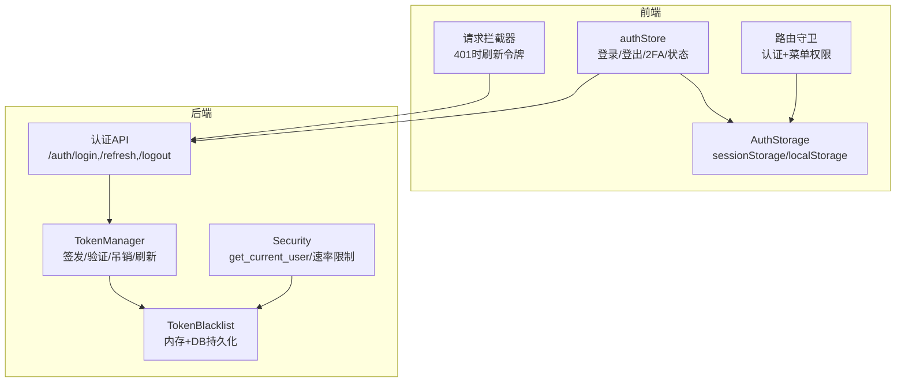
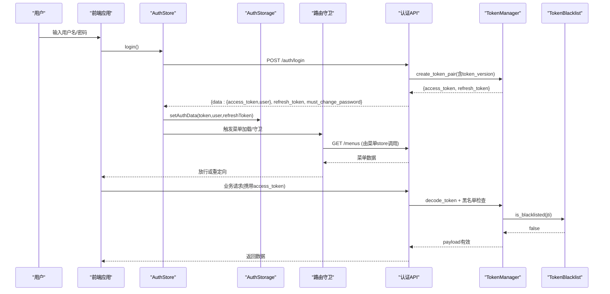
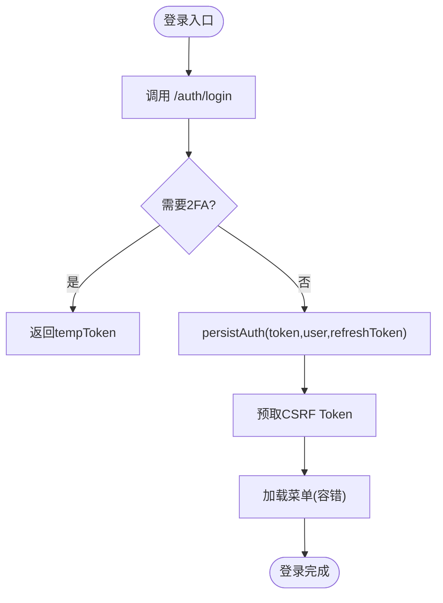
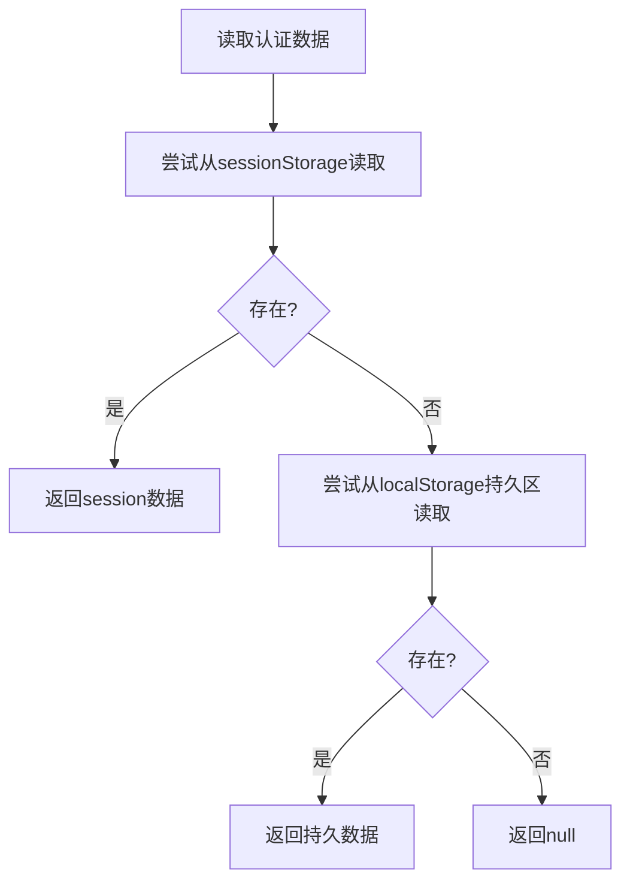
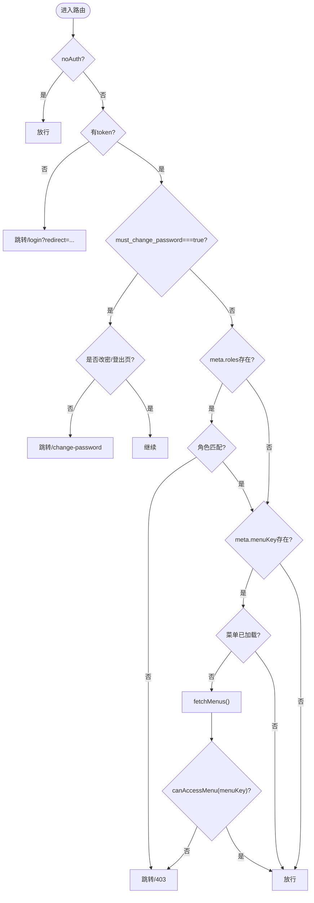
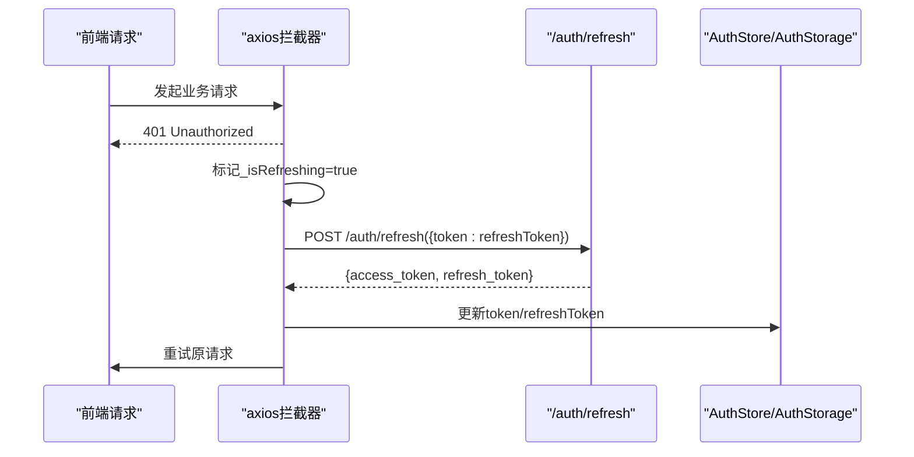
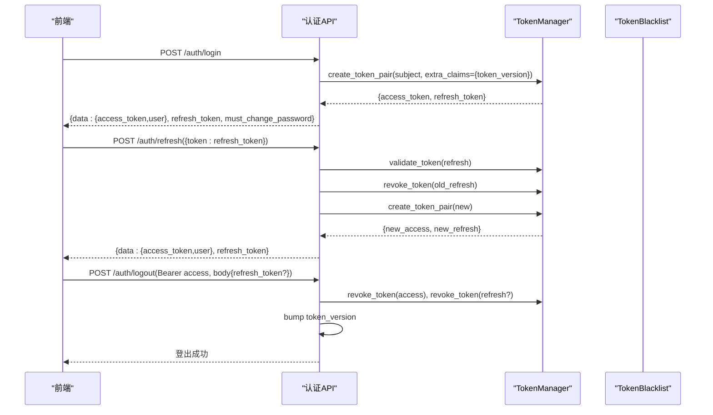
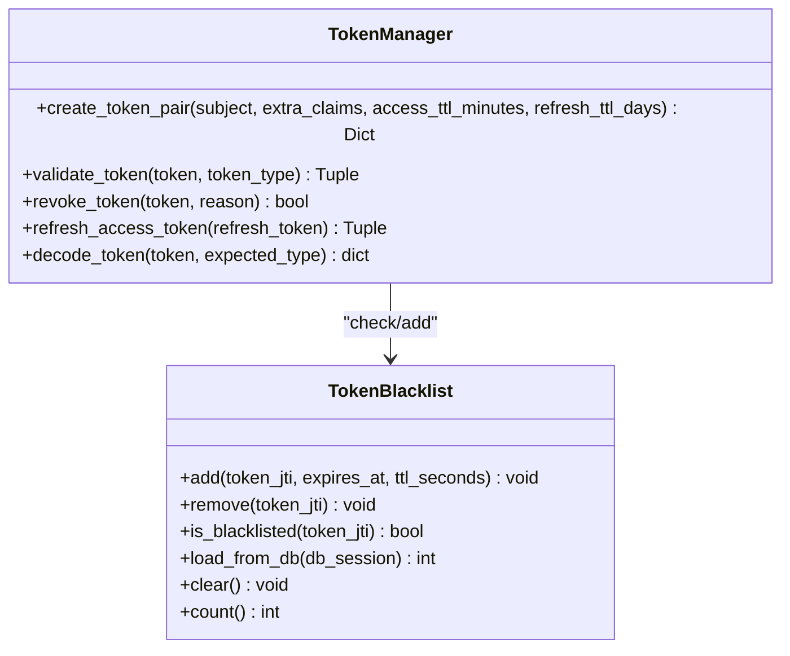
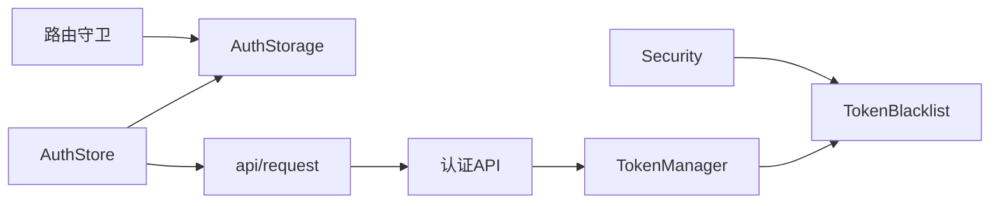

# 认证状态管理

<cite>
**本文引用的文件**
- [frontend/src/stores/auth.ts](file://frontend/src/stores/auth.ts)
- [frontend/src/utils/authStorage.ts](file://frontend/src/utils/authStorage.ts)
- [frontend/src/router/guards.ts](file://frontend/src/router/guards.ts)
- [backend/app/api/v1/auth/auth.py](file://backend/app/api/v1/auth/auth.py)
- [backend/app/core/token_manager.py](file://backend/app/core/token_manager.py)
- [backend/app/core/security.py](file://backend/app/core/security.py)
- [backend/app/core/token_blacklist.py](file://backend/app/core/token_blacklist.py)
- [frontend/src/api/request.ts](file://frontend/src/api/request.ts)
</cite>

## 目录
1. [简介](#简介)
2. [项目结构](#项目结构)
3. [核心组件](#核心组件)
4. [架构总览](#架构总览)
5. [详细组件分析](#详细组件分析)
6. [依赖关系分析](#依赖关系分析)
7. [性能与缓存策略](#性能与缓存策略)
8. [故障排查指南](#故障排查指南)
9. [结论](#结论)
10. [附录：最佳实践与安全建议](#附录：最佳实践与安全建议)

## 简介
本技术文档围绕“认证状态管理”展开，系统性说明前后端在用户认证、JWT 令牌生命周期、会话状态维护、权限信息缓存、本地存储同步（含自动登录、多标签页一致性）、路由守卫与权限校验流程等方面的设计与实现。同时提供安全考虑、错误处理与调试方法，帮助开发者在生产环境中稳定运行并快速定位问题。

## 项目结构
认证相关代码分布在前后端多个模块中：
- 前端：Pinia 认证 Store、统一认证存储工具、路由守卫、请求拦截器（刷新令牌）
- 后端：认证 API、令牌管理器、安全中间件、令牌黑名单持久化

**图表来源**
- [frontend/src/stores/auth.ts:31-295](file://frontend/src/stores/auth.ts#L31-L295)
- [frontend/src/utils/authStorage.ts:54-259](file://frontend/src/utils/authStorage.ts#L54-L259)
- [frontend/src/router/guards.ts:13-83](file://frontend/src/router/guards.ts#L13-L83)
- [backend/app/api/v1/auth/auth.py:101-287](file://backend/app/api/v1/auth/auth.py#L101-L287)
- [backend/app/core/token_manager.py:64-127](file://backend/app/core/token_manager.py#L64-L127)
- [backend/app/core/security.py:243-336](file://backend/app/core/security.py#L243-L336)
- [backend/app/core/token_blacklist.py:27-70](file://backend/app/core/token_blacklist.py#L27-L70)

**章节来源**
- [frontend/src/stores/auth.ts:31-295](file://frontend/src/stores/auth.ts#L31-L295)
- [frontend/src/utils/authStorage.ts:54-259](file://frontend/src/utils/authStorage.ts#L54-L259)
- [frontend/src/router/guards.ts:13-83](file://frontend/src/router/guards.ts#L13-L83)
- [backend/app/api/v1/auth/auth.py:101-287](file://backend/app/api/v1/auth/auth.py#L101-L287)
- [backend/app/core/token_manager.py:64-127](file://backend/app/core/token_manager.py#L64-L127)
- [backend/app/core/security.py:243-336](file://backend/app/core/security.py#L243-L336)
- [backend/app/core/token_blacklist.py:27-70](file://backend/app/core/token_blacklist.py#L27-L70)

## 核心组件
- 前端认证 Store（useAuthStore）：封装登录、2FA、登出、锁屏/解锁、用户信息恢复、权限计算等
- 认证存储（AuthStorage）：统一读写 sessionStorage/localStorage，支持“记住登录”和迁移
- 路由守卫（routeGuard）：未登录跳转、强制改密、角色与菜单权限校验
- 请求拦截器：401 时静默刷新 access token，失败则登出
- 后端认证 API：登录、双因素验证、刷新、登出、获取当前用户、CSRF Token
- 令牌管理器（TokenManager）：签发/验证/吊销/刷新 JWT，支持黑名单与版本控制
- 安全模块（Security）：get_current_user 依赖、速率限制、密码策略、安全头
- 令牌黑名单（TokenBlacklist）：内存集合 + 可选数据库持久化，确保吊销立即生效

**章节来源**
- [frontend/src/stores/auth.ts:31-295](file://frontend/src/stores/auth.ts#L31-L295)
- [frontend/src/utils/authStorage.ts:54-259](file://frontend/src/utils/authStorage.ts#L54-L259)
- [frontend/src/router/guards.ts:13-83](file://frontend/src/router/guards.ts#L13-L83)
- [backend/app/api/v1/auth/auth.py:101-287](file://backend/app/api/v1/auth/auth.py#L101-L287)
- [backend/app/core/token_manager.py:64-283](file://backend/app/core/token_manager.py#L64-L283)
- [backend/app/core/security.py:243-336](file://backend/app/core/security.py#L243-L336)
- [backend/app/core/token_blacklist.py:27-163](file://backend/app/core/token_blacklist.py#L27-L163)

## 架构总览
以下序列图展示一次完整登录到访问受保护资源的流程，包括 2FA、菜单加载、路由守卫与后端鉴权。

**图表来源**
- [frontend/src/stores/auth.ts:171-225](file://frontend/src/stores/auth.ts#L171-L225)
- [frontend/src/utils/authStorage.ts:127-149](file://frontend/src/utils/authStorage.ts#L127-L149)
- [frontend/src/router/guards.ts:65-80](file://frontend/src/router/guards.ts#L65-L80)
- [backend/app/api/v1/auth/auth.py:101-287](file://backend/app/api/v1/auth/auth.py#L101-L287)
- [backend/app/core/token_manager.py:64-127](file://backend/app/core/token_manager.py#L64-L127)
- [backend/app/core/token_blacklist.py:60-70](file://backend/app/core/token_blacklist.py#L60-L70)

## 详细组件分析

### 前端认证 Store（useAuthStore）
- 状态管理：token、refreshToken、user、error；派生 computed：isAuthenticated、isAdmin、canViewDeleted、mustChangePassword、modulePermissions
- 登录流程：
  - 调用 /auth/login，处理 2FA 分支（two_factor_required + tempToken）
  - 合并 must_change_password（信封顶层优先），持久化到 AuthStorage
  - 登录后预取 CSRF Token 并尝试加载菜单
- 登出流程：
  - 尽力调用 /auth/logout（携带 refresh_token 以便一并吊销），失败不阻塞本地清理
  - 清空本地状态与缓存，清除所有认证数据
- 锁屏/解锁：
  - lockSession：清空会话级状态并设置 auto_lock_active 标记
  - unlockSession：移除锁标记，允许自动登录恢复
- 用户信息恢复：
  - fetchUser：当有 token 但无 user 时拉取当前用户并更新存储

**图表来源**
- [frontend/src/stores/auth.ts:171-225](file://frontend/src/stores/auth.ts#L171-L225)
- [frontend/src/stores/auth.ts:93-105](file://frontend/src/stores/auth.ts#L93-L105)

**章节来源**
- [frontend/src/stores/auth.ts:31-295](file://frontend/src/stores/auth.ts#L31-L295)

### 认证存储（AuthStorage）
- 设计原则：新数据写入 sessionStorage（关闭即清），读取时优先 session，回退 localStorage（兼容旧版）
- “记住登录”：将 token/user/refreshToken 持久化到 localStorage，用于下次开机免登录
- 迁移：首次启动从旧版 localStorage 迁移至 sessionStorage，并清理旧键
- 关键接口：setToken/getToken、setUser/getUser、setRefreshToken/getRefreshToken、setAuthData/getAuthData、persistForAutoLogin/clearPersisted、clear/clearSession、isAuthenticated

**图表来源**
- [frontend/src/utils/authStorage.ts:67-122](file://frontend/src/utils/authStorage.ts#L67-L122)
- [frontend/src/utils/authStorage.ts:159-177](file://frontend/src/utils/authStorage.ts#L159-L177)
- [frontend/src/utils/authStorage.ts:218-258](file://frontend/src/utils/authStorage.ts#L218-L258)

**章节来源**
- [frontend/src/utils/authStorage.ts:54-259](file://frontend/src/utils/authStorage.ts#L54-L259)

### 路由守卫与权限校验（routeGuard）
- 公开路由白名单直接放行
- 已登录且未锁屏时访问登录/注册页直接跳转到工作台
- 未登录跳转登录页（带 redirect）
- 强制改密：must_change_password === true 时仅允许访问改密/登出页面
- 角色权限：meta.roles 非空时校验用户角色（支持历史角色归一化）
- 菜单权限：首次访问时加载菜单，仅在菜单已加载且明确不含该 menuKey 时拒绝

**图表来源**
- [frontend/src/router/guards.ts:13-83](file://frontend/src/router/guards.ts#L13-L83)

**章节来源**
- [frontend/src/router/guards.ts:13-83](file://frontend/src/router/guards.ts#L13-L83)

### 请求拦截器与令牌刷新
- 当收到 401 时，若存在 refreshToken，则使用 /auth/refresh 刷新 access token
- 刷新请求需携带 CSRF Token（避免 403）
- 刷新成功后重试原请求；失败则清理本地状态并跳转登录

**图表来源**
- [frontend/src/api/request.ts:386-412](file://frontend/src/api/request.ts#L386-L412)

**章节来源**
- [frontend/src/api/request.ts:386-412](file://frontend/src/api/request.ts#L386-L412)

### 后端认证 API
- 登录：
  - 速率限制（同一 IP 每分钟最多 5 次）
  - 校验用户激活状态、账户锁定、机器码绑定
  - 若启用 2FA，返回临时令牌（5分钟）
  - 正常登录：签发 access + refresh token（包含 token_version），返回 must_change_password
- 双因素验证：
  - 校验 temp_token、TOTP 验证码，成功后吊销 temp_token 并签发正式令牌
- 刷新：
  - 仅接受 refresh_token，校验后吊销旧 refresh_token 并签发新的 token pair
- 登出：
  - 吊销请求携带的 access/refresh token，递增 token_version 使全部现存 JWT 失效，记录审计日志
- 获取当前用户：
  - 通过 get_current_user 依赖进行 JWT 解码、黑名单检查、类型校验、token_version 校验

**图表来源**
- [backend/app/api/v1/auth/auth.py:101-287](file://backend/app/api/v1/auth/auth.py#L101-L287)
- [backend/app/api/v1/auth/auth.py:594-689](file://backend/app/api/v1/auth/auth.py#L594-L689)
- [backend/app/api/v1/auth/auth.py:570-591](file://backend/app/api/v1/auth/auth.py#L570-L591)
- [backend/app/core/token_manager.py:64-127](file://backend/app/core/token_manager.py#L64-L127)

**章节来源**
- [backend/app/api/v1/auth/auth.py:101-287](file://backend/app/api/v1/auth/auth.py#L101-L287)
- [backend/app/api/v1/auth/auth.py:594-689](file://backend/app/api/v1/auth/auth.py#L594-L689)
- [backend/app/api/v1/auth/auth.py:570-591](file://backend/app/api/v1/auth/auth.py#L570-L591)

### 令牌管理与黑名单
- 令牌签发：
  - access_token：短时效（默认 480 分钟）
  - refresh_token：长时效（默认 7 天，可配置）
  - 均包含 jti（唯一标识）与 type（access/refresh）
- 令牌验证：
  - 解码后检查黑名单（jti），类型必须为 access
  - 校验 token_version：若用户 token_version > 0 而令牌缺少版本声明或不匹配，则拒绝
- 令牌吊销：
  - 将 jti 加入内存黑名单，并持久化到数据库（重启后仍有效）
  - 登出时递增 token_version，使该用户所有现存 JWT 立即失效
- 刷新机制：
  - 使用 refresh_token 换取新的 token pair，旧 refresh_token 被吊销（轮换防重放）

**图表来源**
- [backend/app/core/token_manager.py:64-283](file://backend/app/core/token_manager.py#L64-L283)
- [backend/app/core/token_blacklist.py:27-163](file://backend/app/core/token_blacklist.py#L27-L163)

**章节来源**
- [backend/app/core/token_manager.py:64-283](file://backend/app/core/token_manager.py#L64-L283)
- [backend/app/core/token_blacklist.py:27-163](file://backend/app/core/token_blacklist.py#L27-L163)

### 安全模块与当前用户解析
- get_current_user：
  - 从 Authorization: Bearer 提取 JWT
  - 解码并校验类型、黑名单、token_version
  - 查询用户并注入审计上下文
- 速率限制：
  - check_rate_limit 使用滑动窗口算法，按 IP 限流
  - 登录、刷新、注册、CSRF 获取均有独立限流策略
- 密码策略：
  - 最小长度、复杂度、弱口令检测、用户名包含检查

**章节来源**
- [backend/app/core/security.py:243-336](file://backend/app/core/security.py#L243-L336)
- [backend/app/core/security.py:439-488](file://backend/app/core/security.py#L439-L488)
- [backend/app/core/security.py:524-590](file://backend/app/core/security.py#L524-L590)

## 依赖关系分析
- 前端依赖：
  - authStore 依赖 AuthStorage 与 api/request（刷新逻辑）
  - 路由守卫依赖 AuthStorage 与菜单 store
  - 请求拦截器依赖 /auth/refresh 与 CSRF 获取
- 后端依赖：
  - 认证 API 依赖 TokenManager、Security、UserService、LockoutService、TwoFactorService
  - TokenManager 依赖 TokenBlacklist（内存+DB）
  - Security.get_current_user 依赖 TokenBlacklist 与数据库

**图表来源**
- [frontend/src/stores/auth.ts:31-295](file://frontend/src/stores/auth.ts#L31-L295)
- [frontend/src/utils/authStorage.ts:54-259](file://frontend/src/utils/authStorage.ts#L54-L259)
- [frontend/src/router/guards.ts:13-83](file://frontend/src/router/guards.ts#L13-L83)
- [backend/app/api/v1/auth/auth.py:101-287](file://backend/app/api/v1/auth/auth.py#L101-L287)
- [backend/app/core/token_manager.py:64-283](file://backend/app/core/token_manager.py#L64-L283)
- [backend/app/core/security.py:243-336](file://backend/app/core/security.py#L243-L336)
- [backend/app/core/token_blacklist.py:27-163](file://backend/app/core/token_blacklist.py#L27-L163)

**章节来源**
- [frontend/src/stores/auth.ts:31-295](file://frontend/src/stores/auth.ts#L31-L295)
- [frontend/src/utils/authStorage.ts:54-259](file://frontend/src/utils/authStorage.ts#L54-L259)
- [frontend/src/router/guards.ts:13-83](file://frontend/src/router/guards.ts#L13-L83)
- [backend/app/api/v1/auth/auth.py:101-287](file://backend/app/api/v1/auth/auth.py#L101-L287)
- [backend/app/core/token_manager.py:64-283](file://backend/app/core/token_manager.py#L64-L283)
- [backend/app/core/security.py:243-336](file://backend/app/core/security.py#L243-L336)
- [backend/app/core/token_blacklist.py:27-163](file://backend/app/core/token_blacklist.py#L27-L163)

## 性能与缓存策略
- 前端缓存：
  - 菜单权限：首次访问时加载，后续复用；加载失败不阻断导航（后端兜底）
  - CSRF Token：登录后预取，减少首次状态变更请求的 403 风险
  - 用户信息：token 存在但 user 缺失时按需拉取
- 后端缓存：
  - 令牌黑名单：内存集合 + 数据库持久化，启动时可加载未过期条目
  - 速率限制：内存滑动窗口，定期清理过期键，防止内存泄漏
- 令牌刷新：
  - 并发控制：_isRefreshing 标志防止重复刷新
  - 刷新失败：清理本地状态并跳转登录，避免无限重试

**章节来源**
- [frontend/src/router/guards.ts:65-80](file://frontend/src/router/guards.ts#L65-L80)
- [frontend/src/stores/auth.ts:93-105](file://frontend/src/stores/auth.ts#L93-L105)
- [backend/app/core/token_blacklist.py:73-103](file://backend/app/core/token_blacklist.py#L73-L103)
- [backend/app/core/security.py:439-488](file://backend/app/core/security.py#L439-L488)
- [frontend/src/api/request.ts:386-412](file://frontend/src/api/request.ts#L386-L412)

## 故障排查指南
- 常见问题：
  - 401 未授权：检查 access_token 是否有效、是否被吊销、token_version 是否匹配
  - 403 禁止访问：检查角色权限、菜单权限、是否处于强制改密流程
  - 刷新失败：确认 refresh_token 是否存在、CSRF Token 是否正确携带
  - 多标签页不同步：确认各标签页各自持有独立 sessionStorage；登出会通知服务端吊销并递增 token_version，其他标签页下次请求将被拒绝
- 调试方法：
  - 前端：查看浏览器 Application -> Session Storage/Local Storage 中的认证数据；控制台日志关注刷新与 401 处理
  - 后端：查看认证 API 日志、黑名单计数、速率限制命中情况
  - 网络：检查请求头 Authorization、X-CSRF-Token、响应体 code/data/message

**章节来源**
- [frontend/src/router/guards.ts:41-83](file://frontend/src/router/guards.ts#L41-L83)
- [frontend/src/api/request.ts:386-412](file://frontend/src/api/request.ts#L386-L412)
- [backend/app/core/token_blacklist.py:60-70](file://backend/app/core/token_blacklist.py#L60-L70)
- [backend/app/core/security.py:243-336](file://backend/app/core/security.py#L243-L336)

## 结论
本系统采用前后端分离的认证架构：前端通过 Pinia Store 统一管理认证状态，结合 AuthStorage 实现会话与持久化存储；后端通过 TokenManager 与 Security 提供健壮的 JWT 签发、验证与吊销能力，配合 TokenBlacklist 确保即时失效。路由守卫与菜单权限在前端做可见性控制，真实权限在后端接口层兜底，形成双重保障。整体设计兼顾安全性、可用性与可维护性。

## 附录：最佳实践与安全建议
- 安全考虑：
  - 使用 HTTPS，生产环境启用安全响应头
  - 严格限流登录、刷新、注册、CSRF 获取
  - 登出时递增 token_version，使全部会话立即失效
  - 敏感字段脱敏日志，避免泄露凭据
- 错误处理：
  - 登出尽力而为，网络失败不阻塞本地清理
  - 菜单加载失败不阻断导航，由后端接口兜底权限
  - 刷新失败清理状态并跳转登录，避免死循环
- 调试方法：
  - 前端：断点 AuthStorage、AuthStore、路由守卫、请求拦截器
  - 后端：断点认证 API、TokenManager、Security.get_current_user
  - 监控：观察黑名单计数、速率限制命中、token_version 变化

[无章节来源，因为本节为通用建议]