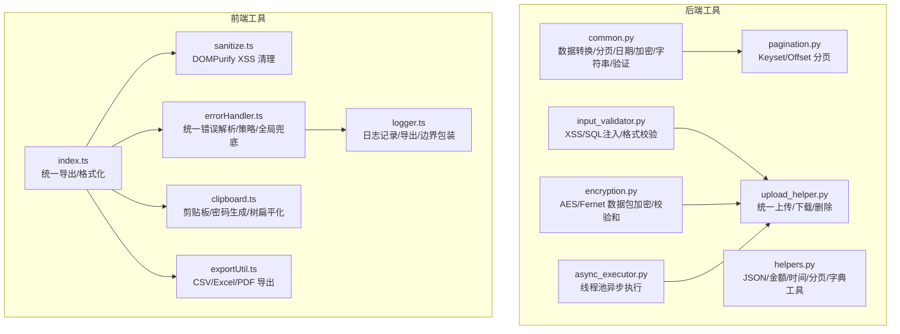
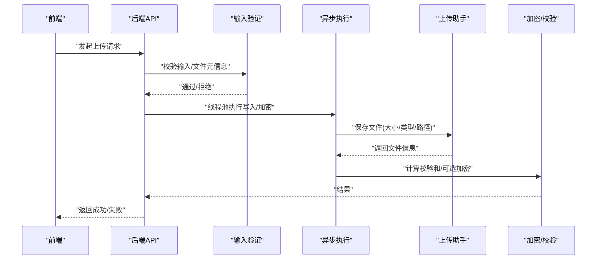
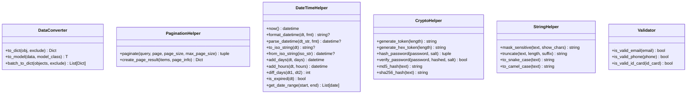
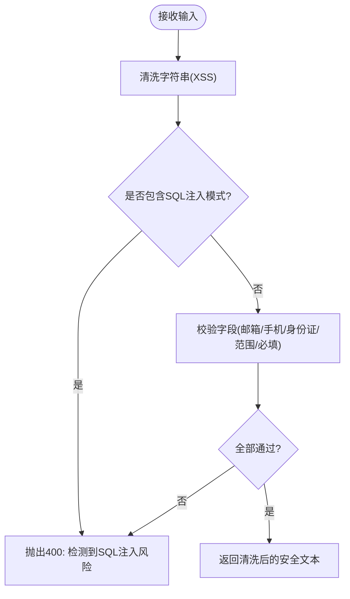
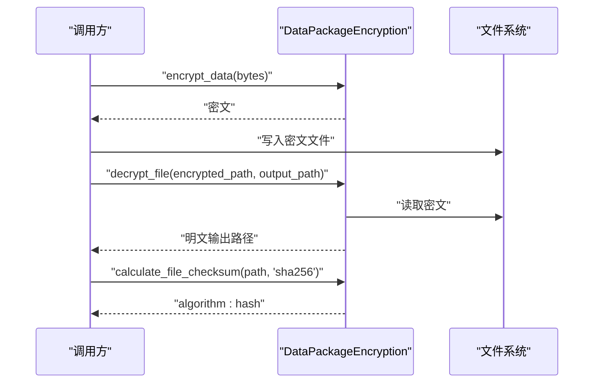
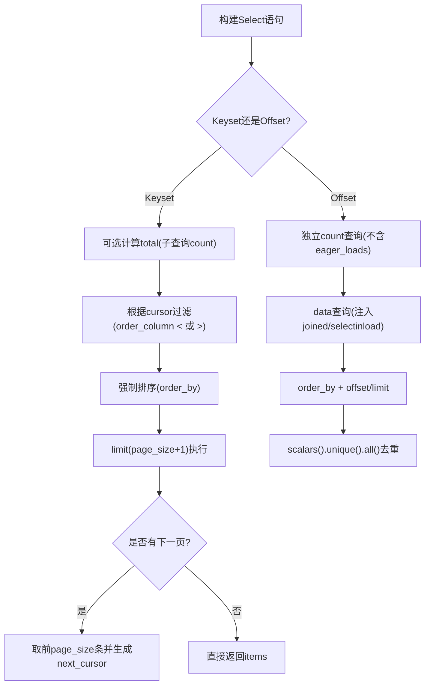
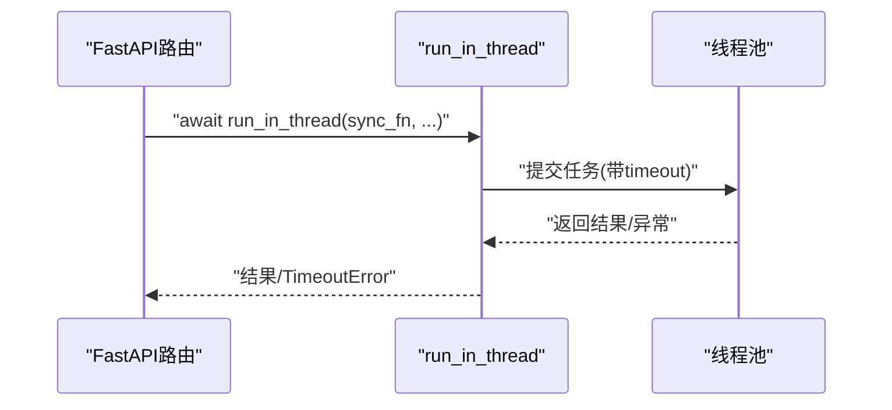
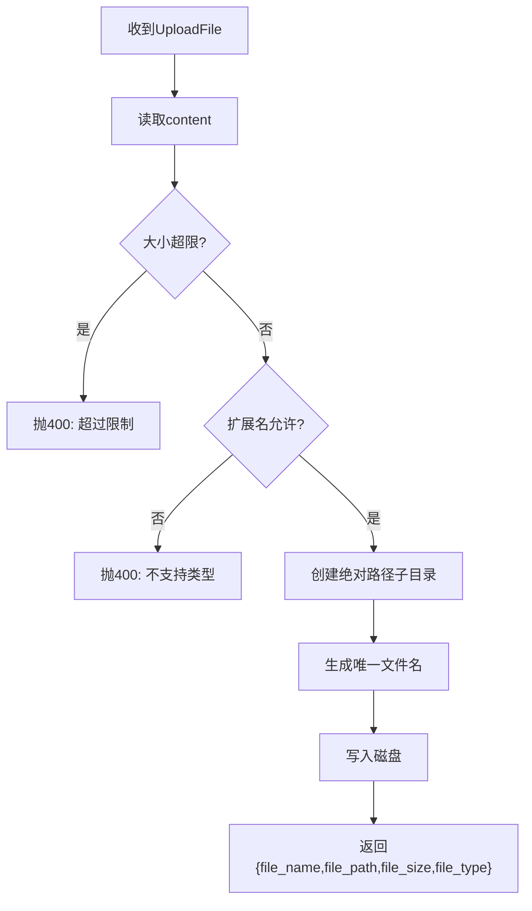
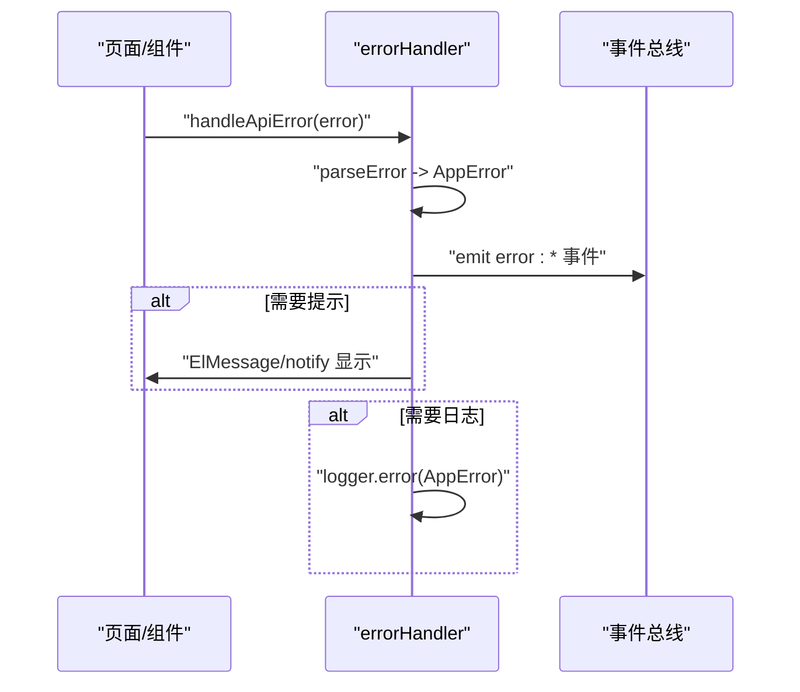
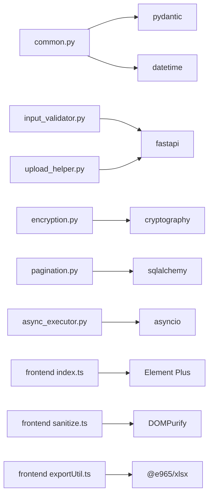

# 工具函数库

<cite>
**本文引用的文件**
- [backend/app/utils/common.py](file://backend/app/utils/common.py)
- [backend/app/utils/input_validator.py](file://backend/app/utils/input_validator.py)
- [backend/app/utils/encryption.py](file://backend/app/utils/encryption.py)
- [backend/app/utils/helpers.py](file://backend/app/utils/helpers.py)
- [backend/app/utils/pagination.py](file://backend/app/utils/pagination.py)
- [backend/app/utils/async_executor.py](file://backend/app/utils/async_executor.py)
- [backend/app/utils/upload_helper.py](file://backend/app/utils/upload_helper.py)
- [frontend/src/utils/index.ts](file://frontend/src/utils/index.ts)
- [frontend/src/utils/sanitize.ts](file://frontend/src/utils/sanitize.ts)
- [frontend/src/utils/errorHandler.ts](file://frontend/src/utils/errorHandler.ts)
- [frontend/src/utils/clipboard.ts](file://frontend/src/utils/clipboard.ts)
- [frontend/src/utils/exportUtil.ts](file://frontend/src/utils/exportUtil.ts)
- [frontend/src/utils/logger.ts](file://frontend/src/utils/logger.ts)
</cite>

## 目录
1. [简介](#简介)
2. [项目结构](#项目结构)
3. [核心组件](#核心组件)
4. [架构总览](#架构总览)
5. [详细组件分析](#详细组件分析)
6. [依赖关系分析](#依赖关系分析)
7. [性能考量](#性能考量)
8. [故障排查指南](#故障排查指南)
9. [结论](#结论)
10. [附录：扩展与定制指南](#附录：扩展与定制指南)

## 简介
本技术文档面向前后端工具函数库，系统性梳理数据处理、格式转换、验证、加密解密、异步执行、上传下载、日志与错误处理等能力。文档从设计原则、接口约定、数据流、错误策略、性能特征到测试与质量保证给出完整说明，并提供扩展新工具的规范建议，帮助开发者快速理解与复用。

## 项目结构
后端工具集中在 backend/app/utils，前端工具集中在 frontend/src/utils。两者职责清晰：
- 后端侧重数据安全、输入校验、加密、分页、异步执行、文件上传下载等通用能力。
- 前端侧重用户交互辅助（格式化、剪贴板、导出）、安全清理（XSS）、统一错误处理与日志。

图表来源
- [backend/app/utils/common.py:15-400](file://backend/app/utils/common.py#L15-L400)
- [backend/app/utils/input_validator.py:12-124](file://backend/app/utils/input_validator.py#L12-L124)
- [backend/app/utils/encryption.py:17-252](file://backend/app/utils/encryption.py#L17-L252)
- [backend/app/utils/helpers.py:12-153](file://backend/app/utils/helpers.py#L12-L153)
- [backend/app/utils/pagination.py:25-227](file://backend/app/utils/pagination.py#L25-L227)
- [backend/app/utils/async_executor.py:1-127](file://backend/app/utils/async_executor.py#L1-L127)
- [backend/app/utils/upload_helper.py:1-175](file://backend/app/utils/upload_helper.py#L1-L175)
- [frontend/src/utils/index.ts:1-60](file://frontend/src/utils/index.ts#L1-L60)
- [frontend/src/utils/sanitize.ts:1-134](file://frontend/src/utils/sanitize.ts#L1-L134)
- [frontend/src/utils/errorHandler.ts:1-487](file://frontend/src/utils/errorHandler.ts#L1-L487)
- [frontend/src/utils/clipboard.ts:1-109](file://frontend/src/utils/clipboard.ts#L1-L109)
- [frontend/src/utils/exportUtil.ts:1-97](file://frontend/src/utils/exportUtil.ts#L1-L97)
- [frontend/src/utils/logger.ts:1-184](file://frontend/src/utils/logger.ts#L1-L184)

章节来源
- [backend/app/utils/common.py:15-400](file://backend/app/utils/common.py#L15-L400)
- [backend/app/utils/input_validator.py:12-124](file://backend/app/utils/input_validator.py#L12-L124)
- [backend/app/utils/encryption.py:17-252](file://backend/app/utils/encryption.py#L17-L252)
- [backend/app/utils/helpers.py:12-153](file://backend/app/utils/helpers.py#L12-L153)
- [backend/app/utils/pagination.py:25-227](file://backend/app/utils/pagination.py#L25-L227)
- [backend/app/utils/async_executor.py:1-127](file://backend/app/utils/async_executor.py#L1-L127)
- [backend/app/utils/upload_helper.py:1-175](file://backend/app/utils/upload_helper.py#L1-L175)
- [frontend/src/utils/index.ts:1-60](file://frontend/src/utils/index.ts#L1-L60)
- [frontend/src/utils/sanitize.ts:1-134](file://frontend/src/utils/sanitize.ts#L1-L134)
- [frontend/src/utils/errorHandler.ts:1-487](file://frontend/src/utils/errorHandler.ts#L1-L487)
- [frontend/src/utils/clipboard.ts:1-109](file://frontend/src/utils/clipboard.ts#L1-L109)
- [frontend/src/utils/exportUtil.ts:1-97](file://frontend/src/utils/exportUtil.ts#L1-L97)
- [frontend/src/utils/logger.ts:1-184](file://frontend/src/utils/logger.ts#L1-L184)

## 核心组件
- 数据处理与格式转换
  - 后端 DataConverter、DateTimeHelper、StringHelper、helpers 中的 JSON/金额/时间工具。
  - 前端 format 格式化器（日期、货币、金额）。
- 验证与安全
  - 后端 InputValidator（XSS/SQL注入/格式校验）。
  - 前端 sanitize（DOMPurify 白名单+危险协议拦截）。
- 加密与完整性
  - 后端 encryption（Fernet AES、PBKDF2 派生密钥、文件校验和）。
- 分页
  - 后端 pagination（Keyset 游标分页 + Offset 传统分页）。
- 异步执行
  - 后端 async_executor（线程池隔离阻塞操作，超时与慢操作告警）。
- 文件上传下载
  - 后端 upload_helper（大小/类型校验、绝对路径、唯一文件名、响应封装）。
- 错误处理与日志
  - 前端 errorHandler（统一错误分类、策略、重试、全局兜底）。
  - 前端 logger（分级日志、导出、tryCatch/withErrorBoundary）。

章节来源
- [backend/app/utils/common.py:15-400](file://backend/app/utils/common.py#L15-L400)
- [backend/app/utils/input_validator.py:12-124](file://backend/app/utils/input_validator.py#L12-L124)
- [backend/app/utils/encryption.py:17-252](file://backend/app/utils/encryption.py#L17-L252)
- [backend/app/utils/helpers.py:12-153](file://backend/app/utils/helpers.py#L12-L153)
- [backend/app/utils/pagination.py:25-227](file://backend/app/utils/pagination.py#L25-L227)
- [backend/app/utils/async_executor.py:1-127](file://backend/app/utils/async_executor.py#L1-L127)
- [backend/app/utils/upload_helper.py:1-175](file://backend/app/utils/upload_helper.py#L1-L175)
- [frontend/src/utils/index.ts:1-60](file://frontend/src/utils/index.ts#L1-L60)
- [frontend/src/utils/sanitize.ts:1-134](file://frontend/src/utils/sanitize.ts#L1-L134)
- [frontend/src/utils/errorHandler.ts:1-487](file://frontend/src/utils/errorHandler.ts#L1-L487)
- [frontend/src/utils/logger.ts:1-184](file://frontend/src/utils/logger.ts#L1-L184)

## 架构总览
工具库遵循“单一职责、可组合、可观测”的设计原则：
- 每个模块聚焦一类能力（如加密、分页、上传），通过明确接口暴露。
- 跨模块协作以参数/返回值契约为主，避免隐式耦合。
- 可观测性：日志、错误分类、指标（如慢操作）贯穿关键路径。

图表来源
- [backend/app/utils/input_validator.py:12-124](file://backend/app/utils/input_validator.py#L12-L124)
- [backend/app/utils/async_executor.py:47-96](file://backend/app/utils/async_executor.py#L47-L96)
- [backend/app/utils/upload_helper.py:42-111](file://backend/app/utils/upload_helper.py#L42-L111)
- [backend/app/utils/encryption.py:181-240](file://backend/app/utils/encryption.py#L181-L240)

## 详细组件分析

### 后端通用工具（common.py）
- 数据转换器 DataConverter：支持 Pydantic/SQLAlchemy/普通对象转字典，批量转换；to_model 用于构造模型实例。
- 分页助手 PaginationHelper：对 SQLAlchemy 查询进行分页并返回 PageInfo 与标准分页结果。
- 日期时间 DateTimeHelper：格式化、解析、ISO 转换、区间生成、过期判断等。
- 加密 CryptoHelper：随机 token、哈希（MD5/SHA256）、密码哈希与验证。
- 字符串 StringHelper：掩码、截断、命名转换（蛇形/驼峰）。
- 验证 Validator：邮箱、手机号、身份证号正则校验。

图表来源
- [backend/app/utils/common.py:15-400](file://backend/app/utils/common.py#L15-L400)

章节来源
- [backend/app/utils/common.py:15-400](file://backend/app/utils/common.py#L15-L400)

### 输入验证（input_validator.py）
- 提供 XSS 清洗与 SQL 注入检测，基于正则模式匹配，命中即抛出 HTTP 400。
- 提供邮箱、手机、身份证、文件扩展名、文件大小、数值范围、必填字段等校验。
- 适用于 API 入口前置校验，减少下游负担。

图表来源
- [backend/app/utils/input_validator.py:31-124](file://backend/app/utils/input_validator.py#L31-L124)

章节来源
- [backend/app/utils/input_validator.py:12-124](file://backend/app/utils/input_validator.py#L12-L124)

### 加密与完整性（encryption.py）
- DataPackageEncryption：支持从密码或原始 key 初始化，使用 PBKDF2-SHA256 派生密钥（高迭代次数），提供数据/文件加解密、密钥序列化与反序列化。
- 文件校验和：calculate_file_checksum 支持 sha256/sha1/md5（仅非安全场景），verify_file_checksum 校验完整性。
- 适用场景：敏感数据落盘、数据包交换、传输后完整性校验。

图表来源
- [backend/app/utils/encryption.py:17-179](file://backend/app/utils/encryption.py#L17-L179)
- [backend/app/utils/encryption.py:181-240](file://backend/app/utils/encryption.py#L181-L240)

章节来源
- [backend/app/utils/encryption.py:17-252](file://backend/app/utils/encryption.py#L17-L252)

### 分页（pagination.py）
- Keyset 分页：基于游标的 Seek Method，适合大数据量与无限滚动，利用索引 O(log N)。
- Offset 分页：传统页码跳转，分离 Count 与 Data 查询，避免 eager_loads 影响计数。
- 提供游标编码/解码、最大页大小限制、是否计算总数等选项。

图表来源
- [backend/app/utils/pagination.py:25-154](file://backend/app/utils/pagination.py#L25-L154)
- [backend/app/utils/pagination.py:161-227](file://backend/app/utils/pagination.py#L161-L227)

章节来源
- [backend/app/utils/pagination.py:25-227](file://backend/app/utils/pagination.py#L25-L227)

### 异步执行（async_executor.py）
- run_in_thread：在固定大小的线程池中执行同步阻塞任务，支持超时与慢操作日志。
- asyncify：装饰器将同步函数包装为异步可等待。
- 适用场景：文件I/O、加密、大对象解析、报表生成等 CPU/IO 密集型任务。

图表来源
- [backend/app/utils/async_executor.py:47-96](file://backend/app/utils/async_executor.py#L47-L96)

章节来源
- [backend/app/utils/async_executor.py:1-127](file://backend/app/utils/async_executor.py#L1-L127)

### 文件上传下载（upload_helper.py）
- save_upload_file：读取内容、校验大小与扩展名、创建绝对路径子目录、生成唯一文件名、写入磁盘并返回元信息。
- get_attachment_response：按 MIME 类型返回 FileResponse，支持 inline/attachment。
- delete_attachment_file：安全删除，忽略不存在与 IO 异常。

图表来源
- [backend/app/utils/upload_helper.py:42-111](file://backend/app/utils/upload_helper.py#L42-L111)

章节来源
- [backend/app/utils/upload_helper.py:1-175](file://backend/app/utils/upload_helper.py#L1-L175)

### 前端工具概览（index.ts）
- 统一导出：logger、request、exportUtil、clipboard、yearOptions。
- 格式化：format.formatDateTime/formatDate/formatCurrency/formatMoney4，保证一致的时间与金额展示。

章节来源
- [frontend/src/utils/index.ts:1-60](file://frontend/src/utils/index.ts#L1-L60)

### 前端安全清理（sanitize.ts）
- 使用 DOMPurify 配置白名单标签与属性，禁用 data-* 属性。
- 钩子中拦截危险协议（javascript:/vbscript:/data:/file:），外链自动添加 rel/target。
- 提供 stripHtml（纯文本提取）与 escapeHtml（基础转义）。

章节来源
- [frontend/src/utils/sanitize.ts:1-134](file://frontend/src/utils/sanitize.ts#L1-L134)

### 前端错误处理（errorHandler.ts）
- 错误分类：NETWORK/AUTH/PERMISSION/VALIDATION/NOT_FOUND/SERVER/TIMEOUT/BUSINESS/UNKNOWN。
- 解析 parseError：兼容 Axios response/request 与业务错误，统一为 AppError。
- 策略管理：默认策略 + 自定义覆盖，控制通知、日志、跳转、重试。
- 重试：handleAsyncOperation 支持指数退避前的简单延迟重试。
- 全局兜底：window.onerror/unhandledrejection 去重提示，避免并发失败刷屏。

图表来源
- [frontend/src/utils/errorHandler.ts:145-265](file://frontend/src/utils/errorHandler.ts#L145-L265)
- [frontend/src/utils/errorHandler.ts:393-473](file://frontend/src/utils/errorHandler.ts#L393-L473)

章节来源
- [frontend/src/utils/errorHandler.ts:1-487](file://frontend/src/utils/errorHandler.ts#L1-L487)

### 前端剪贴板与工具（clipboard.ts）
- copyToClipboard：优先现代 Clipboard API，降级 execCommand，失败时提示。
- generateRandomPassword：使用 crypto.getRandomValues，确保字符集强度。
- flattenTree：递归扁平化树结构，便于表格渲染。

章节来源
- [frontend/src/utils/clipboard.ts:1-109](file://frontend/src/utils/clipboard.ts#L1-L109)

### 前端导出（exportUtil.ts）
- CSV：RFC 4180 转义，BOM 头，Blob 下载。
- Excel：动态导入 xlsx，生成 .xlsx 文件。
- PDF：简易打印页面，HTML 实体编码防 XSS。

章节来源
- [frontend/src/utils/exportUtil.ts:1-97](file://frontend/src/utils/exportUtil.ts#L1-L97)

### 前端日志（logger.ts）
- 分级日志（debug/info/warn/error/fatal），生产环境抑制 debug。
- tryCatch/tryCatchAsync/withErrorBoundary：统一捕获与记录。
- 日志导出：JSON 格式便于问题定位。

章节来源
- [frontend/src/utils/logger.ts:1-184](file://frontend/src/utils/logger.ts#L1-L184)

## 依赖关系分析
- common.py 依赖 pydantic、datetime、hashlib、secrets、re。
- input_validator.py 依赖 fastapi 的 HTTPException/status。
- encryption.py 依赖 cryptography（Fernet、PBKDF2）、hashlib、base64、os。
- helpers.py 依赖 json、decimal、datetime、hashlib、secrets。
- pagination.py 依赖 sqlalchemy（Select、func、select、Session）。
- async_executor.py 依赖 asyncio、concurrent.futures.ThreadPoolExecutor。
- upload_helper.py 依赖 fastapi（HTTPException、UploadFile、FileResponse）、os、uuid、mimetypes。
- 前端 utils 依赖 Element Plus、DOMPurify、@e965/xlsx、本地 request/notify/logger。

图表来源
- [backend/app/utils/common.py:1-12](file://backend/app/utils/common.py#L1-L12)
- [backend/app/utils/input_validator.py:1-10](file://backend/app/utils/input_validator.py#L1-L10)
- [backend/app/utils/encryption.py:1-15](file://backend/app/utils/encryption.py#L1-L15)
- [backend/app/utils/pagination.py:1-20](file://backend/app/utils/pagination.py#L1-L20)
- [backend/app/utils/async_executor.py:1-28](file://backend/app/utils/async_executor.py#L1-L28)
- [backend/app/utils/upload_helper.py:1-33](file://backend/app/utils/upload_helper.py#L1-L33)
- [frontend/src/utils/index.ts:1-10](file://frontend/src/utils/index.ts#L1-L10)
- [frontend/src/utils/sanitize.ts:1-10](file://frontend/src/utils/sanitize.ts#L1-L10)
- [frontend/src/utils/exportUtil.ts:1-10](file://frontend/src/utils/exportUtil.ts#L1-L10)

章节来源
- [backend/app/utils/common.py:1-12](file://backend/app/utils/common.py#L1-L12)
- [backend/app/utils/input_validator.py:1-10](file://backend/app/utils/input_validator.py#L1-L10)
- [backend/app/utils/encryption.py:1-15](file://backend/app/utils/encryption.py#L1-L15)
- [backend/app/utils/pagination.py:1-20](file://backend/app/utils/pagination.py#L1-L20)
- [backend/app/utils/async_executor.py:1-28](file://backend/app/utils/async_executor.py#L1-L28)
- [backend/app/utils/upload_helper.py:1-33](file://backend/app/utils/upload_helper.py#L1-L33)
- [frontend/src/utils/index.ts:1-10](file://frontend/src/utils/index.ts#L1-L10)
- [frontend/src/utils/sanitize.ts:1-10](file://frontend/src/utils/sanitize.ts#L1-L10)
- [frontend/src/utils/exportUtil.ts:1-10](file://frontend/src/utils/exportUtil.ts#L1-L10)

## 性能考量
- 分页
  - Keyset 分页在大数据集上优于 OFFSET，避免全表扫描；Count 可关闭以提升“无限滚动”性能。
  - Offset 分页分离 Count 与 Data 查询，避免 joinedload 导致的计数失真。
- 异步执行
  - 线程池上限 4，防止 SQLite 写冲突；超时保护与慢操作日志便于定位瓶颈。
- 加密
  - PBKDF2 迭代次数较高，CPU 开销较大，建议结合异步执行与缓存密钥实例。
- 上传
  - 严格大小与类型校验，避免恶意文件；绝对路径与唯一文件名降低安全风险。
- 前端
  - 导出 Excel 动态导入，减少首屏体积；日志在生产环境抑制 debug。

## 故障排查指南
- 输入校验失败
  - 检查 XSS/SQL 注入规则命中原因，确认输入是否被清洗或拒绝。
- 加密/校验失败
  - 确认密钥/盐值一致性；校验和格式是否正确（algorithm:hash）。
- 分页异常
  - Keyset 需确保 order_column 有索引且值稳定；Offset 注意 unique() 去重。
- 上传失败
  - 检查文件大小、扩展名、存储目录权限；关注写入异常日志。
- 前端错误
  - 查看错误分类与策略，确认是否需要重试或跳转；检查全局兜底是否触发。
- 日志定位
  - 使用 logger 导出日志；关注慢操作与未处理 Promise Rejection。

章节来源
- [backend/app/utils/input_validator.py:31-124](file://backend/app/utils/input_validator.py#L31-L124)
- [backend/app/utils/encryption.py:181-240](file://backend/app/utils/encryption.py#L181-L240)
- [backend/app/utils/pagination.py:25-227](file://backend/app/utils/pagination.py#L25-L227)
- [backend/app/utils/upload_helper.py:42-175](file://backend/app/utils/upload_helper.py#L42-L175)
- [frontend/src/utils/errorHandler.ts:145-473](file://frontend/src/utils/errorHandler.ts#L145-L473)
- [frontend/src/utils/logger.ts:33-184](file://frontend/src/utils/logger.ts#L33-L184)

## 结论
该工具函数库在后端与前端分别提供了完善的数据处理、验证、加密、分页、异步执行、上传下载、错误处理与日志能力。通过清晰的模块边界与统一的接口约定，既保证了安全性与稳定性，也兼顾了性能与可维护性。建议在新增功能时遵循现有规范，复用已有工具，保持系统一致性与可观测性。

## 附录：扩展与定制指南
- 新增后端工具函数
  - 选择合适模块：数据转换放入 common.py/helpers.py；验证放入 input_validator.py；加密放入 encryption.py；分页放入 pagination.py；异步放入 async_executor.py；上传放入 upload_helper.py。
  - 接口约定：输入输出类型明确，错误使用 HTTPException 或抛出明确异常；必要时提供单元测试。
  - 可观测性：关键路径记录日志，慢操作与异常需可追踪。
- 新增前端工具函数
  - 选择合适模块：格式化放入 index.ts；安全清理放入 sanitize.ts；错误处理放入 errorHandler.ts；导出放入 exportUtil.ts；日志放入 logger.ts。
  - 接口约定：函数签名简洁，错误返回结构化对象；对外暴露统一入口。
  - 可观测性：使用 logger 记录上下文；错误分类与策略可扩展。
- 测试与质量保证
  - 单元测试：覆盖边界条件与异常分支；模拟外部依赖（如文件系统、数据库）。
  - 集成测试：端到端流程（上传-加密-校验-下载）；分页在不同数据集下的行为。
  - 覆盖率目标：核心工具函数建议达到较高覆盖率；持续集成中运行测试与静态检查。
- 最佳实践
  - 避免在 async 路由中执行阻塞操作，使用 async_executor。
  - 所有用户输入必须经过验证与清洗。
  - 敏感数据加密存储，校验完整性。
  - 前端统一错误处理与日志，避免分散实现。