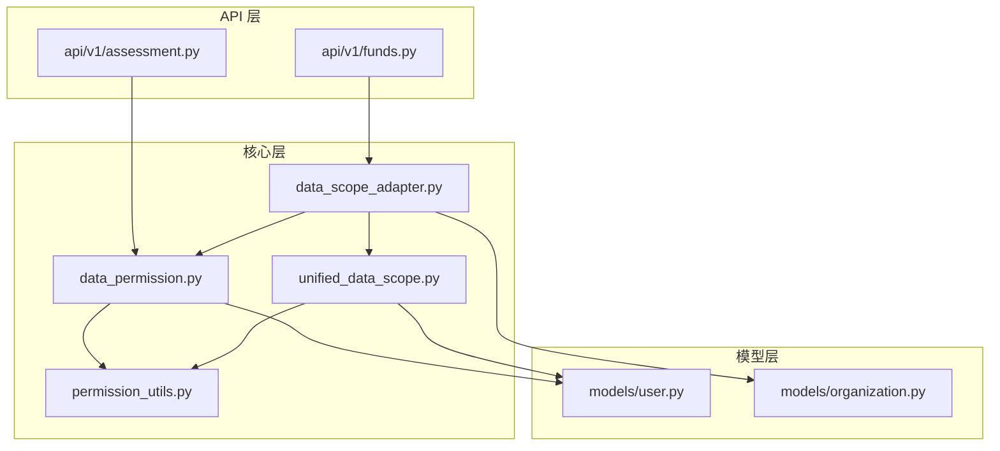
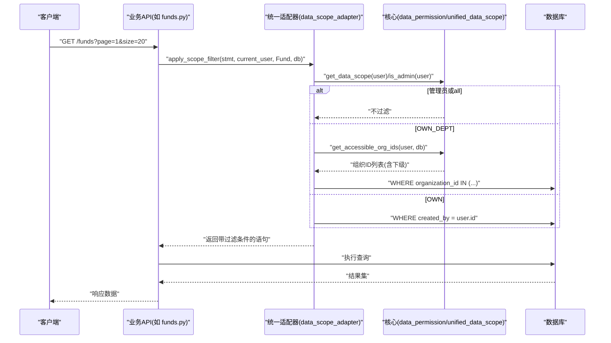
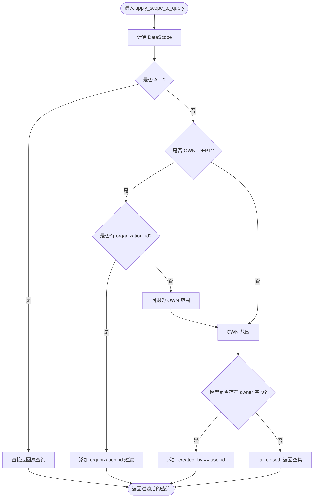
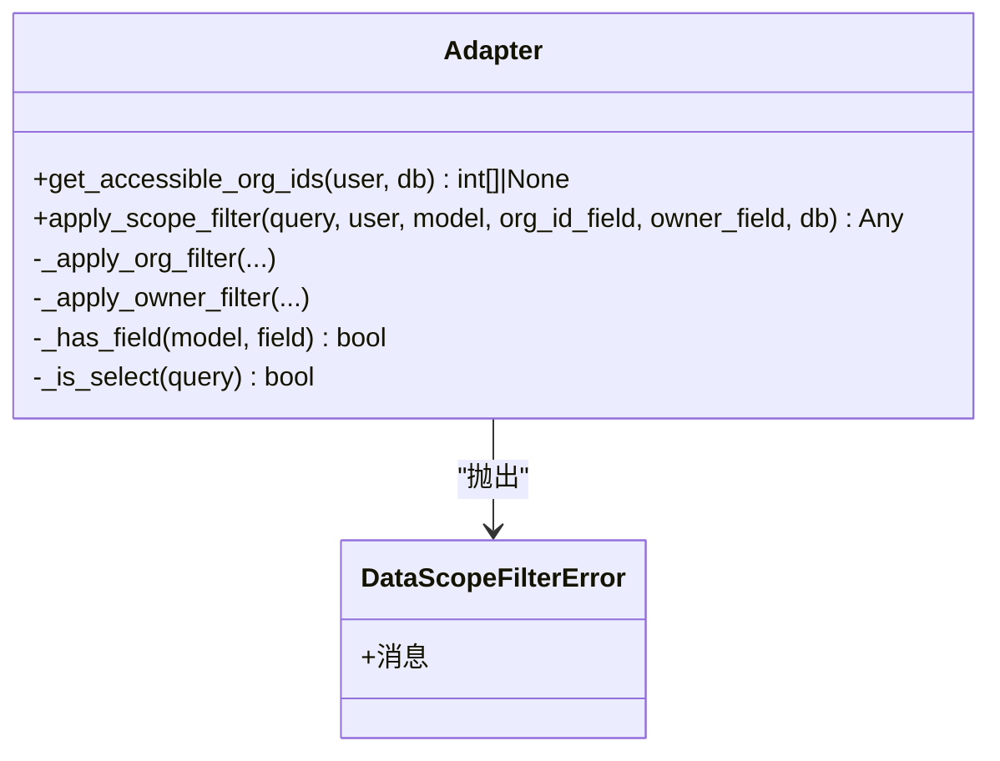
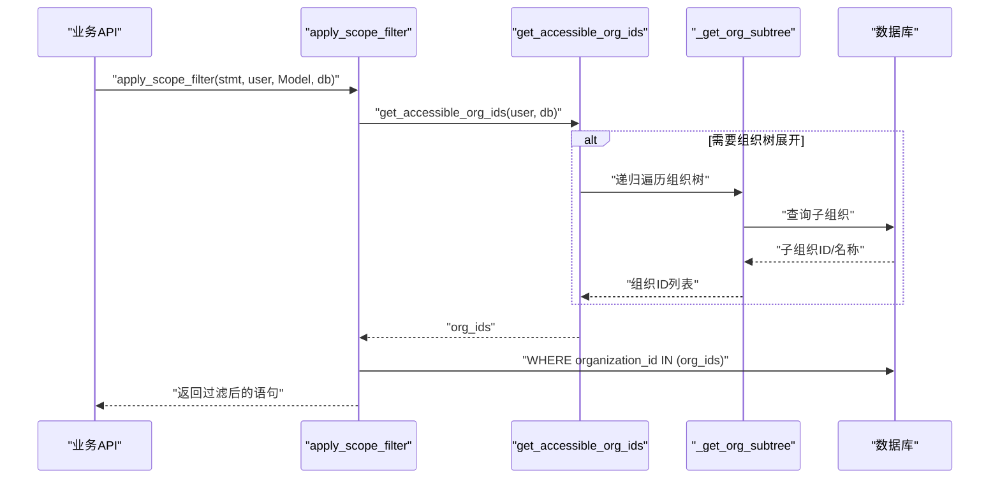
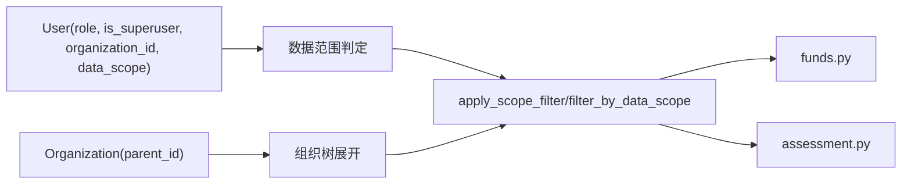
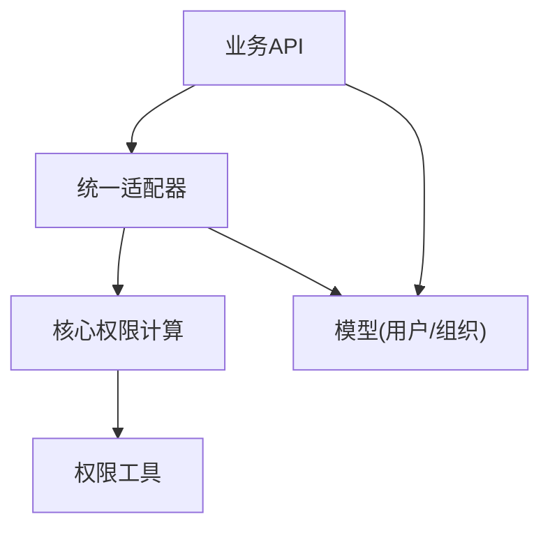

# 数据权限模块

<cite>
**本文引用的文件**
- [backend/app/core/data_permission.py](file://backend/app/core/data_permission.py)
- [backend/app/core/data_scope_adapter.py](file://backend/app/core/data_scope_adapter.py)
- [backend/app/core/unified_data_scope.py](file://backend/app/core/unified_data_scope.py)
- [backend/app/core/permission_utils.py](file://backend/app/core/permission_utils.py)
- [backend/app/models/user.py](file://backend/app/models/user.py)
- [backend/app/models/organization.py](file://backend/app/models/organization.py)
- [backend/app/api/v1/funds.py](file://backend/app/api/v1/funds.py)
- [backend/app/api/v1/assessment.py](file://backend/app/api/v1/assessment.py)
</cite>

## 目录
1. [简介](#简介)
2. [项目结构](#项目结构)
3. [核心组件](#核心组件)
4. [架构总览](#架构总览)
5. [详细组件分析](#详细组件分析)
6. [依赖关系分析](#依赖关系分析)
7. [性能考虑](#性能考虑)
8. [故障排查指南](#故障排查指南)
9. [结论](#结论)
10. [附录：自定义数据权限规则开发指南](#附录自定义数据权限规则开发指南)

## 简介
本技术文档聚焦后端“数据权限模块”，系统性阐述数据范围隔离机制、统一数据权限控制与数据范围适配器的实现原理。重点说明如何基于用户角色和组织层级动态过滤查询结果，确保组织级、项目级、个人级的数据安全访问；并给出数据权限拦截器工作原理与性能优化策略，以及扩展自定义数据权限规则的开发指南。

## 项目结构
数据权限相关代码主要分布在以下位置：
- 核心权限计算与过滤：core/data_permission.py、core/unified_data_scope.py
- 统一适配器：core/data_scope_adapter.py
- 权限工具：core/permission_utils.py
- 模型：models/user.py（用户角色、组织归属、data_scope）、models/organization.py（组织树）
- API 集成示例：api/v1/funds.py、api/v1/assessment.py（在业务接口中应用数据权限过滤）

**图表来源**
- [backend/app/core/data_permission.py:1-187](file://backend/app/core/data_permission.py#L1-L187)
- [backend/app/core/data_scope_adapter.py:1-225](file://backend/app/core/data_scope_adapter.py#L1-L225)
- [backend/app/core/unified_data_scope.py:1-343](file://backend/app/core/unified_data_scope.py#L1-L343)
- [backend/app/core/permission_utils.py:1-360](file://backend/app/core/permission_utils.py#L1-L360)
- [backend/app/models/user.py:1-152](file://backend/app/models/user.py#L1-L152)
- [backend/app/models/organization.py:1-78](file://backend/app/models/organization.py#L1-L78)
- [backend/app/api/v1/funds.py:340-539](file://backend/app/api/v1/funds.py#L340-L539)
- [backend/app/api/v1/assessment.py:50-249](file://backend/app/api/v1/assessment.py#L50-L249)

**章节来源**
- [backend/app/core/data_permission.py:1-187](file://backend/app/core/data_permission.py#L1-L187)
- [backend/app/core/data_scope_adapter.py:1-225](file://backend/app/core/data_scope_adapter.py#L1-L225)
- [backend/app/core/unified_data_scope.py:1-343](file://backend/app/core/unified_data_scope.py#L1-L343)
- [backend/app/core/permission_utils.py:1-360](file://backend/app/core/permission_utils.py#L1-L360)
- [backend/app/models/user.py:1-152](file://backend/app/models/user.py#L1-L152)
- [backend/app/models/organization.py:1-78](file://backend/app/models/organization.py#L1-L78)
- [backend/app/api/v1/funds.py:340-539](file://backend/app/api/v1/funds.py#L340-L539)
- [backend/app/api/v1/assessment.py:50-249](file://backend/app/api/v1/assessment.py#L50-L249)

## 核心组件
- 数据范围枚举与判定：DataScope（ALL/OWN_DEPT/OWN），get_data_scope() 根据角色与 is_superuser 确定范围。
- 查询过滤：apply_scope_to_query()/filter_by_data_scope() 将范围注入 SQLAlchemy 查询。
- 统一适配器：data_scope_adapter.apply_scope_filter() 兼容 Select/Query 两种风格，支持组织树展开（含下级组织）。
- 组织树与范围：OrgScopeFilter 与 get_org_scope() 提供基于组织树的过滤能力。
- 权限工具：is_admin()/is_superuser() 等用于快速判断管理员身份。
- 模型支撑：User 的 role、is_superuser、organization_id、data_scope；Organization 的 parent_id 形成树形结构。

**章节来源**
- [backend/app/core/data_permission.py:20-187](file://backend/app/core/data_permission.py#L20-L187)
- [backend/app/core/data_scope_adapter.py:58-184](file://backend/app/core/data_scope_adapter.py#L58-L184)
- [backend/app/core/unified_data_scope.py:43-164](file://backend/app/core/unified_data_scope.py#L43-L164)
- [backend/app/core/unified_data_scope.py:191-343](file://backend/app/core/unified_data_scope.py#L191-L343)
- [backend/app/core/permission_utils.py:17-58](file://backend/app/core/permission_utils.py#L17-L58)
- [backend/app/models/user.py:42-78](file://backend/app/models/user.py#L42-L78)
- [backend/app/models/organization.py:47-73](file://backend/app/models/organization.py#L47-L73)

## 架构总览
数据权限体系由“角色范围 + 组织树范围”双轨构成，并通过统一适配器对外暴露一致的过滤入口。

**图表来源**
- [backend/app/api/v1/funds.py:340-539](file://backend/app/api/v1/funds.py#L340-L539)
- [backend/app/core/data_scope_adapter.py:114-184](file://backend/app/core/data_scope_adapter.py#L114-L184)
- [backend/app/core/data_permission.py:54-134](file://backend/app/core/data_permission.py#L54-L134)
- [backend/app/core/unified_data_scope.py:279-343](file://backend/app/core/unified_data_scope.py#L279-L343)

## 详细组件分析

### 数据范围隔离机制（角色驱动）
- 范围定义：ALL（全部）、OWN_DEPT（本部门/组织）、OWN（仅本人）。
- 判定逻辑：
  - 超级管理员或 super_admin 角色 → ALL
  - admin 角色 → OWN_DEPT
  - 其他角色 → OWN
- 过滤实现：
  - apply_scope_to_query() 根据范围向查询追加条件：
    - OWN_DEPT：按 organization_id 限定（若缺失则回退到 OWN）
    - OWN：按 created_by == user.id 限定（若模型缺少 owner 字段则 fail-closed 返回空集）
- 单记录校验：check_record_access() 用于行级访问控制。

**图表来源**
- [backend/app/core/data_permission.py:54-134](file://backend/app/core/data_permission.py#L54-L134)

**章节来源**
- [backend/app/core/data_permission.py:20-134](file://backend/app/core/data_permission.py#L20-L134)

### 统一数据权限控制（适配器）
- 目标：统一三种历史实现（SQLAlchemy 2.0 Select、旧式 Query、混合风格），并提供组织树展开能力。
- 关键函数：
  - get_accessible_org_ids(user, db)：计算可访问组织 ID 列表（None 表示不限制，[] 表示无组织级权限，[ids] 表示具体组织集合）。
  - apply_scope_filter(query, user, model, org_id_field, owner_field, db)：自动识别 Select/Query 并应用对应过滤。
- 行为一致性：
  - 管理员/超管/data_scope="all" → 不过滤
  - OWN_DEPT → 使用组织 ID 列表过滤；无组织归属时回退到 OWN
  - OWN → 使用 created_by 过滤；模型缺 owner 字段时抛错拒绝（fail-closed）

**图表来源**
- [backend/app/core/data_scope_adapter.py:54-225](file://backend/app/core/data_scope_adapter.py#L54-L225)

**章节来源**
- [backend/app/core/data_scope_adapter.py:58-184](file://backend/app/core/data_scope_adapter.py#L58-L184)

### 数据范围适配器（组织树语义）
- 组织树展开：当传入 db 会话时，OWN_DEPT 会递归获取当前组织及其所有下级组织 ID，实现“本组织及下级”的数据可见性。
- 兼容 data_scope 字段：user.data_scope 支持 all/org_children/org/self，优先于角色范围。
- 安全降级：模型缺少必要字段时采用 fail-closed 策略，避免静默放行全量数据。

**图表来源**
- [backend/app/core/data_scope_adapter.py:114-184](file://backend/app/core/data_scope_adapter.py#L114-L184)
- [backend/app/core/unified_data_scope.py:245-276](file://backend/app/core/unified_data_scope.py#L245-L276)

**章节来源**
- [backend/app/core/unified_data_scope.py:279-343](file://backend/app/core/unified_data_scope.py#L279-L343)
- [backend/app/core/data_scope_adapter.py:58-112](file://backend/app/core/data_scope_adapter.py#L58-L112)

### 数据权限与业务模型的集成
- 用户模型（User）：role、is_superuser、organization_id、data_scope 决定数据范围；permissions、allowed_menus 等用于菜单与功能权限。
- 组织模型（Organization）：parent_id 形成树形结构，支持递归展开。
- API 集成示例：
  - 经费管理（funds.py）：在列表与详情查询中使用 apply_scope_filter 进行数据隔离。
  - 评估与异常检测（assessment.py）：通过 filter_by_data_scope 限定可访问村庄/项目范围。

**图表来源**
- [backend/app/models/user.py:42-78](file://backend/app/models/user.py#L42-L78)
- [backend/app/models/organization.py:47-73](file://backend/app/models/organization.py#L47-L73)
- [backend/app/api/v1/funds.py:340-539](file://backend/app/api/v1/funds.py#L340-L539)
- [backend/app/api/v1/assessment.py:50-249](file://backend/app/api/v1/assessment.py#L50-L249)

**章节来源**
- [backend/app/models/user.py:42-78](file://backend/app/models/user.py#L42-L78)
- [backend/app/models/organization.py:47-73](file://backend/app/models/organization.py#L47-L73)
- [backend/app/api/v1/funds.py:340-539](file://backend/app/api/v1/funds.py#L340-L539)
- [backend/app/api/v1/assessment.py:50-249](file://backend/app/api/v1/assessment.py#L50-L249)

## 依赖关系分析
- 低耦合设计：
  - 业务 API 仅依赖统一适配器或核心过滤函数，不关心内部实现细节。
  - 适配器封装了 Select/Query 差异与组织树展开逻辑。
- 外部依赖：
  - FastAPI 依赖注入（Depends(get_current_user), Depends(get_db)）
  - SQLAlchemy ORM（Select/Query、关系加载）
  - 权限工具（is_admin/is_superuser）
- 潜在循环依赖：
  - 通过延迟导入（from ... import ...）避免启动期循环引用。

**图表来源**
- [backend/app/core/data_scope_adapter.py:114-184](file://backend/app/core/data_scope_adapter.py#L114-L184)
- [backend/app/core/data_permission.py:54-134](file://backend/app/core/data_permission.py#L54-L134)
- [backend/app/core/permission_utils.py:17-58](file://backend/app/core/permission_utils.py#L17-L58)

**章节来源**
- [backend/app/core/data_scope_adapter.py:114-184](file://backend/app/core/data_scope_adapter.py#L114-L184)
- [backend/app/core/data_permission.py:54-134](file://backend/app/core/data_permission.py#L54-L134)
- [backend/app/core/permission_utils.py:17-58](file://backend/app/core/permission_utils.py#L17-L58)

## 性能考虑
- 预加载关联数据：在列表查询中使用 selectinload/joinedload 减少 N+1 查询（如经费列表预加载 project/village/school/organization）。
- 分页优化：
  - Keyset 分页：适用于大数据集，避免深度 offset 的性能问题。
  - Offset 分页：对 count 使用子查询优化，避免重复扫描。
- 组织树展开：
  - 限制递归深度（_ORG_TREE_MAX_DEPTH）防止无限递归。
  - 使用 visited set 避免环检测。
- 缓存：对热点统计结果设置 TTL 缓存（如评估分数）。
- 索引：对用户 role、organization_id、department 等建立索引以加速过滤。

**章节来源**
- [backend/app/api/v1/funds.py:380-437](file://backend/app/api/v1/funds.py#L380-L437)
- [backend/app/core/unified_data_scope.py:36-37](file://backend/app/core/unified_data_scope.py#L36-L37)
- [backend/app/models/user.py:31-35](file://backend/app/models/user.py#L31-L35)

## 故障排查指南
- 常见错误与定位：
  - 模型缺少 owner 字段：触发 fail-closed，返回空集或抛错，需检查模型字段命名（默认 created_by）。
  - 模型缺少 organization_id：OWN_DEPT 回退到 OWN，需确认模型字段与用户组织归属。
  - 组织树为空：可能因组织未配置或父级不存在，需检查 Organization.parent_id 与数据完整性。
  - 权限不足：确认用户 role、is_superuser、data_scope 是否正确设置。
- 日志与调试：
  - 关注 debug/warning/error 日志输出，定位回退路径与失败原因。
  - 使用 require_data_permission() 在写操作前进行行级权限校验。

**章节来源**
- [backend/app/core/data_permission.py:115-130](file://backend/app/core/data_permission.py#L115-L130)
- [backend/app/core/data_scope_adapter.py:175-180](file://backend/app/core/data_scope_adapter.py#L175-L180)
- [backend/app/core/unified_data_scope.py:256-263](file://backend/app/core/unified_data_scope.py#L256-L263)

## 结论
该数据权限模块通过“角色范围 + 组织树范围”的双轨机制，结合统一适配器，实现了灵活、安全且高性能的数据隔离。其 fail-closed 策略确保了在模型字段缺失时的安全性，而组织树展开与预加载优化保障了大规模数据场景下的性能表现。建议新业务统一采用 apply_scope_filter 作为数据权限接入点，逐步迁移历史实现。

## 附录：自定义数据权限规则开发指南
- 新增范围类型：
  - 在 DataScope 中扩展枚举值（如 CUSTOM），并在 get_data_scope() 中增加判定逻辑。
  - 在 apply_scope_to_query()/apply_scope_filter() 中实现对应的过滤逻辑。
- 自定义组织树规则：
  - 扩展 _get_org_subtree() 以支持更复杂的组织关系（如跨部门协作组）。
  - 在 get_accessible_org_ids() 中组合多源组织 ID。
- 行级权限增强：
  - 在 check_record_access() 中增加额外校验（如状态、标签、密级）。
  - 在 require_data_permission() 中增加业务特定条件。
- 最佳实践：
  - 始终遵循 fail-closed 原则，避免静默放行。
  - 为新规则编写单元测试，覆盖边界情况（无组织、无 owner、空组织树等）。
  - 在 API 层统一调用统一适配器，避免分散实现。

**章节来源**
- [backend/app/core/data_permission.py:20-187](file://backend/app/core/data_permission.py#L20-L187)
- [backend/app/core/data_scope_adapter.py:58-225](file://backend/app/core/data_scope_adapter.py#L58-L225)
- [backend/app/core/unified_data_scope.py:43-343](file://backend/app/core/unified_data_scope.py#L43-L343)