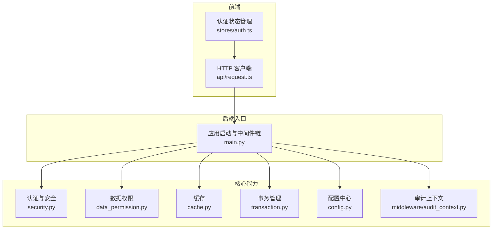
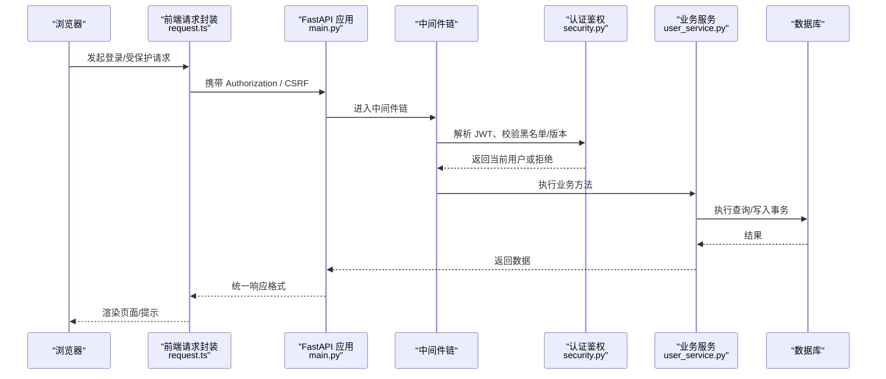
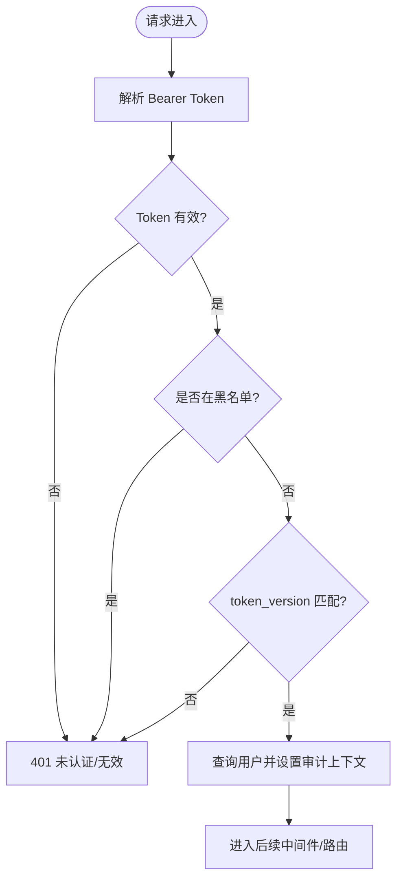
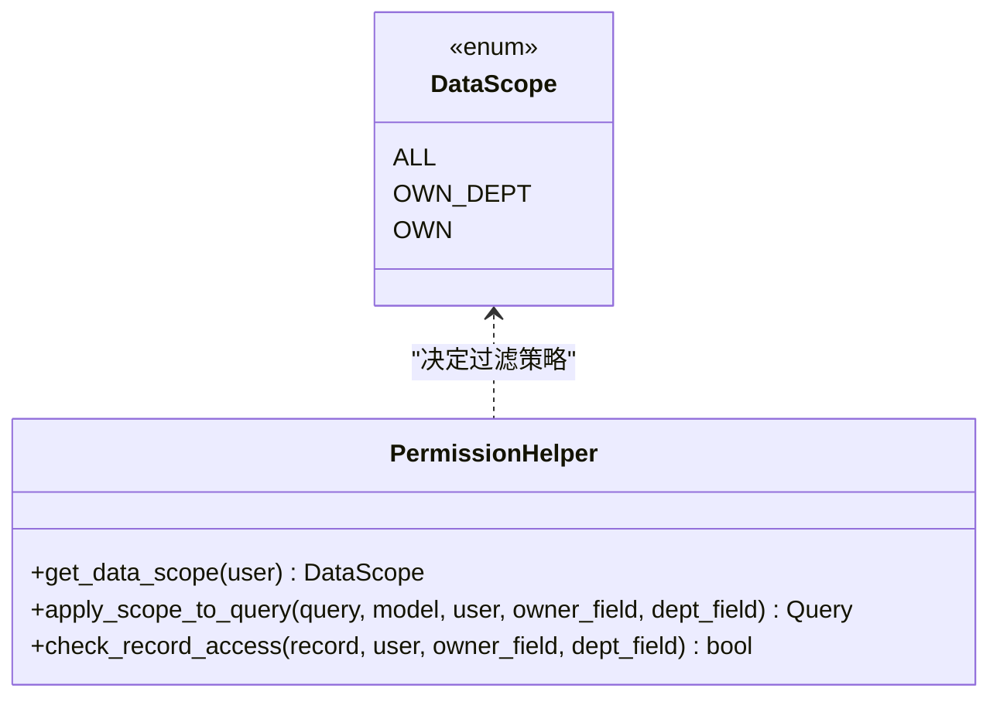
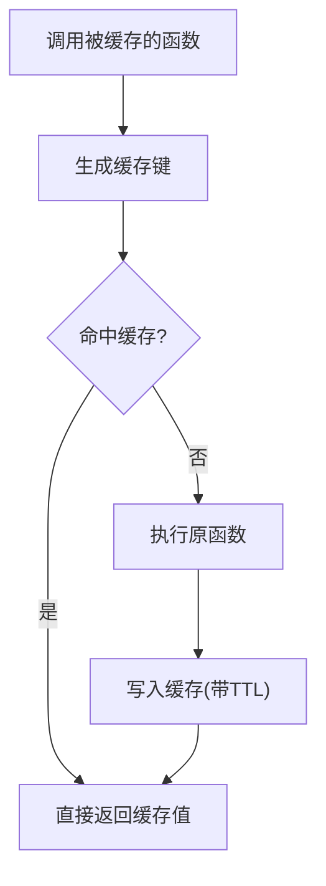
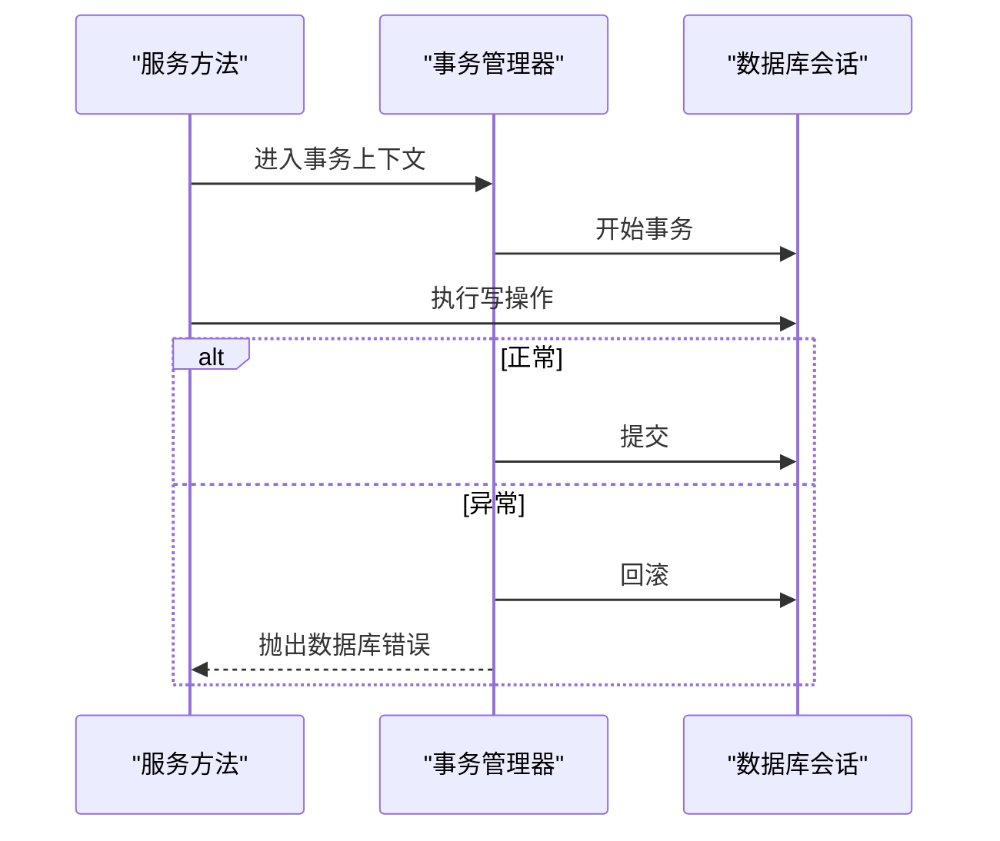
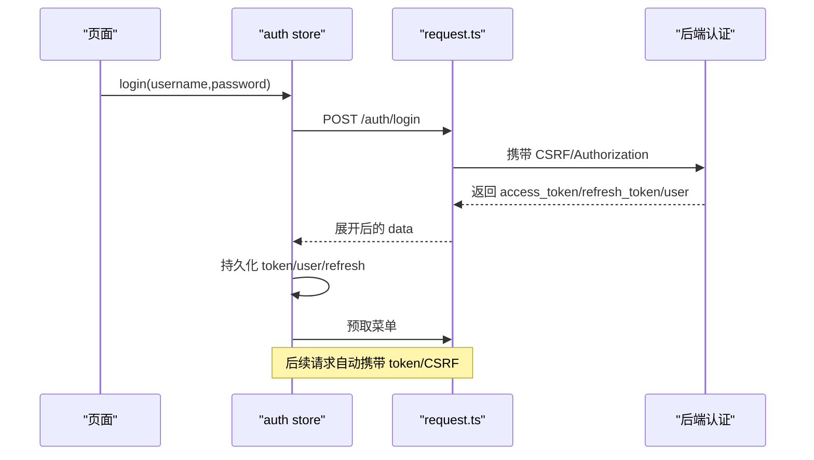
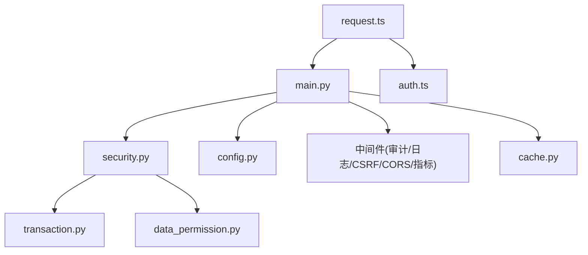

# 核心模块详解

<cite>
**本文引用的文件**
- [backend/app/main.py](file://backend/app/main.py)
- [backend/app/core/config.py](file://backend/app/core/config.py)
- [backend/app/core/security.py](file://backend/app/core/security.py)
- [backend/app/core/data_permission.py](file://backend/app/core/data_permission.py)
- [backend/app/core/cache.py](file://backend/app/core/cache.py)
- [backend/app/core/transaction.py](file://backend/app/core/transaction.py)
- [backend/app/middleware/audit_context.py](file://backend/app/middleware/audit_context.py)
- [backend/app/services/user_service.py](file://backend/app/services/user_service.py)
- [frontend/src/stores/auth.ts](file://frontend/src/stores/auth.ts)
- [frontend/src/api/request.ts](file://frontend/src/api/request.ts)
</cite>

## 目录
1. [简介](#简介)
2. [项目结构](#项目结构)
3. [核心组件](#核心组件)
4. [架构总览](#架构总览)
5. [详细组件分析](#详细组件分析)
6. [依赖关系分析](#依赖关系分析)
7. [性能考量](#性能考量)
8. [故障排查指南](#故障排查指南)
9. [结论](#结论)
10. [附录](#附录)

## 简介
本技术文档围绕乡村振兴管理系统的后端与前端核心模块，系统化阐述认证授权、数据权限、缓存机制、事务管理、中间件系统等关键能力的实现原理与使用方式；同时梳理业务服务模块的职责边界、接口设计与调用关系，并给出前端状态管理、组件库与工具函数的架构设计和使用指南。文末提供模块依赖图与数据流向说明，帮助开发者快速理解整体架构。

## 项目结构
系统采用前后端分离架构：
- 后端基于 FastAPI，提供 RESTful API，内置安全、审计、缓存、事务等基础设施，并通过中间件链处理请求生命周期。
- 前端基于 Vue + Pinia，封装 Axios 请求拦截器，统一处理认证续期、CSRF、错误提示与离线降级。

**图表来源**
- [backend/app/main.py:98-179](file://backend/app/main.py#L98-L179)
- [backend/app/core/config.py:54-183](file://backend/app/core/config.py#L54-L183)
- [backend/app/core/security.py:243-371](file://backend/app/core/security.py#L243-L371)
- [backend/app/core/data_permission.py:20-173](file://backend/app/core/data_permission.py#L20-L173)
- [backend/app/core/cache.py:14-137](file://backend/app/core/cache.py#L14-L137)
- [backend/app/core/transaction.py:48-197](file://backend/app/core/transaction.py#L48-L197)
- [backend/app/middleware/audit_context.py:15-58](file://backend/app/middleware/audit_context.py#L15-L58)
- [frontend/src/stores/auth.ts:31-295](file://frontend/src/stores/auth.ts#L31-L295)
- [frontend/src/api/request.ts:11-204](file://frontend/src/api/request.ts#L11-L204)

**章节来源**
- [backend/app/main.py:98-179](file://backend/app/main.py#L98-L179)
- [backend/app/core/config.py:54-183](file://backend/app/core/config.py#L54-L183)

## 核心组件
- 认证与授权：JWT 签发/校验、黑名单校验、角色与超级管理员判定、密码策略、安全响应头。
- 数据权限：按用户角色与组织维度自动过滤查询（全部/本部门/本人）。
- 缓存机制：线程安全内存缓存、TTL 控制、异步包装与装饰器。
- 事务管理：上下文管理器、装饰器、保存点、批量操作、死锁重试。
- 中间件系统：请求ID、日志、慢请求监控、CSRF、驼峰转换、缓存头、CORS、安全头、体大小限制、审计。
- 配置中心：环境变量驱动、路径动态化、加密密钥加载、生产环境安全加固。
- 审计上下文：通过 ContextVar 在当前请求链路中传递当前用户与请求ID，供审计事件消费。
- 用户服务：用户 CRUD、角色归一化、安全提交。
- 前端状态与网络层：Pinia 认证 Store、Axios 拦截器（CSRF、401 刷新、错误提示、离线回退）。

**章节来源**
- [backend/app/core/security.py:243-371](file://backend/app/core/security.py#L243-L371)
- [backend/app/core/data_permission.py:20-173](file://backend/app/core/data_permission.py#L20-L173)
- [backend/app/core/cache.py:14-137](file://backend/app/core/cache.py#L14-L137)
- [backend/app/core/transaction.py:48-197](file://backend/app/core/transaction.py#L48-L197)
- [backend/app/middleware/audit_context.py:15-58](file://backend/app/middleware/audit_context.py#L15-L58)
- [backend/app/services/user_service.py:20-124](file://backend/app/services/user_service.py#L20-L124)
- [frontend/src/stores/auth.ts:31-295](file://frontend/src/stores/auth.ts#L31-L295)
- [frontend/src/api/request.ts:11-204](file://frontend/src/api/request.ts#L11-L204)

## 架构总览
后端以 FastAPI 应用为中心，通过中间件链对请求进行预处理与后处理；路由层调用服务层完成业务逻辑，服务层通过 ORM 访问数据库，并使用事务与权限工具保证一致性与隔离性。前端通过统一的 HTTP 客户端封装认证、CSRF、错误处理与离线降级，配合 Pinia 维护全局状态。

**图表来源**
- [backend/app/main.py:111-179](file://backend/app/main.py#L111-L179)
- [backend/app/core/security.py:243-371](file://backend/app/core/security.py#L243-L371)
- [backend/app/services/user_service.py:20-124](file://backend/app/services/user_service.py#L20-L124)
- [frontend/src/api/request.ts:172-204](file://frontend/src/api/request.ts#L172-L204)

## 详细组件分析

### 认证与授权（后端）
- JWT 签发与校验：支持 access/refresh 令牌类型、过期时间、黑名单校验、token_version 强制下线。
- 密码策略：bcrypt 哈希、长度与复杂度校验、弱口令检测。
- 安全中间件：为响应注入安全头，静态资源与参考数据设置合理缓存策略。
- 速率限制：内存滑动窗口限流，防止暴力攻击。

**图表来源**
- [backend/app/core/security.py:243-371](file://backend/app/core/security.py#L243-L371)
- [backend/app/middleware/audit_context.py:15-58](file://backend/app/middleware/audit_context.py#L15-L58)

**章节来源**
- [backend/app/core/security.py:243-371](file://backend/app/core/security.py#L243-L371)
- [backend/app/core/security.py:598-637](file://backend/app/core/security.py#L598-L637)
- [backend/app/core/security.py:414-488](file://backend/app/core/security.py#L414-L488)

### 数据权限（后端）
- 数据范围枚举：全部、本部门、本人。
- 自动过滤：根据用户角色与组织字段，将过滤器注入 SQLAlchemy 查询。
- 单记录访问检查：按归属/组织判断是否允许访问。

**图表来源**
- [backend/app/core/data_permission.py:20-173](file://backend/app/core/data_permission.py#L20-L173)

**章节来源**
- [backend/app/core/data_permission.py:20-173](file://backend/app/core/data_permission.py#L20-L173)

### 缓存机制（后端）
- SimpleCache：线程安全内存缓存，支持 TTL、前缀删除、容量淘汰。
- CacheManager：异步包装，便于在协程中使用。
- 装饰器 cached：对同步/异步函数进行结果缓存，支持自定义 key 构建。

**图表来源**
- [backend/app/core/cache.py:14-137](file://backend/app/core/cache.py#L14-L137)

**章节来源**
- [backend/app/core/cache.py:14-137](file://backend/app/core/cache.py#L14-L137)

### 事务管理（后端）
- 上下文管理器 transaction：异常时自动回滚，成功提交。
- 装饰器 transactional：自动发现 Session 并包裹事务。
- 保存点 nested_transaction/savepoint：支持局部回滚。
- 批量操作：bulk_insert_mappings/bulk_update_mappings，分批 flush 降低内存占用。
- 死锁重试：识别锁冲突并指数退避重试。

**图表来源**
- [backend/app/core/transaction.py:48-197](file://backend/app/core/transaction.py#L48-L197)
- [backend/app/core/transaction.py:200-233](file://backend/app/core/transaction.py#L200-L233)
- [backend/app/core/transaction.py:322-362](file://backend/app/core/transaction.py#L322-L362)

**章节来源**
- [backend/app/core/transaction.py:48-197](file://backend/app/core/transaction.py#L48-L197)
- [backend/app/core/transaction.py:200-233](file://backend/app/core/transaction.py#L200-L233)
- [backend/app/core/transaction.py:322-362](file://backend/app/core/transaction.py#L322-L362)

### 中间件系统（后端）
- 请求链路：RequestID → SecurityHeaders → CORS → CamelToSnake → CSRF → RequestLogger → Audit → Metrics → 业务路由。
- 功能要点：
  - 审计日志：AuditMiddleware 结合 audit_context 记录写操作。
  - CSRF：仅在启用时注册，前端 Double Submit Cookie 模式。
  - 驼峰→蛇形：自动转换请求体字段命名。
  - 缓存头：静态资源与参考数据设置合理 Cache-Control。
  - 慢请求监控：记录超过阈值的 SQL 查询。
  - 体大小限制：防止超大请求体。

**图表来源**
- [backend/app/main.py:111-179](file://backend/app/main.py#L111-L179)

**章节来源**
- [backend/app/main.py:111-179](file://backend/app/main.py#L111-L179)

### 配置中心（后端）
- 环境变量驱动：项目名、版本、数据库 URL、缓存、CORS、CSRF、速率限制、日志等。
- 路径动态化：数据目录、上传目录、导出目录、日志目录自动适配运行环境。
- 安全加固：生产环境强制关闭 DB_ECHO、自动生成并持久化密钥、字段加密密钥管理。

**章节来源**
- [backend/app/core/config.py:54-183](file://backend/app/core/config.py#L54-L183)
- [backend/app/core/config.py:243-363](file://backend/app/core/config.py#L243-L363)

### 审计上下文（后端）
- 通过 ContextVar 在当前请求任务内存储当前用户 ID 与请求 ID。
- 由认证依赖在解析用户后设置，供审计事件处理器在写操作时读取，实现可追责审计。

**章节来源**
- [backend/app/middleware/audit_context.py:15-58](file://backend/app/middleware/audit_context.py#L15-L58)

### 用户服务（后端）
- 职责：用户查询、创建、更新、删除；角色归一化；安全提交。
- 与权限/事务协作：通过 safe_commit 确保提交一致性；角色归一化保障权限判定正确。

**章节来源**
- [backend/app/services/user_service.py:20-124](file://backend/app/services/user_service.py#L20-L124)

### 前端状态管理与网络层
- 认证状态（Pinia）：
  - 登录流程：调用后端登录接口，处理 2FA 挑战，持久化 token/user/refresh_token，预取菜单。
  - 登出：尝试通知服务端吊销，清理本地状态。
  - 锁屏/解锁：会话级锁标记，防止自动登录绕过。
  - 模块权限：将后端权限列表转换为结构化视图，用于 v-permission 指令。
- HTTP 客户端（Axios）：
  - 请求拦截：注入 Authorization、CSRF Token、GET 去重取消。
  - 响应拦截：统一展开后端信封、401 刷新/跳转、403 CSRF 重试、错误消息挂载、离线回退。
  - 下载与文件名解析：RFC 5987 文件名解码与 Blob 下载。

**图表来源**
- [frontend/src/stores/auth.ts:171-225](file://frontend/src/stores/auth.ts#L171-L225)
- [frontend/src/api/request.ts:172-204](file://frontend/src/api/request.ts#L172-L204)
- [frontend/src/api/request.ts:281-509](file://frontend/src/api/request.ts#L281-L509)

**章节来源**
- [frontend/src/stores/auth.ts:31-295](file://frontend/src/stores/auth.ts#L31-L295)
- [frontend/src/api/request.ts:11-204](file://frontend/src/api/request.ts#L11-L204)
- [frontend/src/api/request.ts:281-509](file://frontend/src/api/request.ts#L281-L509)

## 依赖关系分析
- 后端入口 main.py 依赖 core 模块（安全、配置、异常、静态资源）、中间件模块（审计、日志、CSRF、CORS、指标等），并懒加载路由与服务。
- 安全模块依赖配置与数据库会话，负责 JWT、密码、限速、安全头。
- 数据权限依赖角色归一化与模型字段约定。
- 缓存模块独立，提供通用缓存能力。
- 事务模块依赖数据库会话与异常定义。
- 前端 request.ts 与 auth store 强耦合，共同维护认证与网络行为。

**图表来源**
- [backend/app/main.py:98-179](file://backend/app/main.py#L98-L179)
- [backend/app/core/security.py:243-371](file://backend/app/core/security.py#L243-L371)
- [backend/app/core/config.py:54-183](file://backend/app/core/config.py#L54-L183)
- [backend/app/core/data_permission.py:20-173](file://backend/app/core/data_permission.py#L20-L173)
- [backend/app/core/cache.py:14-137](file://backend/app/core/cache.py#L14-L137)
- [backend/app/core/transaction.py:48-197](file://backend/app/core/transaction.py#L48-L197)
- [frontend/src/api/request.ts:11-204](file://frontend/src/api/request.ts#L11-L204)
- [frontend/src/stores/auth.ts:31-295](file://frontend/src/stores/auth.ts#L31-L295)

**章节来源**
- [backend/app/main.py:98-179](file://backend/app/main.py#L98-L179)
- [backend/app/core/security.py:243-371](file://backend/app/core/security.py#L243-L371)
- [backend/app/core/config.py:54-183](file://backend/app/core/config.py#L54-L183)
- [backend/app/core/data_permission.py:20-173](file://backend/app/core/data_permission.py#L20-L173)
- [backend/app/core/cache.py:14-137](file://backend/app/core/cache.py#L14-L137)
- [backend/app/core/transaction.py:48-197](file://backend/app/core/transaction.py#L48-L197)
- [frontend/src/api/request.ts:11-204](file://frontend/src/api/request.ts#L11-L204)
- [frontend/src/stores/auth.ts:31-295](file://frontend/src/stores/auth.ts#L31-L295)

## 性能考量
- 数据库：SQLite WAL 模式、PRAGMA 调优、连接池参数、长事务独占写协调器，避免 SQLITE_BUSY。
- 缓存：内存缓存 + TTL，减少重复计算与查询；静态资源长期缓存与 immutable。
- 中间件：慢请求监控、查询计数、指标采集，便于定位瓶颈。
- 前端：GET 请求去重、请求冻结防止竞态、离线回退提升可用性。

[本节为通用指导，不直接分析具体文件]

## 故障排查指南
- 认证失败：
  - 检查 JWT 是否有效、是否在黑名单、token_version 是否匹配。
  - 确认前端是否正确携带 Authorization 与 CSRF Token。
- 权限不足：
  - 确认用户角色与数据范围（全部/本部门/本人）是否符合预期。
  - 检查模型是否包含 owner_field/dept_field。
- 事务异常：
  - 查看事务上下文是否正确使用，异常是否触发回滚。
  - 批量操作注意分批 flush，避免内存压力。
- 缓存问题：
  - 确认 TTL 设置是否合理，前缀删除是否生效。
- 中间件问题：
  - 检查中间件顺序与开关（如 CSRF_ENABLED）。
  - 关注慢请求与查询计数，定位热点接口。

**章节来源**
- [backend/app/core/security.py:243-371](file://backend/app/core/security.py#L243-L371)
- [backend/app/core/data_permission.py:83-173](file://backend/app/core/data_permission.py#L83-L173)
- [backend/app/core/transaction.py:48-197](file://backend/app/core/transaction.py#L48-L197)
- [backend/app/core/cache.py:14-137](file://backend/app/core/cache.py#L14-L137)
- [backend/app/main.py:111-179](file://backend/app/main.py#L111-L179)

## 结论
本系统在后端构建了完善的安全、权限、缓存、事务与中间件体系，在前端实现了健壮的认证状态管理与网络层封装。通过清晰的模块职责与依赖关系，开发者可以高效扩展业务功能并保持系统的一致性与稳定性。建议在生产环境中严格遵循配置安全基线，合理使用事务与缓存，持续监控慢请求与指标，确保系统在高可用与高安全要求下稳定运行。

[本节为总结性内容，不直接分析具体文件]

## 附录
- 常用接口与调用关系：
  - 登录：前端 auth store 调用 /auth/login，成功后持久化 token/user/refresh_token。
  - 受保护接口：前端自动携带 Authorization，后端 security 依赖校验用户与权限。
  - 数据查询：服务层通过 apply_scope_to_query 自动附加数据范围过滤。
  - 写操作：服务层使用 safe_commit 或事务上下文确保一致性。
- 最佳实践：
  - 所有写操作使用事务上下文或装饰器。
  - 敏感字段日志脱敏，生产环境关闭 DB_ECHO。
  - 前端统一错误处理，避免重复弹窗与竞态。

[本节为补充信息，不直接分析具体文件]