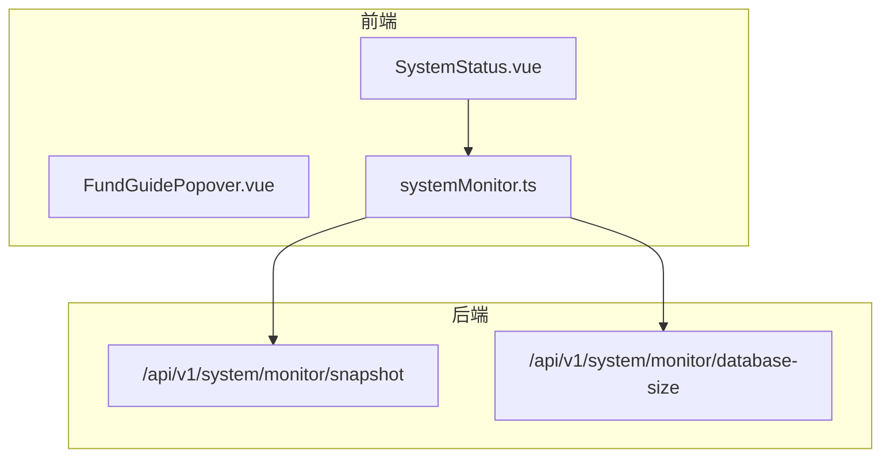
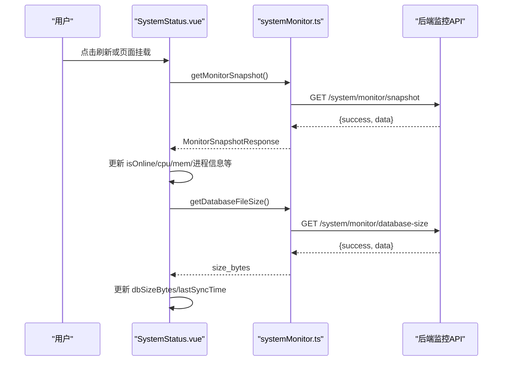
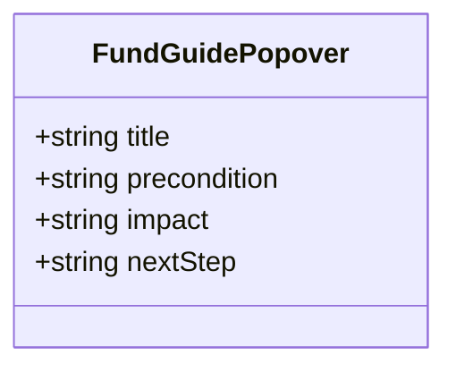
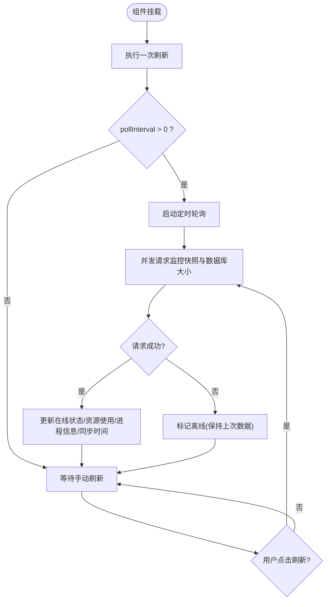
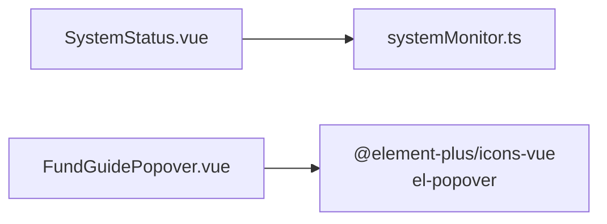

# 业务组件

<cite>
**本文引用的文件**
- [FundGuidePopover.vue](file://frontend/src/components/business/FundGuidePopover.vue)
- [SystemStatus.vue](file://frontend/src/components/business/SystemStatus.vue)
- [systemMonitor.ts](file://frontend/src/api/systemMonitor.ts)
- [FundGuidePopover.test.ts](file://frontend/tests/unit/components/FundGuidePopover.test.ts)
</cite>

## 目录
1. [简介](#简介)
2. [项目结构](#项目结构)
3. [核心组件](#核心组件)
4. [架构总览](#架构总览)
5. [详细组件分析](#详细组件分析)
6. [依赖关系分析](#依赖关系分析)
7. [性能考虑](#性能考虑)
8. [故障排查指南](#故障排查指南)
9. [结论](#结论)
10. [附录](#附录)

## 简介
本技术文档聚焦于业务领域的前端组件，重点说明 FundGuidePopover（经费操作指引气泡）与 SystemStatus（系统状态面板）两个组件的设计模式、实现逻辑、数据绑定与状态管理方式，以及与后端服务的交互模式和同步策略。同时提供配置选项、扩展点、集成示例和错误处理方案，帮助读者快速理解并基于业务需求定制组件行为。

## 项目结构
- 业务组件位于前端 src/components/business 目录下，按业务域组织，便于复用与维护。
- 系统监控相关 API 封装在 src/api/systemMonitor.ts，统一对外暴露获取监控快照、数据库文件大小等能力。
- 单元测试覆盖关键组件的渲染与交互断言，保障基础质量。

图表来源
- [SystemStatus.vue:97-241](file://frontend/src/components/business/SystemStatus.vue#L97-L241)
- [systemMonitor.ts:34-48](file://frontend/src/api/systemMonitor.ts#L34-L48)

章节来源
- [SystemStatus.vue:97-241](file://frontend/src/components/business/SystemStatus.vue#L97-L241)
- [systemMonitor.ts:1-78](file://frontend/src/api/systemMonitor.ts#L1-L78)

## 核心组件
- FundGuidePopover：纯展示型业务气泡，用于在经费相关操作中提供“前置条件、后续影响、下一步”的结构化指引，降低用户误操作风险。
- SystemStatus：系统运行状态面板，聚合在线/离线指示、上次同步时间、数据库大小、CPU/内存使用率、进程信息，并提供刷新按钮与轮询机制。

章节来源
- [FundGuidePopover.vue:1-55](file://frontend/src/components/business/FundGuidePopover.vue#L1-L55)
- [SystemStatus.vue:1-241](file://frontend/src/components/business/SystemStatus.vue#L1-L241)

## 架构总览
- 组件层：FundGuidePopover 为无状态 UI 组件；SystemStatus 为有状态业务组件，负责轮询与状态计算。
- 服务层：通过 systemMonitor.ts 调用后端监控接口，返回统一响应结构。
- 数据流：SystemStatus 发起请求 -> 解析响应 -> 更新本地响应式状态 -> 视图自动刷新。

图表来源
- [SystemStatus.vue:177-220](file://frontend/src/components/business/SystemStatus.vue#L177-L220)
- [systemMonitor.ts:34-48](file://frontend/src/api/systemMonitor.ts#L34-L48)

## 详细组件分析

### FundGuidePopover 组件分析
- 设计模式：受控展示型组件，仅接收 props 渲染内容，不持有业务状态。
- 数据绑定：通过 defineProps 声明 title、precondition、impact、nextStep 四个字符串属性，模板中直接绑定显示。
- 交互逻辑：基于 Element Plus 的 el-popover，悬停触发，延迟显示，提升提示的可读性与可用性。
- 样式与可访问性：使用 scoped 样式隔离，图标具备 aria-label 提升无障碍体验。
- 测试覆盖：单元测试验证图标、标题及三段文案是否正确渲染。

图表来源
- [FundGuidePopover.vue:20-25](file://frontend/src/components/business/FundGuidePopover.vue#L20-L25)

章节来源
- [FundGuidePopover.vue:1-55](file://frontend/src/components/business/FundGuidePopover.vue#L1-L55)
- [FundGuidePopover.test.ts:1-42](file://frontend/tests/unit/components/FundGuidePopover.test.ts#L1-L42)

### SystemStatus 组件分析
- 设计模式：组合式 API + 响应式状态管理，职责单一，关注系统健康度可视化。
- 配置项：
  - pollInterval：轮询间隔（毫秒），默认 30 秒，设为 0 禁用轮询。
  - showRefresh：是否显示刷新按钮。
- 状态字段：
  - isOnline：在线/离线标志。
  - isSyncing：是否正在刷新。
  - lastSyncTime：上次成功同步时间。
  - cpuPercent、memPercent：CPU/内存使用率百分比。
  - processMemoryMB、processThreads：进程内存与线程数。
  - dbSizeBytes：数据库文件大小（字节）。
- 计算属性：
  - onlineStatusText：根据 isSyncing/isOnline 动态生成文本。
  - formattedSyncTime：相对时间格式化（刚刚/分钟前/小时前/日期）。
  - dbSizeText：将字节转换为 MB/GB 的人类可读格式。
- 数据获取与同步策略：
  - 首次挂载立即执行一次刷新。
  - 若启用轮询，则按 pollInterval 周期调用 getMonitorSnapshot 更新 CPU/内存/进程等信息。
  - 每次刷新并行获取数据库文件大小，成功后更新时间戳。
  - 失败时仅标记离线，保留上次有效数据，避免界面抖动。
- 错误处理：
  - 捕获异常并记录日志，保证组件健壮性。
  - 网络不可用时降级为离线态，不影响其他指标展示。
- 生命周期管理：
  - onMounted 启动初始刷新与可选轮询定时器。
  - onUnmounted 清理定时器，防止内存泄漏。

图表来源
- [SystemStatus.vue:115-118](file://frontend/src/components/business/SystemStatus.vue#L115-L118)
- [SystemStatus.vue:177-241](file://frontend/src/components/business/SystemStatus.vue#L177-L241)

章节来源
- [SystemStatus.vue:97-241](file://frontend/src/components/business/SystemStatus.vue#L97-L241)
- [systemMonitor.ts:34-48](file://frontend/src/api/systemMonitor.ts#L34-L48)

## 依赖关系分析
- SystemStatus 依赖 systemMonitor.ts 提供的 getMonitorSnapshot 与 getDatabaseFileSize。
- FundGuidePopover 无外部依赖，仅依赖 UI 库图标与 popover 组件。
- 两者均通过统一的响应式状态驱动视图更新，符合 Vue 3 组合式 API 最佳实践。

图表来源
- [SystemStatus.vue:97-102](file://frontend/src/components/business/SystemStatus.vue#L97-L102)
- [systemMonitor.ts:34-48](file://frontend/src/api/systemMonitor.ts#L34-L48)
- [FundGuidePopover.vue:17-25](file://frontend/src/components/business/FundGuidePopover.vue#L17-L25)

章节来源
- [SystemStatus.vue:97-102](file://frontend/src/components/business/SystemStatus.vue#L97-L102)
- [systemMonitor.ts:1-78](file://frontend/src/api/systemMonitor.ts#L1-L78)
- [FundGuidePopover.vue:17-25](file://frontend/src/components/business/FundGuidePopover.vue#L17-L25)

## 性能考虑
- 轮询频率可调：通过 pollInterval 控制请求频率，避免频繁请求造成带宽与后端压力。
- 并发请求：刷新时并发获取监控快照与数据库大小，减少整体耗时。
- 最小化重渲染：仅更新必要响应式变量，利用 computed 派生展示值，降低 DOM 更新成本。
- 资源释放：组件卸载时清除定时器，避免内存泄漏。
- 降级策略：网络异常时保持上次有效数据，仅切换在线状态，提升用户体验。

[本节为通用性能建议，无需特定文件引用]

## 故障排查指南
- 无法获取监控数据：
  - 检查后端 /system/monitor/snapshot 与 /system/monitor/database-size 是否可达。
  - 查看浏览器控制台与日志输出，确认是否有网络错误或响应结构不符。
- 轮询未生效：
  - 确认 pollInterval 设置大于 0。
  - 检查组件是否被正确挂载与销毁，确保定时器已创建与清理。
- 显示离线但实际可用：
  - 可能是后端返回非 success 或超时，需检查服务端健康状态与网络连通性。
- 指引气泡不显示：
  - 确认父容器未被隐藏或 z-index 冲突。
  - 检查 el-popover 的 trigger 与 show-after 配置是否符合预期。

章节来源
- [SystemStatus.vue:177-220](file://frontend/src/components/business/SystemStatus.vue#L177-L220)
- [systemMonitor.ts:34-48](file://frontend/src/api/systemMonitor.ts#L34-L48)
- [FundGuidePopover.vue:1-15](file://frontend/src/components/business/FundGuidePopover.vue#L1-L15)

## 结论
FundGuidePopover 与 SystemStatus 分别承担“业务引导”和“系统健康可视化”的职责，前者以极简的受控组件模式提供清晰的操作指引，后者通过响应式状态与轮询机制实时呈现系统运行状况。二者均具备良好的可配置性与可扩展性，能够灵活适配不同业务场景与部署环境。

[本节为总结性内容，无需特定文件引用]

## 附录

### 配置选项速查
- FundGuidePopover
  - title：指引标题
  - precondition：前置条件说明
  - impact：后续影响说明
  - nextStep：下一步操作建议
- SystemStatus
  - pollInterval：轮询间隔（毫秒），默认 30000，设为 0 禁用轮询
  - showRefresh：是否显示刷新按钮

章节来源
- [FundGuidePopover.vue:20-25](file://frontend/src/components/business/FundGuidePopover.vue#L20-L25)
- [SystemStatus.vue:108-118](file://frontend/src/components/business/SystemStatus.vue#L108-L118)

### 集成示例
- 在经费操作按钮旁嵌入 FundGuidePopover，传入当前操作的上下文文案，帮助用户理解操作后果与后续步骤。
- 在仪表盘顶部或侧边栏放置 SystemStatus，开启轮询以持续观察系统健康度，必要时提供手动刷新入口。

章节来源
- [FundGuidePopover.vue:1-15](file://frontend/src/components/business/FundGuidePopover.vue#L1-L15)
- [SystemStatus.vue:83-94](file://frontend/src/components/business/SystemStatus.vue#L83-L94)

### 错误处理方案
- 网络异常：SystemStatus 捕获异常后标记离线，保留上次有效数据，避免界面闪烁。
- 数据格式异常：对返回数据进行安全取值与类型转换，缺失字段时使用默认值。
- 日志记录：关键错误路径记录日志，便于定位问题。

章节来源
- [SystemStatus.vue:190-220](file://frontend/src/components/business/SystemStatus.vue#L190-L220)