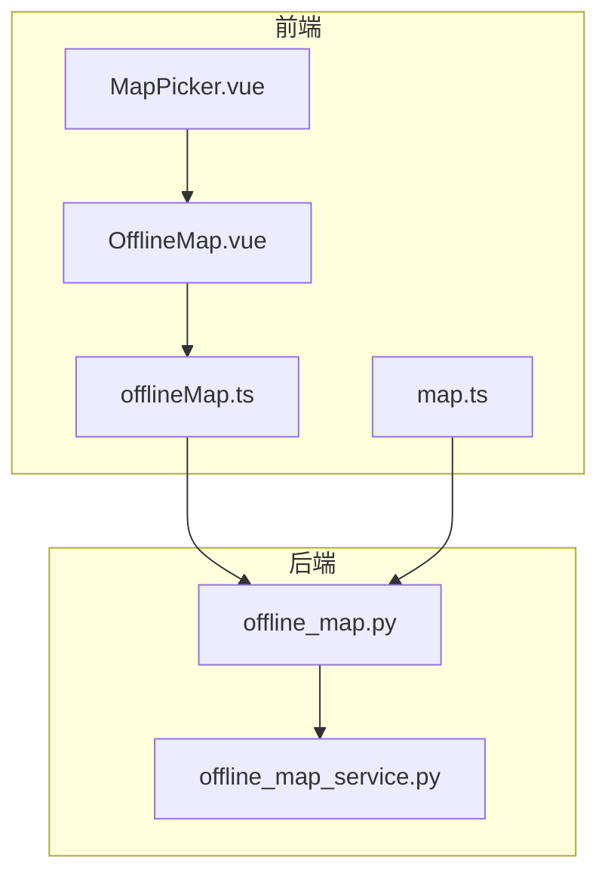
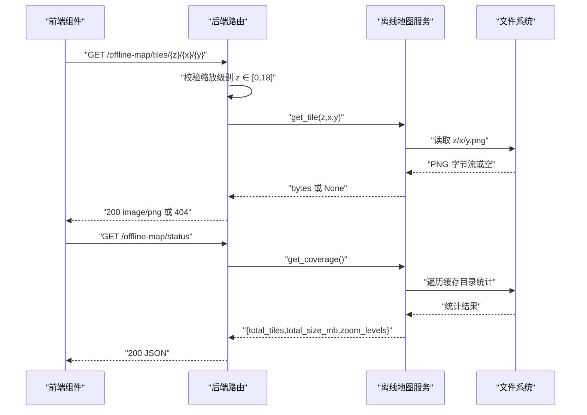
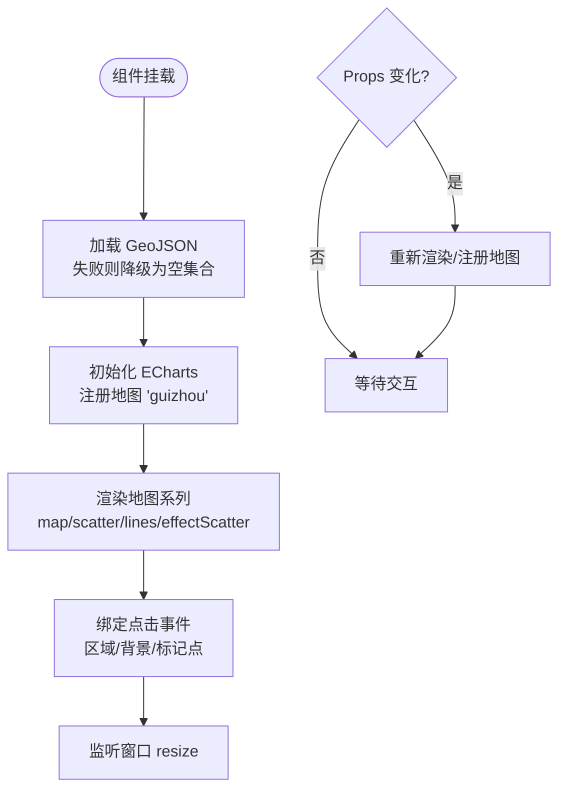
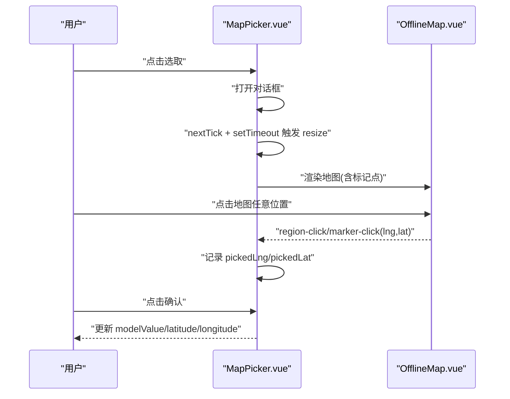
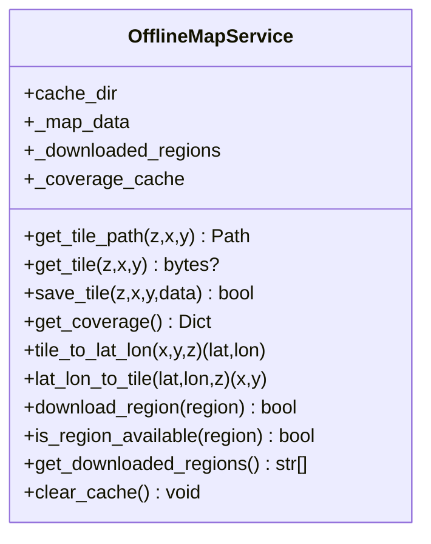
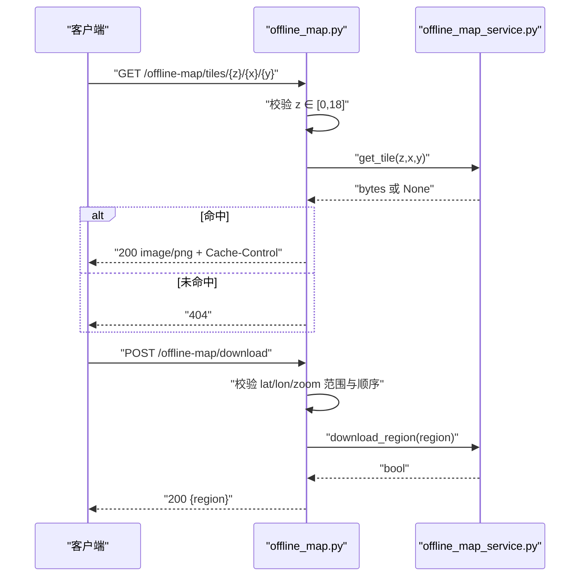
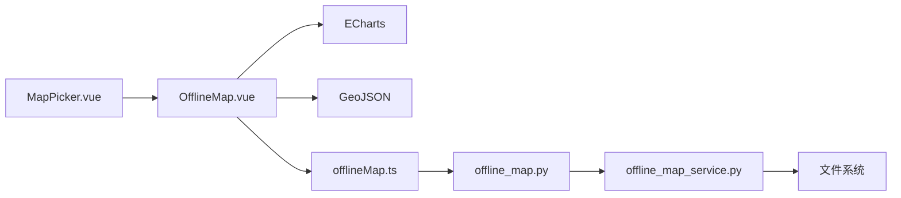

# 地图组件

<cite>
**本文引用的文件**
- [OfflineMap.vue](file://frontend/src/components/map/OfflineMap.vue)
- [MapPicker.vue](file://frontend/src/components/MapPicker.vue)
- [offlineMap.ts](file://frontend/src/api/offlineMap.ts)
- [map.ts](file://frontend/src/api/map.ts)
- [offline_map.py](file://backend/app/api/v1/offline_map.py)
- [offline_map_service.py](file://backend/app/services/offline_map_service.py)
- [test_offline_map_api_cov.py](file://backend/tests/unit/test_offline_map_api_cov.py)
- [test_offline_map_service.py](file://backend/tests/unit/test_offline_map_service.py)
- [test_cov_b4b_offline_map_service.py](file://backend/tests/unit/test_cov_b4b_offline_map_service.py)
</cite>

## 目录
1. [简介](#简介)
2. [项目结构](#项目结构)
3. [核心组件](#核心组件)
4. [架构总览](#架构总览)
5. [详细组件分析](#详细组件分析)
6. [依赖关系分析](#依赖关系分析)
7. [性能考虑](#性能考虑)
8. [故障排查指南](#故障排查指南)
9. [结论](#结论)
10. [附录](#附录)

## 简介
本技术文档围绕地图可视化组件与离线地图能力，系统阐述前端可视化、后端瓦片服务与缓存管理、数据加载与交互实现。重点包括：
- 离线地图组件 OfflineMap 的设计与渲染流程（ECharts + GeoJSON）
- 瓦片下载、缓存、读取与覆盖范围统计
- 标记点、路径绘制与信息窗口的交互实现
- API 接口定义与前后端协作方式
- 配置项、扩展方法与不同地图服务的集成思路
- 性能优化策略与移动端适配方案

## 项目结构
本项目在前后端分离的架构下提供地图能力：
- 前端
  - 可视化组件：基于 ECharts 的离线地图组件与坐标选择器
  - API 封装：离线地图与通用地图接口的调用封装
- 后端
  - 路由层：离线地图相关 REST 接口（瓦片获取、状态查询、下载、清理）
  - 服务层：瓦片路径计算、读写、覆盖范围统计、经纬度与瓦片坐标转换

图表来源
- [OfflineMap.vue:1-344](file://frontend/src/components/map/OfflineMap.vue#L1-L344)
- [MapPicker.vue:1-173](file://frontend/src/components/MapPicker.vue#L1-L173)
- [offlineMap.ts:1-22](file://frontend/src/api/offlineMap.ts#L1-L22)
- [map.ts:76-108](file://frontend/src/api/map.ts#L76-L108)
- [offline_map.py:1-101](file://backend/app/api/v1/offline_map.py#L1-L101)
- [offline_map_service.py:1-146](file://backend/app/services/offline_map_service.py#L1-L146)

章节来源
- [OfflineMap.vue:1-344](file://frontend/src/components/map/OfflineMap.vue#L1-L344)
- [offline_map_service.py:1-146](file://backend/app/services/offline_map_service.py#L1-L146)
- [offline_map.py:1-101](file://backend/app/api/v1/offline_map.py#L1-L101)

## 核心组件
- OfflineMap 组件
  - 使用 ECharts 渲染贵州省 GeoJSON 矢量地图
  - 支持县市区着色、标记点、路线连线、出发点标注
  - 监听区域点击与背景点击，向上抛出事件供父组件处理
  - 动态注册 GeoJSON 地图，支持外部传入或本地资源加载失败回退
- MapPicker 组件
  - 提供经纬度输入与弹窗地图选点
  - 将选中的坐标通过双向绑定与事件回传给父组件
- 离线地图服务
  - 管理瓦片缓存目录、读写瓦片、统计覆盖范围
  - 提供经纬度与瓦片坐标互转工具方法
  - 记录已下载区域标识，便于后续扩展批量下载逻辑

章节来源
- [OfflineMap.vue:1-344](file://frontend/src/components/map/OfflineMap.vue#L1-L344)
- [MapPicker.vue:1-173](file://frontend/src/components/MapPicker.vue#L1-L173)
- [offline_map_service.py:1-146](file://backend/app/services/offline_map_service.py#L1-L146)

## 架构总览
下图展示了从前端到后端的完整数据流：前端组件发起请求或渲染，后端路由校验参数并调用服务层完成瓦片读取与统计，返回二进制图片或 JSON 状态。

图表来源
- [offline_map.py:14-51](file://backend/app/api/v1/offline_map.py#L14-L51)
- [offline_map_service.py:53-106](file://backend/app/services/offline_map_service.py#L53-L106)

## 详细组件分析

### OfflineMap 组件（ECharts 矢量地图）
- 功能要点
  - 动态导入贵州 GeoJSON；若失败则降级为空 FeatureCollection 并告警
  - 注册地图名称“guizhou”，按地州市分组着色，县市区虚线边框
  - 支持三类数据：regionData（区域数据）、markers（标记点）、routeLines（路线）
  - 支持 originMarker（出发点）高亮显示
  - 事件：region-click（区域或背景点击）、marker-click（标记点点击）
  - 响应式：窗口 resize 时自动重绘；props 变化时重新渲染
- 关键流程
  - 初始化：挂载时加载 GeoJSON → 初始化 ECharts → 注册地图 → 渲染
  - 渲染：构建县-州映射、生成 map/scatter/lines/effectScatter series
  - 交互：监听 series click 与 ZRender click，转换为经纬度并抛事件
  - 更新：watch 监听 props 变化，必要时重新注册地图并渲染

图表来源
- [OfflineMap.vue:72-127](file://frontend/src/components/map/OfflineMap.vue#L72-L127)
- [OfflineMap.vue:129-297](file://frontend/src/components/map/OfflineMap.vue#L129-L297)
- [OfflineMap.vue:316-333](file://frontend/src/components/map/OfflineMap.vue#L316-L333)

章节来源
- [OfflineMap.vue:1-344](file://frontend/src/components/map/OfflineMap.vue#L1-L344)

### MapPicker 组件（坐标选取）
- 功能要点
  - 支持经度/纬度输入与弹窗地图选点
  - 打开弹窗后触发 resize，确保 ECharts 正确渲染
  - 点击地图任意位置选中坐标，确认后写回父组件
- 交互流程
  - 点击“选取”→ 打开对话框 → 触发 resize → 展示 OfflineMap
  - 点击地图 → 记录 pickedLng/pickedLat → 确认按钮生效
  - 确认后更新输入框并通过 update:modelValue 等事件通知父组件

图表来源
- [MapPicker.vue:30-56](file://frontend/src/components/MapPicker.vue#L30-L56)
- [MapPicker.vue:128-158](file://frontend/src/components/MapPicker.vue#L128-L158)

章节来源
- [MapPicker.vue:1-173](file://frontend/src/components/MapPicker.vue#L1-L173)

### 离线地图服务（瓦片缓存与管理）
- 功能要点
  - 模块级缓存目录初始化：优先使用数据目录，权限异常时回退至临时目录
  - 瓦片路径：z/x/y.png 层级结构
  - 读取/保存：异步 IO，异常安全；保存后清空覆盖范围缓存
  - 覆盖范围统计：遍历缓存目录，统计瓦片数量、大小、缩放级别
  - 坐标转换：经纬度与瓦片坐标互转
  - 区域下载记录：记录 region 标识，便于后续扩展
- 错误处理
  - 目录创建失败：记录警告并继续运行
  - 文件读取失败：记录日志并返回空
  - 模块级 get_data_path 失败：回退到临时目录，避免路由加载崩溃

图表来源
- [offline_map_service.py:31-146](file://backend/app/services/offline_map_service.py#L31-L146)

章节来源
- [offline_map_service.py:1-146](file://backend/app/services/offline_map_service.py#L1-L146)
- [test_offline_map_service.py:1-110](file://backend/tests/unit/test_offline_map_service.py#L1-L110)
- [test_cov_b4b_offline_map_service.py:1-35](file://backend/tests/unit/test_cov_b4b_offline_map_service.py#L1-L35)

### 离线地图 API（路由层）
- 接口清单
  - GET /offline-map/tiles/{z}/{x}/{y}：获取 PNG 瓦片，带浏览器缓存头
  - GET /offline-map/status：返回覆盖范围统计
  - POST /offline-map/download：管理员接口，记录下载区域（参数校验严格）
  - DELETE /offline-map/clear：管理员接口，清理缓存
- 参数校验与安全
  - 缩放级别限制 0-18
  - 经纬度范围校验
  - 管理员依赖注入保护写操作
- 测试覆盖
  - 缩放非法返回 400
  - 命中返回 200 且 content-type=image/png
  - 未命中返回 404
  - 服务异常返回业务错误信息

图表来源
- [offline_map.py:14-101](file://backend/app/api/v1/offline_map.py#L14-L101)
- [offline_map_service.py:124-136](file://backend/app/services/offline_map_service.py#L124-L136)

章节来源
- [offline_map.py:1-101](file://backend/app/api/v1/offline_map.py#L1-L101)
- [test_offline_map_api_cov.py:1-79](file://backend/tests/unit/test_offline_map_api_cov.py#L1-L79)

### 前端 API 封装
- offlineMap.ts
  - getTiles(z,x,y)：获取瓦片
  - getStatus()：获取状态
  - clearTiles()：清理缓存
  - downloadTiles(params)：下载指定区域的瓦片
- map.ts
  - getMapConfig()：获取地图配置（中心、缩放、类型、离线开关、瓦片 URL）
  - getDistances()：距离估算
  - getTileInfo()：瓦片信息

章节来源
- [offlineMap.ts:1-22](file://frontend/src/api/offlineMap.ts#L1-L22)
- [map.ts:76-108](file://frontend/src/api/map.ts#L76-L108)

## 依赖关系分析
- 组件耦合
  - MapPicker 依赖 OfflineMap 进行选点
  - OfflineMap 依赖 ECharts 与 GeoJSON 资源
- 前后端契约
  - 前端通过 offlineMap.ts 调用后端 /offline-map/* 接口
  - 后端路由依赖服务层进行瓦片 I/O 与统计
- 外部依赖
  - ECharts：地图渲染与交互
  - 文件系统：瓦片持久化存储
  - FastAPI：路由、依赖注入、响应封装

图表来源
- [MapPicker.vue:1-173](file://frontend/src/components/MapPicker.vue#L1-L173)
- [OfflineMap.vue:1-344](file://frontend/src/components/map/OfflineMap.vue#L1-L344)
- [offlineMap.ts:1-22](file://frontend/src/api/offlineMap.ts#L1-L22)
- [offline_map.py:1-101](file://backend/app/api/v1/offline_map.py#L1-L101)
- [offline_map_service.py:1-146](file://backend/app/services/offline_map_service.py#L1-L146)

章节来源
- [offline_map_service.py:1-146](file://backend/app/services/offline_map_service.py#L1-L146)
- [offline_map.py:1-101](file://backend/app/api/v1/offline_map.py#L1-L101)

## 性能考虑
- 瓦片缓存
  - 服务端设置浏览器缓存头（max-age=86400），减少重复请求
  - 覆盖范围统计结果在服务端内存缓存，避免频繁磁盘扫描
- 渲染优化
  - ECharts 按需注册地图，仅在 geoJsonData 变化时重新注册
  - 窗口 resize 时统一调用 resize，避免多次重绘
- 资源加载
  - GeoJSON 动态导入失败时降级为空集合，保证页面可用性
  - 模块级缓存目录初始化失败时回退到临时目录，避免启动崩溃
- 移动端适配
  - 组件尺寸可通过 width/height 控制，容器最小高度保障可读性
  - 弹窗打开后延迟触发 resize，确保 Canvas 正确布局

[本节为通用指导，不直接分析具体文件]

## 故障排查指南
- 瓦片读取失败
  - 现象：接口返回 404 或业务错误
  - 排查：检查 z/x/y 路径是否存在；查看服务层日志输出
  - 参考：服务层读取异常捕获与日志记录
- 缓存目录权限问题
  - 现象：模块加载失败或无法写入
  - 排查：确认数据目录权限；观察是否回退到临时目录
  - 参考：模块级 try/except 回退逻辑
- 地图渲染异常
  - 现象：地图空白或无交互
  - 排查：检查 GeoJSON 是否成功加载；确认 ECharts 实例是否正确初始化与销毁
  - 参考：组件生命周期与 watch 行为
- 接口参数校验失败
  - 现象：400 错误
  - 排查：检查缩放级别、经纬度范围与顺序
  - 参考：路由层参数校验分支

章节来源
- [offline_map_service.py:17-47](file://backend/app/services/offline_map_service.py#L17-L47)
- [offline_map_service.py:53-76](file://backend/app/services/offline_map_service.py#L53-L76)
- [offline_map.py:14-51](file://backend/app/api/v1/offline_map.py#L14-L51)
- [test_offline_map_api_cov.py:37-79](file://backend/tests/unit/test_offline_map_api_cov.py#L37-L79)

## 结论
本地图组件以 ECharts 为核心，结合后端离线瓦片服务，实现了可离线、可扩展、易维护的地图可视化能力。通过严格的参数校验、完善的错误处理与缓存机制，保障了在不同网络环境下的可用性与性能。前端组件提供了丰富的交互能力，支持标记点、路径绘制与信息提示，满足多场景需求。

[本节为总结，不直接分析具体文件]

## 附录

### 配置选项与扩展方法
- 前端组件配置
  - width/height：容器尺寸
  - markers：标记点数组（lng、lat、name、type、value）
  - regionData：区域数据（name、value）
  - routeLines：路线数组（coords、label）
  - originMarker：出发点（lng、lat）
  - viewLevel：视图层级（如 province）
  - geoJsonData：自定义 GeoJSON 数据源
- 后端服务扩展
  - 新增瓦片格式：修改 get_tile_path 与 save_tile 的文件后缀与编码
  - 多地图源：在路由层增加多源切换逻辑，服务层按 key 区分目录
  - 增量下载：基于 download_region 的区域标识扩展为任务队列

章节来源
- [OfflineMap.vue:37-58](file://frontend/src/components/map/OfflineMap.vue#L37-L58)
- [offline_map_service.py:49-76](file://backend/app/services/offline_map_service.py#L49-L76)
- [offline_map.py:54-87](file://backend/app/api/v1/offline_map.py#L54-L87)