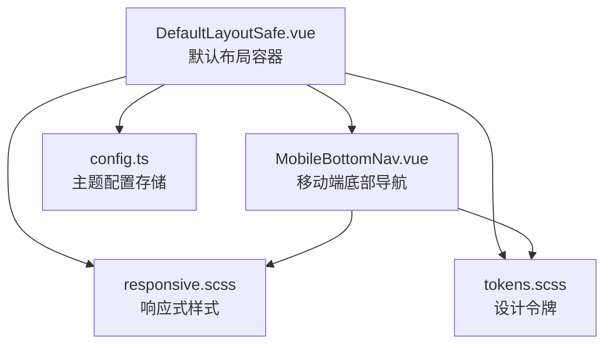
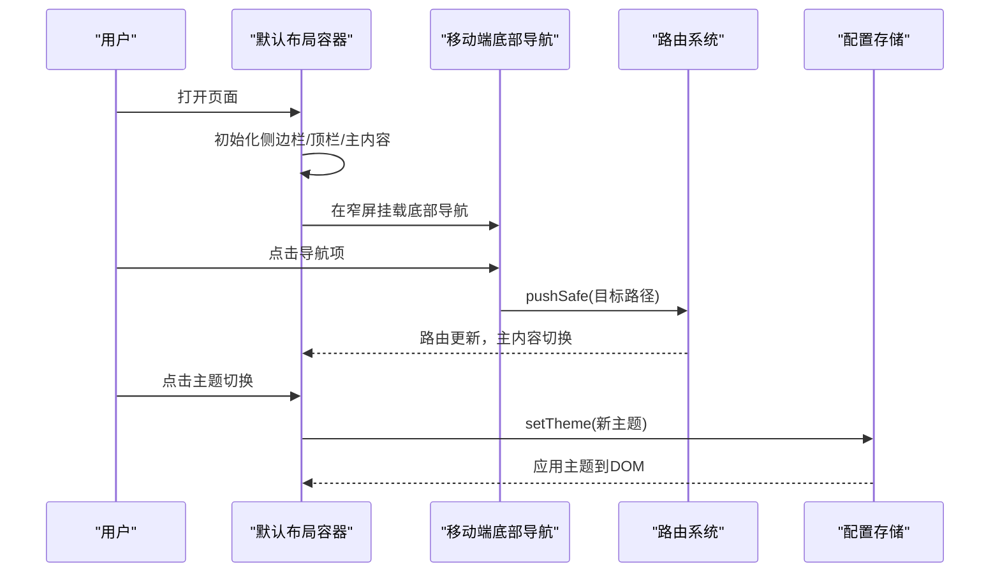
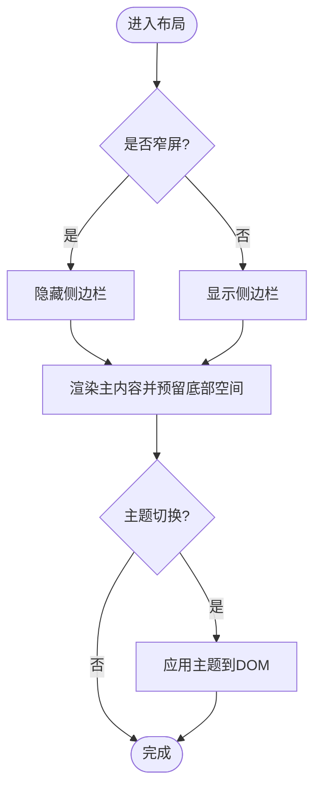
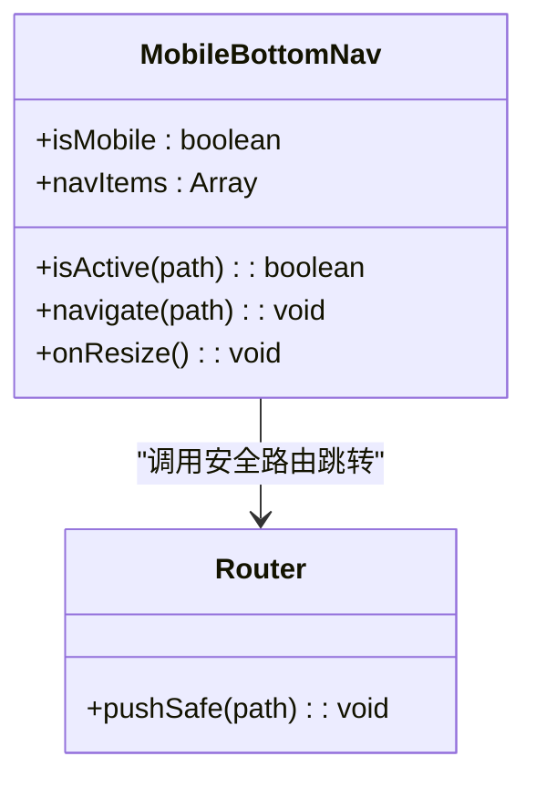
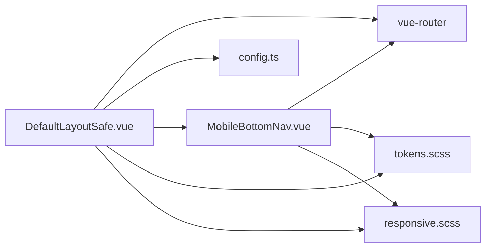

# 布局组件

<cite>
**本文引用的文件**
- [DefaultLayoutSafe.vue](file://frontend/src/layouts/DefaultLayoutSafe.vue)
- [MobileBottomNav.vue](file://frontend/src/components/layout/MobileBottomNav.vue)
- [responsive.scss](file://frontend/src/styles/responsive.scss)
- [tokens.scss](file://frontend/src/styles/tokens.scss)
- [config.ts](file://frontend/src/stores/config.ts)
- [MobileBottomNav.test.ts](file://frontend/tests/unit/components/MobileBottomNav.test.ts)
</cite>

## 目录
1. [简介](#简介)
2. [项目结构](#项目结构)
3. [核心组件](#核心组件)
4. [架构总览](#架构总览)
5. [详细组件分析](#详细组件分析)
6. [依赖关系分析](#依赖关系分析)
7. [性能考虑](#性能考虑)
8. [故障排查指南](#故障排查指南)
9. [结论](#结论)
10. [附录](#附录)

## 简介
本技术文档聚焦前端布局体系，围绕默认布局容器与移动端底部导航两大核心，系统阐述其设计理念、响应式策略、主题定制与样式覆盖方法、集成方式与最佳实践，并给出性能优化与用户体验改进建议。目标是帮助开发者快速理解并稳定扩展布局能力，确保在不同屏幕尺寸下保持一致的视觉与交互体验。

## 项目结构
布局相关代码主要分布在以下位置：
- 默认布局容器：位于 layouts 目录，负责侧边栏、顶栏、主内容区与页脚的整体编排，并在窄屏时切换为底部导航。
- 移动端底部导航：位于 components/layout 目录，提供移动端的固定底部导航栏。
- 响应式样式：集中定义断点、栅格、显示隐藏工具类与移动端适配规则。
- 设计令牌（Tokens）：统一的颜色、间距、圆角、阴影、过渡等变量，支撑主题与一致性。
- 配置存储：管理主题选项与持久化，驱动主题切换。

图表来源
- [DefaultLayoutSafe.vue:1-416](file://frontend/src/layouts/DefaultLayoutSafe.vue#L1-L416)
- [MobileBottomNav.vue:1-109](file://frontend/src/components/layout/MobileBottomNav.vue#L1-L109)
- [responsive.scss:1-439](file://frontend/src/styles/responsive.scss#L1-L439)
- [tokens.scss:1-200](file://frontend/src/styles/tokens.scss#L1-L200)
- [config.ts:1-51](file://frontend/src/stores/config.ts#L1-L51)

章节来源
- [DefaultLayoutSafe.vue:1-416](file://frontend/src/layouts/DefaultLayoutSafe.vue#L1-L416)
- [MobileBottomNav.vue:1-109](file://frontend/src/components/layout/MobileBottomNav.vue#L1-L109)
- [responsive.scss:1-439](file://frontend/src/styles/responsive.scss#L1-L439)
- [tokens.scss:1-200](file://frontend/src/styles/tokens.scss#L1-L200)
- [config.ts:1-51](file://frontend/src/stores/config.ts#L1-L51)

## 核心组件
- 默认布局容器（DefaultLayoutSafe.vue）
  - 职责：组织侧边栏导航、顶部操作区、主内容渲染区域与页脚；在窄屏隐藏侧边栏并启用底部导航；处理主题切换、自动锁屏、快捷键、消息未读轮询等。
  - 关键点：使用 CSS 变量控制侧边栏宽度；通过媒体查询在小于 768px 时隐藏侧边栏；主内容区预留底部安全距离以避让底部导航。
- 移动端底部导航（MobileBottomNav.vue）
  - 职责：在移动设备提供固定底部导航，包含首页、帮扶村、经费、消息、我的五个入口；根据当前路由高亮对应项；支持窗口尺寸变化动态显示/隐藏。
  - 关键点：监听 window.innerWidth 变化；使用精确与前缀匹配判断激活状态；通过 pushSafe 进行安全路由跳转。

章节来源
- [DefaultLayoutSafe.vue:1-416](file://frontend/src/layouts/DefaultLayoutSafe.vue#L1-L416)
- [MobileBottomNav.vue:1-109](file://frontend/src/components/layout/MobileBottomNav.vue#L1-L109)

## 架构总览
布局由“桌面端侧边栏 + 移动端底部导航”双模式构成，配合统一的响应式样式与设计令牌，实现跨设备一致的布局与主题表现。

图表来源
- [DefaultLayoutSafe.vue:323-416](file://frontend/src/layouts/DefaultLayoutSafe.vue#L323-L416)
- [MobileBottomNav.vue:20-53](file://frontend/src/components/layout/MobileBottomNav.vue#L20-L53)
- [config.ts:38-51](file://frontend/src/stores/config.ts#L38-L51)

## 详细组件分析

### 默认布局容器（DefaultLayoutSafe.vue）
- 结构与职责
  - 侧边栏：带 Logo、可折叠菜单、分区标签与权限控制；通过 CSS 变量控制展开/收起宽度。
  - 顶栏：面包屑、消息铃铛（未读数）、主题切换、用户下拉菜单。
  - 主内容：路由视图渲染，错误边界包裹，避免过渡导致的空白问题。
  - 页脚：版本信息展示。
  - 移动端适配：窄屏隐藏侧边栏，底部导航固定显示，主内容增加底部内边距。
- 响应式策略
  - 使用 matchMedia 监听窄屏（≤767px），进入窄屏强制折叠侧边栏；回到宽屏不覆盖用户折叠偏好。
  - 媒体查询中隐藏侧边栏并为滚动区域增加底部留白，避免被底部导航遮挡。
- 主题与样式覆盖
  - 通过配置存储设置主题，并将 data-theme 应用到根节点；默认主题为军绿，移除 data-theme 即回退到 :root 默认值。
  - 侧边栏菜单文字颜色通过 Element Plus 的 CSS 变量覆盖，保证深色背景下的可读性。
- 交互与可用性
  - 提供 WCAG 跳过链接，提升键盘可达性。
  - 全局快捷键绑定常用页面跳转。
  - 自动锁屏：无操作一段时间后跳转登录页，解锁后恢复原路由。
  - 消息未读：定时轮询并联动托盘角标与提示。

图表来源
- [DefaultLayoutSafe.vue:519-535](file://frontend/src/layouts/DefaultLayoutSafe.vue#L519-L535)
- [DefaultLayoutSafe.vue:1091-1128](file://frontend/src/layouts/DefaultLayoutSafe.vue#L1091-L1128)
- [config.ts:30-47](file://frontend/src/stores/config.ts#L30-L47)

章节来源
- [DefaultLayoutSafe.vue:1-416](file://frontend/src/layouts/DefaultLayoutSafe.vue#L1-L416)
- [DefaultLayoutSafe.vue:519-535](file://frontend/src/layouts/DefaultLayoutSafe.vue#L519-L535)
- [DefaultLayoutSafe.vue:1091-1128](file://frontend/src/layouts/DefaultLayoutSafe.vue#L1091-L1128)
- [config.ts:30-47](file://frontend/src/stores/config.ts#L30-L47)

### 移动端底部导航（MobileBottomNav.vue）
- 结构与职责
  - 固定底部导航栏，包含五个常用入口：首页、帮扶村、经费、消息、我的。
  - 根据当前路由高亮对应项（精确匹配或前缀匹配）。
  - 监听窗口尺寸变化，在移动与桌面之间切换显示。
- 交互逻辑
  - 点击导航项调用 pushSafe 进行安全路由跳转。
  - 支持 badge 占位（当前为空字符串，测试覆盖不可达分支）。
- 样式特性
  - 使用设计令牌中的背景、边框、危险色等变量，保持主题一致。
  - 适配安全区域（safe-area-inset-bottom），兼容刘海屏等设备。

图表来源
- [MobileBottomNav.vue:20-53](file://frontend/src/components/layout/MobileBottomNav.vue#L20-L53)

章节来源
- [MobileBottomNav.vue:1-109](file://frontend/src/components/layout/MobileBottomNav.vue#L1-L109)
- [MobileBottomNav.test.ts:1-128](file://frontend/tests/unit/components/MobileBottomNav.test.ts#L1-L128)

### 响应式样式与断点（responsive.scss）
- 断点定义：xs/sm/md/lg/xl/xxl，提供 min-width、max-width、between 等 Mixin。
- 通用工具类：container、row/col 栅格、hidden/visible 系列、flex 响应式工具。
- 平板与移动端适配：表格横向滚动、表单间距调整、卡片内边距调整、移动端全宽按钮、堆叠布局、底部固定栏等。
- 打印样式：隐藏无关元素，简化布局。

章节来源
- [responsive.scss:1-439](file://frontend/src/styles/responsive.scss#L1-L439)

### 设计令牌与主题（tokens.scss, config.ts）
- tokens.scss
  - 定义颜色、间距、圆角、阴影、过渡、字体等 Token，作为全局样式基础。
  - 提供默认主题（军绿）与可选主题（light/dark/military/outdoor/high-contrast）。
- config.ts
  - 主题选项列表与持久化键。
  - applyThemeToDom：将主题应用到 DOM（默认主题移除 data-theme，其他主题设置 data-theme）。
  - useConfigStore：提供 theme 与 setTheme，供布局顶栏主题切换器调用。

章节来源
- [tokens.scss:1-200](file://frontend/src/styles/tokens.scss#L1-L200)
- [config.ts:1-51](file://frontend/src/stores/config.ts#L1-L51)

## 依赖关系分析
- DefaultLayoutSafe.vue 依赖：
  - 路由系统：useRoute、pushSafe。
  - 配置存储：useConfigStore、THEME_OPTIONS。
  - 权限与认证：useAuthStore、useMenuStore。
  - 移动端导航：MobileBottomNav.vue。
  - 响应式样式：responsive.scss、tokens.scss。
- MobileBottomNav.vue 依赖：
  - 路由系统：useRoute、pushSafe。
  - 图标库：@element-plus/icons-vue。
  - 响应式样式：responsive.scss、tokens.scss。

图表来源
- [DefaultLayoutSafe.vue:419-464](file://frontend/src/layouts/DefaultLayoutSafe.vue#L419-L464)
- [MobileBottomNav.vue:20-38](file://frontend/src/components/layout/MobileBottomNav.vue#L20-L38)
- [config.ts:38-51](file://frontend/src/stores/config.ts#L38-L51)

章节来源
- [DefaultLayoutSafe.vue:419-464](file://frontend/src/layouts/DefaultLayoutSafe.vue#L419-L464)
- [MobileBottomNav.vue:20-38](file://frontend/src/components/layout/MobileBottomNav.vue#L20-L38)
- [config.ts:38-51](file://frontend/src/stores/config.ts#L38-L51)

## 性能考虑
- 减少不必要的重排与重绘
  - 侧边栏折叠使用 CSS 变量与 transition，避免频繁计算布局。
  - 主内容区移除过渡包装，避免因 display:contents 导致过渡事件不触发的问题。
- 事件监听与资源释放
  - 移动端导航在 onMounted/onUnmounted 中正确注册/移除 resize 监听，防止内存泄漏。
  - 自动锁屏与快捷键监听在组件卸载时清理。
- 网络请求节流
  - 消息未读采用定时器轮询，避免高频请求；退出登录时冻结并取消 pending 请求，防止异步跳转期间重复请求。
- 主题切换开销
  - 主题切换仅修改 DOM 属性，利用 CSS 变量即时生效，避免重新加载样式。

[本节为通用指导，不直接分析具体文件]

## 故障排查指南
- 窄屏主内容被底部导航遮挡
  - 检查是否在媒体查询中为主内容设置了足够的 padding-bottom，参考布局容器的窄屏样式。
  - 参考路径：[DefaultLayoutSafe.vue:1114-1128](file://frontend/src/layouts/DefaultLayoutSafe.vue#L1114-L1128)
- 移动端导航未显示或显示异常
  - 确认窗口宽度小于 768px 且组件已挂载；检查 resize 监听是否正确注册与移除。
  - 参考路径：[MobileBottomNav.vue:29-53](file://frontend/src/components/layout/MobileBottomNav.vue#L29-L53)
- 主题切换无效
  - 检查配置存储是否成功写入 localStorage，以及 applyThemeToDom 是否正确设置/移除 data-theme。
  - 参考路径：[config.ts:30-47](file://frontend/src/stores/config.ts#L30-L47)
- 侧边栏菜单文字颜色不正确
  - 确认已通过 Element Plus 的 CSS 变量覆盖菜单文本颜色，避免默认暗色覆盖。
  - 参考路径：[DefaultLayoutSafe.vue:738-749](file://frontend/src/layouts/DefaultLayoutSafe.vue#L738-L749)

章节来源
- [DefaultLayoutSafe.vue:1114-1128](file://frontend/src/layouts/DefaultLayoutSafe.vue#L1114-L1128)
- [MobileBottomNav.vue:29-53](file://frontend/src/components/layout/MobileBottomNav.vue#L29-L53)
- [config.ts:30-47](file://frontend/src/stores/config.ts#L30-L47)
- [DefaultLayoutSafe.vue:738-749](file://frontend/src/layouts/DefaultLayoutSafe.vue#L738-L749)

## 结论
该布局体系通过“桌面端侧边栏 + 移动端底部导航”的双模式设计，结合统一的响应式样式与设计令牌，实现了跨设备的稳定布局与一致的主题表现。默认布局容器承担整体编排与交互增强，移动端导航专注移动场景的便捷导航。通过合理的性能优化与无障碍支持，系统在可用性与可维护性方面达到良好平衡。后续可在主题扩展、导航项动态化与更细粒度的响应式适配上持续演进。

[本节为总结性内容，不直接分析具体文件]

## 附录
- 集成示例与最佳实践
  - 在页面中使用默认布局容器作为根布局，确保路由视图在主内容区渲染。
  - 在移动端优先的场景，优先使用底部导航；在桌面端保留侧边栏以提升信息密度。
  - 使用设计令牌与响应式工具类，避免硬编码尺寸与颜色，确保主题一致性。
  - 对新增导航项，遵循权限控制与分组标签的组织方式，保持菜单结构清晰。
- 与其他组件的组合使用
  - 与错误边界组件组合，提升页面级容错能力。
  - 与消息中心、用户下拉菜单等顶栏组件组合，形成完整的用户操作区。
  - 与全局快捷键、自动锁屏等能力组合，提升效率与安全。

[本节为通用指导，不直接分析具体文件]