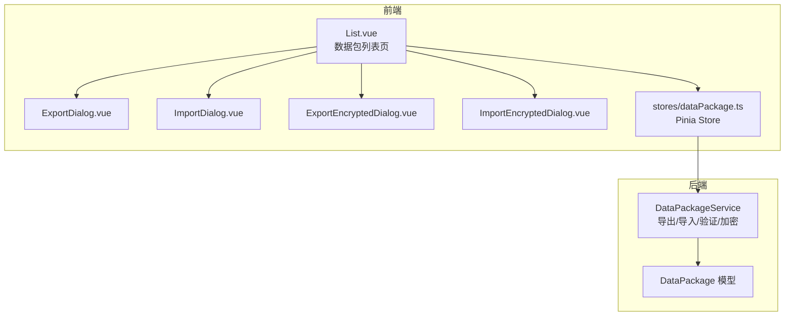
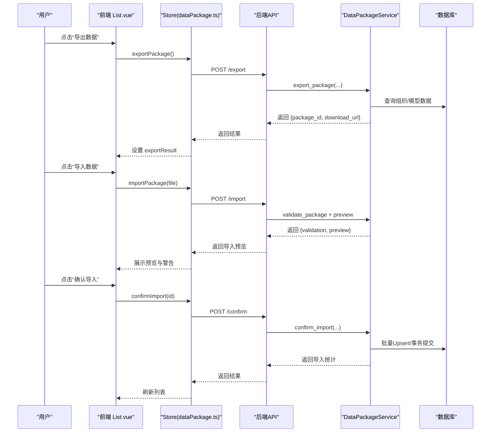
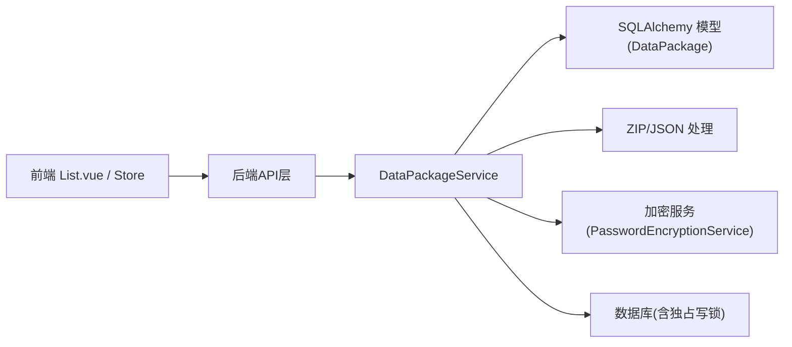

# 数据包组件

<cite>
**本文引用的文件**
- [List.vue](file://frontend/src/views/dataPackage/List.vue)
- [dataPackage.ts](file://frontend/src/stores/dataPackage.ts)
- [data_package.py](file://backend/app/models/data_package.py)
- [data_package_service.py](file://backend/app/services/data_package_service.py)
</cite>

## 目录
1. [简介](#简介)
2. [项目结构](#项目结构)
3. [核心组件](#核心组件)
4. [架构总览](#架构总览)
5. [详细组件分析](#详细组件分析)
6. [依赖关系分析](#依赖关系分析)
7. [性能考虑](#性能考虑)
8. [故障排查指南](#故障排查指南)
9. [结论](#结论)
10. [附录](#附录)

## 简介
本技术文档聚焦于“数据包”导入导出能力，覆盖前端对话框组件（ImportDialog、ExportDialog、ImportEncryptedDialog、ExportEncryptedDialog）与后端服务的数据包管理实现。重点说明：
- 数据包的导出/导入流程、预览与确认导入
- 增量更新与版本兼容性处理
- 加密导出/导入的密钥派生与临时文件清理
- 冲突解决策略与批量写入优化
- 进度跟踪机制与用户反馈
- 配置项与扩展点，便于适配不同数据格式与业务场景

## 项目结构
数据包功能由前后端协同完成：
- 前端页面 List.vue 提供入口按钮与四个对话框组件的挂载点，并通过 Pinia store 调用 API
- 后端 DataPackageService 负责 ZIP 打包、校验、预览、导入、加密等核心逻辑
- 数据模型 DataPackage 记录包元信息、状态、加密参数与审计字段

图表来源
- [List.vue:103-128](file://frontend/src/views/dataPackage/List.vue#L103-L128)
- [dataPackage.ts:78-179](file://frontend/src/stores/dataPackage.ts#L78-L179)
- [data_package_service.py:98-181](file://backend/app/services/data_package_service.py#L98-L181)
- [data_package.py:38-123](file://backend/app/models/data_package.py#L38-L123)

章节来源
- [List.vue:1-372](file://frontend/src/views/dataPackage/List.vue#L1-L372)
- [dataPackage.ts:1-264](file://frontend/src/stores/dataPackage.ts#L1-L264)
- [data_package_service.py:1-821](file://backend/app/services/data_package_service.py#L1-L821)
- [data_package.py:1-123](file://backend/app/models/data_package.py#L1-L123)

## 核心组件
- ImportDialog / ExportDialog：普通导入/导出对话框，触发 store 的 import/export 动作，展示结果并刷新列表
- ImportEncryptedDialog / ExportEncryptedDialog：带密码的加密导入/导出，调用后端加密接口并在失败时提示
- 列表页 List.vue：聚合四个对话框，提供预览、下载、删除等操作；通过 store 统一管理与后端交互
- Pinia Store dataPackage.ts：封装 API 调用、状态管理（loading、error、importResult/exportResult）、下载与删除等

章节来源
- [List.vue:103-128](file://frontend/src/views/dataPackage/List.vue#L103-L128)
- [dataPackage.ts:78-179](file://frontend/src/stores/dataPackage.ts#L78-L179)

## 架构总览
数据包从导出到导入的关键路径如下：
- 导出：前端触发 -> Store 调用导出 API -> 后端生成 manifest.json 与 data/*.json -> 写入 ZIP -> 计算校验和 -> 落库
- 导入（预览）：前端上传 ZIP -> 后端解压校验 -> 返回预览与验证摘要 -> 前端展示
- 确认导入：前端确认后 -> 后端读取 ZIP -> 字段级校验 -> 批量 Upsert -> 更新包状态为已导入
- 加密导出：在普通导出基础上对 ZIP 进行 AES+Fernet+PBKDF2 加密，更新包元信息与清单
- 加密导入：先尝试解密，再走普通导入流程；临时文件在 finally 中清理

图表来源
- [data_package_service.py:98-181](file://backend/app/services/data_package_service.py#L98-L181)
- [data_package_service.py:239-284](file://backend/app/services/data_package_service.py#L239-L284)
- [data_package_service.py:397-481](file://backend/app/services/data_package_service.py#L397-L481)
- [dataPackage.ts:78-179](file://frontend/src/stores/dataPackage.ts#L78-L179)

## 详细组件分析

### 导入/导出对话框与列表页集成
- 列表页提供四个对话框的 v-model 控制显隐，并绑定 org-id 与 success 回调
- 成功回调会重置分页并重新加载列表，确保新增/编辑后数据可见
- 预览弹窗按数据类型分 Tab 展示样本数据与列名

章节来源
- [List.vue:103-128](file://frontend/src/views/dataPackage/List.vue#L103-L128)
- [List.vue:131-152](file://frontend/src/views/dataPackage/List.vue#L131-L152)
- [List.vue:313-322](file://frontend/src/views/dataPackage/List.vue#L313-L322)

### 前端 Store 行为
- 导出：设置 exporting 状态，调用 API 并保存 exportResult
- 导入：设置 importing 状态，成功后将新包插入列表头部
- 预览：加载预览数据用于 UI 展示
- 确认导入：更新本地包状态为 imported
- 下载：获取 Blob 并创建临时链接触发浏览器下载
- 删除：删除成功后移除本地包并清空当前包

章节来源
- [dataPackage.ts:78-179](file://frontend/src/stores/dataPackage.ts#L78-L179)

### 后端服务：导出与增量更新
- 导出流程：组装 manifest.json（包含版本、类型、计数、范围等），写入 data/*.json，压缩为 ZIP，计算 SHA256 校验和，落库并返回下载 URL
- 增量模式：当 incremental=True 时，按 sync_version 或 updated_at 过滤变更记录，仅导出变更集
- 支持的数据类型映射至具体模型，导出时自动序列化时间/小数等类型

章节来源
- [data_package_service.py:98-181](file://backend/app/services/data_package_service.py#L98-L181)
- [data_package_service.py:183-234](file://backend/app/services/data_package_service.py#L183-L234)

### 后端服务：导入验证与预览
- 验证：检查 ZIP 有效性、manifest.json 存在性与版本兼容性、各数据文件完整性与 JSON 解析
- 字段级校验：调用记录校验器，汇总 ok/corrected/rejected 及前 N 条问题明细作为 warnings
- 预览：从 ZIP 中读取每个数据类型的样本数据与列名，供前端展示

章节来源
- [data_package_service.py:239-284](file://backend/app/services/data_package_service.py#L239-L284)
- [data_package_service.py:286-365](file://backend/app/services/data_package_service.py#L286-L365)
- [data_package_service.py:367-395](file://backend/app/services/data_package_service.py#L367-L395)

### 后端服务：确认导入与批量写入
- 事务保护：使用嵌套事务与独占写锁防止并发写入导致 SQLITE_BUSY
- 字段级校验：接受 ok 与 corrected 数据，rejected 记录行号与原因
- 批量 Upsert：保留原始主键，避免外键孤儿；根据 overwrite 标志决定冲突时更新或忽略
- 结果统计：返回每种类型的导入数、跳过数、错误数与错误明细

章节来源
- [data_package_service.py:397-481](file://backend/app/services/data_package_service.py#L397-L481)
- [data_package_service.py:483-559](file://backend/app/services/data_package_service.py#L483-L559)

### 加密导出与导入
- 加密导出：在普通导出后，对 ZIP 执行 AES+Fernet+PBKDF2 加密，更新包记录的加密算法、盐值、迭代次数与文件大小，删除明文 ZIP
- 加密导入：若 ZIP 不可解析则视为加密包，要求提供密码；解密后走普通导入流程；临时解密文件在 finally 中清理
- 解密预览：针对已入库的加密包，可基于存储的 salt/iterations 解密并验证

章节来源
- [data_package_service.py:565-611](file://backend/app/services/data_package_service.py#L565-L611)
- [data_package_service.py:613-687](file://backend/app/services/data_package_service.py#L613-L687)

### 冲突解决策略
- 支持在确认导入时选择冲突策略（如 KEEP_BOTH），通过冲突解决器统一处理跨类型外键映射与合并策略
- 该流程同样支持加密包的解密后再导入

章节来源
- [data_package_service.py:689-761](file://backend/app/services/data_package_service.py#L689-L761)

### 数据模型与版本兼容
- 数据模型 DataPackage：包含包编码、组织ID、文件路径/名称/大小、状态、类型、版本、数据类型、记录数、清单、校验和、错误信息、描述、加密相关字段、创建/导入/更新时间与人员
- 版本兼容：服务端维护 SUPPORTED_VERSIONS 与 CURRENT_VERSION，导入时校验版本是否在支持列表中

章节来源
- [data_package.py:38-123](file://backend/app/models/data_package.py#L38-L123)
- [data_package_service.py:48-50](file://backend/app/services/data_package_service.py#L48-L50)

## 依赖关系分析
- 前端依赖：Element Plus 组件、Pinia Store、Vue 响应式状态
- 后端依赖：SQLAlchemy ORM、ZIP 操作、JSON 序列化、加密服务、数据库协调器（独占写锁）
- 关键耦合点：
  - 前端 Store 与后端 API 契约（请求/响应结构）
  - 后端服务与数据模型的字段映射
  - 加密服务与包元信息的同步更新

图表来源
- [data_package_service.py:98-181](file://backend/app/services/data_package_service.py#L98-L181)
- [data_package_service.py:565-611](file://backend/app/services/data_package_service.py#L565-L611)
- [data_package.py:38-123](file://backend/app/models/data_package.py#L38-L123)

章节来源
- [data_package_service.py:1-821](file://backend/app/services/data_package_service.py#L1-L821)
- [data_package.py:1-123](file://backend/app/models/data_package.py#L1-L123)

## 性能考虑
- 批量 Upsert：减少逐行写入开销，提升导入吞吐
- 独占写锁：避免 SQLite 并发写入导致的 SQLITE_BUSY
- 增量导出：仅导出变更数据，降低包体积与传输成本
- 流式/分块：大文件建议结合后端分块上传/下载（本项目未在本文件中实现，可在上层扩展）
- 预览采样：限制样本数量以减少前端渲染压力

[本节为通用性能建议，不直接分析具体文件]

## 故障排查指南
- 导入失败常见原因
  - ZIP 损坏或缺少 manifest.json：检查导出是否完整
  - 版本不支持：升级系统以支持新版本
  - JSON 解析失败：检查数据文件格式
  - 字段校验未通过：查看 warnings/errors 中的行号与原因
- 加密导入失败
  - 未提供密码或密码错误：请确认密码与包来源一致
  - 加密参数缺失：确保包由最新加密组件导出
- 下载失败
  - 包不存在或权限不足：检查包状态与访问权限
- 日志定位
  - 后端服务在预览/导入异常时会记录错误日志，便于定位

章节来源
- [data_package_service.py:286-365](file://backend/app/services/data_package_service.py#L286-L365)
- [data_package_service.py:613-687](file://backend/app/services/data_package_service.py#L613-L687)

## 结论
数据包组件通过清晰的前后端分层与标准化 ZIP 包结构，实现了稳定可靠的导入导出能力。其亮点包括：
- 增量更新与版本兼容，保障跨环境数据同步
- 加密导出/导入，满足数据安全需求
- 批量 Upsert 与冲突解决，提升导入效率与一致性
- 完善的预览与验证机制，增强用户体验与可观测性
后续可扩展分块上传/下载、更细粒度的冲突策略与自定义数据格式适配器。

[本节为总结性内容，不直接分析具体文件]

## 附录

### 数据包格式规范（manifest.json）
- 关键字段
  - version：数据包版本（如 1.0、1.1）
  - package_type：任务包/上报包/增量包
  - org_code/org_name：来源组织标识
  - export_time：导出时间
  - data_types：包含的数据类型数组
  - record_counts：各类型记录数
  - exported_by/exported_by_name：导出人与姓名
  - description：描述
  - checksum：SHA256 校验和
  - encryption：加密信息（启用、算法、salt、迭代次数）
  - compression：压缩方式（zip）
  - incremental：是否增量
  - base_package_id：基准包ID（增量场景）
  - export_scope：导出范围（self/org）

章节来源
- [data_package_service.py:137-154](file://backend/app/services/data_package_service.py#L137-L154)
- [data_package_service.py:583-602](file://backend/app/services/data_package_service.py#L583-L602)

### 配置选项与扩展点
- 支持的数据类型映射：DATA_TYPE_MODELS，可按需扩展新实体
- 增量导出开关：incremental 与 since_sync_version/since_time
- 冲突策略：KEEP_BOTH 等，可通过冲突解决器扩展
- 加密参数：算法、salt、迭代次数由加密服务生成并持久化
- 上传目录：upload_dir 可配置，默认位于应用数据目录下的 packages 子目录

章节来源
- [data_package_service.py:48-58](file://backend/app/services/data_package_service.py#L48-L58)
- [data_package_service.py:76-92](file://backend/app/services/data_package_service.py#L76-L92)
- [data_package_service.py:689-761](file://backend/app/services/data_package_service.py#L689-L761)

### 进度跟踪与用户反馈
- 前端状态：loading/exporting/importing/error 用于显示加载与错误
- 用户反馈：ElMessage 提示成功/失败；预览弹窗展示样本数据；列表状态标签区分待处理/已验证/已导入/失败
- 下载反馈：通过浏览器原生下载行为反馈进度

章节来源
- [dataPackage.ts:78-179](file://frontend/src/stores/dataPackage.ts#L78-L179)
- [List.vue:222-322](file://frontend/src/views/dataPackage/List.vue#L222-L322)