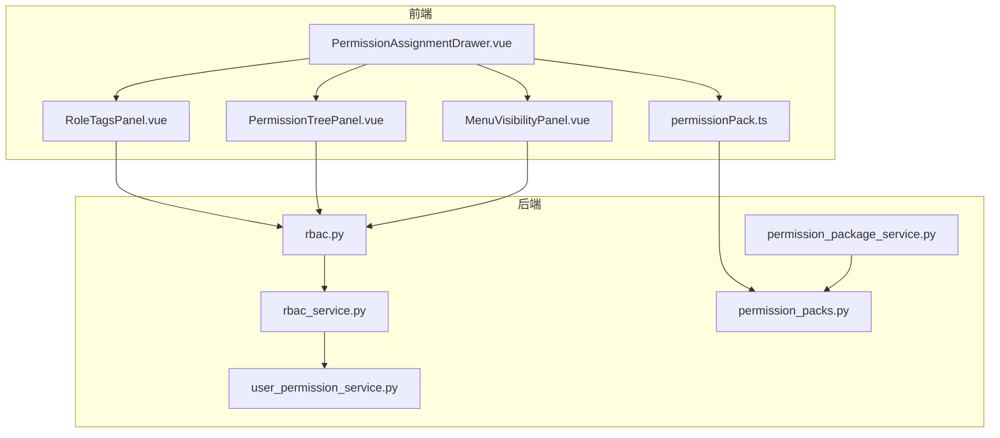
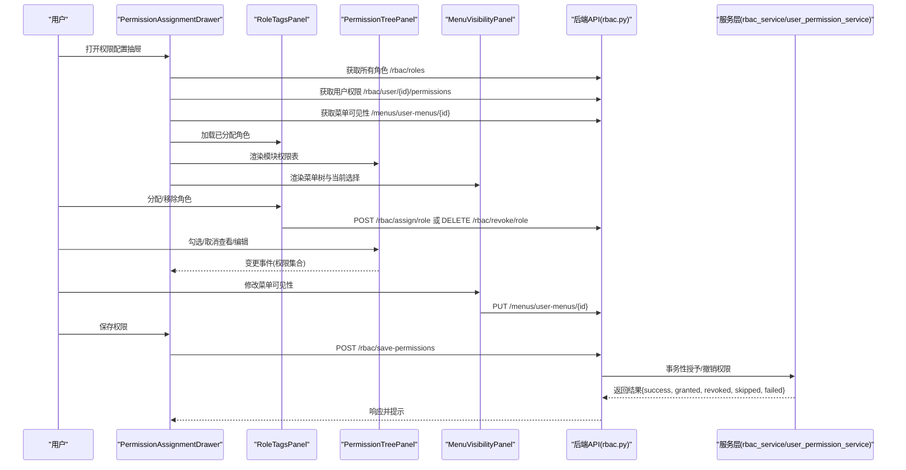
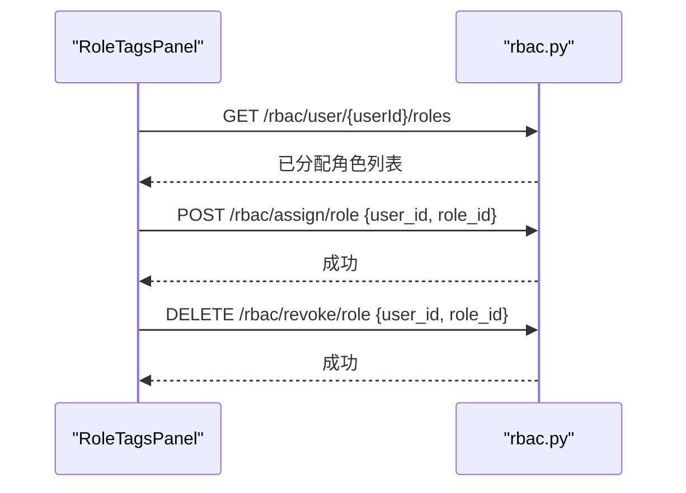
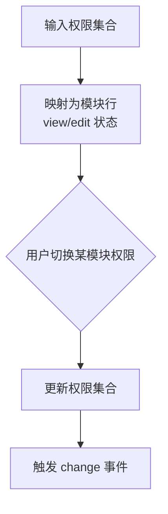
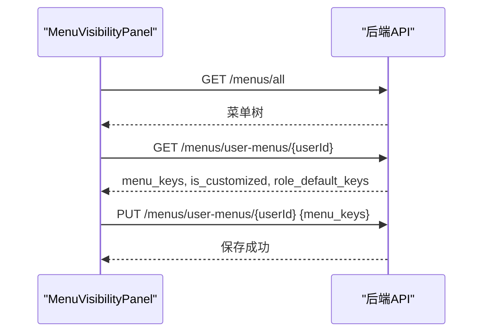
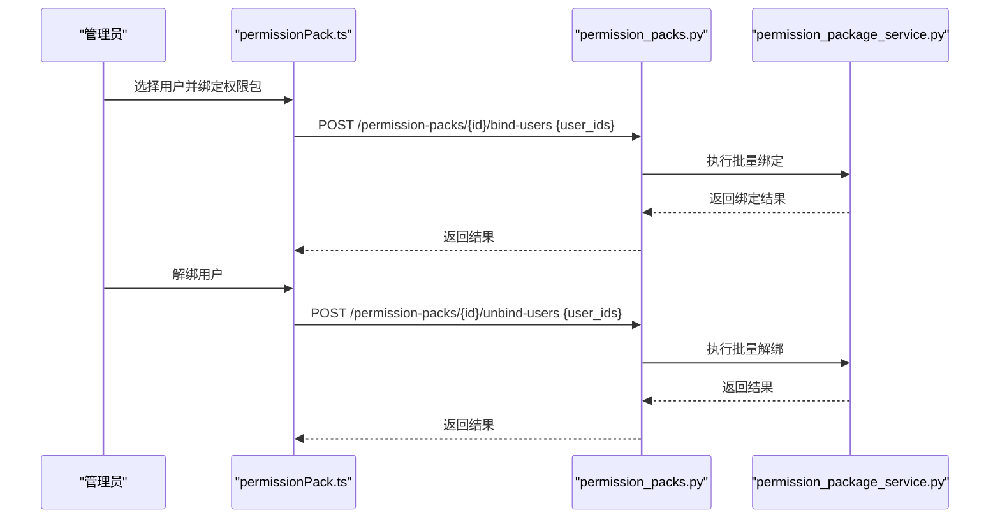
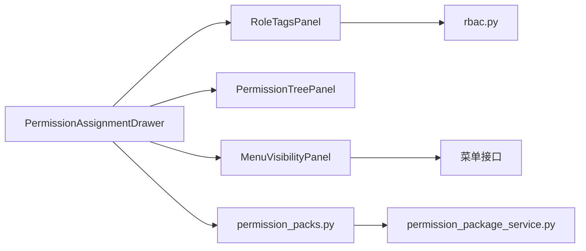

# 权限组件

<cite>
**本文引用的文件**
- [MenuVisibilityPanel.vue](file://frontend/src/components/permission/MenuVisibilityPanel.vue)
- [PermissionAssignmentDrawer.vue](file://frontend/src/components/permission/PermissionAssignmentDrawer.vue)
- [PermissionTreePanel.vue](file://frontend/src/components/permission/PermissionTreePanel.vue)
- [RoleTagsPanel.vue](file://frontend/src/components/permission/RoleTagsPanel.vue)
- [permissionPack.ts](file://frontend/src/api/permissionPack.ts)
- [rbac.py](file://backend/app/api/v1/auth/rbac.py)
- [rbac_service.py](file://backend/app/services/rbac_service.py)
- [user_permission_service.py](file://backend/app/services/user_permission_service.py)
- [permission_package_service.py](file://backend/app/services/permission_package_service.py)
- [permission_packs.py](file://backend/app/api/v1/permission_packs.py)
- [menu_permission_001_add_allowed_menus.py](file://backend/alembic/versions/menu_permission_001_add_allowed_menus.py)
- [perm_pack_001_add_permission_packs.py](file://backend/alembic/versions/perm_pack_001_add_permission_packs.py)
</cite>

## 目录
1. [简介](#简介)
2. [项目结构](#项目结构)
3. [核心组件](#核心组件)
4. [架构总览](#架构总览)
5. [详细组件分析](#详细组件分析)
6. [依赖关系分析](#依赖关系分析)
7. [性能与缓存](#性能与缓存)
8. [故障排查指南](#故障排查指南)
9. [结论](#结论)
10. [附录：集成与扩展](#附录：集成与扩展)

## 简介
本技术文档聚焦于权限管理的前端组件与后端支撑能力，围绕以下目标展开：
- 深入解释 MenuVisibilityPanel、PermissionAssignmentDrawer、PermissionTreePanel、RoleTagsPanel 等权限管理组件的设计与实现。
- 说明权限数据的获取、缓存机制，以及权限树的构建与渲染逻辑。
- 文档化权限分配流程与用户界面交互（包括批量设置）。
- 提供权限组件的集成方法与自定义扩展方案，适配不同权限模型与业务需求。

## 项目结构
前端权限相关组件位于 frontend/src/components/permission，配套视图与 API 分别位于 views/system 与 api。后端 RBAC、菜单可见性与权限包能力由多个服务与接口共同实现。

图表来源
- [PermissionAssignmentDrawer.vue:1-93](file://frontend/src/components/permission/PermissionAssignmentDrawer.vue#L1-L93)
- [RoleTagsPanel.vue:1-49](file://frontend/src/components/permission/RoleTagsPanel.vue#L1-L49)
- [PermissionTreePanel.vue:1-38](file://frontend/src/components/permission/PermissionTreePanel.vue#L1-L38)
- [MenuVisibilityPanel.vue:1-49](file://frontend/src/components/permission/MenuVisibilityPanel.vue#L1-L49)
- [permissionPack.ts:1-92](file://frontend/src/api/permissionPack.ts#L1-L92)
- [rbac.py](file://backend/app/api/v1/auth/rbac.py)
- [rbac_service.py](file://backend/app/services/rbac_service.py)
- [user_permission_service.py](file://backend/app/services/user_permission_service.py)
- [permission_package_service.py](file://backend/app/services/permission_package_service.py)
- [permission_packs.py](file://backend/app/api/v1/permission_packs.py)

章节来源
- [PermissionAssignmentDrawer.vue:1-93](file://frontend/src/components/permission/PermissionAssignmentDrawer.vue#L1-L93)
- [permissionPack.ts:1-92](file://frontend/src/api/permissionPack.ts#L1-L92)

## 核心组件
- PermissionAssignmentDrawer：权限配置抽屉，聚合角色分配、功能模块权限、菜单可见性、遗留系统角色四个 Tab，统一加载与保存。
- RoleTagsPanel：RBAC 角色标签面板，展示已分配角色与可选角色，支持分配与移除。
- PermissionTreePanel：功能模块权限表格，按“查看/编辑”维度维护权限集合。
- MenuVisibilityPanel：菜单可见性面板，基于树形选择配置用户可见菜单，支持恢复角色默认或清空。

章节来源
- [PermissionAssignmentDrawer.vue:10-93](file://frontend/src/components/permission/PermissionAssignmentDrawer.vue#L10-L93)
- [RoleTagsPanel.vue:1-49](file://frontend/src/components/permission/RoleTagsPanel.vue#L1-L49)
- [PermissionTreePanel.vue:1-38](file://frontend/src/components/permission/PermissionTreePanel.vue#L1-L38)
- [MenuVisibilityPanel.vue:1-49](file://frontend/src/components/permission/MenuVisibilityPanel.vue#L1-L49)

## 架构总览
权限体系由三层构成：
- 前端 UI 层：抽屉式入口聚合各子面板，负责数据绑定、交互与调用 API。
- 后端 API 层：暴露 RBAC、菜单可见性、权限包等接口。
- 服务层：封装权限计算、事务性授权、菜单可见性策略与权限包绑定逻辑。

图表来源
- [PermissionAssignmentDrawer.vue:158-250](file://frontend/src/components/permission/PermissionAssignmentDrawer.vue#L158-L250)
- [RoleTagsPanel.vue:87-125](file://frontend/src/components/permission/RoleTagsPanel.vue#L87-L125)
- [MenuVisibilityPanel.vue:97-154](file://frontend/src/components/permission/MenuVisibilityPanel.vue#L97-L154)
- [rbac.py](file://backend/app/api/v1/auth/rbac.py)
- [rbac_service.py](file://backend/app/services/rbac_service.py)
- [user_permission_service.py](file://backend/app/services/user_permission_service.py)

## 详细组件分析

### PermissionAssignmentDrawer（权限配置抽屉）
职责与行为
- 聚合三个主要子面板：角色分配、权限配置、菜单可见性；并提供“系统角色”兼容页签。
- 打开时并行加载：全部角色列表、用户当前权限、用户菜单可见性配置。
- 保存权限时调用原子性接口，后端在单个事务内完成授予与撤销，并返回明细统计用于提示。

关键数据流
- 角色列表：GET /rbac/roles
- 用户权限：GET /rbac/user/{id}/permissions
- 菜单可见性：GET /menus/user-menus/{id}
- 保存权限：POST /rbac/save-permissions

错误处理
- 权限加载失败时禁用保存按钮并提示重试。
- 保存失败时显示后端返回的错误详情。

```mermaid
flowchart TD
Start(["打开抽屉"]) --> LoadRoles["加载角色列表"]
LoadRoles --> LoadPerms["加载用户权限"]
LoadPerms --> LoadMenus["加载菜单可见性"]
LoadMenus --> Render["渲染子面板"]
Render --> UserAction{"用户操作"}
UserAction --> |分配/移除角色| RoleOps["调用角色接口"]
UserAction --> |勾选模块权限| PermChange["更新权限集合"]
UserAction --> |调整菜单可见性| MenuSave["保存菜单可见性"]
UserAction --> |保存权限| SavePerm["提交保存"]
SavePerm --> Result{"是否成功"}
Result --> |是| Success["提示成功并刷新"]
Result --> |否| Error["提示失败"]
```

图表来源
- [PermissionAssignmentDrawer.vue:158-250](file://frontend/src/components/permission/PermissionAssignmentDrawer.vue#L158-L250)

章节来源
- [PermissionAssignmentDrawer.vue:10-93](file://frontend/src/components/permission/PermissionAssignmentDrawer.vue#L10-L93)
- [PermissionAssignmentDrawer.vue:158-250](file://frontend/src/components/permission/PermissionAssignmentDrawer.vue#L158-L250)

### RoleTagsPanel（角色标签面板）
职责与行为
- 展示已分配角色与可选角色，支持通过下拉框分配角色与移除角色。
- 自动过滤不可用或未激活的角色。

交互流程
- 加载已分配角色：GET /rbac/user/{userId}/roles
- 分配角色：POST /rbac/assign/role
- 移除角色：DELETE /rbac/revoke/role

图表来源
- [RoleTagsPanel.vue:87-125](file://frontend/src/components/permission/RoleTagsPanel.vue#L87-L125)
- [rbac.py](file://backend/app/api/v1/auth/rbac.py)

章节来源
- [RoleTagsPanel.vue:1-49](file://frontend/src/components/permission/RoleTagsPanel.vue#L1-L49)
- [RoleTagsPanel.vue:87-125](file://frontend/src/components/permission/RoleTagsPanel.vue#L87-L125)

### PermissionTreePanel（功能模块权限表）
职责与行为
- 以表格形式展示各功能模块的“查看/编辑”权限。
- 将权限集合映射为模块级状态，并在切换时回传新的权限集合。

权限映射规则
- 查看权限对应 module:read
- 编辑权限对应 module:write
- 取消查看时自动取消编辑

图表来源
- [PermissionTreePanel.vue:60-119](file://frontend/src/components/permission/PermissionTreePanel.vue#L60-L119)

章节来源
- [PermissionTreePanel.vue:1-38](file://frontend/src/components/permission/PermissionTreePanel.vue#L1-L38)
- [PermissionTreePanel.vue:60-119](file://frontend/src/components/permission/PermissionTreePanel.vue#L60-L119)

### MenuVisibilityPanel（菜单可见性面板）
职责与行为
- 使用树形控件选择用户可见菜单 key。
- 支持恢复角色默认菜单或清空所有菜单。
- 首次加载优先从后端获取菜单树，若失败则回退到前端静态配置。

数据流
- 加载菜单树：GET /menus/all
- 加载用户菜单配置：GET /menus/user-menus/{userId}
- 保存用户菜单配置：PUT /menus/user-menus/{userId} {menu_keys}

图表来源
- [MenuVisibilityPanel.vue:97-154](file://frontend/src/components/permission/MenuVisibilityPanel.vue#L97-L154)

章节来源
- [MenuVisibilityPanel.vue:1-49](file://frontend/src/components/permission/MenuVisibilityPanel.vue#L1-L49)
- [MenuVisibilityPanel.vue:97-154](file://frontend/src/components/permission/MenuVisibilityPanel.vue#L97-L154)

### 权限包（Permission Packs）
权限包用于将一组菜单 key 打包并批量绑定给普通用户，便于快速配置可见菜单。

前端 API
- 列表、创建、更新、删除、批量绑定/解绑用户。

后端接口与服务
- 路由：/permission-packs/*
- 服务：权限包 CRUD 与用户绑定/解绑逻辑。

图表来源
- [permissionPack.ts:44-91](file://frontend/src/api/permissionPack.ts#L44-L91)
- [permission_packs.py](file://backend/app/api/v1/permission_packs.py)
- [permission_package_service.py](file://backend/app/services/permission_package_service.py)

章节来源
- [permissionPack.ts:1-92](file://frontend/src/api/permissionPack.ts#L1-L92)
- [permission_packs.py](file://backend/app/api/v1/permission_packs.py)
- [permission_package_service.py](file://backend/app/services/permission_package_service.py)

## 依赖关系分析
- PermissionAssignmentDrawer 依赖 RoleTagsPanel、PermissionTreePanel、MenuVisibilityPanel 进行组合渲染与事件汇总。
- RoleTagsPanel 依赖 RBAC 接口进行角色分配与移除。
- PermissionTreePanel 仅依赖本地权限集合与模块定义，无外部依赖。
- MenuVisibilityPanel 依赖菜单树接口与用户菜单配置接口。
- permissionPack.ts 依赖权限包后端接口，服务于批量菜单可见性配置。

图表来源
- [PermissionAssignmentDrawer.vue:10-93](file://frontend/src/components/permission/PermissionAssignmentDrawer.vue#L10-L93)
- [RoleTagsPanel.vue:87-125](file://frontend/src/components/permission/RoleTagsPanel.vue#L87-L125)
- [MenuVisibilityPanel.vue:97-154](file://frontend/src/components/permission/MenuVisibilityPanel.vue#L97-L154)
- [permissionPack.ts:44-91](file://frontend/src/api/permissionPack.ts#L44-L91)
- [permission_packs.py](file://backend/app/api/v1/permission_packs.py)
- [permission_package_service.py](file://backend/app/services/permission_package_service.py)

章节来源
- [PermissionAssignmentDrawer.vue:10-93](file://frontend/src/components/permission/PermissionAssignmentDrawer.vue#L10-L93)
- [permissionPack.ts:44-91](file://frontend/src/api/permissionPack.ts#L44-L91)

## 性能与缓存
- 菜单树加载：优先从后端获取，失败时回退到前端静态配置，避免阻塞 UI。
- 权限数据加载：抽屉打开时并行加载角色、权限与菜单可见性，减少首屏等待时间。
- 权限保存：采用原子性保存接口，后端在事务中完成授予与撤销，降低并发冲突风险。
- 建议缓存策略：
  - 菜单树可短期缓存（如会话级），减少重复请求。
  - 角色列表可缓存较长时间，因为变更频率较低。
  - 用户权限与菜单可见性建议在抽屉关闭后失效，保证一致性。

[本节为通用性能建议，不直接分析具体文件]

## 故障排查指南
常见问题与定位要点
- 权限数据加载失败：检查 /rbac/user/{id}/permissions 接口返回；抽屉会标记失败并禁用保存。
- 菜单树为空：检查 /menus/all 与回退逻辑；确认前端静态配置是否存在。
- 保存权限部分失败：关注后端返回的 failed 列表，定位具体权限项。
- 角色分配失败：检查 /rbac/assign/role 与 /rbac/revoke/role 的入参与权限。
- 权限包绑定失败：确认目标用户角色是否符合要求（普通用户/访客），并检查后端返回信息。

章节来源
- [PermissionAssignmentDrawer.vue:167-179](file://frontend/src/components/permission/PermissionAssignmentDrawer.vue#L167-L179)
- [MenuVisibilityPanel.vue:97-112](file://frontend/src/components/permission/MenuVisibilityPanel.vue#L97-L112)
- [RoleTagsPanel.vue:96-125](file://frontend/src/components/permission/RoleTagsPanel.vue#L96-L125)
- [permissionPack.ts:77-91](file://frontend/src/api/permissionPack.ts#L77-L91)

## 结论
本权限组件体系通过抽屉式入口整合角色、模块权限与菜单可见性，结合后端 RBAC 与权限包能力，形成灵活且可扩展的权限管理方案。前端注重用户体验与容错，后端强调事务一致性与批量处理能力。通过合理的缓存与错误处理，可在复杂业务场景下稳定运行。

[本节为总结性内容，不直接分析具体文件]

## 附录：集成与扩展
集成方法
- 在用户管理页面引入 PermissionAssignmentDrawer，传入用户对象与回调事件。
- 在需要菜单可见性配置的页面引入 MenuVisibilityPanel，绑定用户 ID 与默认菜单键。
- 使用 permissionPack.ts 提供的函数实现权限包的创建、更新与批量绑定/解绑。

扩展方案
- 新增功能模块：在 PermissionTreePanel 的模块定义中添加新模块，确保权限码命名规范（module:read/module:write）。
- 自定义菜单树：替换 MenuVisibilityPanel 的菜单树数据来源，或扩展 label 映射逻辑。
- 扩展权限包：在后端 permission_package_service.py 中增加新的绑定策略或校验规则。
- 适配不同权限模型：通过后端 rbac_service.py 与 user_permission_service.py 扩展权限计算与合并策略。

章节来源
- [PermissionTreePanel.vue:60-72](file://frontend/src/components/permission/PermissionTreePanel.vue#L60-L72)
- [MenuVisibilityPanel.vue:97-112](file://frontend/src/components/permission/MenuVisibilityPanel.vue#L97-L112)
- [permissionPack.ts:44-91](file://frontend/src/api/permissionPack.ts#L44-L91)
- [rbac_service.py](file://backend/app/services/rbac_service.py)
- [user_permission_service.py](file://backend/app/services/user_permission_service.py)
- [permission_package_service.py](file://backend/app/services/permission_package_service.py)