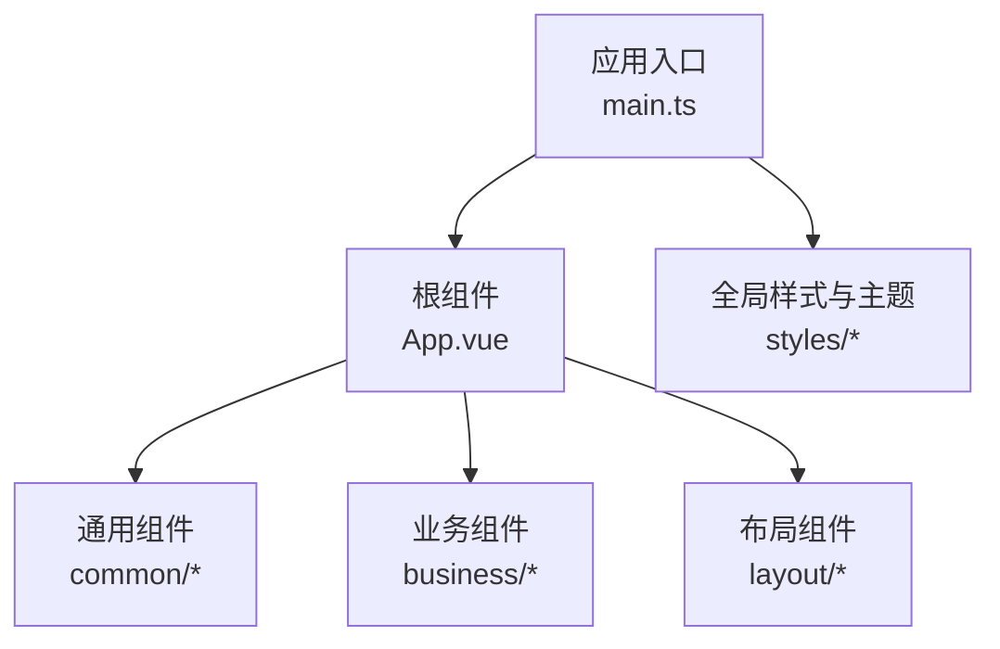
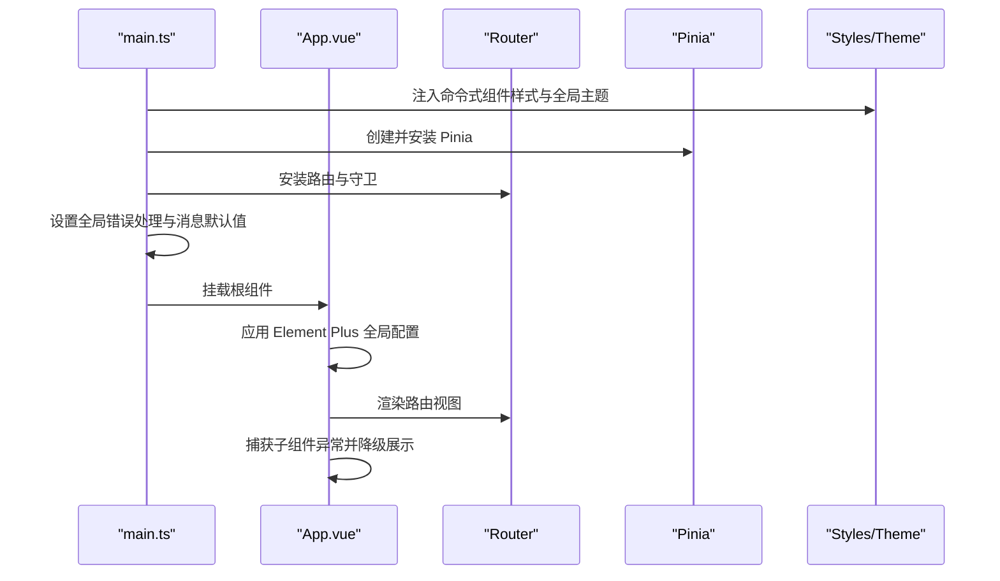
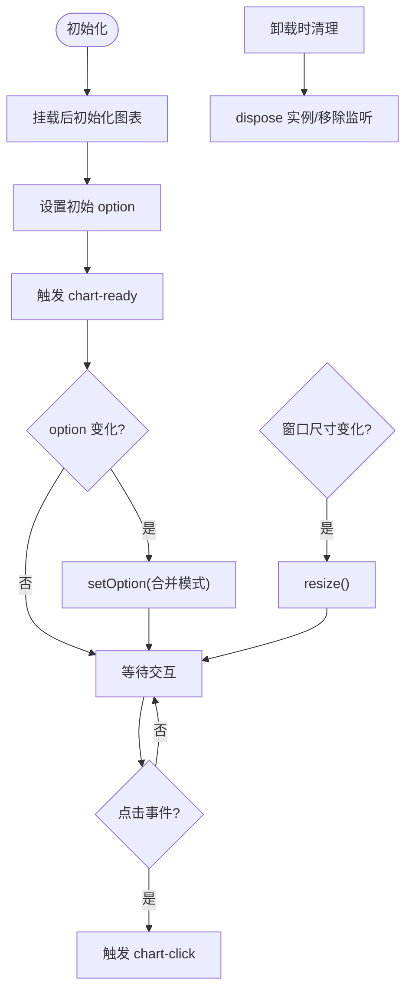
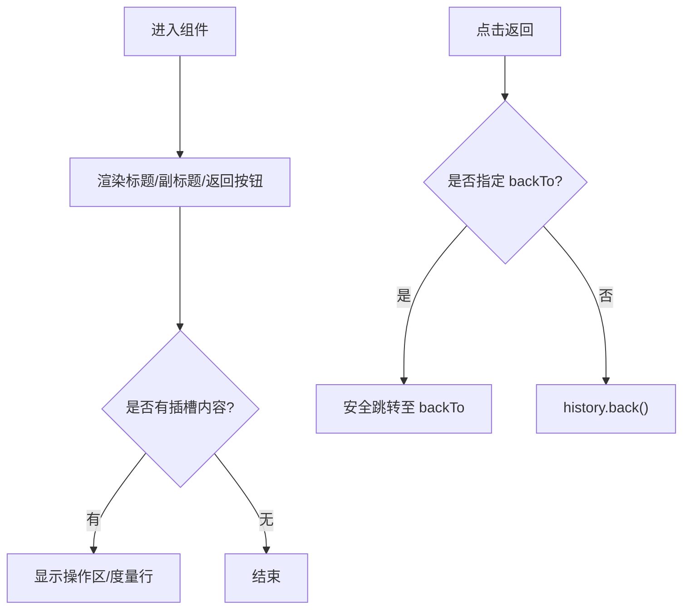
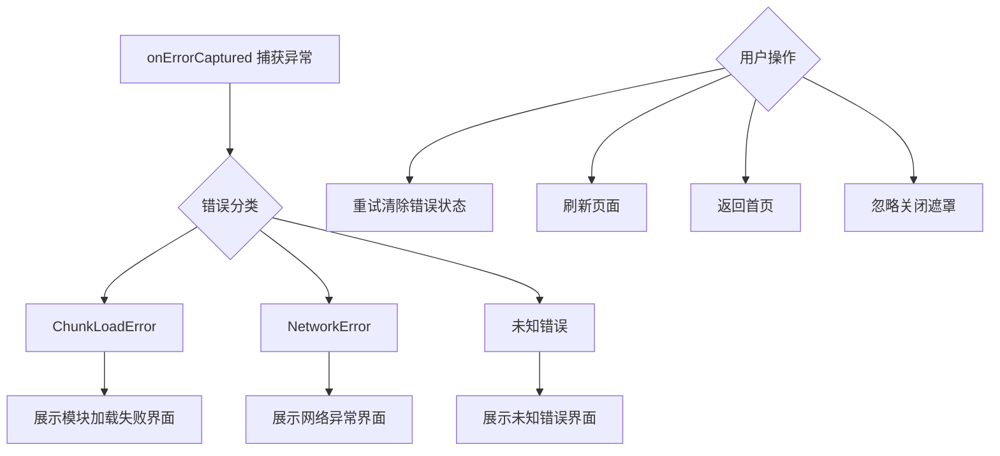
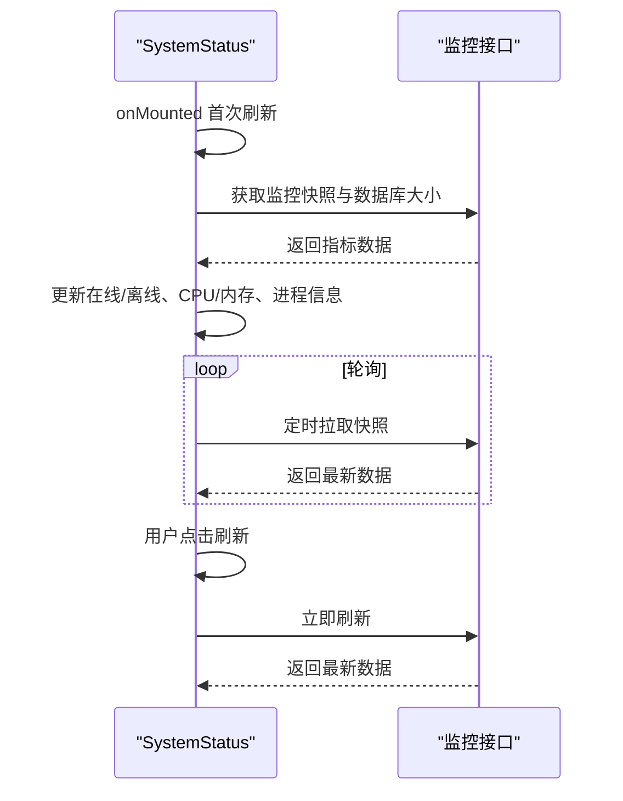
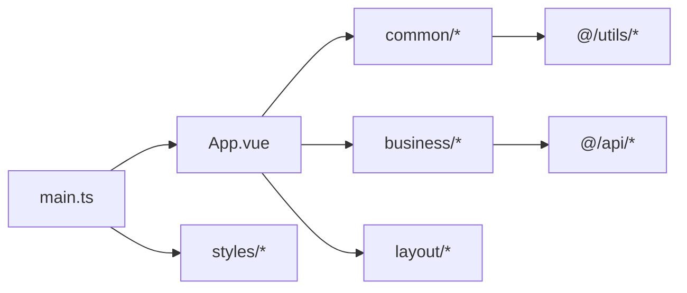

# 组件库

<cite>
**本文引用的文件**
- [frontend/src/main.ts](file://frontend/src/main.ts)
- [frontend/src/App.vue](file://frontend/src/App.vue)
- [frontend/package.json](file://frontend/package.json)
- [frontend/src/components/common/BaseChart.vue](file://frontend/src/components/common/BaseChart.vue)
- [frontend/src/components/common/DataTable.vue](file://frontend/src/components/common/DataTable.vue)
- [frontend/src/components/common/PageHeader.vue](file://frontend/src/components/common/PageHeader.vue)
- [frontend/src/components/common/ErrorBoundary.vue](file://frontend/src/components/common/ErrorBoundary.vue)
- [frontend/src/components/business/FundGuidePopover.vue](file://frontend/src/components/business/FundGuidePopover.vue)
- [frontend/src/components/business/SystemStatus.vue](file://frontend/src/components/business/SystemStatus.vue)
</cite>

## 目录
1. [简介](#简介)
2. [项目结构](#项目结构)
3. [核心组件](#核心组件)
4. [架构总览](#架构总览)
5. [详细组件分析](#详细组件分析)
6. [依赖关系分析](#依赖关系分析)
7. [性能考量](#性能考量)
8. [故障排查指南](#故障排查指南)
9. [结论](#结论)
10. [附录](#附录)

## 简介
本技术文档面向该项目的 Vue3 前端组件库，系统化阐述组件分类（通用组件、业务组件、页面布局组件）、组织方式与职责边界；详细说明各组件的功能特性、使用方法、配置项、API（属性/事件/插槽）、样式定制与主题支持、响应式设计与可访问性支持；并提供组件开发与复用的最佳实践，包括测试与文档生成的建议。

## 项目结构
前端采用模块化目录组织：
- components/common：通用基础组件（图表、表格、页头、错误边界等）
- components/business：面向具体业务的组件（资金引导浮层、系统状态面板）
- components/layout：布局相关组件（如移动端底部导航）
- styles：全局样式、主题变量、打印与无障碍增强样式
- main.ts：应用入口，统一注入命令式组件样式、全局主题与应用级指令
- App.vue：根组件，提供 Element Plus 全局配置与全局错误边界

图示来源
- [frontend/src/main.ts:1-69](file://frontend/src/main.ts#L1-L69)
- [frontend/src/App.vue:1-109](file://frontend/src/App.vue#L1-L109)

章节来源
- [frontend/src/main.ts:1-69](file://frontend/src/main.ts#L1-L69)
- [frontend/src/App.vue:1-109](file://frontend/src/App.vue#L1-L109)

## 核心组件
本节概述通用与业务组件的职责与使用要点，后续章节将给出更细粒度的 API 与交互流程。

- BaseChart：基于 ECharts 的图表封装，支持主题、尺寸、自动缩放、事件透传与实例暴露。
- DataTable：轻量表格封装，通过列配置驱动渲染，支持加载态。
- PageHeader：标准页头骨架，包含标题、副标题、返回按钮、操作区与度量行插槽。
- ErrorBoundary：组件级错误边界，区分 chunk/network/unknown 错误类型，提供重试、刷新、返回首页等操作。
- FundGuidePopover：资金操作指引浮层，展示前置条件、后续影响与下一步。
- SystemStatus：系统状态面板，轮询后端监控指标，展示在线状态、同步时间、数据库大小、CPU/内存占用与进程信息。

章节来源
- [frontend/src/components/common/BaseChart.vue:1-89](file://frontend/src/components/common/BaseChart.vue#L1-L89)
- [frontend/src/components/common/DataTable.vue:1-20](file://frontend/src/components/common/DataTable.vue#L1-L20)
- [frontend/src/components/common/PageHeader.vue:1-116](file://frontend/src/components/common/PageHeader.vue#L1-L116)
- [frontend/src/components/common/ErrorBoundary.vue:1-194](file://frontend/src/components/common/ErrorBoundary.vue#L1-L194)
- [frontend/src/components/business/FundGuidePopover.vue:1-55](file://frontend/src/components/business/FundGuidePopover.vue#L1-L55)
- [frontend/src/components/business/SystemStatus.vue:1-418](file://frontend/src/components/business/SystemStatus.vue#L1-L418)

## 架构总览
应用启动时，main.ts 完成以下关键初始化：
- 按需自动导入 Element Plus 组件并显式注入命令式组件样式（消息、对话框、通知）
- 注册全局指令（权限指令、水印指令）
- 挂载 Pinia 与 Router
- 安装全局错误处理
- 设置 ElMessage 默认行为（关闭按钮、时长、分组去重）
- 在挂载前应用已记忆的主题，避免首屏闪烁

根组件 App.vue 提供：
- Element Plus 全局配置（语言、尺寸）
- 路由容器与全局错误边界
- 版本检查与错误恢复逻辑

图示来源
- [frontend/src/main.ts:1-69](file://frontend/src/main.ts#L1-L69)
- [frontend/src/App.vue:1-109](file://frontend/src/App.vue#L1-L109)

章节来源
- [frontend/src/main.ts:1-69](file://frontend/src/main.ts#L1-L69)
- [frontend/src/App.vue:1-109](file://frontend/src/App.vue#L1-L109)

## 详细组件分析

### BaseChart（图表基座）
- 功能特性
  - 基于 ECharts 封装，支持传入 option、主题、宽高、是否自动监听窗口 resize
  - 监听 option 变化并更新图表
  - 暴露 chart-ready 与 chart-click 事件
  - 暴露 getChart、resize 方法供父组件调用
- 使用方式
  - 在模板中引入并传入 option 与尺寸
  - 通过事件回调处理点击交互
  - 通过 ref 获取实例进行高级控制
- 配置选项
  - option：ECharts 配置对象
  - width/height：图表容器尺寸
  - theme：主题名称或主题对象
  - autoResize：是否自动监听窗口尺寸变化
- 事件
  - chart-ready：图表实例就绪时触发
  - chart-click：点击数据点时触发
- 插槽机制
  - 无插槽
- 样式与主题
  - 通过 theme 参数接入主题
  - 容器最小高度保障视觉稳定性
- 可访问性与响应式
  - 通过 autoResize 适配不同屏幕
  - 建议在 option 中为交互元素添加 aria 语义（由上层负责）

图示来源
- [frontend/src/components/common/BaseChart.vue:1-89](file://frontend/src/components/common/BaseChart.vue#L1-L89)

章节来源
- [frontend/src/components/common/BaseChart.vue:1-89](file://frontend/src/components/common/BaseChart.vue#L1-L89)

### DataTable（数据表格）
- 功能特性
  - 基于 el-table 的轻量封装，通过 columns 配置动态生成列
  - 支持 loading 态
- 使用方式
  - 传入 data 与 columns 数组即可渲染
- 配置选项
  - data：表格数据数组
  - columns：列定义数组，每项包含 key、label、可选 width
  - loading：是否显示加载态
- 事件与插槽
  - 未暴露自定义事件
  - 未暴露插槽（如需扩展可在上层包裹）
- 样式与主题
  - 继承 Element Plus 表格主题
- 可访问性与响应式
  - 可通过外层容器实现响应式宽度
  - 建议在列定义中为复杂内容补充 a11y 语义

章节来源
- [frontend/src/components/common/DataTable.vue:1-20](file://frontend/src/components/common/DataTable.vue#L1-L20)

### PageHeader（页头骨架）
- 功能特性
  - 统一的页面头部结构：标题、副标题、返回按钮、操作区、度量行
  - 返回逻辑支持指定路由或回退历史
- 使用方式
  - 传入 title，可选 subtitle、showBack、backTo
  - 通过 default/extra 插槽放置右侧操作
  - 通过 metrics 插槽放置度量信息
- 配置选项
  - title：必填，页面主标题
  - subtitle：可选，副标题
  - showBack：可选，是否显示返回按钮
  - backTo：可选，返回目标路由
- 事件
  - 未暴露自定义事件（内部处理返回逻辑）
- 插槽机制
  - default/extra：右侧操作区
  - metrics：度量行
- 样式与主题
  - 使用 CSS 变量与间距体系，保持 UI 一致性
- 可访问性与响应式
  - 返回按钮提供 aria-label
  - 布局采用弹性盒，适配多行与窄屏

图示来源
- [frontend/src/components/common/PageHeader.vue:1-116](file://frontend/src/components/common/PageHeader.vue#L1-L116)

章节来源
- [frontend/src/components/common/PageHeader.vue:1-116](file://frontend/src/components/common/PageHeader.vue#L1-L116)

### ErrorBoundary（错误边界）
- 功能特性
  - 捕获子组件未处理异常，区分 chunk/network/unknown 三类错误
  - 提供重试、刷新、返回首页、忽略等用户操作
  - 支持展开错误堆栈便于调试
- 使用方式
  - 作为组件包装器使用，包裹可能出现异常的子树
- 配置选项
  - 无 props（内部状态管理）
- 事件
  - 无对外事件
- 插槽机制
  - 默认插槽：正常渲染的子组件
- 样式与主题
  - 使用 Element Plus Result 组件与 CSS 变量
- 可访问性与响应式
  - 错误提示具备明确标题与操作按钮
  - 堆栈区域支持横向滚动

图示来源
- [frontend/src/components/common/ErrorBoundary.vue:1-194](file://frontend/src/components/common/ErrorBoundary.vue#L1-L194)

章节来源
- [frontend/src/components/common/ErrorBoundary.vue:1-194](file://frontend/src/components/common/ErrorBoundary.vue#L1-L194)

### FundGuidePopover（资金引导浮层）
- 功能特性
  - 悬浮提示框，展示操作的前置条件、后续影响与下一步
- 使用方式
  - 传入 title、precondition、impact、nextStep
- 配置选项
  - 以上四个文本字段
- 事件与插槽
  - 无事件与插槽
- 样式与主题
  - 使用 Element Plus Popover 与图标
- 可访问性与响应式
  - 图标提供 aria-label，提升读屏体验

章节来源
- [frontend/src/components/business/FundGuidePopover.vue:1-55](file://frontend/src/components/business/FundGuidePopover.vue#L1-L55)

### SystemStatus（系统状态面板）
- 功能特性
  - 轮询后端监控接口，展示在线状态、上次同步时间、数据库大小、CPU/内存占用、进程信息与线程数
  - 支持手动刷新与自动轮询
- 使用方式
  - 传入 pollInterval（毫秒）与 showRefresh（是否显示刷新按钮）
- 配置选项
  - pollInterval：轮询间隔，设为 0 禁用轮询
  - showRefresh：是否显示刷新按钮
- 事件
  - 无对外事件
- 插槽机制
  - 无插槽
- 样式与主题
  - 使用 CSS 变量与渐变进度条，支持警告/危险阈值高亮
  - 响应式适配窄屏
- 可访问性与响应式
  - 状态项提供 title 提示
  - 进度条与指示灯具备视觉差异

图示来源
- [frontend/src/components/business/SystemStatus.vue:1-418](file://frontend/src/components/business/SystemStatus.vue#L1-L418)

章节来源
- [frontend/src/components/business/SystemStatus.vue:1-418](file://frontend/src/components/business/SystemStatus.vue#L1-L418)

## 依赖关系分析
- 运行时依赖
  - Vue 3、Element Plus、Pinia、Vue Router、ECharts、Day.js、Axios 等
- 构建与工具
  - Vite、TypeScript、Vitest、ESLint、Prettier、unplugin-vue-components（按需自动导入）
- 组件间依赖
  - App.vue 依赖 Element Plus 全局配置与路由
  - main.ts 依赖 Pinia、Router、全局样式与指令
  - 业务组件依赖 API 模块与日志工具

图示来源
- [frontend/package.json:1-73](file://frontend/package.json#L1-L73)
- [frontend/src/main.ts:1-69](file://frontend/src/main.ts#L1-L69)
- [frontend/src/App.vue:1-109](file://frontend/src/App.vue#L1-L109)

章节来源
- [frontend/package.json:1-73](file://frontend/package.json#L1-L73)
- [frontend/src/main.ts:1-69](file://frontend/src/main.ts#L1-L69)
- [frontend/src/App.vue:1-109](file://frontend/src/App.vue#L1-L109)

## 性能考量
- 图表性能
  - BaseChart 仅在 option 变化时增量更新，避免全量重绘
  - 自动 resize 监听在组件卸载时移除，防止内存泄漏
- 列表与表格
  - DataTable 为轻量封装，大数据场景建议在上层使用虚拟滚动或分页
- 轮询与资源
  - SystemStatus 支持关闭轮询与手动刷新，避免不必要的请求
  - 注意在长生命周期页面中合理设置轮询间隔
- 构建优化
  - 使用 unplugin-vue-components 按需导入 Element Plus，减少包体积
  - 启用压缩与代码分割（Vite 默认策略）

[本节为通用指导，不直接分析具体文件]

## 故障排查指南
- 常见错误类型与处理
  - chunk 加载失败：提示模块加载失败，支持重试与刷新
  - 网络异常：提示网络连接异常，支持刷新与返回首页
  - 未知错误：展示错误堆栈，便于定位问题
- 全局错误处理
  - main.ts 安装全局错误处理器，统一捕获 window.onerror 与 unhandledrejection
  - App.vue 使用 onErrorCaptured 捕获子组件异常，避免白屏
- 调试建议
  - 打开 ErrorBoundary 的错误详情查看堆栈
  - 结合浏览器控制台与网络面板定位接口与资源加载问题

章节来源
- [frontend/src/components/common/ErrorBoundary.vue:1-194](file://frontend/src/components/common/ErrorBoundary.vue#L1-L194)
- [frontend/src/main.ts:1-69](file://frontend/src/main.ts#L1-L69)
- [frontend/src/App.vue:1-109](file://frontend/src/App.vue#L1-L109)

## 结论
本组件库以通用组件为基础、业务组件为扩展、布局组件为支撑，形成清晰的分层与复用体系。通过统一的入口初始化、全局错误边界与主题样式体系，保障了应用的稳定性与一致性。BaseChart、PageHeader、ErrorBoundary 等通用组件提供了稳定的能力基座；FundGuidePopover、SystemStatus 等业务组件贴合实际场景，具备良好的可配置性与可维护性。建议在实际项目中遵循本文档的 API 约定与最佳实践，持续提升组件质量与开发效率。

[本节为总结性内容，不直接分析具体文件]

## 附录
- 组件开发与复用最佳实践
  - 明确 Props/Emits/Slots 契约，保持向后兼容
  - 优先使用 Composition API 与 TypeScript 类型约束
  - 对复杂交互进行单元测试，对 UI 进行视觉回归测试
  - 使用 Storybook 或自研文档站点生成组件文档
- 测试与文档生成
  - 使用 Vitest 进行单元与集成测试
  - 使用 ESLint/Prettier 保证代码风格一致
  - 利用 unplugin-vue-components 自动生成类型声明，提升 IDE 体验
- 样式定制与主题支持
  - 通过 CSS 变量与主题文件集中管理颜色、字号、间距
  - 使用 Element Plus ConfigProvider 统一全局尺寸与语言
- 响应式设计与可访问性
  - 使用弹性布局与媒体查询适配多端
  - 为关键交互元素提供 aria-* 属性与键盘可达性

[本节为通用指导，不直接分析具体文件]