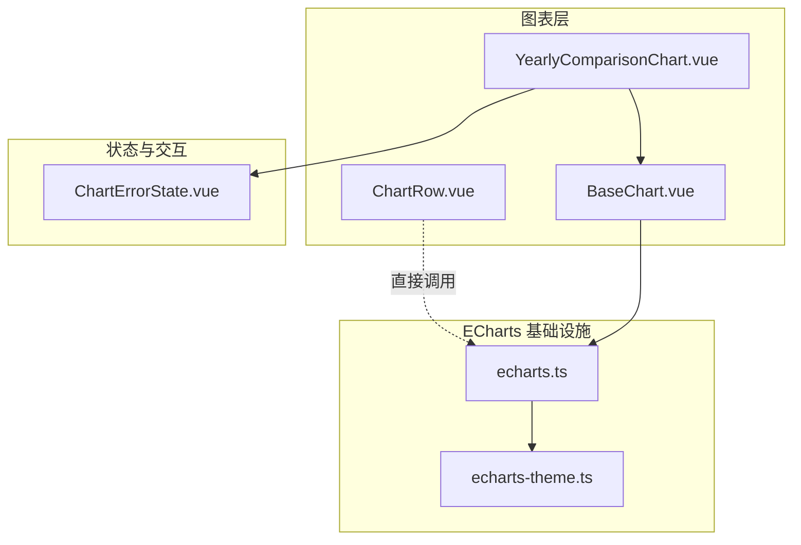
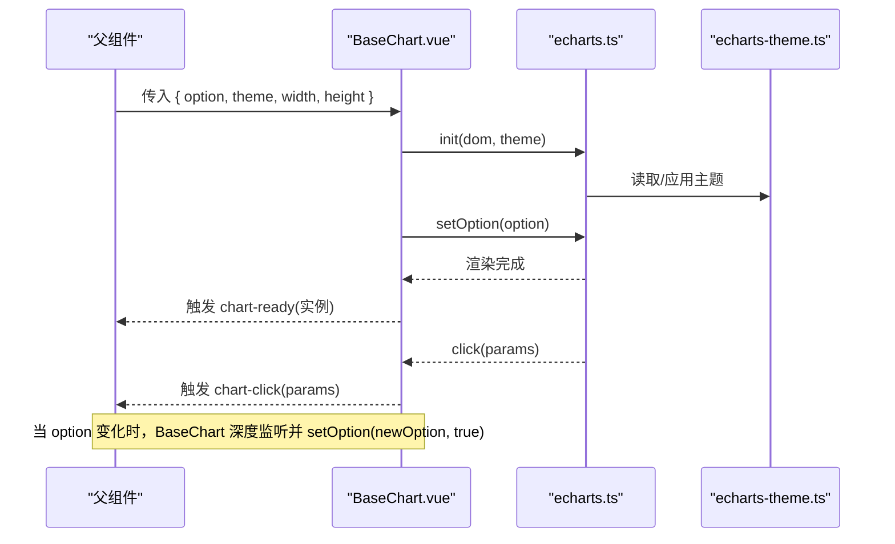
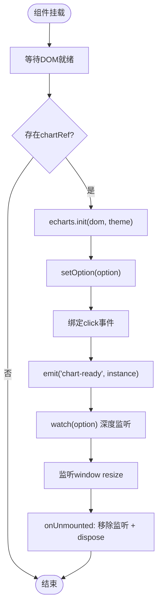
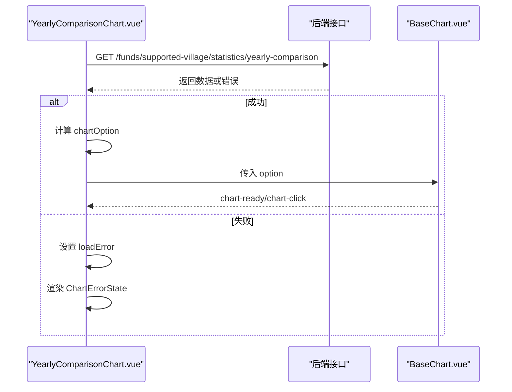
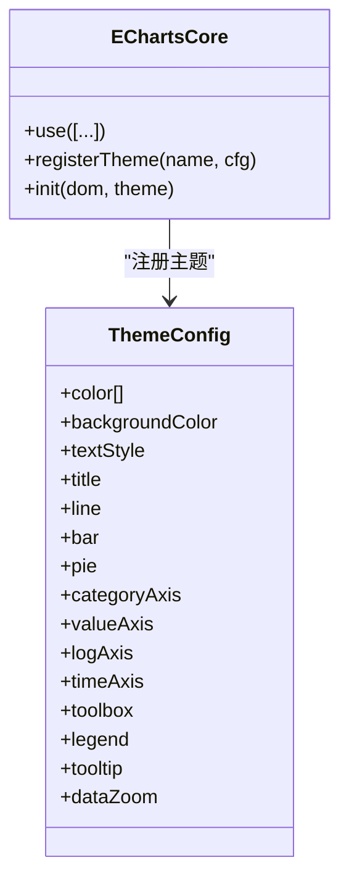
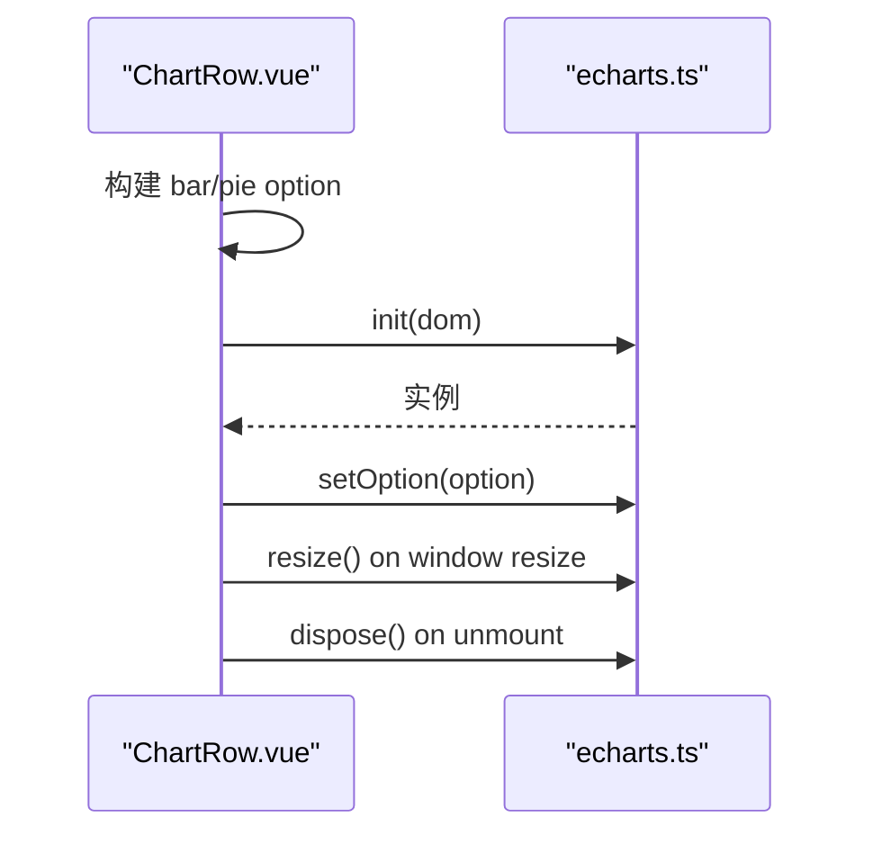
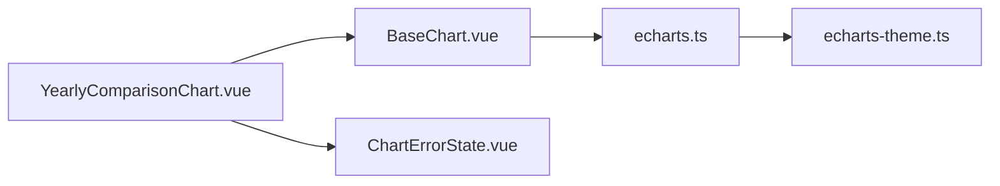

# BaseChart组件

<cite>
**本文引用的文件**
- [BaseChart.vue](file://frontend/src/components/common/BaseChart.vue)
- [echarts.ts](file://frontend/src/utils/echarts.ts)
- [echarts-theme.ts](file://frontend/src/utils/echarts-theme.ts)
- [YearlyComparisonChart.vue](file://frontend/src/components/funds/YearlyComparisonChart.vue)
- [ChartErrorState.vue](file://frontend/src/components/common/ChartErrorState.vue)
- [ChartRow.vue](file://frontend/src/views/dashboard/ChartRow.vue)
- [BaseChart.test.ts](file://frontend/tests/unit/components/common/BaseChart.test.ts)
</cite>

## 目录
1. [简介](#简介)
2. [项目结构](#项目结构)
3. [核心组件](#核心组件)
4. [架构总览](#架构总览)
5. [详细组件分析](#详细组件分析)
6. [依赖关系分析](#依赖关系分析)
7. [性能与优化](#性能与优化)
8. [故障排查指南](#故障排查指南)
9. [结论](#结论)
10. [附录：API与使用示例](#附录api与使用示例)

## 简介
BaseChart 是一个基于 ECharts 的通用图表封装组件，提供统一的初始化、数据绑定、主题切换、响应式尺寸调整、事件透传与生命周期管理。它通过最小化 API（传入 option、可选主题与尺寸）即可渲染任意 ECharts 支持的图表类型，并在组件卸载时自动释放资源，避免内存泄漏。配合业务侧的数据加载与错误态组件，可快速构建稳定、可维护的可视化页面。

## 项目结构
围绕 BaseChart 的关键文件与职责如下：
- 基础图表组件：负责实例化、配置更新、事件转发、尺寸自适应与销毁
- ECharts 按需注册与主题：统一注册图表类型、组件与渲染器，并注册品牌主题
- 业务图表组合：以 BaseChart 为底座，组合数据获取、空态与错误态展示
- 错误态组件：在图表区域就地展示错误信息与重试入口
- 页面级图表示例：展示不依赖 BaseChart 的直接用法，便于对比

图示来源
- [BaseChart.vue:1-89](file://frontend/src/components/common/BaseChart.vue#L1-L89)
- [echarts.ts:1-37](file://frontend/src/utils/echarts.ts#L1-L37)
- [echarts-theme.ts:1-474](file://frontend/src/utils/echarts-theme.ts#L1-L474)
- [YearlyComparisonChart.vue:1-79](file://frontend/src/components/funds/YearlyComparisonChart.vue#L1-L79)
- [ChartErrorState.vue:1-54](file://frontend/src/components/common/ChartErrorState.vue#L1-L54)
- [ChartRow.vue:1-268](file://frontend/src/views/dashboard/ChartRow.vue#L1-L268)

章节来源
- [BaseChart.vue:1-89](file://frontend/src/components/common/BaseChart.vue#L1-L89)
- [echarts.ts:1-37](file://frontend/src/utils/echarts.ts#L1-L37)
- [echarts-theme.ts:1-474](file://frontend/src/utils/echarts-theme.ts#L1-L474)
- [YearlyComparisonChart.vue:1-79](file://frontend/src/components/funds/YearlyComparisonChart.vue#L1-L79)
- [ChartErrorState.vue:1-54](file://frontend/src/components/common/ChartErrorState.vue#L1-L54)
- [ChartRow.vue:1-268](file://frontend/src/views/dashboard/ChartRow.vue#L1-L268)

## 核心组件
- BaseChart：封装 ECharts 实例生命周期、option 深度监听更新、点击事件透传、窗口 resize 自适应、主题与尺寸控制、暴露 getChart/resize 方法
- YearlyComparisonChart：演示如何拉取数据、构造 option、使用 BaseChart 渲染柱状图，并结合 ChartErrorState 处理错误态
- ChartErrorState：内联错误提示与重试按钮，提升用户体验
- echarts.ts：按需引入图表、组件与渲染器，减少打包体积；注册科技风主题
- echarts-theme.ts：定义浅色/暗色主题与品牌色系，支持按 DOM 属性自动选择主题

章节来源
- [BaseChart.vue:1-89](file://frontend/src/components/common/BaseChart.vue#L1-L89)
- [YearlyComparisonChart.vue:1-79](file://frontend/src/components/funds/YearlyComparisonChart.vue#L1-L79)
- [ChartErrorState.vue:1-54](file://frontend/src/components/common/ChartErrorState.vue#L1-L54)
- [echarts.ts:1-37](file://frontend/src/utils/echarts.ts#L1-L37)
- [echarts-theme.ts:1-474](file://frontend/src/utils/echarts-theme.ts#L1-L474)

## 架构总览
BaseChart 作为“视图层”的图表容器，向上暴露简洁的 props 与事件，向下委托给 ECharts。业务组件负责数据准备与错误态，从而形成清晰的分层：数据层 → 选项生成 → 图表渲染 → 事件回传。

图示来源
- [BaseChart.vue:32-57](file://frontend/src/components/common/BaseChart.vue#L32-L57)
- [echarts.ts:15-30](file://frontend/src/utils/echarts.ts#L15-L30)
- [echarts-theme.ts:443-464](file://frontend/src/utils/echarts-theme.ts#L443-L464)

## 详细组件分析

### BaseChart 组件
- 设计要点
  - 通过 ref 获取挂载节点，在 nextTick 后初始化 ECharts 实例
  - 使用 watch 深度监听 option，实现数据驱动更新
  - 监听 window resize 并调用 resize，支持 autoResize 开关
  - 将 ECharts 的 click 事件映射为自定义事件 chart-click
  - 组件卸载时移除事件监听并 dispose 实例，防止内存泄漏
  - 暴露 getChart 与 resize 方法，便于外部高级操作

- 关键流程
  - 初始化：init → setOption → 注册 click → 发射 chart-ready
  - 更新：watch(option) → setOption(newOption, true)
  - 响应式：window resize → resize()
  - 销毁：removeEventListener → dispose → 置空实例

图示来源
- [BaseChart.vue:32-76](file://frontend/src/components/common/BaseChart.vue#L32-L76)

章节来源
- [BaseChart.vue:1-89](file://frontend/src/components/common/BaseChart.vue#L1-L89)

### YearlyComparisonChart 组件
- 职责：拉取年度经费数据，构造 ECharts option，使用 BaseChart 渲染柱状图；处理空态与错误态
- 数据兼容：支持信封格式、裸数组、无 data 字段等历史形态
- 错误态：失败时显示 ChartErrorState，并提供重试

图示来源
- [YearlyComparisonChart.vue:28-77](file://frontend/src/components/funds/YearlyComparisonChart.vue#L28-L77)
- [ChartErrorState.vue:10-40](file://frontend/src/components/common/ChartErrorState.vue#L10-L40)

章节来源
- [YearlyComparisonChart.vue:1-79](file://frontend/src/components/funds/YearlyComparisonChart.vue#L1-L79)
- [ChartErrorState.vue:1-54](file://frontend/src/components/common/ChartErrorState.vue#L1-L54)

### 主题与按需注册
- 按需注册：仅引入需要的图表、组件与渲染器，降低包体
- 主题注册：注册浅色与暗色主题，支持根据 DOM 属性自动选择
- 使用方式：在 BaseChart 中通过 theme 参数传入主题名

图示来源
- [echarts.ts:1-37](file://frontend/src/utils/echarts.ts#L1-L37)
- [echarts-theme.ts:49-160](file://frontend/src/utils/echarts-theme.ts#L49-L160)
- [echarts-theme.ts:443-464](file://frontend/src/utils/echarts-theme.ts#L443-L464)

章节来源
- [echarts.ts:1-37](file://frontend/src/utils/echarts.ts#L1-L37)
- [echarts-theme.ts:1-474](file://frontend/src/utils/echarts-theme.ts#L1-L474)

### 页面级直连 ECharts 示例（对比）
ChartRow 展示了不依赖 BaseChart 的直接用法，包括手动创建实例、构建 option、监听 resize 与销毁，便于理解 BaseChart 抽象的价值。

图示来源
- [ChartRow.vue:82-181](file://frontend/src/views/dashboard/ChartRow.vue#L82-L181)
- [ChartRow.vue:189-203](file://frontend/src/views/dashboard/ChartRow.vue#L189-L203)

章节来源
- [ChartRow.vue:1-268](file://frontend/src/views/dashboard/ChartRow.vue#L1-L268)

## 依赖关系分析
- BaseChart 依赖 echarts.ts 提供的按需实例与主题能力
- YearlyComparisonChart 依赖 BaseChart 与 ChartErrorState，形成“数据→选项→渲染→错误态”的链路
- 主题由 echarts-theme.ts 集中管理，确保视觉一致性

图示来源
- [YearlyComparisonChart.vue:1-79](file://frontend/src/components/funds/YearlyComparisonChart.vue#L1-L79)
- [BaseChart.vue:1-89](file://frontend/src/components/common/BaseChart.vue#L1-L89)
- [echarts.ts:1-37](file://frontend/src/utils/echarts.ts#L1-L37)
- [echarts-theme.ts:1-474](file://frontend/src/utils/echarts-theme.ts#L1-L474)
- [ChartErrorState.vue:1-54](file://frontend/src/components/common/ChartErrorState.vue#L1-L54)

章节来源
- [BaseChart.vue:1-89](file://frontend/src/components/common/BaseChart.vue#L1-L89)
- [YearlyComparisonChart.vue:1-79](file://frontend/src/components/funds/YearlyComparisonChart.vue#L1-L79)
- [echarts.ts:1-37](file://frontend/src/utils/echarts.ts#L1-L37)
- [echarts-theme.ts:1-474](file://frontend/src/utils/echarts-theme.ts#L1-L474)
- [ChartErrorState.vue:1-54](file://frontend/src/components/common/ChartErrorState.vue#L1-L54)

## 性能与优化
- 按需注册：仅引入所需图表与组件，显著减小包体，提高首屏加载速度
- 深度监听 option：使用 deep watch 保证复杂对象变更也能触发重绘，但应避免频繁大对象重建
- 响应式 resize：仅在需要时启用 autoResize，避免不必要的计算
- 资源释放：组件卸载时 dispose 实例并移除事件监听，防止内存泄漏
- 大数据量建议
  - 分页/采样：对超长序列进行采样或分页展示
  - 数据压缩：使用 data 的简写形式或缓存中间结果
  - 动画降级：大数据场景关闭或缩短动画时长
  - 增量更新：优先使用 setOption 合并模式（true），减少全量重绘
  - 虚拟滚动/缩放：结合 dataZoom 与懒加载策略

[本节为通用指导，无需特定文件引用]

## 故障排查指南
- 图表未渲染
  - 检查 chartRef 是否存在且可见（宽度/高度非零）
  - 确认 option 已正确传入且包含必要字段（如 series）
- 数据更新无效
  - 确认 watch 是否被触发（对象变更需深比较）
  - 检查 setOption 是否传入合并标志以避免覆盖
- 事件未触发
  - 确认 ECharts 事件名称与映射是否正确
  - 检查是否在正确的实例上绑定事件
- 内存增长/卡顿
  - 确认组件卸载时是否 dispose 实例
  - 检查是否重复创建实例而未销毁旧实例
- 主题不生效
  - 确认主题已注册且传入正确的主题名
  - 检查全局样式变量是否与主题一致

章节来源
- [BaseChart.vue:32-76](file://frontend/src/components/common/BaseChart.vue#L32-L76)
- [BaseChart.test.ts:31-119](file://frontend/tests/unit/components/common/BaseChart.test.ts#L31-L119)

## 结论
BaseChart 以极简 API 封装了 ECharts 的核心能力，提供稳定的生命周期管理、响应式更新与事件透传，配合统一的主题与按需注册机制，能够高效支撑多种图表类型的开发与维护。业务组件只需关注数据与选项，即可获得一致的可视化体验与良好的性能表现。

[本节为总结性内容，无需特定文件引用]

## 附录：API与使用示例

### BaseChart Props
- option：ECharts 配置对象（必填）
- width：容器宽度（默认 100%）
- height：容器高度（默认 400px）
- theme：主题名（默认空字符串，表示使用默认主题）
- autoResize：是否监听窗口 resize（默认 true）

章节来源
- [BaseChart.vue:9-22](file://frontend/src/components/common/BaseChart.vue#L9-L22)

### BaseChart Events
- chart-ready：图表实例就绪回调，参数为 ECharts 实例
- chart-click：点击事件透传，参数为 ECharts 点击事件参数

章节来源
- [BaseChart.vue:24-27](file://frontend/src/components/common/BaseChart.vue#L24-L27)
- [BaseChart.vue:38-42](file://frontend/src/components/common/BaseChart.vue#L38-L42)

### BaseChart 暴露的方法
- getChart：获取当前 ECharts 实例
- resize：手动触发图表尺寸更新

章节来源
- [BaseChart.vue:78-81](file://frontend/src/components/common/BaseChart.vue#L78-L81)

### 主题与类型支持
- 主题
  - 浅色：militaryTech
  - 暗色：militaryTechDark
  - 自动选择：根据 document.documentElement 的 data-theme 属性决定
- 图表类型（按需注册）
  - 折线图、柱状图、饼图、散点图、雷达图、地图
- 组件（按需注册）
  - 标题、提示框、图例、网格、数据缩放、工具箱、地理组件
- 渲染器
  - CanvasRenderer

章节来源
- [echarts.ts:1-37](file://frontend/src/utils/echarts.ts#L1-L37)
- [echarts-theme.ts:443-464](file://frontend/src/utils/echarts-theme.ts#L443-L464)

### 使用示例（步骤说明）
- 创建柱状图（年度对比）
  - 在父组件中请求数据，构造 xAxis.data 与 series[].data
  - 将 option 传入 BaseChart，设置高度与主题
  - 监听 chart-ready 获取实例，必要时执行高级操作
  - 监听 chart-click 处理用户交互
- 处理错误与空态
  - 数据为空时展示空态
  - 请求失败时展示 ChartErrorState，并提供重试
- 联动与复用
  - 多个图表共享同一份数据源，分别生成不同 option
  - 通过 chart-ready 暴露的实例，实现跨图表联动（如联动高亮）

章节来源
- [YearlyComparisonChart.vue:28-77](file://frontend/src/components/funds/YearlyComparisonChart.vue#L28-L77)
- [ChartErrorState.vue:10-40](file://frontend/src/components/common/ChartErrorState.vue#L10-L40)
- [BaseChart.vue:32-57](file://frontend/src/components/common/BaseChart.vue#L32-L57)

### 测试要点（参考）
- 挂载后应初始化实例、设置 option、绑定 click 并触发 chart-ready
- 主题与尺寸 props 应正确传递到 init
- option 变化时应调用 setOption 并传入合并标志
- 窗口 resize 与暴露的 resize 方法应触发 resize
- autoResize=false 时不应添加监听
- 卸载时应 dispose 实例并清理监听

章节来源
- [BaseChart.test.ts:31-119](file://frontend/tests/unit/components/common/BaseChart.test.ts#L31-L119)