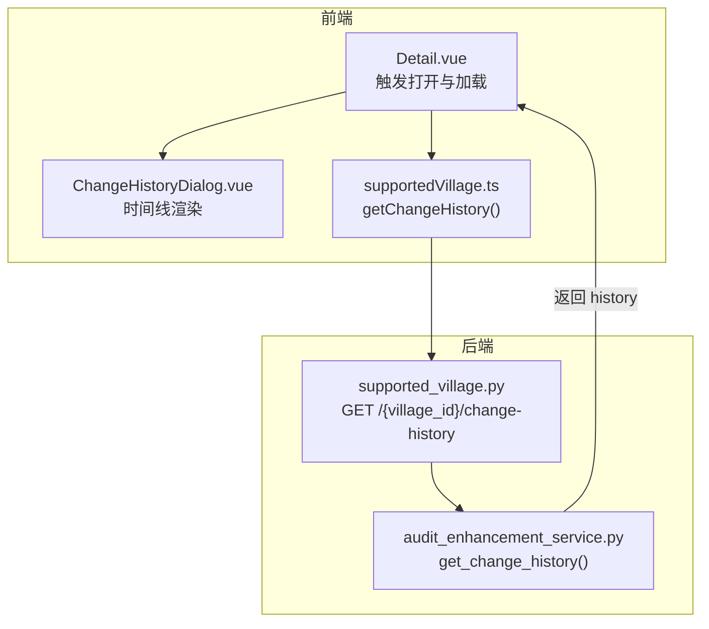
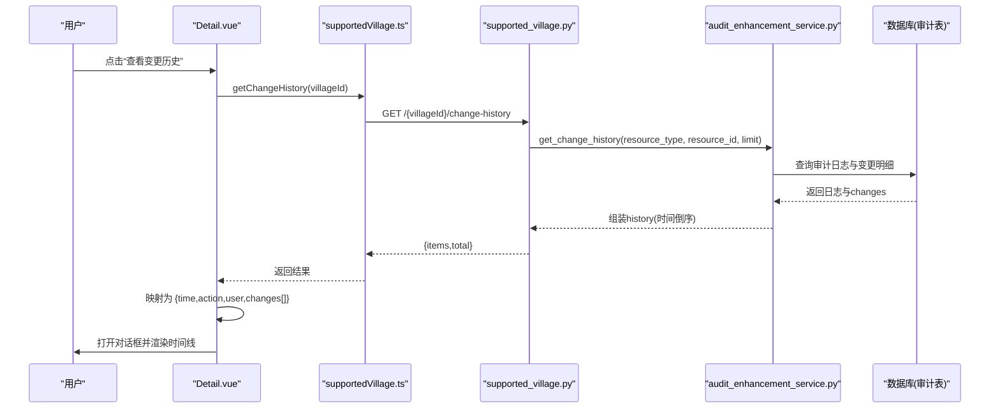
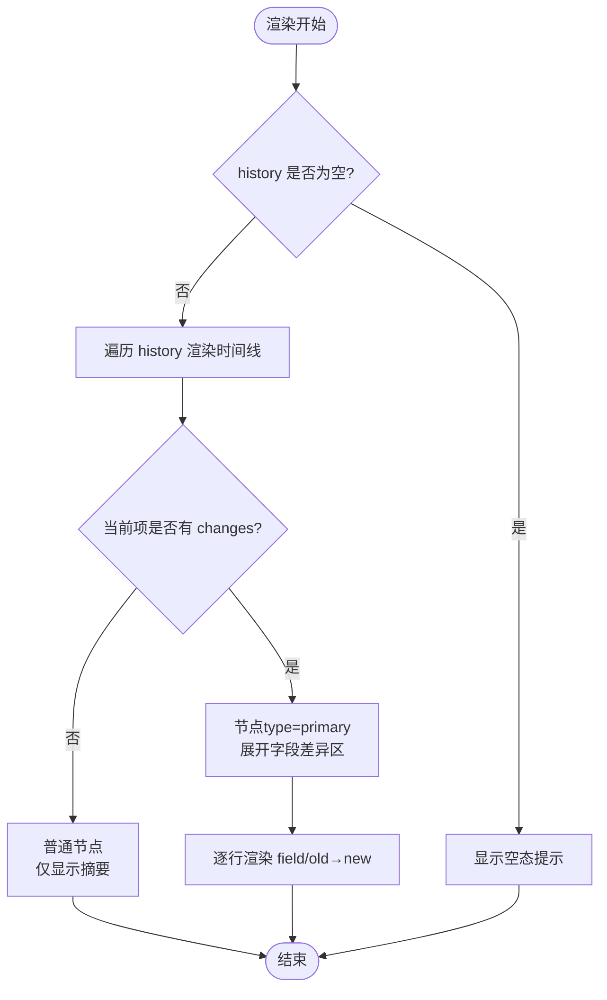
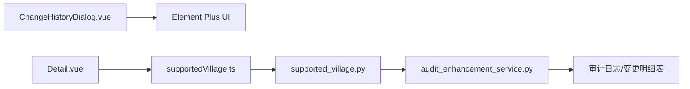
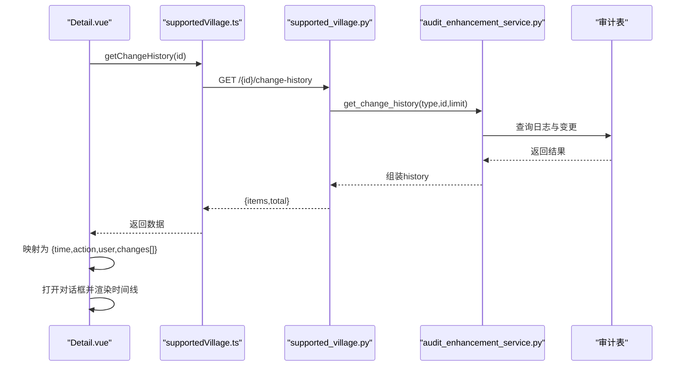

# ChangeHistoryDialog组件

<cite>
**本文引用的文件**
- [ChangeHistoryDialog.vue](file://frontend/src/components/common/ChangeHistoryDialog.vue)
- [ChangeHistoryDialog.test.ts](file://frontend/tests/unit/components/common/ChangeHistoryDialog.test.ts)
- [Detail.vue（帮扶村详情）](file://frontend/src/views/analytics/supported-villages/Detail.vue)
- [supportedVillage.ts（前端API）](file://frontend/src/api/supportedVillage.ts)
- [audit_enhancement_service.py（后端变更历史服务）](file://backend/app/services/audit_enhancement_service.py)
- [supported_village.py（后端路由，变更历史端点）](file://backend/app/api/v1/supported_village.py)
- [test_supported_village_api.py（后端接口测试）](file://backend/tests/unit/test_supported_village_api.py)
- [test_village_committee_history_cov.py（字段级变更断言）](file://backend/tests/unit/test_village_committee_history_cov.py)
</cite>

## 目录
1. [简介](#简介)
2. [项目结构](#项目结构)
3. [核心组件](#核心组件)
4. [架构总览](#架构总览)
5. [详细组件分析](#详细组件分析)
6. [依赖关系分析](#依赖关系分析)
7. [性能考虑](#性能考虑)
8. [故障排查指南](#故障排查指南)
9. [结论](#结论)
10. [附录](#附录)

## 简介
本技术文档围绕 ChangeHistoryDialog 变更历史对话框组件，系统阐述其在系统中的职责、数据契约、渲染机制与交互行为，并结合前后端实现说明变更记录的采集、存储、查询与展示流程。重点覆盖：
- 时间线渲染与字段级差异展示
- 历史记录数据格式与显示配置
- 用户操作追踪与版本对比思路
- 集成示例与最佳实践
- 大数据量场景下的性能优化建议

## 项目结构
该功能由前端通用对话框组件、业务页面调用、前端API封装以及后端审计服务共同构成。整体链路如下：
- 前端：ChangeHistoryDialog 负责以时间线形式展示变更记录；业务页 Detail.vue 触发加载并传入数据。
- 前端API：supportedVillage.ts 提供 getChangeHistory 方法，请求后端 /api/v1/supported-villages/{id}/change-history。
- 后端：supported_village.py 暴露变更历史接口；audit_enhancement_service.py 从审计日志与变更明细中聚合数据并按时间倒序返回。

**图示来源**
- [Detail.vue:175-219](file://frontend/src/views/analytics/supported-villages/Detail.vue#L175-L219)
- [ChangeHistoryDialog.vue:1-50](file://frontend/src/components/common/ChangeHistoryDialog.vue#L1-L50)
- [supportedVillage.ts:55-56](file://frontend/src/api/supportedVillage.ts#L55-L56)
- [supported_village.py:1147-1160](file://backend/app/api/v1/supported_village.py#L1147-L1160)
- [audit_enhancement_service.py:160-214](file://backend/app/services/audit_enhancement_service.py#L160-L214)

**章节来源**
- [ChangeHistoryDialog.vue:1-87](file://frontend/src/components/common/ChangeHistoryDialog.vue#L1-L87)
- [Detail.vue:175-219](file://frontend/src/views/analytics/supported-villages/Detail.vue#L175-L219)
- [supportedVillage.ts:55-56](file://frontend/src/api/supportedVillage.ts#L55-L56)
- [audit_enhancement_service.py:160-214](file://backend/app/services/audit_enhancement_service.py#L160-L214)

## 核心组件
- ChangeHistoryDialog 是一个无状态的可复用对话框组件，接收 visible 与 history 两个主要属性，通过 update:visible 事件与父组件双向绑定可见性。
- 当 history 为空时，显示空态提示；否则使用 Element Plus 的时间线组件按时间顺序展示每次操作的摘要与字段级变更。
- 内置 formatValue 用于将任意值安全地序列化为字符串，支持 null/undefined/空串、对象与标量的统一处理。

关键能力
- 时间线节点：每个节点包含时间戳、操作描述、操作人，以及可选的字段级变更列表。
- 差异高亮：旧值删除线样式，新值成功色样式，箭头分隔，便于快速识别变化。
- 空态友好：无变更记录时给出明确提示，避免空白或报错。

**章节来源**
- [ChangeHistoryDialog.vue:1-50](file://frontend/src/components/common/ChangeHistoryDialog.vue#L1-L50)
- [ChangeHistoryDialog.vue:52-87](file://frontend/src/components/common/ChangeHistoryDialog.vue#L52-L87)

## 架构总览
变更历史的完整生命周期包括“记录—存储—查询—展示”四个阶段：
- 记录：业务操作触发审计日志写入，同时记录字段级变更（old/new）。
- 存储：审计日志与变更明细持久化到数据库，并通过索引优化查询性能。
- 查询：前端调用后端变更历史接口，后端聚合最近 N 条日志及其变更明细，按时间倒序返回。
- 展示：前端将后端数据结构映射为组件期望的 history 数组，并在对话框中以时间线呈现。

**图示来源**
- [Detail.vue:195-219](file://frontend/src/views/analytics/supported-villages/Detail.vue#L195-L219)
- [supportedVillage.ts:55-56](file://frontend/src/api/supportedVillage.ts#L55-L56)
- [supported_village.py:1147-1160](file://backend/app/api/v1/supported_village.py#L1147-L1160)
- [audit_enhancement_service.py:160-214](file://backend/app/services/audit_enhancement_service.py#L160-L214)

## 详细组件分析

### 组件API与数据契约
- 输入属性
  - visible: boolean，控制对话框显隐
  - history?: ChangeRecord[]，变更历史条目数组
- 输出事件
  - update:visible: boolean，与父组件 v-model:visible 双向绑定
- 数据模型 ChangeRecord
  - time: string，时间戳
  - action: string，操作类型（如 create/update/delete 等）
  - user: string，操作人
  - changes?: { field: string; old_value: any; new_value: any }[]，字段级变更列表

注意
- 若 history 缺失或为空，组件显示空态提示。
- 若某条记录没有 changes，时间线节点仍会显示，但不会展开字段差异区域。

**章节来源**
- [ChangeHistoryDialog.vue:31-49](file://frontend/src/components/common/ChangeHistoryDialog.vue#L31-L49)

### 时间线渲染与差异高亮
- 使用 el-timeline 与 el-timeline-item 渲染时间轴，timestamp 来自 item.time。
- 当 item.changes 存在且非空时，节点 type 标记为 primary，表示有具体变更内容。
- 每条记录的 changes 以行展示：字段名、旧值（删除线）、箭头、新值（成功色），便于快速定位差异。
- formatValue 对值进行安全格式化：null/undefined/空串显示为“（空）”，对象转为 JSON 字符串，标量转字符串。

**图示来源**
- [ChangeHistoryDialog.vue:9-28](file://frontend/src/components/common/ChangeHistoryDialog.vue#L9-L28)
- [ChangeHistoryDialog.vue:45-49](file://frontend/src/components/common/ChangeHistoryDialog.vue#L45-L49)

**章节来源**
- [ChangeHistoryDialog.vue:9-28](file://frontend/src/components/common/ChangeHistoryDialog.vue#L9-L28)
- [ChangeHistoryDialog.vue:45-49](file://frontend/src/components/common/ChangeHistoryDialog.vue#L45-L49)

### 用户操作追踪与版本对比
- 用户操作追踪：每条记录包含 action 与 user，结合 time 可还原操作时序与责任人。
- 版本对比：当前组件聚焦单实体的时间线展示。如需跨版本对比，可在业务层扩展选择两个时间点或版本号，拉取对应快照后在前端进行字段级 diff 展示。此能力可作为后续增强方向。

**章节来源**
- [ChangeHistoryDialog.vue:11-26](file://frontend/src/components/common/ChangeHistoryDialog.vue#L11-L26)

### 集成示例（在业务系统中使用）
- 在业务详情页引入 ChangeHistoryDialog，维护 visible 与 history 状态。
- 点击“查看变更历史”时，调用 getChangeHistory 获取数据，并将后端返回的结构映射为组件所需的 history 格式。
- 将映射后的 history 传入组件，即可自动渲染时间线与差异。

参考路径
- 视图层集成与数据映射：[Detail.vue:175-219](file://frontend/src/views/analytics/supported-villages/Detail.vue#L175-L219)
- 前端API定义：[supportedVillage.ts:55-56](file://frontend/src/api/supportedVillage.ts#L55-L56)

**章节来源**
- [Detail.vue:175-219](file://frontend/src/views/analytics/supported-villages/Detail.vue#L175-L219)
- [supportedVillage.ts:55-56](file://frontend/src/api/supportedVillage.ts#L55-L56)

## 依赖关系分析
- 组件依赖 Element Plus 的 Dialog、Timeline、Empty 等基础组件。
- 业务页依赖前端 API 模块与后端路由。
- 后端服务依赖审计日志与变更明细表，并通过索引优化查询效率。

**图示来源**
- [ChangeHistoryDialog.vue:1-28](file://frontend/src/components/common/ChangeHistoryDialog.vue#L1-L28)
- [supportedVillage.ts:55-56](file://frontend/src/api/supportedVillage.ts#L55-L56)
- [supported_village.py:1147-1160](file://backend/app/api/v1/supported_village.py#L1147-L1160)
- [audit_enhancement_service.py:160-214](file://backend/app/services/audit_enhancement_service.py#L160-L214)

**章节来源**
- [ChangeHistoryDialog.vue:1-28](file://frontend/src/components/common/ChangeHistoryDialog.vue#L1-L28)
- [supportedVillage.ts:55-56](file://frontend/src/api/supportedVillage.ts#L55-L56)
- [audit_enhancement_service.py:160-214](file://backend/app/services/audit_enhancement_service.py#L160-L214)

## 性能考虑
- 分页与限制：后端默认限制返回数量（limit），避免一次性加载过多历史导致前端渲染卡顿。建议在大数据量场景下结合分页或虚拟滚动进一步优化。
- 索引优化：审计日志与变更明细表已建立常用查询维度的索引（如实体类型、ID、时间、动作等），提升查询性能。
- 前端渲染：时间线节点按需渲染，字段差异仅在存在 changes 时展开，减少不必要的DOM开销。
- 网络传输：后端仅返回必要字段（time/action/user/changes），降低响应体积。
- 缓存策略：对于不频繁变动的实体，可在前端或网关层对变更历史做短期缓存，减少重复请求。

**章节来源**
- [audit_enhancement_service.py:160-214](file://backend/app/services/audit_enhancement_service.py#L160-L214)

## 故障排查指南
- 对话框无法关闭：检查是否正确使用 v-model:visible 双向绑定，并确保组件内部正确转发 update:visible 事件。
- 无变更记录显示异常：确认 history 是否为空数组或 undefined；组件在无数据时会显示空态提示。
- 字段差异未显示：检查后端返回的 changes 是否存在；若无 changes，则不会展开差异区域。
- 数据格式不一致：确保前端已将后端返回的数据映射为 {time, action, user, changes[]} 结构。
- 权限问题：后端接口通常要求具备相应资源访问权限，若返回空或错误，请检查当前用户权限与数据范围。

**章节来源**
- [ChangeHistoryDialog.test.ts:85-145](file://frontend/tests/unit/components/common/ChangeHistoryDialog.test.ts#L85-L145)
- [test_supported_village_api.py:601-614](file://backend/tests/unit/test_supported_village_api.py#L601-L614)

## 结论
ChangeHistoryDialog 以简洁的API与清晰的渲染逻辑，提供了可靠的变更历史时间线展示能力。配合后端的审计服务，能够准确记录并回溯字段级变更，满足日常运维与合规审计需求。未来可在版本对比、差异高亮增强、大数据量虚拟滚动等方面持续演进，以提升用户体验与系统可扩展性。

## 附录

### 数据模型与字段说明
- ChangeRecord
  - time: string，操作时间
  - action: string，操作类型
  - user: string，操作人
  - changes?: { field: string; old_value: any; new_value: any }[]，字段级变更
- 后端返回的历史条目
  - timestamp/time: 时间戳
  - username/user: 用户名
  - action: 操作类型
  - changes: 字段级变更集合

**章节来源**
- [ChangeHistoryDialog.vue:31-49](file://frontend/src/components/common/ChangeHistoryDialog.vue#L31-L49)
- [audit_enhancement_service.py:193-214](file://backend/app/services/audit_enhancement_service.py#L193-L214)

### 端到端调用序列图（代码级）

**图示来源**
- [Detail.vue:195-219](file://frontend/src/views/analytics/supported-villages/Detail.vue#L195-L219)
- [supportedVillage.ts:55-56](file://frontend/src/api/supportedVillage.ts#L55-L56)
- [supported_village.py:1147-1160](file://backend/app/api/v1/supported_village.py#L1147-L1160)
- [audit_enhancement_service.py:160-214](file://backend/app/services/audit_enhancement_service.py#L160-L214)