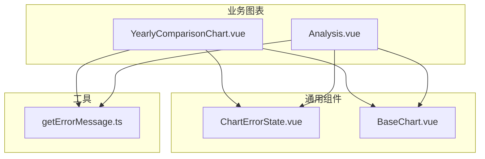
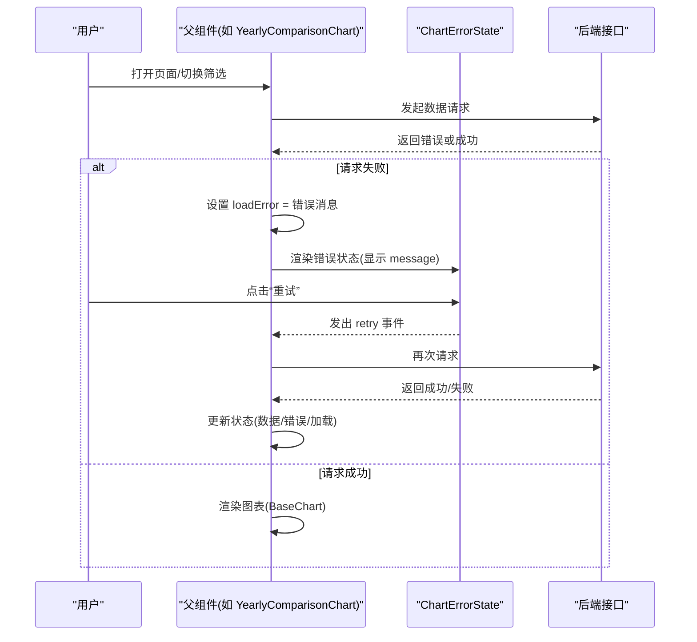
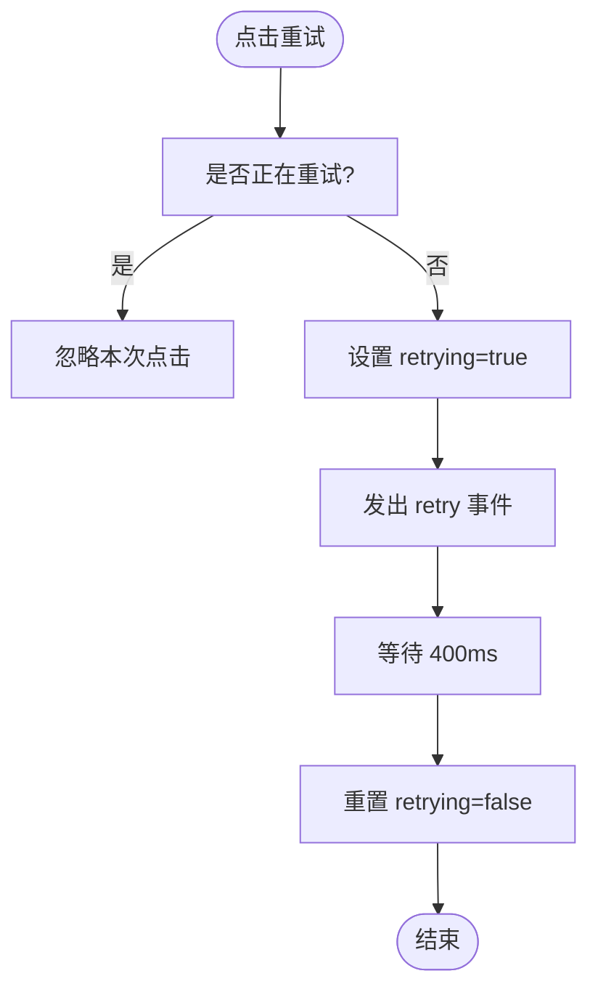
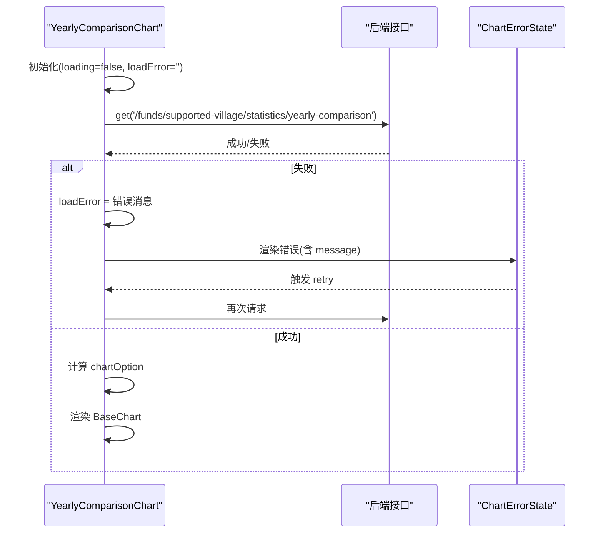
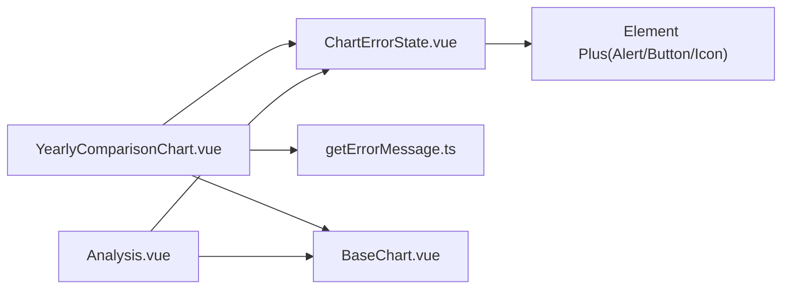

# ChartErrorState组件

<cite>
**本文引用的文件**
- [ChartErrorState.vue](file://frontend/src/components/common/ChartErrorState.vue)
- [ChartErrorState.test.ts](file://frontend/tests/unit/components/ChartErrorState.test.ts)
- [YearlyComparisonChart.vue](file://frontend/src/components/funds/YearlyComparisonChart.vue)
- [Analysis.vue](file://frontend/src/views/funds/Analysis.vue)
- [BaseChart.vue](file://frontend/src/components/common/BaseChart.vue)
- [getErrorMessage.ts](file://frontend/src/utils/getErrorMessage.ts)
</cite>

## 目录
1. [简介](#简介)
2. [项目结构](#项目结构)
3. [核心组件](#核心组件)
4. [架构总览](#架构总览)
5. [详细组件分析](#详细组件分析)
6. [依赖关系分析](#依赖关系分析)
7. [性能与可用性考量](#性能与可用性考量)
8. [故障排查指南](#故障排查指南)
9. [结论](#结论)
10. [附录：配置与使用示例](#附录配置与使用示例)

## 简介
ChartErrorState 是一个用于图表或数据区域的内联错误状态展示与重试组件。其设计目标是：当后台数据加载失败、数据异常或网络请求出错时，在内容区域内直接展示错误原因并提供“重试”按钮，用户可就地恢复，避免全局弹窗打断体验。该组件通过 props 接收错误消息，通过事件将重试动作回传给父组件，由父组件负责实际的数据重新加载逻辑。

## 项目结构
本组件位于前端通用组件目录，被多个业务图表页面复用；同时配套单元测试验证交互行为（默认文案、自定义消息、重试防抖等）。

图示来源
- [ChartErrorState.vue:1-54](file://frontend/src/components/common/ChartErrorState.vue#L1-L54)
- [YearlyComparisonChart.vue:1-79](file://frontend/src/components/funds/YearlyComparisonChart.vue#L1-L79)
- [Analysis.vue:80-279](file://frontend/src/views/funds/Analysis.vue#L80-L279)
- [BaseChart.vue:1-89](file://frontend/src/components/common/BaseChart.vue#L1-L89)
- [getErrorMessage.ts:1-31](file://frontend/src/utils/getErrorMessage.ts#L1-L31)

章节来源
- [ChartErrorState.vue:1-54](file://frontend/src/components/common/ChartErrorState.vue#L1-L54)
- [YearlyComparisonChart.vue:1-79](file://frontend/src/components/funds/YearlyComparisonChart.vue#L1-L79)
- [Analysis.vue:80-279](file://frontend/src/views/funds/Analysis.vue#L80-L279)
- [BaseChart.vue:1-89](file://frontend/src/components/common/BaseChart.vue#L1-L89)
- [getErrorMessage.ts:1-31](file://frontend/src/utils/getErrorMessage.ts#L1-L31)

## 核心组件
- 职责：内联展示错误信息 + 提供重试入口，防止重复点击，保持轻量无副作用。
- 输入：message（可选），用于覆盖默认提示文案。
- 输出：retry 事件，由父组件监听并执行具体重试逻辑。
- 交互：点击重试后进入 loading 态，短暂延时复位，确保 UI 反馈一致。

章节来源
- [ChartErrorState.vue:10-41](file://frontend/src/components/common/ChartErrorState.vue#L10-L41)
- [ChartErrorState.test.ts:33-68](file://frontend/tests/unit/components/ChartErrorState.test.ts#L33-L68)

## 架构总览
ChartErrorState 作为“展示层”的纯 UI 组件，不关心数据来源；父组件负责：
- 维护 loading / loadError 状态
- 发起数据请求
- 捕获错误并设置错误消息
- 监听 retry 事件触发重新加载

图示来源
- [YearlyComparisonChart.vue:24-51](file://frontend/src/components/funds/YearlyComparisonChart.vue#L24-L51)
- [ChartErrorState.vue:20-41](file://frontend/src/components/common/ChartErrorState.vue#L20-L41)
- [Analysis.vue:80-149](file://frontend/src/views/funds/Analysis.vue#L80-L149)

## 详细组件分析

### ChartErrorState 组件
- 模板结构：错误提示 + 重试按钮（带图标）
- Props：
  - message?: string — 错误提示文案，未提供时使用默认文案
- Emits：
  - retry — 用户点击重试时触发
- 内部状态：
  - retrying: boolean — 防止重复点击，控制按钮 loading
- 行为：
  - 点击重试 → 若已在重试中则忽略
  - 触发 retry 事件
  - 短暂延时后重置 retrying，保证按钮视觉反馈

图示来源
- [ChartErrorState.vue:28-41](file://frontend/src/components/common/ChartErrorState.vue#L28-L41)

章节来源
- [ChartErrorState.vue:1-54](file://frontend/src/components/common/ChartErrorState.vue#L1-L54)
- [ChartErrorState.test.ts:33-68](file://frontend/tests/unit/components/ChartErrorState.test.ts#L33-L68)

### 父组件集成模式（以 YearlyComparisonChart 为例）
- 状态管理：loading、loadError、数据数组
- 数据加载：
  - 开始：设置 loading=true，清空错误
  - 成功：根据响应封装数据，仅在显式失败时设置错误
  - 失败：捕获异常，提取错误消息并设置到 loadError
- 渲染策略：
  - 加载中：骨架屏
  - 有错误：ChartErrorState 并透传 message，绑定 @retry=load
  - 有数据：BaseChart 渲染图表
  - 空数据：空状态提示

图示来源
- [YearlyComparisonChart.vue:24-51](file://frontend/src/components/funds/YearlyComparisonChart.vue#L24-L51)
- [YearlyComparisonChart.vue:53-77](file://frontend/src/components/funds/YearlyComparisonChart.vue#L53-L77)
- [ChartErrorState.vue:20-41](file://frontend/src/components/common/ChartErrorState.vue#L20-L41)

章节来源
- [YearlyComparisonChart.vue:1-79](file://frontend/src/components/funds/YearlyComparisonChart.vue#L1-L79)

### 多图表页面集成（Analysis.vue）
- 多处复用 ChartErrorState，分别对应不同维度统计与趋势图
- 统一模式：
  - 加载中：骨架屏
  - 错误：ChartErrorState，绑定各自的重载函数
  - 数据：BaseChart 渲染
  - 空数据：EmptyState 占位

章节来源
- [Analysis.vue:80-149](file://frontend/src/views/funds/Analysis.vue#L80-L149)
- [Analysis.vue:225-279](file://frontend/src/views/funds/Analysis.vue#L225-L279)

### 错误消息提取工具（getErrorMessage）
- 作用：从任意错误对象中提取最合适的用户可见消息
- 优先级：拦截器挂载的 userMessage → detail → message → 原始 message → 兜底文案
- 优势：零依赖，可在任何层级安全引用，避免引入 UI 库副作用

章节来源
- [getErrorMessage.ts:1-31](file://frontend/src/utils/getErrorMessage.ts#L1-L31)

### 图表渲染基座（BaseChart）
- 作用：封装 ECharts 实例生命周期、选项更新、点击事件、自适应尺寸
- 与错误状态的关系：当存在错误时，父组件不渲染 BaseChart；错误解决后，再渲染图表

章节来源
- [BaseChart.vue:1-89](file://frontend/src/components/common/BaseChart.vue#L1-L89)

## 依赖关系分析
- ChartErrorState 仅依赖 Element Plus 的 Alert/Button 与图标，无业务耦合
- 父组件依赖：
  - 数据请求与错误处理（如 getErrorMessage）
  - 图表渲染（BaseChart）
  - 空状态（EmptyState，部分页面）
- 测试依赖：@vue/test-utils、Vitest，对交互进行断言

图示来源
- [ChartErrorState.vue:1-54](file://frontend/src/components/common/ChartErrorState.vue#L1-L54)
- [YearlyComparisonChart.vue:1-79](file://frontend/src/components/funds/YearlyComparisonChart.vue#L1-L79)
- [Analysis.vue:80-279](file://frontend/src/views/funds/Analysis.vue#L80-L279)
- [BaseChart.vue:1-89](file://frontend/src/components/common/BaseChart.vue#L1-L89)
- [getErrorMessage.ts:1-31](file://frontend/src/utils/getErrorMessage.ts#L1-L31)

章节来源
- [ChartErrorState.vue:1-54](file://frontend/src/components/common/ChartErrorState.vue#L1-L54)
- [YearlyComparisonChart.vue:1-79](file://frontend/src/components/funds/YearlyComparisonChart.vue#L1-L79)
- [Analysis.vue:80-279](file://frontend/src/views/funds/Analysis.vue#L80-L279)
- [BaseChart.vue:1-89](file://frontend/src/components/common/BaseChart.vue#L1-L89)
- [getErrorMessage.ts:1-31](file://frontend/src/utils/getErrorMessage.ts#L1-L31)

## 性能与可用性考量
- 轻量无副作用：组件不发起网络请求，不持有业务状态，易于组合与测试
- 防重复点击：内部 retrying 标志避免短时间内多次触发重试，降低服务端压力
- 即时反馈：按钮 loading 态与短暂延时提升感知一致性
- 错误就近展示：减少全局弹窗干扰，提升任务连续性
- 建议：
  - 在高频刷新场景下，结合节流/去抖进一步限制重试频率
  - 对关键路径的错误，可增加“查看详情”或“上报问题”入口
  - 为无障碍访问添加 aria 描述，提升可访问性

[本节为通用建议，不直接分析具体文件]

## 故障排查指南
- 现象：点击重试无效
  - 检查父组件是否正确监听 retry 事件并调用重载函数
  - 确认父组件在重试前已清理上一次错误状态
- 现象：错误消息为空或不准确
  - 检查父组件是否在 catch 分支设置了 loadError
  - 使用 getErrorMessage 提取更友好的用户消息
- 现象：频繁重试导致服务压力大
  - 在父组件增加重试间隔或最大重试次数
  - 结合网络状态判断是否允许重试
- 现象：UI 抖动或布局异常
  - 确保错误区域最小高度与间距合理（组件已内置样式）
  - 检查父容器是否限制了高度导致撑开

章节来源
- [ChartErrorState.test.ts:48-68](file://frontend/tests/unit/components/ChartErrorState.test.ts#L48-L68)
- [YearlyComparisonChart.vue:28-51](file://frontend/src/components/funds/YearlyComparisonChart.vue#L28-L51)
- [getErrorMessage.ts:17-28](file://frontend/src/utils/getErrorMessage.ts#L17-L28)

## 结论
ChartErrorState 提供了稳定、简洁、可复用的图表错误状态解决方案。通过与父组件的状态协作和事件机制，实现了“就地报错 + 就地重试”的用户体验。配合统一的错误消息提取工具，可以在不同页面保持一致的错误呈现与操作路径。建议在更多图表模块中推广此模式，以提升整体系统的健壮性与用户体验。

[本节为总结性内容，不直接分析具体文件]

## 附录：配置与使用示例

### 组件配置项
- 属性
  - message?: string — 错误提示文案；未提供时使用默认文案
- 事件
  - retry — 用户点击重试时触发，父组件需实现具体重试逻辑
- 样式
  - 组件自带最小高度与居中布局，适配常见卡片容器

章节来源
- [ChartErrorState.vue:20-22](file://frontend/src/components/common/ChartErrorState.vue#L20-L22)
- [ChartErrorState.vue:24-41](file://frontend/src/components/common/ChartErrorState.vue#L24-L41)
- [ChartErrorState.vue:43-52](file://frontend/src/components/common/ChartErrorState.vue#L43-L52)

### 在图表组件中的集成步骤
- 维护状态：loading、loadError、数据
- 数据加载流程：
  - 开始：loading=true，清空错误
  - 成功：设置数据，必要时计算图表 option
  - 失败：设置 loadError（可使用 getErrorMessage）
- 模板渲染：
  - 加载中：骨架屏
  - 错误：渲染 ChartErrorState，传入 message，绑定 @retry=load
  - 数据：渲染 BaseChart
  - 空数据：空状态提示

章节来源
- [YearlyComparisonChart.vue:24-51](file://frontend/src/components/funds/YearlyComparisonChart.vue#L24-L51)
- [YearlyComparisonChart.vue:53-77](file://frontend/src/components/funds/YearlyComparisonChart.vue#L53-L77)
- [Analysis.vue:80-149](file://frontend/src/views/funds/Analysis.vue#L80-L149)

### 最佳实践
- 错误消息尽量具体：优先使用服务端返回的 detail/message，其次 fallback 到通用文案
- 重试按钮语义清晰：明确告知用户“重试”的含义与后果
- 避免阻塞主线程：重试逻辑应异步且可取消（如需）
- 可观测性：对关键错误埋点，便于定位问题
- 可访问性：为错误区域与按钮提供适当的标签与提示

[本节为通用建议，不直接分析具体文件]