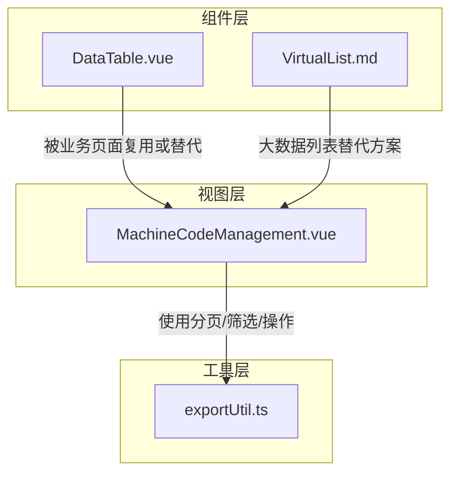
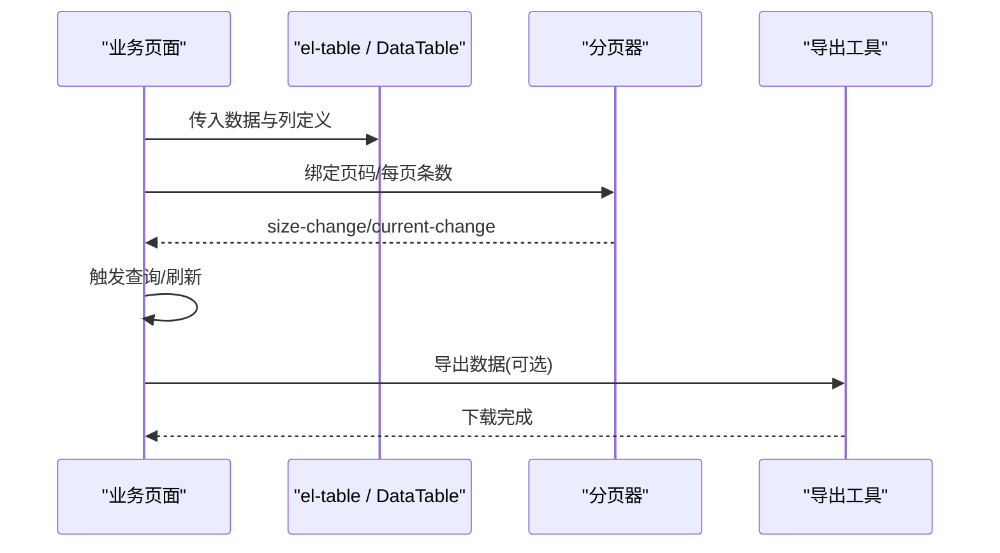
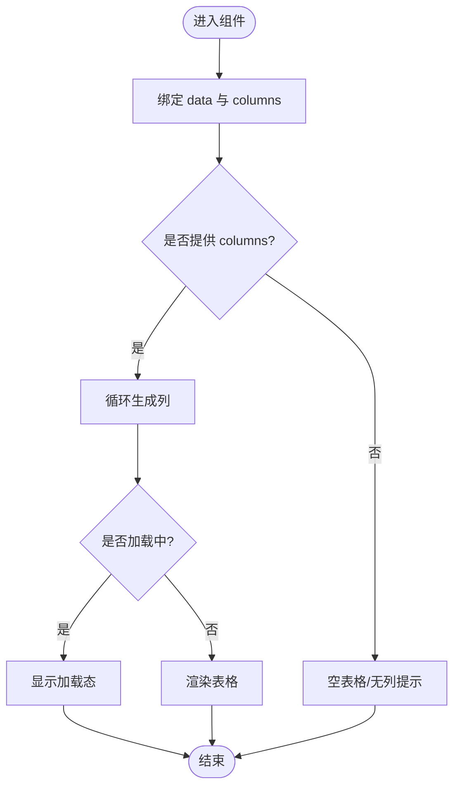
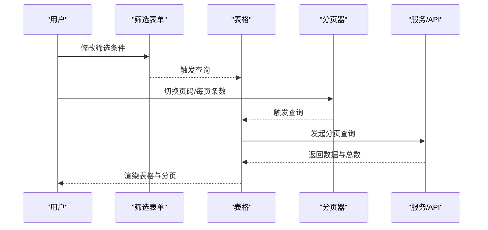
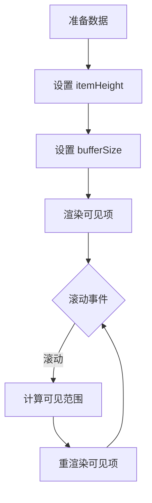
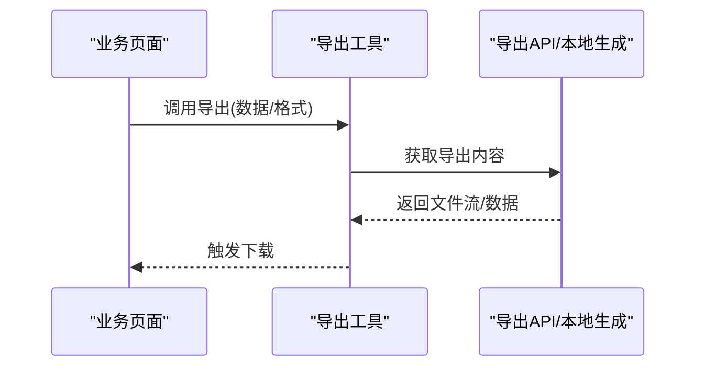
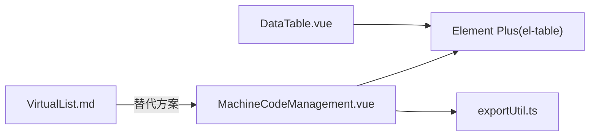

# DataTable组件

<cite>
**本文引用的文件**
- [DataTable.vue](file://frontend/src/components/common/DataTable.vue)
- [VirtualList.md](file://frontend/src/components/common/VirtualList.md)
- [MachineCodeManagement.vue](file://frontend/src/views/admin/MachineCodeManagement.vue)
- [exportUtil.ts](file://frontend/src/utils/exportUtil.ts)
</cite>

## 目录
1. [简介](#简介)
2. [项目结构](#项目结构)
3. [核心组件](#核心组件)
4. [架构总览](#架构总览)
5. [详细组件分析](#详细组件分析)
6. [依赖关系分析](#依赖关系分析)
7. [性能考虑](#性能考虑)
8. [故障排查指南](#故障排查指南)
9. [结论](#结论)
10. [附录](#附录)

## 简介
本技术文档围绕前端数据表格组件 DataTable，系统阐述其能力边界、扩展方式与最佳实践。当前仓库中的 DataTable 是一个轻量封装的通用表格组件，基于 Element Plus 的 el-table 实现基础的数据展示与列定义；同时结合项目中成熟的分页、筛选、排序、导出等模式，形成“基础表格 + 业务页面组合”的完整解决方案。对于大数据量场景，项目提供了 VirtualList 虚拟滚动方案作为补充，可在列表型数据中显著提升渲染性能。

## 项目结构
- 组件层：common 目录下提供可复用的 UI 组件，包括 DataTable 与 VirtualList 说明文档。
- 视图层：业务页面（如机器码管理）使用 el-table 实现复杂表格，包含筛选、分页、操作列等。
- 工具层：导出功能由 exportUtil.ts 提供通用导出能力。

图表来源
- [DataTable.vue:1-20](file://frontend/src/components/common/DataTable.vue#L1-L20)
- [MachineCodeManagement.vue:40-130](file://frontend/src/views/admin/MachineCodeManagement.vue#L40-L130)
- [VirtualList.md:1-168](file://frontend/src/components/common/VirtualList.md#L1-L168)
- [exportUtil.ts:1-200](file://frontend/src/utils/exportUtil.ts#L1-L200)

章节来源
- [DataTable.vue:1-20](file://frontend/src/components/common/DataTable.vue#L1-L20)
- [MachineCodeManagement.vue:40-130](file://frontend/src/views/admin/MachineCodeManagement.vue#L40-L130)
- [VirtualList.md:1-168](file://frontend/src/components/common/VirtualList.md#L1-L168)
- [exportUtil.ts:1-200](file://frontend/src/utils/exportUtil.ts#L1-L200)

## 核心组件
- DataTable 组件
  - 职责：以最小 API 暴露 data、columns、loading 三个属性，内部通过 v-for 动态生成列，绑定到 el-table。
  - 适用场景：简单数据展示、快速原型、列结构由后端或配置驱动的场景。
  - 限制：未内置排序、筛选、分页、批量选择、自定义渲染插槽等高级能力，需由调用方组合或使用更丰富的表格实现。

- VirtualList（虚拟滚动）
  - 职责：在大量数据时仅渲染可视区域元素，提升滚动性能。
  - 适用场景：日志、消息流、长列表等纯展示型数据。
  - 注意：要求固定行高、容器高度明确、避免复杂嵌套计算。

章节来源
- [DataTable.vue:1-20](file://frontend/src/components/common/DataTable.vue#L1-L20)
- [VirtualList.md:1-168](file://frontend/src/components/common/VirtualList.md#L1-L168)

## 架构总览
本项目采用“轻量通用组件 + 业务页面组合”的架构：
- 基础表格：DataTable 提供极简的列渲染能力。
- 复杂表格：业务页面直接使用 el-table，集成筛选表单、分页器、操作列、状态标签、复制按钮等。
- 大数据列表：当数据规模较大且为线性列表时，优先选用 VirtualList。
- 导出能力：通过 exportUtil.ts 统一导出逻辑，支持 Excel/CSV 等格式。

图表来源
- [MachineCodeManagement.vue:40-130](file://frontend/src/views/admin/MachineCodeManagement.vue#L40-L130)
- [exportUtil.ts:1-200](file://frontend/src/utils/exportUtil.ts#L1-L200)

## 详细组件分析

### DataTable 组件分析
- 输入属性
  - data：数组类型，表格数据源。
  - columns：列定义数组，每项包含 key、label、可选 width。
  - loading：可选布尔值，控制加载态。
- 渲染行为
  - 使用 el-table 包裹，v-for 遍历 columns 生成 el-table-column，按 key 映射字段。
- 扩展建议
  - 若需要排序/筛选/分页/自定义渲染，建议在业务页面直接使用 el-table 并组合筛选表单与分页器。
  - 若需要批量操作，可在 el-table 上启用 selection 并在外层维护选中集合。

图表来源
- [DataTable.vue:1-20](file://frontend/src/components/common/DataTable.vue#L1-L20)

章节来源
- [DataTable.vue:1-20](file://frontend/src/components/common/DataTable.vue#L1-L20)

### 复杂表格示例：机器码管理
- 功能要点
  - 筛选：顶部表单支持状态筛选，变更时触发查询。
  - 表格：使用 el-table 展示机器码、通行码、状态、绑定用户、备注、创建时间等。
  - 操作列：撤销等操作按钮，条件渲染。
  - 分页：底部分页器支持切换页大小与页码，联动查询。
- 数据流
  - 筛选/分页变化 → 更新查询参数 → 请求数据 → 回填分页信息 → 刷新表格。

图表来源
- [MachineCodeManagement.vue:18-130](file://frontend/src/views/admin/MachineCodeManagement.vue#L18-L130)

章节来源
- [MachineCodeManagement.vue:18-130](file://frontend/src/views/admin/MachineCodeManagement.vue#L18-L130)

### 虚拟滚动：VirtualList
- 特性
  - 仅渲染可视区域元素，支持缓冲区预渲染，适合万级数据流畅滚动。
  - 提供滚动方法：滚动到顶部、底部、指定索引。
- 使用约束
  - 固定行高、容器高度明确、避免复杂计算与深层嵌套。
- 适用性
  - 列表型数据展示，非表格行列交互场景。

图表来源
- [VirtualList.md:1-168](file://frontend/src/components/common/VirtualList.md#L1-L168)

章节来源
- [VirtualList.md:1-168](file://frontend/src/components/common/VirtualList.md#L1-L168)

### 导出能力
- 工具模块
  - exportUtil.ts 提供统一的导出函数，便于在不同页面复用。
- 典型流程
  - 页面收集筛选条件 → 调用导出接口或本地生成 → 触发浏览器下载。

图表来源
- [exportUtil.ts:1-200](file://frontend/src/utils/exportUtil.ts#L1-L200)

章节来源
- [exportUtil.ts:1-200](file://frontend/src/utils/exportUtil.ts#L1-L200)

## 依赖关系分析
- DataTable 依赖 Element Plus 的 el-table/el-table-column，属于轻量封装，无额外业务依赖。
- 复杂表格在业务页面直接依赖 Element Plus 组件，并通过筛选表单与分页器组合出完整交互。
- 导出功能依赖 exportUtil.ts，降低重复实现成本。
- 大数据列表场景可引入 VirtualList，减少对 el-table 的性能压力。

图表来源
- [DataTable.vue:1-20](file://frontend/src/components/common/DataTable.vue#L1-L20)
- [MachineCodeManagement.vue:40-130](file://frontend/src/views/admin/MachineCodeManagement.vue#L40-L130)
- [exportUtil.ts:1-200](file://frontend/src/utils/exportUtil.ts#L1-L200)
- [VirtualList.md:1-168](file://frontend/src/components/common/VirtualList.md#L1-L168)

章节来源
- [DataTable.vue:1-20](file://frontend/src/components/common/DataTable.vue#L1-L20)
- [MachineCodeManagement.vue:40-130](file://frontend/src/views/admin/MachineCodeManagement.vue#L40-L130)
- [exportUtil.ts:1-200](file://frontend/src/utils/exportUtil.ts#L1-L200)
- [VirtualList.md:1-168](file://frontend/src/components/common/VirtualList.md#L1-L168)

## 性能考虑
- 小数据量（<1000）
  - 直接使用 el-table，配合分页与按需加载，体验良好。
- 中等数据量（1000~5000）
  - 建议使用服务端分页，减少首屏渲染压力。
  - 避免在列渲染中进行复杂计算，必要时缓存结果。
- 大数据量（>5000）
  - 列表型数据优先使用 VirtualList，确保固定行高与简洁模板。
  - 对表格场景，评估是否可改为分页+懒加载，或改用虚拟滚动方案。
- 通用优化
  - 合理使用 loading 态，避免频繁重渲染。
  - 列宽尽量固定或 min-width，减少布局抖动。
  - 导出大文件时采用流式下载或后台任务+通知机制。

[本节为通用指导，不直接分析具体文件]

## 故障排查指南
- 表格无数据
  - 检查 data 是否为空数组或未正确赋值。
  - 确认 columns 的 key 与数据字段一致。
- 列未渲染
  - 检查 columns 是否正确传入，key 是否存在。
- 分页不生效
  - 确认分页器的 current-page/page-size 与查询参数同步。
  - 查询成功后回填 total，保证分页器状态正确。
- 导出失败
  - 检查导出接口权限与网络状态。
  - 确认导出参数（筛选条件、格式）传递正确。

章节来源
- [MachineCodeManagement.vue:18-130](file://frontend/src/views/admin/MachineCodeManagement.vue#L18-L130)
- [exportUtil.ts:1-200](file://frontend/src/utils/exportUtil.ts#L1-L200)

## 结论
- DataTable 提供极简的表格能力，适合快速构建与配置化列渲染。
- 复杂表格需求可通过业务页面直接组合 el-table、筛选表单、分页器与操作列实现。
- 大数据列表推荐使用 VirtualList，以获得更好的滚动性能。
- 导出能力通过工具模块统一实现，便于跨页面复用与维护。

[本节为总结性内容，不直接分析具体文件]

## 附录

### API 参考（DataTable）
- 属性
  - data：any[]，表格数据源
  - columns：{ key: string; label: string; width?: number }[]，列定义
  - loading：boolean?，加载态
- 插槽/事件
  - 当前版本未暴露插槽与事件，如需扩展可在业务页面直接使用 el-table。

章节来源
- [DataTable.vue:1-20](file://frontend/src/components/common/DataTable.vue#L1-L20)

### 使用示例指引
- 基础表格
  - 使用 DataTable 传入 data 与 columns，即可快速渲染表格。
- 复杂表格
  - 参考 MachineCodeManagement.vue，组合筛选表单、el-table、分页器与操作列。
- 动态表格
  - 根据后端返回的列元数据动态生成 columns，实现配置化表格。
- 大数据列表
  - 使用 VirtualList，设置 itemHeight 与 bufferSize，提供默认插槽渲染列表项。

章节来源
- [MachineCodeManagement.vue:40-130](file://frontend/src/views/admin/MachineCodeManagement.vue#L40-L130)
- [VirtualList.md:1-168](file://frontend/src/components/common/VirtualList.md#L1-L168)

### 样式定制指南
- 表格边框与条纹
  - 通过 border、stripe 控制表格外观。
- 列宽度
  - 固定 width 或使用 min-width 避免挤压。
- 溢出处理
  - 对长文本列可使用 show-overflow-tooltip 或自定义插槽进行截断与提示。
- 主题与全局样式
  - 通过全局 CSS 变量或主题覆盖 Element Plus 样式，保持视觉一致性。

章节来源
- [MachineCodeManagement.vue:40-130](file://frontend/src/views/admin/MachineCodeManagement.vue#L40-L130)