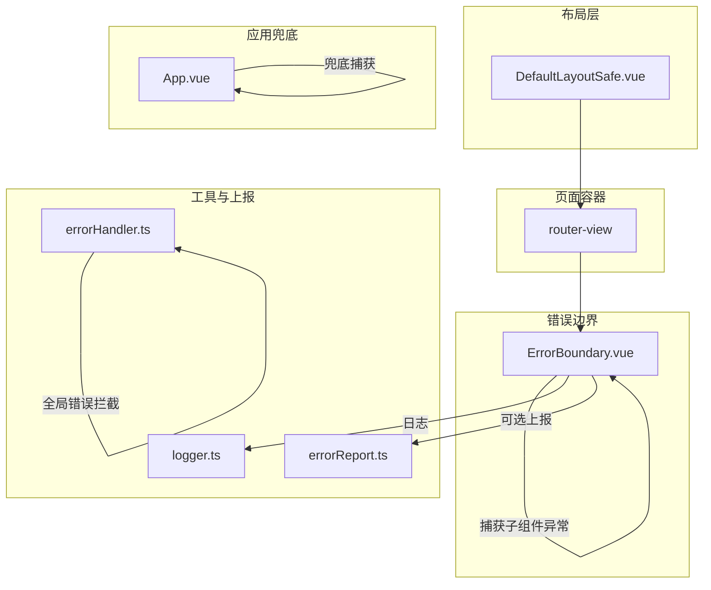
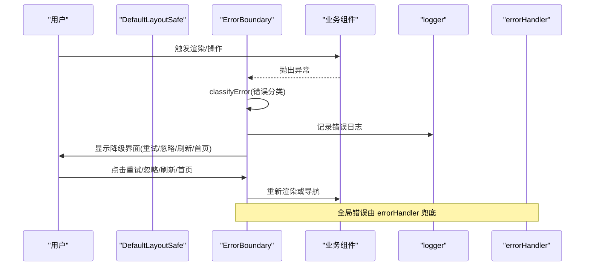
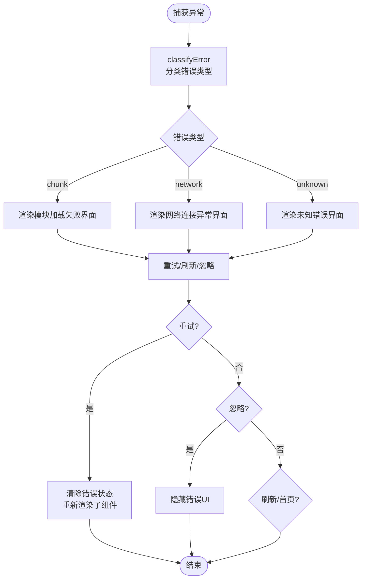
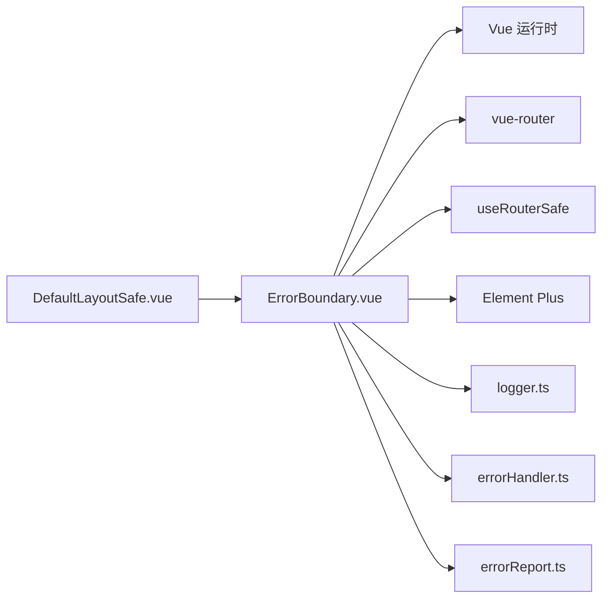

# ErrorBoundary组件

<cite>
**本文引用的文件**
- [ErrorBoundary.vue](file://frontend/src/components/common/ErrorBoundary.vue)
- [DefaultLayoutSafe.vue](file://frontend/src/layouts/DefaultLayoutSafe.vue)
- [App.vue](file://frontend/src/App.vue)
- [logger.ts](file://frontend/src/utils/logger.ts)
- [errorHandler.ts](file://frontend/src/utils/errorHandler.ts)
- [errorReport.ts](file://frontend/src/api/errorReport.ts)
- [ErrorBoundary.test.ts](file://frontend/tests/unit/components/common/ErrorBoundary.test.ts)
</cite>

## 目录
1. [简介](#简介)
2. [项目结构](#项目结构)
3. [核心组件与职责](#核心组件与职责)
4. [架构总览](#架构总览)
5. [详细组件分析](#详细组件分析)
6. [依赖关系分析](#依赖关系分析)
7. [性能与可维护性](#性能与可维护性)
8. [故障排查指南](#故障排查指南)
9. [结论](#结论)
10. [附录：配置与最佳实践](#附录：配置与最佳实践)

## 简介
本技术文档围绕前端错误边界组件 ErrorBoundary，系统性阐述其在 Vue 中的实现方式、错误捕获与恢复策略、降级展示、错误上报机制、以及在实际业务中的使用方式。同时提供调试技巧与常见问题排查方法，帮助开发者在复杂路由与动态加载场景下构建健壮的异常处理体系。

## 项目结构
ErrorBoundary 作为通用 UI 组件位于 common 目录，被布局层 DefaultLayoutSafe 包裹路由视图，形成“页面级”的错误隔离；根组件 App.vue 也实现了应用级兜底错误边界，用于极端情况下的白屏保护。错误日志与全局错误处理由 logger 与 errorHandler 提供支撑，错误报告 API 提供后端上报能力。

图表来源
- [DefaultLayoutSafe.vue:395-410](file://frontend/src/layouts/DefaultLayoutSafe.vue#L395-L410)
- [ErrorBoundary.vue:1-194](file://frontend/src/components/common/ErrorBoundary.vue#L1-L194)
- [App.vue:1-109](file://frontend/src/App.vue#L1-L109)
- [logger.ts:1-184](file://frontend/src/utils/logger.ts#L1-L184)
- [errorHandler.ts:1-487](file://frontend/src/utils/errorHandler.ts#L1-L487)
- [errorReport.ts:1-120](file://frontend/src/api/errorReport.ts#L1-L120)

章节来源
- [DefaultLayoutSafe.vue:395-410](file://frontend/src/layouts/DefaultLayoutSafe.vue#L395-L410)
- [ErrorBoundary.vue:1-194](file://frontend/src/components/common/ErrorBoundary.vue#L1-L194)
- [App.vue:1-109](file://frontend/src/App.vue#L1-L109)

## 核心组件与职责
- ErrorBoundary.vue：基于 Vue 的 onErrorCaptured 钩子实现组件级错误边界，负责分类错误（chunk 加载失败、网络错误、未知错误）、渲染降级界面、重试/忽略/刷新/返回首页等操作，并输出结构化日志。
- DefaultLayoutSafe.vue：将 ErrorBoundary 包裹 router-view，确保每个页面切换时通过 key 重置边界状态，避免残留错误态。
- App.vue：应用级错误边界，捕获未处理的顶层异常，防止白屏并提供最小化重试入口。
- logger.ts：统一日志记录器，支持多级别日志、上下文、堆栈、导出等。
- errorHandler.ts：全局错误解析与策略分发，包含网络/超时/权限/业务等错误类型、通知、日志、重试封装、全局 unhandledrejection 兜底。
- errorReport.ts：错误报告 API，提供提交、查询、统计、更新等接口。

章节来源
- [ErrorBoundary.vue:53-157](file://frontend/src/components/common/ErrorBoundary.vue#L53-L157)
- [DefaultLayoutSafe.vue:395-410](file://frontend/src/layouts/DefaultLayoutSafe.vue#L395-L410)
- [App.vue:20-60](file://frontend/src/App.vue#L20-L60)
- [logger.ts:1-184](file://frontend/src/utils/logger.ts#L1-L184)
- [errorHandler.ts:143-265](file://frontend/src/utils/errorHandler.ts#L143-L265)
- [errorReport.ts:46-108](file://frontend/src/api/errorReport.ts#L46-L108)

## 架构总览
ErrorBoundary 采用“组件级捕获 + 布局级包裹 + 应用级兜底”的分层策略：
- 组件级：ErrorBoundary 捕获子树异常，按错误类型渲染差异化降级界面，提供重试、忽略、刷新、返回首页等操作。
- 布局级：DefaultLayoutSafe 用 key 绑定路由路径，切换路由时强制重建 ErrorBoundary，避免状态污染。
- 应用级：App.vue 捕获更上层的异常，保证极端情况下仍可回退到简单错误页。

图表来源
- [ErrorBoundary.vue:72-120](file://frontend/src/components/common/ErrorBoundary.vue#L72-L120)
- [logger.ts:61-75](file://frontend/src/utils/logger.ts#L61-L75)
- [errorHandler.ts:409-473](file://frontend/src/utils/errorHandler.ts#L409-L473)

## 详细组件分析

### ErrorBoundary 组件
- 错误捕获：使用 onErrorCaptured 捕获子组件未处理异常，返回 false 阻止继续冒泡，避免整棵子树崩溃。
- 错误分类：根据错误消息特征识别 chunk 加载失败、网络错误、未知错误三类，分别渲染不同降级界面。
- 降级界面：
  - ChunkLoadError：提示模块加载失败，提供“重新加载”、“刷新页面”、“忽略”。
  - NetworkError：提示网络连接异常，提供“刷新页面”、“返回首页”、“忽略”。
  - 未知错误：提示页面发生异常，提供“刷新页面”、“返回首页”、“忽略”、“查看详情（堆栈）”。
- 重试机制：handleRetry 清除错误状态，Vue 自动重新渲染子组件；内部使用定时器清理，避免重复触发。
- 忽略机制：handleIgnore 关闭错误遮罩，允许用户继续使用页面。
- 导航与刷新：handleGoHome 安全跳转首页；handleReload 强制刷新页面绕过缓存。
- 生命周期：onUnmounted 清理定时器，避免内存泄漏。

图表来源
- [ErrorBoundary.vue:72-157](file://frontend/src/components/common/ErrorBoundary.vue#L72-L157)

章节来源
- [ErrorBoundary.vue:1-194](file://frontend/src/components/common/ErrorBoundary.vue#L1-L194)
- [ErrorBoundary.test.ts:65-285](file://frontend/tests/unit/components/common/ErrorBoundary.test.ts#L65-L285)

### 布局层 DefaultLayoutSafe
- 将 ErrorBoundary 包裹 router-view，并通过 :key="route.path" 强制在路由切换时重建边界，避免上一个页面的错误状态影响新页面。
- 注释说明曾尝试 transition 过渡导致的问题，最终移除以避免客户端路由切换后主内容区永久空白。

章节来源
- [DefaultLayoutSafe.vue:395-410](file://frontend/src/layouts/DefaultLayoutSafe.vue#L395-L410)

### 应用级兜底 App.vue
- 使用 onErrorCaptured 捕获顶层异常，设置 appError 标志并显示最小化错误页，提供重试按钮。
- 路由 afterEach 中清除错误状态，确保路由切换后恢复正常。

章节来源
- [App.vue:20-60](file://frontend/src/App.vue#L20-L60)

### 日志与全局错误处理
- logger.ts：提供结构化日志记录，支持错误级别、上下文、堆栈、导出；tryCatch/tryCatchAsync/withErrorBoundary 辅助包装函数。
- errorHandler.ts：
  - parseError：统一解析 Axios 响应错误、网络/超时错误、业务错误、未知错误。
  - handleError：根据错误类型选择策略（通知、日志、重定向），并发布事件。
  - setupGlobalErrorHandler：注册 window.onerror 与 unhandledrejection，对 ChunkLoadError、ResizeObserver 警告等进行过滤，并对未处理拒绝进行兜底提示。

章节来源
- [logger.ts:1-184](file://frontend/src/utils/logger.ts#L1-L184)
- [errorHandler.ts:143-265](file://frontend/src/utils/errorHandler.ts#L143-L265)
- [errorHandler.ts:393-473](file://frontend/src/utils/errorHandler.ts#L393-L473)

### 错误上报机制
- errorReport.ts：提供 submitErrorReport、reportException 等接口，可将错误源、类型、消息、堆栈、上下文、严重等级等上报至后端。
- 集成建议：在 ErrorBoundary 的分类逻辑或 handleRetry/handleIgnore 等关键路径中调用上报接口，结合 logger 记录本地日志，便于问题定位与统计分析。

章节来源
- [errorReport.ts:46-108](file://frontend/src/api/errorReport.ts#L46-L108)

## 依赖关系分析
- ErrorBoundary 依赖：
  - Vue 运行时：ref、onErrorCaptured、onUnmounted
  - vue-router：useRouter
  - 自定义 composable：useRouterSafe（安全导航）
  - Element Plus：el-result、el-button
- 布局层依赖：
  - DefaultLayoutSafe 引入 ErrorBoundary，并通过路由 key 控制重建
- 工具层依赖：
  - logger.ts：统一日志
  - errorHandler.ts：全局错误处理与策略
  - errorReport.ts：错误上报 API

图表来源
- [ErrorBoundary.vue:53-63](file://frontend/src/components/common/ErrorBoundary.vue#L53-L63)
- [DefaultLayoutSafe.vue:395-410](file://frontend/src/layouts/DefaultLayoutSafe.vue#L395-L410)
- [logger.ts:1-184](file://frontend/src/utils/logger.ts#L1-L184)
- [errorHandler.ts:1-487](file://frontend/src/utils/errorHandler.ts#L1-L487)
- [errorReport.ts:1-120](file://frontend/src/api/errorReport.ts#L1-L120)

章节来源
- [ErrorBoundary.vue:53-63](file://frontend/src/components/common/ErrorBoundary.vue#L53-L63)
- [DefaultLayoutSafe.vue:395-410](file://frontend/src/layouts/DefaultLayoutSafe.vue#L395-L410)

## 性能与可维护性
- 透明容器：ErrorBoundary 根节点使用 display: contents，避免影响子组件布局与过渡动画。
- 防抖重试：handleRetry 使用定时器并在卸载时清理，避免重复触发与内存泄漏。
- 路由重建：通过 :key="route.path" 强制重建边界，避免跨路由状态污染。
- 日志与上报：集中式日志与错误上报，便于问题追踪与度量。
- 测试覆盖：单元测试覆盖分类、重试、忽略、刷新、导航、堆栈显示等关键路径。

章节来源
- [ErrorBoundary.vue:159-194](file://frontend/src/components/common/ErrorBoundary.vue#L159-L194)
- [ErrorBoundary.test.ts:65-285](file://frontend/tests/unit/components/common/ErrorBoundary.test.ts#L65-L285)

## 故障排查指南
- 常见现象与定位
  - 页面白屏：检查 App.vue 是否捕获到异常并显示兜底界面；确认 DefaultLayoutSafe 是否正确包裹 ErrorBoundary。
  - 动态模块加载失败：确认 classifyError 能识别 chunk 相关错误信息；检查网络与资源路径；必要时触发 handleReload。
  - 网络异常：确认 errorHandler 的全局 unhandledrejection 已启用，且网络错误被正确分类与提示。
- 调试技巧
  - 打开浏览器控制台，查看 ErrorBoundary 输出的结构化日志（包含路由路径与错误信息）。
  - 使用 logger 的导出功能获取历史日志，结合时间戳定位问题。
  - 在 errorHandler 中观察事件总线发出的错误事件，便于跨组件联动处理。
- 常见问题
  - 重试无效：检查子组件是否在重试前仍会抛错；确认 handleRetry 已清除错误状态并触发重新渲染。
  - 路由切换后错误残留：确认 DefaultLayoutSafe 使用了 :key="route.path" 强制重建边界。
  - 全局提示刷屏：利用 errorHandler 的去重机制，避免并发请求失败导致的重复提示。

章节来源
- [ErrorBoundary.vue:105-157](file://frontend/src/components/common/ErrorBoundary.vue#L105-L157)
- [errorHandler.ts:393-473](file://frontend/src/utils/errorHandler.ts#L393-L473)
- [logger.ts:1-184](file://frontend/src/utils/logger.ts#L1-L184)

## 结论
ErrorBoundary 在 Vue 中通过 onErrorCaptured 实现了可靠的组件级错误捕获与恢复，配合布局层的路由重建与应用级兜底，形成了完整的错误处理闭环。结合统一的日志与错误上报机制，能够有效提升系统的健壮性与可观测性。建议在业务组件中合理使用 ErrorBoundary，并结合 errorHandler 的策略与工具函数，构建一致的错误体验。

## 附录：配置与最佳实践
- 使用方式
  - 在布局层包裹 router-view，并使用 :key="route.path" 确保路由切换时重建边界。
  - 在业务组件中尽量避免吞掉异常，让 ErrorBoundary 统一捕获与处理。
- 错误回调与上报
  - 可在 ErrorBoundary 的分类逻辑或操作回调中调用 errorReportApi.submitReport/reportException，结合 logger 记录上下文。
- 重试机制
  - 对于可重试的错误（如网络、超时），优先使用 handleRetry；对于不可重试的错误（如权限、业务校验），引导用户返回首页或刷新。
- 自定义错误界面
  - 可根据错误类型扩展降级界面文案与操作；保持交互一致性与可访问性。
- 最佳实践
  - 避免在 ErrorBoundary 内执行副作用；所有副作用应在子组件或业务逻辑中处理。
  - 使用 errorHandler 的统一错误解析与策略，减少重复代码。
  - 在生产环境谨慎暴露堆栈信息，仅在开发或受控环境下开启详情展示。

章节来源
- [DefaultLayoutSafe.vue:395-410](file://frontend/src/layouts/DefaultLayoutSafe.vue#L395-L410)
- [ErrorBoundary.vue:72-157](file://frontend/src/components/common/ErrorBoundary.vue#L72-L157)
- [errorHandler.ts:143-265](file://frontend/src/utils/errorHandler.ts#L143-L265)
- [errorReport.ts:46-108](file://frontend/src/api/errorReport.ts#L46-L108)